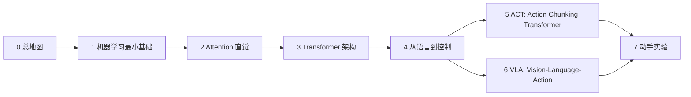

# 从零理解 Transformer、ACT 与 VLA 机器人策略

> 面向机器学习新手的图文并行教程。目标不是“记住公式”，而是能用自己的话解释：
> 1. Transformer 为什么能处理序列、图像 patch、机器人观测与动作；
> 2. ACT 为什么要一次预测一段动作；
> 3. VLA（Vision-Language-Action）模型如何把视觉、语言和控制统一到 Transformer 风格的信息流里。

## 你将获得什么能力

学完后，你应该能回答这些问题：

- Attention 到底在“看”什么？Query / Key / Value 分别像什么？
- 为什么 Transformer 不需要 RNN 也能处理序列？位置编码补了什么？
- Decoder-only、Encoder-only、Encoder-Decoder 的差别是什么？
- ACT 中 Transformer 的输入 token、输出动作块、CVAE latent 分别解决什么问题？
- VLA 中“视觉 token + 语言 token + 动作 token”为什么能放进同一类模型？
- RT-1/RT-2/OpenVLA/Octo/π/GR00T 等路线，哪些地方是 Transformer，哪些地方不是？
- 什么时候应该用 ACT，什么时候应该考虑 VLA foundation model，什么时候应该用 diffusion/flow action head？

## 推荐学习路径



如果你的目标是**快速理解 ACT/VLA**：先读 00、02、04、05、06。  
如果你的目标是**从新手彻底补齐基础**：按顺序读，并完成练习。

## 文件结构

```text
transformer_vla_tutorial/
  README.md                  # 本文件：总入口
  SYLLABUS.md                # 完整课程大纲
  HOW_TO_STUDY.md            # 学习方法与阶段目标
  chapters/                  # 正文讲义
  exercises/                 # 练习与答案
  assets/                    # Mermaid 图、后续可导出为 SVG/PNG
  code/                      # 小型代码实验
  reading_notes/             # 论文阅读路线与笔记模板
```

## 当前已完成的起步内容

- `chapters/00_big_picture.md`：全局地图：Transformer 如何一路走到 ACT/VLA。
- `chapters/01_ml_minimum.md`：机器学习新手需要的最小基础。
- `chapters/02_attention_by_hand.md`：不用深度学习框架，手算 self-attention。
- `chapters/03_transformer_architecture.md`：Transformer 的部件图、信息流和常见变体。
- `chapters/04_from_language_to_control.md`：从序列预测过渡到机器人闭环控制。
- `chapters/05_act_action_chunking.md`：ACT 的核心原理与 Transformer 在其中的角色。
- `chapters/06_vla_transformers.md`：VLA 中 Transformer 的应用范式。
- `code/attention_no_dependencies.py`：无第三方依赖的 attention 小实验。
- `code/numpy_attention.py`：NumPy 版本 attention 小实验；如未安装 NumPy，可先运行无依赖版本。

## 参考论文入口

- Transformer: [Attention Is All You Need](https://arxiv.org/abs/1706.03762)
- ACT / ALOHA: [Learning Fine-Grained Bimanual Manipulation with Low-Cost Hardware](https://arxiv.org/abs/2304.13705)
- RT-1: [Robotics Transformer for Real-World Control at Scale](https://arxiv.org/abs/2212.06817)
- RT-2: [Vision-Language-Action Models Transfer Web Knowledge to Robotic Control](https://arxiv.org/abs/2307.15818)
- OpenVLA: [An Open-Source Vision-Language-Action Model](https://arxiv.org/abs/2406.09246)
- Octo: [An Open-Source Generalist Robot Policy](https://arxiv.org/abs/2405.12213)
