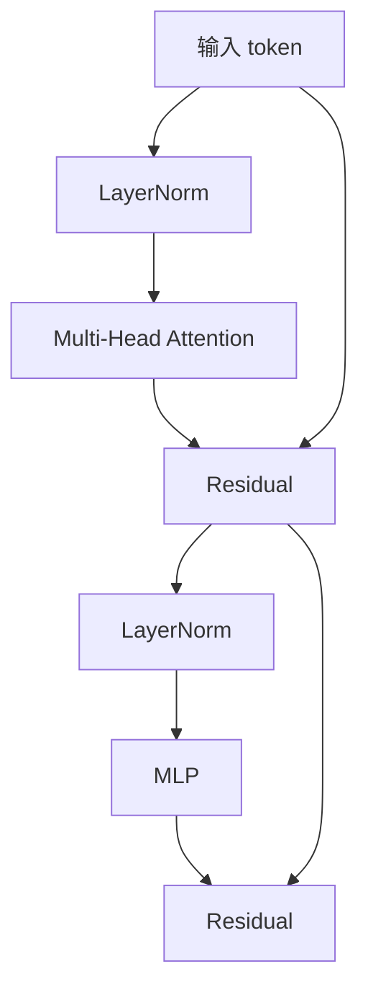
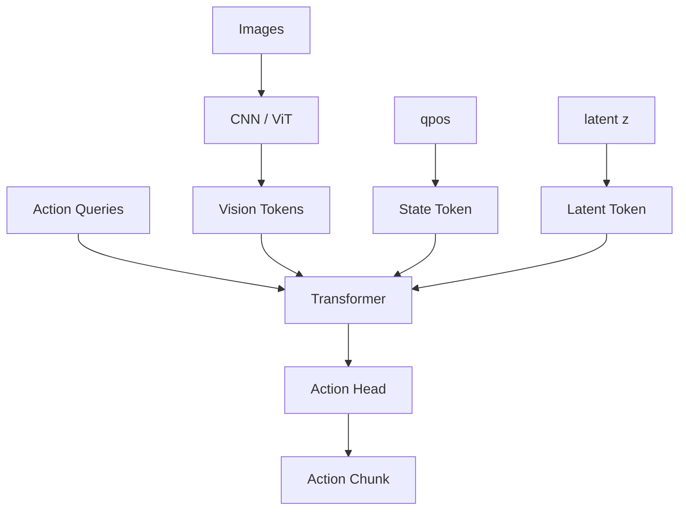
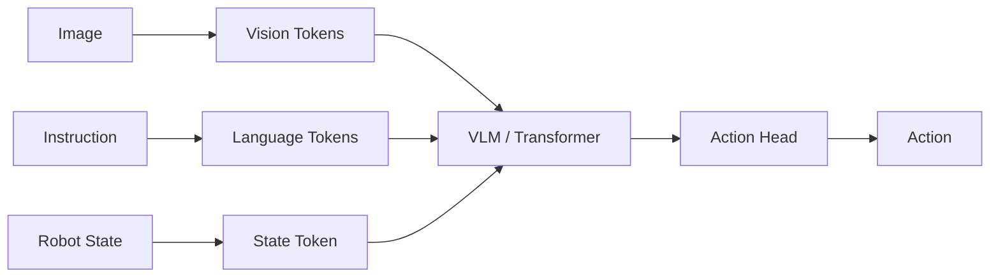

# 图解资产汇总

本文件收集可复用 Mermaid 图。Markdown 预览器支持 Mermaid 时可直接显示。

## Transformer Block

```mermaid
flowchart TD
  X[输入 token] --> LN1[LayerNorm]
  LN1 --> ATT[Multi-Head Attention]
  ATT --> ADD1[Residual]
  X --> ADD1
  ADD1 --> LN2[LayerNorm]
  LN2 --> MLP[MLP]
  MLP --> ADD2[Residual]
  ADD1 --> ADD2
```

## ACT 信息流

```mermaid
flowchart TD
  IMG[Images] --> CNN[CNN / ViT]
  CNN --> VT[Vision Tokens]
  QPOS[qpos] --> ST[State Token]
  Z[latent z] --> ZT[Latent Token]
  AQ[Action Queries] --> TR[Transformer]
  VT --> TR
  ST --> TR
  ZT --> TR
  TR --> HEAD[Action Head]
  HEAD --> CHUNK[Action Chunk]
```

## VLA 信息流

```mermaid
flowchart LR
  IMG[Image] --> VT[Vision Tokens]
  LANG[Instruction] --> LT[Language Tokens]
  ROBOT[Robot State] --> ST[State Token]
  VT --> VLM[VLM / Transformer]
  LT --> VLM
  ST --> VLM
  VLM --> HEAD[Action Head]
  HEAD --> A[Action]
```
