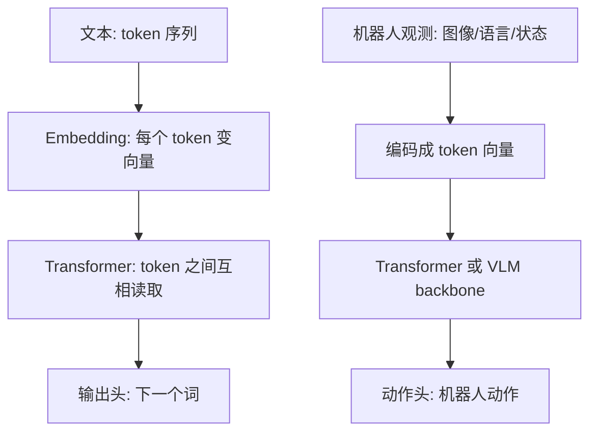
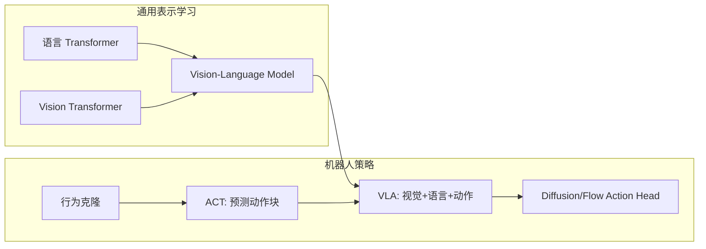

# 00 总地图：Transformer 如何走到 ACT 与 VLA

## 0.1 一句话版本

Transformer 的核心能力是：**让一组 token 互相读取信息，然后为每个 token 生成更有上下文的表示**。

这件事最早在语言里特别成功：

```text
我 / 想 / 拿起 / 红色 / 方块
```

但后来大家发现：图像 patch、机器人状态、历史动作、语言指令也都可以变成 token：

```text
[图像patch1] [图像patch2] ... [语言token] [关节状态token] [历史动作token]
```

所以 Transformer 从“处理句子”扩展到了：

- 图像理解：ViT、VLM
- 模仿学习：ACT、Diffusion Policy 的视觉编码器/条件编码器
- VLA：Vision-Language-Action，把视觉、语言、动作接到一个策略模型中

## 0.2 先建立统一视角：万物皆 token

| 领域 | 原始对象 | token 化方式 | 模型要输出什么 |
|---|---|---|---|
| 机器翻译 | 单词序列 | word/subword token | 目标语言 token |
| 图像分类 | 图片 | patch token | 类别 |
| 机器人 ACT | 图像、关节状态、动作历史 | 视觉特征 token、状态 token、动作查询 token | 未来一段动作 |
| VLA | 图片、语言、机器人状态 | 视觉 token、语言 token、状态 token | 动作 token 或连续动作 |

**关键思想**：Transformer 本身并不关心 token 原来是文字、图片还是机器人状态；它只处理向量。

## 0.3 从语言模型到机器人策略的迁移



语言模型学的是：

```text
给定前文 → 预测下一个词
```

模仿学习策略学的是：

```text
给定当前观测和任务 → 预测下一步动作或未来一段动作
```

它们的形式非常像：

```text
context → output
```

差别在于：

- 文本输出通常是离散 token；
- 机器人动作常常是连续向量，例如末端位姿、关节位置、夹爪开合；
- 机器人需要实时闭环控制，延迟和稳定性非常重要。

## 0.4 ACT 在这个地图中的位置

ACT = Action Chunking Transformer。

它关心的问题是：

> 如果每一帧都单独预测一个动作，机器人可能抖动、短视、对人类示范中的多种可能性很困惑。能不能一次预测未来 k 步动作？

ACT 的核心变化：

```text
普通行为克隆:
  观测_t → 动作_t

ACT:
  观测_t → 动作_t, 动作_t+1, ..., 动作_t+k-1
```

它用 Transformer 来融合：

- 当前图像特征；
- 机器人 proprioception / qpos；
- 动作查询 token；
- 可选的 latent style token。

## 0.5 VLA 在这个地图中的位置

VLA = Vision-Language-Action。

它关心的问题是：

> 能不能让机器人像 VLM 一样理解图像和语言，并把理解结果变成动作？

典型输入输出：

```text
输入:
  图像: 当前相机画面
  语言: "pick up the red cube"
  状态: 机器人关节/夹爪状态

输出:
  机器人动作: Δx, Δy, Δz, Δroll, Δpitch, Δyaw, gripper
```

有些 VLA 把动作离散化为 token：

```text
action_x_bin_13 action_y_bin_7 action_gripper_close
```

有些 VLA 使用连续动作头、diffusion head 或 flow matching action expert。

## 0.6 一张总图



## 0.7 新手最容易误解的地方

### 误解 1：Transformer 只能处理文本

不对。Transformer 处理的是向量序列。文本、图像 patch、机器人状态都可以先变成向量。

### 误解 2：VLA 就等于“大语言模型控制机器人”

不完全对。很多 VLA 使用 VLM/LLM backbone，但真正部署时还需要动作表示、控制频率、低层控制器、安全约束和数据对齐。

### 误解 3：ACT 和 VLA 是互斥路线

不互斥。ACT 是一种很强的动作块模仿学习策略；VLA 是更大的跨模态泛化框架。一个 VLA 也可以借鉴 action chunk、temporal ensemble 或连续动作专家。

## 0.8 思考练习

1. 如果把一张 224×224 图片切成 16×16 patch，一共有多少个 patch token？
2. 机器人 7 维动作向量 `[dx, dy, dz, droll, dpitch, dyaw, gripper]` 和文本 token 最大的区别是什么？
3. 为什么“预测未来 50 步动作”可能比“只预测下一步动作”更稳定？又为什么可能更危险？

答案见 `../exercises/answers_00.md`。
