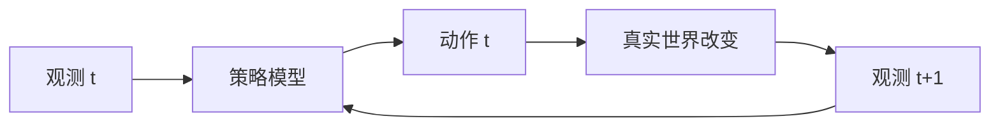

# 01 机器学习新手最小基础

这一章只讲理解 Transformer、ACT、VLA 必须知道的概念。

## 1.1 模型是什么

模型可以先理解成一个函数：

$$
输入 x → 模型 fθ → 输出 y_hat
$$

其中 `θ` 是模型参数，也就是训练中会被调整的数字。

例子：

```text
输入: 一张图 + 指令 "拿起红色方块"
输出: 机器人下一步动作
```

在机器人模仿学习里，模型又常被称为 **policy / 策略**：

$$
policy(observation, task) = action
$$

## 1.2 训练和推理

训练：给模型很多样本，让它减少错误。

```text
专家观测 o_t + 专家动作 a_t
模型预测 a_hat_t
loss = a_hat_t 和 a_t 的差距
更新参数 θ
```

推理/部署：参数固定，用模型输出动作。

$$
当前观测 o_t → 模型 → 动作 a_t → 机器人执行
$$

## 1.3 行为克隆：机器人里的监督学习

行为克隆（Behavior Cloning, BC）就是：

> 看人类或专家怎么做，然后学一个从观测到动作的映射。

数据长这样：

```text
episode 1:
  (image_0, qpos_0, action_0)
  (image_1, qpos_1, action_1)
  ...

episode 2:
  ...
```

模型学的是：

```text
(image_t, qpos_t) → action_t
```

ACT 改成：

```text
(image_t, qpos_t) → action_t:t+k
```

## 1.4 向量、矩阵、张量

### 向量

一个动作可以是向量：

$$
action = [dx, dy, dz, droll, dpitch, dyaw, gripper]
$$

### 矩阵

一个 batch 里有 32 个动作，每个动作 7 维：

$$
shape = [32, 7]
$$

### 三维张量

一个 batch 里有 32 条序列，每条序列 10 个 token，每个 token 512 维：

$$
shape = [32, 10, 512]
$$

Transformer 最常见的输入形状就是：

```text
[batch_size, sequence_length, hidden_dim]
```

## 1.5 线性层：把一种向量变成另一种向量

线性层可以理解为：

$$
新向量 = 旧向量 × 权重矩阵 + 偏置
$$

例如把 7 维机器人状态变成 512 维 token embedding：

```text
qpos: [7]
Linear(7, 512)
state_token: [512]
```

## 1.6 softmax：把分数变成权重

Attention 里经常会得到一组分数：

```text
[2.0, 1.0, 0.1]
```

softmax 会把它变成总和为 1 的权重：

```text
[0.66, 0.24, 0.10]
```

直觉：分数越高，权重越大，但不是 winner-take-all。

## 1.7 loss：模型错得有多离谱

连续动作常用 L1 或 L2 loss：

```text
L1: |预测动作 - 专家动作|
L2: (预测动作 - 专家动作)^2
```

如果输出是离散 action token，就可以用分类交叉熵 loss。

## 1.8 为什么机器人比普通图像分类难

图像分类错一次只是标签错了；机器人动作错了会改变下一帧观测。



这叫闭环。错误会累积。

## 1.9 思考练习

1. 如果输入是 `[batch=8, seq=20, hidden=512]`，一共有多少个 token？每个 token 几维？
2. 为什么把 7 维 qpos 投影到 512 维后，就可以和语言 token 或图像 token 放在一起？
3. 行为克隆和人类“看老师演示然后模仿”有什么相似点？有什么不同点？

答案见 `../exercises/answers_01.md`。
