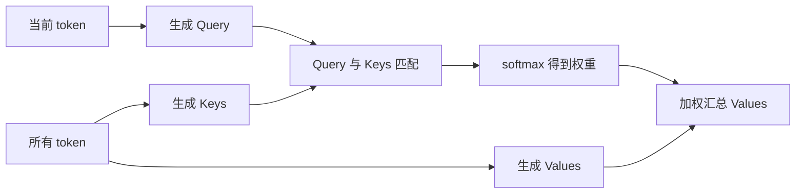
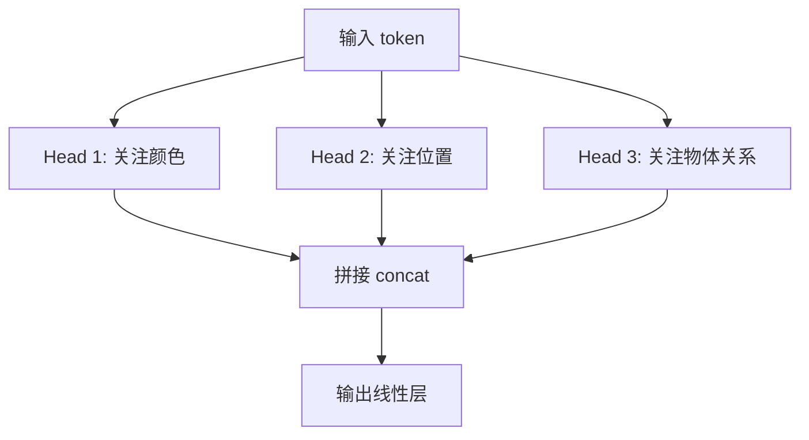

# 02 Attention 直觉与手算

## 2.1 Attention 的一句话解释

Attention 做的事情是：

> 对每个 token，问“我现在需要从其他 token 那里读取多少信息？”然后按权重汇总。

把它想成查资料：

- Query：我想问什么？
- Key：每份资料的索引/标签是什么？
- Value：每份资料真正包含的内容是什么？



## 2.2 为什么不直接平均所有 token？

因为不同 token 的重要性不同。

句子：

```text
机器人 把 红色 方块 放到 盒子里
```

当模型处理“放到”时，可能更关心：

- 要放什么？红色方块；
- 放到哪里？盒子里；
- 谁来放？机器人。

平均所有 token 会丢失重点。Attention 用可学习的匹配分数决定重点。

## 2.3 Self-attention 的公式

设输入 token 矩阵为 `X`。

通过三个线性层得到：

$$
Q = X W_Q
K = X W_K
V = X W_V
$$

然后：

$$
Attention(Q,K,V) = softmax(Q K^T / sqrt(d_k)) V
$$

你不需要一开始记住公式，只要记住这条流程：

$$
每个 token 提问 → 和所有 token 匹配 → 得到权重 → 加权读取内容
$$

## 2.4 一个 3-token 手算例子

假设有 3 个 token：

$$
A = "红色"
B = "方块"
C = "盒子"
$$

为了简单，假设每个 token 的 Q/K/V 都是一维数字：

| token | Q | K | V |
|---|---:|---:|---:|
| A 红色 | 1 | 1 | 10 |
| B 方块 | 2 | 2 | 20 |
| C 盒子 | 1 | 0 | 30 |

现在看 B token 的输出。

B 的 Query 是 2。它和所有 Key 做乘法：

$$
score(B→A) = 2 × 1 = 2
score(B→B) = 2 × 2 = 4
score(B→C) = 2 × 0 = 0
$$

softmax 后大概是：

```text
[0.12, 0.87, 0.02]
```

于是 B 读取的内容是：

$$
0.12 × 10 + 0.87 × 20 + 0.02 × 30 ≈ 19.2
$$

这表示 B 主要读取自己，也少量读取 A 和 C。

## 2.5 scaled 是为什么

如果向量维度很大，`QK^T` 的数值可能变得很大，softmax 会过于尖锐：最大值接近 1，其余接近 0。除以 `sqrt(d_k)` 可以让训练更稳定。

## 2.6 Multi-head attention 是什么

一个 attention head 只能用一种匹配方式看世界。多头就是让模型从多个角度看：



注意：上图的“颜色/位置/关系”只是直觉解释，不是训练时人工指定的。模型自己学。

## 2.7 Mask：不允许看未来

语言模型预测下一个词时，不能偷看未来词。

```text
我 想 拿起 [MASK]
```

Decoder-only Transformer 用 causal mask：

```text
token 1 只能看 token 1
token 2 能看 token 1-2
token 3 能看 token 1-3
```

机器人控制里也常有类似约束：训练时不能让模型看到未来观测，否则部署时用不了。

## 2.8 Cross-attention：从另一个序列读信息

Self-attention：同一组 token 内部互相看。  
Cross-attention：一组 token 去看另一组 token。

在 ACT 中可以理解为：

$$
动作查询 token  →  cross-attend  →  图像/状态 token
$$

意思是：每个未来时间步的动作查询，都从当前观测中读取需要的信息。

## 2.9 思考练习

1. 如果某个 token 的 attention 权重是 `[0.7, 0.2, 0.1]`，对应 Value 是 `[10, 20, 50]`，输出是多少？
2. Q/K/V 中，哪一个更像“我要找什么”？哪一个更像“我有什么标签”？哪一个更像“实际内容”？
3. 为什么机器人策略不能在部署时 attention 到未来图像？
4. Multi-head attention 比 single-head attention 多了什么表达能力？

答案见 `../exercises/answers_02.md`。
