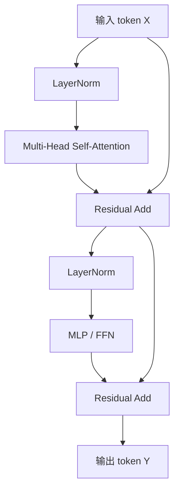
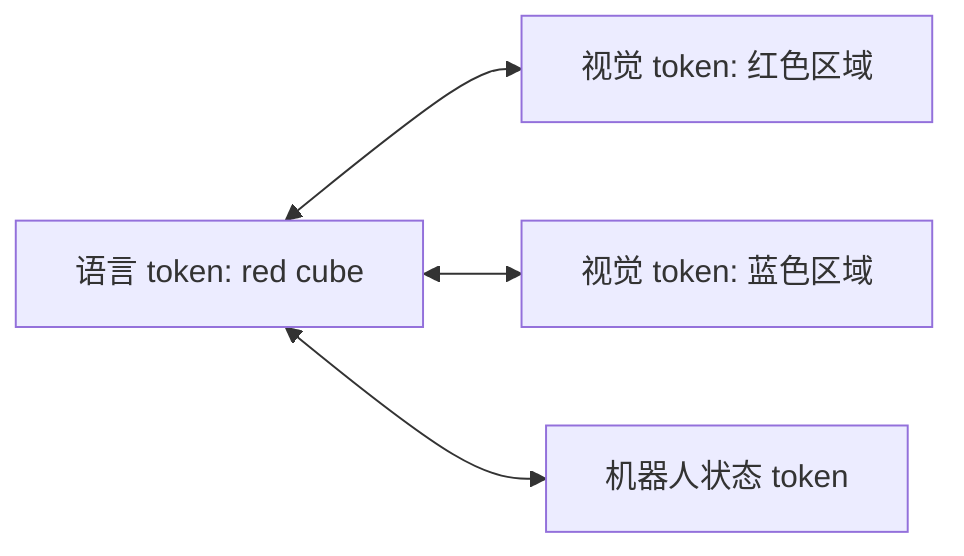

# 03 Transformer 架构：从部件到信息流

## 3.1 Transformer block 的总图

一个典型 Transformer block：



每个 block 不改变基本形状：

```text
[batch, seq_len, hidden_dim] → [batch, seq_len, hidden_dim]
```

它改变的是每个 token 的内容：每个 token 变得更“知道上下文”。

## 3.2 Token embedding

Transformer 不能直接处理文字或图像，它处理向量。

文本：

$$
"red" → token id 1354 → embedding 向量 [0.1, -0.3, ...]
$$

图像：

$$
图片 → 切 patch → 每个 patch 线性投影成 embedding
$$

机器人状态：

$$
qpos [7维] → Linear → state embedding [512维]
$$

## 3.3 位置编码：否则模型不知道顺序

Self-attention 本身对顺序不敏感。也就是说，如果没有位置编码，这两个序列在模型眼里很难区分：

```text
机器人 拿 方块
方块 拿 机器人
```

所以要加入位置编码：

```text
token_embedding + position_embedding
```

在机器人里，位置编码也可以表示：

- 第几个图像 patch；
- 历史第几帧；
- 未来动作块中的第几个动作；
- 左臂 token / 右臂 token 的身份编码。

## 3.4 Attention 层负责信息交换

Attention 是 token 之间交流的地方。

例子：VLA 中语言 token 和图像 token 交流：



经过训练后，模型可能学到：语言里的 “red cube” 应该和图像中的红色方块区域强相关。

## 3.5 MLP / FFN 层负责逐 token 变换

Attention 混合不同 token 的信息；MLP 对每个 token 单独做非线性变换。

简化理解：

```text
Attention: token 之间交流
MLP: 每个 token 自己思考
```

## 3.6 Residual connection 为什么重要

Residual 是：

$$
输出 = 输入 + 模块处理结果
$$

它的好处：

- 让深层网络更容易训练；
- 如果某层暂时没学好，至少可以保留原输入；
- 梯度更容易传回前面层。

## 3.7 LayerNorm 为什么重要

LayerNorm 会把每个 token 的 hidden 向量规范化，让数值尺度更稳定。深层 Transformer 如果没有 normalization，训练容易不稳定。

## 3.8 三类常见 Transformer

### Encoder-only

代表：BERT、ViT encoder。

特点：所有 token 可以互相看。

适合：理解、分类、特征提取。

```text
输入全部给定 → 输出上下文表示
```

### Decoder-only

代表：GPT 类模型。

特点：causal mask，只能看过去。

适合：自回归生成。

```text
前文 → 下一个 token
```

### Encoder-Decoder

代表：原始机器翻译 Transformer、一些 seq2seq 模型。

特点：encoder 理解输入，decoder 生成输出。

$$
源序列 → encoder → decoder → 目标序列
$$

## 3.9 ACT 更像哪一种？

ACT 的具体实现可能有差异，但思想上常见结构是：

- CNN/视觉 backbone 编码图像；
- Transformer encoder/decoder 融合图像、状态、动作查询；
- 输出未来动作块。

可以把动作查询 token 想成：

```text
第 1 个未来动作要问当前观测什么？
第 2 个未来动作要问当前观测什么？
...
```

## 3.10 VLA 更像哪一种？

VLA 没有唯一架构，常见方式有：

1. VLM backbone 读图像和语言，再接动作头；
2. 把动作离散化，像生成文字一样生成 action token；
3. 使用 Transformer 融合多模态上下文，再用 diffusion/flow 输出连续动作。

所以不要问“VLA 是不是 Transformer”，更准确的问题是：

> 这个 VLA 的哪些部分是 Transformer？它如何表示动作？动作头是离散分类、连续回归、diffusion，还是 flow matching？

## 3.11 思考练习

1. Transformer block 中 attention 和 MLP 分工有什么不同？
2. 为什么位置编码对语言和机器人动作块都重要？
3. Encoder-only 和 decoder-only 的核心差异是什么？
4. 一个 VLA 如果用 LLM backbone，但动作头是 diffusion，它还算不算 Transformer-based？为什么？

答案见 `../exercises/answers_03.md`。
