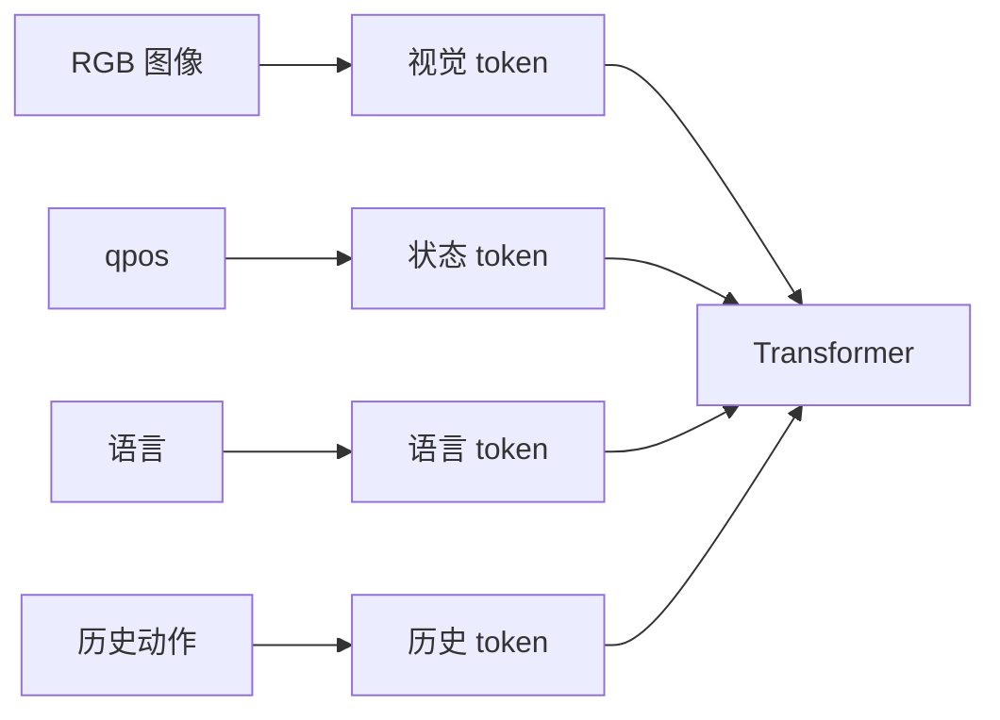
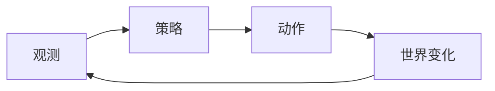

# 04 从语言序列到机器人控制

> 本章是连接桥：前面讲 Transformer 如何处理 token，后面讲 ACT/VLA 如何把 token 变成机器人动作。

## 4.1 控制问题也可以写成条件预测

语言模型：

```text
前文 context → 下一个词 token
```

机器人策略：

```text
观测 observation + 任务 task → 动作 action
```

统一写法：

```text
条件信息 context → 目标输出 output
```

## 4.2 机器人观测里有什么

常见观测：

- RGB 图像；
- 深度图；
- 关节角 qpos；
- 关节速度；
- 夹爪状态；
- 历史动作；
- 语言指令；
- 目标图像或 goal state。

它们可以被编码为 token：



## 4.3 动作是什么

机器人动作不是一种固定格式。常见有：

| 动作类型 | 例子 | 特点 |
|---|---|---|
| 关节位置 | 每个关节目标角度 | 贴近机器人本体 |
| 关节速度 | 每个关节速度 | 需要稳定控制 |
| 末端位姿增量 | dx, dy, dz, droll, dpitch, dyaw | 常用于操作任务 |
| 夹爪命令 | open/close 或连续宽度 | 常与位姿一起输出 |
| 动作 token | 离散化后的动作 ID | 方便接入语言模型范式 |

## 4.4 闭环控制和开环片段

闭环：每执行一步，就重新看世界。



开环片段：一次预测多步，连续执行一段。

ACT 介于两者之间：它预测动作块，但通常会不断重规划，并对重叠动作做 temporal ensembling。

## 4.5 为什么控制比文本生成更敏感

文本生成错一个词，后面还能改；机器人动作错一步，可能导致：

- 物体被碰走；
- 夹爪错过目标；
- 机器人进入训练数据外状态；
- 发生碰撞或损坏。

所以机器人策略特别关心：

- 动作平滑；
- 控制频率；
- 安全边界；
- 观测延迟；
- 分布外恢复。

## 4.6 思考练习

1. 为什么机器人状态 qpos 对策略很重要？只看图像不行吗？
2. “动作 token 化”带来了什么好处和坏处？
3. ACT 的动作块是完全开环吗？为什么？

答案见 `../exercises/answers_04.md`。
