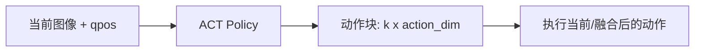
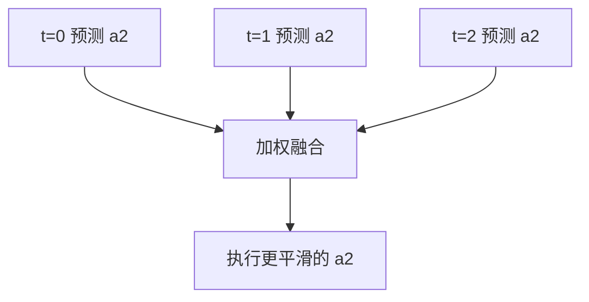
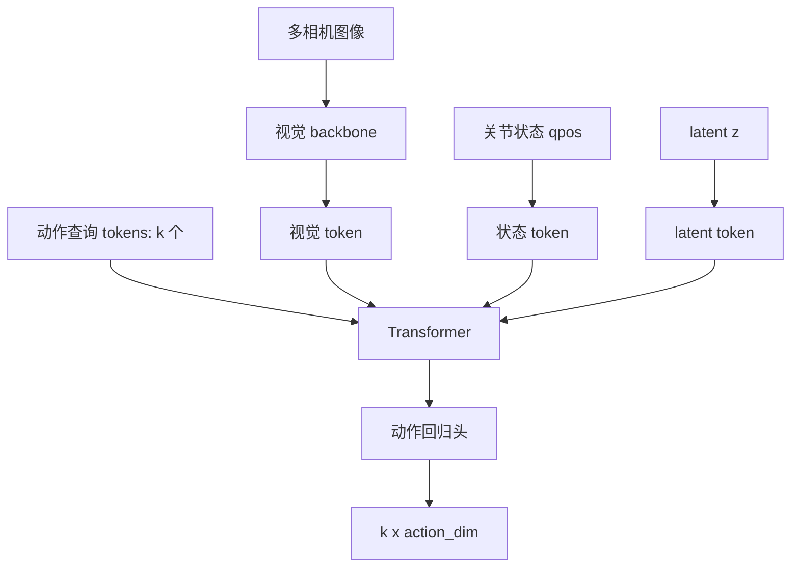

# 05 ACT：Action Chunking Transformer

## 5.1 ACT 要解决什么问题

普通行为克隆常常学：

```text
当前观测 o_t → 当前动作 a_t
```

这会遇到几个问题：

1. **短视**：只看下一步，不显式规划一小段动作。
2. **抖动**：每一帧重新预测，预测误差会造成动作不连续。
3. **多模态示范**：同一个观测下，人类可能有多种合理动作，模型平均后可能得到“不像任何一种策略”的动作。

ACT 的核心想法：

```text
当前观测 o_t → 未来 k 步动作 a_t, a_t+1, ..., a_t+k-1
```

这叫 action chunking。

## 5.2 动作块是什么

假设动作维度是 14，表示双臂每只手 7 维：

$$
a_t = [left_7_dims, right_7_dims]
$$

如果 chunk size = 50，那么 ACT 输出：

```text
[50, 14]
```

也就是未来 50 个控制步的双臂动作。



## 5.3 为什么动作块会更稳定

普通 BC 每一帧都独立预测：

$$
t=0: 预测 a0
t=1: 预测 a1
t=2: 预测 a2
$$

ACT 在相邻时刻会产生重叠的未来预测：

$$
t=0: [a0, a1, a2, a3]
t=1:     [a1, a2, a3, a4]
t=2:         [a2, a3, a4, a5]
$$

对于同一个实际时间步 `a2`，可能有多个预测来源。Temporal ensembling 会把它们加权平均，使动作更平滑。



## 5.4 ACT 为什么用 CVAE

人类示范可能是多模态的。

例如同样要打开抽屉：

- 有人先微调左手；
- 有人先移动右手；
- 有人从稍高位置接近；
- 有人从稍低位置接近。

如果模型只用 L2 loss 拟合，可能会平均出一个奇怪动作。

CVAE 加入 latent variable `z`：

```text
z 表示这次示范的风格/模式
观测 + z → 动作块
```

训练时 encoder 从真实动作块推断 `z`；推理时通常从先验取 `z` 或使用固定/均值策略。

## 5.5 ACT 中 Transformer 到底做什么

一种直觉化的信息流：



动作查询 token 可以理解为：

```text
query_0: 请告诉我未来第 0 步该做什么
query_1: 请告诉我未来第 1 步该做什么
...
query_k-1: 请告诉我未来第 k-1 步该做什么
```

Transformer 让这些 query 从视觉、状态、latent 中读取信息。

## 5.6 ACT 训练时的输入输出

训练样本：

```text
输入:
  当前图像 image_t
  当前 qpos_t
  未来专家动作块 action_t:t+k

模型:
  CVAE encoder 根据 action chunk 推断 z
  policy decoder 根据 image/qpos/z 预测 action chunk

loss:
  action reconstruction loss + KL loss
```

简化公式：

$$
loss = L1(pred_action_chunk, expert_action_chunk) + β * KL(q(z|action) || p(z))
$$

## 5.7 ACT 推理时的输入输出

部署时没有未来专家动作，所以不能用真实 action chunk 编码 `z`。

推理：

```text
当前图像 image_t
当前 qpos_t
z 从先验或固定值获得
→ 预测未来 k 步动作
→ temporal ensemble
→ 执行动作
```

## 5.8 ACT 与普通 Transformer 的差异

| 问题 | 语言 Transformer | ACT |
|---|---|---|
| 输入 | 文本 token | 图像、qpos、latent、query token |
| 输出 | 下一个词或文本序列 | 连续动作块 |
| loss | 交叉熵 | L1/L2 + KL |
| 部署 | 生成文本 | 实时控制机器人 |
| 风险 | 语义错误 | 物理碰撞、任务失败 |

## 5.9 ACT 适合什么任务

适合：

- 相对固定的任务；
- 数据量不算巨大；
- 需要高精度连续控制；
- 双臂遥操作数据；
- 任务阶段较明确，例如拿、对齐、插入、放置。

不一定适合：

- 语言开放集任务；
- 物体/场景变化极大；
- 需要大量语义常识；
- 长程规划；
- 从互联网知识迁移到机器人动作。

## 5.10 和 VLA 的关系

ACT 更像“强 imitation policy”。  
VLA 更像“视觉语言理解 + 动作生成的通用策略”。

但二者可以结合：

```text
VLA backbone 理解任务和场景
ACT-style action chunk head 输出短期高频动作
```

## 5.11 思考练习

1. 如果 action_dim=14，chunk_size=100，ACT 每次输出多少个数字？
2. 为什么 temporal ensembling 可以减小抖动？
3. CVAE latent `z` 解决的是哪类问题？
4. 如果任务需要听懂“把杯子放到昨天你看到的那个蓝色盘子旁边”，ACT 会遇到什么困难？

答案见 `../exercises/answers_05.md`。
