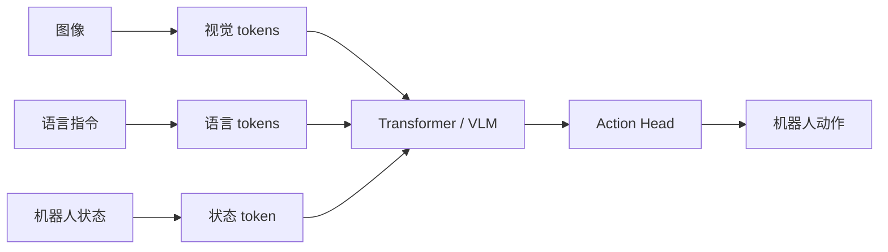

# 06 VLA：Vision-Language-Action 中 Transformer 如何工作

## 6.1 VLA 是什么

VLA = Vision-Language-Action。

它希望模型能同时处理：

```text
Vision: 当前看到什么？
Language: 人类想让我做什么？
Action: 我接下来怎么动？
```

典型形式：

```text
(image, instruction, robot_state) → action
```

## 6.2 VLA 的统一 token 视角



关键不是“把所有东西硬塞进同一个序列”这么简单，而是：

- 视觉 token 要保留空间信息；
- 语言 token 要保留任务语义；
- 状态 token 要告诉模型机器人自身在哪里；
- 动作头要匹配真实控制接口。

## 6.3 动作表示的几种方式

### 方式 A：连续动作回归

```text
输出: [dx, dy, dz, droll, dpitch, dyaw, gripper]
loss: L1 / L2
```

优点：直接、适合精细控制。  
缺点：多模态动作容易被平均。

### 方式 B：离散 action token

把连续动作分桶：

$$
dx = bin_13
dy = bin_07
gripper = close
$$

然后像语言模型一样生成动作 token。

优点：能复用语言模型生成范式。  
缺点：离散化精度、频率、平滑性都要仔细处理。

### 方式 C：Diffusion / Flow action head

模型不是一次回归动作，而是从噪声逐步生成动作轨迹，或用 flow matching 生成动作。

优点：更适合多模态连续动作分布。  
缺点：推理成本、工程复杂度更高。

## 6.4 RT-1：机器人数据上的 Transformer policy

RT-1 的代表性思想是：

- 在大规模真实机器人数据上训练；
- 输入图像和语言指令；
- 用 Transformer 风格模型输出离散化后的动作维度。

它说明：如果机器人数据足够多，Transformer policy 可以学习跨任务的行为模式。

## 6.5 RT-2：把 VLM 知识迁移到机器人动作

RT-2 的关键思想是：

> 把互联网规模视觉语言模型中的语义知识，迁移到机器人控制。

它把动作也表示成类似 token 的形式，使模型可以在视觉语言推理和动作输出之间共享生成框架。

直觉例子：

```text
语言/视觉知识: 知道什么是垃圾、什么是可乐罐
机器人动作: 把可乐罐移动到垃圾桶
```

## 6.6 OpenVLA：开源 VLA 的典型形态

OpenVLA 代表了一类开源 VLA：

```text
视觉编码器 + 语言模型 backbone + action tokenizer/head
```

对学习者来说，读 OpenVLA 时重点看四件事：

1. 图像如何变成 token？
2. 语言指令如何输入？
3. 机器人动作如何表示？
4. 训练数据来自哪些机器人和任务？

## 6.7 Octo：Generalist Robot Policy

Octo 关注的是通用机器人策略：

- 多任务；
- 多机器人 embodiment；
- 多种观测和动作空间；
- 通过 goal / language / observation conditioning 控制行为。

它提醒我们：VLA 不只是模型结构问题，更是数据混合、任务条件、机器人接口标准化问题。

## 6.8 π、GR00T 类路线：VLM backbone + action expert

一些新路线不满足于“LLM 直接吐动作 token”，而是采用：

```text
强 VLM backbone 负责理解
专门 action expert 负责连续控制
```

原因很现实：

- 机器人动作是连续且高频的；
- 精细操作需要平滑轨迹；
- 语言模型的离散 token 生成并不天然适合所有控制问题；
- action expert 可以用 diffusion/flow/chunking 等更适合控制的方式。

## 6.9 VLA 中 Transformer 的几种角色

| 角色 | 做什么 | 例子 |
|---|---|---|
| 视觉编码器 | 把图像变成视觉 token | ViT |
| 语言模型 | 理解指令和常识 | LLM/VLM backbone |
| 跨模态融合器 | 让视觉、语言、状态互相 attention | multimodal Transformer |
| 动作生成器 | 生成 action token 或动作块 | RT-style action token |
| 条件编码器 | 为 diffusion/flow action head 提供条件 | VLM + action expert |

## 6.10 读任何 VLA 论文的五个问题

1. 输入模态是什么？单图、多图、视频、语言、状态？
2. 动作空间是什么？关节、末端、离散 token、轨迹？
3. Transformer 在哪里？视觉、语言、融合、动作生成？
4. 训练数据是什么？真实机器人、仿真、互联网图文、混合数据？
5. 部署频率和控制接口是什么？高层规划还是低层控制？

## 6.11 ACT vs VLA：如何选择

| 场景 | 更可能优先选择 |
|---|---|
| 固定双臂精细操作，数据来自遥操作 | ACT |
| 需要语言泛化和语义常识 | VLA |
| 数据很少、任务单一 | ACT 或小型 BC |
| 多任务、多场景、多 embodiment | VLA / generalist policy |
| 动作高度多模态且连续 | diffusion/flow head，可与 VLA 结合 |
| 需要高频稳定控制 | ACT-style chunking 或专用低层控制器 |

## 6.12 思考练习

1. 为什么 VLA 不能只关心“模型大不大”，还要关心动作表示？
2. 离散 action token 和连续动作回归各有什么风险？
3. 如果一个模型用 VLM 理解图像和语言，再用 diffusion 输出动作，它的 Transformer 主要在哪里发挥作用？
4. 对双臂插拔任务，ACT 和 VLA 各自的优势是什么？

答案见 `../exercises/answers_06.md`。
