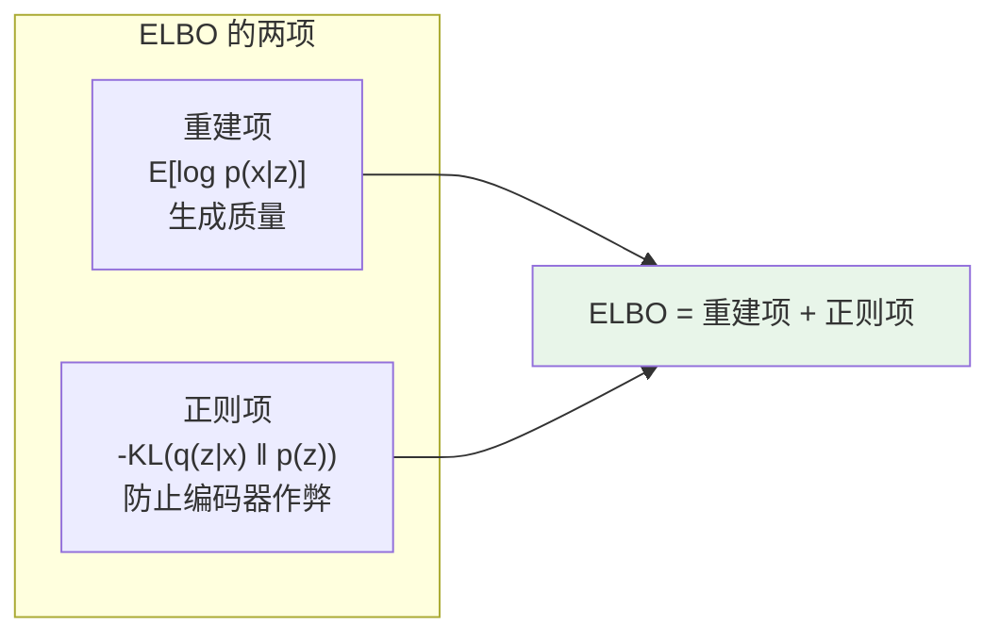
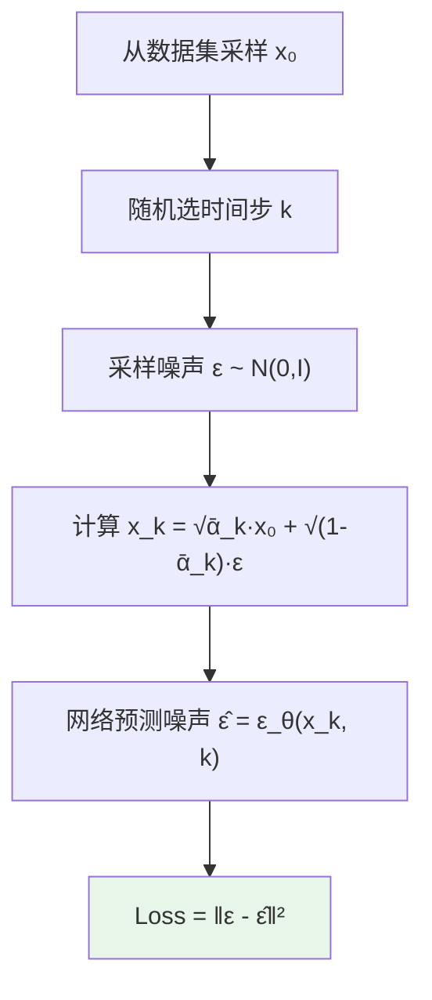
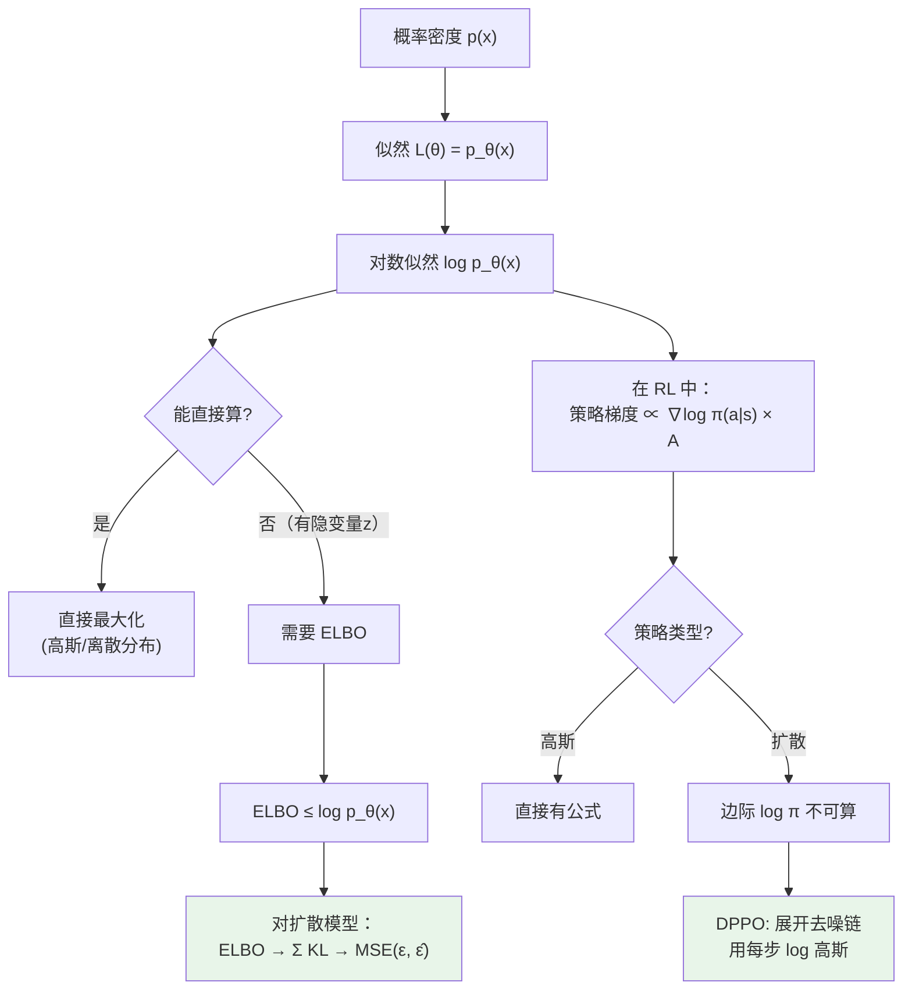

# 前置知识：对数似然、KL 散度与变分下界（ELBO）

> **为什么要读这篇**：扩散模型（DDPM）的训练目标本质上来自变分下界。DPPO 要算"策略的对数概率"来做梯度更新。不把似然、KL、ELBO 这几个概念彻底搞透，后面的推导全是天书。  
> **目标**：从最基础的概率概念出发，一路推到扩散模型的训练 loss 为什么是"预测噪声的 MSE"。

**标签**: `#前置知识` `#概率论` `#对数似然` `#KL散度` `#ELBO` `#变分推断` `#扩散模型推导`

**知识链接**：
- [扩散模型 DDPM](./000b_前置知识_扩散模型DDPM) — ELBO 最终推出 DDPM 训练 loss
- [Diffusion Policy](./000c_前置知识_Diffusion_Policy) — 理解策略的概率含义
- [为什么扩散策略难以 RL 微调](./000f_前置知识_为什么扩散策略难以RL微调) — log π 不可算的根源在这里
- [策略梯度与 PPO](./000a_前置知识_策略梯度与PPO) — 策略梯度需要 log π

---

## 第一部分：概率密度与似然

### 1.1 什么是概率密度函数

假设你有一个随机变量 $x$，它的值是连续的（比如一个人的身高）。概率密度函数 $p(x)$ 告诉你：$x$ 取某个值附近的"可能性有多大"。

- $p(170\text{cm}) = 0.05$ → 身高在 170cm 附近的概率密度是 0.05
- $p(250\text{cm}) \approx 0$ → 身高在 250cm 附近几乎不可能

**重要澄清**：$p(x)$ 本身不是概率！概率是 $p(x)\,\mathrm{d}x$，即密度乘以一小段区间。但我们日常说"$p(x)$ 大"就意味着"$x$ 这个值更可能出现"。

### 1.2 什么是似然（Likelihood）

假设你有一个模型（比如一个神经网络），它有参数 $\theta$。这个模型定义了一个概率分布 $p_\theta(x)$。

现在你观察到了一个真实的数据点 $x_0$。**似然（Likelihood）就是"在参数 $\theta$ 下，观察到 $x_0$ 的可能性"**：

$$
L(\theta) = p_\theta(x_0)
$$

似然越大，说明模型越能"解释"这个数据。比如模型 A 给出 $p_A(x_0) = 0.8$（认为 $x_0$ 很正常），模型 B 给出 $p_B(x_0) = 0.001$（认为 $x_0$ 几乎不可能），那模型 A 的似然更高，更好地解释了数据。

### 1.3 最大似然估计（MLE）

训练模型的目标：找到参数 $\theta$，让模型对训练数据的似然最大。

如果有 $N$ 个独立的训练样本 $x_1, x_2, \ldots, x_N$，总似然是连乘：

$$
L(\theta) = \prod_{i=1}^N p_\theta(x_i)
$$

连乘数值极小容易下溢。取对数把连乘变成求和：

$$
\ell(\theta) = \sum_{i=1}^N \log p_\theta(x_i)
$$

**最大化对数似然 = 让模型尽可能认为训练数据是"高概率的"。**

---

## 第二部分：为什么要取对数

### 2.1 数学上的便利

| | 原始似然 | 对数似然 |
|---|---|---|
| 公式 | $L(\theta) = \prod_i p_\theta(x_i)$ | $\ell(\theta) = \sum_i \log p_\theta(x_i)$ |
| 运算 | 连乘 | 求和 |
| 数值 | 极小，容易下溢 | 稳定，好优化 |

因为 $\log$ 是单调递增函数：最大化 $L(\theta)$ 和最大化 $\log L(\theta)$ 找到的 $\theta$ 完全一样。

### 2.2 对数似然的直觉

$\log p_\theta(x)$ 可以理解为"模型给数据 $x$ 打的分"：

| $\log p_\theta(x)$ | $p_\theta(x)$ | 含义 |
|---|---|---|
| $0$ | $1$ | 模型认为 $x$ 确定会出现 |
| $-1$ | $\approx 0.37$ | 模型觉得 $x$ 还行 |
| $-10$ | $\approx 4.5\times10^{-5}$ | 模型觉得 $x$ 极不可能 |
| $-\infty$ | $0$ | 模型认为 $x$ 不可能出现 |

训练目标就是让 $\log p_\theta(x)$ 对所有训练数据尽可能大（接近 0，而不是很负）。

### 2.3 负对数似然 = 交叉熵损失

在深度学习中常见的 loss：

$$
\text{Loss} = -\log p_\theta(x)
$$

最小化 loss = 最大化对数似然。这就是分类任务中交叉熵损失的由来。

---

## 第三部分：隐变量模型与边际似然

### 3.1 什么是隐变量

有些模型里，除了观测到的数据 $\mathbf{x}$，还有一些我们**看不到的**中间变量 $\mathbf{z}$。

**VAE 的例子**：$\mathbf{z}$ 是低维向量（如 128 维），代表图片的"风格/内容"；$\mathbf{x}$ 是实际图片。生成过程是先采样 $\mathbf{z}$，再根据 $\mathbf{z}$ 生成 $\mathbf{x}$。

**扩散模型的例子**：$\mathbf{z} = \{\mathbf{x}_1, \mathbf{x}_2, \ldots, \mathbf{x}_K\}$ 是所有中间去噪状态；$\mathbf{x} = \mathbf{x}_0$ 是最终干净数据。生成过程是 $\mathbf{x}_K$（纯噪声）→ $\mathbf{x}_{K-1}$ → ... → $\mathbf{x}_0$。

### 3.2 边际似然（Marginal Likelihood）

我们想计算 $p_\theta(\mathbf{x})$——模型认为数据 $\mathbf{x}$ 有多可能。但模型里有隐变量 $\mathbf{z}$，需要把 $\mathbf{z}$ "积掉"：

$$
p_\theta(\mathbf{x}) = \int p_\theta(\mathbf{x}, \mathbf{z})\,\mathrm{d}\mathbf{z} = \int p_\theta(\mathbf{x}|\mathbf{z})\, p(\mathbf{z})\,\mathrm{d}\mathbf{z}
$$

其中 $p_\theta(\mathbf{x}|\mathbf{z})$ 是解码器/生成器，$p(\mathbf{z})$ 是先验（通常为 $\mathcal{N}(\mathbf{0}, \mathbf{I})$）。

### 3.3 为什么边际似然难算

这个积分在绝大多数深度学习模型中**无法解析计算**。$\mathbf{z}$ 是高维的（如 128 维），$p_\theta(\mathbf{x}|\mathbf{z})$ 是复杂的神经网络，在 128 维空间上做积分是不可能穷举的。

**这就是为什么我们需要变分下界（ELBO）——因为 $\log p_\theta(\mathbf{x})$ 算不出来，我们需要一个能算的替代品。**

---

## 第四部分：KL 散度

### 4.1 KL 散度是什么

KL 散度衡量**两个概率分布之间的"距离"**（严格说是"差异"，因为它不对称）。

$$
\mathrm{KL}(q \,\|\, p) = \text{用 } q \text{ 的视角来看，} q \text{ 和 } p \text{ 之间有多不同}
$$

### 4.2 公式

对于连续分布：

$$
\mathrm{KL}\big(q(\mathbf{z}) \,\|\, p(\mathbf{z})\big) = \int q(\mathbf{z}) \log \frac{q(\mathbf{z})}{p(\mathbf{z})}\,\mathrm{d}\mathbf{z} = \mathbb{E}_{\mathbf{z}\sim q}\!\left[\log q(\mathbf{z}) - \log p(\mathbf{z})\right]
$$

含义：从 $q$ 中采样 $\mathbf{z}$，然后计算"$q$ 在这里比 $p$ 高出多少（对数比）"的平均值。

### 4.3 关键性质

$$
\mathrm{KL}(q \,\|\, p) \geq 0 \qquad \text{（永远非负，等号当且仅当 } q = p\text{）}
$$

这个性质是推导 ELBO 的关键数学基础。

### 4.4 两个高斯之间的 KL

如果 $q = \mathcal{N}(\mu_1, \sigma_1^2)$，$p = \mathcal{N}(\mu_2, \sigma_2^2)$：

$$
\mathrm{KL}(q \,\|\, p) = \log\frac{\sigma_2}{\sigma_1} + \frac{\sigma_1^2 + (\mu_1 - \mu_2)^2}{2\sigma_2^2} - \frac{1}{2}
$$

特别地，如果 $p = \mathcal{N}(0, 1)$：

$$
\mathrm{KL}\big(\mathcal{N}(\mu, \sigma^2) \,\|\, \mathcal{N}(0,1)\big) = -\frac{1}{2}\left(1 + \log\sigma^2 - \mu^2 - \sigma^2\right)
$$

这就是 VAE 中 KL loss 那一项的由来。

---

## 第五部分：变分下界（ELBO）的推导

这是整篇最核心的部分。

### 5.1 出发点

我们想最大化 $\log p_\theta(\mathbf{x})$，但它因为隐变量积分而算不出来。

### 5.2 引入辅助分布

引入一个**可以自由选择**的分布 $q_\phi(\mathbf{z}|\mathbf{x})$（参数为 $\phi$），称为**近似后验**。它的作用是近似真实后验 $p_\theta(\mathbf{z}|\mathbf{x})$——即给定数据 $\mathbf{x}$ 后，隐变量 $\mathbf{z}$ 最可能的分布。

### 5.3 逐步推导

**第一步**：利用 $\int q(\mathbf{z}|\mathbf{x})\,\mathrm{d}\mathbf{z} = 1$，把常数 $\log p_\theta(\mathbf{x})$ 写成期望形式（常数乘以 1 还是常数）：

$$
\log p_\theta(\mathbf{x}) = \mathbb{E}_{\mathbf{z}\sim q(\mathbf{z}|\mathbf{x})}\!\left[\log p_\theta(\mathbf{x})\right]
$$

**第二步**：用贝叶斯公式 $p_\theta(\mathbf{x}) = p_\theta(\mathbf{x},\mathbf{z})\,/\,p_\theta(\mathbf{z}|\mathbf{x})$ 展开：

$$
\log p_\theta(\mathbf{x}) = \mathbb{E}_{\mathbf{z}\sim q}\!\left[\log p_\theta(\mathbf{x},\mathbf{z}) - \log p_\theta(\mathbf{z}|\mathbf{x})\right]
$$

**第三步**：加减 $\log q(\mathbf{z}|\mathbf{x})$（不改变总量），然后拆成两部分：

$$
\log p_\theta(\mathbf{x}) = \underbrace{\mathbb{E}_{\mathbf{z}\sim q}\!\left[\log p_\theta(\mathbf{x},\mathbf{z}) - \log q(\mathbf{z}|\mathbf{x})\right]}_{\text{ELBO}} \;+\; \underbrace{\mathbb{E}_{\mathbf{z}\sim q}\!\left[\log q(\mathbf{z}|\mathbf{x}) - \log p_\theta(\mathbf{z}|\mathbf{x})\right]}_{\mathrm{KL}(q(\mathbf{z}|\mathbf{x})\,\|\,p_\theta(\mathbf{z}|\mathbf{x}))}
$$

### 5.4 最终结论

因为 $\mathrm{KL} \geq 0$，所以：

$$
\boxed{\log p_\theta(\mathbf{x}) \;\geq\; \text{ELBO} = \mathbb{E}_{\mathbf{z}\sim q(\mathbf{z}|\mathbf{x})}\!\left[\log p_\theta(\mathbf{x},\mathbf{z}) - \log q(\mathbf{z}|\mathbf{x})\right]}
$$

ELBO 是 $\log p_\theta(\mathbf{x})$ 的下界。最大化 ELBO 同时做两件事：让 $\log p_\theta(\mathbf{x})$ 变大（模型更好）和让近似后验 $q$ 更接近真实后验（KL 变小）。

### 5.5 ELBO 的两项分解

进一步展开 $p_\theta(\mathbf{x},\mathbf{z}) = p_\theta(\mathbf{x}|\mathbf{z})\,p(\mathbf{z})$：

$$
\text{ELBO} = \underbrace{\mathbb{E}_{\mathbf{z}\sim q}\!\left[\log p_\theta(\mathbf{x}|\mathbf{z})\right]}_{\text{重建项：从 } \mathbf{z} \text{ 能多好地恢复 } \mathbf{x}} \;-\; \underbrace{\mathrm{KL}\big(q(\mathbf{z}|\mathbf{x}) \,\|\, p(\mathbf{z})\big)}_{\text{正则项：} q \text{ 和先验 } p(\mathbf{z}) \text{ 有多近}}
$$

VAE 的训练 loss 就是 $-\text{ELBO}$。如果 $p_\theta(\mathbf{x}|\mathbf{z})$ 是高斯，重建项退化为 MSE；正则项用上面的高斯 KL 公式直接算。

---

## 第六部分：从 ELBO 到扩散模型

### 6.1 扩散模型的隐变量

扩散模型的隐变量不是单个 $\mathbf{z}$，而是整条去噪链 $\{\mathbf{x}_1, \ldots, \mathbf{x}_K\}$：

- $\mathbf{x}_0$：原始数据（观测到的）
- $\mathbf{x}_K \sim \mathcal{N}(\mathbf{0}, \mathbf{I})$：纯噪声
- $\mathbf{x}_1, \ldots, \mathbf{x}_{K-1}$：中间状态（看不到的隐变量）

### 6.2 正向和逆向过程

**正向（加噪，固定不学习）**：

$$
q(\mathbf{x}_k | \mathbf{x}_{k-1}) = \mathcal{N}\!\left(\mathbf{x}_k;\; \sqrt{1-\beta_k}\,\mathbf{x}_{k-1},\; \beta_k\,\mathbf{I}\right)
$$

**逆向（去噪，需要学习）**：

$$
p_\theta(\mathbf{x}_{k-1} | \mathbf{x}_k) = \mathcal{N}\!\left(\mathbf{x}_{k-1};\; \boldsymbol{\mu}_\theta(\mathbf{x}_k, k),\; \sigma_k^2\,\mathbf{I}\right)
$$

### 6.3 扩散模型的 ELBO

对扩散模型套用 ELBO，展开后得到：

$$
\text{ELBO} = \underbrace{\mathbb{E}_q\!\left[\log p_\theta(\mathbf{x}_0|\mathbf{x}_1)\right]}_{\text{最后一步重建}} - \underbrace{\mathrm{KL}\!\left(q(\mathbf{x}_K|\mathbf{x}_0) \,\|\, p(\mathbf{x}_K)\right)}_{\approx\, 0\text{（终点匹配）}} - \underbrace{\sum_{k=2}^K \mathrm{KL}\!\left(q(\mathbf{x}_{k-1}|\mathbf{x}_k, \mathbf{x}_0) \,\|\, p_\theta(\mathbf{x}_{k-1}|\mathbf{x}_k)\right)}_{\text{每步去噪匹配（最重要的项）}}
$$

第三项的含义：让学到的去噪分布 $p_\theta(\mathbf{x}_{k-1}|\mathbf{x}_k)$ 尽量接近真实后验 $q(\mathbf{x}_{k-1}|\mathbf{x}_k, \mathbf{x}_0)$。

### 6.4 关键事实：$q(\mathbf{x}_{k-1}|\mathbf{x}_k, \mathbf{x}_0)$ 是已知高斯

因为正向过程是高斯的，后验也是高斯且有闭式解：

$$
q(\mathbf{x}_{k-1} | \mathbf{x}_k, \mathbf{x}_0) = \mathcal{N}\!\left(\mathbf{x}_{k-1};\; \tilde{\boldsymbol{\mu}}_k(\mathbf{x}_k, \mathbf{x}_0),\; \tilde{\beta}_k\,\mathbf{I}\right)
$$

其中均值为 $\mathbf{x}_0$ 和 $\mathbf{x}_k$ 的加权组合：

$$
\tilde{\boldsymbol{\mu}}_k = \frac{\sqrt{\bar{\alpha}_{k-1}}\,\beta_k}{1-\bar{\alpha}_k}\,\mathbf{x}_0 + \frac{\sqrt{\alpha_k}\,(1-\bar{\alpha}_{k-1})}{1-\bar{\alpha}_k}\,\mathbf{x}_k
$$

含义很直觉：知道起点 $\mathbf{x}_0$ 和当前位置 $\mathbf{x}_k$，中间点 $\mathbf{x}_{k-1}$ 就被确定了。

### 6.5 从 KL 到 MSE

ELBO 中每步的 KL 项，两边都是方差相同的高斯，所以 KL 只取决于均值差：

$$
L_{k-1} = \mathrm{KL}\!\left(q(\mathbf{x}_{k-1}|\mathbf{x}_k,\mathbf{x}_0) \,\big\|\, p_\theta(\mathbf{x}_{k-1}|\mathbf{x}_k)\right) \;\propto\; \left\|\tilde{\boldsymbol{\mu}}_k - \boldsymbol{\mu}_\theta(\mathbf{x}_k, k)\right\|^2
$$

训练目标变成了：让网络预测的均值 $\boldsymbol{\mu}_\theta$ 匹配真实均值 $\tilde{\boldsymbol{\mu}}_k$。

### 6.6 重参数化：预测噪声

DDPM 的关键 trick——不预测均值，而是预测噪声 $\boldsymbol{\epsilon}$。

利用正向过程的重参数化 $\mathbf{x}_k = \sqrt{\bar{\alpha}_k}\,\mathbf{x}_0 + \sqrt{1-\bar{\alpha}_k}\,\boldsymbol{\epsilon}$，代入 $\tilde{\boldsymbol{\mu}}_k$ 公式化简后：

$$
L_{k-1} \;\propto\; \left\|\boldsymbol{\epsilon} - \boldsymbol{\epsilon}_\theta(\mathbf{x}_k, k)\right\|^2
$$

### 6.7 最终简化训练 loss

DDPM 论文发现直接用均匀权重效果更好：

$$
\boxed{\mathcal{L}_{\text{simple}} = \mathbb{E}_{k\sim\text{Uniform}(1,K),\;\mathbf{x}_0\sim\text{data},\;\boldsymbol{\epsilon}\sim\mathcal{N}(\mathbf{0},\mathbf{I})} \left\|\boldsymbol{\epsilon} - \boldsymbol{\epsilon}_\theta(\mathbf{x}_k, k)\right\|^2}
$$

其中 $\mathbf{x}_k = \sqrt{\bar{\alpha}_k}\,\mathbf{x}_0 + \sqrt{1-\bar{\alpha}_k}\,\boldsymbol{\epsilon}$。

从 ELBO 推导了一大圈，最终简化成了一个无比简单的 MSE loss。这就是 DDPM 的全部训练过程。

---

## 第七部分：对数似然在策略梯度中的角色

### 7.1 回到 RL

策略梯度公式需要 $\log \pi_\theta(\mathbf{a}|\mathbf{s})$——策略在状态 $\mathbf{s}$ 下采取动作 $\mathbf{a}$ 的对数概率：

$$
\nabla_\theta J(\theta) = \mathbb{E}\!\left[\nabla_\theta \log \pi_\theta(\mathbf{a}|\mathbf{s}) \cdot A(\mathbf{s}, \mathbf{a})\right]
$$

### 7.2 高斯策略（简单情况）

如果 $\pi_\theta(\mathbf{a}|\mathbf{s}) = \mathcal{N}(\mathbf{a};\,\boldsymbol{\mu}_\theta(\mathbf{s}),\,\sigma^2\mathbf{I})$：

$$
\log \pi_\theta(\mathbf{a}|\mathbf{s}) = -\frac{\|\mathbf{a} - \boldsymbol{\mu}_\theta(\mathbf{s})\|^2}{2\sigma^2} - \frac{d}{2}\log(2\pi\sigma^2)
$$

直接有公式，一步算完。

### 7.3 扩散策略（困难情况）

如果策略是 Diffusion Policy，$\pi_\theta(\mathbf{a}|\mathbf{s})$ 是边际概率——要对所有中间去噪步积分：

$$
\pi_\theta(\mathbf{a}_0|\mathbf{s}) = \int p_\theta(\mathbf{a}_0, \mathbf{a}_1, \ldots, \mathbf{a}_K | \mathbf{s})\,\mathrm{d}\mathbf{a}_1\cdots\mathrm{d}\mathbf{a}_K
$$

这和"边际似然难算"完全一样的问题！**$\log\pi_\theta(\mathbf{a}|\mathbf{s})$ 没有闭式解。**

### 7.4 DPPO 的解法

DPPO 的核心 insight：别算边际概率了。把去噪展开成 MDP，每一步的条件概率是高斯，有闭式 log-likelihood：

$$
\log p_\theta(\mathbf{a}^{k-1}|\mathbf{a}^k, \mathbf{s}) = -\frac{\|\mathbf{a}^{k-1} - \boldsymbol{\mu}_\theta(\mathbf{a}^k, k, \mathbf{s})\|^2}{2\sigma_k^2} + \text{const}
$$

然后对展开 MDP 的每一步做策略梯度：

$$
\nabla_\theta J = \mathbb{E}\!\left[\sum_k \gamma_{\text{denoise}}^k \cdot \nabla_\theta \log p_\theta(\mathbf{a}^{k-1}|\mathbf{a}^k, \mathbf{s}) \cdot A(\mathbf{s}, \mathbf{a}^0)\right]
$$

虽然不知道整体的 $\log\pi(\mathbf{a}_0|\mathbf{s})$，但知道每一步的 $\log p(\mathbf{a}^{k-1}|\mathbf{a}^k)$，对每步分别做策略梯度效果一样好。

---

## 第八部分：概念总图

---

## 第九部分：完整逻辑链

**Q：为什么扩散模型的训练 loss 是 $\|\boldsymbol{\epsilon} - \hat{\boldsymbol{\epsilon}}\|^2$？**

1. 我们想最大化 $\log p_\theta(\mathbf{x}_0)$（让模型解释数据好）
2. 但有隐变量（中间去噪状态），算不出来
3. 用 ELBO 作为可计算的下界替代
4. ELBO 展开为每步去噪的 KL 散度之和
5. 每步 KL = 两个高斯均值差的 MSE
6. 重参数化为噪声预测的差
7. 最终：$\mathcal{L} = \|\boldsymbol{\epsilon} - \boldsymbol{\epsilon}_\theta(\mathbf{x}_k, k)\|^2$

**Q：DPPO 怎么解决 $\log\pi$ 不可算？**

1. 策略梯度需要 $\log\pi(\mathbf{a}|\mathbf{s})$
2. 扩散策略的 $\log\pi(\mathbf{a}_0|\mathbf{s})$ 是高维积分，不可算
3. DPPO 把去噪链展开为 MDP
4. 每步去噪是高斯 → 有显式 $\log p(\mathbf{a}^{k-1}|\mathbf{a}^k, \mathbf{s})$
5. 对每步分别做 PPO clip 更新

---

## 符号速查表

| 符号 | 含义 |
|------|------|
| $\mathbf{x},\,\mathbf{x}_0$ | 观测到的数据 |
| $\mathbf{z}$ 或 $\mathbf{x}_{1:K}$ | 隐变量（去噪中间状态） |
| $\theta$ | 模型参数 |
| $p_\theta(\mathbf{x})$ | 模型定义的数据边际分布 |
| $q(\mathbf{z}|\mathbf{x})$ | 近似后验 |
| $\mathrm{KL}(q\|p)$ | 两个分布间的 KL 散度 |
| ELBO | 证据下界 |
| $\boldsymbol{\epsilon}$ | 加入的噪声 |
| $\boldsymbol{\epsilon}_\theta(\mathbf{x}_k, k)$ | 网络预测的噪声 |
| $\bar{\alpha}_k$ | 累积信号保留比例 |
| $\pi_\theta(\mathbf{a}|\mathbf{s})$ | RL 策略 |

---

## 延伸阅读

- [扩散模型 DDPM](./000b_前置知识_扩散模型DDPM) ← 完整的噪声调度和采样
- [为什么扩散策略难以 RL 微调](./000f_前置知识_为什么扩散策略难以RL微调) ← 深入展开"不可算"
- [DPPO](/论文综述/001_DPPO_扩散策略策略优化) ← 展开 MDP 的具体实现
- [Flow Matching](./000g_前置知识_Flow_Matching与连续归一化流) ← 不需要 ELBO 的替代框架
