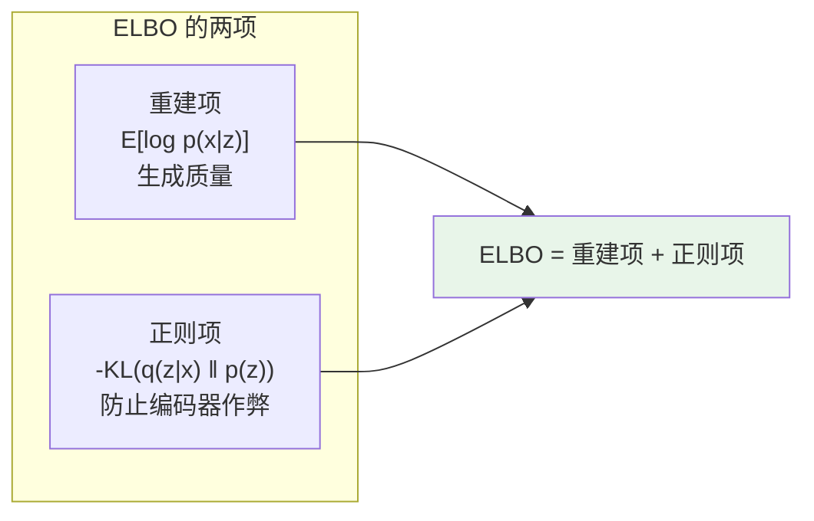
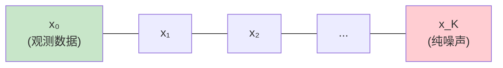
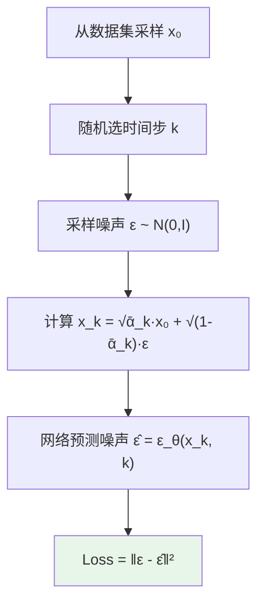
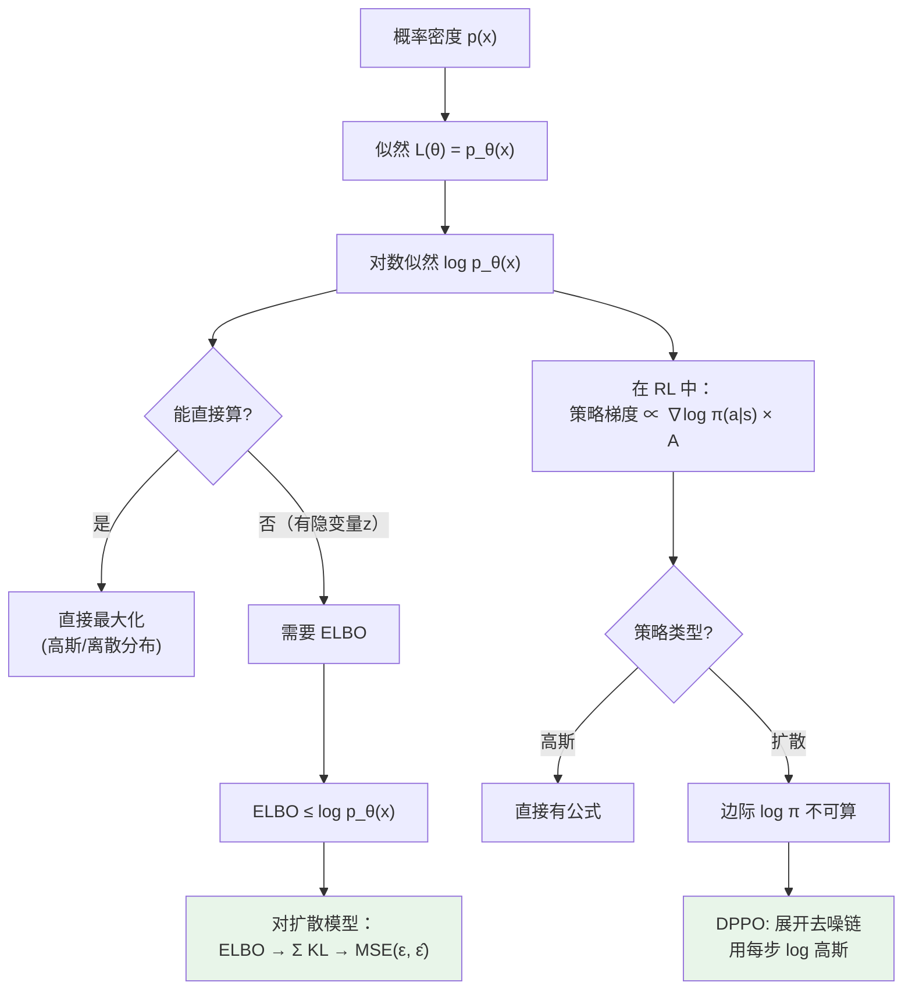

# 前置知识：对数似然、KL 散度与变分下界（ELBO）

> **为什么要读这篇**：扩散模型（DDPM）的训练目标本质上来自变分下界。DPPO 要算"策略的对数概率"来做梯度更新。不把似然、KL、ELBO 这几个概念彻底搞透，后面的推导全是天书。  
> **目标**：从最基础的概率概念出发，一路推到扩散模型的训练 loss 为什么是"预测噪声的 MSE"。

**标签**: `#前置知识` `#概率论` `#对数似然` `#KL散度` `#ELBO` `#变分推断` `#扩散模型推导`

**知识链接**：
- [扩散模型 DDPM](./000b_前置知识_扩散模型DDPM) — ELBO 最终推出 DDPM 训练 loss
- [Diffusion Policy](./000c_前置知识_Diffusion_Policy) — 理解策略的概率含义
- [为什么扩散策略难以 RL 微调](./000f_前置知识_为什么扩散策略难以RL微调) — log π 不可算的根源在这里
- [策略梯度与 PPO](./000a_前置知识_策略梯度与PPO) — 策略梯度需要 log π

---

## 第一部分：概率密度与似然

### 1.1 什么是概率密度函数

假设你有一个随机变量 $x$，它的值是连续的（比如一个人的身高）。概率密度函数 $p(x)$ 告诉你：$x$ 取某个值附近的"可能性有多大"。

- $p(170\text{cm}) = 0.05$ → 身高在 170cm 附近的概率密度是 0.05
- $p(250\text{cm}) \approx 0$ → 身高在 250cm 附近几乎不可能

**重要澄清**：$p(x)$ 本身不是概率！概率是 $p(x)\,\mathrm{d}x$，即密度乘以一小段区间。但我们日常说"$p(x)$ 大"就意味着"$x$ 这个值更可能出现"。

### 1.2 什么是似然（Likelihood）

假设你有一个模型（比如一个神经网络），它有参数 $\theta$。这个模型定义了一个概率分布 $p_\theta(x)$。

现在你观察到了一个真实的数据点 $x_0$。**似然（Likelihood）就是"在参数 $\theta$ 下，观察到 $x_0$ 的可能性"**：

$$
L(\theta) = p_\theta(x_0)
$$

**这个公式在做什么**：用模型自己给出的密度值，直接定义"这组参数有多认可这个观测数据"这件事——密度越大，模型越认可。

::: details 📐 公式详解（点击展开）

| 子表达式 | 它是谁 | 它在干嘛 |
|---------|--------|---------|
| $\theta$ | **模型的旋钮** | 神经网络（或其他模型）里所有可调参数的集合 |
| $x_0$ | **一个真实观测** | 已经发生、固定不变的数据点，不是变量 |
| $p_\theta(x_0)$ | **模型给这个数据打的分** | 把 $x_0$ 代入模型定义的概率密度函数，读出一个数值 |
| $L(\theta)$ | **似然值** | 就是把上面那个数值单独取个名字，强调"看成 $\theta$ 的函数"这个视角 |

**用人话读**："似然就是把模型当作评分器，看它给这个已经发生的真实数据打多高的分。"

**为什么是这个形式**：这不是一个新公式，只是给 $p_\theta(x_0)$ 换了一个名字和视角——从"$x$ 是变量、$\theta$ 固定"（概率密度）切换到"$x_0$ 固定、$\theta$ 是变量"（似然），这个视角切换是后面"调 $\theta$ 让似然最大"这件事的前提。
:::

似然越大，说明模型越能"解释"这个数据。比如模型 A 给出 $p_A(x_0) = 0.8$（认为 $x_0$ 很正常），模型 B 给出 $p_B(x_0) = 0.001$（认为 $x_0$ 几乎不可能），那模型 A 的似然更高，更好地解释了数据。

### 1.3 最大似然估计（MLE）

训练模型的目标：找到参数 $\theta$，让模型对训练数据的似然最大。

如果有 $N$ 个独立的训练样本 $x_1, x_2, \ldots, x_N$，总似然是连乘：

$$
L(\theta) = \prod_{i=1}^N p_\theta(x_i)
$$

**这个公式在做什么**：把"模型对整个训练集的认可程度"定义为它对每个样本认可程度的连乘——因为样本之间独立，联合概率就是各自概率相乘。

::: details 📐 公式详解（点击展开）

| 子表达式 | 它是谁 | 它在干嘛 |
|---------|--------|---------|
| $x_1,\ldots,x_N$ | **N 个独立观测** | 训练集里的所有样本，彼此互不影响地各自发生 |
| $p_\theta(x_i)$ | **对第 $i$ 个样本的认可度** | 模型给这一个样本打的密度分 |
| $\prod_{i=1}^N(\cdot)$ | **联合概率连乘器** | 独立事件同时发生的概率 = 各自概率相乘，这里把 N 个样本"同时被模型认可"的概率乘起来 |
| $L(\theta)$ | **整个训练集的似然** | 上面连乘的结果，是 $\theta$ 的函数 |

**用人话读**："模型对整个训练集的认可程度，等于它对每一个样本认可程度的连乘。"

**为什么是这个形式**：这是概率论里"独立事件联合概率=各自概率相乘"的直接应用，不是设计选择——只要假设样本独立同分布（i.i.d.），连乘就是唯一正确的组合方式。
:::

连乘数值极小容易下溢。取对数把连乘变成求和：

$$
\ell(\theta) = \sum_{i=1}^N \log p_\theta(x_i)
$$

**这个公式在做什么**：把连乘换成求和，得到一个数值上更稳定、优化上更容易处理的等价目标。

::: details 📐 公式详解（点击展开）

| 子表达式 | 它是谁 | 它在干嘛 |
|---------|--------|---------|
| $\log p_\theta(x_i)$ | **单个样本的对数分数** | 对每个样本的密度值取对数，把 $[0,1]$ 区间的小数变成 $(-\infty,0]$ 的"分数" |
| $\sum_{i=1}^N(\cdot)$ | **求和器** | 把 N 个样本各自的对数分数加起来 |
| $\ell(\theta)$ | **对数似然** | 求和的结果，是 $L(\theta)$ 取对数后的量 |

**用人话读**："把连乘先取对数变成求和，数值上更稳定，且不改变哪个 $\theta$ 是最优解。"

**为什么取对数不改变最优解**：$\log$ 是单调递增函数，$L(\theta)$ 最大的地方 $\log L(\theta)$ 一定也最大，所以最大化二者找到的 $\theta$ 完全一致（第二部分会详细展开这一点）。
:::

**最大化对数似然 = 让模型尽可能认为训练数据是"高概率的"。**

---

## 第二部分：为什么要取对数

### 2.1 数学上的便利

| | 原始似然 | 对数似然 |
|---|---|---|
| 公式 | $L(\theta) = \prod_i p_\theta(x_i)$ | $\ell(\theta) = \sum_i \log p_\theta(x_i)$ |
| 运算 | 连乘 | 求和 |
| 数值 | 极小，容易下溢 | 稳定，好优化 |

因为 $\log$ 是单调递增函数：最大化 $L(\theta)$ 和最大化 $\log L(\theta)$ 找到的 $\theta$ 完全一样。

### 2.2 对数似然的直觉

$\log p_\theta(x)$ 可以理解为"模型给数据 $x$ 打的分"：

| $\log p_\theta(x)$ | $p_\theta(x)$ | 含义 |
|---|---|---|
| $0$ | $1$ | 模型认为 $x$ 确定会出现 |
| $-1$ | $\approx 0.37$ | 模型觉得 $x$ 还行 |
| $-10$ | $\approx 4.5\times10^{-5}$ | 模型觉得 $x$ 极不可能 |
| $-\infty$ | $0$ | 模型认为 $x$ 不可能出现 |

训练目标就是让 $\log p_\theta(x)$ 对所有训练数据尽可能大（接近 0，而不是很负）。

### 2.3 负对数似然 = 交叉熵损失

在深度学习中常见的 loss：

$$
\text{Loss} = -\log p_\theta(x)
$$

**这个公式在做什么**：把"最大化对数似然"这件事翻译成深度学习框架习惯的"最小化 loss"写法——加一个负号，最大化问题就变成了最小化问题。

::: details 📐 公式详解（点击展开）

| 子表达式 | 它是谁 | 它在干嘛 |
|---------|--------|---------|
| $\log p_\theta(x)$ | **对数似然分数** | 前面已经定义好的量，越接近 0 说明模型越认可 $x$ |
| $-(\cdot)$ | **翻转符号的开关** | 把"越大越好"的量翻转成"越小越好"的量 |
| $\text{Loss}$ | **优化器真正盯着的目标** | 深度学习框架（PyTorch/TensorFlow）里的 optimizer 默认做梯度下降（最小化），所以要把目标包装成 loss 的形式 |

**用人话读**："loss 就是对数似然加个负号——梯度下降去最小化它，效果等价于梯度上升去最大化对数似然。"

**为什么要加负号而不是改用梯度上升**：主流深度学习框架（PyTorch、TensorFlow 等）的优化器接口统一约定为"最小化"，加负号是让任何最大化目标都能套用同一套优化器代码，不需要额外实现梯度上升逻辑。
:::

最小化 loss = 最大化对数似然。这就是分类任务中交叉熵损失的由来。

---

## 第三部分：隐变量模型与边际似然

### 3.1 什么是隐变量

有些模型里，除了观测到的数据 $\mathbf{x}$，还有一些我们**看不到的**中间变量 $\mathbf{z}$。

**VAE 的例子**：$\mathbf{z}$ 是低维向量（如 128 维），代表图片的"风格/内容"；$\mathbf{x}$ 是实际图片。生成过程是先采样 $\mathbf{z}$，再根据 $\mathbf{z}$ 生成 $\mathbf{x}$。

**扩散模型的例子**：$\mathbf{z} = \{\mathbf{x}_1, \mathbf{x}_2, \ldots, \mathbf{x}_K\}$ 是所有中间去噪状态；$\mathbf{x} = \mathbf{x}_0$ 是最终干净数据。生成过程是 $\mathbf{x}_K$（纯噪声）→ $\mathbf{x}_{K-1}$ → ... → $\mathbf{x}_0$。

### 3.2 边际似然（Marginal Likelihood）

我们想计算 $p_\theta(\mathbf{x})$——模型认为数据 $\mathbf{x}$ 有多可能，这是训练模型（1.3 节的 MLE）唯一需要的量。但模型里有一个我们看不见的隐变量 $\mathbf{z}$：$p_\theta(\mathbf{x})$ 其实是"$\mathbf{x}$ 和所有可能的 $\mathbf{z}$ 一起发生"的联合概率，对所有可能的 $\mathbf{z}$ 加总之后剩下的边缘概率。所以要把 $\mathbf{z}$ "积掉"（marginalize out）：

$$
p_\theta(\mathbf{x}) = \int p_\theta(\mathbf{x}, \mathbf{z})\,\mathrm{d}\mathbf{z} = \int p_\theta(\mathbf{x}|\mathbf{z})\, p(\mathbf{z})\,\mathrm{d}\mathbf{z}
$$

**这个公式在做什么**：把联合分布 $p_\theta(\mathbf{x},\mathbf{z})$ 按贝叶斯法则拆成"先验 $p(\mathbf{z})$ 生成一个 $\mathbf{z}$，再由解码器 $p_\theta(\mathbf{x}|\mathbf{z})$ 生成 $\mathbf{x}$"两步，然后把 $\mathbf{z}$ 的所有可能取值"扫一遍"、按各自的先验概率加权求和，得到"不管 $\mathbf{z}$ 具体是什么，观察到 $\mathbf{x}$ 的总概率"。

> **一句话直觉**：$\mathbf{x}$ 可能是由无数个不同的"隐藏原因" $\mathbf{z}$ 生成的（比如同一张猫的图片，可能对应很多种略有差异的"风格向量"），要把每一种原因生成这张图的概率加起来，才是这张图片总的出现概率。

::: details 📐 公式详解（点击展开）

| 子表达式 | 它是谁 | 它在干嘛 |
|---------|--------|---------|
| $\mathbf{z}$ | **看不见的隐藏原因** | 生成 $\mathbf{x}$ 时"没被观察到的中间产物"（VAE 中的"风格向量"，扩散模型中是所有中间去噪状态） |
| $p(\mathbf{z})$ | **隐藏原因的出场概率** | 通常固定为 $\mathcal{N}(\mathbf{0},\mathbf{I})$，代表"在生成任何数据之前，$\mathbf{z}$ 本身长什么样" |
| $p_\theta(\mathbf{x}\|\mathbf{z})$ | **解码器/生成器** | "已知隐藏原因，$\mathbf{x}$ 应该长什么样"——一个条件分布 |
| $\int(\cdots)\,\mathrm{d}\mathbf{z}$ | **穷举所有隐藏原因的积分器** | 把每一种可能的隐藏原因都考虑一遍，按各自出现的概率加权平均 |
| $p_\theta(\mathbf{x})$ | **训练真正要最大化的量** | 积分后剩下的边际分布，代表模型认为 $\mathbf{x}$ 的总体出现概率 |

**用人话读**："$\mathbf{x}$ 的总概率，等于把每一种可能的隐藏原因 $\mathbf{z}$ 生成出 $\mathbf{x}$ 的概率，按这个原因本身出现的概率加权后全部加起来。"

**为什么是这个形式**：这不是"设计"出来的公式，而是概率论的必然结果——只要模型承认存在一个隐变量 $\mathbf{z}$ 参与了生成过程，$\mathbf{x}$ 的边际概率在数学上就**必须**通过对联合分布积分得到，没有绕过这一步的办法。困难不在于公式本身，而在于这个积分在高维、非线性解码器下没有解析解。
:::

**数值代入**（用离散近似让积分变得可算，这正是数值积分/蒙特卡罗方法的思路）：假设简化成 1 维、且把 $\mathbf{z}$ 离散成 3 个代表性取值 $z\in\{-1,0,1\}$，先验给它们各 $p(z)=1/3$ 的权重（近似连续高斯的粗糙离散化）。设解码器对某个具体 $x_0$ 给出：

- $p_\theta(x_0|z=-1) = 0.05$
- $p_\theta(x_0|z=0) = 0.6$
- $p_\theta(x_0|z=1) = 0.1$

积分（此处退化为求和）：

$$
p_\theta(x_0) \approx \sum_{z\in\{-1,0,1\}} p_\theta(x_0|z)\,p(z) = 0.05\times\tfrac13 + 0.6\times\tfrac13 + 0.1\times\tfrac13 = \frac{0.75}{3} = 0.25
$$

**这个公式在做什么**：这是一个具体数值例子——把上面的积分退化成 3 个点的加权求和，具体算出"这个数据点的边际概率是 0.25"，让抽象的积分变得可触摸。

::: details 📐 公式详解（点击展开）

| 子表达式 | 它是谁 | 它在干嘛 |
|---------|--------|---------|
| $z\in\{-1,0,1\}$ | **三个代表性的隐藏原因** | 用离散的 3 个点粗略代替连续无穷多的 $\mathbf{z}$，让积分变成可以手算的求和 |
| $p(z)=1/3$（各项） | **均匀的先验权重** | 简化假设：三个原因出现的概率一样大 |
| $p_\theta(x_0\|z)$（三个具体数值） | **解码器在三种原因下给出的分数** | 分别代表"如果原因是 $z=-1/0/1$，$x_0$ 有多大概率长这样" |
| $\sum(\cdot)\to 0.25$ | **加权求和的最终结果** | 把三种原因各自的贡献加起来，得到 $x_0$ 不依赖具体 $z$ 的总概率 |

**用人话读**："假设只有 3 种可能的隐藏原因，把每种原因生成 $x_0$ 的概率乘上这种原因出现的概率再加起来，算出来是 0.25。"

**为什么这么算**：这是上面积分公式在"$\mathbf{z}$ 只有 3 个离散取值"这个极简假设下的具体展开——把 $\int(\cdot)\mathrm{d}\mathbf{z}$ 换成 $\sum(\cdot)$ 就是离散版本的边际化，用来让读者直观感受"积掉 $\mathbf{z}$"到底是在做什么运算。
:::

真实情况下 $\mathbf{z}$ 是连续的（无穷多取值）且是高维的（128 维意味着积分要覆盖 128 个方向），不可能像上面这样枚举 3 个点就够——这正是 3.3 节要说明的"为什么这个积分算不出来"。

### 3.3 为什么边际似然难算

这个积分在绝大多数深度学习模型中**无法解析计算**。$\mathbf{z}$ 是高维的（如 128 维），$p_\theta(\mathbf{x}|\mathbf{z})$ 是复杂的神经网络，在 128 维空间上做积分是不可能穷举的。

**这就是为什么我们需要变分下界（ELBO）——因为 $\log p_\theta(\mathbf{x})$ 算不出来，我们需要一个能算的替代品。**

---

## 第四部分：KL 散度

### 4.1 KL 散度是什么

**为什么需要它**：第三部分卡在"边际似然算不出来"上。要绕过这个困难，第五部分会引入一个"近似分布" $q$ 去代替真实但算不出来的后验分布。但要评价这个近似分布"凑合到什么程度"，需要一个能衡量"两个概率分布差多远"的数学工具——这就是 KL 散度。

KL 散度衡量**两个概率分布之间的"距离"**（严格说是"差异"，因为它不对称，即 $\mathrm{KL}(q\|p) \neq \mathrm{KL}(p\|q)$）。

$$
\mathrm{KL}(q \,\|\, p) = \text{用 } q \text{ 的视角来看，} q \text{ 和 } p \text{ 之间有多不同}
$$

**这个公式在做什么**：这是一句文字化的"占位公式"，先给 KL 散度一个直觉上的名字和方向，具体的数学定义在下面 4.2 节给出。

::: details 📐 公式详解（点击展开）

| 子表达式 | 它是谁 | 它在干嘛 |
|---------|--------|---------|
| $q$ | **观察者/近似分布** | 站在这个分布的立场上去评价差异，后面的加权平均都以 $q$ 的概率为权重 |
| $p$ | **被比较的参照分布** | 通常是真实但复杂、不好直接操作的目标分布 |
| $\mathrm{KL}(q\|p)$ | **不对称的"差异分"** | 一个数值，越大说明 $q$ 和 $p$ 越不像；强调是"用 $q$ 的视角"，暗示交换 $q,p$ 结果会不同 |

**用人话读**："KL 散度是站在 $q$ 的角度，衡量 $q$ 和 $p$ 有多不一样的一个分数。"

**为什么要强调"$q$ 的视角"**：KL 散度不对称，$\mathrm{KL}(q\|p)\neq\mathrm{KL}(p\|q)$——因为加权平均用的是 $q$ 的概率，所以 $p$ 在 $q$ 几乎不出现的地方犯错不会被计较，反过来则不然。这个不对称性在后面选择"用谁做近似分布"时会有实际影响。
:::

> **一句话直觉**：从分布 $q$ 里随机抽一个点，看看 $q$ 和 $p$ 在这个点上给出的概率差多少（取对数比），把这个"差多少"在 $q$ 的所有可能取值上加权平均——平均下来差得越多，说明 $q$ 和 $p$ 长得越不像。

### 4.2 公式

对于连续分布：

$$
\mathrm{KL}\big(q(\mathbf{z}) \,\|\, p(\mathbf{z})\big) = \int q(\mathbf{z}) \log \frac{q(\mathbf{z})}{p(\mathbf{z})}\,\mathrm{d}\mathbf{z} = \mathbb{E}_{\mathbf{z}\sim q}\!\left[\log q(\mathbf{z}) - \log p(\mathbf{z})\right]
$$

**这个公式在做什么**：对 $\mathbf{z}$ 空间里的每一个点，比较 $q$ 和 $p$ 在这一点上给出的密度谁大谁小（用 $\log(q/p)$ 衡量），然后按 $q$ 自己给出的概率权重，把这些"差异"加权平均起来。

::: details 📐 公式详解（点击展开）

| 子表达式 | 它是谁 | 它在干嘛 |
|---------|--------|---------|
| $q(\mathbf{z})$ | **待评价的分布** | 我们手头能操控/采样的那个分布（比如自己选的近似分布） |
| $p(\mathbf{z})$ | **参照分布** | 想让 $q$ 去逼近的那个分布，往往是真实但未知/难算的目标分布 |
| $\log\dfrac{q(\mathbf{z})}{p(\mathbf{z})}$ | **单点上的过度自信指标** | 如果 $q(\mathbf{z})>p(\mathbf{z})$，比值 $>1$，取对数为正——说明 $q$ 在这个点"过度自信" |
| $\int(\cdots)q(\mathbf{z})\,\mathrm{d}\mathbf{z}=\mathbb{E}_{\mathbf{z}\sim q}[\cdot]$ | **按重要性加权的平均器** | 只在 $q$ 认为"重要"（概率高）的地方计较差异，$q$ 概率趋近 0 的地方权重也趋近 0；实际训练中通过从 $q$ 采样几个 $\mathbf{z}$ 做蒙特卡罗（MC）平均来近似 |

**用人话读**："在 $q$ 自己觉得重要的地方，比较 $q$ 和 $p$ 谁给的概率更大，把这些'差多少'加权平均起来。"

**为什么是这个形式（为什么用 $\log$ 比值而不是直接算 $q-p$ 的差）**：直接用 $|q-p|$ 无法反映"相对差异"——比如 $q=0.001,p=0.0001$ 和 $q=0.5,p=0.4$ 的绝对差都很小/很大不成比例，但前者是 10 倍关系（差异巨大），后者只是 1.25 倍。取 $\log$ 比值能正确捕捉这种相对尺度上的差异,并且这个定义恰好能保证下面 4.3 节"非负"这个关键性质成立（这是 ELBO 能够推导出来的数学根基）。
:::

**数值代入**：取 1 维、离散近似，$\mathbf{z}\in\{-1,0,1\}$，$q(z)=[0.1,0.8,0.1]$，$p(z)=[0.3,0.4,0.3]$（$p$ 更"平"，$q$ 更集中在 0）：

$$
\mathrm{KL}(q\|p) = 0.1\log\frac{0.1}{0.3} + 0.8\log\frac{0.8}{0.4} + 0.1\log\frac{0.1}{0.3}
$$

**这个公式在做什么**：这是一个具体数值例子——把 KL 散度的积分公式代入一个只有 3 个取值的具体离散分布，把抽象定义变成可以逐项手算的三项和。

::: details 📐 公式详解（点击展开）

| 子表达式 | 它是谁 | 它在干嘛 |
|---------|--------|---------|
| $q(z)=[0.1,0.8,0.1]$ | **待评价分布的具体取值** | $q$ 把 80% 的概率都押在 $z=0$ 上，两边各 10% |
| $p(z)=[0.3,0.4,0.3]$ | **参照分布的具体取值** | $p$ 分布得更"平"，三个点概率相对接近 |
| $0.1\log\frac{0.1}{0.3}$（首末两项） | **两侧点的贡献** | $q$ 在这两点的概率比 $p$ 小，$\log$ 比值为负 |
| $0.8\log\frac{0.8}{0.4}$（中间项） | **中心点的贡献** | $q$ 在 $z=0$ 处概率是 $p$ 的两倍，且权重 0.8 很大，是主要贡献项 |

**用人话读**："把三个点各自的'log 比值 × q 的概率'算出来再加总，就是这两个具体分布的 KL 散度。"

**为什么要展开成三项**：积分在离散情形下退化为有限求和，这一步只是把 4.2 节的一般公式套用到 $\mathbf{z}$ 只有 3 个取值的具体例子上，方便手工验证。
:::

逐项算：$\log(0.1/0.3)=\log(0.333)=-1.099$，$\log(0.8/0.4)=\log 2=0.693$。代入：

$$
\mathrm{KL}(q\|p) = 0.1\times(-1.099) + 0.8\times0.693 + 0.1\times(-1.099) = -0.110+0.554-0.110 = 0.334
$$

**这个公式在做什么**：这是一个具体数值例子——把上一步的三个 $\log$ 比值代入具体数字，算出最终的 KL 散度数值。

::: details 📐 公式详解（点击展开）

| 子表达式 | 它是谁 | 它在干嘛 |
|---------|--------|---------|
| $0.1\times(-1.099)$（两项） | **两侧点的数值贡献** | 各自约为 $-0.110$，是负的小贡献 |
| $0.8\times0.693$ | **中心点的数值贡献** | 约为 $0.554$，是最大的正贡献，主导了最终结果 |
| $0.334$ | **最终 KL 散度值** | 三项相加后的结果，大于 0 |

**用人话读**："三项加起来算出 KL 散度是 0.334，是个正数。"

**为什么结果是正的**：因为 $q$ 和 $p$ 不是同一个分布（$q$ 集中在中心，$p$ 更平），根据 4.3 节要证明的性质，只要 $q\neq p$，KL 散度就必然严格大于 0。
:::

结果 $0.334>0$，说明 $q$ 和 $p$ 确实不同（$q$ 把概率过度集中在 $z=0$，而 $p$ 分布得更均匀）。

### 4.3 关键性质

$$
\mathrm{KL}(q \,\|\, p) \geq 0 \qquad \text{（永远非负，等号当且仅当 } q = p\text{）}
$$

**这个公式在做什么**：说明 KL 散度不管怎么算，结果永远不会是负数，而且只有当两个分布完全相同时才会精确等于 0。

::: details 📐 公式详解（点击展开）

| 子表达式 | 它是谁 | 它在干嘛 |
|---------|--------|---------|
| $\mathrm{KL}(q\|p)$ | **差异分** | 4.2 节定义好的那个量，是待证明性质的主角 |
| $\geq 0$ | **下界保证** | 无论 $q,p$ 具体是什么分布，这个数值永远不会跌到负数 |
| "等号当且仅当 $q=p$" | **等号成立的唯一条件** | 只有两个分布完全一致时，差异分才会精确归零 |

**用人话读**："两个分布的差异分永远不会是负的，只有它们完全一样时差异分才是 0。"

**为什么这个性质成立**：见下文基于 Jensen 不等式的证明——这是 ELBO 能够被推导出来的数学根基。
:::

> **一句话直觉**：两个分布的"差异程度"不可能是负的——就像两个人之间的"不同程度"不会是负数，最多是 0（两人一模一样）。

**为什么这个性质成立（不用"显然"，给出可验证的理由）**：这是 Jensen 不等式的直接结果。$-\log$ 是凸函数，根据 Jensen 不等式，凸函数的期望 $\geq$ 期望的凸函数值，即 $\mathbb{E}_{q}[-\log(p/q)] \geq -\log\mathbb{E}_q[p/q]$。而 $\mathbb{E}_q[p/q] = \int q\cdot(p/q)\,\mathrm{d}\mathbf{z} = \int p\,\mathrm{d}\mathbf{z} = 1$（因为 $p$ 是概率密度，积分为 1），所以右边 $=-\log 1 = 0$。左边正好就是 $\mathrm{KL}(q\|p)$，所以 $\mathrm{KL}(q\|p)\geq 0$。

这个性质是推导 ELBO 的关键数学基础——第五部分正是靠"KL 散度非负"这一个事实，把一个算不出来的量（对数似然）转换成了一个可以计算的下界。

### 4.4 两个高斯之间的 KL

如果 $q = \mathcal{N}(\mu_1, \sigma_1^2)$，$p = \mathcal{N}(\mu_2, \sigma_2^2)$：

$$
\mathrm{KL}(q \,\|\, p) = \log\frac{\sigma_2}{\sigma_1} + \frac{\sigma_1^2 + (\mu_1 - \mu_2)^2}{2\sigma_2^2} - \frac{1}{2}
$$

**这个公式在做什么**：给出两个高斯分布之间 KL 散度的解析（闭式）解——不用积分，直接把 4 个参数（两个均值、两个标准差）代入这个代数表达式就能算出结果。

::: details 📐 公式详解（点击展开）

| 子表达式 | 它是谁 | 它在干嘛 |
|---------|--------|---------|
| $\log\dfrac{\sigma_2}{\sigma_1}$ | **形状差异项** | 两个分布的"胖瘦程度"之比，取对数后描述方差不同带来的差异 |
| $\dfrac{\sigma_1^2+(\mu_1-\mu_2)^2}{2\sigma_2^2}$ | **位置+尺度综合项** | 分子把 $q$ 的方差和两个均值的距离加在一起，除以 $p$ 的方差做归一化——均值离得越远、$q$ 越"胖"，这项越大 |
| $-\dfrac12$ | **归一化常数** | 保证当 $q=p$（即 $\mu_1=\mu_2,\sigma_1=\sigma_2$）时整个表达式精确等于 0 |

**用人话读**："两个高斯的差异分，由'谁更胖'和'中心离多远'两部分决定，再减掉一个常数让完全相同时结果归零。"

**为什么高斯之间的 KL 有闭式解**：高斯分布的密度函数是指数族里最简单的形式，$\log(q/p)$ 展开后只剩多项式项，积分可以逐项解析算出——这正是为什么 VAE 和扩散模型都选高斯做近似后验/正向噪声：能直接用代数公式算 KL，不需要数值积分。
:::

特别地，如果 $p = \mathcal{N}(0, 1)$：

$$
\mathrm{KL}\big(\mathcal{N}(\mu, \sigma^2) \,\|\, \mathcal{N}(0,1)\big) = -\frac{1}{2}\left(1 + \log\sigma^2 - \mu^2 - \sigma^2\right)
$$

**这个公式在做什么**：把上面通用的高斯 KL 公式代入 $p=\mathcal{N}(0,1)$（标准正态）这个特殊情况，化简成 VAE 里真正用到的那一行 KL loss。

::: details 📐 公式详解（点击展开）

| 子表达式 | 它是谁 | 它在干嘛 |
|---------|--------|---------|
| $\mu,\sigma^2$ | **编码器输出的分布参数** | VAE 的编码器网络对每个输入 $x$ 输出的均值和方差，定义了近似后验 $q(\mathbf{z}\|x)$ |
| $\mathcal{N}(0,1)$ | **固定的先验** | $\mathbf{z}$ 在生成任何数据之前应该长成的样子，是不学习的常数分布 |
| $1+\log\sigma^2-\mu^2-\sigma^2$ | **惩罚项组合** | $\mu^2$ 惩罚均值偏离 0，$\sigma^2$ 和 $\log\sigma^2$ 一起惩罚方差偏离 1，两者共同把 $q$ 拉向标准正态 |

**用人话读**："这一项惩罚编码器输出的分布离标准正态太远——均值不为 0 或方差不为 1 都会增大这个惩罚。"

**为什么要把先验固定成标准正态**：固定先验后，KL 公式退化成只含 $\mu,\sigma$ 的简单代数式，可以直接写进 loss 里反向传播，不需要额外学习先验分布的参数——这是 VAE 设计上的一个关键简化。
:::

这就是 VAE 中 KL loss 那一项的由来。

---

## 第五部分：变分下界（ELBO）的推导

这是整篇最核心的部分。

### 5.1 出发点

我们想最大化 $\log p_\theta(\mathbf{x})$，但它因为隐变量积分而算不出来。

### 5.2 引入辅助分布

引入一个**可以自由选择**的分布 $q_\phi(\mathbf{z}|\mathbf{x})$（参数为 $\phi$），称为**近似后验**。它的作用是近似真实后验 $p_\theta(\mathbf{z}|\mathbf{x})$——即给定数据 $\mathbf{x}$ 后，隐变量 $\mathbf{z}$ 最可能的分布。

### 5.3 逐步推导

**第一步**：利用 $\int q(\mathbf{z}|\mathbf{x})\,\mathrm{d}\mathbf{z} = 1$，把常数 $\log p_\theta(\mathbf{x})$ 写成期望形式（常数乘以 1 还是常数）：

$$
\log p_\theta(\mathbf{x}) = \mathbb{E}_{\mathbf{z}\sim q(\mathbf{z}|\mathbf{x})}\!\left[\log p_\theta(\mathbf{x})\right]
$$

**这个公式在做什么**：把一个跟 $\mathbf{z}$ 无关的常数 $\log p_\theta(\mathbf{x})$，人为改写成"对 $\mathbf{z}$ 求期望"的形式——这是纯粹的代数技巧，为后面展开积分做铺垫。

::: details 📐 公式详解（点击展开）

| 子表达式 | 它是谁 | 它在干嘛 |
|---------|--------|---------|
| $\log p_\theta(\mathbf{x})$ | **推导的起点** | 我们真正想最大化但算不出来的量，此处它不依赖 $\mathbf{z}$，是个常数 |
| $q(\mathbf{z}\|\mathbf{x})$ | **凑出来的期望权重** | 任意一个关于 $\mathbf{z}$ 的分布，满足 $\int q\,\mathrm{d}\mathbf{z}=1$ |
| $\mathbb{E}_{\mathbf{z}\sim q}[\log p_\theta(\mathbf{x})]$ | **改写后的等价形式** | 对一个常数求期望还是这个常数本身，值完全没变 |

**用人话读**："把一个常数硬套上'对 $\mathbf{z}$ 求期望'的外壳，数值不变，但形式上为下一步埋下了操作空间。"

**为什么要做这一步看似多余的操作**：因为 $q(\mathbf{z}|\mathbf{x})$ 积分为 1，任何常数乘以 1 都等于自身——这一步的唯一目的是让接下来能用贝叶斯公式把 $p_\theta(\mathbf{x})$ 换成含 $\mathbf{z}$ 的表达式，再对 $\mathbf{z}$ 展开处理。
:::

**第二步**：用贝叶斯公式 $p_\theta(\mathbf{x}) = p_\theta(\mathbf{x},\mathbf{z})\,/\,p_\theta(\mathbf{z}|\mathbf{x})$ 展开：

$$
\log p_\theta(\mathbf{x}) = \mathbb{E}_{\mathbf{z}\sim q}\!\left[\log p_\theta(\mathbf{x},\mathbf{z}) - \log p_\theta(\mathbf{z}|\mathbf{x})\right]
$$

**这个公式在做什么**：用贝叶斯公式把 $\log p_\theta(\mathbf{x})$ 拆成"联合概率"和"真实后验"两部分的差，把一个含糊的常数换成含有 $\mathbf{z}$ 的两个具体项。

::: details 📐 公式详解（点击展开）

| 子表达式 | 它是谁 | 它在干嘛 |
|---------|--------|---------|
| $p_\theta(\mathbf{x},\mathbf{z})$ | **联合分布** | $\mathbf{x}$ 和 $\mathbf{z}$ 同时发生的概率，通常可以直接写出（先验乘解码器） |
| $p_\theta(\mathbf{z}\|\mathbf{x})$ | **真实后验（算不出来的部分）** | 给定观测 $\mathbf{x}$ 后 $\mathbf{z}$ 应该是什么，这正是我们要绕开的那个难算的量 |
| $\log p_\theta(\mathbf{x},\mathbf{z})-\log p_\theta(\mathbf{z}\|\mathbf{x})$ | **贝叶斯公式的对数形式** | 由 $p_\theta(\mathbf{x})=p_\theta(\mathbf{x},\mathbf{z})/p_\theta(\mathbf{z}\|\mathbf{x})$ 两边取对数得到 |

**用人话读**："把 $\log p_\theta(\mathbf{x})$ 换成'联合概率的对数减去真实后验的对数'，这是贝叶斯公式的直接推论。"

**为什么要引入真实后验 $p_\theta(\mathbf{z}|\mathbf{x})$**：这一步暴露了问题所在——真实后验本身也算不出来（它依赖于算不出来的 $p_\theta(\mathbf{x})$），所以第三步要想办法把它从公式里"换掉"，换成我们能操控的近似后验 $q$。
:::

**第三步**：加减 $\log q(\mathbf{z}|\mathbf{x})$（不改变总量），然后拆成两部分：

$$
\log p_\theta(\mathbf{x}) = \underbrace{\mathbb{E}_{\mathbf{z}\sim q}\!\left[\log p_\theta(\mathbf{x},\mathbf{z}) - \log q(\mathbf{z}|\mathbf{x})\right]}_{\text{ELBO}} \;+\; \underbrace{\mathbb{E}_{\mathbf{z}\sim q}\!\left[\log q(\mathbf{z}|\mathbf{x}) - \log p_\theta(\mathbf{z}|\mathbf{x})\right]}_{\mathrm{KL}(q(\mathbf{z}|\mathbf{x})\,\|\,p_\theta(\mathbf{z}|\mathbf{x}))}
$$

**这个公式在做什么**：往第二步的表达式里加减一个 $\log q(\mathbf{z}|\mathbf{x})$（净效果为零），巧妙地把式子拆成两块——一块是能算的 ELBO，另一块正好是 $q$ 和真实后验之间的 KL 散度。

::: details 📐 公式详解（点击展开）

| 子表达式 | 它是谁 | 它在干嘛 |
|---------|--------|---------|
| $\mathbb{E}_{\mathbf{z}\sim q}[\log p_\theta(\mathbf{x},\mathbf{z})-\log q(\mathbf{z}\|\mathbf{x})]$ | **ELBO（可以算的部分）** | 只涉及联合分布 $p_\theta(\mathbf{x},\mathbf{z})$（我们能写出）和近似后验 $q$（我们自己选的），不涉及任何算不出来的量 |
| $\mathbb{E}_{\mathbf{z}\sim q}[\log q(\mathbf{z}\|\mathbf{x})-\log p_\theta(\mathbf{z}\|\mathbf{x})]$ | **KL 散度（算不出来但非负的部分）** | 恰好就是 4.2 节定义的 $\mathrm{KL}(q\|p_\theta(\mathbf{z}\|\mathbf{x}))$，本身算不出来，但已知它 $\geq 0$ |
| 加减 $\log q(\mathbf{z}\|\mathbf{x})$ | **拆分用的"垂线"** | 一个纯代数技巧：加一项再减同一项，等式两边不变，但式子被劈成了两块各有意义的部分 |

**用人话读**："把等式硬拆成两块，一块是能直接算的 ELBO，另一块是算不出来但一定不小于 0 的 KL 散度。"

**为什么恰好能拆出这两块**：这不是巧合，而是精心选择"加减 $\log q(\mathbf{z}|\mathbf{x})$"这个操作的结果——目的就是让第二块恰好凑成 KL 散度的定义式，这样就能用"KL $\geq 0$"这个已证明的性质，在下一步导出下界。
:::

### 5.4 最终结论

因为 $\mathrm{KL} \geq 0$，所以：

$$
\boxed{\log p_\theta(\mathbf{x}) \;\geq\; \text{ELBO} = \mathbb{E}_{\mathbf{z}\sim q(\mathbf{z}|\mathbf{x})}\!\left[\log p_\theta(\mathbf{x},\mathbf{z}) - \log q(\mathbf{z}|\mathbf{x})\right]}
$$

**这个公式在做什么**：正式给出全文的核心结论——用一个可以算的量（ELBO）作为算不出来的对数似然的下界，训练时改为最大化这个下界。

::: details 📐 公式详解（点击展开）

| 子表达式 | 它是谁 | 它在干嘛 |
|---------|--------|---------|
| $\log p_\theta(\mathbf{x})$ | **真正想最大化但算不出来的目标** | 3.3 节已说明这个量因高维积分而不可解 |
| $\text{ELBO}$ | **可以算的替代品** | 只涉及联合分布和自选的 $q$，不含任何算不出来的项 |
| $\geq$ | **下界关系** | 因为上一步拆出的 KL 项非负，所以从等式中减掉它只会让右边变小或不变 |

**用人话读**："真实目标算不出来，但我们证明了一个'不超过真实目标'的可算下界，训练时改去最大化这个下界。"

**为什么最大化下界是合理的替代**：因为 $\mathrm{KL}\geq 0$，等式 $\log p_\theta(\mathbf{x}) = \text{ELBO} + \mathrm{KL}$ 保证 ELBO 永远不超过真实目标；把 ELBO 推高，既直接推高了它自身，也间接推高了它的上界 $\log p_\theta(\mathbf{x})$（除非 KL 项同时也在增大抵消掉，但训练中 $q$ 也在学习去逼近真实后验，KL 项本身会被压低）。
:::

ELBO 是 $\log p_\theta(\mathbf{x})$ 的下界。最大化 ELBO 同时做两件事：让 $\log p_\theta(\mathbf{x})$ 变大（模型更好）和让近似后验 $q$ 更接近真实后验（KL 变小）。

### 5.5 ELBO 的两项分解

进一步展开 $p_\theta(\mathbf{x},\mathbf{z}) = p_\theta(\mathbf{x}|\mathbf{z})\,p(\mathbf{z})$：

$$
\text{ELBO} = \underbrace{\mathbb{E}_{\mathbf{z}\sim q}\!\left[\log p_\theta(\mathbf{x}|\mathbf{z})\right]}_{\text{重建项：从 } \mathbf{z} \text{ 能多好地恢复 } \mathbf{x}} \;-\; \underbrace{\mathrm{KL}\big(q(\mathbf{z}|\mathbf{x}) \,\|\, p(\mathbf{z})\big)}_{\text{正则项：} q \text{ 和先验 } p(\mathbf{z}) \text{ 有多近}}
$$

**这个公式在做什么**：把 ELBO 进一步拆成两个可以分别解释、分别计算的部分——"重建质量"和"编码器有多规矩"，这正是 VAE 训练 loss 的两项来源。

::: details 📐 公式详解（点击展开）

| 子表达式 | 它是谁 | 它在干嘛 |
|---------|--------|---------|
| $\mathbb{E}_{\mathbf{z}\sim q}[\log p_\theta(\mathbf{x}\|\mathbf{z})]$ | **重建项** | 从编码出来的 $\mathbf{z}$ 出发，解码器能多好地还原出原始 $\mathbf{x}$——越高说明重建越准 |
| $\mathrm{KL}\big(q(\mathbf{z}\|\mathbf{x})\,\|\,p(\mathbf{z})\big)$ | **正则项** | 惩罚编码器输出的分布 $q$ 偏离先验 $p(\mathbf{z})$ 太远，防止编码器"作弊"（把每个数据点编码成互不重叠的孤立点而不是连续分布） |
| 两项相减 | **质量与规矩的拉锯** | 重建项想让 $q$ 尽量集中、精确（利于重建），正则项想让 $q$ 尽量接近先验（利于生成新样本），二者需要平衡 |

**用人话读**："ELBO = 编码后能多准地还原数据，减去编码器的输出离先验分布有多远。"

**为什么要减去 KL 正则项而不是只优化重建**：如果只优化重建项，编码器会倾向于把每个样本编码到互不重叠的极窄区域（重建最容易），但这样生成新样本时从先验里随机采一个 $\mathbf{z}$ 会落入"没被训练过"的空白区域，生成质量很差。加上 KL 正则项强迫 $q$ 覆盖住先验分布的主体区域，保证采样生成时能用上整个训练过的隐空间。
:::

```mermaid
flowchart LR
    subgraph "ELBO 的两项"
        A["重建项<br/>E[log p(x|z)]<br/>生成质量"] 
        B["正则项<br/>-KL(q(z|x) ‖ p(z))<br/>防止编码器作弊"]
    end
    A --> C["ELBO = 重建项 + 正则项"]
    B --> C
    style C fill:#e8f5e9
```

VAE 的训练 loss 就是 $-\text{ELBO}$。如果 $p_\theta(\mathbf{x}|\mathbf{z})$ 是高斯，重建项退化为 MSE；正则项用上面的高斯 KL 公式直接算。

---

## 第六部分：从 ELBO 到扩散模型

### 6.1 扩散模型的隐变量

扩散模型的隐变量不是单个 $\mathbf{z}$，而是整条去噪链 $\{\mathbf{x}_1, \ldots, \mathbf{x}_K\}$：

```mermaid
graph LR
    X0["x₀<br/>(观测数据)"] --- X1["x₁"] --- X2["x₂"] --- dots["..."] --- XK["x_K<br/>(纯噪声)"]
    style X0 fill:#c8e6c9
    style XK fill:#ffcdd2
```

- $\mathbf{x}_0$：原始数据（观测到的）
- $\mathbf{x}_K \sim \mathcal{N}(\mathbf{0}, \mathbf{I})$：纯噪声
- $\mathbf{x}_1, \ldots, \mathbf{x}_{K-1}$：中间状态（看不到的隐变量）

### 6.2 正向和逆向过程

**正向（加噪，固定不学习）**：

$$
q(\mathbf{x}_k | \mathbf{x}_{k-1}) = \mathcal{N}\!\left(\mathbf{x}_k;\; \sqrt{1-\beta_k}\,\mathbf{x}_{k-1},\; \beta_k\,\mathbf{I}\right)
$$

**这个公式在做什么**：定义"加噪一步"具体是怎么操作的——把上一步的干净数据稍微缩小一点，再叠加一点高斯噪声，这个过程完全固定、不需要学习。

::: details 📐 公式详解（点击展开）

| 子表达式 | 它是谁 | 它在干嘛 |
|---------|--------|---------|
| $\sqrt{1-\beta_k}\,\mathbf{x}_{k-1}$ | **信号的缩水** | 把上一步的数据整体缩小一点点（乘以一个略小于 1 的系数），逐步抹去原有信息 |
| $\beta_k\,\mathbf{I}$ | **注入噪声的方差** | 每一步加入的高斯噪声的"强度"，$\beta_k$ 通常随 $k$ 从小变大 |
| $\mathcal{N}(\mathbf{x}_k;\;\cdot,\;\cdot)$ | **加噪后的分布** | $\mathbf{x}_k$ 不是一个确定值，而是服从这个均值、方差的高斯分布——采样即可得到具体的 $\mathbf{x}_k$ |

**用人话读**："每一步把数据稍微缩小一点，再加一点随机噪声，重复 K 步最后变成纯噪声。"

**为什么系数是 $\sqrt{1-\beta_k}$ 而不是 1**：这个特定的缩放系数保证了如果 $\mathbf{x}_{k-1}$ 的方差是 1，那么 $\mathbf{x}_k$ 的方差经过"缩水+加噪"两步操作后仍然精确是 1（$(1-\beta_k)\cdot 1+\beta_k=1$）——这样设计能保证整条链的数值尺度始终稳定，不会爆炸或消失。
:::

**逆向（去噪，需要学习）**：

$$
p_\theta(\mathbf{x}_{k-1} | \mathbf{x}_k) = \mathcal{N}\!\left(\mathbf{x}_{k-1};\; \boldsymbol{\mu}_\theta(\mathbf{x}_k, k),\; \sigma_k^2\,\mathbf{I}\right)
$$

**这个公式在做什么**：定义"去噪一步"要学习的东西——给定当前噪声状态 $\mathbf{x}_k$，网络要预测出上一步 $\mathbf{x}_{k-1}$ 应该服从的高斯分布的均值。

::: details 📐 公式详解（点击展开）

| 子表达式 | 它是谁 | 它在干嘛 |
|---------|--------|---------|
| $\boldsymbol{\mu}_\theta(\mathbf{x}_k, k)$ | **网络要学习预测的均值** | 输入当前噪声状态 $\mathbf{x}_k$ 和时间步 $k$，网络输出"去噪一步后应该在哪"的猜测 |
| $\sigma_k^2\,\mathbf{I}$ | **固定不学习的方差** | 通常预先设定（如等于正向过程对应步的方差），不需要网络输出 |
| $p_\theta(\mathbf{x}_{k-1}\|\mathbf{x}_k)$ | **逆向去噪分布** | 这是我们真正想训练好的东西——训练完之后从纯噪声反复采样这个分布，最终得到干净数据 |

**用人话读**："去噪时网络只需要猜一个均值，方差是提前定好的常数。"

**为什么只学均值、方差固定**：DDPM 发现固定方差（用正向过程的 $\beta_k$ 或对应的闭式解）已经足够好，学习方差带来的收益很小却增加了训练难度，所以简化成只学均值这一个自由度，大幅降低了训练复杂度。
:::

### 6.3 扩散模型的 ELBO

对扩散模型套用 ELBO，展开后得到：

$$
\text{ELBO} = \underbrace{\mathbb{E}_q\!\left[\log p_\theta(\mathbf{x}_0|\mathbf{x}_1)\right]}_{\text{最后一步重建}} - \underbrace{\mathrm{KL}\!\left(q(\mathbf{x}_K|\mathbf{x}_0) \,\|\, p(\mathbf{x}_K)\right)}_{\approx\, 0\text{（终点匹配）}} - \underbrace{\sum_{k=2}^K \mathrm{KL}\!\left(q(\mathbf{x}_{k-1}|\mathbf{x}_k, \mathbf{x}_0) \,\|\, p_\theta(\mathbf{x}_{k-1}|\mathbf{x}_k)\right)}_{\text{每步去噪匹配（最重要的项）}}
$$

**这个公式在做什么**：把整条去噪链的 ELBO 拆成三块——首尾两块几乎不用学（一个是简单重建、一个天然接近 0），真正需要训练的只有中间"每一步去噪对不对"这一大项。

::: details 📐 公式详解（点击展开）

| 子表达式 | 它是谁 | 它在干嘛 |
|---------|--------|---------|
| $\mathbb{E}_q[\log p_\theta(\mathbf{x}_0\|\mathbf{x}_1)]$ | **最后一步重建项** | 从倒数第二个噪声状态 $\mathbf{x}_1$ 恢复出干净数据 $\mathbf{x}_0$，通常这一步很容易 |
| $\mathrm{KL}(q(\mathbf{x}_K\|\mathbf{x}_0)\,\|\,p(\mathbf{x}_K))$ | **终点匹配项** | 检查加噪加满 $K$ 步后的分布是否等于纯噪声先验 $\mathcal{N}(\mathbf{0},\mathbf{I})$，只要 $K$ 足够大这个值天然接近 0，不需要学习 |
| $\sum_{k=2}^K\mathrm{KL}(q(\mathbf{x}_{k-1}\|\mathbf{x}_k,\mathbf{x}_0)\,\|\,p_\theta(\mathbf{x}_{k-1}\|\mathbf{x}_k))$ | **每步去噪匹配项（核心训练目标）** | 对中间每一步，比较"已知起点和当前点情况下真正应该去噪到哪"和"网络猜测去噪到哪"之间的差距，加总起来 |

**用人话读**："整个 ELBO 里，第一项和第二项几乎不用管，真正要训练网络去缩小的是第三项——每一步去噪猜得准不准。"

**为什么第二项约等于 0 不需要训练**：只要加噪步数 $K$ 足够大、$\beta_k$ 调度设计合理，$\mathbf{x}_K$ 的分布会被噪声完全"淹没"原始信号，非常接近标准高斯先验，这一项在数值上趋近于 0，可以忽略不参与优化。
:::

第三项的含义：让学到的去噪分布 $p_\theta(\mathbf{x}_{k-1}|\mathbf{x}_k)$ 尽量接近真实后验 $q(\mathbf{x}_{k-1}|\mathbf{x}_k, \mathbf{x}_0)$。

### 6.4 关键事实：$q(\mathbf{x}_{k-1}|\mathbf{x}_k, \mathbf{x}_0)$ 是已知高斯

因为正向过程是高斯的，后验也是高斯且有闭式解：

$$
q(\mathbf{x}_{k-1} | \mathbf{x}_k, \mathbf{x}_0) = \mathcal{N}\!\left(\mathbf{x}_{k-1};\; \tilde{\boldsymbol{\mu}}_k(\mathbf{x}_k, \mathbf{x}_0),\; \tilde{\beta}_k\,\mathbf{I}\right)
$$

**这个公式在做什么**：说明如果额外多知道原始数据 $\mathbf{x}_0$（不只是 $\mathbf{x}_k$），那么"真正应该去噪到哪"这个后验分布就有精确的高斯闭式解，不需要网络去猜。

::: details 📐 公式详解（点击展开）

| 子表达式 | 它是谁 | 它在干嘛 |
|---------|--------|---------|
| $q(\mathbf{x}_{k-1}\|\mathbf{x}_k,\mathbf{x}_0)$ | **训练时的"标准答案"** | 因为训练时 $\mathbf{x}_0$ 是已知的（就是训练数据本身），这个后验可以精确算出，作为网络要拟合的目标 |
| $\tilde{\boldsymbol{\mu}}_k(\mathbf{x}_k,\mathbf{x}_0)$ | **标准答案的均值** | 由 $\mathbf{x}_k$ 和 $\mathbf{x}_0$ 共同决定的一个具体数值，下面公式给出计算方式 |
| $\tilde{\beta}_k\,\mathbf{I}$ | **标准答案的方差** | 一个只依赖于噪声调度 $\beta_1,\ldots,\beta_k$ 的固定常数，不含未知量 |

**用人话读**："如果偷看到了最初的干净数据，那么每一步'该去噪到哪'就有精确公式，不需要猜。"

**为什么额外知道 $\mathbf{x}_0$ 就能精确求解**：因为正向过程是纯高斯线性变换的链条，在已知链条起点和终点（此处是 $\mathbf{x}_0$ 和 $\mathbf{x}_k$）的条件下，中间任意一点的条件分布可以用高斯的贝叶斯公式（条件高斯的标准结果）直接解出闭式解，这是高斯分布本身的数学性质。
:::

其中均值为 $\mathbf{x}_0$ 和 $\mathbf{x}_k$ 的加权组合：

$$
\tilde{\boldsymbol{\mu}}_k = \frac{\sqrt{\bar{\alpha}_{k-1}}\,\beta_k}{1-\bar{\alpha}_k}\,\mathbf{x}_0 + \frac{\sqrt{\alpha_k}\,(1-\bar{\alpha}_{k-1})}{1-\bar{\alpha}_k}\,\mathbf{x}_k
$$

**这个公式在做什么**：给出上面那个均值的具体计算公式——它是原始数据 $\mathbf{x}_0$ 和当前噪声状态 $\mathbf{x}_k$ 按噪声调度算出的权重做加权平均。

::: details 📐 公式详解（点击展开）

| 子表达式 | 它是谁 | 它在干嘛 |
|---------|--------|---------|
| $\dfrac{\sqrt{\bar\alpha_{k-1}}\,\beta_k}{1-\bar\alpha_k}$ | **$\mathbf{x}_0$ 的权重** | 由噪声调度参数算出的一个系数，决定原始数据在均值里占多少比重 |
| $\dfrac{\sqrt{\alpha_k}(1-\bar\alpha_{k-1})}{1-\bar\alpha_k}$ | **$\mathbf{x}_k$ 的权重** | 决定当前噪声状态在均值里占多少比重 |
| $\tilde{\boldsymbol{\mu}}_k$ | **加权平均后的最终均值** | 两个权重（可以证明恰好加起来考虑了协方差关系，不是简单归一化的凸组合）分别乘上 $\mathbf{x}_0$ 和 $\mathbf{x}_k$ 后相加 |

**用人话读**："已知起点和当前位置，中间点的最佳猜测就是把两者按噪声调度算出的比例加权平均。"

**为什么权重是这个具体形式**：这两个系数是把条件高斯分布的标准贝叶斯公式（已知联合高斯的边缘和条件关系）代入 DDPM 正向过程的具体参数化后化简得到的结果，本质上是"起点和当前点分别携带多少关于中间点的信息"的精确数学表达，不是拍脑袋设计的。
:::

含义很直觉：知道起点 $\mathbf{x}_0$ 和当前位置 $\mathbf{x}_k$，中间点 $\mathbf{x}_{k-1}$ 就被确定了。

### 6.5 从 KL 到 MSE

ELBO 中每步的 KL 项，两边都是方差相同的高斯，所以 KL 只取决于均值差：

$$
L_{k-1} = \mathrm{KL}\!\left(q(\mathbf{x}_{k-1}|\mathbf{x}_k,\mathbf{x}_0) \,\big\|\, p_\theta(\mathbf{x}_{k-1}|\mathbf{x}_k)\right) \;\propto\; \left\|\tilde{\boldsymbol{\mu}}_k - \boldsymbol{\mu}_\theta(\mathbf{x}_k, k)\right\|^2
$$

**这个公式在做什么**：利用 4.4 节"两个高斯的 KL 只由均值差和方差决定"这一结论，把每一步的 KL 损失化简成一个简单的均方误差（MSE）——网络预测的均值和真实均值差多少，loss 就有多大。

::: details 📐 公式详解（点击展开）

| 子表达式 | 它是谁 | 它在干嘛 |
|---------|--------|---------|
| $q(\mathbf{x}_{k-1}\|\mathbf{x}_k,\mathbf{x}_0)$ | **标准答案分布** | 均值 $\tilde{\boldsymbol{\mu}}_k$，方差 $\tilde\beta_k$（6.4 节已给出闭式解） |
| $p_\theta(\mathbf{x}_{k-1}\|\mathbf{x}_k)$ | **网络预测的分布** | 均值 $\boldsymbol{\mu}_\theta(\mathbf{x}_k,k)$，方差 $\sigma_k^2$（通常设为等于 $\tilde\beta_k$） |
| $\|\tilde{\boldsymbol{\mu}}_k-\boldsymbol{\mu}_\theta(\mathbf{x}_k,k)\|^2$ | **两个均值的欧氏距离平方** | 网络猜的均值和标准答案均值之间差多远，这正是化简后 KL 的核心内容 |

**用人话读**："两个高斯只要方差一样，它们的 KL 散度就等价于均值差的平方——训练目标变成了让网络猜的均值尽量接近真实均值。"

**为什么两个高斯方差相同时 KL 能化简成 MSE**：把 4.4 节的通用高斯 KL 公式代入 $\sigma_1=\sigma_2$ 这个特例，$\log(\sigma_2/\sigma_1)$ 项归零，剩下的项里只有均值差 $(\mu_1-\mu_2)^2$ 这一个变量，其余都是与网络输出无关的常数——对网络参数求梯度时常数项不产生梯度，所以优化 KL 等价于优化这个均方误差。
:::

训练目标变成了：让网络预测的均值 $\boldsymbol{\mu}_\theta$ 匹配真实均值 $\tilde{\boldsymbol{\mu}}_k$。

### 6.6 重参数化：预测噪声

DDPM 的关键 trick——不预测均值，而是预测噪声 $\boldsymbol{\epsilon}$。

利用正向过程的重参数化 $\mathbf{x}_k = \sqrt{\bar{\alpha}_k}\,\mathbf{x}_0 + \sqrt{1-\bar{\alpha}_k}\,\boldsymbol{\epsilon}$，代入 $\tilde{\boldsymbol{\mu}}_k$ 公式化简后：

$$
L_{k-1} \;\propto\; \left\|\boldsymbol{\epsilon} - \boldsymbol{\epsilon}_\theta(\mathbf{x}_k, k)\right\|^2
$$

**这个公式在做什么**：把"预测均值"这个目标彻底换成"预测噪声"——由于均值和噪声之间存在固定的代数关系，让网络直接预测加入的噪声 $\boldsymbol{\epsilon}$ 和让它预测均值 $\tilde{\boldsymbol{\mu}}_k$ 在数学上是等价的，但预测噪声在实践中训练得更稳定。

::: details 📐 公式详解（点击展开）

| 子表达式 | 它是谁 | 它在干嘛 |
|---------|--------|---------|
| $\boldsymbol{\epsilon}$ | **正向加噪时实际用过的那份噪声** | 生成 $\mathbf{x}_k$ 时从 $\mathcal{N}(\mathbf{0},\mathbf{I})$ 采样出来、真实加进去的噪声，训练时是已知的 |
| $\boldsymbol{\epsilon}_\theta(\mathbf{x}_k,k)$ | **网络对这份噪声的猜测** | 网络只看到加噪后的 $\mathbf{x}_k$ 和时间步 $k$，试图猜出当时加了什么噪声 |
| $\|\boldsymbol{\epsilon}-\boldsymbol{\epsilon}_\theta\|^2$ | **噪声预测误差** | 猜的噪声和真实噪声的欧氏距离平方，这就是新的训练目标 |

**用人话读**："不再让网络猜'去噪后应该在哪'，改成让它猜'当初加的噪声是什么'，这两者数学上是同一件事换了个说法。"

**为什么改成预测噪声效果更好**：把 $\mathbf{x}_k=\sqrt{\bar\alpha_k}\mathbf{x}_0+\sqrt{1-\bar\alpha_k}\boldsymbol{\epsilon}$ 代入 6.4 节的均值公式化简后，$\tilde{\boldsymbol{\mu}}_k-\boldsymbol{\mu}_\theta$ 这个差正好可以整理成 $\boldsymbol{\epsilon}-\boldsymbol{\epsilon}_\theta$ 乘上一个只依赖 $k$ 的常数系数——DDPM 论文发现，直接让网络学习预测无量纲、尺度统一的噪声 $\boldsymbol{\epsilon}$（而不是尺度随 $k$ 变化很大的均值）在实践中训练更稳定、效果更好。
:::

### 6.7 最终简化训练 loss

DDPM 论文发现直接用均匀权重效果更好：

$$
\boxed{\mathcal{L}_{\text{simple}} = \mathbb{E}_{k\sim\text{Uniform}(1,K),\;\mathbf{x}_0\sim\text{data},\;\boldsymbol{\epsilon}\sim\mathcal{N}(\mathbf{0},\mathbf{I})} \left\|\boldsymbol{\epsilon} - \boldsymbol{\epsilon}_\theta(\mathbf{x}_k, k)\right\|^2}
$$

**这个公式在做什么**：这是从一路推导出的 ELBO 最终落地成的、DDPM 真正用来训练的完整 loss——随机挑一个时间步、一个数据样本、一份噪声，让网络猜噪声，算均方误差。

::: details 📐 公式详解（点击展开）

| 子表达式 | 它是谁 | 它在干嘛 |
|---------|--------|---------|
| $k\sim\text{Uniform}(1,K)$ | **随机的训练难度** | 每次训练随机挑一个时间步 $k$（而不是用理论上算出的各步权重），DDPM 发现均匀采样效果反而更好 |
| $\mathbf{x}_0\sim\text{data}$ | **随机的训练样本** | 从真实训练集里随机取一条数据 |
| $\boldsymbol{\epsilon}\sim\mathcal{N}(\mathbf{0},\mathbf{I})$ | **随机的噪声** | 每次训练随机采样一份新噪声，保证网络见过各种噪声实现 |
| $\|\boldsymbol{\epsilon}-\boldsymbol{\epsilon}_\theta(\mathbf{x}_k,k)\|^2$ | **单次训练的具体 loss** | 用上面三个随机量拼出 $\mathbf{x}_k$，网络预测噪声，和真实噪声算均方误差 |
| $\mathbb{E}[\cdot]$ | **训练中的近似方式** | 实际实现中不算真正的期望，而是每个 mini-batch 里随机采样 $(k,\mathbf{x}_0,\boldsymbol{\epsilon})$ 若干组，取平均作为这一步的 loss |

**用人话读**："每次训练随机挑一个时间步、一个数据样本、一份噪声，混合出一个加噪状态，让网络猜加了什么噪声，猜错多少就是 loss。"

**为什么可以用均匀权重而不是理论推出的权重**：严格按 ELBO 推导，每一步 KL 项前应该有一个理论权重（和 $\beta_k,\bar\alpha_k$ 相关），但 DDPM 论文实验发现丢掉这些权重、直接对所有 $k$ 均匀采样反而让训练更关注中间步（那些理论权重较小但视觉上更重要的步骤），生成质量更好——这是一个经验发现而非理论必然。
:::

其中 $\mathbf{x}_k = \sqrt{\bar{\alpha}_k}\,\mathbf{x}_0 + \sqrt{1-\bar{\alpha}_k}\,\boldsymbol{\epsilon}$。

```mermaid
flowchart TD
    A["从数据集采样 x₀"] --> B["随机选时间步 k"]
    B --> C["采样噪声 ε ~ N(0,I)"]
    C --> D["计算 x_k = √ᾱ_k·x₀ + √(1-ᾱ_k)·ε"]
    D --> E["网络预测噪声 ε̂ = ε_θ(x_k, k)"]
    E --> F["Loss = ‖ε - ε̂‖²"]
    style F fill:#e8f5e9
```

从 ELBO 推导了一大圈，最终简化成了一个无比简单的 MSE loss。这就是 DDPM 的全部训练过程。

---

## 第七部分：对数似然在策略梯度中的角色

### 7.1 回到 RL

策略梯度公式需要 $\log \pi_\theta(\mathbf{a}|\mathbf{s})$——策略在状态 $\mathbf{s}$ 下采取动作 $\mathbf{a}$ 的对数概率：

$$
\nabla_\theta J(\theta) = \mathbb{E}\!\left[\nabla_\theta \log \pi_\theta(\mathbf{a}|\mathbf{s}) \cdot A(\mathbf{s}, \mathbf{a})\right]
$$

**这个公式在做什么**：策略梯度定理——告诉我们"往哪个方向调参数能让策略变好"，方向由动作的对数概率的梯度乘以这个动作的优势打分决定。

::: details 📐 公式详解（点击展开）

| 子表达式 | 它是谁 | 它在干嘛 |
|---------|--------|---------|
| $\log\pi_\theta(\mathbf{a}\|\mathbf{s})$ | **动作被选中的对数概率** | 策略网络认为在状态 $\mathbf{s}$ 下选动作 $\mathbf{a}$ 有多大可能性，取对数后的值 |
| $\nabla_\theta\log\pi_\theta(\mathbf{a}\|\mathbf{s})$ | **提高这个动作概率的方向** | 沿这个方向调整 $\theta$，会让策略更倾向于选出这个具体的 $(\mathbf{s},\mathbf{a})$ |
| $A(\mathbf{s},\mathbf{a})$ | **这个动作的优势打分** | 这个动作比平均水平好多少，正数说明是好动作，负数说明是差动作 |
| $\mathbb{E}[\cdot]$ | **对采样到的轨迹取平均** | 实际训练中通过环境交互采集一批 $(\mathbf{s},\mathbf{a})$ 样本，取平均近似这个期望 |

**用人话读**："往'提高好动作概率、降低差动作概率'的方向调整参数，好坏由优势打分的正负决定。"

**为什么梯度里会出现 $\log\pi_\theta$**：这是本文要解释的关键——要计算这个梯度就必须能算出 $\log\pi_\theta(\mathbf{a}|\mathbf{s})$ 本身，对高斯策略这很容易（7.2 节），但对扩散策略这个量是高维积分算不出来的（7.3 节），这正是把前面对数似然/ELBO 的知识用到 RL 里的关键接口。
:::

### 7.2 高斯策略（简单情况）

如果 $\pi_\theta(\mathbf{a}|\mathbf{s}) = \mathcal{N}(\mathbf{a};\,\boldsymbol{\mu}_\theta(\mathbf{s}),\,\sigma^2\mathbf{I})$：

$$
\log \pi_\theta(\mathbf{a}|\mathbf{s}) = -\frac{\|\mathbf{a} - \boldsymbol{\mu}_\theta(\mathbf{s})\|^2}{2\sigma^2} - \frac{d}{2}\log(2\pi\sigma^2)
$$

**这个公式在做什么**：当策略本身就是一个高斯分布时，把高斯密度函数的定义直接代入取对数，得到一个可以直接手算的对数概率闭式表达式。

::: details 📐 公式详解（点击展开）

| 子表达式 | 它是谁 | 它在干嘛 |
|---------|--------|---------|
| $-\dfrac{\|\mathbf{a}-\boldsymbol{\mu}_\theta(\mathbf{s})\|^2}{2\sigma^2}$ | **距离惩罚项** | 实际动作 $\mathbf{a}$ 离网络输出的均值 $\boldsymbol{\mu}_\theta(\mathbf{s})$ 越远，这一项越负——对数概率越低 |
| $-\dfrac{d}{2}\log(2\pi\sigma^2)$ | **归一化常数项** | 保证高斯密度积分为 1 所必须的常数，$d$ 是动作的维度 |
| $\log\pi_\theta(\mathbf{a}\|\mathbf{s})$ | **闭式对数概率** | 两项相加，不涉及任何积分，直接代入数字就能算出来 |

**用人话读**："动作离网络给出的中心点越远，对数概率越低，公式里有一个精确的代数表达式，不需要数值积分。"

**为什么高斯策略可以"一步算完"**：高斯分布的密度函数本身就有解析表达式，对数概率只是把这个表达式直接展开——这和第三部分里"边际似然算不出来"的困境完全不同，因为这里策略直接输出一个具体分布（不涉及隐变量积分），$\log\pi_\theta$ 就是这个分布密度的对数，天然有闭式解。
:::

直接有公式，一步算完。

### 7.3 扩散策略（困难情况）

如果策略是 Diffusion Policy，$\pi_\theta(\mathbf{a}|\mathbf{s})$ 是边际概率——要对所有中间去噪步积分：

$$
\pi_\theta(\mathbf{a}_0|\mathbf{s}) = \int p_\theta(\mathbf{a}_0, \mathbf{a}_1, \ldots, \mathbf{a}_K | \mathbf{s})\,\mathrm{d}\mathbf{a}_1\cdots\mathrm{d}\mathbf{a}_K
$$

**这个公式在做什么**：说明当策略是扩散模型时，"最终动作 $\mathbf{a}_0$ 的概率"其实是把所有中间去噪状态都积掉之后剩下的边际概率——和第三部分的边际似然是完全同一个数学结构。

::: details 📐 公式详解（点击展开）

| 子表达式 | 它是谁 | 它在干嘛 |
|---------|--------|---------|
| $\mathbf{a}_1,\ldots,\mathbf{a}_K$ | **中间去噪状态（看不见的隐变量）** | 扩散策略从噪声 $\mathbf{a}_K$ 逐步去噪到最终动作 $\mathbf{a}_0$，中间的每一步都是隐变量 |
| $p_\theta(\mathbf{a}_0,\mathbf{a}_1,\ldots,\mathbf{a}_K\|\mathbf{s})$ | **整条去噪链的联合概率** | 给定状态 $\mathbf{s}$，从纯噪声到最终动作这一整条路径同时发生的概率 |
| $\int(\cdots)\mathrm{d}\mathbf{a}_1\cdots\mathrm{d}\mathbf{a}_K$ | **把所有中间路径积掉的积分** | 对每一种可能的去噪路径都考虑一遍，只保留最终动作 $\mathbf{a}_0$ 的边际概率 |

**用人话读**："扩散策略选出最终动作的概率，是把所有可能的中间去噪路径都算一遍再加总，跟第三部分'边际似然难算'是同一个问题。"

**为什么这一步会成为 RL 里的真正麻烦**：策略梯度定理（7.1 节）需要精确算出 $\log\pi_\theta(\mathbf{a}|\mathbf{s})$，但这个积分和 3.2/3.3 节的边际似然积分结构完全一样——维度高（每个中间状态都是高维向量）、被非线性网络参数化，没有解析解，直接算不出来。
:::

这和"边际似然难算"完全一样的问题！**$\log\pi_\theta(\mathbf{a}|\mathbf{s})$ 没有闭式解。**

### 7.4 DPPO 的解法

DPPO 的核心 insight：别算边际概率了。把去噪展开成 MDP，每一步的条件概率是高斯，有闭式 log-likelihood：

$$
\log p_\theta(\mathbf{a}^{k-1}|\mathbf{a}^k, \mathbf{s}) = -\frac{\|\mathbf{a}^{k-1} - \boldsymbol{\mu}_\theta(\mathbf{a}^k, k, \mathbf{s})\|^2}{2\sigma_k^2} + \text{const}
$$

**这个公式在做什么**：绕开算不出来的整体 $\log\pi_\theta(\mathbf{a}_0|\mathbf{s})$，转而去看"单独一步去噪"的对数概率——因为每一步去噪本身就是个高斯分布，这一步是有闭式解的。

::: details 📐 公式详解（点击展开）

| 子表达式 | 它是谁 | 它在干嘛 |
|---------|--------|---------|
| $\mathbf{a}^{k-1},\mathbf{a}^k$ | **去噪链上相邻的两个动作状态** | 把整条去噪链看成一个 MDP（马尔可夫决策过程）里的连续状态，每一步转移都单独可算 |
| $\boldsymbol{\mu}_\theta(\mathbf{a}^k,k,\mathbf{s})$ | **单步去噪网络的输出均值** | 网络根据当前状态 $\mathbf{a}^k$、时间步 $k$、观测 $\mathbf{s}$，猜出下一步应该在哪 |
| $-\dfrac{\|\mathbf{a}^{k-1}-\boldsymbol{\mu}_\theta\|^2}{2\sigma_k^2}+\text{const}$ | **单步对数概率的闭式解** | 和 7.2 节高斯策略的对数概率公式结构完全一样，只是换成了单步去噪的具体记号 |

**用人话读**："不管整条去噪链加起来的概率，只看'从这一步到下一步'这个单独的转移概率——它是高斯分布，有现成公式。"

**为什么单步去噪概率有闭式解而整体边际概率没有**：单步去噪 $p_\theta(\mathbf{a}^{k-1}|\mathbf{a}^k,\mathbf{s})$ 本身就是网络直接输出的一个高斯分布（不涉及对更多隐变量再积分），套用高斯密度公式直接算对数即可；而整体 $\pi_\theta(\mathbf{a}_0|\mathbf{s})$ 需要把 $\mathbf{a}_1,\ldots,\mathbf{a}_K$ 全部积掉，这才是困难所在。
:::

然后对展开 MDP 的每一步做策略梯度：

$$
\nabla_\theta J = \mathbb{E}\!\left[\sum_k \gamma_{\text{denoise}}^k \cdot \nabla_\theta \log p_\theta(\mathbf{a}^{k-1}|\mathbf{a}^k, \mathbf{s}) \cdot A(\mathbf{s}, \mathbf{a}^0)\right]
$$

**这个公式在做什么**：把标准策略梯度定理（7.1 节）套用到"去噪链展开成的 MDP"上——对每一个去噪步骤分别计算梯度，用最终动作的优势打分去指导每一步的调整方向，加总起来就是完整的策略梯度。

::: details 📐 公式详解（点击展开）

| 子表达式 | 它是谁 | 它在干嘛 |
|---------|--------|---------|
| $\sum_k(\cdot)$ | **对去噪链每一步求和** | 把原本"一步到位"的策略梯度，拆成对 $K$ 个去噪子步骤分别求梯度再加总 |
| $\gamma_{\text{denoise}}^k$ | **去噪步骤的折扣因子** | 类似 RL 里时间步的折扣因子，给不同去噪步骤的梯度贡献分配权重 |
| $\nabla_\theta\log p_\theta(\mathbf{a}^{k-1}\|\mathbf{a}^k,\mathbf{s})$ | **单步去噪的梯度方向** | 每一步都用上面刚推出的闭式对数概率求梯度，这一步是可以精确计算的 |
| $A(\mathbf{s},\mathbf{a}^0)$ | **最终动作的优势打分** | 只在最终动作 $\mathbf{a}^0$ 上评估好坏，但这个打分被用来指导链条上所有中间步骤的更新方向 |

**用人话读**："把整条去噪链当成一个多步 MDP，每一步都单独算梯度、单独更新，但所有步骤共享同一个'最终动作好不好'的打分。"

**为什么可以用同一个 $A(\mathbf{s},\mathbf{a}^0)$ 指导所有去噪步骤**：因为整条去噪链最终只产生一个动作 $\mathbf{a}^0$，这个动作的好坏是唯一的评价依据；把去噪过程看成 MDP 后，每一步转移都对最终结果有贡献，所以用同一个优势值分配给每一步梯度是合理的信用分配方式，这正是 DPPO 论文的核心 insight。
:::

虽然不知道整体的 $\log\pi(\mathbf{a}_0|\mathbf{s})$，但知道每一步的 $\log p(\mathbf{a}^{k-1}|\mathbf{a}^k)$，对每步分别做策略梯度效果一样好。

---

## 第八部分：概念总图

```mermaid
graph TD
    A["概率密度 p(x)"] --> B["似然 L(θ) = p_θ(x)"]
    B --> C["对数似然 log p_θ(x)"]
    C --> D{"能直接算?"}
    D -->|"是"| E["直接最大化<br/>(高斯/离散分布)"]
    D -->|"否（有隐变量z）"| F["需要 ELBO"]
    F --> G["ELBO ≤ log p_θ(x)"]
    G --> H["对扩散模型：<br/>ELBO → Σ KL → MSE(ε, ε̂)"]
    
    C --> I["在 RL 中：<br/>策略梯度 ∝ ∇log π(a|s) × A"]
    I --> J{"策略类型?"}
    J -->|"高斯"| K["直接有公式"]
    J -->|"扩散"| L["边际 log π 不可算"]
    L --> M["DPPO: 展开去噪链<br/>用每步 log 高斯"]
    
    style H fill:#e8f5e9
    style M fill:#e8f5e9
```

---

## 第九部分：完整逻辑链

**Q：为什么扩散模型的训练 loss 是 $\|\boldsymbol{\epsilon} - \hat{\boldsymbol{\epsilon}}\|^2$？**

1. 我们想最大化 $\log p_\theta(\mathbf{x}_0)$（让模型解释数据好）
2. 但有隐变量（中间去噪状态），算不出来
3. 用 ELBO 作为可计算的下界替代
4. ELBO 展开为每步去噪的 KL 散度之和
5. 每步 KL = 两个高斯均值差的 MSE
6. 重参数化为噪声预测的差
7. 最终：$\mathcal{L} = \|\boldsymbol{\epsilon} - \boldsymbol{\epsilon}_\theta(\mathbf{x}_k, k)\|^2$

**Q：DPPO 怎么解决 $\log\pi$ 不可算？**

1. 策略梯度需要 $\log\pi(\mathbf{a}|\mathbf{s})$
2. 扩散策略的 $\log\pi(\mathbf{a}_0|\mathbf{s})$ 是高维积分，不可算
3. DPPO 把去噪链展开为 MDP
4. 每步去噪是高斯 → 有显式 $\log p(\mathbf{a}^{k-1}|\mathbf{a}^k, \mathbf{s})$
5. 对每步分别做 PPO clip 更新

---

## 符号速查表

| 符号 | 含义 |
|------|------|
| $\mathbf{x},\,\mathbf{x}_0$ | 观测到的数据 |
| $\mathbf{z}$ 或 $\mathbf{x}_{1:K}$ | 隐变量（去噪中间状态） |
| $\theta$ | 模型参数 |
| $p_\theta(\mathbf{x})$ | 模型定义的数据边际分布 |
| $q(\mathbf{z}|\mathbf{x})$ | 近似后验 |
| $\mathrm{KL}(q\|p)$ | 两个分布间的 KL 散度 |
| ELBO | 证据下界 |
| $\boldsymbol{\epsilon}$ | 加入的噪声 |
| $\boldsymbol{\epsilon}_\theta(\mathbf{x}_k, k)$ | 网络预测的噪声 |
| $\bar{\alpha}_k$ | 累积信号保留比例 |
| $\pi_\theta(\mathbf{a}|\mathbf{s})$ | RL 策略 |

---

## 延伸阅读

- [扩散模型 DDPM](./000b_前置知识_扩散模型DDPM) ← 完整的噪声调度和采样
- [为什么扩散策略难以 RL 微调](./000f_前置知识_为什么扩散策略难以RL微调) ← 深入展开"不可算"
- [DPPO](/论文综述/001_DPPO_扩散策略策略优化) ← 展开 MDP 的具体实现
- [Flow Matching](./000g_前置知识_Flow_Matching与连续归一化流) ← 不需要 ELBO 的替代框架
