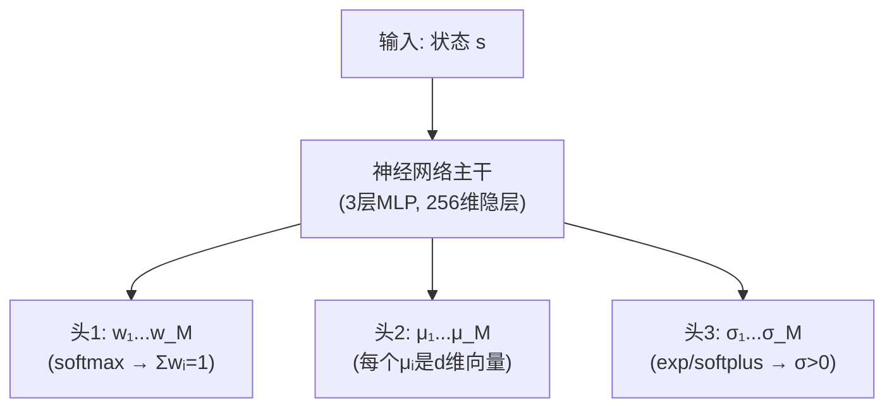
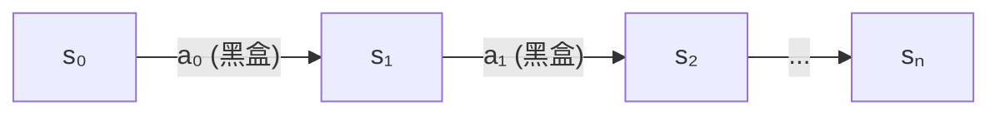
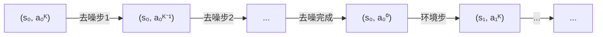
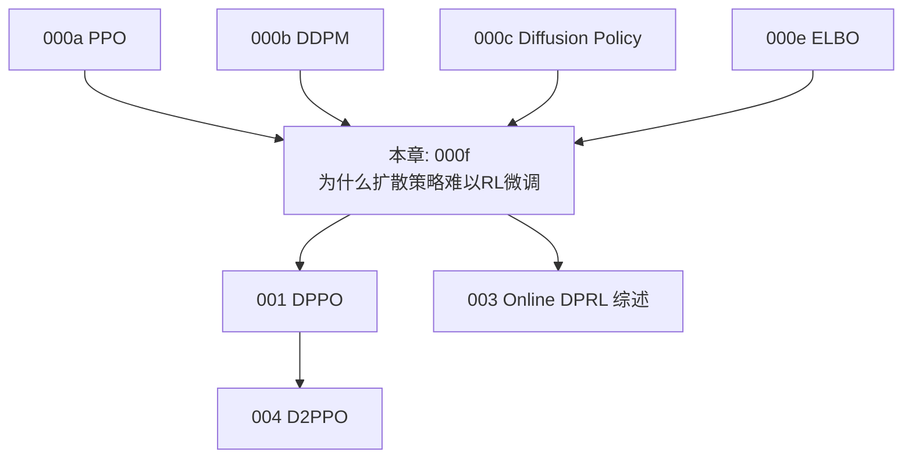

# 前置知识：为什么扩散策略难以 RL 微调——DPPO 的动机深度解析

> **为什么要读这篇**：DPPO 论文的核心动机是"扩散策略很难用 RL 微调"。但**为什么难**这个问题，现有笔记只用几句话带过。本章用大量类比、数学直觉和对比实验，彻底讲清楚这个"难"到底难在哪里，为什么之前的方法都不行，以及 DPPO 的解法为什么是对的。
> **前置要求**：读完 000a（PPO）、000b（DDPM）、000c（Diffusion Policy）、000e（ELBO）

**标签**: `#前置知识` `#扩散策略` `#RL微调` `#动机分析` `#对数似然` `#策略梯度` `#DPPO动机`

## 知识链接

| 前置阅读 | 后续阅读 |
|---------|---------|
| [000a 策略梯度与PPO](./000a_前置知识_策略梯度与PPO.md) | [001 DPPO 扩散策略策略优化](/论文综述/001_DPPO_扩散策略策略优化.md) |
| [000b 扩散模型DDPM](./000b_前置知识_扩散模型DDPM.md) | [003 Online DPRL 综述](/论文综述/003_Online_DPRL_综述_扩散策略与在线RL.md) |
| [000c Diffusion Policy](./000c_前置知识_Diffusion_Policy.md) | [004 D2PPO 解决表示坍塌](/论文综述/004_D2PPO_解决表示坍塌.md) |
| [000e 对数似然与变分下界](./000e_前置知识_对数似然与变分下界.md) | [000g Flow Matching](./000g_前置知识_Flow_Matching与连续归一化流.md) |

---

## 第一部分：问题的根源——策略梯度需要什么

### 1.1 回忆策略梯度的核心公式

RL 微调的主力工具是策略梯度。不管是 REINFORCE、A2C 还是 PPO，都需要一个东西：

$$
\nabla_\theta J(\theta) = \mathbb{E}_{(s,a)\sim\pi_\theta} \left[ \nabla_\theta \log \pi_\theta(a|s) \cdot A(s,a) \right]
$$

这个公式说的是：想让策略变好，你需要**对每个采样到的 $(s,a)$ 对**计算两个量：

1. $A(s,a)$：这个动作比平均水平好多少（Advantage）
2. $\nabla_\theta \log \pi_\theta(a|s)$：怎么调参数才能让这个动作的概率变大

第 1 个量（Advantage）和策略的表示形式无关——不管你用高斯策略、GMM 还是扩散策略，Advantage 都一样算。

**第 2 个量才是问题的根源。** 你必须能算出 $\log \pi_\theta(a|s)$——策略在状态 $s$ 下输出动作 $a$ 的对数概率密度。

### 1.2 高斯策略（Gaussian Policy）——最常见的策略表示

#### 什么是高斯策略

高斯策略的意思是：**给定一个状态 $s$，策略输出的动作 $a$ 服从一个高斯（正态）分布。**

$$
\pi_\theta(a|s) = \mathcal{N}(a;\, \mu_\theta(s),\, \Sigma)
$$

**逐个符号解释**：

- $\pi_\theta(a|s)$：参数为 $\theta$ 的策略，在状态 $s$ 下输出动作 $a$ 的概率密度
- $\mathcal{N}(a;\, \mu,\, \Sigma)$：均值为 $\mu$、协方差矩阵为 $\Sigma$ 的多维高斯分布在 $a$ 处的概率密度值
- $\mu_\theta(s)$：一个神经网络，输入状态 $s$，输出动作的"中心位置"（均值向量）
- $\Sigma$：协方差矩阵，决定动作分布的"散开程度"
- $\theta$：神经网络的所有可学习参数（权重、偏置）

#### 实际中的简化：对角协方差

完整的协方差矩阵 $\Sigma$ 是 $d \times d$ 的矩阵（$d$ = 动作维度），参数太多。实际中几乎所有人用**对角协方差**：

$$
\Sigma = \text{diag}(\sigma_1^2, \sigma_2^2, \ldots, \sigma_d^2) = \sigma^2 \cdot I \quad\text{（更简化：所有维度共享一个 } \sigma \text{）}
$$

此时各维度**独立**，概率密度可以分解为各维度的乘积：

$$
\pi_\theta(a|s) = \prod_{i=1}^{d} \frac{1}{\sqrt{2\pi\sigma_i^2}} \exp\!\left(-\frac{(a_i - \mu_i(s))^2}{2\sigma_i^2}\right)
$$

**逐项解释**：

- $\prod_{i=1}^{d}$：对 $d$ 个维度连乘（因为各维度独立）
- $a_i$：动作的第 $i$ 个维度（比如第 $i$ 个关节的角度变化量）
- $\mu_i(s)$：网络预测的第 $i$ 个维度的均值
- $\sigma_i^2$：第 $i$ 个维度的方差（控制这个维度的"随机性"）
- $\exp(\cdots)$：指数函数，高斯分布的核心
- $\frac{1}{\sqrt{2\pi\sigma_i^2}}$：归一化常数，保证积分等于 1

#### 数值例子

假设一个 2 关节机器人：

- 状态 $s = [\text{关节1角度}=30°,\, \text{关节2角度}=45°,\, \text{目标位置}=(0.5, 0.3)]$
- 动作 $a = [\text{关节1扭矩},\, \text{关节2扭矩}]$，维度 $d=2$

网络输出：

- $\mu_\theta(s) = [2.5,\, -1.3]$ ← "最可能的动作"（均值）
- $\sigma = [0.2,\, 0.15]$ ← "随机性"（标准差）

策略说的是：

- 关节1扭矩 $\sim \mathcal{N}(2.5,\, 0.04)$ ← 以 2.5 为中心，标准差 0.2
- 关节2扭矩 $\sim \mathcal{N}(-1.3,\, 0.0225)$ ← 以 -1.3 为中心，标准差 0.15

采样一次得到的动作可能是：

$$
a = [2.5 + 0.2 \times z_1,\; -1.3 + 0.15 \times z_2], \quad z_1, z_2 \sim \mathcal{N}(0,1)
$$

比如 $z_1=0.7,\, z_2=-0.4$，则 $a = [2.64,\, -1.36]$。

#### log-probability 的推导（关键！PPO 需要的量）

**从概率密度到 log-probability，逐步推导**：

**第一步**，写出多维高斯的概率密度（对角协方差，$\sigma$ 各维度相同的简化情况）：

$$
\pi_\theta(a|s) = \frac{1}{(2\pi\sigma^2)^{d/2}} \exp\!\left(-\frac{\|a - \mu_\theta(s)\|^2}{2\sigma^2}\right)
$$

各符号含义：

- $(2\pi\sigma^2)^{-d/2}$：$d$ 维高斯的归一化常数
- $\|a - \mu_\theta(s)\|^2$：$a$ 和 $\mu$ 之间的欧氏距离平方 $= \sum_i (a_i - \mu_i)^2$
- $\exp(-\cdots)$：指数函数

**第二步**，两边取 $\log$：

$$
\log \pi_\theta(a|s) = \log\!\left[\frac{1}{(2\pi\sigma^2)^{d/2}} \cdot \exp\!\left(-\frac{\|a - \mu_\theta(s)\|^2}{2\sigma^2}\right)\right]
$$

利用 $\log(A \cdot B) = \log A + \log B$：

$$
\log \pi_\theta(a|s) = \log\frac{1}{(2\pi\sigma^2)^{d/2}} + \log\exp\!\left(-\frac{\|a - \mu_\theta(s)\|^2}{2\sigma^2}\right)
$$

**第三步**，化简每一项：

- 第一项：$\log\frac{1}{(2\pi\sigma^2)^{d/2}} = -\frac{d}{2}\log(2\pi\sigma^2)$
- 第二项：$\log(\exp(x)) = x$，所以 $= -\frac{\|a - \mu_\theta(s)\|^2}{2\sigma^2}$

**最终结果**：

$$
\log \pi_\theta(a|s) = \underbrace{-\frac{\|a - \mu_\theta(s)\|^2}{2\sigma^2}}_{\text{数据依赖项（和 } a, s \text{ 有关）}} - \underbrace{\frac{d}{2}\log(2\pi\sigma^2)}_{\text{常数项（和 } a, s \text{ 无关）}}
$$

**为什么这个公式对 PPO 来说完美**：

1. 给定 $(s, a)$，一个公式直接算出 $\log \pi$——$O(d)$ 计算量
2. 对 $\theta$ 可导——因为 $\mu_\theta(s)$ 是神经网络输出，反向传播直接给出 $\nabla_\theta \log \pi$
3. 数值稳定——没有积分、没有求和上溢、没有指数爆炸

#### PPO 中怎么用

PPO 需要计算"概率比" $r(\theta)$：

$$
r(\theta) = \frac{\pi_{\theta_\text{new}}(a|s)}{\pi_{\theta_\text{old}}(a|s)}
$$

取对数：

$$
\log r(\theta) = \log \pi_\text{new}(a|s) - \log \pi_\text{old}(a|s) = \frac{-\|a - \mu_\text{new}\|^2 + \|a - \mu_\text{old}\|^2}{2\sigma^2}
$$

然后 $r(\theta) = \exp(\log r(\theta))$。

全程只有加减乘除和 $\exp$，没有任何积分。每个样本 $O(d)$ 时间。一批 10000 个样本？$10000 \times O(d)$ → 毫秒级。

#### 高斯策略的致命缺陷

高斯策略是**单峰的**（只有一个"中心"）。

问题场景：状态 $s$ 是机器人面前有障碍物，合理动作是走左边（$a=-2$）或走右边（$a=+2$）。

如果训练数据里一半走左一半走右：MSE loss 最小化 → $\mu$ 收敛到平均值 0 → 策略输出 $a \approx 0$ → 走中间 → 撞墙！

这就是"**模式平均**"问题。单峰分布不能表示多个不连续的"正确答案"。

---

### 1.3 GMM 策略（Gaussian Mixture Model Policy）——多模态的解决方案

#### 什么是 GMM

GMM = 高斯混合模型 = **把多个高斯分布加权混合在一起**。

$$
\pi_\theta(a|s) = \sum_{i=1}^{M} w_i(s) \cdot \mathcal{N}(a;\, \mu_i(s),\, \sigma_i^2(s))
$$

**逐个符号解释**：

- $M$：混合分量的数量（比如 $M=5$ 表示 5 个高斯混合在一起）
- $w_i(s)$：第 $i$ 个分量的权重（由网络根据状态 $s$ 输出），满足 $\sum_i w_i = 1,\, w_i > 0$
- $\mathcal{N}(a;\, \mu_i(s),\, \sigma_i^2(s))$：第 $i$ 个高斯分量的概率密度
- $\mu_i(s)$：第 $i$ 个分量的均值（一个 $d$ 维向量）
- $\sigma_i^2(s)$：第 $i$ 个分量的方差

**直觉理解**：

- 高斯策略：只有一个"山丘"（一个 peak）
- GMM 策略：有 $M$ 个"山丘"，每个山丘有自己的位置和高度

例子（$M=2$，$d=1$）：

- 分量1：$w_1=0.6,\, \mu_1=-2,\, \sigma_1=0.3$ ← 走左边（概率60%）
- 分量2：$w_2=0.4,\, \mu_2=+2,\, \sigma_2=0.3$ ← 走右边（概率40%）

总分布：$0.6 \cdot \mathcal{N}(-2,\, 0.09) + 0.4 \cdot \mathcal{N}(+2,\, 0.09)$ → 两个峰！不会被平均成 0！

采样时：60% 概率出 $\approx -2$ 的动作，40% 概率出 $\approx +2$ 的动作。

#### 网络结构

参数量对比：

- 高斯策略：网络输出 $d$ 个均值 + $d$ 个方差 = $2d$ 个数
- GMM（$M=5$）：网络输出 5 个权重 + $5d$ 个均值 + $5d$ 个方差 = $5 + 10d$ 个数
- $d=7$ 时：高斯 = 14，GMM = 75 → 多了 5 倍输出量，但网络只是输出层大了

#### GMM 的采样过程

从 GMM 中采样一个动作：

1. **步骤 1**：根据权重 $[w_1, w_2, \ldots, w_M]$ 抽一个分量编号 $i$。比如 $w=[0.3, 0.5, 0.2]$ → 50% 概率选分量 2
2. **步骤 2**：从选中的分量 $\mathcal{N}(\mu_i, \sigma_i^2)$ 中采样：$a = \mu_i + \sigma_i \cdot z$，其中 $z \sim \mathcal{N}(0, I)$

整个过程：先"选一个模式"，再"在那个模式里加噪声"。

#### log-probability 的推导（详细版）

GMM 的概率密度：

$$
\pi_\theta(a|s) = \sum_{i=1}^{M} w_i \cdot \mathcal{N}(a;\, \mu_i,\, \sigma_i^2)
$$

展开每个高斯分量（$d$ 维，对角协方差，各维度 $\sigma_i$ 相同的简化情况）：

$$
\mathcal{N}(a;\, \mu_i,\, \sigma_i^2) = \frac{1}{(2\pi\sigma_i^2)^{d/2}} \exp\!\left(-\frac{\|a - \mu_i\|^2}{2\sigma_i^2}\right)
$$

代入得：

$$
\pi_\theta(a|s) = \sum_{i=1}^{M} w_i \cdot \frac{1}{(2\pi\sigma_i^2)^{d/2}} \cdot \exp\!\left(-\frac{\|a - \mu_i\|^2}{2\sigma_i^2}\right)
$$

取 $\log$：

$$
\log \pi_\theta(a|s) = \log\!\left( \sum_{i=1}^{M} w_i \cdot \frac{1}{(2\pi\sigma_i^2)^{d/2}} \cdot \exp\!\left(-\frac{\|a - \mu_i\|^2}{2\sigma_i^2}\right) \right)
$$

**注意：$\log$ 套在求和外面，不能分配进去！** $\log(A+B) \neq \log A + \log B$

#### 实际计算：LogSumExp 技巧

直接算会有数值问题：$\exp$ 里的值可能非常大或非常小。用 LogSumExp 技巧：

定义每个分量的 log 贡献：

$$
\log c_i = \log(w_i) + \log \mathcal{N}(a;\, \mu_i,\, \sigma_i^2) = \log(w_i) - \frac{\|a - \mu_i\|^2}{2\sigma_i^2} - \frac{d}{2}\log(2\pi\sigma_i^2)
$$

然后：

$$
\log \pi_\theta(a|s) = \log\!\left(\sum_i \exp(\log c_i)\right)
$$

用 LogSumExp 公式（数值稳定版）：

$$
m = \max(\log c_1, \log c_2, \ldots, \log c_M)
$$

$$
\log \pi_\theta(a|s) = m + \log\!\left(\sum_i \exp(\log c_i - m)\right)
$$

因为 $\log c_i - m \leq 0$，所以 $\exp(\log c_i - m) \in (0, 1]$，不会溢出。

#### 数值例子

$M=3$ 个分量，$d=2$ 维动作，动作 $a=[1.0,\, 0.5]$：

**分量1**：$w_1=0.5,\, \mu_1=[1.2,\, 0.3],\, \sigma_1=0.3$

$$
\log c_1 = \log(0.5) + \left[-\frac{(1-1.2)^2+(0.5-0.3)^2}{2 \times 0.09} - \log(2\pi \times 0.09)\right] = -0.693 + (-1.783) = -2.476
$$

**分量2**：$w_2=0.3,\, \mu_2=[0.0,\, 2.0],\, \sigma_2=0.5$

$$
\log c_2 = \log(0.3) + \left[-\frac{(1-0)^2+(0.5-2)^2}{2 \times 0.25} - \log(2\pi \times 0.25)\right] = -1.204 + (-7.258) = -8.462
$$

**分量3**：$w_3=0.2,\, \mu_3=[0.9,\, 0.6],\, \sigma_3=0.2$

$$
\log c_3 = \log(0.2) + \left[-\frac{(1-0.9)^2+(0.5-0.6)^2}{2 \times 0.04} - \log(2\pi \times 0.04)\right] = -1.609 + 0.282 = -1.327
$$

**LogSumExp**：

$$
m = \max(-2.476,\, -8.462,\, -1.327) = -1.327
$$

$$
\log \pi = -1.327 + \log\!\left(e^{-1.149} + e^{-7.135} + 1\right) = -1.327 + \log(1.318) = -1.327 + 0.276 = -1.051
$$

所以 $\log \pi_\theta(a=[1,0.5]\,|\,s) \approx -1.051$，对应 $\pi \approx e^{-1.051} \approx 0.349$。

**关键点：整个计算过程没有任何积分！只有有限次加减乘除和 $\exp$/$\log$。这就是 GMM 能用在 PPO 里的原因。**

#### GMM 的 PPO 概率比

$$
r(\theta) = \frac{\pi_\text{new}(a|s)}{\pi_\text{old}(a|s)}, \quad \log r(\theta) = \log \pi_\text{new}(a|s) - \log \pi_\text{old}(a|s)
$$

两个 $\log \pi$ 各自用 LogSumExp 算出来（如上面的例子），相减得 $\log r$，$r = \exp(\log r)$。

仍然全是解析计算，没有积分。

#### GMM 的局限性

**优势**：

- ✓ 能表示多模态（$M$ 个峰）
- ✓ $\log \pi$ 可以解析计算 → 能用 PPO
- ✓ 比高斯策略表达力更强

**局限**：

- ✗ 模式数 $M$ 需要预先设定（不知道该设多少）
- ✗ 高维空间中 $M$ 个高斯能覆盖的空间有限：$d=56$ 维（action chunk）时，即使 $M=100$，100 个高斯球也只能覆盖 56 维空间的极小部分
- ✗ 各分量之间独立 → 不能表示复杂的相关性
- ✗ 实际实验中，GMM 在 DPPO 论文的复杂任务上效果很差（Transport 任务成功率 $\approx 0\%$）

**为什么扩散策略比 GMM 好**：

- 扩散模型可以表示**任意复杂**的分布（理论上的万能近似）
- 不需要预设模式数
- 天然建模维度间的相关性（因为每步去噪看全部维度）
- 但代价是：采样慢（多步去噪）+ $\log \pi$ 算不出来

#### 三种策略的对比总结

| | 高斯策略 | GMM 策略 | 扩散策略 |
|---|---|---|---|
| 概率密度公式 | $\mathcal{N}(\mu, \sigma^2)$ | $\sum w_i \mathcal{N}(\mu_i, \sigma_i^2)$ | $\int\!\cdots\!\int$ 多步高斯积分 |
| $\log \pi$ 可算? | ✓ 直接公式 | ✓ LogSumExp | ✗ 不可能 |
| 多模态? | ✗ 只有一个峰 | △ M个峰(需预设) | ✓ 任意多模态 |
| 维度间相关性? | ✗ 对角独立 | ✗ 各分量独立 | ✓ 天然建模 |
| 高维表达力? | 差 | 中等 | 强 |
| 采样速度 | $O(1)$ 一次前向 | $O(1)$ 一次前向 | $O(K)$ K次前向 |
| PPO 可用? | ✓ | ✓ | ✗ (需要DPPO展开) |
| 训练稳定性 | 最好 | 中等 | 好(MSE loss) |
| 实际效果(复杂任务) | 中等 | 差 | 最好 |

### 1.4 扩散策略：log π(a|s) 算不出来！

扩散策略的动作生成过程：

$$
\begin{aligned}
a_K &\sim \mathcal{N}(0, I) & &\leftarrow \text{采样纯噪声} \\
a_{K-1} &= \text{denoise}(a_K, s, K) & &\leftarrow \text{去噪第一步} \\
a_{K-2} &= \text{denoise}(a_{K-1}, s, K\!-\!1) & &\leftarrow \text{去噪第二步} \\
&\;\;\vdots \\
a_0 &= \text{denoise}(a_1, s, 1) & &\leftarrow \text{去噪最后一步 → 最终动作}
\end{aligned}
$$

最终动作 $a_0$ 的边际概率：

$$
\pi_\theta(a_0|s) = \int\!\!\int\!\cdots\!\!\int p(a_K) \cdot p_\theta(a_{K-1}|a_K, s) \cdot p_\theta(a_{K-2}|a_{K-1}, s) \cdots p_\theta(a_0|a_1, s)\, da_1\, da_2 \cdots da_K
$$

**这是一个 $K \times d$ 维的积分**（$K$ = 去噪步数，$d$ = 动作维度）。

具体数字：

- $K = 20$ 步去噪，$d = 14$ 维动作（7关节 × 2手臂）
- 积分维度 $= 20 \times 14 = 280$ 维
- 没有任何已知的方法能精确或高效近似计算 280 维积分

**所以 $\log \pi_\theta(a_0|s)$ 根本算不出来。策略梯度公式的核心量不存在。**

---

## 第二部分：直觉类比——为什么"多步生成"会让概率难算

### 2.1 类比：工厂流水线

想象一个工厂的流水线，有 20 道工序把原材料变成成品：

现在问你："这个成品出现的概率是多少？"

如果每道工序都是确定性的（给定输入，输出唯一确定），那成品的概率等于原材料的概率。简单。

但如果每道工序有**随机性**（同一个输入可能产生不同的输出），问题就变了：

要算成品 $a_0$ 出现的概率，你需要考虑：

- 所有可能的原材料 $a_K$（无穷多种噪声）
- 每种原材料经过每道工序的所有可能路径
- 把所有能产生 $a_0$ 的路径的概率加起来

**有无穷多条路径都能到达同一个成品 $a_0$。** 你要把它们全部找出来并加权求和。这就是那个 280 维积分在做的事。

### 2.2 类比：从北京到上海有多少种走法

**高斯策略** = 直飞北京→上海。"概率" = 航班满员率 → 一个数字，直接查。

**扩散策略** = 坐 20 趟公交换乘从北京到上海。"概率" = 所有可能换乘路线的概率之和。每一站都有多种选择，组合爆炸。

要回答"到达上海的概率是多少"：你需要枚举所有 20 站的所有换乘组合（指数级别的路径数量），然后把每条路径的概率加起来 → 不可能穷举。

### 2.3 更精确的数学直觉

为什么单步高斯容易、多步高斯链就难？

**单步高斯**：

$$
a \sim \mathcal{N}(\mu, \sigma^2), \quad p(a) = \frac{1}{\sqrt{2\pi\sigma^2}} \exp\!\left(-\frac{\|a-\mu\|^2}{2\sigma^2}\right) \quad\rightarrow\text{闭式公式，}O(1)\text{ 计算}
$$

**两步高斯链**（$z \to a$）：

$$
z \sim \mathcal{N}(0, I), \quad a|z \sim \mathcal{N}(f(z), \sigma^2)
$$

$$
p(a) = \int p(z) \cdot p(a|z)\, dz = \int \mathcal{N}(z;\,0,I) \cdot \mathcal{N}(a;\,f(z),\sigma^2)\, dz
$$

- 如果 $f(z)$ 是线性的（$f(z) = Wz + b$），这个积分有闭式解（还是高斯）。
- 如果 $f(z)$ 是非线性的（神经网络），**这个积分就没有闭式解了**。

**$K$ 步高斯链（扩散策略）**：

$$
\begin{aligned}
a_K &\sim \mathcal{N}(0, I) \\
a_{K-1} | a_K &\sim \mathcal{N}(f_\theta(a_K, K),\; \sigma_K^2) & &\leftarrow f_\theta\text{ 是神经网络} \\
a_{K-2} | a_{K-1} &\sim \mathcal{N}(f_\theta(a_{K-1}, K\!-\!1),\; \sigma_{K-1}^2) \\
&\;\;\vdots \\
a_0 | a_1 &\sim \mathcal{N}(f_\theta(a_1, 1),\; \sigma_1^2)
\end{aligned}
$$

$$
p(a_0) = \int\!\cdots\!\int \mathcal{N}(0,I) \cdot \prod_k \mathcal{N}(f_\theta(\cdots),\, \sigma_k^2)\, da_1 \cdots da_K
$$

每一步的非线性变换 $f_\theta$ 都让积分更不可能解析。$K$ 步叠加后，彻底无解。

---

## 第三部分：为什么不能用近似方法绕过去

你可能会想：既然精确算不出来，能不能用某种近似？下面逐一分析。

### 3.1 蒙特卡洛估计 log π(a|s)？

最朴素的想法：采样估计。

想法：对同一个 $a_0$，采样 $N$ 条去噪路径，估计 $p(a_0|s)$。

问题：这是在估计一个特定 $a_0$ 的概率密度。连续空间中，随机采样的路径几乎不可能恰好落在 $a_0$ 上。需要用核密度估计等方法 → 在 280 维空间中完全不可行。

**维度诅咒**：在 $d$ 维空间中，要用蒙特卡洛把密度估计到相对误差 $\varepsilon$ 以内，需要 $O(\varepsilon^{-d})$ 个样本。$d=280$ 时，这个数字比宇宙中的原子数还多。

### 3.2 用 ELBO 作为代理？

回忆 000e 中的结论：

$$
\log p_\theta(x_0) \geq \text{ELBO} = \mathbb{E}_q\!\left[\sum_k \log p_\theta(a_{k-1}|a_k)\right] - \text{KL}(q \| p)
$$

ELBO 是下界，可以算。**但用 ELBO 替代 $\log \pi$ 做策略梯度有两个问题**：

1. **ELBO $\neq$ $\log \pi$**。差距是 $\text{KL}(q \| p_\theta(z|x))$。这个差距可能很大，导致梯度方向偏离。
2. **ELBO 的梯度是用来训练生成模型的**（最大化数据似然），不是用来做 RL 的（最大化累积奖励）。直接替换会把优化目标搞乱。

### 3.3 用 importance sampling 矫正？

想法：用另一个好算的分布 $q(a)$ 来估计 $p_\theta(a|s)$：

$$
p_\theta(a|s) = q(a) \cdot \frac{p_\theta(a|s)}{q(a)} \quad\leftarrow\text{importance weight}
$$

问题：如果 $q$ 和 $p_\theta$ 差得远，importance weight 的方差指数级别爆炸。在高维空间中，几乎任何 $q$ 都和 $p_\theta$ 差得远 → 方差太大，估计不可用。

### 3.4 用 flow 的方法算精确 log-likelihood？

Normalizing Flow 可以精确计算 log-likelihood（通过变量替换公式 + Jacobian 行列式）。

想法：把扩散过程看作一个 flow，用变量替换算 $\log p(a_0)$：

$$
p(a_0) = p(a_K) \cdot \left|\det\!\left(\frac{\partial a_K}{\partial a_0}\right)\right|
$$

问题：

1. DDPM 的去噪过程不是确定性变换（有随机噪声 $\sigma_k \cdot z$），不是 flow
2. 即使用 DDIM（$\eta=0$，确定性），Jacobian 行列式的计算复杂度是 $O(d^3)$。$d=56$（action chunk 维度）→ $O(56^3) \approx 175{,}000$ 次运算 × 每步。而且需要 $K$ 步的 Jacobian 连乘 → 数值不稳定
3. Hutchinson trace estimator 可以近似 $\log\det$，但方差在步数多时累积

**结论：目前没有高效、低方差、可扩展的方法来精确计算扩散策略的 $\log \pi(a|s)$。**

---

## 第四部分：之前的绕道方案——Q-Learning 路线

既然策略梯度做不了（因为 $\log \pi$ 算不出来），一个自然的想法是：**不算 $\log \pi$，改用 Q-Learning。**

### 4.1 Q-Learning 为什么不需要 log π

Q-Learning 的更新规则：

$$
Q(s,a) \leftarrow r + \gamma \cdot \max_{a'} Q(s', a') \quad\leftarrow\text{表格版}
$$

$$
Q(s,a) \leftarrow r + \gamma \cdot Q(s', \pi(s')) \quad\leftarrow\text{Actor-Critic 版}
$$

更新 Q 函数不需要 $\log \pi(a|s)$。更新策略时用 Q 的梯度"推"动作：

$$
\nabla_\theta J \approx \mathbb{E}\!\left[\nabla_a Q(s,a)\big|_{a=\pi(s)} \cdot \nabla_\theta \pi_\theta(s)\right] \quad\leftarrow\text{[DDPG](/前置知识/000p_前置知识_DDPG_确定性策略梯度) 风格}
$$

这里只需要 $\nabla_\theta \pi_\theta(s)$（策略输出对参数的梯度），不需要 log-likelihood。

**这就是 2023 年大家涌向 Q-Learning 的原因。**

### 4.2 DQL：把 Q 梯度穿过去噪链

DQL (Diffusion Q-Learning) 的思路：

1. 学一个 $Q(s, a)$ 函数
2. 把去噪过程看作一个计算图：$a_K \to a_{K-1} \to \cdots \to a_0$
3. 用 $Q(s, a_0)$ 对 $\theta$ 求梯度，梯度穿过整条去噪链
4. 更新 $\theta$ 使得生成的 $a_0$ 有更高的 Q 值

**为什么 DQL 在复杂任务上不行**：

**问题 1**：梯度穿过 $K$ 步非线性变换 → 梯度消失/爆炸

类比：你站在一条 20 层深层网络的输出层，让梯度反传到第 1 层。如果每层梯度乘以 0.9 → 到第 1 层只剩 $0.9^{20} \approx 0.12$；如果每层乘以 1.1 → 到第 1 层已经是 $1.1^{20} \approx 6.7$。扩散的去噪链就是这样一个"超深"的计算图，$K=20$ 步，每步有非线性激活 → 梯度数值极不稳定。

**问题 2**：Q 函数在高维动作空间中学不好

- action chunk 维度 $= 7 \text{ joints} \times 8 \text{ steps} = 56$
- 双臂操作：$14 \text{ joints} \times 8 \text{ steps} = 112$
- 在 112 维的动作空间中，$Q(s,a)$ 是一个极其复杂的函数，Q 网络需要精确区分"好动作"和"坏动作"，对网络容量和训练数据量要求极高

**问题 3**：Off-policy 学 Q + 稀疏奖励 = 灾难

- 稀疏奖励：只有完成任务才给 1，否则给 0
- 大部分 $(s,a)$ 对的 Q 值 $\approx 0$
- Q 网络学不到有意义的梯度方向 → 策略改进停滞

### 4.3 IDQL：用 Q 函数做"选择"而非"推"

IDQL 的思路不同：

1. 从 BC 策略采样 $N$ 个动作 $\{a^1, a^2, \ldots, a^N\}$
2. 用 Q 函数给每个动作打分
3. 选 Q 值最高的动作执行
4. 用加权回归把策略更新向高 Q 动作靠拢

**为什么 IDQL 改进有限**：

本质上是在 BC 策略的支持集内做选择 → 如果 BC 策略的所有模式都不够好，IDQL 选不出好动作 → 不能"发明"新的动作模式 → 改进上限 = BC 策略最好的那个模式。

类比：IDQL = 从已有的 10 道菜里挑最好吃的；DPPO = 在已有配方基础上自己改良调味。

### 4.4 DIPO：用 Q 梯度"推"buffer 里的动作

DIPO 的流程：

1. 从 replay buffer 取出旧动作 $a_\text{old}$
2. 用 $\nabla_a Q(s, a)\big|_{a=a_\text{old}}$ 把动作往高 Q 方向推 → $a_\text{new}$
3. 用 $a_\text{new}$ 做监督信号训练扩散策略（相当于更新 BC 的目标）

$$
a_\text{new} = a_\text{old} + \alpha \cdot \nabla_a Q(s, a_\text{old}) \quad\leftarrow\text{一步梯度推}
$$

**为什么 DIPO 信息损失大**：

- 这个 $a_\text{new}$ 是在旧动作上做的局部扰动，如果旧动作本身就很差，一步梯度推不到好的区域
- 而且 Q 函数在远离数据的区域估计不准 → 推的方向可能是错的
- 最终用 $(s, a_\text{new})$ 对做监督训练 → 间接更新
- 信息链：环境奖励 → Q 函数 → 动作梯度 → 新目标 → BC loss → 策略参数。链条太长，每一步都有信息衰减

### 4.5 QSM：对齐 score 和 Q 梯度

QSM (Q-Score Matching) 是最"理论优美"的方案：

核心 idea：

- 扩散模型的去噪方向 = score function $\propto \nabla_a \log p(a|s)$
- RL 想让策略往高 Q 方向移动 $\propto \nabla_a Q(s,a)$
- → 让 score 和 Q 梯度对齐！

$$
\mathcal{L} = \left\|\nabla_a \log p_\theta(a|s) - \frac{\nabla_a Q(s,a)}{\alpha}\right\|^2
$$

**为什么 QSM 在实践中崩溃**：

1. $\nabla_a \log p_\theta(a|s)$ 也算不出来（和 $\log p$ 一样难）。QSM 用 score matching 的 trick 绕过，但引入了额外的近似
2. $\nabla_a Q(s,a)$ 需要 Q 函数在动作空间中的梯度——同 DQL 的问题，Q 在高维动作空间中学不准
3. 两个不准的东西"对齐" → 误差叠加。score 有误差 + Q 梯度有误差 → 对齐的目标本身就是错的

实验结果：简单任务（Hopper）→ 能 work；复杂任务（Transport 双臂操作）→ 完全崩溃，成功率 $\approx 0$。

### 4.6 Q-Learning 路线的共性失败原因

所有 Q-based 方法的共同死穴：

> **Q 函数在"高维动作空间 + 稀疏奖励 + action chunk"这三个条件同时存在时，几乎不可能学好。**

为什么这三个条件凑在一起是致命的：

1. **高维动作空间**（56-112 维）→ $Q(s,a)$ 的输入空间巨大 → 需要大量数据才能把 Q 拟合准确

2. **稀疏奖励**（成功=1，失败=0）→ 大部分 $(s,a)$ 的 Q 值 $\approx 0$ → Q 函数只在极少数"接近成功"的区域有非零梯度 → 但要找到这些区域需要足够的成功样本

3. **Action chunk**（一次输出未来 8-16 步）→ 每个 Q 值覆盖的时间跨度大 → $Q(s, \text{chunk})$ 需要评估整段 chunk 的累积效果 → 比评估单步动作困难得多

三者叠加："在一个 112 维空间中，只有极小的区域给出非零信号，而且每个点的评估需要考虑 8 步的累积效果" → Q 网络学到的是 almost everywhere $= 0$ 的函数 → 梯度信号极弱，策略几乎不更新。

---

## 第五部分：策略梯度路线为什么之前被放弃

### 5.1 之前的"常识"：PG 对扩散策略不行

2023 年的"社区共识"是：

> "策略梯度方法对扩散策略不适用，因为：
> 1. $\log \pi(a|s)$ 算不出来 → 策略梯度公式无法使用
> 2. 去噪步数 $K$ 相当于把 MDP 的 horizon 拉长了 $K$ 倍 → 等效 horizon $= T_\text{env} \times K$ → 梯度方差指数增大
> 3. 所以只能走 Q-Learning 路线"

这个"共识"把所有人引向了 DQL/IDQL/DIPO/QSM 路线。

### 5.2 这个"共识"哪里错了

DPPO 论文的核心贡献就是指出这个共识是错的：

**错误 1："$\log \pi(a|s)$ 算不出来所以 PG 不能用"**

反驳：你不需要整体的 $\log \pi(a_0|s)$。把去噪过程展开成 MDP 后，每步去噪是高斯分布。每步有 $\log p(a_{k-1}|a_k, s)$ → 是解析可算的！

关键 insight：策略梯度不需要作用在"最终动作"上。可以作用在"去噪过程的每一步"上。

类比：你不需要知道从北京到上海的"总概率"，只需要知道每一段换乘的"单段概率"，然后对每段分别做优化。

**错误 2："等效 horizon 拉长了 $K$ 倍所以方差太大"**

反驳：是的，展开后的 MDP 有 $T_\text{env} \times K$ 步。但大部分中间步（去噪步）的奖励都是 0！奖励只在去噪完成时（$k=0$）才给。

这意味着：

- 去噪中间步的 Advantage 都可以用折扣因子 $\gamma_\text{denoise}$ 衰减
- 早期去噪步（接近纯噪声）的梯度贡献很小 → 自然降低了方差
- 加上 PPO 的 clip 机制 → 每步更新幅度被控制住
- 实验证明：合理设置 $\gamma_\text{denoise}$（如 0.9）后，方差并不比普通 PPO 大多少

**错误 3："Q-Learning 比 PG 更适合扩散策略"**

反驳：

- Q-Learning 不需要 $\log \pi$ → ✓ 避开了概率问题
- 但 Q-Learning 需要在高维动作空间中学好 Q 函数 → ✗

这是一个"治标不治本"的策略：避开了 $\log \pi$ 的难题，但引入了"高维 Q 学习"的更大难题。

而 DPPO 的做法是：直面 $\log \pi$ 的问题，找到一个优雅的分解方式（每步高斯） → 彻底解决了问题，而不是绕过去。

### 5.3 为什么 DPPO 之前没人尝试 PG？

心理障碍：

> "$\text{扩散模型} = \text{隐变量模型} = \text{边际似然不可算} = \text{PG 不可用}$"

这是一个看似逻辑严密的推理链。

DPPO 的突破在于打破了这个链条中的第三步："边际似然不可算" $\neq$ "PG 不可用"。

因为你可以把隐变量（中间去噪状态）暴露出来，变成展开的 MDP 的状态。此时每步的条件概率是可以算的 → PG 又可以用了！

---

## 第六部分：DPPO 的核心 insight——展开去噪链为 MDP

### 6.1 思维转换

**之前的视角**：

每个 $a_t$：黑盒！整个去噪过程被当作"策略内部的计算"。$\log \pi(a_t|s_t)$：需要对所有去噪路径积分 → 不可算。

**DPPO 的视角**——把黑盒打开！去噪过程本身就是一个 MDP：

展开后的 MDP：

- 每一步的"动作" = 去噪一步的输出
- 每一步的"策略" = $p_\theta(a^{k-1}|a^k, s) = $ 高斯！
- → 有解析的 log-probability！
- → 可以用 PPO！

### 6.2 类比：把复合函数的导数分解为链式法则

- **问题**：求 $\frac{d}{dx} f(g(h(x)))$
- **方案 A**：直接算整个复合函数的解析导数 → 可能极其复杂
- **方案 B**：用链式法则 $f'(g(h)) \cdot g'(h) \cdot h'(x)$ → 每一步都简单

DPPO 做的事情类比：

- **问题**：求 $\log \pi(a_0|s)$ 的梯度
- **方案 A**：算出 $\log \pi(a_0|s)$ 的解析式然后求导 → 不可能
- **方案 B**：分解为每步 $\log p(a_{k-1}|a_k, s)$ 的梯度 → 每步都简单

### 6.3 为什么这样分解是"合法"的

策略梯度定理的推广版本告诉我们：对于任何 MDP（不管它是怎么构造的），策略梯度公式都成立：

$$
\nabla_\theta J = \mathbb{E}\!\left[\sum_t \nabla_\theta \log \pi_\theta(a_t|s_t) \cdot \hat{A}_t\right]
$$

DPPO 把去噪过程变成了 MDP 的一部分。这个"扩展 MDP"仍然是一个合法的 MDP。所以策略梯度定理仍然成立。数学上完全没问题。

**关键证明**（论文 Proposition 1）：

展开的 MDP $\bar{M}$ 的最优策略 $\bar{\pi}^*$ 诱导的原始 MDP 行为 = 原始 MDP $M$ 的最优策略 $\pi^*$ 的行为。即：在展开 MDP 上做优化，等价于在原始 MDP 上做优化。目标函数完全一致，不存在近似误差。

---

## 第七部分：对比总结——各种方法的本质区别

### 7.1 一张全景对比表

| 方法 | 需要 $\log \pi$? | 需要 Q? | 更新方式 | 核心瓶颈 |
|------|:---:|:---:|------|------|
| Gaussian PPO | ✓ (直接有) | ✗ | 直接 PG | 表达力不够（单峰） |
| DQL | ✗ | ✓ | Q梯度穿去噪链 | 梯度消失+Q学不好 |
| IDQL | ✗ | ✓ | Q打分选动作 | 不能超越BC支持集 |
| DIPO | ✗ | ✓ | Q梯度推旧动作 | 间接更新信息损失 |
| QSM | ✗ | ✓ | Score对齐Q梯度 | 两个不准的量对齐 |
| DPPO | ✓ (每步有) | ✗ | 每步去噪做PG | 需要设计 $\gamma_\text{denoise}$ |

### 7.2 核心权衡

**Q-Learning 路线**：

- ✓ 绕过了 $\log \pi$ 的问题
- ✗ 引入了"高维 Q 函数学习"的更大问题
- ✗ Off-policy → 训练不稳定
- ✗ 在稀疏奖励+高维动作下几乎不可能 work

**DPPO (PG 路线)**：

- ✓ 直接解决了 $\log \pi$ 的问题（每步分解）
- ✓ On-policy → 训练稳定
- ✓ 不需要 Q 函数
- ✓ 只需要好的 Advantage 估计（$V(s)$ 网络即可）
- △ 需要大量并行环境（样本效率稍低）→ GPU 仿真解决

---

## 第八部分：扩散策略 RL 微调的"隐性"困难

除了 $\log \pi$ 算不出来这个"显性"困难，还有几个"隐性"困难：

### 8.1 困难 1：去噪步数导致的 credit assignment 问题

场景：一条轨迹成功了（奖励 = 1）。

策略梯度需要把这个信号分配给每一步决策：

- 对于普通 PPO：$T$ 步 episode → 每步分到 $\sim 1/T$ 的信号
- 对于 DPPO：$T \times K$ 步 → 每步分到 $\sim 1/(T \times K)$ 的信号

如果 $T=100,\, K=20$ → 展开后 2000 步，单个去噪步分到的梯度信号 $= 0.0005$ → 信号极弱，学习极慢。

**DPPO 的解决方案**：

- $\gamma_\text{denoise} < 1$：指数衰减早期步的权重 → 集中信号到最后几步
- 只微调最后 $K'$ 步：前面步骤冻结，不分配信号
- 结果：有效信号集中在 $T \times K'$ 步上。如果 $K'=5$：500 步，每步分到 0.002 → 信号提升 4 倍

### 8.2 困难 2：噪声调度与探索的矛盾

DDPM 训练时的噪声调度（余弦）：

- $k=0$ 附近：$\sigma_k \approx 0.0001$（几乎确定性）
- $k=K$ 附近：$\sigma_k \approx 1$（纯噪声）

对 BC 训练来说这很好：最终动作精确。

但对 RL 微调来说有问题：

- $\sigma_k$ 太小 → $p_\theta(a_{k-1}|a_k)$ 几乎是 $\delta$ 函数 → 策略是确定性的 → 没有探索！PPO 需要随机策略来探索
- 而且 $\sigma_k$ 太小时：$\log p(a_{k-1}|a_k) = -\|a_{k-1} - \mu\|^2 / (2 \times 0.0001^2)$ → 绝对值巨大（可能到 $10^6$）→ PPO 的概率比 $r(\theta) = \exp(\log_\text{new} - \log_\text{old})$ 数值溢出

**DPPO 的解决方案**：

- $\sigma_\min^\text{exp} = 0.01 \sim 0.1$：保证探索噪声不低于这个值
- $\sigma_\min^\text{prob} = 0.1$：计算 log-prob 时的最小 $\sigma$（防止数值爆炸）

### 8.3 困难 3：多模态保持 vs 策略改进的矛盾

扩散策略的一大优势是多模态（能表示多种行为模式）。但 RL 微调的目标是最大化奖励——这自然倾向于让策略变得更"尖锐"。

两者存在张力：

- RL 说："模式 A 的奖励比模式 B 高 → 应该只用模式 A"
- 多模态说："保留模式 B，万一将来用得上"

如果完全优化奖励：多模态 → 单模态 → 过度确定性 → 失去了扩散策略的鲁棒性优势 → Sim-to-Real 时策略脆弱。

**DPPO 的自然平衡**：

- PPO clip（$\varepsilon=0.01$）限制了每次更新幅度 → 不会一步跳到单模态
- 扩散的去噪过程从 $\mathcal{N}(0,I)$ 开始 → 天然有多样性来源
- $\sigma_\min^\text{exp}$ 保证了最小探索噪声 → 不会完全塌缩
- 结果：微调后仍然有多种模式，但好的模式概率更高

### 8.4 困难 4：Action chunk 使问题更难

假设单步动作维度 = 7（7个关节），Action chunk $T_a = 8$（一次预测未来8步）→ 实际动作维度 = 56。

这对 RL 微调的影响：

**对 Q-Learning**：$Q(s, a)$ 的 $a$ 是 56 维 → Q 函数超难学 → Q-based 方法几乎全死在这里。

**对策略梯度**：每次 PPO 更新要调整 56 维的动作分布。高斯策略需要调整 56 维均值 + 56 维方差 → 一次更新能精确调整 56 个数字很难。扩散策略通过迭代去噪逐步精化 → 天然处理高维，每步去噪只做小幅调整 → 累积 $K$ 步达到精确。

这是 DPPO 的一个意外优势：action chunk 让其他方法更难，但让 DPPO 的优势更大，因为多步去噪天然适合"逐步精化高维目标"。

---

## 第九部分：终极直觉——为什么"简单"的 PPO 反而最好

### 9.1 复杂方法失败的深层原因

DQL、IDQL、DIPO、QSM 都比 DPPO 在技术上"更花哨"：

- 需要学 Q 函数（额外的网络 + 额外的训练不稳定性）
- 需要 off-policy replay buffer（增加了内存和复杂度）
- 需要 target network / double Q / 各种稳定化技巧

但在实践中效果都不如 DPPO。为什么？

**深层原因**：这些方法都在"绕路"，绕路本身引入了新的困难：

$$
\log \pi \text{ 难算} \xrightarrow{\text{绕路}} \text{学 Q 函数} \xrightarrow{\text{但}} \text{Q 在高维稀疏场景下更难学} \xrightarrow{\text{结果}} \text{更大的困难}
$$

"逃离一个问题，跌入一个更深的坑"。

DPPO 的做法是"正面解决"：$\log \pi$ 难算 → 分解为每步 $\log$（直接可算）。不引入任何额外的近似或间接优化 → 更少的误差源 → 更稳定的训练。

### 9.2 "最小假设"原则

**DPPO 需要的假设**：

1. 每步去噪是高斯的 ← DDPM 本来就是
2. 可以在展开 MDP 上做策略梯度 ← 数学上严格成立
3. 可以用 $V(s)$ 估计 Advantage ← 标准 PPO 都在做

**Q-based 方法需要的额外假设**：

1. Q 函数在高维动作空间中可以被网络准确近似 ← 经常不成立
2. Off-policy 数据的分布偏移可以被矫正 ← 高维时方差极大
3. 连续松弛或对齐损失等近似足够好 ← 实验证明不够

假设越少 → 适用范围越广 → 在复杂任务上越不容易崩。

### 9.3 On-policy 的"笨但稳"

**On-policy (DPPO)**：

- 每次用当前策略采集新数据 → 数据用完就扔
- "浪费"？是的。但保证了：
  - 数据永远来自当前策略 → 没有分布偏移
  - 梯度方向永远正确 → 不会被旧数据误导
  - 训练过程单调改进的保证更强

**Off-policy (Q-based)**：

- 数据存在 buffer 里反复用 → 样本效率高
- 但：
  - 旧数据的分布和当前策略不一致 → 需要 importance sampling 矫正
  - 矫正的方差在高维动作空间中爆炸
  - 训练不稳定，经常崩溃

**权衡**：

- 如果只有 1 个环境（真实机器人）→ off-policy 更好（数据珍贵）
- 如果有 1000 个并行环境（GPU 仿真）→ on-policy 更好（数据不缺，稳定性更重要）

DPPO 的场景：GPU 仿真，1000-4096 并行环境 → on-policy 是正确选择。

---

## 第十部分：总结——"为什么扩散策略难以 RL 微调"的完整答案

### 10.1 一句话总结

因为扩散策略是通过多步随机去噪来生成动作的，最终动作的边际概率密度需要对所有中间路径积分，这个积分在高维空间中不可计算，而策略梯度方法恰好需要这个概率密度。

### 10.2 层次化的回答

**第一层（表面原因）**：策略梯度需要 $\log \pi(a|s)$，但扩散策略的 $\log \pi$ 算不出来。

**第二层（为什么算不出来）**：因为扩散策略的动作生成涉及 $K$ 步非线性随机变换，最终概率是 $K \times d$ 维的积分，没有解析解也没有高效近似。

**第三层（为什么之前的绕路方案不行）**：Q-Learning 绕过了 $\log \pi$，但引入了"高维 Q 学习"的更大困难。在"高维动作 + 稀疏奖励 + action chunk"的组合下，Q 函数学不好。

**第四层（DPPO 为什么能解决）**：不绕路。直接把去噪链展开成 MDP。每步去噪是高斯 → 有解析 log-probability → PPO 直接适用。这个分解在数学上严格等价于原问题，不引入额外近似。

**第五层（为什么 DPPO 反而比理论上更"正确"的方法好）**：最少假设 + on-policy 稳定性 + 扩散天然的结构化探索。"简单"的方法少了误差累积的机会，在复杂任务上反而最鲁棒。

### 10.3 和 LLM 领域的有趣对比

| | LLM（离散 token） | Diffusion Policy（连续，多步生成） |
|---|---|---|
| 概率计算 | $\pi(\text{token}|\text{context}) = \text{softmax}(\text{logit})$ → 直接有概率 | $\pi(\text{action}|\text{obs}) = $ 多步去噪的边际 → 算不出来 |
| RLHF/PPO | 没有任何似然计算的困难 | 这才是核心技术挑战 |
| 难点所在 | reward hacking, alignment | $\log \pi$ 不可算 → DPPO 展开去噪链解决 |

两者的共性：都是"预训练 + PPO 微调"的 pipeline。PPO 都是那个 PPO（clip, GAE, advantage）。区别只在于"$\log \pi$ 怎么算"。

---

## 第十一部分：思考题

1. **如果去噪步数 $K=1$（一步去噪）**，扩散策略的 $\log \pi$ 能直接算吗？DPPO 还需要吗？
   - 提示：$K=1$ 时，$a_0 = \mu_\theta(a_1, s) + \sigma \cdot z$，其中 $a_1 \sim \mathcal{N}(0,I)$。这其实就是一个 VAE-like 的结构。

2. **如果用确定性去噪（DDIM, $\eta=0$）**，还能做 DPPO 吗？
   - 提示：确定性意味着给定 $a_K$，$a_0$ 是唯一确定的。策略变成确定性 → PPO 的 log-prob 退化。DPPO 训练时必须 $\eta=1$。

3. **为什么 DPPO 只微调最后 $K'$ 步而不是全部 $K$ 步？**
   - 提示：从信息论角度想——前几步去噪主要负责"从无到有"建立动作的大致形状，这个 BC 已经学得很好了。最后几步负责精细调整，这才是 RL 需要改进的地方。

4. **如果有一天 Flow Matching 策略普及了，DPPO 的动机还成立吗？**
   - 提示：Flow Matching 用 ODE 求解器，理论上可以算精确 log-likelihood（通过 instantaneous change of variables formula）。但实践中 ODE 步数和 Hutchinson estimator 的方差仍是问题。

5. **DPPO 的展开 MDP 中，去噪中间步的奖励全部为 0。如果我们给中间步也设计奖励（比如"去噪方向和 Q 梯度一致时奖励"），会更好吗？**
   - 提示：这类似于 reward shaping。QSM 本质上就是在做这件事（用 Q 梯度指导每步去噪方向），但实验证明不如"只在最终步给奖励"。额外的中间奖励可能引入偏差。

---

## 延伸阅读路径

**本章之前应该读**：

- 000a (PPO) → 理解策略梯度需要什么
- 000b (DDPM) → 理解扩散模型的每步高斯结构
- 000c (Diffusion Policy) → 理解动作生成的完整过程
- 000e (ELBO) → 理解边际似然不可算的数学根源

**本章之后应该读**：

- 001 (DPPO) → 看 DPPO 如何具体实现展开 MDP + PPO
- 003 (Online DPRL) → 看整个扩散+RL 领域的全景对比
