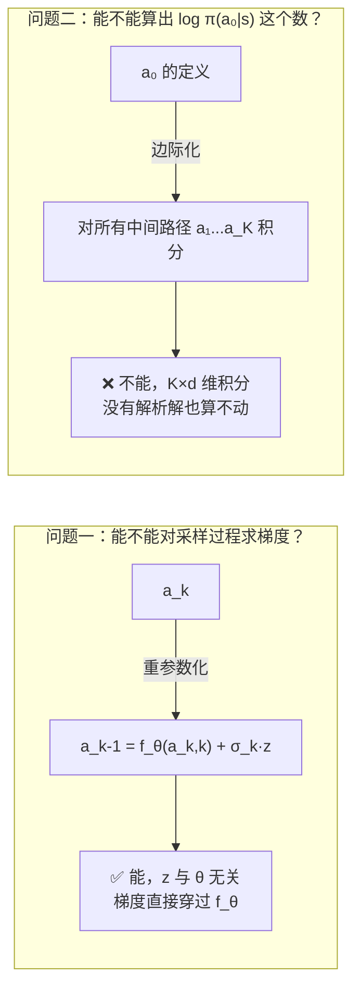
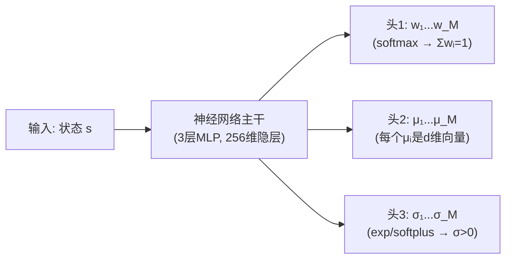
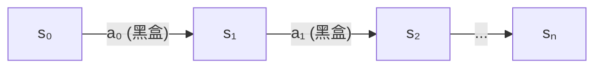
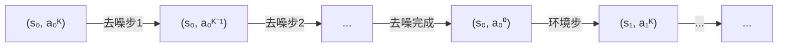
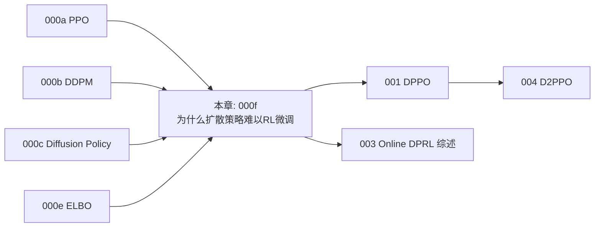

# 前置知识：为什么扩散策略难以 RL 微调——DPPO 的动机深度解析

> **为什么要读这篇**：DPPO 论文的核心动机是"扩散策略很难用 RL 微调"。但**为什么难**这个问题，现有笔记只用几句话带过。本章用大量类比、数学直觉和对比实验，彻底讲清楚这个"难"到底难在哪里，为什么之前的方法都不行，以及 DPPO 的解法为什么是对的。
> **前置要求**：读完 000a（PPO）、000b（DDPM）、000c（Diffusion Policy）、000e（ELBO）

**标签**: `#前置知识` `#扩散策略` `#RL微调` `#动机分析` `#对数似然` `#策略梯度` `#DPPO动机`

## 知识链接

| 前置阅读 | 后续阅读 |
|---------|---------|
| [000a 策略梯度与PPO](./000a_前置知识_策略梯度与PPO.md) | [001 DPPO 扩散策略策略优化](/论文综述/001_DPPO_扩散策略策略优化.md) |
| [000b 扩散模型DDPM](./000b_前置知识_扩散模型DDPM.md) | [003 Online DPRL 综述](/论文综述/003_Online_DPRL_综述_扩散策略与在线RL.md) |
| [000c Diffusion Policy](./000c_前置知识_Diffusion_Policy.md) | [004 D2PPO 解决表示坍塌](/论文综述/004_D2PPO_解决表示坍塌.md) |
| [000e 对数似然与变分下界](./000e_前置知识_对数似然与变分下界.md) | [000g Flow Matching](./000g_前置知识_Flow_Matching与连续归一化流.md) |

---

## 第零部分：先澄清一个最常见的误解——"不可微" 不是问题所在

**很多人第一次听到"扩散策略难以 RL 微调"，第一反应是**："扩散模型不就是很多步去噪吗？梯度肯定没法穿过那么多步，是不是某一步不可微分？"

这个直觉是**错的**，而且错得很关键——如果不先纠正它，后面所有的推导都会看起来像"没有必要的数学游戏"。这一节只讲一件事：把"能不能求梯度"和"能不能算出一个数"这两件完全不同的事分开。

### 0.1 去噪链的每一步都是可微的——这件事早就有人证明了

判断"某一步是不是不可微"，不需要猜，直接看结果：**如果哪一步真的不可微，梯度就传不过去，那种依赖梯度穿过整条去噪链的方法根本不可能存在。** 但这类方法确实存在，而且是 2023 年扩散策略 RL 微调的主流方案——DQL（Diffusion Q-Learning）就是直接把 Q 值的梯度，反向传播穿过全部 $K$ 步去噪，一路传到网络参数 $\theta$（细节见第四部分）。这个方法能跑通，就是"每一步都可微"最直接的反证。

可微性靠的是一个叫**重参数化（reparameterization trick）**的技巧，本文第 1.2 节推导高斯策略采样时已经用过一次：不直接说"从分布里随机抽一个数"，而是写成"确定性函数 + 与参数无关的噪声"：

$$
a_{k-1} = f_\theta(a_k, k) + \sigma_k \cdot z, \qquad z \sim \mathcal{N}(0, I)
$$

**这个公式在做什么**：把"从一个分布里随机抽一个数"改写成"确定性网络算一个值，再加上一个和参数无关的固定噪声"——这样一来对参数求导时，随机的部分直接当常数跳过，只需要对确定性部分求导。

::: details 📐 公式详解（点击展开）

| 子表达式 | 它是谁 | 它在干嘛 |
|---------|--------|---------|
| $f_\theta(a_k, k)$ | **去噪网络给出的中心点** | 网络看到当前噪声动作 $a_k$ 和步数 $k$，算出"去噪后应该在哪个位置"——这部分依赖参数 $\theta$，可以正常求梯度 |
| $\sigma_k$ | **这一步的噪声强度** | 由扩散调度表提前定好的固定数字，不是网络学出来的 |
| $z \sim \mathcal{N}(0,I)$ | **提前采好的"骰子"** | 标准高斯噪声，采样时先掷出来，和 $\theta$ 完全没关系——对 $\theta$ 求导时它是常数 |
| $a_{k-1}$ | **这一步去噪的输出** | 中心点加上噪声扰动，得到稍微干净一点的版本 |

**用人话读**："不说'随机抽一个 $a_{k-1}$'，而是说'先算出一个确定的中心点，再加上一个提前掷好的固定噪声'——这样求梯度时，噪声部分不挡路，只用对中心点那部分求导。"

**为什么要这样改写**：如果直接写"$a_{k-1}$ 从分布 $\mathcal{N}(f_\theta, \sigma_k^2 I)$ 里采样"，采样操作本身包含一个不依赖 $\theta$ 就无法求导的随机步骤；重参数化把随机性剥离成一个和 $\theta$ 无关的外部输入 $z$，采样操作就变成了纯粹的确定性计算，梯度自然能穿过去。
:::

$z$ 是提前采好的标准噪声，和参数 $\theta$ 完全无关。于是 $a_{k-1}$ 对 $\theta$ 求导时，随机性 $z$ 是常数，梯度只需要穿过确定性部分 $f_\theta$——这和对一个普通的多层网络求梯度没有本质区别。扩散链的 $K$ 步去噪，就是把这个技巧串联了 $K$ 次。所以：

> **去噪链的每一步，对 $\theta$ 求梯度都没有障碍。**

### 0.2 真正的障碍：策略梯度要的不是梯度，是一个数值

策略梯度公式（下面 1.1 节会详细拆解）里需要的是 $\log \pi_\theta(a_0|s)$——**注意这是一个具体的数字**（给定状态 $s$ 和最终动作 $a_0$，输出一个标量），不是"对 $a_0$ 求梯度"，也不是"对 $\theta$ 求梯度"。你必须先有这个数字，才谈得上对它求梯度。

问题出在**这个数字的定义本身**。因为动作 $a_0$ 不是网络直接吐出来的，中间经过了 $K$ 步随机去噪（$a_K \to a_{K-1} \to \cdots \to a_0$），任何一条从 $a_K$ 出发、最终落在同一个 $a_0$ 上的路径都对这个概率有贡献。按定义，你必须把**所有**这样的路径的概率都加起来（连续空间中就是积分）：

$$
\pi_\theta(a_0|s) = \int \cdots \int p(a_K) \prod_{k=1}^{K} p_\theta(a_{k-1}|a_k, s) \; da_1 \, da_2 \cdots da_K
$$

**这个公式在做什么**：定义"最终动作 $a_0$ 的概率密度是多少"——因为 $a_0$ 是从噪声出发经过 $K$ 步随机去噪才走到的，所以要把所有能走到 $a_0$ 的中间路径 $(a_1, ..., a_K)$ 的概率全部加起来（连续空间中就是积分）。

::: details 📐 公式详解（点击展开）

| 子表达式 | 它是谁 | 它在干嘛 |
|---------|--------|---------|
| $p(a_K)$ | **起点的概率** | 纯噪声 $a_K$ 服从标准高斯，这是去噪链的出发点，概率密度已知且固定 |
| $\prod_{k=1}^{K} p_\theta(a_{k-1}\|a_k, s)$ | **整条去噪链的联合概率** | 把 $K$ 步去噪各自的条件概率连乘起来——"从纯噪声一路走到 $a_0$，每一步都恰好这样走"的概率 |
| $\int \cdots \int (\cdot) \, da_1 \cdots da_K$ | **对所有可能路径求和** | $a_0$ 固定，但中间经过的 $a_1, ..., a_K$ 可以是无穷多种取值——把它们全部积掉，才能得到"不管走哪条路，只要终点是 $a_0$"的总概率 |
| $\pi_\theta(a_0\|s)$ | **要求的最终答案** | 在状态 $s$ 下，扩散策略输出恰好是 $a_0$ 这个具体动作的概率密度 |

**用人话读**："$a_0$ 这个动作的概率 = 把所有'从纯噪声出发、经过 $K$ 步随机游走、最终恰好落在 $a_0$ 上'的路径的概率，全部加起来。"

**为什么必须积分而不能只看最后一步**：$a_0$ 不是一步生成的，它是整条随机路径的终点。任何一条中间路径不同但终点相同的轨迹，都对"$a_0$ 出现的概率"有贡献，按概率论的边际化（marginalization）规则必须全部计入，漏掉任何一条都会让这个概率算错。
:::

这是一个 $K \times d$ 维的积分（$K$ 是去噪步数，$d$ 是动作维度）——**这是一个"求值"问题，不是"求导"问题**。就算每一步 $p_\theta(a_{k-1}|a_k,s)$ 都是简单的高斯、对 $\theta$ 求导毫无困难，把 $K$ 个这样的高斯乘起来再对 $K\times d$ 个中间变量积分，依然没有已知的解析公式，也没有能在几百维空间里快速算出数值的方法（第一部分末尾、第三部分会具体展开为什么连近似都不好用）。

### 0.3 一张图分清两条不同的路

```mermaid
flowchart LR
    subgraph Q1["问题一：能不能对采样过程求梯度？"]
        A1["a_k"] -->|"重参数化"| A2["a_k-1 = f_θ(a_k,k) + σ_k·z"] --> A3["✅ 能，z 与 θ 无关<br/>梯度直接穿过 f_θ"]
    end
    subgraph Q2["问题二：能不能算出 log π(a₀|s) 这个数？"]
        B1["a₀ 的定义"] -->|"边际化"| B2["对所有中间路径 a₁...a_K 积分"] --> B3["❌ 不能，K×d 维积分<br/>没有解析解也算不动"]
    end
```

**用一句话总结这一节**：去噪链的可微性从来不是瓶颈；真正卡住策略梯度的，是"最终动作的概率密度"这个数字本身，其定义要求解一个做不出来的高维积分。DQL 之类的方法绕过了"算这个数"，但要付出别的代价（第四部分会讲）；DPPO 选择直接把这个数拆成一步步能算的小块（第六部分）。带着这个区分往下读，后面所有推导的目的就会变得非常清楚：**它们都是在回答"log π(a₀|s) 这个数到底难在哪、能不能换种方式算出来"，而不是在讨论梯度传不传得过去。**

---

## 第一部分：问题的根源——策略梯度需要什么

### 1.1 回忆策略梯度的核心公式

RL 微调的主力工具是策略梯度。不管是 REINFORCE、A2C 还是 PPO，都需要一个东西：

$$
\nabla_\theta J(\theta) = \mathbb{E}_{(s,a)\sim\pi_\theta} \left[ \nabla_\theta \log \pi_\theta(a|s) \cdot A(s,a) \right]
$$

**这个公式在做什么**：告诉你想让策略变好该往哪个方向调参数——用"这个动作有多好"去加权"怎么调参数能让这个动作概率变大"的方向，两者一乘再对所有采样取平均，就是参数更新的方向。

::: details 📐 公式详解（点击展开）

| 子表达式 | 它是谁 | 它在干嘛 |
|---------|--------|---------|
| $A(s,a)$ | **动作打分器** | 这个动作比状态 $s$ 下平均水平好多少，正=好动作，负=差动作 |
| $\nabla_\theta \log \pi_\theta(a|s)$ | **调参数方向盘** | 告诉你往哪个方向微调 $\theta$，能让这个动作的概率变大 |
| $\nabla_\theta \log \pi_\theta(a|s) \cdot A(s,a)$ | **带权重的更新方向** | 好动作（$A>0$）就朝它的方向盘方向走，差动作（$A<0$）就往反方向走 |
| $\mathbb{E}_{(s,a)\sim\pi_\theta}[\cdot]$ | **采样平均** | 实际训练中用当前策略采集一批 $(s,a)$，对这批样本取平均近似期望 |

**用人话读**："对采样到的每个状态动作对，用'这个动作有多好'当权重，去乘'怎么调参数能让这个动作更可能发生'的方向，平均起来就是参数该走的方向。"

**为什么是这个形式**：这是策略梯度定理的标准形式——它保证了只要能采样、能算 $\log \pi$ 的梯度，就能不需要环境模型地估计出让期望回报上升的方向。
:::

这个公式说的是：想让策略变好，你需要**对每个采样到的 $(s,a)$ 对**计算两个量：

1. $A(s,a)$：这个动作比平均水平好多少（Advantage）
2. $\nabla_\theta \log \pi_\theta(a|s)$：怎么调参数才能让这个动作的概率变大

第 1 个量（Advantage）和策略的表示形式无关——不管你用高斯策略、GMM 还是扩散策略，Advantage 都一样算。

**第 2 个量才是问题的根源。** 你必须能算出 $\log \pi_\theta(a|s)$——策略在状态 $s$ 下输出动作 $a$ 的对数概率密度。

### 1.2 高斯策略（Gaussian Policy）——最常见的策略表示

#### 什么是高斯策略

高斯策略的意思是：**给定一个状态 $s$，策略输出的动作 $a$ 服从一个高斯（正态）分布。**

$$
\pi_\theta(a|s) = \mathcal{N}(a;\, \mu_\theta(s),\, \Sigma)
$$

**这个公式在做什么**：定义"策略"这个词到底是什么——给定状态，网络输出一个高斯分布的中心和散布程度，动作就从这个分布里随机抽一个。

::: details 📐 公式详解（点击展开）

| 子表达式 | 它是谁 | 它在干嘛 |
|---------|--------|---------|
| $\pi_\theta(a\vert s)$ | **策略本身** | 参数为 $\theta$ 的策略，回答"状态 $s$ 下动作 $a$ 出现的概率密度是多少" |
| $\mu_\theta(s)$ | **瞄准器** | 一个神经网络，输入状态，输出"最可能的动作"（分布中心） |
| $\Sigma$ | **散布控制器** | 协方差矩阵，决定动作围绕中心随机波动的范围 |
| $\mathcal{N}(a;\mu,\Sigma)$ | **高斯打分函数** | 给定中心和散布程度，回答"具体动作 $a$ 落在这里的概率密度是多少" |

**用人话读**："网络看到状态后，先猜一个最可能的动作作为中心，再围绕这个中心加一点随机噪声，最终动作就是中心加噪声。"

**为什么是这个形式**：高斯分布有解析的概率密度公式、采样简单（重参数化技巧）、且是许多连续控制任务里最自然的"以某点为中心的随机探索"模型。
:::

#### 实际中的简化：对角协方差

完整的协方差矩阵 $\Sigma$ 是 $d \times d$ 的矩阵（$d$ = 动作维度），参数太多。实际中几乎所有人用**对角协方差**：

$$
\Sigma = \text{diag}(\sigma_1^2, \sigma_2^2, \ldots, \sigma_d^2) = \sigma^2 \cdot I \quad\text{（更简化：所有维度共享一个 } \sigma \text{）}
$$

**这个公式在做什么**：把参数量巨大的满协方差矩阵简化成"只保留对角线"——每个动作维度只有自己的方差，维度之间没有耦合。

::: details 📐 公式详解（点击展开）

| 子表达式 | 它是谁 | 它在干嘛 |
|---------|--------|---------|
| $\text{diag}(\sigma_1^2,\ldots,\sigma_d^2)$ | **独立方差清单** | 只记录每个维度自己的方差，维度之间的协方差直接设为 0 |
| $\sigma^2 \cdot I$ | **共享方差的极简版** | 更进一步简化：所有维度用同一个 $\sigma$，只需要存一个数字 |

**用人话读**："不记录动作维度之间的相关性，每个维度各自有一个独立的随机波动幅度，甚至可以让所有维度共用同一个幅度。"

**为什么是这个形式**：满协方差矩阵有 $O(d^2)$ 个参数，对角化后只需要 $O(d)$ 甚至 $O(1)$，工程上大幅降低复杂度，代价是放弃了维度间相关性的建模能力。
:::

此时各维度**独立**，概率密度可以分解为各维度的乘积：

$$
\pi_\theta(a|s) = \prod_{i=1}^{d} \frac{1}{\sqrt{2\pi\sigma_i^2}} \exp\!\left(-\frac{(a_i - \mu_i(s))^2}{2\sigma_i^2}\right)
$$

**这个公式在做什么**：因为各维度独立，联合概率密度就是每个维度概率密度的乘积——算整体概率只需要逐维算完再相乘。

::: details 📐 公式详解（点击展开）

| 子表达式 | 它是谁 | 它在干嘛 |
|---------|--------|---------|
| $\prod_{i=1}^{d}$ | **逐维累乘器** | 把 $d$ 个维度各自的概率密度乘起来（独立变量联合概率的标准做法） |
| $\frac{1}{\sqrt{2\pi\sigma_i^2}}$ | **第 $i$ 维归一化常数** | 保证第 $i$ 维单独积分等于 1 |
| $\exp\!\left(-\frac{(a_i-\mu_i(s))^2}{2\sigma_i^2}\right)$ | **第 $i$ 维的钟形曲线** | 动作第 $i$ 维离网络预测的中心 $\mu_i(s)$ 越远，这一项越小 |

**用人话读**："把动作的每个维度单独看成一个高斯变量，算出每维各自的概率密度，再把 $d$ 个数字乘起来就是整体概率密度。"

**为什么是这个形式**：独立随机变量的联合概率密度定义就是各自密度的乘积，这是概率论的基本性质，不是额外假设出来的近似。
:::

#### 数值例子

假设一个 2 关节机器人：

- 状态 $s = [\text{关节1角度}=30°,\, \text{关节2角度}=45°,\, \text{目标位置}=(0.5, 0.3)]$
- 动作 $a = [\text{关节1扭矩},\, \text{关节2扭矩}]$，维度 $d=2$

网络输出：

- $\mu_\theta(s) = [2.5,\, -1.3]$ ← "最可能的动作"（均值）
- $\sigma = [0.2,\, 0.15]$ ← "随机性"（标准差）

策略说的是：

- 关节1扭矩 $\sim \mathcal{N}(2.5,\, 0.04)$ ← 以 2.5 为中心，标准差 0.2
- 关节2扭矩 $\sim \mathcal{N}(-1.3,\, 0.0225)$ ← 以 -1.3 为中心，标准差 0.15

采样一次得到的动作可能是：

$$
a = [2.5 + 0.2 \times z_1,\; -1.3 + 0.15 \times z_2], \quad z_1, z_2 \sim \mathcal{N}(0,1)
$$

**这个公式在做什么**：展示"重参数化"采样——不直接从高斯分布里抽样，而是先抽标准噪声再做线性变换，这样采样过程对 $\mu,\sigma$ 可导。

::: details 📐 公式详解（点击展开）

| 子表达式 | 它是谁 | 它在干嘛 |
|---------|--------|---------|
| $z_1, z_2 \sim \mathcal{N}(0,1)$ | **标准噪声源** | 从最简单的标准正态分布里抽两个随机数，和网络参数无关 |
| $2.5 + 0.2 \times z_1$ | **关节1的实际扭矩** | 均值 2.5 加上按标准差缩放的噪声，得到关节1的具体采样值 |
| $-1.3 + 0.15 \times z_2$ | **关节2的实际扭矩** | 同理，均值 -1.3 加上按标准差缩放的噪声 |

**用人话读**："先抽两个标准噪声，把它们按各自的标准差放大后加到网络预测的均值上，就得到了具体执行的动作。"

**为什么是这个形式**：这种"重参数化技巧"把随机性从 $\mu,\sigma$ 中剥离出来，让采样操作对参数可导，是训练随机策略网络能反向传播的关键技巧。
:::

比如 $z_1=0.7,\, z_2=-0.4$，则 $a = [2.64,\, -1.36]$。

#### log-probability 的推导（关键！PPO 需要的量）

**先说结论，再看推导**：高斯分布的概率密度是"归一化常数 × 一个指数"的形式，取对数之后，指数直接消失（因为 $\log \exp(x) = x$），只剩下加减乘除——这就是高斯策略的 $\log \pi$ 能有闭式解的根本原因。

写出多维高斯的概率密度（对角协方差，$\sigma$ 各维度相同的简化情况），两边取 $\log$ 并利用 $\log(A\cdot B)=\log A+\log B$、$\log\exp(x)=x$ 化简：

$$
\pi_\theta(a|s) = \frac{1}{(2\pi\sigma^2)^{d/2}} \exp\!\left(-\frac{\|a - \mu_\theta(s)\|^2}{2\sigma^2}\right)
\quad\Longrightarrow\quad
\log \pi_\theta(a|s) = \underbrace{-\frac{\|a - \mu_\theta(s)\|^2}{2\sigma^2}}_{\text{数据依赖项（和 } a, s \text{ 有关）}} - \underbrace{\frac{d}{2}\log(2\pi\sigma^2)}_{\text{常数项（和 } a, s \text{ 无关）}}
$$

**这个公式在做什么**：高斯密度取对数后，指数直接消失（$\log\exp(x)=x$），只剩下加减乘除——这是高斯策略 $\log \pi$ 能有闭式解的原因，也是策略梯度能直接用在高斯策略上的根本前提。

::: details 📐 公式详解（点击展开）

| 子表达式 | 它是谁 | 它在干嘛 |
|---------|--------|---------|
| $-\frac{\|a-\mu_\theta(s)\|^2}{2\sigma^2}$ | **动作打分主项** | 动作离预测中心越远，这一项越负，log 概率越小 |
| $-\frac{d}{2}\log(2\pi\sigma^2)$ | **维度惩罚常数** | 和具体动作 $a$ 无关，只和方差、维度有关，对 $\theta$ 求梯度时如果 $\sigma$ 固定这一项梯度为 0 |

**用人话读**："高斯策略的对数概率 = 一个负的距离惩罚项，加一个只依赖方差和维度的常数项。"

**为什么是这个形式**：这是高斯密度公式取对数化简后的必然结果，之所以重要，是因为它是一个封闭形式的解析表达式——没有积分、没有求和，直接算。
:::

**为什么这个公式对 PPO 来说完美**：

1. 给定 $(s, a)$，一个公式直接算出 $\log \pi$——$O(d)$ 计算量
2. 对 $\theta$ 可导——因为 $\mu_\theta(s)$ 是神经网络输出，反向传播直接给出 $\nabla_\theta \log \pi$
3. 数值稳定——没有积分、没有求和上溢、没有指数爆炸

#### PPO 中怎么用

PPO 需要计算"概率比" $r(\theta)$：

$$
r(\theta) = \frac{\pi_{\theta_\text{new}}(a|s)}{\pi_{\theta_\text{old}}(a|s)}
$$

**这个公式在做什么**：算出"新策略比旧策略更喜欢这个动作多少倍"——这是 PPO 用来控制更新步幅的核心量。

::: details 📐 公式详解（点击展开）

| 子表达式 | 它是谁 | 它在干嘛 |
|---------|--------|---------|
| $\pi_{\theta_\text{new}}(a\vert s)$ | **更新后的偏好** | 用刚更新过的参数算出的动作概率密度 |
| $\pi_{\theta_\text{old}}(a\vert s)$ | **更新前的偏好** | 采样这批数据时用的旧参数算出的动作概率密度 |
| $r(\theta)$ | **偏好倍数** | 两者相除，$>1$ 说明新策略更喜欢这个动作，$<1$ 说明更不喜欢 |

**用人话读**："看新参数和旧参数对同一个动作的喜欢程度，算出一个倍数，这个倍数就是概率比。"

**为什么是这个形式**：这是重要性采样的比值，用旧策略采的样本去估计新策略下的期望时，必须用这个比值做矫正。
:::

代入上面的闭式解，两个 $\log \pi$ 相减、常数项直接抵消，取对数后的比值只剩距离项之差：

$$
\log r(\theta) = \log \pi_\text{new}(a|s) - \log \pi_\text{old}(a|s) = \frac{-\|a - \mu_\text{new}\|^2 + \|a - \mu_\text{old}\|^2}{2\sigma^2}
$$

**这个公式在做什么**：把概率比的计算转成对数域的减法——避免直接算两个可能极小的概率数值再做除法，数值上更稳定。

::: details 📐 公式详解（点击展开）

| 子表达式 | 它是谁 | 它在干嘛 |
|---------|--------|---------|
| $\log \pi_\text{new}(a\vert s) - \log \pi_\text{old}(a\vert s)$ | **对数域的比值** | 减法在对数域等价于原始域的除法，避免了直接相除的数值风险 |
| $\frac{-\|a-\mu_\text{new}\|^2+\|a-\mu_\text{old}\|^2}{2\sigma^2}$ | **代入闭式解后的结果** | 把上面的高斯 $\log\pi$ 闭式解代入两次相减，常数项抵消，只剩距离项之差 |

**用人话读**："新旧策略的对数概率相减就是对数比值，代入高斯公式后发现常数项直接抵消了，只剩下两个距离平方的差。"

**为什么是这个形式**：对数减法比直接做除法在数值上更稳定，且高斯闭式解让这一步只需要几次乘减法，没有任何积分或数值优化。
:::

然后 $r(\theta) = \exp(\log r(\theta))$。

全程只有加减乘除和 $\exp$，没有任何积分。每个样本 $O(d)$ 时间。一批 10000 个样本？$10000 \times O(d)$ → 毫秒级。

#### 高斯策略的致命缺陷

高斯策略是**单峰的**（只有一个"中心"）。

问题场景：状态 $s$ 是机器人面前有障碍物，合理动作是走左边（$a=-2$）或走右边（$a=+2$）。

如果训练数据里一半走左一半走右：MSE loss 最小化 → $\mu$ 收敛到平均值 0 → 策略输出 $a \approx 0$ → 走中间 → 撞墙！

这就是"**模式平均**"问题。单峰分布不能表示多个不连续的"正确答案"。下图直接画出这两种分布长什么样：

> 红色曲线是高斯策略：均值被两侧数据拉到 0，概率质量全堆在障碍物正前方。蓝色曲线是 GMM：两个独立的峰分别对应"走左"和"走右"，中间（危险区域）概率几乎为 0。

---

### 1.3 GMM 策略（Gaussian Mixture Model Policy）——多模态的解决方案

#### 什么是 GMM

GMM = 高斯混合模型 = **把多个高斯分布加权混合在一起**。

$$
\pi_\theta(a|s) = \sum_{i=1}^{M} w_i(s) \cdot \mathcal{N}(a;\, \mu_i(s),\, \sigma_i^2(s))
$$

**这个公式在做什么**：把多个高斯"山丘"按权重叠加成一个多峰分布——解决单个高斯只能表示一个"正确答案"的问题。

::: details 📐 公式详解（点击展开）

| 子表达式 | 它是谁 | 它在干嘛 |
|---------|--------|---------|
| $w_i(s)$ | **第 $i$ 个模式的可信度** | 网络根据状态输出的权重，表示"这个模式被选中的概率" |
| $\mathcal{N}(a;\mu_i(s),\sigma_i^2(s))$ | **第 $i$ 座山丘** | 一个独立的高斯分布，有自己的中心和散布范围 |
| $\sum_{i=1}^{M} w_i(s) \cdot (\cdot)$ | **加权叠山** | 把 $M$ 座山丘按各自的可信度叠加起来，形成最终的多峰地形 |

**用人话读**："网络先给出 $M$ 个可能的'正确答案'各自的位置和置信度，再把它们按置信度叠加成一个可能有多个峰的分布。"

**为什么是这个形式**：混合模型是表示多模态分布最简单直接的方式——用有限个已知形状（高斯）的加权组合去逼近任意形状的多峰分布。
:::

**直觉理解**：

- 高斯策略：只有一个"山丘"（一个 peak）
- GMM 策略：有 $M$ 个"山丘"，每个山丘有自己的位置和高度

例子（$M=2$，$d=1$）：

- 分量1：$w_1=0.6,\, \mu_1=-2,\, \sigma_1=0.3$ ← 走左边（概率60%）
- 分量2：$w_2=0.4,\, \mu_2=+2,\, \sigma_2=0.3$ ← 走右边（概率40%）

总分布：$0.6 \cdot \mathcal{N}(-2,\, 0.09) + 0.4 \cdot \mathcal{N}(+2,\, 0.09)$ → 两个峰！不会被平均成 0！

采样时：60% 概率出 $\approx -2$ 的动作，40% 概率出 $\approx +2$ 的动作。

#### 网络结构

```mermaid
graph LR
    S["输入: 状态 s"] --> Backbone["神经网络主干<br/>(3层MLP, 256维隐层)"]
    Backbone --> H1["头1: w₁...w_M<br/>(softmax → Σwᵢ=1)"]
    Backbone --> H2["头2: μ₁...μ_M<br/>(每个μᵢ是d维向量)"]
    Backbone --> H3["头3: σ₁...σ_M<br/>(exp/softplus → σ>0)"]
```

参数量对比：

- 高斯策略：网络输出 $d$ 个均值 + $d$ 个方差 = $2d$ 个数
- GMM（$M=5$）：网络输出 5 个权重 + $5d$ 个均值 + $5d$ 个方差 = $5 + 10d$ 个数
- $d=7$ 时：高斯 = 14，GMM = 75 → 多了 5 倍输出量，但网络只是输出层大了

#### GMM 的采样过程

从 GMM 中采样一个动作：

1. **步骤 1**：根据权重 $[w_1, w_2, \ldots, w_M]$ 抽一个分量编号 $i$。比如 $w=[0.3, 0.5, 0.2]$ → 50% 概率选分量 2
2. **步骤 2**：从选中的分量 $\mathcal{N}(\mu_i, \sigma_i^2)$ 中采样：$a = \mu_i + \sigma_i \cdot z$，其中 $z \sim \mathcal{N}(0, I)$

整个过程：先"选一个模式"，再"在那个模式里加噪声"。

#### log-probability 的推导（详细版）

GMM 的概率密度是各分量密度的加权求和。把每个高斯分量展开成解析式后代入：

$$
\pi_\theta(a|s) = \sum_{i=1}^{M} w_i \cdot \mathcal{N}(a;\, \mu_i,\, \sigma_i^2) = \sum_{i=1}^{M} w_i \cdot \frac{1}{(2\pi\sigma_i^2)^{d/2}} \cdot \exp\!\left(-\frac{\|a - \mu_i\|^2}{2\sigma_i^2}\right)
$$

**这个公式在做什么**：把 GMM 密度写成"各分量加权求和"的完整展开式，为下一步取对数做准备。

::: details 📐 公式详解（点击展开）

| 子表达式 | 它是谁 | 它在干嘛 |
|---------|--------|---------|
| $w_i \cdot \mathcal{N}(a;\mu_i,\sigma_i^2)$ | **第 $i$ 个分量的贡献** | 这个分量本身的密度乘上它被选中的权重 |
| $\frac{1}{(2\pi\sigma_i^2)^{d/2}} \exp\!\left(-\frac{\|a-\mu_i\|^2}{2\sigma_i^2}\right)$ | **第 $i$ 分量的具体形式** | 就是标准的多维高斯密度公式，和推导高斯策略时完全一样 |
| $\sum_{i=1}^M(\cdot)$ | **总贡献汇总** | 把所有分量的贡献加起来，得到总概率密度 |

**用人话读**："总概率密度等于每个分量的概率密度乘各自权重后加起来，每个分量本身套用标准高斯公式。"

**为什么是这个形式**：混合分布的密度定义就是加权求和，这是混合模型的数学定义，不是推导出来的。
:::

现在两边取 $\log$——**问题就在这里**：单个高斯取 $\log$ 时，$\log(A\cdot B)=\log A+\log B$ 能把乘法拆成加法，指数被消掉。但 GMM 的 $\log$ 是套在**求和**外面的，$\log(A+B) \neq \log A+\log B$，没有办法把 $\log$ 分配到每一项里去：

$$
\log \pi_\theta(a|s) = \log\!\left( \sum_{i=1}^{M} w_i \cdot \frac{1}{(2\pi\sigma_i^2)^{d/2}} \cdot \exp\!\left(-\frac{\|a - \mu_i\|^2}{2\sigma_i^2}\right) \right)
$$

**这个公式在做什么**：对 GMM 密度取对数，暴露出一个关键困难——log 套在求和外面，不能像单个高斯那样直接拆开化简，需要专门的数值技巧（下面的 LogSumExp）来算。

::: details 📐 公式详解（点击展开）

| 子表达式 | 它是谁 | 它在干嘛 |
|---------|--------|---------|
| $\log\!\left(\sum_i(\cdot)\right)$ | **卡住的对数** | 对数作用在求和上，不能用 $\log(AB)=\log A+\log B$ 拆开，因为这里是加法不是乘法 |

**用人话读**："GMM 的对数概率没有像单高斯那样的简单闭式解，因为对数不能穿透求和符号。"

**为什么是这个形式**：$\log(A+B) \neq \log A + \log B$ 是对数的基本限制，这就是为什么 GMM 需要 LogSumExp 技巧而不能直接化简的原因。
:::

#### 实际计算：LogSumExp 技巧

直接算会有数值问题：$\exp$ 里的值可能非常大或非常小，容易上溢/下溢。解决办法分两步：

**第一步**，先把每个分量的"权重 × 高斯密度"整体转到对数域，得到一个 log 贡献值 $\log c_i$（直接套用前面推导的单高斯 $\log \pi$ 闭式解）：

$$
\log c_i = \log(w_i) + \log \mathcal{N}(a;\, \mu_i,\, \sigma_i^2) = \log(w_i) - \frac{\|a - \mu_i\|^2}{2\sigma_i^2} - \frac{d}{2}\log(2\pi\sigma_i^2)
$$

**这个公式在做什么**：给每个分量单独算一个"log 贡献值"——先在对数域里把每一项算清楚，避免过早地做指数运算导致数值溢出。

::: details 📐 公式详解（点击展开）

| 子表达式 | 它是谁 | 它在干嘛 |
|---------|--------|---------|
| $\log c_i$ | **第 $i$ 分量的对数贡献** | 权重的对数加上该分量高斯密度的对数，是后面 LogSumExp 的输入 |
| $\log(w_i)$ | **权重的对数** | 权重本身在 $(0,1)$ 之间，取对数后是负数，权重越小越负 |
| $-\frac{\|a-\mu_i\|^2}{2\sigma_i^2} - \frac{d}{2}\log(2\pi\sigma_i^2)$ | **该分量高斯密度的对数** | 就是之前推导的单高斯 $\log \pi$ 闭式解，直接套用 |

**用人话读**："每个分量的'log 贡献'等于它的权重取对数，再加上它自己作为一个高斯分布的对数概率。"

**为什么是这个形式**：先把每一项转成对数域再统一处理，是避免多个可能极小的概率值直接相乘/相加导致数值下溢的标准做法。
:::

**第二步**，$\log \pi_\theta(a|s) = \log(\sum_i \exp(\log c_i))$ 直接算还是可能溢出，所以先减去最大值 $m=\max_i(\log c_i)$ 把所有指数输入拉到 $\leq 0$ 的安全区间，算完再加回来：

$$
\log \pi_\theta(a|s) = m + \log\!\left(\sum_i \exp(\log c_i - m)\right), \qquad m = \max(\log c_1, \ldots, \log c_M)
$$

**这个公式在做什么**：给出数值稳定版的 GMM 对数概率计算公式——这就是实际代码里真正会写的那一行。

::: details 📐 公式详解（点击展开）

| 子表达式 | 它是谁 | 它在干嘛 |
|---------|--------|---------|
| $\log c_i - m$ | **相对偏移量** | 每个分量的 log 贡献减去最大值，结果永远 $\leq 0$ |
| $\exp(\log c_i - m)$ | **安全的指数值** | 因为指数的输入 $\leq 0$，结果落在 $(0,1]$，不会溢出 |
| $m + \log(\sum_i(\cdot))$ | **补偿回真实尺度** | 把减掉的 $m$ 加回来，还原成正确的对数概率值 |

**用人话读**："先把每个分量的 log 值都减去最大的那个再取指数（这样绝不会爆炸），加起来取对数后再把之前减掉的值加回来。"

**为什么是这个形式**：这是标准的 LogSumExp 数值稳定化技巧——数学上和直接计算完全等价，但避免了浮点数上溢/下溢。
:::

因为 $\log c_i - m \leq 0$，所以 $\exp(\log c_i - m) \in (0, 1]$，不会溢出。

#### 数值例子

$M=3$ 个分量，$d=2$ 维动作，动作 $a=[1.0,\, 0.5]$。用前面推导的 $\log c_i$ 公式逐个分量代入计算：

| 分量 | 参数 | $\log(w_i)$ | 高斯密度项 | $\log c_i$ | 备注 |
|------|------|:---:|:---:|:---:|------|
| 1 | $w_1=0.5,\mu_1=[1.2,0.3],\sigma_1=0.3$ | $-0.693$ | $-1.783$ | $-2.476$ | 动作离中心较近 |
| 2 | $w_2=0.3,\mu_2=[0.0,2.0],\sigma_2=0.5$ | $-1.204$ | $-7.258$ | $-8.462$ | 动作离中心很远，贡献几乎为 0 |
| 3 | $w_3=0.2,\mu_3=[0.9,0.6],\sigma_3=0.2$ | $-1.609$ | $+0.282$ | $-1.327$ | 动作离中心极近且方差小，密度反而最高 |

**关键观察**：权重最小（20%）的分量3，因为离动作最近、方差最小（分布最尖），反而贡献了最大的密度值——权重不是唯一决定因素。

代入 LogSumExp 公式，$m = \max(-2.476, -8.462, -1.327) = -1.327$（分量3胜出，作为锚点）：

$$
\log \pi_\theta(a|s) = m + \log\!\left(\sum_i \exp(\log c_i - m)\right) = -1.327 + \log\!\left(e^{-1.149} + e^{-7.135} + e^{0}\right) = -1.327 + 0.276 = -1.051
$$

**这个公式在做什么**：把三个分量的 log 贡献值分别减去锚点、取指数、加起来、取对数、再加回锚点，得到这个具体动作的最终 log 概率——整个过程只有有限次加减乘除和 $\exp$/$\log$，没有任何积分。

::: details 📐 公式详解（点击展开）

| 子表达式 | 它是谁 | 它在干嘛 |
|---------|--------|---------|
| $\log c_i - m$ | **相对偏移量** | 三个分量分别是 $-1.149, -7.135, 0$，其中分量3自己减自己得 0 |
| $e^{-1.149}+e^{-7.135}+e^{0} = 1.318$ | **相对贡献之和** | 三个安全范围内的数直接加起来，不会溢出 |
| $-1.327 + \log(1.318) = -1.051$ | **最终对数概率** | 锚点加上修正项，还原出真实的 $\log \pi_\theta(a\vert s)$ |

**用人话读**："把三个分量的贡献都归到同一个安全的数值范围内加起来，再把之前减掉的锚点加回去，得到最终答案 $-1.051$。"

**为什么是这个形式**：这是 LogSumExp 公式套用具体数字的完整演算，证明这个技巧确实能在数值安全的前提下算出正确的 GMM 对数概率——全程有限次运算，没有积分，这正是 GMM 能用在 PPO 里的原因。
:::

所以 $\log \pi_\theta(a=[1,0.5]\,|\,s) \approx -1.051$，对应 $\pi \approx e^{-1.051} \approx 0.349$。

**关键点：整个计算过程没有任何积分！只有有限次加减乘除和 $\exp$/$\log$。这就是 GMM 能用在 PPO 里的原因。**

#### GMM 的 PPO 概率比

$$
r(\theta) = \frac{\pi_\text{new}(a|s)}{\pi_\text{old}(a|s)}, \quad \log r(\theta) = \log \pi_\text{new}(a|s) - \log \pi_\text{old}(a|s)
$$

**这个公式在做什么**：把高斯策略里推导出的 PPO 概率比公式原样搬到 GMM——唯一的区别是两个 $\log \pi$ 现在要用 LogSumExp 算，而不是简单的闭式解。

::: details 📐 公式详解（点击展开）

| 子表达式 | 它是谁 | 它在干嘛 |
|---------|--------|---------|
| $\pi_\text{new}(a\vert s), \pi_\text{old}(a\vert s)$ | **新旧 GMM 密度** | 分别用新旧参数算出的 GMM 概率密度，两者都要走一遍 LogSumExp 流程 |
| $\log r(\theta)$ | **对数概率比** | 两个 log 概率相减，仍然可以直接算，不需要额外积分 |

**用人话读**："GMM 版本的概率比和高斯版本形式完全一样，只是里面的 $\log \pi$ 用 LogSumExp 算出来，而不是套一个简单公式。"

**为什么是这个形式**：PPO 只关心 $\log \pi$ 这个数字本身，不关心它是怎么算出来的——只要 GMM 能给出一个可算的 $\log \pi$，PPO 的其余部分完全不用改。
:::

两个 $\log \pi$ 各自用 LogSumExp 算出来（如上面的例子），相减得 $\log r$，$r = \exp(\log r)$。

仍然全是解析计算，没有积分。

#### GMM 的局限性

**优势**：

- ✓ 能表示多模态（$M$ 个峰）
- ✓ $\log \pi$ 可以解析计算 → 能用 PPO
- ✓ 比高斯策略表达力更强

**局限**：

- ✗ 模式数 $M$ 需要预先设定（不知道该设多少）
- ✗ 高维空间中 $M$ 个高斯能覆盖的空间有限：$d=56$ 维（action chunk）时，即使 $M=100$，100 个高斯球也只能覆盖 56 维空间的极小部分
- ✗ 各分量之间独立 → 不能表示复杂的相关性
- ✗ 实际实验中，GMM 在 DPPO 论文的复杂任务上效果很差（Transport 任务成功率 $\approx 0\%$）

**为什么扩散策略比 GMM 好**：

- 扩散模型可以表示**任意复杂**的分布（理论上的万能近似）
- 不需要预设模式数
- 天然建模维度间的相关性（因为每步去噪看全部维度）
- 但代价是：采样慢（多步去噪）+ $\log \pi$ 算不出来

#### 三种策略的对比总结

| | 高斯策略 | GMM 策略 | 扩散策略 |
|---|---|---|---|
| 概率密度公式 | $\mathcal{N}(\mu, \sigma^2)$ | $\sum w_i \mathcal{N}(\mu_i, \sigma_i^2)$ | $\int\!\cdots\!\int$ 多步高斯积分 |
| $\log \pi$ 可算? | ✓ 直接公式 | ✓ LogSumExp | ✗ 不可能 |
| 多模态? | ✗ 只有一个峰 | △ M个峰(需预设) | ✓ 任意多模态 |
| 维度间相关性? | ✗ 对角独立 | ✗ 各分量独立 | ✓ 天然建模 |
| 高维表达力? | 差 | 中等 | 强 |
| 采样速度 | $O(1)$ 一次前向 | $O(1)$ 一次前向 | $O(K)$ K次前向 |
| PPO 可用? | ✓ | ✓ | ✗ (需要DPPO展开) |
| 训练稳定性 | 最好 | 中等 | 好(MSE loss) |
| 实际效果(复杂任务) | 中等 | 差 | 最好 |

### 1.4 扩散策略：log π(a|s) 算不出来！

扩散策略的动作生成过程：

$$
\begin{aligned}
a_K &\sim \mathcal{N}(0, I) & &\leftarrow \text{采样纯噪声} \\
a_{K-1} &= \text{denoise}(a_K, s, K) & &\leftarrow \text{去噪第一步} \\
a_{K-2} &= \text{denoise}(a_{K-1}, s, K\!-\!1) & &\leftarrow \text{去噪第二步} \\
&\;\;\vdots \\
a_0 &= \text{denoise}(a_1, s, 1) & &\leftarrow \text{去噪最后一步 → 最终动作}
\end{aligned}
$$

**这个公式在做什么**：展示扩散策略生成一个动作的完整流程——从纯噪声开始，经过 $K$ 次去噪，逐步变成最终动作 $a_0$。

::: details 📐 公式详解（点击展开）

| 子表达式 | 它是谁 | 它在干嘛 |
|---------|--------|---------|
| $a_K \sim \mathcal{N}(0,I)$ | **起点：纯噪声** | 生成过程从一个标准高斯噪声开始，和状态 $s$ 无关 |
| $\text{denoise}(a_k, s, k)$ | **第 $k$ 步去噪器** | 网络看当前带噪动作 $a_k$、状态 $s$、当前步数 $k$，输出去掉一点噪声后的 $a_{k-1}$ |
| $a_0$ | **终点：最终动作** | 经过 $K$ 次去噪后得到的、真正要执行的动作 |

**用人话读**："从一个随机噪声开始，反复用网络一步步去掉噪声，$K$ 步之后得到最终要执行的动作。"

**为什么是这个形式**：这是 DDPM 反向采样过程的标准写法——把生成一个复杂样本的问题拆解成 $K$ 次简单的局部去噪操作，每一步都比直接生成容易得多。
:::

最终动作 $a_0$ 的边际概率：

$$
\pi_\theta(a_0|s) = \int\!\!\int\!\cdots\!\!\int p(a_K) \cdot p_\theta(a_{K-1}|a_K, s) \cdot p_\theta(a_{K-2}|a_{K-1}, s) \cdots p_\theta(a_0|a_1, s)\, da_1\, da_2 \cdots da_K
$$

**这个公式在做什么**：要算出最终动作 $a_0$ 本身的概率密度，必须把所有能生成它的中间路径 $(a_1,\ldots,a_K)$ 的可能性都积掉——这正是问题的死结所在。

::: details 📐 公式详解（点击展开）

| 子表达式 | 它是谁 | 它在干嘛 |
|---------|--------|---------|
| $p(a_K)$ | **起点分布** | 纯噪声的概率密度，是固定已知的标准高斯 |
| $p_\theta(a_{k-1}\vert a_k,s)$ | **单步去噪的条件概率** | 每一步去噪本身是一个（有解析形式的）高斯条件分布 |
| $\int\!\cdots\!\int(\cdot)\,da_1\cdots da_K$ | **对所有中间路径积分** | 把所有可能产生同一个 $a_0$ 的中间轨迹的概率都加起来（积分是连续版的求和） |

**用人话读**："要知道最终动作 $a_0$ 出现的概率，必须把所有能走到它的中间噪声路径的概率全部加起来，而中间路径有无穷多种。"

**为什么是这个形式**：这是隐变量模型的标准边际化公式——每一步条件概率好算，但把它们乘起来再对所有隐变量（中间去噪状态）积分，就是一个高维积分，这正是后面要说明"算不出来"的根源。
:::

**这是一个 $K \times d$ 维的积分**（$K$ = 去噪步数，$d$ = 动作维度）。

具体数字：

- $K = 20$ 步去噪，$d = 14$ 维动作（7关节 × 2手臂）
- 积分维度 $= 20 \times 14 = 280$ 维
- 没有任何已知的方法能精确或高效近似计算 280 维积分

**所以 $\log \pi_\theta(a_0|s)$ 根本算不出来。策略梯度公式的核心量不存在。**

---

## 第二部分：直觉类比——为什么"多步生成"会让概率难算

### 2.1 类比：工厂流水线

想象一个工厂的流水线，有 20 道工序把原材料变成成品：

```mermaid
graph LR
    Raw["原材料<br/>(噪声)"] --> W1["工序1"] --> W2["工序2"] --> W3["..."] --> W20["工序20"] --> Product["成品<br/>(动作)"]
```

现在问你："这个成品出现的概率是多少？"

如果每道工序都是确定性的（给定输入，输出唯一确定），那成品的概率等于原材料的概率。简单。

但如果每道工序有**随机性**（同一个输入可能产生不同的输出），问题就变了：

要算成品 $a_0$ 出现的概率，你需要考虑：

- 所有可能的原材料 $a_K$（无穷多种噪声）
- 每种原材料经过每道工序的所有可能路径
- 把所有能产生 $a_0$ 的路径的概率加起来

**有无穷多条路径都能到达同一个成品 $a_0$。** 你要把它们全部找出来并加权求和。这就是那个 280 维积分在做的事。

### 2.2 类比：从北京到上海有多少种走法

**高斯策略** = 直飞北京→上海。"概率" = 航班满员率 → 一个数字，直接查。

**扩散策略** = 坐 20 趟公交换乘从北京到上海。"概率" = 所有可能换乘路线的概率之和。每一站都有多种选择，组合爆炸。

要回答"到达上海的概率是多少"：你需要枚举所有 20 站的所有换乘组合（指数级别的路径数量），然后把每条路径的概率加起来 → 不可能穷举。

### 2.3 更精确的数学直觉：一层隐变量就够呛，K 层彻底没救

问题的核心可以用最小的例子看清楚：只加**一层**隐变量 $z$ 会发生什么？

$$
z \sim \mathcal{N}(0, I), \quad a|z \sim \mathcal{N}(f(z), \sigma^2) \quad\Longrightarrow\quad p(a) = \int \mathcal{N}(z;\,0,I) \cdot \mathcal{N}(a;\,f(z),\sigma^2)\, dz
$$

**这个公式在做什么**：先随机生成一个看不见的中间变量 $z$，再根据 $z$ 生成最终看得见的动作 $a$——要问"$a$ 出现的概率是多少"，必须把 $z$ 的所有可能取值都积掉（边际化）。

::: details 📐 公式详解（点击展开）

| 子表达式 | 它是谁 | 它在干嘛 |
|---------|--------|---------|
| $z \sim \mathcal{N}(0,I)$ | **隐变量** | 一个看不见的中间随机变量，是生成 $a$ 的"原材料" |
| $a\vert z \sim \mathcal{N}(f(z),\sigma^2)$ | **条件生成规则** | 给定 $z$，$a$ 是以 $f(z)$ 为中心的高斯采样 |
| $\int p(z)p(a\vert z)\,dz$ | **边际化操作** | 把所有可能的 $z$ 值上的联合概率加起来，得到只看 $a$ 的概率 |

**用人话读**："把所有可能产生 $a$ 的中间变量取值都考虑一遍、加权平均，就是 $a$ 本身出现的概率。"

**为什么是这个形式**：这是概率论标准的边际化公式——任何隐变量模型算显变量密度都要走这一步。
:::

关键分岔点：**如果 $f(z)$ 是线性的**（$f(z)=Wz+b$），这个积分有闭式解（依然是高斯）；**如果 $f(z)$ 是神经网络（非线性）**，这个积分就没有闭式解了——哪怕只有一层隐变量。

扩散策略的去噪链，就是把这个"一层隐变量、$f$ 非线性"的结构重复了 $K$ 次：$a_K \sim \mathcal{N}(0,I)$，然后 $a_{k-1}|a_k \sim \mathcal{N}(f_\theta(a_k,k), \sigma_k^2)$ 一直到 $a_0$。每一步单独看都很简单（就是刚才这一层），但要算 $a_0$ 的边际概率，必须把 $K$ 个隐变量 $a_1,\ldots,a_K$ 全部积掉——这正是第一部分末尾那个 $K\times d$ 维积分的来源。**一层非线性隐变量已经没有闭式解，$K$ 层叠加后自然彻底无解。**

---

## 第三部分：为什么不能用近似方法绕过去

你可能会想：既然精确算不出来，能不能用某种近似？下面逐一分析。

### 3.1 蒙特卡洛估计 log π(a|s)？

最朴素的想法：采样估计。

想法：对同一个 $a_0$，采样 $N$ 条去噪路径，估计 $p(a_0|s)$。

问题：这是在估计一个特定 $a_0$ 的概率密度。连续空间中，随机采样的路径几乎不可能恰好落在 $a_0$ 上。需要用核密度估计等方法 → 在 280 维空间中完全不可行。

**维度诅咒**：在 $d$ 维空间中，要用蒙特卡洛把密度估计到相对误差 $\varepsilon$ 以内，需要 $O(\varepsilon^{-d})$ 个样本。$d=280$ 时，这个数字比宇宙中的原子数还多。

> 横轴是去噪步数 $K$，纵轴是路径总数的 $\log_{10}$（每步每维离散成 10 个格子）。哪怕单维度（蓝线）也是指数增长，14 维时（红线，双臂各 7 关节）$K=20$ 步就要覆盖 $10^{280}$ 量级的路径——这就是"高维积分算不出来"的直观体量感。

### 3.2 用 ELBO 作为代理？

回忆 000e 中的结论：

$$
\log p_\theta(x_0) \geq \text{ELBO} = \mathbb{E}_q\!\left[\sum_k \log p_\theta(a_{k-1}|a_k)\right] - \text{KL}(q \| p)
$$

**这个公式在做什么**：给出一个"算得出来的下界"来代替算不出来的真实 $\log p_\theta$——用可计算的 ELBO（变分下界，Evidence Lower BOund）近似替代那个不可计算的量。

::: details 📐 公式详解（点击展开）

| 子表达式 | 它是谁 | 它在干嘛 |
|---------|--------|---------|
| $\log p_\theta(x_0)$ | **真实目标（算不出来）** | 我们真正想要的边际对数似然，就是前面说的那个高维积分的对数 |
| $\mathbb{E}_q\!\left[\sum_k \log p_\theta(a_{k-1}\vert a_k)\right]$ | **可算的替代品** | 用一个已知的辅助分布 $q$ 采样，累加每一步的条件 log 概率（每步都是高斯，可算），取期望近似 |
| $-\text{KL}(q\|p)$ | **下界的差距** | 这个 KL 散度衡量了下界和真值之间差多少，永远 $\geq 0$，所以整体是下界不是等式 |

**用人话读**："真实的对数似然算不出来，但可以找一个近似分布 $q$，用它采样算出一个'保底分数'（下界），这个分数肯定不会比真值高。"

**为什么是这个形式**：这是变分推断的标准套路——用 Jensen 不等式把"log 积分"转化成"积分里面先取 log 再期望"，代价是产生了 KL 散度这个差距项。详见 [ELBO 前置知识](/前置知识/000e_前置知识_对数似然与变分下界)。
:::

ELBO 是下界，可以算。**但用 ELBO 替代 $\log \pi$ 做策略梯度有两个问题**：

1. **ELBO $\neq$ $\log \pi$**。差距是 $\text{KL}(q \| p_\theta(z|x))$。这个差距可能很大，导致梯度方向偏离。
2. **ELBO 的梯度是用来训练生成模型的**（最大化数据似然），不是用来做 RL 的（最大化累积奖励）。直接替换会把优化目标搞乱。

### 3.3 用 importance sampling 矫正？

想法：用另一个好算的分布 $q(a)$ 来估计 $p_\theta(a|s)$：

$$
p_\theta(a|s) = q(a) \cdot \frac{p_\theta(a|s)}{q(a)} \quad\leftarrow\text{importance weight}
$$

**这个公式在做什么**：把恒等式拆成"一个好算的分布 $q$"乘"一个矫正权重"——设想用重要性采样绕过直接计算 $p_\theta$ 的困难。

::: details 📐 公式详解（点击展开）

| 子表达式 | 它是谁 | 它在干嘛 |
|---------|--------|---------|
| $q(a)$ | **替代抽样分布** | 一个容易采样、容易算密度的辅助分布，用来代替真正难算的 $p_\theta$ |
| $\frac{p_\theta(a\vert s)}{q(a)}$ | **重要性权重** | 矫正系数，衡量"真实分布"和"替代分布"在这一点上差多少倍 |

**用人话读**："想用一个好算的分布去抽样，再乘上一个矫正系数来补偿两个分布之间的差异，从而间接得到难算分布的效果。"

**为什么是这个形式**：这是重要性采样的标准恒等式——数学上永远成立，但公式两边都要求你已经知道 $p_\theta(a|s)$ 才能算权重，这在扩散策略里恰恰是做不到的事，所以这条路本身就是循环论证。
:::

问题：如果 $q$ 和 $p_\theta$ 差得远，importance weight 的方差指数级别爆炸。在高维空间中，几乎任何 $q$ 都和 $p_\theta$ 差得远 → 方差太大，估计不可用。

### 3.4 用 flow 的方法算精确 log-likelihood？

Normalizing Flow 可以精确计算 log-likelihood（通过变量替换公式 + Jacobian 行列式）。

想法：把扩散过程看作一个 flow，用变量替换算 $\log p(a_0)$：

$$
p(a_0) = p(a_K) \cdot \left|\det\!\left(\frac{\partial a_K}{\partial a_0}\right)\right|
$$

**这个公式在做什么**：展示 Normalizing Flow 精确算似然的公式——如果生成过程是确定性可逆变换，可以用雅可比行列式直接算出精确的概率密度，不需要积分。

::: details 📐 公式详解（点击展开）

| 子表达式 | 它是谁 | 它在干嘛 |
|---------|--------|---------|
| $p(a_K)$ | **起点的已知密度** | 纯噪声的概率密度，是已知的标准高斯 |
| $\det\!\left(\frac{\partial a_K}{\partial a_0}\right)$ | **体积拉伸系数** | 变换把噪声空间的"体积"拉伸或压缩了多少倍，用雅可比行列式衡量 |
| $\left\vert \cdot \right\vert$ | **取绝对值** | 概率密度必须非负，行列式可能是负数，取绝对值保证结果合法 |

**用人话读**："如果从噪声到动作是一个可逆的确定性变换，那动作的概率密度就等于噪声的概率密度，乘上这个变换对空间体积的拉伸系数。"

**为什么是这个形式**：这是变量替换公式（change of variables formula）——只对确定性可逆映射成立，一旦生成过程带有随机噪声（像 DDPM 那样），这个公式就不适用了，这正是下面要说明的问题所在。
:::

问题：

1. DDPM 的去噪过程不是确定性变换（有随机噪声 $\sigma_k \cdot z$），不是 flow
2. 即使用 DDIM（$\eta=0$，确定性），Jacobian 行列式的计算复杂度是 $O(d^3)$。$d=56$（action chunk 维度）→ $O(56^3) \approx 175{,}000$ 次运算 × 每步。而且需要 $K$ 步的 Jacobian 连乘 → 数值不稳定
3. Hutchinson trace estimator 可以近似 $\log\det$，但方差在步数多时累积

**结论：目前没有高效、低方差、可扩展的方法来精确计算扩散策略的 $\log \pi(a|s)$。**

---

## 第四部分：之前的绕道方案——Q-Learning 路线

既然策略梯度做不了（因为 $\log \pi$ 算不出来），一个自然的想法是：**不算 $\log \pi$，改用 Q-Learning。**

### 4.1 Q-Learning 为什么不需要 log π

Q-Learning 的更新规则：

$$
Q(s,a) \leftarrow r + \gamma \cdot \max_{a'} Q(s', a') \quad\leftarrow\text{表格版}
$$

**这个公式在做什么**：经典 Q-Learning 的更新规则——用"当前奖励加上下一状态能拿到的最大 Q 值"去修正对 $Q(s,a)$ 的估计，整个过程完全不涉及策略的概率密度。

::: details 📐 公式详解（点击展开）

| 子表达式 | 它是谁 | 它在干嘛 |
|---------|--------|---------|
| $r$ | **即时奖励** | 执行这个动作立刻拿到的奖励 |
| $\gamma \cdot \max_{a'} Q(s',a')$ | **未来最优估计** | 折扣后的"下一状态如果选最好的动作能拿多少"，用当前 Q 网络自己估计 |
| $\leftarrow$ | **更新箭头** | 用右边算出来的目标值，去逐步修正左边 $Q(s,a)$ 的估计（如梯度下降/滑动平均） |

**用人话读**："这个状态动作对的价值，等于马上能拿到的奖励，加上以后按最优策略走能拿到的（打折的）价值。"

**为什么是这个形式**：这是贝尔曼最优方程的采样版更新规则，只需要奖励和下一状态的 Q 值估计，完全绕开了策略的概率密度计算。
:::

$$
Q(s,a) \leftarrow r + \gamma \cdot Q(s', \pi(s')) \quad\leftarrow\text{Actor-Critic 版}
$$

**这个公式在做什么**：把"取最大"换成"用当前策略的输出"——这是连续动作空间下 Actor-Critic 风格的 Q 更新规则，因为连续空间里没法对无穷多个 $a'$ 逐个求最大值。

::: details 📐 公式详解（点击展开）

| 子表达式 | 它是谁 | 它在干嘛 |
|---------|--------|---------|
| $\pi(s')$ | **策略的确定性输出** | 不再枚举所有可能动作求最大，而是直接问策略网络"你会选哪个动作" |
| $Q(s',\pi(s'))$ | **策略给出的未来价值估计** | 用策略实际会选的动作去估计下一状态的价值 |

**用人话读**："下一状态的价值不再是穷举所有动作求最大，而是直接问策略网络它会选哪个动作，用那个动作的 Q 值代替。"

**为什么是这个形式**：连续动作空间中 $\max_{a'} Q(s',a')$ 无法穷举求解，用策略网络的输出近似这个最大值，是 DDPG 等确定性策略梯度方法的核心技巧。
:::

更新 Q 函数不需要 $\log \pi(a|s)$。更新策略时用 Q 的梯度"推"动作：

$$
\nabla_\theta J \approx \mathbb{E}\!\left[\nabla_a Q(s,a)\big|_{a=\pi(s)} \cdot \nabla_\theta \pi_\theta(s)\right] \quad\leftarrow\text{[DDPG](/前置知识/000p_前置知识_DDPG_确定性策略梯度) 风格}
$$

**这个公式在做什么**：给出确定性策略梯度公式——不需要算任何概率密度，只需要 Q 函数对动作的梯度，去"推"策略网络的输出朝着让 Q 变大的方向走。

::: details 📐 公式详解（点击展开）

| 子表达式 | 它是谁 | 它在干嘛 |
|---------|--------|---------|
| $\nabla_a Q(s,a)\big\vert_{a=\pi(s)}$ | **方向指南针** | 在策略当前输出的动作点上，Q 函数指向"往哪个方向调整动作能让 Q 变大" |
| $\nabla_\theta \pi_\theta(s)$ | **策略输出对参数的敏感度** | 策略网络的输出如果朝那个方向挪一点，参数 $\theta$ 该怎么变 |
| 两者相乘（链式法则） | **完整的参数更新方向** | 把"动作该往哪走"和"参数怎么影响动作"链接起来，得到参数该往哪走 |

**用人话读**："用 Q 函数告诉你动作该往哪个方向调整才能提高价值，再用链式法则把这个方向翻译成参数该怎么调整——整个过程不需要算任何概率。"

**为什么是这个形式**：这是确定性策略梯度定理（DPG）的核心公式——因为策略是确定性的（没有随机采样），可以直接用链式法则把 Q 的梯度穿过策略网络反传，完全不涉及 $\log \pi$。
:::

这里只需要 $\nabla_\theta \pi_\theta(s)$（策略输出对参数的梯度），不需要 log-likelihood。

**这就是 2023 年大家涌向 Q-Learning 的原因。**

### 4.2 DQL：把 Q 梯度穿过去噪链

DQL (Diffusion Q-Learning) 的思路：

1. 学一个 $Q(s, a)$ 函数
2. 把去噪过程看作一个计算图：$a_K \to a_{K-1} \to \cdots \to a_0$
3. 用 $Q(s, a_0)$ 对 $\theta$ 求梯度，梯度穿过整条去噪链
4. 更新 $\theta$ 使得生成的 $a_0$ 有更高的 Q 值

**为什么 DQL 在复杂任务上不行**：

**问题 1**：梯度穿过 $K$ 步非线性变换 → 梯度消失/爆炸

类比：你站在一条 20 层深层网络的输出层，让梯度反传到第 1 层。如果每层梯度乘以 0.9 → 到第 1 层只剩 $0.9^{20} \approx 0.12$；如果每层乘以 1.1 → 到第 1 层已经是 $1.1^{20} \approx 6.7$。扩散的去噪链就是这样一个"超深"的计算图，$K=20$ 步，每步有非线性激活 → 梯度数值极不稳定。

**问题 2**：Q 函数在高维动作空间中学不好

- action chunk 维度 $= 7 \text{ joints} \times 8 \text{ steps} = 56$
- 双臂操作：$14 \text{ joints} \times 8 \text{ steps} = 112$
- 在 112 维的动作空间中，$Q(s,a)$ 是一个极其复杂的函数，Q 网络需要精确区分"好动作"和"坏动作"，对网络容量和训练数据量要求极高

**问题 3**：Off-policy 学 Q + 稀疏奖励 = 灾难

- 稀疏奖励：只有完成任务才给 1，否则给 0
- 大部分 $(s,a)$ 对的 Q 值 $\approx 0$
- Q 网络学不到有意义的梯度方向 → 策略改进停滞

### 4.3 IDQL：用 Q 函数做"选择"而非"推"

IDQL 的思路不同：

1. 从 BC 策略采样 $N$ 个动作 $\{a^1, a^2, \ldots, a^N\}$
2. 用 Q 函数给每个动作打分
3. 选 Q 值最高的动作执行
4. 用加权回归把策略更新向高 Q 动作靠拢

**为什么 IDQL 改进有限**：

本质上是在 BC 策略的支持集内做选择 → 如果 BC 策略的所有模式都不够好，IDQL 选不出好动作 → 不能"发明"新的动作模式 → 改进上限 = BC 策略最好的那个模式。

类比：IDQL = 从已有的 10 道菜里挑最好吃的；DPPO = 在已有配方基础上自己改良调味。

### 4.4 DIPO：用 Q 梯度"推"buffer 里的动作

DIPO 的流程：

1. 从 replay buffer 取出旧动作 $a_\text{old}$
2. 用 $\nabla_a Q(s, a)\big|_{a=a_\text{old}}$ 把动作往高 Q 方向推 → $a_\text{new}$
3. 用 $a_\text{new}$ 做监督信号训练扩散策略（相当于更新 BC 的目标）

$$
a_\text{new} = a_\text{old} + \alpha \cdot \nabla_a Q(s, a_\text{old}) \quad\leftarrow\text{一步梯度推}
$$

**这个公式在做什么**：把 buffer 里的旧动作朝着 Q 值变大的方向推一小步，得到一个"改进过的"目标动作，供后续监督训练扩散策略使用。

::: details 📐 公式详解（点击展开）

| 子表达式 | 它是谁 | 它在干嘛 |
|---------|--------|---------|
| $a_\text{old}$ | **buffer 里的旧动作** | 之前采集数据时执行过的动作，效果可能一般 |
| $\nabla_a Q(s,a_\text{old})$ | **改进方向** | Q 函数在旧动作这一点指出的"往哪走能变得更好"的方向 |
| $\alpha \cdot (\cdot)$ | **步长控制** | 用一个小的学习率 $\alpha$ 控制这一步只走一点点，避免走太远 |

**用人话读**："在旧动作的基础上，朝 Q 函数指出的方向挪一小步，得到一个理论上更好的新动作。"

**为什么是这个形式**：这是一次简单的梯度上升步，代价是它只是"局部小步扰动"——如果旧动作本身就在一个很差的区域，一步走不出多远，改进有限。
:::

**为什么 DIPO 信息损失大**：

- 这个 $a_\text{new}$ 是在旧动作上做的局部扰动，如果旧动作本身就很差，一步梯度推不到好的区域
- 而且 Q 函数在远离数据的区域估计不准 → 推的方向可能是错的
- 最终用 $(s, a_\text{new})$ 对做监督训练 → 间接更新
- 信息链：环境奖励 → Q 函数 → 动作梯度 → 新目标 → BC loss → 策略参数。链条太长，每一步都有信息衰减

### 4.5 QSM：对齐 score 和 Q 梯度

QSM (Q-Score Matching) 是最"理论优美"的方案：

核心 idea：

- 扩散模型的去噪方向 = score function $\propto \nabla_a \log p(a|s)$
- RL 想让策略往高 Q 方向移动 $\propto \nabla_a Q(s,a)$
- → 让 score 和 Q 梯度对齐！

$$
\mathcal{L} = \left\|\nabla_a \log p_\theta(a|s) - \frac{\nabla_a Q(s,a)}{\alpha}\right\|^2
$$

**这个公式在做什么**：让扩散模型的去噪方向（score function）去对齐 Q 函数指出的改进方向——如果两者对齐了，去噪过程本身就朝着高 Q 值的方向走。

::: details 📐 公式详解（点击展开）

| 子表达式 | 它是谁 | 它在干嘛 |
|---------|--------|---------|
| $\nabla_a \log p_\theta(a\vert s)$ | **扩散模型的去噪方向** | score function，指向"数据密度增大"的方向，是扩散模型天然带有的信号 |
| $\frac{\nabla_a Q(s,a)}{\alpha}$ | **RL 想要的改进方向** | Q 函数梯度按温度系数 $\alpha$ 缩放后的方向 |
| $\|\cdot\|^2$ | **对齐误差** | 两个方向差得越远，这个损失越大，训练目标是让它们尽量一致 |

**用人话读**："训练扩散模型的去噪方向，让它和 Q 函数指出的'哪里更好'的方向尽量一致，这样生成过程会自然朝高价值区域走。"

**为什么是这个形式**：这个想法很优美——扩散模型的 score 和策略改进方向本来就都是"梯度场"，理论上对齐它们等价于同时做生成建模和策略改进，但代价是两个梯度场各自都有误差，对齐两个不准的东西容易叠加误差。
:::

**为什么 QSM 在实践中崩溃**：

1. $\nabla_a \log p_\theta(a|s)$ 也算不出来（和 $\log p$ 一样难）。QSM 用 score matching 的 trick 绕过，但引入了额外的近似
2. $\nabla_a Q(s,a)$ 需要 Q 函数在动作空间中的梯度——同 DQL 的问题，Q 在高维动作空间中学不准
3. 两个不准的东西"对齐" → 误差叠加。score 有误差 + Q 梯度有误差 → 对齐的目标本身就是错的

实验结果：简单任务（Hopper）→ 能 work；复杂任务（Transport 双臂操作）→ 完全崩溃，成功率 $\approx 0$。

### 4.6 Q-Learning 路线的共性失败原因

所有 Q-based 方法的共同死穴：

> **Q 函数在"高维动作空间 + 稀疏奖励 + action chunk"这三个条件同时存在时，几乎不可能学好。**

为什么这三个条件凑在一起是致命的：

1. **高维动作空间**（56-112 维）→ $Q(s,a)$ 的输入空间巨大 → 需要大量数据才能把 Q 拟合准确

2. **稀疏奖励**（成功=1，失败=0）→ 大部分 $(s,a)$ 的 Q 值 $\approx 0$ → Q 函数只在极少数"接近成功"的区域有非零梯度 → 但要找到这些区域需要足够的成功样本

3. **Action chunk**（一次输出未来 8-16 步）→ 每个 Q 值覆盖的时间跨度大 → $Q(s, \text{chunk})$ 需要评估整段 chunk 的累积效果 → 比评估单步动作困难得多

三者叠加："在一个 112 维空间中，只有极小的区域给出非零信号，而且每个点的评估需要考虑 8 步的累积效果" → Q 网络学到的是 almost everywhere $= 0$ 的函数 → 梯度信号极弱，策略几乎不更新。

---

## 第五部分：策略梯度路线为什么之前被放弃

### 5.1 之前的"常识"：PG 对扩散策略不行

2023 年的"社区共识"是：

> "策略梯度方法对扩散策略不适用，因为：
> 1. $\log \pi(a|s)$ 算不出来 → 策略梯度公式无法使用
> 2. 去噪步数 $K$ 相当于把 MDP 的 horizon 拉长了 $K$ 倍 → 等效 horizon $= T_\text{env} \times K$ → 梯度方差指数增大
> 3. 所以只能走 Q-Learning 路线"

这个"共识"把所有人引向了 DQL/IDQL/DIPO/QSM 路线。

### 5.2 这个"共识"哪里错了

DPPO 论文的核心贡献就是指出这个共识是错的：

**错误 1："$\log \pi(a|s)$ 算不出来所以 PG 不能用"**

反驳：你不需要整体的 $\log \pi(a_0|s)$。把去噪过程展开成 MDP 后，每步去噪是高斯分布。每步有 $\log p(a_{k-1}|a_k, s)$ → 是解析可算的！

关键 insight：策略梯度不需要作用在"最终动作"上。可以作用在"去噪过程的每一步"上。

类比：你不需要知道从北京到上海的"总概率"，只需要知道每一段换乘的"单段概率"，然后对每段分别做优化。

**错误 2："等效 horizon 拉长了 $K$ 倍所以方差太大"**

反驳：是的，展开后的 MDP 有 $T_\text{env} \times K$ 步。但大部分中间步（去噪步）的奖励都是 0！奖励只在去噪完成时（$k=0$）才给。

这意味着：

- 去噪中间步的 Advantage 都可以用折扣因子 $\gamma_\text{denoise}$ 衰减
- 早期去噪步（接近纯噪声）的梯度贡献很小 → 自然降低了方差
- 加上 PPO 的 clip 机制 → 每步更新幅度被控制住
- 实验证明：合理设置 $\gamma_\text{denoise}$（如 0.9）后，方差并不比普通 PPO 大多少

**错误 3："Q-Learning 比 PG 更适合扩散策略"**

反驳：

- Q-Learning 不需要 $\log \pi$ → ✓ 避开了概率问题
- 但 Q-Learning 需要在高维动作空间中学好 Q 函数 → ✗

这是一个"治标不治本"的策略：避开了 $\log \pi$ 的难题，但引入了"高维 Q 学习"的更大难题。

而 DPPO 的做法是：直面 $\log \pi$ 的问题，找到一个优雅的分解方式（每步高斯） → 彻底解决了问题，而不是绕过去。

### 5.3 为什么 DPPO 之前没人尝试 PG？

心理障碍：

> "$\text{扩散模型} = \text{隐变量模型} = \text{边际似然不可算} = \text{PG 不可用}$"

这是一个看似逻辑严密的推理链。

DPPO 的突破在于打破了这个链条中的第三步："边际似然不可算" $\neq$ "PG 不可用"。

因为你可以把隐变量（中间去噪状态）暴露出来，变成展开的 MDP 的状态。此时每步的条件概率是可以算的 → PG 又可以用了！

---

## 第六部分：DPPO 的核心 insight——展开去噪链为 MDP

### 6.1 思维转换

**之前的视角**：

```mermaid
graph LR
    S0["s₀"] -->|"a₀ (黑盒)"| S1["s₁"] -->|"a₁ (黑盒)"| S2["s₂"] -->|"..."| SN["sₙ"]
```

每个 $a_t$：黑盒！整个去噪过程被当作"策略内部的计算"。$\log \pi(a_t|s_t)$：需要对所有去噪路径积分 → 不可算。

**DPPO 的视角**——把黑盒打开！去噪过程本身就是一个 MDP：

```mermaid
graph LR
    A["(s₀, a₀ᴷ)"] -->|"去噪步1"| B["(s₀, a₀ᴷ⁻¹)"] -->|"去噪步2"| C["..."] -->|"去噪完成"| D["(s₀, a₀⁰)"] -->|"环境步"| E["(s₁, a₁ᴷ)"] -->|"..."| F["..."]
```

展开后的 MDP：

- 每一步的"动作" = 去噪一步的输出
- 每一步的"策略" = $p_\theta(a^{k-1}|a^k, s) = $ 高斯！
- → 有解析的 log-probability！
- → 可以用 PPO！

### 6.2 类比：把复合函数的导数分解为链式法则

- **问题**：求 $\frac{d}{dx} f(g(h(x)))$
- **方案 A**：直接算整个复合函数的解析导数 → 可能极其复杂
- **方案 B**：用链式法则 $f'(g(h)) \cdot g'(h) \cdot h'(x)$ → 每一步都简单

DPPO 做的事情类比：

- **问题**：求 $\log \pi(a_0|s)$ 的梯度
- **方案 A**：算出 $\log \pi(a_0|s)$ 的解析式然后求导 → 不可能
- **方案 B**：分解为每步 $\log p(a_{k-1}|a_k, s)$ 的梯度 → 每步都简单

### 6.3 为什么这样分解是"合法"的

策略梯度定理的推广版本告诉我们：对于任何 MDP（不管它是怎么构造的），策略梯度公式都成立：

$$
\nabla_\theta J = \mathbb{E}\!\left[\sum_t \nabla_\theta \log \pi_\theta(a_t|s_t) \cdot \hat{A}_t\right]
$$

**这个公式在做什么**：重申策略梯度定理的通用形式——这个公式对**任何**合法定义的 MDP 都成立，不管这个 MDP 的"步"是环境的一个真实动作，还是去噪链里的一小步。

::: details 📐 公式详解（点击展开）

| 子表达式 | 它是谁 | 它在干嘛 |
|---------|--------|---------|
| $\sum_t(\cdot)$ | **对轨迹上每一步求和** | 把整条轨迹（不管有多少步）上每一步的贡献加起来 |
| $\nabla_\theta \log \pi_\theta(a_t\vert s_t)$ | **每一步的调参数方向** | 只要这一步的 $\log \pi$ 能算，这一项就能算——不要求整条轨迹的联合概率能算 |
| $\hat{A}_t$ | **这一步的优势估计** | 用 Critic 网络算出的、这一步动作比平均水平好多少 |

**用人话读**："不管轨迹有多长、每一步是什么样的决策，只要每一步的 $\log \pi$ 能算出来，策略梯度定理就照样成立，把每一步的贡献加起来就是总梯度。"

**为什么是这个形式**：这是策略梯度定理最一般的表述，它不关心"步"的具体含义——这正是 DPPO 能把去噪链当成 MDP 的一部分、绕开"整体 $\log \pi$ 算不出来"这个问题的数学依据。
:::

DPPO 把去噪过程变成了 MDP 的一部分。这个"扩展 MDP"仍然是一个合法的 MDP。所以策略梯度定理仍然成立。数学上完全没问题。

**关键证明**（论文 Proposition 1）：

展开的 MDP $\bar{M}$ 的最优策略 $\bar{\pi}^*$ 诱导的原始 MDP 行为 = 原始 MDP $M$ 的最优策略 $\pi^*$ 的行为。即：在展开 MDP 上做优化，等价于在原始 MDP 上做优化。目标函数完全一致，不存在近似误差。

---

## 第七部分：对比总结——各种方法的本质区别

### 7.1 一张全景对比表

| 方法 | 需要 $\log \pi$? | 需要 Q? | 更新方式 | 核心瓶颈 |
|------|:---:|:---:|------|------|
| Gaussian PPO | ✓ (直接有) | ✗ | 直接 PG | 表达力不够（单峰） |
| DQL | ✗ | ✓ | Q梯度穿去噪链 | 梯度消失+Q学不好 |
| IDQL | ✗ | ✓ | Q打分选动作 | 不能超越BC支持集 |
| DIPO | ✗ | ✓ | Q梯度推旧动作 | 间接更新信息损失 |
| QSM | ✗ | ✓ | Score对齐Q梯度 | 两个不准的量对齐 |
| DPPO | ✓ (每步有) | ✗ | 每步去噪做PG | 需要设计 $\gamma_\text{denoise}$ |

### 7.2 核心权衡

**Q-Learning 路线**：

- ✓ 绕过了 $\log \pi$ 的问题
- ✗ 引入了"高维 Q 函数学习"的更大问题
- ✗ Off-policy → 训练不稳定
- ✗ 在稀疏奖励+高维动作下几乎不可能 work

**DPPO (PG 路线)**：

- ✓ 直接解决了 $\log \pi$ 的问题（每步分解）
- ✓ On-policy → 训练稳定
- ✓ 不需要 Q 函数
- ✓ 只需要好的 Advantage 估计（$V(s)$ 网络即可）
- △ 需要大量并行环境（样本效率稍低）→ GPU 仿真解决

---

## 第八部分：扩散策略 RL 微调的"隐性"困难

除了 $\log \pi$ 算不出来这个"显性"困难，还有几个"隐性"困难：

### 8.1 困难 1：去噪步数导致的 credit assignment 问题

场景：一条轨迹成功了（奖励 = 1）。

策略梯度需要把这个信号分配给每一步决策：

- 对于普通 PPO：$T$ 步 episode → 每步分到 $\sim 1/T$ 的信号
- 对于 DPPO：$T \times K$ 步 → 每步分到 $\sim 1/(T \times K)$ 的信号

如果 $T=100,\, K=20$ → 展开后 2000 步，单个去噪步分到的梯度信号 $= 0.0005$ → 信号极弱，学习极慢。

**DPPO 的解决方案**：

- $\gamma_\text{denoise} < 1$：指数衰减早期步的权重 → 集中信号到最后几步
- 只微调最后 $K'$ 步：前面步骤冻结，不分配信号
- 结果：有效信号集中在 $T \times K'$ 步上。如果 $K'=5$：500 步，每步分到 0.002 → 信号提升 4 倍

### 8.2 困难 2：噪声调度与探索的矛盾

DDPM 训练时的噪声调度（余弦）：

- $k=0$ 附近：$\sigma_k \approx 0.0001$（几乎确定性）
- $k=K$ 附近：$\sigma_k \approx 1$（纯噪声）

对 BC 训练来说这很好：最终动作精确。

但对 RL 微调来说有问题：

- $\sigma_k$ 太小 → $p_\theta(a_{k-1}|a_k)$ 几乎是 $\delta$ 函数 → 策略是确定性的 → 没有探索！PPO 需要随机策略来探索
- 而且 $\sigma_k$ 太小时：$\log p(a_{k-1}|a_k) = -\|a_{k-1} - \mu\|^2 / (2 \times 0.0001^2)$ → 绝对值巨大（可能到 $10^6$）→ PPO 的概率比 $r(\theta) = \exp(\log_\text{new} - \log_\text{old})$ 数值溢出

> 横轴是去噪步的噪声标准差 $\sigma$，纵轴是 $\log p$ 惩罚项的绝对值（固定偏差 $\|a-\mu\|=0.01$）。DDPM 原始调度在 $k$ 接近 0 时 $\sigma$ 可以小到 $0.0001$，此时惩罚项冲到 $10^6$ 量级；DPPO 把 $\sigma$ 强行卡在绿色虚线（$\sigma_\min^\text{prob}=0.1$）之上，把这一项压回到可控范围。

**DPPO 的解决方案**：

- $\sigma_\min^\text{exp} = 0.01 \sim 0.1$：保证探索噪声不低于这个值
- $\sigma_\min^\text{prob} = 0.1$：计算 log-prob 时的最小 $\sigma$（防止数值爆炸）

### 8.3 困难 3：多模态保持 vs 策略改进的矛盾

扩散策略的一大优势是多模态（能表示多种行为模式）。但 RL 微调的目标是最大化奖励——这自然倾向于让策略变得更"尖锐"。

两者存在张力：

- RL 说："模式 A 的奖励比模式 B 高 → 应该只用模式 A"
- 多模态说："保留模式 B，万一将来用得上"

如果完全优化奖励：多模态 → 单模态 → 过度确定性 → 失去了扩散策略的鲁棒性优势 → Sim-to-Real 时策略脆弱。

**DPPO 的自然平衡**：

- PPO clip（$\varepsilon=0.01$）限制了每次更新幅度 → 不会一步跳到单模态
- 扩散的去噪过程从 $\mathcal{N}(0,I)$ 开始 → 天然有多样性来源
- $\sigma_\min^\text{exp}$ 保证了最小探索噪声 → 不会完全塌缩
- 结果：微调后仍然有多种模式，但好的模式概率更高

### 8.4 困难 4：Action chunk 使问题更难

假设单步动作维度 = 7（7个关节），Action chunk $T_a = 8$（一次预测未来8步）→ 实际动作维度 = 56。

这对 RL 微调的影响：

**对 Q-Learning**：$Q(s, a)$ 的 $a$ 是 56 维 → Q 函数超难学 → Q-based 方法几乎全死在这里。

**对策略梯度**：每次 PPO 更新要调整 56 维的动作分布。高斯策略需要调整 56 维均值 + 56 维方差 → 一次更新能精确调整 56 个数字很难。扩散策略通过迭代去噪逐步精化 → 天然处理高维，每步去噪只做小幅调整 → 累积 $K$ 步达到精确。

这是 DPPO 的一个意外优势：action chunk 让其他方法更难，但让 DPPO 的优势更大，因为多步去噪天然适合"逐步精化高维目标"。

---

## 第九部分：终极直觉——为什么"简单"的 PPO 反而最好

### 9.1 复杂方法失败的深层原因

DQL、IDQL、DIPO、QSM 都比 DPPO 在技术上"更花哨"：

- 需要学 Q 函数（额外的网络 + 额外的训练不稳定性）
- 需要 off-policy replay buffer（增加了内存和复杂度）
- 需要 target network / double Q / 各种稳定化技巧

但在实践中效果都不如 DPPO。为什么？

**深层原因**：这些方法都在"绕路"，绕路本身引入了新的困难：

$$
\log \pi \text{ 难算} \xrightarrow{\text{绕路}} \text{学 Q 函数} \xrightarrow{\text{但}} \text{Q 在高维稀疏场景下更难学} \xrightarrow{\text{结果}} \text{更大的困难}
$$

**这个公式在做什么**：用一条因果链总结 Q-Learning 路线为什么整体效果不好——每一步"绕路"看似解决了上一个问题，实际上换来了一个更难的新问题。

::: details 📐 公式详解（点击展开）

| 子表达式 | 它是谁 | 它在干嘛 |
|---------|--------|---------|
| $\log \pi \text{ 难算}$ | **起点问题** | 扩散策略的对数概率算不出来，策略梯度公式用不了 |
| $\xrightarrow{\text{绕路}} \text{学 Q 函数}$ | **第一次绕路** | 放弃策略梯度，转而学习一个不需要 $\log \pi$ 的 Q 函数 |
| $\xrightarrow{\text{但}} \text{Q 在高维稀疏场景下更难学}$ | **新问题浮现** | 高维动作 + 稀疏奖励 + action chunk 让 Q 函数几乎学不好 |
| $\xrightarrow{\text{结果}} \text{更大的困难}$ | **终点** | 换来的新问题比原来的问题更难解决 |

**用人话读**："为了绕开'算不出对数概率'这个问题，大家转去学 Q 函数，结果发现 Q 函数在这种高维稀疏场景下比原来的问题更难学。"

**为什么是这个形式**：用箭头链的形式直观展示"绕路方案"的因果逻辑，为下文"DPPO 选择正面解决而不是绕路"的论点做铺垫。
:::

"逃离一个问题，跌入一个更深的坑"。

DPPO 的做法是"正面解决"：$\log \pi$ 难算 → 分解为每步 $\log$（直接可算）。不引入任何额外的近似或间接优化 → 更少的误差源 → 更稳定的训练。

### 9.2 "最小假设"原则

**DPPO 需要的假设**：

1. 每步去噪是高斯的 ← DDPM 本来就是
2. 可以在展开 MDP 上做策略梯度 ← 数学上严格成立
3. 可以用 $V(s)$ 估计 Advantage ← 标准 PPO 都在做

**Q-based 方法需要的额外假设**：

1. Q 函数在高维动作空间中可以被网络准确近似 ← 经常不成立
2. Off-policy 数据的分布偏移可以被矫正 ← 高维时方差极大
3. 连续松弛或对齐损失等近似足够好 ← 实验证明不够

假设越少 → 适用范围越广 → 在复杂任务上越不容易崩。

### 9.3 On-policy 的"笨但稳"

**On-policy (DPPO)**：

- 每次用当前策略采集新数据 → 数据用完就扔
- "浪费"？是的。但保证了：
  - 数据永远来自当前策略 → 没有分布偏移
  - 梯度方向永远正确 → 不会被旧数据误导
  - 训练过程单调改进的保证更强

**Off-policy (Q-based)**：

- 数据存在 buffer 里反复用 → 样本效率高
- 但：
  - 旧数据的分布和当前策略不一致 → 需要 importance sampling 矫正
  - 矫正的方差在高维动作空间中爆炸
  - 训练不稳定，经常崩溃

**权衡**：

- 如果只有 1 个环境（真实机器人）→ off-policy 更好（数据珍贵）
- 如果有 1000 个并行环境（GPU 仿真）→ on-policy 更好（数据不缺，稳定性更重要）

DPPO 的场景：GPU 仿真，1000-4096 并行环境 → on-policy 是正确选择。

---

## 第十部分：总结——"为什么扩散策略难以 RL 微调"的完整答案

### 10.1 一句话总结

因为扩散策略是通过多步随机去噪来生成动作的，最终动作的边际概率密度需要对所有中间路径积分，这个积分在高维空间中不可计算，而策略梯度方法恰好需要这个概率密度。

### 10.2 层次化的回答

**第一层（表面原因）**：策略梯度需要 $\log \pi(a|s)$，但扩散策略的 $\log \pi$ 算不出来。

**第二层（为什么算不出来）**：因为扩散策略的动作生成涉及 $K$ 步非线性随机变换，最终概率是 $K \times d$ 维的积分，没有解析解也没有高效近似。

**第三层（为什么之前的绕路方案不行）**：Q-Learning 绕过了 $\log \pi$，但引入了"高维 Q 学习"的更大困难。在"高维动作 + 稀疏奖励 + action chunk"的组合下，Q 函数学不好。

**第四层（DPPO 为什么能解决）**：不绕路。直接把去噪链展开成 MDP。每步去噪是高斯 → 有解析 log-probability → PPO 直接适用。这个分解在数学上严格等价于原问题，不引入额外近似。

**第五层（为什么 DPPO 反而比理论上更"正确"的方法好）**：最少假设 + on-policy 稳定性 + 扩散天然的结构化探索。"简单"的方法少了误差累积的机会，在复杂任务上反而最鲁棒。

### 10.3 和 LLM 领域的有趣对比

| | LLM（离散 token） | Diffusion Policy（连续，多步生成） |
|---|---|---|
| 概率计算 | $\pi(\text{token}|\text{context}) = \text{softmax}(\text{logit})$ → 直接有概率 | $\pi(\text{action}|\text{obs}) = $ 多步去噪的边际 → 算不出来 |
| RLHF/PPO | 没有任何似然计算的困难 | 这才是核心技术挑战 |
| 难点所在 | reward hacking, alignment | $\log \pi$ 不可算 → DPPO 展开去噪链解决 |

两者的共性：都是"预训练 + PPO 微调"的 pipeline。PPO 都是那个 PPO（clip, GAE, advantage）。区别只在于"$\log \pi$ 怎么算"。

---

## 第十一部分：思考题

1. **如果去噪步数 $K=1$（一步去噪）**，扩散策略的 $\log \pi$ 能直接算吗？DPPO 还需要吗？
   - 提示：$K=1$ 时，$a_0 = \mu_\theta(a_1, s) + \sigma \cdot z$，其中 $a_1 \sim \mathcal{N}(0,I)$。这其实就是一个 VAE-like 的结构。

2. **如果用确定性去噪（DDIM, $\eta=0$）**，还能做 DPPO 吗？
   - 提示：确定性意味着给定 $a_K$，$a_0$ 是唯一确定的。策略变成确定性 → PPO 的 log-prob 退化。DPPO 训练时必须 $\eta=1$。

3. **为什么 DPPO 只微调最后 $K'$ 步而不是全部 $K$ 步？**
   - 提示：从信息论角度想——前几步去噪主要负责"从无到有"建立动作的大致形状，这个 BC 已经学得很好了。最后几步负责精细调整，这才是 RL 需要改进的地方。

4. **如果有一天 Flow Matching 策略普及了，DPPO 的动机还成立吗？**
   - 提示：Flow Matching 用 ODE 求解器，理论上可以算精确 log-likelihood（通过 instantaneous change of variables formula）。但实践中 ODE 步数和 Hutchinson estimator 的方差仍是问题。

5. **DPPO 的展开 MDP 中，去噪中间步的奖励全部为 0。如果我们给中间步也设计奖励（比如"去噪方向和 Q 梯度一致时奖励"），会更好吗？**
   - 提示：这类似于 reward shaping。QSM 本质上就是在做这件事（用 Q 梯度指导每步去噪方向），但实验证明不如"只在最终步给奖励"。额外的中间奖励可能引入偏差。

---

## 延伸阅读路径

```mermaid
graph LR
    A["000a PPO"] --> F["本章: 000f<br/>为什么扩散策略难以RL微调"]
    B["000b DDPM"] --> F
    C["000c Diffusion Policy"] --> F
    E["000e ELBO"] --> F
    F --> G["001 DPPO"]
    F --> H["003 Online DPRL 综述"]
    G --> I["004 D2PPO"]
```

**本章之前应该读**：

- 000a (PPO) → 理解策略梯度需要什么
- 000b (DDPM) → 理解扩散模型的每步高斯结构
- 000c (Diffusion Policy) → 理解动作生成的完整过程
- 000e (ELBO) → 理解边际似然不可算的数学根源

**本章之后应该读**：

- 001 (DPPO) → 看 DPPO 如何具体实现展开 MDP + PPO
- 003 (Online DPRL) → 看整个扩散+RL 领域的全景对比
