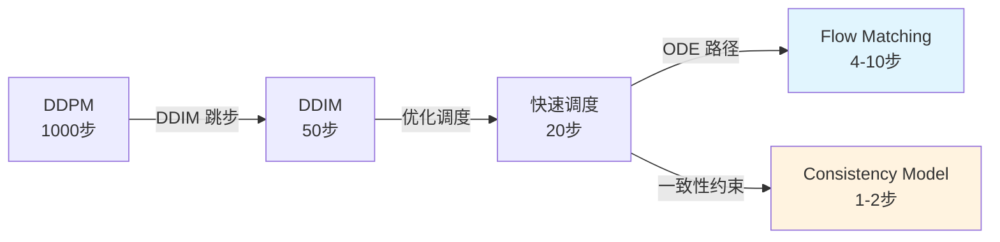
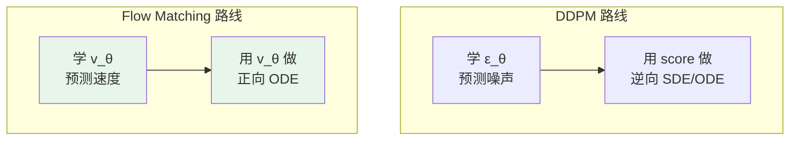
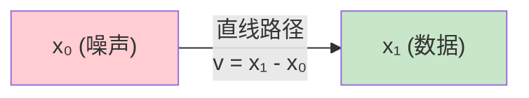
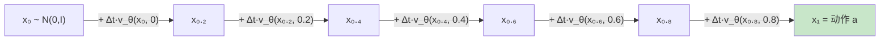
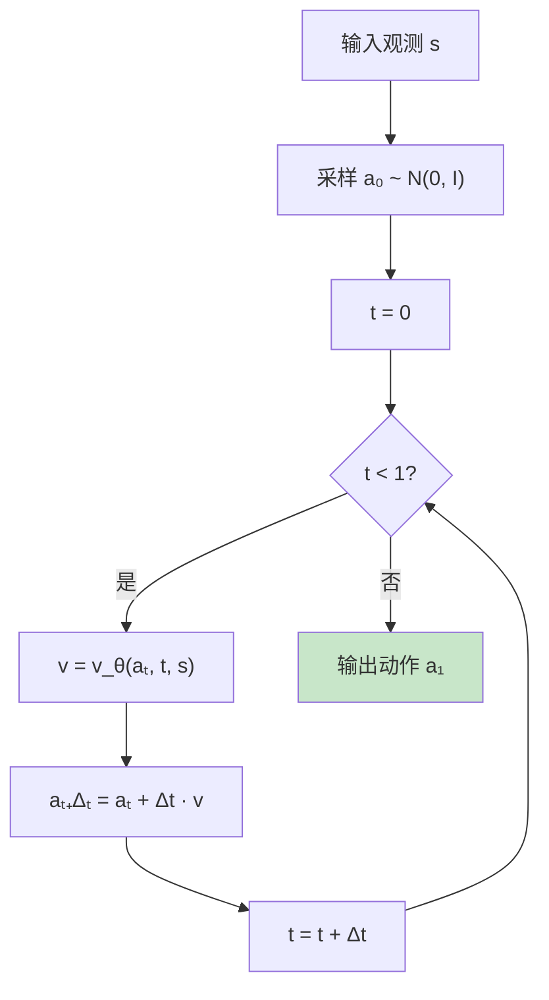
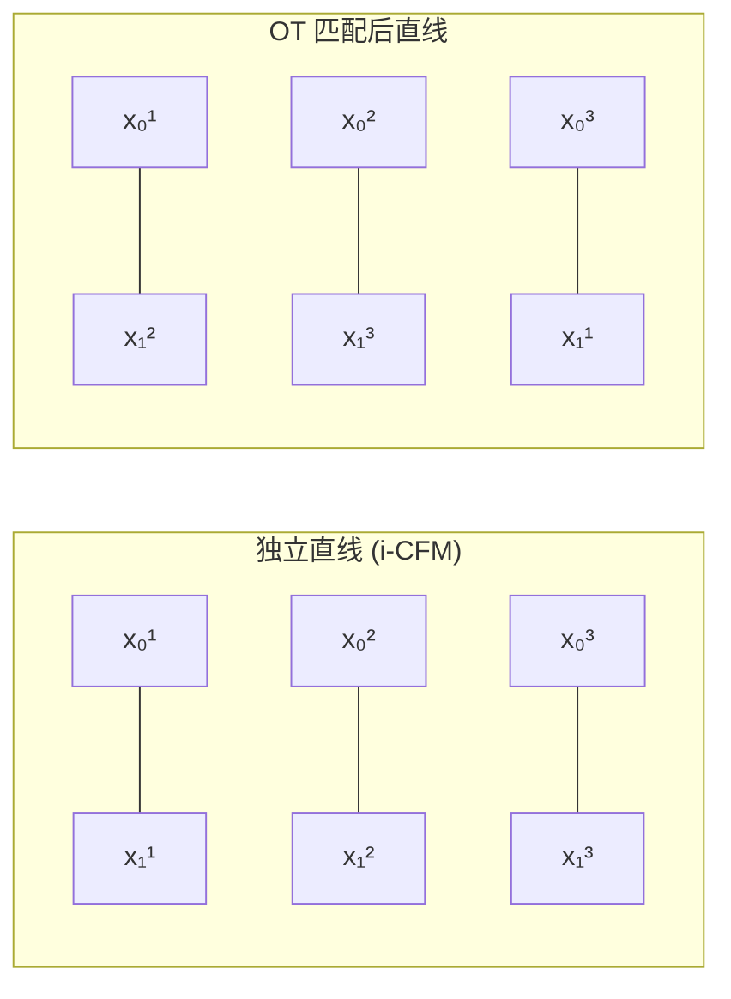
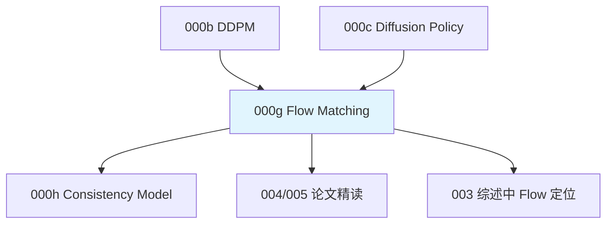

# 前置知识：Flow Matching 与连续归一化流

> **为什么要读这篇**：在 003 综述和多篇后续论文中反复提到 "Flow Matching 是扩散策略更快的替代方案"，但从未系统讲过它到底是什么、和 DDPM 有什么本质区别、为什么推理更快、为什么它让 BPTT 方法变得可行。本章从零推导 Flow Matching，并对比 DDPM 给出实践指导。
> **前置要求**：读完 000b（DDPM）、000c（Diffusion Policy）

**标签**: `#前置知识` `#Flow Matching` `#连续归一化流` `#ODE` `#向量场` `#条件Flow` `#机器人策略`

**知识链接**：
- [扩散模型 DDPM](./000b_前置知识_扩散模型DDPM) — 对比对象
- [Diffusion Policy](./000c_前置知识_Diffusion_Policy) — Flow Policy 要替代的基线
- [为什么扩散策略难以 RL 微调](./000f_前置知识_为什么扩散策略难以RL微调) — Flow 如何缓解 RL 微调困难
- [Online DPRL 综述](/论文综述/003_Online_DPRL_综述_扩散策略与在线RL) — Flow + RL 的评测

---

## 一、动机：DDPM 的推理瓶颈

### 1.1 DDPM 推理为什么慢

回忆 DDPM 的采样过程——每生成一个动作需要 $K$ 次完整的网络前向传播：

$$
\mathbf{a}_K \sim \mathcal{N}(\mathbf{0}, \mathbf{I}) \;\xrightarrow{\text{denoise}_K}\; \mathbf{a}_{K-1} \;\xrightarrow{\text{denoise}_{K-1}}\; \cdots \;\xrightarrow{\text{denoise}_1}\; \mathbf{a}_0
$$

其中 $K$ 通常为 20\textasciitilde100。对于 50Hz 的机器人控制，每次出动作都要跑 20~100 次前向传播，延迟是硬瓶颈。

### 1.2 各种加速方案的进化路径

Flow Matching 的关键优势：**用 4–10 步 ODE 求解就能达到 DDPM 20 步的质量**。这不是靠"跳步"近似，而是从数学根基上选择了一个更高效的生成框架。

---

## 二、核心概念：从 SDE 到 ODE

### 2.1 DDPM 的连续时间 SDE 视角

把离散的 DDPM 推广到连续时间 $t \in [0,1]$（$t=0$ 是干净数据，$t=1$ 是纯噪声）：

$$
\mathrm{d}\mathbf{x} = f(\mathbf{x}, t)\,\mathrm{d}t + g(t)\,\mathrm{d}\mathbf{W}
$$

- $f(\mathbf{x}, t)$：漂移系数（确定性部分）
- $g(t)$：扩散系数（随机性强度）
- $\mathrm{d}\mathbf{W}$：布朗运动增量

逆向采样也是一个 SDE：

$$
\mathrm{d}\mathbf{x} = \Big[f(\mathbf{x},t) - g(t)^2\,\nabla_{\mathbf{x}} \log p_t(\mathbf{x})\Big]\mathrm{d}t + g(t)\,\mathrm{d}\bar{\mathbf{W}}
$$

> **关键**：逆向 SDE 中有随机项 $g(t)\mathrm{d}\bar{\mathbf{W}}$ → 必须用小步离散化才准确 → 步数多。

### 2.2 Probability Flow ODE

Song et al. (2021) 证明了一个关键定理：每个前向 SDE 都对应一个**确定性的 ODE**，它生成**完全相同**的边际概率分布 $p_t(\mathbf{x})$：

$$
\frac{\mathrm{d}\mathbf{x}}{\mathrm{d}t} = f(\mathbf{x},t) - \frac{1}{2}\,g(t)^2\,\nabla_{\mathbf{x}} \log p_t(\mathbf{x})
$$

没有了随机项！可以用高阶 ODE 求解器，大步长仍然准确。

> **但问题是**：仍然需要 score function $\nabla_{\mathbf{x}} \log p_t(\mathbf{x})$，它的估计误差会在 ODE 积分中累积。

### 2.3 Flow Matching 的核心 insight

Flow Matching 换了一个根本不同的角度：

> **不学 score function，直接学向量场（velocity field）。**

定义一个从噪声到数据的 ODE：

$$
\frac{\mathrm{d}\mathbf{x}}{\mathrm{d}t} = v_t(\mathbf{x})
$$

- $\mathbf{x}_0 \sim \mathcal{N}(\mathbf{0}, \mathbf{I})$（纯噪声，注意方向和 DDPM 相反！）
- $\mathbf{x}_1$（干净数据）
- $v_t(\mathbf{x})$：向量场，描述在时刻 $t$、位置 $\mathbf{x}$ 处的"流动速度"

推理时从 $\mathbf{x}_0$ 出发，沿 $v_t$ 积分到 $t=1$ → 得到生成样本。

---

## 三、Flow Matching 的数学推导

### 3.1 条件 Flow（Conditional Flow）

给定一个数据点 $\mathbf{x}_1$，定义**最简单**的路径——直线插值：

$$
\mathbf{x}_t \;|\; \mathbf{x}_1 = (1-t)\,\mathbf{x}_0 + t\,\mathbf{x}_1, \quad \mathbf{x}_0 \sim \mathcal{N}(\mathbf{0}, \mathbf{I})
$$

对应的**条件向量场**（对 $t$ 求导）：

$$
u_t(\mathbf{x} \,|\, \mathbf{x}_1) = \frac{\mathrm{d}\mathbf{x}_t}{\mathrm{d}t} = \mathbf{x}_1 - \mathbf{x}_0
$$

> 这是一个**常数**向量场——从当前噪声指向目标数据的方向，不随时间变化。路径是一条直线。

### 3.2 边际向量场

条件向量场 $u_t(\mathbf{x} | \mathbf{x}_1)$ 依赖于具体目标 $\mathbf{x}_1$（推理时不知道）。需要学习**边际向量场**：

$$
v_t(\mathbf{x}) = \mathbb{E}_{\mathbf{x}_1 \sim p_{\text{data}}}\!\left[\, u_t(\mathbf{x} \,|\, \mathbf{x}_1) \;\frac{p_t(\mathbf{x} \,|\, \mathbf{x}_1)}{p_t(\mathbf{x})} \,\right]
$$

**直觉**：在时刻 $t$、位置 $\mathbf{x}$ 处，可能有很多数据点 $\mathbf{x}_1$ 的路径经过。每个 $\mathbf{x}_1$ 贡献一个"想去的方向"，加权平均后就是边际向量场。

### 3.3 训练目标：Conditional Flow Matching (CFM)

Lipman et al. (2023) 证明了一个优雅的结论——直接回归条件向量场就够了：

$$
\boxed{\mathcal{L}_{\text{CFM}} = \mathbb{E}_{t \sim U(0,1),\; \mathbf{x}_1 \sim p_{\text{data}},\; \mathbf{x}_0 \sim \mathcal{N}(\mathbf{0}, \mathbf{I})} \left\| v_\theta(\mathbf{x}_t,\, t) - (\mathbf{x}_1 - \mathbf{x}_0) \right\|^2}
$$

其中 $\mathbf{x}_t = (1-t)\mathbf{x}_0 + t\,\mathbf{x}_1$。

**逐项解释**：

| 符号 | 含义 |
|------|------|
| $t \sim U(0,1)$ | 随机选一个时间点 |
| $\mathbf{x}_1 \sim p_{\text{data}}$ | 从训练数据中取一个样本 |
| $\mathbf{x}_0 \sim \mathcal{N}(\mathbf{0}, \mathbf{I})$ | 采样一个噪声 |
| $\mathbf{x}_t$ | 线性插值得到的中间状态 |
| $v_\theta(\mathbf{x}_t, t)$ | 网络预测的向量场 |
| $\mathbf{x}_1 - \mathbf{x}_0$ | 真实的条件向量场（目标方向） |

### 3.4 和 DDPM 训练目标的对比

$$
\begin{aligned}
\text{DDPM:}\quad &\mathcal{L} = \left\| \boldsymbol{\epsilon}_\theta(\mathbf{x}_t, t) - \boldsymbol{\epsilon} \right\|^2 & \text{（预测噪声）}\\
\text{Flow:}\quad &\mathcal{L} = \left\| v_\theta(\mathbf{x}_t, t) - (\mathbf{x}_1 - \mathbf{x}_0) \right\|^2 & \text{（预测速度）}
\end{aligned}
$$

形式几乎一样！都是 MSE 回归。网络架构可以完全相同，只是预测目标不同。

### 3.5 推理过程

从 $t=0$ 积分到 $t=1$，用 Euler 方法（步长 $\Delta t = 1/N$）：

$$
\mathbf{x}_{t+\Delta t} = \mathbf{x}_t + \Delta t \cdot v_\theta(\mathbf{x}_t, t)
$$

**只需 $N=5$ 次网络前向传播！**

---

## 四、为什么 Flow Matching 步数比 DDPM 少

### 4.1 路径的曲率差异

DDPM 的前向/逆向过程是布朗运动驱动的，路径弯弯曲曲；Flow Matching 定义的是直线路径，ODE 跟踪直线不需要很多步。

| | DDPM 逆向采样 | Flow Matching |
|---|---|---|
| 路径形状 | 曲线（随机游走的逆） | 近直线 |
| 每步截断误差 | 大（曲率高） | 小（曲率低） |
| 所需步数 | 20–100 | 4–10 |

### 4.2 高阶求解器的加持

Flow Matching 是纯 ODE → 可以使用高阶数值方法：

$$
\begin{aligned}
\text{Euler (1阶):}\quad &\text{误差} \sim O(\Delta t^2) \\
\text{Midpoint (2阶):}\quad &\text{误差} \sim O(\Delta t^3) \\
\text{RK4 (4阶):}\quad &\text{误差} \sim O(\Delta t^5)
\end{aligned}
$$

DDPM 的 SDE 有随机项 → 高阶方法的收益被随机噪声淹没。这是 Flow 在数学上更快的根本原因。

### 4.3 误差累积的对比

| | DDPM ($K=20$) | Flow ($N=5$) |
|---|---|---|
| 累积误差 | $\sim 20\epsilon + \text{随机方差}$ | $\sim 5\epsilon$ |
| 误差来源 | 网络预测误差 + 离散化误差 + 随机噪声方差 | 仅网络预测误差 + 离散化误差 |

---

## 五、Flow Policy——把 Flow Matching 用作机器人策略

### 5.1 定义与训练

将观测 $\mathbf{s}$ 作为条件，学习条件向量场 $v_\theta(\mathbf{a}_t, t, \mathbf{s})$：

$$
\mathcal{L}_{\text{Flow Policy}} = \mathbb{E}_{t,\, \mathbf{a}_1 \sim \text{demo},\, \mathbf{a}_0 \sim \mathcal{N}(\mathbf{0},\mathbf{I})} \left\| v_\theta\!\left((1{-}t)\mathbf{a}_0 + t\,\mathbf{a}_1,\; t,\; \mathbf{s}\right) - (\mathbf{a}_1 - \mathbf{a}_0) \right\|^2
$$

推理时 $N=5$ 步 Euler 积分即可生成动作。

### 5.2 Flow Policy 的完整推理流程

### 5.3 和 Diffusion Policy 的全面对比

|  | Diffusion Policy | Flow Policy |
|---|---|---|
| 生成模型 | DDPM（离散步 SDE） | Flow Matching（ODE） |
| 训练目标 | 预测噪声 $\boldsymbol{\epsilon}$ | 预测速度 $v = \mathbf{x}_1 - \mathbf{x}_0$ |
| 推理步数 | 20–100 | 4–10 |
| 推理性质 | 可随机(DDPM)/可确定(DDIM) | 确定性 |
| 表达力 | 任意复杂分布 | 任意复杂分布 |
| $\log \pi(\mathbf{a}|\mathbf{s})$ | 不可算（高维积分） | 理论上可算（变量替换） |

### 5.4 对 RL 微调的两大影响

**影响 1：BPTT 方法变得可行**

回忆综述的结论——BPTT 方法在步数 $K \leq 5$ 时性能合理：

$$
\text{DDPM } (K=20{-}100): \quad \text{梯度链太长} \;\to\; \text{BPTT 不实用}
$$
$$
\text{Flow } (N=4{-}10): \quad \text{梯度链短} \;\to\; \text{BPTT 完全可行}
$$

**影响 2：$\log \pi$ 理论上可算**

对于确定性 ODE，可以用 instantaneous change of variables formula：

$$
\log p_1(\mathbf{x}_1) = \log p_0(\mathbf{x}_0) - \int_0^1 \mathrm{div}\big(v_\theta(\mathbf{x}_t, t)\big) \,\mathrm{d}t
$$

其中 $\mathrm{div} = \sum_i \frac{\partial v_i}{\partial x_i}$（散度）。

> 精确散度计算需要 $O(d)$ 次反向传播。实践中用 **Hutchinson trace estimator** 降到 $O(1)$ 但引入方差。这为直接策略梯度（不需要 DPPO 展开）提供了可能性，但方差控制仍是开放问题。

---

## 六、Optimal Transport 条件路径

### 6.1 为什么直线路径不是唯一选择

上面的 CFM 为每对 $(\mathbf{x}_0, \mathbf{x}_1)$ 独立定义直线路径。如果同一个 $\mathbf{x}_t$ 位置被多条路径穿过，它们的方向可能冲突，导致向量场不平滑。

**Optimal Transport (OT) 路径**可以缓解这个问题：

$$
\sigma^* = \arg\min_{\sigma} \sum_{i=1}^B \|\mathbf{x}_0^i - \mathbf{x}_1^{\sigma(i)}\|^2
$$

在 mini-batch 内做最优匹配后再定义直线路径 → 路径之间更少交叉 → 向量场更平滑 → 网络更容易学。

实践中 i-CFM（独立直线）已经足够好，大部分机器人策略论文直接使用它。OT-CFM 在高度多模态数据上有额外增益。

---

## 七、实践指南

### 7.1 什么时候用 Flow Matching 代替 DDPM

| 选 Flow Matching | 选 DDPM |
|---|---|
| 控制频率高 (>50Hz) | 数据极其复杂多模态 |
| 想用 BPTT 做 RL 微调 | 用 DPPO（对步数不敏感） |
| 计算预算有限 | 已有成熟 Diffusion Policy 代码 |
| 数据相对简单 | 需要采样随机性（DDPM 天然有） |

### 7.2 训练 trick

1. **时间采样**：$t \sim U(0,1)$ 均匀采样即可（不需要 DDPM 的加权采样）
2. **网络架构**：和 DDPM 完全相同（输入多一个 $t$，输出同维度）
3. **Action chunk**：和 Diffusion Policy 一样，一次生成 $T_a$ 步动作
4. **推理步数**：从 $N=10$ 开始试，逐步减少到 $N=4$–$5$ 观察质量损失
5. **ODE 求解器**：Euler 够用；更少步可试 Midpoint / RK4

### 7.3 常见坑

| 坑 | 解决 |
|---|---|
| Flow 推理确定性 → 无探索 | RL 微调时在 $\mathbf{x}_0$ 加扰动或中间步注入小噪声 |
| 时间方向和 DDPM 相反 | DDPM: $t{=}0$ 是数据; Flow: $t{=}0$ 是噪声（注意移植代码） |
| $v_\theta$ 值域无约束 | 数据必须归一化，否则 $v$ 过大导致数值不稳定 |
| 多模态数据下 ODE 路径交叉 | 适当增加步数(6-8步)或用 OT 路径 |

---

## 八、总结

### 一句话

> Flow Matching 把生成过程从"随机去噪 SDE"简化为"确定性 ODE 流动"，通过学习向量场代替 score function，实现 4–10 步高质量生成，是扩散策略在推理速度和 RL 微调友好性上的关键进化方向。

### 知识链

---

## 延伸阅读

- Lipman et al. (2023) "Flow Matching for Generative Modeling" ← 原始论文
- Liu et al. (2023) "Flow Straight and Fast" ← Rectified Flow
- Tong et al. (2024) "Improving and Generalizing Flow-Based Generative Models with Minibatch OT"
- [扩散模型 DDPM](./000b_前置知识_扩散模型DDPM) ← 本章的对比基线
- [Online DPRL 综述](/论文综述/003_Online_DPRL_综述_扩散策略与在线RL) ← Flow 在综述中的定位
