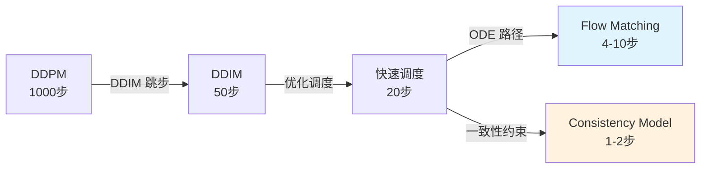
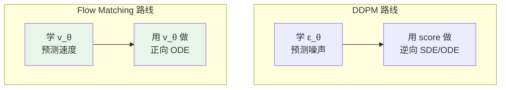
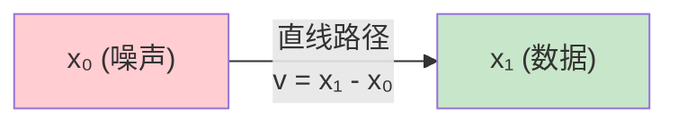
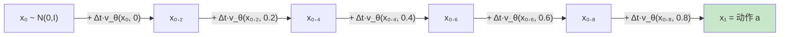
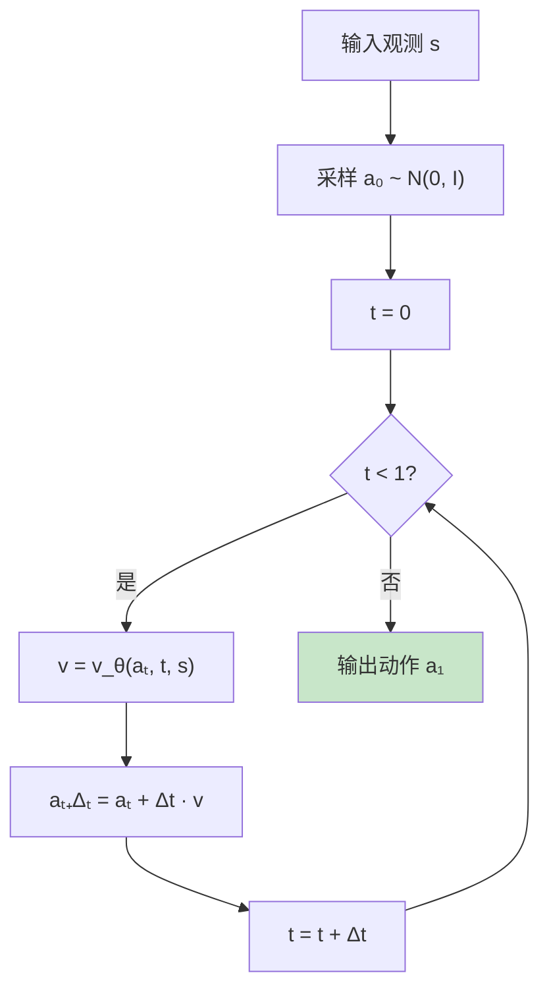
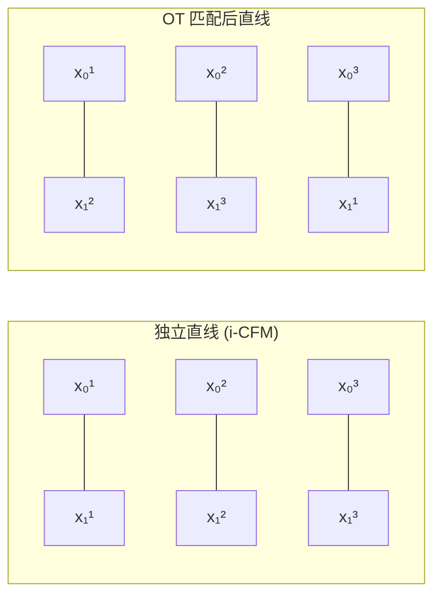
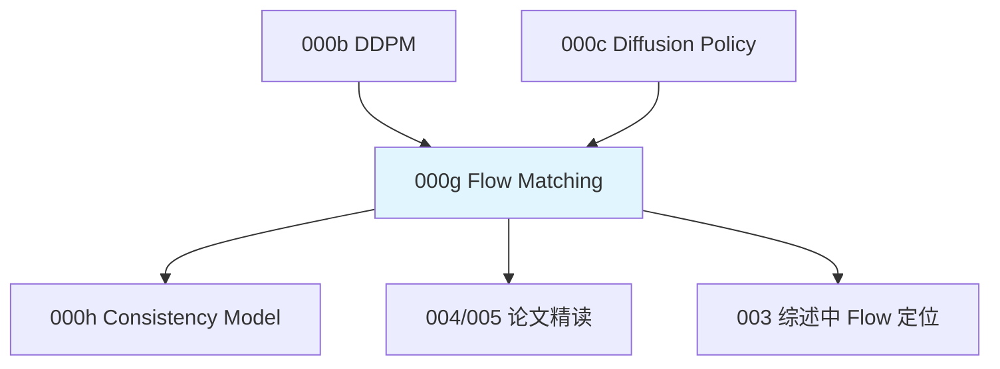

# 前置知识：Flow Matching 与连续归一化流

> **为什么要读这篇**：在 003 综述和多篇后续论文中反复提到 "Flow Matching 是扩散策略更快的替代方案"，但从未系统讲过它到底是什么、和 DDPM 有什么本质区别、为什么推理更快、为什么它让 BPTT 方法变得可行。本章从零推导 Flow Matching，并对比 DDPM 给出实践指导。
> **前置要求**：读完 000b（DDPM）、000c（Diffusion Policy）

**标签**: `#前置知识` `#Flow Matching` `#连续归一化流` `#ODE` `#向量场` `#条件Flow` `#机器人策略`

**知识链接**：
- [扩散模型 DDPM](./000b_前置知识_扩散模型DDPM) — 对比对象
- [Diffusion Policy](./000c_前置知识_Diffusion_Policy) — Flow Policy 要替代的基线
- [为什么扩散策略难以 RL 微调](./000f_前置知识_为什么扩散策略难以RL微调) — Flow 如何缓解 RL 微调困难
- [Online DPRL 综述](/论文综述/003_Online_DPRL_综述_扩散策略与在线RL) — Flow + RL 的评测

---

## 一、动机：DDPM 的推理瓶颈

### 1.1 DDPM 推理为什么慢

回忆 DDPM 的采样过程——每生成一个动作需要 $K$ 次完整的网络前向传播：

$$
\mathbf{a}_K \sim \mathcal{N}(\mathbf{0}, \mathbf{I}) \;\xrightarrow{\text{denoise}_K}\; \mathbf{a}_{K-1} \;\xrightarrow{\text{denoise}_{K-1}}\; \cdots \;\xrightarrow{\text{denoise}_1}\; \mathbf{a}_0
$$

其中 $K$ 通常为 20\textasciitilde100。对于 50Hz 的机器人控制，每次出动作都要跑 20~100 次前向传播，延迟是硬瓶颈。

### 1.2 各种加速方案的进化路径

```mermaid
graph LR
    A["DDPM<br/>1000步"] -->|DDIM 跳步| B["DDIM<br/>50步"]
    B -->|优化调度| C["快速调度<br/>20步"]
    C -->|ODE 路径| D["Flow Matching<br/>4-10步"]
    C -->|一致性约束| E["Consistency Model<br/>1-2步"]
    style D fill:#e1f5fe
    style E fill:#fff3e0
```

Flow Matching 的关键优势：**用 4–10 步 ODE 求解就能达到 DDPM 20 步的质量**。这不是靠"跳步"近似，而是从数学根基上选择了一个更高效的生成框架。

---

## 二、核心概念：从 SDE 到 ODE

> **如果你不清楚 ODE 和 SDE 是什么**，强烈建议先阅读：
> - [常微分方程 ODE——直觉与数值求解](./001b_前置知识_常微分方程ODE直觉与数值求解) — 什么是 ODE、怎么数值求解、为什么 5 步就够
> - [随机微分方程 SDE——直觉与扩散模型的联系](./001c_前置知识_随机微分方程SDE直觉与扩散模型的联系) — 什么是 SDE、布朗运动、为什么 DDPM 本质上是 SDE

### 2.1 DDPM 的连续时间 SDE 视角

把离散的 DDPM 推广到连续时间 $t \in [0,1]$（$t=0$ 是干净数据，$t=1$ 是纯噪声）：

$$
\mathrm{d}\mathbf{x} = f(\mathbf{x}, t)\,\mathrm{d}t + g(t)\,\mathrm{d}\mathbf{W}
$$

- $f(\mathbf{x}, t)$：漂移系数（确定性部分）
- $g(t)$：扩散系数（随机性强度）
- $\mathrm{d}\mathbf{W}$：布朗运动增量

逆向采样也是一个 SDE：

$$
\mathrm{d}\mathbf{x} = \Big[f(\mathbf{x},t) - g(t)^2\,\nabla_{\mathbf{x}} \log p_t(\mathbf{x})\Big]\mathrm{d}t + g(t)\,\mathrm{d}\bar{\mathbf{W}}
$$

> **关键**：逆向 SDE 中有随机项 $g(t)\mathrm{d}\bar{\mathbf{W}}$ → 必须用小步离散化才准确 → 步数多。

### 2.2 Probability Flow ODE

Song et al. (2021) 证明了一个关键定理：每个前向 SDE 都对应一个**确定性的 ODE**，它生成**完全相同**的边际概率分布 $p_t(\mathbf{x})$：

$$
\frac{\mathrm{d}\mathbf{x}}{\mathrm{d}t} = f(\mathbf{x},t) - \frac{1}{2}\,g(t)^2\,\nabla_{\mathbf{x}} \log p_t(\mathbf{x})
$$

没有了随机项！可以用高阶 ODE 求解器，大步长仍然准确。

> **但问题是**：仍然需要 score function $\nabla_{\mathbf{x}} \log p_t(\mathbf{x})$，它的估计误差会在 ODE 积分中累积。

### 2.3 Flow Matching 的核心 insight

Flow Matching 换了一个根本不同的角度：

> **不学 score function，直接学向量场（velocity field）。**

```mermaid
graph TD
    subgraph "DDPM 路线"
        A1["学 ε_θ<br/>预测噪声"] --> A2["用 score 做<br/>逆向 SDE/ODE"]
    end
    subgraph "Flow Matching 路线"
        B1["学 v_θ<br/>预测速度"] --> B2["用 v_θ 做<br/>正向 ODE"]
    end
    style B1 fill:#e8f5e9
    style B2 fill:#e8f5e9
```

定义一个从噪声到数据的 ODE：

$$
\frac{\mathrm{d}\mathbf{x}}{\mathrm{d}t} = v_t(\mathbf{x})
$$

- $\mathbf{x}_0 \sim \mathcal{N}(\mathbf{0}, \mathbf{I})$（纯噪声，注意方向和 DDPM 相反！）
- $\mathbf{x}_1$（干净数据）
- $v_t(\mathbf{x})$：向量场，描述在时刻 $t$、位置 $\mathbf{x}$ 处的"流动速度"

推理时从 $\mathbf{x}_0$ 出发，沿 $v_t$ 积分到 $t=1$ → 得到生成样本。

---

## 三、Flow Matching 的数学推导

### 3.1 条件 Flow（Conditional Flow）

**为什么需要这个公式**：要教网络"从噪声流动到数据该往哪走"，首先必须有一条**具体的轨迹**——如果连轨迹长什么样都没定义，网络就没有"正确方向"这个概念可以学习。所以第一步不是急着写训练目标，而是先人为地**构造一条连接噪声 $\mathbf{x}_0$ 和数据 $\mathbf{x}_1$ 的路径**。这条路径怎么选是一个设计决策，Flow Matching 选的是最简单的一种——直线：

$$
\mathbf{x}_t \;|\; \mathbf{x}_1 = (1-t)\,\mathbf{x}_0 + t\,\mathbf{x}_1, \quad t \in [0,1],\ \mathbf{x}_0 \sim \mathcal{N}(\mathbf{0}, \mathbf{I})
$$

> **一句话直觉**：在 $\mathbf{x}_0$ 和 $\mathbf{x}_1$ 之间画一条线段，$t$ 就是这条线段上的"进度百分比"——$t=0$ 在起点（噪声），$t=1$ 到终点（数据），中间按比例线性混合。

**逐符号拆解**：

| 符号 | 含义 | 具体是什么 |
|------|------|-----------|
| $t$ | 路径进度 | $[0,1]$ 之间的标量，训练时随机采样 |
| $\mathbf{x}_0$ | 路径起点 | 从标准正态采的一个噪声样本 |
| $\mathbf{x}_1$ | 路径终点 | 从训练数据里取的一个真实样本（这里先固定，所以叫"条件"于 $\mathbf{x}_1$） |
| $(1-t)\mathbf{x}_0$ | 起点的权重份额 | $t$ 越大，起点权重越小 |
| $t\,\mathbf{x}_1$ | 终点的权重份额 | $t$ 越大，终点权重越大 |
| $(1-t)\mathbf{x}_0 + t\mathbf{x}_1$ | 两点的凸组合 | 几何上就是线段 $\mathbf{x}_0\mathbf{x}_1$ 上、由 $t$ 定位的那个点 |

**数值例子**：$d=1$，$\mathbf{x}_0 = 0$（噪声），$\mathbf{x}_1 = 10$（数据）：

| $t$ | $\mathbf{x}_t = (1-t)\times 0 + t\times 10$ |
|---|---|
| 0 | 0 |
| 0.3 | 3 |
| 0.7 | 7 |
| 1.0 | 10 |

可以看到 $\mathbf{x}_t$ 随 $t$ **匀速**从 0 走到 10，每单位 $t$ 走过的距离都是 10——这就是"直线、常速"的具体体现。

**为什么是这个形式（为什么选直线，不选别的曲线）**：连接两点的路径有无穷多种（任意曲线都行），但直线插值有两个关键好处：

1. **对应的速度场是常数**，训练目标最简单——马上会算到，网络只需要回归一个不随时间变化的向量，而不用理解"路径的弯曲程度随时间怎么变"这种复杂结构。
2. **是长度最短的路径**，对应物理上最省力的"传输方案"。这也是它后来能等价于最优传输（OT）边际路径的原因（第六节展开）。

有了路径的显式表达式，就可以直接对 $t$ 求导，得到这条路径每一点上的瞬时速度——这才是训练目标真正的来源：

$$
u_t(\mathbf{x} \,|\, \mathbf{x}_1) = \frac{\mathrm{d}\mathbf{x}_t}{\mathrm{d}t} = \frac{\mathrm{d}}{\mathrm{d}t}\Big[(1-t)\mathbf{x}_0 + t\,\mathbf{x}_1\Big] = -\mathbf{x}_0 + \mathbf{x}_1 = \mathbf{x}_1 - \mathbf{x}_0
$$

**这一步在做什么**：对刚才定义好的路径 $\mathbf{x}_t$ 求关于 $t$ 的导数，得到"沿着这条路径运动的粒子，在每个时刻的速度矢量"——这正是向量场 $v_t$ 要学习的目标。

**逐项拆解**：求导时把 $\mathbf{x}_0,\mathbf{x}_1$ 当常数（它们在这条路径上是固定的两个端点），只对 $t$ 求导：$(1-t)$ 求导得 $-1$，$t$ 求导得 $1$，于是 $\frac{\mathrm{d}\mathbf{x}_t}{\mathrm{d}t} = -\mathbf{x}_0 + \mathbf{x}_1$。

**数值验证**：接着上面的例子，$\mathbf{x}_1-\mathbf{x}_0 = 10-0=10$。检查表格：$t$ 从 0.3 到 0.7，$\mathbf{x}_t$ 从 3 到 7，位移 $=4$，时间跨度 $=0.4$，速度 $=4/0.4=10$——和求导结果吻合，且**在整条路径上处处相同**，验证了"常速直线"这个结论。

> 这是一个**常数**向量场——从当前噪声指向目标数据的方向，不随时间变化，因为路径本身就是直线。

```mermaid
graph LR
    X0["x₀ (噪声)"] -- "直线路径<br/>v = x₁ - x₀" --> X1["x₁ (数据)"]
    style X0 fill:#ffcdd2
    style X1 fill:#c8e6c9
```

### 3.2 边际向量场

条件向量场 $u_t(\mathbf{x} | \mathbf{x}_1)$ 依赖于具体目标 $\mathbf{x}_1$（推理时不知道）。需要学习**边际向量场**：

$$
v_t(\mathbf{x}) = \mathbb{E}_{\mathbf{x}_1 \sim p_{\text{data}}}\!\left[\, u_t(\mathbf{x} \,|\, \mathbf{x}_1) \;\frac{p_t(\mathbf{x} \,|\, \mathbf{x}_1)}{p_t(\mathbf{x})} \,\right]
$$

**直觉**：在时刻 $t$、位置 $\mathbf{x}$ 处，可能有很多数据点 $\mathbf{x}_1$ 的路径经过。每个 $\mathbf{x}_1$ 贡献一个"想去的方向"，加权平均后就是边际向量场。

### 3.2.1 关键疑问：训练时回归的是"条件速度"，为什么推理时能生成正确样本？

这一节回答一个几乎所有人第一次学 Flow Matching 都会卡住的问题：**3.3 节马上要写的训练目标里，回归对象是 $\mathbf{x}_1-\mathbf{x}_0$——这是某一个具体样本对 $(\mathbf{x}_0,\mathbf{x}_1)$ 的位移。但推理时根本不知道 $\mathbf{x}_1$（那正是要生成的东西），凭什么用"知道 $\mathbf{x}_1$"算出来的目标训练，最后网络在不知道 $\mathbf{x}_1$ 的情况下还能生成对？**

**问题的根源**：网络 $v_\theta(\mathbf{x}_t,t)$ 的输入只有 $(\mathbf{x}_t,t)$，看不到具体是哪一对 $(\mathbf{x}_0,\mathbf{x}_1)$。而同一个 $\mathbf{x}_t$ 值，可能是许许多多不同的 $(\mathbf{x}_0,\mathbf{x}_1)$ 组合产生的（只要满足 $(1-t)\mathbf{x}_0+t\mathbf{x}_1=\mathbf{x}_t$ 就行）。训练目标 $\mathbf{x}_1-\mathbf{x}_0$ 对不同的组合是不同的值——网络到底该学哪一个？

**解答依赖统计学的一个基本事实：MSE 回归的最优解，永远是目标值在给定输入下的条件期望。**

> **一句话直觉**：网络看不清楚每一对具体的 $(\mathbf{x}_0,\mathbf{x}_1)$ 是谁，只能在"看得到的信息"（$\mathbf{x}_t,t$）范围内，尽量猜一个让平均误差最小的值——而这个最优猜测，数学上被证明就是"把所有经过这一点的样本的真实速度做加权平均"。

具体来说，任取随机变量 $Y$ 和输入 $Z$，最小化 $\mathbb{E}[(f(Z)-Y)^2]$ 的最优函数是 $f^*(Z)=\mathbb{E}[Y\mid Z]$（对 $f(Z)$ 求导、令导数为零即可证明，这是回归问题的通用结论，和 Flow Matching 本身无关）。把 $Z=(\mathbf{x}_t,t)$、$Y=\mathbf{x}_1-\mathbf{x}_0$ 代入 3.3 节的 CFM loss，最优的 $v_\theta$ 满足：

$$
v^*(\mathbf{x},t) = \mathbb{E}\left[\mathbf{x}_1-\mathbf{x}_0 \;\middle|\; \mathbf{x}_t=\mathbf{x}\right]
$$

Lipman et al. (2023) 的核心定理证明了：这个"用贝叶斯公式对所有经过 $\mathbf{x}$ 的路径做条件期望"算出来的结果，和 3.2 节定义的边际向量场公式 $v_t(\mathbf{x})$ **完全相等**。也就是说——**回归每个具体样本简单的直线速度 $\mathbf{x}_1-\mathbf{x}_0$，和直接学那个不可算的边际向量场积分公式，是同一个优化问题的两种写法**。CFM 的巧妙之处正在于：把一个理论上正确但算不出来的目标（3.2 节的积分），换成了一个理论上等价、但可以直接采样计算的目标（每个样本各自的直线速度）。

**为什么条件期望恰好是"正确"的向量场**：因为定义 $\mathbf{x}_t$ 的方式，本身就保证了"从 $\mathbf{x}_0$ 的分布出发，沿着这个条件期望向量场做 ODE 积分，$t=1$ 时刻恰好落在 $\mathbf{x}_1$ 的真实分布上"——这不是巧合，而是概率流的连续性方程（continuity equation）保证的：边际概率密度 $p_t(\mathbf{x})$ 随时间的变化率，必须等于向量场造成的"净流量"，而条件期望正是唯一满足这个约束的速度场。

**用一个多模态的数值例子看清"为什么不会退化成平均"**：

假设动作是 1 维的，数据分布只有两个可能值：$\mathbf{x}_1=1$ 和 $\mathbf{x}_1=3$（各占一半概率，代表两个不同的"正确答案"，比如"绕左边走"和"绕右边走"）。固定噪声 $\mathbf{x}_0=0$，看 $t=0.5$ 时刻：

- 如果这次样本抽到 $\mathbf{x}_1=1$：$\mathbf{x}_{0.5}=0.5\times 0+0.5\times 1=0.5$，条件速度 $=1-0=1$
- 如果这次样本抽到 $\mathbf{x}_1=3$：$\mathbf{x}_{0.5}=0.5\times 0+0.5\times 3=1.5$，条件速度 $=3-0=3$

关键点：**这两种情况的 $\mathbf{x}_{0.5}$ 落在不同的位置**（0.5 和 1.5），不会被网络当成"同一个输入"。所以网络在 $\mathbf{x}\approx 0.5$ 附近学到的条件期望速度就是 1，在 $\mathbf{x}\approx 1.5$ 附近学到的是 3——**没有发生"平均成 2"的退化**。这正是 Flow Matching（以及扩散模型）能处理多模态分布、而直接 MSE 回归 $\hat{\mathbf{x}}_1=f_\theta(\mathbf{s})$ 会失败的根本原因：直接回归是在**数据空间**做单点预测，必然把两个模态平均掉；Flow Matching 是在**随时间变化的中间状态空间** $(\mathbf{x}_t,t)$ 做条件期望，不同模态在这个更高维、随 $t$ 演化的空间里通常不会重叠，因此各自的条件期望能保持独立。

推理时从 $\mathbf{x}_0\sim\mathcal{N}(0,I)$ 随机采样出发，不同的初始噪声会被网络学到的速度场"引导"进入不同的模态区域——这就是为什么反复推理多次，Flow Policy 能生成"绕左边"和"绕右边"两种不同轨迹，而不是永远输出同一条平均轨迹。

### 3.3 训练目标：Conditional Flow Matching (CFM)

Lipman et al. (2023) 证明了一个优雅的结论——直接回归条件向量场就够了：

$$
\boxed{\mathcal{L}_{\text{CFM}} = \mathbb{E}_{t \sim U(0,1),\; \mathbf{x}_1 \sim p_{\text{data}},\; \mathbf{x}_0 \sim \mathcal{N}(\mathbf{0}, \mathbf{I})} \left\| v_\theta(\mathbf{x}_t,\, t) - (\mathbf{x}_1 - \mathbf{x}_0) \right\|^2}
$$

其中 $\mathbf{x}_t = (1-t)\mathbf{x}_0 + t\,\mathbf{x}_1$。

**逐项解释**：

| 符号 | 含义 |
|------|------|
| $t \sim U(0,1)$ | 随机选一个时间点 |
| $\mathbf{x}_1 \sim p_{\text{data}}$ | 从训练数据中取一个样本 |
| $\mathbf{x}_0 \sim \mathcal{N}(\mathbf{0}, \mathbf{I})$ | 采样一个噪声 |
| $\mathbf{x}_t$ | 线性插值得到的中间状态 |
| $v_\theta(\mathbf{x}_t, t)$ | 网络预测的向量场 |
| $\mathbf{x}_1 - \mathbf{x}_0$ | 真实的条件向量场（目标方向） |

### 3.4 和 DDPM 训练目标的对比

$$
\begin{aligned}
\text{DDPM:}\quad &\mathcal{L} = \left\| \boldsymbol{\epsilon}_\theta(\mathbf{x}_t, t) - \boldsymbol{\epsilon} \right\|^2 & \text{（预测噪声）}\\
\text{Flow:}\quad &\mathcal{L} = \left\| v_\theta(\mathbf{x}_t, t) - (\mathbf{x}_1 - \mathbf{x}_0) \right\|^2 & \text{（预测速度）}
\end{aligned}
$$

形式几乎一样！都是 MSE 回归。网络架构可以完全相同，只是预测目标不同。

### 3.5 推理过程

从 $t=0$ 积分到 $t=1$，用 Euler 方法（步长 $\Delta t = 1/N$）：

$$
\mathbf{x}_{t+\Delta t} = \mathbf{x}_t + \Delta t \cdot v_\theta(\mathbf{x}_t, t)
$$

```mermaid
graph LR
    S0["x₀ ~ N(0,I)"] -->|"+ Δt·v_θ(x₀, 0)"| S1["x₀.₂"]
    S1 -->|"+ Δt·v_θ(x₀.₂, 0.2)"| S2["x₀.₄"]
    S2 -->|"+ Δt·v_θ(x₀.₄, 0.4)"| S3["x₀.₆"]
    S3 -->|"+ Δt·v_θ(x₀.₆, 0.6)"| S4["x₀.₈"]
    S4 -->|"+ Δt·v_θ(x₀.₈, 0.8)"| S5["x₁ = 动作 a"]
    style S5 fill:#c8e6c9
```

**只需 $N=5$ 次网络前向传播！**

---

## 四、为什么 Flow Matching 步数比 DDPM 少

### 4.1 路径的曲率差异

DDPM 的前向/逆向过程是布朗运动驱动的，路径弯弯曲曲；Flow Matching 定义的是直线路径，ODE 跟踪直线不需要很多步。

| | DDPM 逆向采样 | Flow Matching |
|---|---|---|
| 路径形状 | 曲线（随机游走的逆） | 近直线 |
| 每步截断误差 | 大（曲率高） | 小（曲率低） |
| 所需步数 | 20–100 | 4–10 |

### 4.2 高阶求解器的加持

Flow Matching 是纯 ODE → 可以使用高阶数值方法：

$$
\begin{aligned}
\text{Euler (1阶):}\quad &\text{误差} \sim O(\Delta t^2) \\
\text{Midpoint (2阶):}\quad &\text{误差} \sim O(\Delta t^3) \\
\text{RK4 (4阶):}\quad &\text{误差} \sim O(\Delta t^5)
\end{aligned}
$$

DDPM 的 SDE 有随机项 → 高阶方法的收益被随机噪声淹没。这是 Flow 在数学上更快的根本原因。

### 4.3 误差累积的对比

| | DDPM ($K=20$) | Flow ($N=5$) |
|---|---|---|
| 累积误差 | $\sim 20\epsilon + \text{随机方差}$ | $\sim 5\epsilon$ |
| 误差来源 | 网络预测误差 + 离散化误差 + 随机噪声方差 | 仅网络预测误差 + 离散化误差 |

---

## 五 Flow Policy 把 Flow Matching 用作机器人策略

### 5.1 定义与训练

将观测 $\mathbf{s}$ 作为条件，学习条件向量场 $v_\theta(\mathbf{a}_t, t, \mathbf{s})$：

**为什么需要这个公式**：Flow Policy 的训练目标和无条件 Flow Matching 完全一样，只是多了一个观测 $\mathbf{s}$ 作为条件输入。网络需要在给定观测的情况下，预测"从噪声到动作的速度方向"。

$$
\mathcal{L}_{\text{Flow Policy}} = \mathbb{E}_{t,\, \mathbf{a}_1 \sim \text{demo},\, \mathbf{a}_0 \sim \mathcal{N}(\mathbf{0},\mathbf{I})} \left\| v_\theta\!\left((1{-}t)\mathbf{a}_0 + t\,\mathbf{a}_1,\; t,\; \mathbf{s}\right) - (\mathbf{a}_1 - \mathbf{a}_0) \right\|^2
$$

> **一句话直觉**：让网络预测"在时刻 t、位置 $\mathbf{a}_t$ 处，这个粒子应该往哪走"——正确答案就是从噪声起点指向数据终点的方向。

**逐项拆解**：

| 符号 | 含义 | 直觉 |
|------|------|------|
| $\mathbb{E}_{t \sim U(0,1)}$ | 随机选一个时间点 | "随机看一个中间快照" |
| $\mathbf{a}_1 \sim \text{demo}$ | 从示范数据中取一个真实动作 | "一个专家做过的动作" |
| $\mathbf{a}_0 \sim \mathcal{N}(\mathbf{0}, \mathbf{I})$ | 采样一个噪声 | "动作的随机起点" |
| $(1{-}t)\mathbf{a}_0 + t\,\mathbf{a}_1$ | 线性插值的中间点 $\mathbf{a}_t$ | "噪声到数据的直线上，时刻 t 在哪" |
| $v_\theta(\mathbf{a}_t, t, \mathbf{s})$ | 网络预测的速度 | "网络觉得粒子应该往哪走" |
| $\mathbf{a}_1 - \mathbf{a}_0$ | 真实的条件向量场（速度） | "从噪声到数据的正确方向" |
| $\|\cdots\|^2$ | MSE loss | "预测方向和正确方向差多少" |

**数值例子**：$d=2$（二维动作），采样 $t=0.3$

- 专家动作 $\mathbf{a}_1 = [3.0, 5.0]$
- 噪声 $\mathbf{a}_0 = [-0.5, 0.8]$
- 中间点 $\mathbf{a}_t = 0.7 \times [-0.5, 0.8] + 0.3 \times [3.0, 5.0] = [-0.35 + 0.9, 0.56 + 1.5] = [0.55, 2.06]$
- 真实速度 = $[3.0-(-0.5), 5.0-0.8] = [3.5, 4.2]$
- 假设网络预测 $v_\theta = [3.2, 4.0]$
- Loss = $(3.5-3.2)^2 + (4.2-4.0)^2 = 0.09 + 0.04 = 0.13$

训练就是把这个 loss 降到最小。

推理时 $N=5$ 步 Euler 积分即可生成动作。

### 5.2 Flow Policy 的完整推理流程

```mermaid
flowchart TD
    A["输入观测 s"] --> B["采样 a₀ ~ N(0, I)"]
    B --> C["t = 0"]
    C --> D{"t < 1?"}
    D -- 是 --> E["v = v_θ(aₜ, t, s)"]
    E --> F["aₜ₊Δₜ = aₜ + Δt · v"]
    F --> G["t = t + Δt"]
    G --> D
    D -- 否 --> H["输出动作 a₁"]
    style H fill:#c8e6c9
```

### 5.3 和 Diffusion Policy 的全面对比

|  | Diffusion Policy | Flow Policy |
|---|---|---|
| 生成模型 | DDPM（离散步 SDE） | Flow Matching（ODE） |
| 训练目标 | 预测噪声 $\boldsymbol{\epsilon}$ | 预测速度 $v = \mathbf{x}_1 - \mathbf{x}_0$ |
| 推理步数 | 20–100 | 4–10 |
| 推理性质 | 可随机(DDPM)/可确定(DDIM) | 确定性 |
| 表达力 | 任意复杂分布 | 任意复杂分布 |
| $\log \pi(\mathbf{a}|\mathbf{s})$ | 不可算（高维积分） | 理论上可算（变量替换） |

### 5.4 对 RL 微调的两大影响

**影响 1：BPTT 方法变得可行**

回忆综述的结论——BPTT 方法在步数 $K \leq 5$ 时性能合理：

$$
\text{DDPM } (K=20{-}100): \quad \text{梯度链太长} \;\to\; \text{BPTT 不实用}
$$
$$
\text{Flow } (N=4{-}10): \quad \text{梯度链短} \;\to\; \text{BPTT 完全可行}
$$

**影响 2：$\log \pi$ 理论上可算**

**为什么重要**：很多 RL 算法（如直接策略梯度）需要算 $\log \pi(\mathbf{a}|\mathbf{s})$。DDPM 算不出来（高维积分），但 Flow Matching 的 ODE 结构让它理论上可算。

对于确定性 ODE，可以用 instantaneous change of variables formula：

$$
\log p_1(\mathbf{x}_1) = \log p_0(\mathbf{x}_0) - \int_0^1 \mathrm{div}\big(v_\theta(\mathbf{x}_t, t)\big) \,\mathrm{d}t
$$

> **一句话直觉**：从起点（正态分布，概率好算）出发，沿着 ODE 路径跟踪"空间被压缩/拉伸了多少"，就能算出终点的概率密度。

**逐项拆解**：

| 符号 | 含义 | 直觉 |
|------|------|------|
| $\log p_1(\mathbf{x}_1)$ | 生成数据 $\mathbf{x}_1$ 的对数概率 | "我想知道这个生成样本的概率" |
| $\log p_0(\mathbf{x}_0)$ | 噪声起点的对数概率 | 标准正态分布，直接算：$-\frac{d}{2}\log(2\pi) - \frac{1}{2}\|\mathbf{x}_0\|^2$ |
| $\int_0^1 (\cdots)\,\mathrm{d}t$ | 从 $t=0$ 到 $t=1$ 沿路径累加 | "一路上空间变形了多少" |
| $\mathrm{div}(v_\theta) = \sum_i \frac{\partial v_i}{\partial x_i}$ | 向量场的**散度** | 正值 = 局部空间膨胀（密度降低），负值 = 收缩（密度升高） |
| 减号 | 散度为正时密度下降 | 空间膨胀 → 同样的概率质量分散到更大体积 → log 概率减小 |

**为什么散度衡量空间变形**：想象一小团粒子在向量场中流动。如果周围的速度"向外散开"（散度>0），这团粒子占的体积会变大，密度自然下降。反之散度<0时体积缩小，密度升高。

**数值例子**：$d=2$，噪声 $\mathbf{x}_0 = [0.3, -0.7]$

- $\log p_0(\mathbf{x}_0) = -\log(2\pi) - \frac{1}{2}(0.09 + 0.49) = -1.837 - 0.29 = -2.127$
- 假设沿路径积分散度 $\int_0^1 \text{div}(v_\theta)\,\mathrm{d}t = 0.8$（空间轻微膨胀）
- $\log p_1(\mathbf{x}_1) = -2.127 - 0.8 = -2.927$
- 概率密度 $p_1 = e^{-2.927} \approx 0.054$

其中 $\mathrm{div} = \sum_i \frac{\partial v_i}{\partial x_i}$（散度）。

> 精确散度计算需要 $O(d)$ 次反向传播（对每个维度算一次 $\frac{\partial v_i}{\partial x_i}$）。实践中用 **Hutchinson trace estimator** 降到 $O(1)$ 但引入方差。这为直接策略梯度（不需要 DPPO 展开）提供了可能性，但方差控制仍是开放问题。

---

## 六、Optimal Transport 条件路径

### 6.1 为什么直线路径不是唯一选择

上面的 CFM 为每对 $(\mathbf{x}_0, \mathbf{x}_1)$ 独立定义直线路径。如果同一个 $\mathbf{x}_t$ 位置被多条路径穿过，它们的方向可能冲突，导致向量场不平滑。

**Optimal Transport (OT) 路径**可以缓解这个问题：

**为什么需要 OT**：独立直线路径可能交叉——噪声点 A 指向数据点 1，噪声点 B 也指向数据点 1，那中间某个 $\mathbf{x}_t$ 位置就收到两个冲突的速度指令。OT 匹配让每个噪声点找到"最近的"数据点配对，减少交叉。

$$
\sigma^* = \arg\min_{\sigma} \sum_{i=1}^B \|\mathbf{x}_0^i - \mathbf{x}_1^{\sigma(i)}\|^2
$$

> **一句话直觉**：在 mini-batch 内找到一个最优配对——让每个噪声点和"离它最近"的数据点连线，总距离最短。

**逐项拆解**：

| 符号 | 含义 | 直觉 |
|------|------|------|
| $\sigma$ | 一个排列（permutation） | 噪声点 $i$ 配对到数据点 $\sigma(i)$ |
| $\sigma^*$ | 最优排列 | 总距离最短的配对方案 |
| $B$ | mini-batch 大小 | 同时有 B 个噪声-数据配对 |
| $\|\mathbf{x}_0^i - \mathbf{x}_1^{\sigma(i)}\|^2$ | 第 $i$ 对的距离平方 | 这条"运输路线"有多长 |
| $\sum$ | 所有配对的总距离 | "总物流成本" |
| $\arg\min$ | 找使总距离最小的排列 | "最节省的运输方案" |

**数值例子**：$B=3$，$d=1$

噪声点：$\mathbf{x}_0 = [-2, 0, 1]$，数据点：$\mathbf{x}_1 = [-1, 2, 3]$

- 独立配对（按原序）：$(-2 \to -1), (0 \to 2), (1 \to 3)$ → 总距离 $= 1 + 4 + 4 = 9$
- OT 最优配对：$(-2 \to -1), (0 \to 2), (1 \to 3)$ → 同上（这个例子恰好已经是最优）

换一个例子：噪声 $[-2, 0, 1]$，数据 $[3, -1, 2]$
- 按原序：$(-2 \to 3), (0 \to -1), (1 \to 2)$ → 距离 $= 25 + 1 + 1 = 27$
- OT 最优：$(-2 \to -1), (0 \to 2), (1 \to 3)$ → 距离 $= 1 + 4 + 4 = 9$（路径不交叉！）

**为什么这个形式有效**：OT 匹配后的直线路径彼此平行或发散，不会交叉 → 同一个 $\mathbf{x}_t$ 位置不会收到冲突的速度指令 → 向量场更平滑 → 网络更容易学。

在 mini-batch 内做最优匹配后再定义直线路径 → 路径之间更少交叉 → 向量场更平滑 → 网络更容易学。

```mermaid
graph LR
    subgraph "独立直线 (i-CFM)"
        A1["x₀¹"] --- B1["x₁¹"]
        A2["x₀²"] --- B2["x₁²"]
        A3["x₀³"] --- B3["x₁³"]
    end
    subgraph "OT 匹配后直线"
        C1["x₀¹"] --- D2["x₁²"]
        C2["x₀²"] --- D3["x₁³"]
        C3["x₀³"] --- D1["x₁¹"]
    end
```

实践中 i-CFM（独立直线）已经足够好，大部分机器人策略论文直接使用它。OT-CFM 在高度多模态数据上有额外增益。

---

## 七、实践指南

### 7.1 什么时候用 Flow Matching 代替 DDPM

| 选 Flow Matching | 选 DDPM |
|---|---|
| 控制频率高 (>50Hz) | 数据极其复杂多模态 |
| 想用 BPTT 做 RL 微调 | 用 DPPO（对步数不敏感） |
| 计算预算有限 | 已有成熟 Diffusion Policy 代码 |
| 数据相对简单 | 需要采样随机性（DDPM 天然有） |

### 7.2 训练 trick

1. **时间采样**：$t \sim U(0,1)$ 均匀采样即可（不需要 DDPM 的加权采样）
2. **网络架构**：和 DDPM 完全相同（输入多一个 $t$，输出同维度）
3. **Action chunk**：和 Diffusion Policy 一样，一次生成 $T_a$ 步动作
4. **推理步数**：从 $N=10$ 开始试，逐步减少到 $N=4$–$5$ 观察质量损失
5. **ODE 求解器**：Euler 够用；更少步可试 Midpoint / RK4

### 7.3 常见坑

| 坑 | 解决 |
|---|---|
| Flow 推理确定性 → 无探索 | RL 微调时在 $\mathbf{x}_0$ 加扰动或中间步注入小噪声 |
| 时间方向和 DDPM 相反 | DDPM: $t{=}0$ 是数据; Flow: $t{=}0$ 是噪声（注意移植代码） |
| $v_\theta$ 值域无约束 | 数据必须归一化，否则 $v$ 过大导致数值不稳定 |
| 多模态数据下 ODE 路径交叉 | 适当增加步数(6-8步)或用 OT 路径 |

---

## 八、总结

### 一句话

> Flow Matching 把生成过程从"随机去噪 SDE"简化为"确定性 ODE 流动"，通过学习向量场代替 score function，实现 4–10 步高质量生成，是扩散策略在推理速度和 RL 微调友好性上的关键进化方向。

### 知识链

```mermaid
graph TD
    Pre1["000b DDPM"] --> This["000g Flow Matching"]
    Pre2["000c Diffusion Policy"] --> This
    This --> Post1["000h Consistency Model"]
    This --> Post2["004/005 论文精读"]
    This --> Post3["003 综述中 Flow 定位"]
    style This fill:#e1f5fe
```

---

## 延伸阅读

- Lipman et al. (2023) "Flow Matching for Generative Modeling" ← 原始论文
- Liu et al. (2023) "Flow Straight and Fast" ← Rectified Flow
- Tong et al. (2024) "Improving and Generalizing Flow-Based Generative Models with Minibatch OT"
- [扩散模型 DDPM](./000b_前置知识_扩散模型DDPM) ← 本章的对比基线
- [Online DPRL 综述](/论文综述/003_Online_DPRL_综述_扩散策略与在线RL) ← Flow 在综述中的定位
