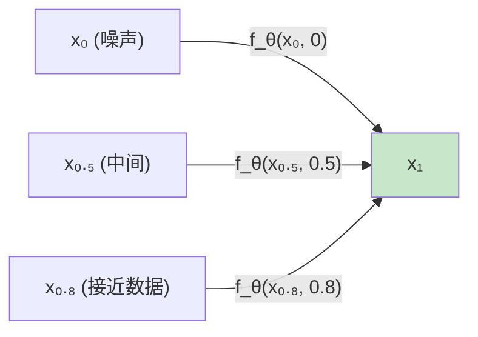
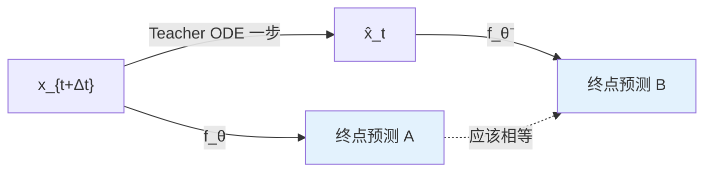
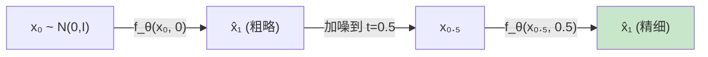

# 前置知识：Consistency Model 公式推导详解

> **这篇是什么**：[《Consistency Model 与一步生成》](./000h_前置知识_Consistency_Model与一步生成) 的推导附录。正文已经讲完了直觉、结论和怎么用，这里放的是每一步的完整公式、逐符号拆解和数值代入——只有想搞清楚"这个数字具体怎么算出来的"时才需要看这篇，跳过它完全不影响读懂正文。
> **前置要求**：先读完 [《Consistency Model 与一步生成》](./000h_前置知识_Consistency_Model与一步生成) 的正文，本文直接承接它的记号和例子。

**知识链接**：
- [Consistency Model 与一步生成](./000h_前置知识_Consistency_Model与一步生成) — 本文的正文，先读这篇
- [Flow Matching](./000g_前置知识_Flow_Matching与连续归一化流) — 本文的直线插值例子沿用它的记号
- [常微分方程 ODE 直觉与数值求解](./001b_前置知识_常微分方程ODE直觉与数值求解) — "给定一点即可积分出整条轨迹"这条确定性的前提
- [随机微分方程 SDE 直觉与扩散模型的联系](./001c_前置知识_随机微分方程SDE直觉与扩散模型的联系) — 对比 SDE：有随机项时中间一点不足以确定终点

---

## 一致性约束与边界条件

### PF-ODE 轨迹是完全确定的

用一个具体的例子把"轨迹上任意一点唯一决定终点"这件事钉死。取 [Flow Matching](/前置知识/000g_前置知识_Flow_Matching与连续归一化流#3.1-条件-flow-conditional-flow) 里最简单的直线轨迹，速度场是常数 $v=4$，起点 $x_0=-1$：

$$
x_t = x_0 + v\cdot t = -1+4t
$$

**这个公式在做什么**：给出一条最简单的匀速直线轨迹——只要知道起点和速度，任意时刻 $t$ 的位置就被唯一确定。

::: details 📐 公式详解（点击展开）

| 子表达式 | 它是谁 | 它在干嘛 |
|---------|--------|---------|
| $x_0=-1$ | **起点** | 轨迹在 $t=0$ 时刻的位置 |
| $v=4$ | **速度（常数）** | 决定轨迹往前走多快，整条轨迹上不变 |
| $v\cdot t$ | **已走过的距离** | 从起点出发，经过时间 $t$ 后累积的位移 |
| $x_t$ | **t 时刻的位置** | 起点加上已走过的距离，就是当前坐标 |

**用人话读**："从 $-1$ 出发，以恒定速度 $4$ 匀速前进，$t$ 时刻走到的位置就是 $-1+4t$。"

**为什么是这个形式**：这是 PF-ODE 最简单的特例——速度场为常数时，轨迹退化成一条直线，方便用来验证"任意一点唯一决定终点"这个性质。
:::

代入几个时刻：

| $t$ | 0 | 0.25 | 0.5 | 0.75 | 1 |
|---|---|---|---|---|---|
| $x_t$ | $-1$ | $0$ | $1$ | $2$ | $3$ |

这条轨迹的终点是 $x_1=3$。两个点 $(\mathbf{x}_t,t)$ 和 $(\mathbf{x}_{t'},t')$ 在同一条轨迹上，指的是——从其中一个点出发，沿着 PF-ODE 正向或反向积分，能够精确走到另一个点。上表 5 个点就是同一条轨迹上的 5 次快照。

### 一致性约束的形式化定义

$$
\boxed{f_\theta(\mathbf{x}_t,\, t) = f_\theta(\mathbf{x}_{t'},\, t') \quad \forall\; (\mathbf{x}_t, t),\, (\mathbf{x}_{t'}, t') \;\text{在同一条 PF-ODE 轨迹上}}
$$

**这个公式在做什么**：既然轨迹上任意一点都已经唯一决定了终点，那就应该存在一个函数，直接从"轨迹上的某一点"读出"这条轨迹的终点"——而且不管喂给它这条轨迹上哪一个点，读出来的终点都应该是同一个数。

::: details 📐 公式详解（点击展开）

| 子表达式 | 它是谁 | 它在干嘛 |
|---------|--------|---------|
| $f_\theta(\mathbf{x}_t, t)$ | **读终点的探测器** | 输入轨迹上任意一个点，输出网络认为的"这条轨迹的终点" |
| $(\mathbf{x}_t, t)$ 与 $(\mathbf{x}_{t'}, t')$ | **同一条轨迹的两次快照** | 比如例子里的 $(1, 0.5)$ 和 $(2, 0.75)$ |
| 左边 $=$ 右边 | **强制要求答案相同** | 不管拿轨迹上哪一张快照去问探测器，读出来的终点必须完全一致 |
| $\forall\,(\mathbf{x}_t,t),(\mathbf{x}_{t'},t')$ | **对所有同轨迹点对都成立** | 这不是碰巧成立一次，而是任意取法都要满足的硬性规定 |

**用人话读**："同一条轨迹上，不管你在哪个时刻抓拍一张照片去问网络终点在哪，得到的答案都必须一样。"

**为什么是这个形式**：普通扩散/Flow 模型是把"点 → 终点"拆成几十个"点 → 下一个点"的小步骤挪过去，没用上"任意一点已唯一决定终点"这个事实。
:::

**数值代入**：取轨迹上两个点 $(\mathbf{x}_{0.5},0.5)=(1,0.5)$ 和 $(\mathbf{x}_{0.75},0.75)=(2,0.75)$，一致性约束要求：

$$
f_\theta(1,\ 0.5) = f_\theta(2,\ 0.75)
$$

**这个公式在做什么**：把抽象的一致性约束代入具体轨迹上的两个真实点，验证约束到底要求了什么。

::: details 📐 公式详解（点击展开）

| 子表达式 | 它是谁 | 它在干嘛 |
|---------|--------|---------|
| $f_\theta(1,\ 0.5)$ | **在 $t=0.5$ 处的读数** | 网络看到轨迹在 $t=0.5$ 时的坐标 $1$，猜终点是多少 |
| $f_\theta(2,\ 0.75)$ | **在 $t=0.75$ 处的读数** | 网络看到轨迹在 $t=0.75$ 时的坐标 $2$，猜终点是多少 |
| 等号 | **一致性检验** | 两次猜测理应完全相同，因为它们问的是同一条轨迹的同一个终点 |

**用人话读**："问网络'从坐标 1（t=0.5）出发终点在哪'和'从坐标 2（t=0.75）出发终点在哪'，两次答案必须相等。"

**为什么是这个形式**：这两个点是同一条轨迹的两次快照，终点唯一确定（都是 $3$），所以一致性约束落到具体数字上，就是要求这两次前向传播的输出完全相同。
:::

反面例子：如果训练出来的网络给出 $f_\theta(1,0.5)=2.8$、$f_\theta(2,0.75)=3.4$，这就是不满足一致性——终点是唯一确定的，不该随选的时刻而变化。

**光有一致性约束还不够**：它只规定了同轨迹点必须互相一致，没规定这个共同值该等于多少（网络可以在每条轨迹上一致地输出错误值）。需要下面这条边界条件把共同值锚定成终点：

$$
f_\theta(\mathbf{x}_1,\, 1) = \mathbf{x}_1 \quad \text{（在数据端是恒等映射）}
$$

**这个公式在做什么**：规定"如果输入的点就是终点本身，网络必须原样输出"，把一致性约束里那个共同的输出值钉死成真正的终点。

::: details 📐 公式详解（点击展开）

| 子表达式 | 它是谁 | 它在干嘛 |
|---------|--------|---------|
| $f_\theta(\mathbf{x}_1,\, 1)$ | **在终点处的读数** | 网络看到的输入恰好就是轨迹终点（$t=1$） |
| $\mathbf{x}_1$（右边） | **终点本身** | 强制要求上面的读数原样等于输入 |
| 恒等映射 | **不做任何变换** | $t=1$ 时网络不需要"猜"，直接照抄输入即可 |

**用人话读**："如果喂给网络的点已经是终点了，它就应该原样输出，不用再做任何加工。"

**为什么是这个形式**：一致性约束只保证"同轨迹上答案一致"，但没规定这个共同答案是什么。补上这条边界条件，把两者合在一起——终点处的答案被钉成终点本身，其余各点的答案又必须和终点处一致——就得到"从轨迹上任何一点出发，$f_\theta$ 的输出都精确等于终点"。
:::

回到数值例子：$f_\theta(1,0.5)=f_\theta(2,0.75)=f_\theta(3,1)=3$，三个数完全相同，且等于终点值 $3$。

### 推理公式

$$
\text{采样}\; \mathbf{x}_0 \sim \mathcal{N}(\mathbf{0}, \mathbf{I}) \;\;\xrightarrow{\;f_\theta(\mathbf{x}_0,\, 0)\;}\;\; \mathbf{x}_1 = \text{最终动作}
$$

**这个公式在做什么**：采样一个纯噪声点，喂给网络一次，直接读出终点（也就是最终动作）。

::: details 📐 公式详解（点击展开）

| 子表达式 | 它是谁 | 它在干嘛 |
|---------|--------|---------|
| $\mathbf{x}_0 \sim \mathcal{N}(\mathbf{0}, \mathbf{I})$ | **随机起点** | 从标准正态分布里随便采一个噪声点，作为轨迹的起点 |
| $f_\theta(\mathbf{x}_0,\, 0)$ | **一次性终点探测** | 把这个噪声点连同它的时间标签 $t=0$ 一起喂给网络 |
| $\mathbf{x}_1 = \text{最终动作}$ | **直接得到的答案** | 网络的输出就是终点，也就是要的最终动作 |

**用人话读**："随便采一个噪声点，喂给网络一次，出来的就是最终动作。"

**为什么是这个形式**：$f_\theta$ 从轨迹上任意一点都能精确读出终点，$t=0$ 处的噪声点自然也不例外。
:::

---

## CD 和 CT 的完整 loss

### Consistency Distillation (CD)

**前提**：已有一个训练好的扩散模型作为 teacher。

**为什么需要这个 loss**：一致性约束说"同一轨迹上的任意两点都应映射到同一个终点"。但不能遍历轨迹上所有点对，所以退而求其次——只要求**相邻两点**的输出一致。如果每对相邻点输出都一样，传递性保证了整条轨迹的一致性。

$$
\mathcal{L}_{\text{CD}} = \mathbb{E}_{t,\,\mathbf{x}}\left\| f_\theta(\mathbf{x}_{t+\Delta t},\; t{+}\Delta t) - f_{\theta^-}(\hat{\mathbf{x}}_t,\; t) \right\|^2
$$

**这个公式在做什么**：在同一条轨迹上取两个相邻点，让它们的"跳到终点"的预测尽量一致——把一致性约束落地成一个可以梯度下降的训练目标。

::: details 📐 公式详解（点击展开）

| 子表达式 | 它是谁 | 它在干嘛 |
|---------|--------|---------|
| $f_\theta(\mathbf{x}_{t+\Delta t}, t{+}\Delta t)$ | **学生的终点猜测** | 站在"上一站"（噪声更多的点），猜"从这里跳，终点在哪" |
| $f_{\theta^-}(\hat{\mathbf{x}}_t, t)$ | **EMA 老师的终点猜测** | 站在"下一站"（$\hat{\mathbf{x}}_t$ 是 teacher ODE 走一步到的点），猜"从那里跳，终点在哪" |
| $\hat{\mathbf{x}}_t$ | **teacher 给出的下一站** | 用已训练好的扩散模型，沿 ODE 从 $\mathbf{x}_{t+\Delta t}$ 精确走一步到 $t$ 时刻的点 |
| $\theta^-$ | **滞后的自己（EMA）** | $\theta$ 的慢速更新副本，防止两边同时优化导致作弊 |
| $\|\cdots\|^2$ | **偏差评分** | 两次终点猜测差多少，差得越多 loss 越大 |
| $\mathbb{E}_{t,\mathbf{x}}$ | **随机抽查** | 训练时对 mini-batch 里随机采样的时间 $t$ 和数据点 $\mathbf{x}$ 取平均 |

**用人话读**："在轨迹上相邻的两站各问一次'终点在哪'，一个问学生网络，一个问它滞后的自己（EMA），两次答案的差就是 loss。"

**为什么用 EMA 而不是 $\theta$ 两边都用**：如果两边都用同一个 $\theta$，网络可以靠"两边一起输出同一个常数"把 loss 压到 0 却什么都没学到。用 EMA 当 target 制造出不对称性，这个技巧类似 DQN 的 target network，逼着网络学到有意义的映射而不是投机取巧。
:::

**数值例子**：$d=2$，$t=0.3$，$\Delta t = 0.1$

- $\mathbf{x}_{0.4}$ 是轨迹上 $t=0.4$ 的点 $= [1.2, -0.8]$
- Teacher ODE 走一步得 $\hat{\mathbf{x}}_{0.3} = [1.5, -0.5]$
- 学生预测终点：$f_\theta([1.2, -0.8], 0.4) = [3.1, 2.0]$
- EMA 预测终点：$f_{\theta^-}([1.5, -0.5], 0.3) = [3.0, 2.1]$
- Loss $= (3.1-3.0)^2 + (2.0-2.1)^2 = 0.01 + 0.01 = 0.02$（很小 → 一致性好）

### Consistency Training (CT)

**为什么需要这个 loss**：CD 的 $\hat{\mathbf{x}}_t$ 是靠"跑一步 teacher ODE"算出来的，前提是必须先有一个训练好的 teacher。CT 想去掉这个前提——直接从训练数据构造轨迹上的点，不需要 teacher，也不需要跑 ODE。

$$
\mathcal{L}_{\text{CT}} = \mathbb{E}_{t,\,\mathbf{x}_0,\,\mathbf{x}_1}\left\| f_\theta(\mathbf{x}_{t+\Delta t},\; t{+}\Delta t) - f_{\theta^-}(\mathbf{x}_t,\; t) \right\|^2
$$

**这个公式在做什么**：和 CD 用的是同一个"相邻两点应该输出一致"的约束，唯一区别是这两个相邻点怎么来——CD 靠 teacher 网络跑出来，CT 靠直接对同一个 $(\mathbf{x}_0,\mathbf{x}_1)$ 做两次不同时刻的线性插值算出来，不再需要 teacher。

::: details 📐 公式详解（点击展开）

| 子表达式 | 它是谁 | 它在干嘛 |
|---------|--------|---------|
| $\mathbf{x}_0\sim\mathcal{N}(0,I)$，$\mathbf{x}_1$ | **人为构造的轨迹两端** | 一个是采样的噪声，一个是训练数据里的真实样本，合起来定义一条直线轨迹 |
| $\mathbf{x}_t=(1-t)\mathbf{x}_0+t\mathbf{x}_1$ | **直接算出的"下一站"** | 用直线插值公式，不跑任何网络就能算出轨迹上 $t$ 时刻的点 |
| $f_\theta(\mathbf{x}_{t+\Delta t}, t{+}\Delta t)$ | **学生的终点猜测** | 站在"上一站"猜终点在哪，和 CD 里的角色完全一样 |
| $f_{\theta^-}(\mathbf{x}_t, t)$ | **EMA 老师的终点猜测** | 站在"下一站"猜终点在哪，只是这里的下一站是插值算出来的，不是 teacher 跑出来的 |

**用人话读**："自己造一条噪声到真实样本的直线轨迹，在上面取两个相邻时刻的点，分别问学生网络和它的 EMA 版本终点在哪，两次答案的差就是 loss。"

**为什么是这个形式**：直线插值公式 $x_t=(1-t)x_0+tx_1$ 不需要跑任何网络就能直接算出轨迹上任意时刻的坐标，这正是 CT 能省掉 teacher 的原因。
:::

**数值代入**：$d=1$，$t=0.3$，$\Delta t=0.1$，$\mathbf{x}_0=-1$，$\mathbf{x}_1=3$（正文里的同一条轨迹）：

$$
\mathbf{x}_{0.3} = 0.7\times(-1)+0.3\times3 = -0.7+0.9=0.2,\qquad \mathbf{x}_{0.4}=0.6\times(-1)+0.4\times3=-0.6+1.2=0.6
$$

**这个公式在做什么**：把 CT 的直线插值公式代入具体数字，算出轨迹上 $t=0.3$ 和 $t=0.4$ 两个相邻时刻的坐标，作为下一步 loss 计算的输入。

::: details 📐 公式详解（点击展开）

| 子表达式 | 它是谁 | 它在干嘛 |
|---------|--------|---------|
| $\mathbf{x}_{0.3}=0.7\times(-1)+0.3\times3$ | **t=0.3 处的插值点** | 起点权重 $0.7$、终点权重 $0.3$ 加权平均，算出 $0.2$ |
| $\mathbf{x}_{0.4}=0.6\times(-1)+0.4\times3$ | **t=0.4 处的插值点** | 起点权重 $0.6$、终点权重 $0.4$ 加权平均，算出 $0.6$ |
| 两者的关系 | **同一条轨迹上的相邻站点** | 都来自同一对 $(\mathbf{x}_0,\mathbf{x}_1)=(-1,3)$，只是插值时刻相差 $\Delta t=0.1$ |

**用人话读**："同一条从 $-1$ 到 $3$ 的直线上，$t=0.3$ 处是 $0.2$，$t=0.4$ 处是 $0.6$，这两个点将被送进网络分别问一次终点在哪。"

**为什么是这个形式**：直线插值公式不需要跑任何网络就能直接算出轨迹上任意时刻的坐标，这正是 CT 能省掉 teacher 的原因。
:::

假设学生网络 $f_\theta(0.6, 0.4)=2.9$，EMA 网络 $f_{\theta^-}(0.2,0.3)=3.05$，则这一项 loss $=(2.9-3.05)^2=0.0225$——训练目标就是把这类差异压小，让两边都逼近真正的终点 $3$。配合 $\Delta t$ 的退火调度：训练早期 $\Delta t$ 大（粗略一致性），后期 $\Delta t$ 小（精细一致性）。

---

## Skip Connection 参数化

一致性函数需要 $f_\theta(\mathbf{x}_1, 1) = \mathbf{x}_1$（在数据端是恒等映射）。如何让网络**硬性满足**这个约束？通过 skip connection 参数化：

$$
f_\theta(\mathbf{x}, t) = c_{\text{skip}}(t) \cdot \mathbf{x} + c_{\text{out}}(t) \cdot F_\theta(\mathbf{x}, t)
$$

**这个公式在做什么**：把网络输出拆成"直接抄输入"和"网络自由生成"两部分按比例混合，通过设计混合比例，硬性保证边界条件一定成立，而不用靠训练去逼近它。

::: details 📐 公式详解（点击展开）

| 子表达式 | 它是谁 | 它在干嘛 |
|---------|--------|---------|
| $c_{\text{skip}}(t) \cdot \mathbf{x}$ | **抄输入的部分** | 直接把输入原样搬到输出，抄多少由 $c_{\text{skip}}(t)$ 决定 |
| $c_{\text{out}}(t) \cdot F_\theta(\mathbf{x}, t)$ | **网络自由发挥的部分** | 让底层网络 $F_\theta$（架构和 DDPM 去噪网络相同）自己预测，占多少由 $c_{\text{out}}(t)$ 决定 |
| $c_{\text{skip}}(t)$、$c_{\text{out}}(t)$ | **两个此消彼长的旋钮** | 随 $t$ 变化，$t\to1$ 时把旋钮拧向"全抄输入"，$t\to0$ 时拧向"全靠网络" |

**用人话读**："输出 = 一部分直接抄输入 + 一部分由网络自由生成，两部分的占比随时间变化。"

**为什么是这个形式**：如果只在 loss 里加一个惩罚项去约束边界条件，网络训练出来的结果只能"近似"满足、不精确。而这种混合参数化是**硬约束**——只要把 $c_{\text{skip}}(1)=1$、$c_{\text{out}}(1)=0$ 设计好，边界条件在数学上就自动精确成立，与训练好坏无关。
:::

其中系数满足：

$$
c_{\text{skip}}(1) = 1,\; c_{\text{out}}(1) = 0 \quad \Rightarrow \quad f_\theta(\mathbf{x}_1, 1) = 1 \cdot \mathbf{x}_1 + 0 \cdot F_\theta = \mathbf{x}_1 \;\checkmark
$$

**这个公式在做什么**：验证在 $t=1$（终点）处，把系数代入上面的混合公式，确实精确得到恒等映射。

::: details 📐 公式详解（点击展开）

| 子表达式 | 它是谁 | 它在干嘛 |
|---------|--------|---------|
| $c_{\text{skip}}(1)=1$ | **全开的抄输入旋钮** | $t=1$ 时把"抄输入"的比例拧到 100% |
| $c_{\text{out}}(1)=0$ | **关闭的网络旋钮** | $t=1$ 时把"网络自由发挥"的比例拧到 0% |
| $\checkmark$ | **验证通过** | 代入后恰好等于 $\mathbf{x}_1$，边界条件精确满足 |

**用人话读**："在终点处，把抄输入的旋钮开满、网络的旋钮关掉，输出自然就精确等于终点本身。"

**为什么是这个形式**：这正是边界条件的硬约束实现方式——不依赖训练，只依赖系数在 $t=1$ 处的取值。
:::

$$
c_{\text{skip}}(0) = 0,\; c_{\text{out}}(0) = 1 \quad \Rightarrow \quad f_\theta(\mathbf{x}_0, 0) = 0 + F_\theta(\mathbf{x}_0, 0) \;\text{（完全由网络决定）}
$$

**这个公式在做什么**：验证在 $t=0$（纯噪声）处，系数把旋钮完全拧向"网络自由发挥"，因为这时输入没有任何可抄的有用信息。

::: details 📐 公式详解（点击展开）

| 子表达式 | 它是谁 | 它在干嘛 |
|---------|--------|---------|
| $c_{\text{skip}}(0)=0$ | **关闭的抄输入旋钮** | $t=0$ 时纯噪声没有价值，不抄 |
| $c_{\text{out}}(0)=1$ | **全开的网络旋钮** | 完全靠网络 $F_\theta$ 自己判断输出该是什么 |
| $f_\theta(\mathbf{x}_0,0)=F_\theta(\mathbf{x}_0,0)$ | **纯网络输出** | 此时的一致性函数退化成普通的去噪网络 |

**用人话读**："在起点（纯噪声）处，抄输入的旋钮关掉，完全交给网络自己判断输出。"

**为什么是这个形式**：$t=0$ 时输入是纯噪声，"抄输入"毫无意义，所以设计上让这一端完全由 $F_\theta$ 决定，和 $t=1$ 端"完全抄输入"正好形成两个极端，中间用 $c_{\text{skip}}, c_{\text{out}}$ 平滑过渡。
:::

**数值例子**：假设 $c_{\text{skip}}(t) = t$，$c_{\text{out}}(t) = 1-t$（最简单的线性版本）

- 在 $t=0$（纯噪声输入 $\mathbf{x}_0 = [-1.2, 0.5]$）：$f_\theta = 0 + 1 \times F_\theta([-1.2, 0.5], 0) = F_\theta(\cdots)$，网络完全自由决定输出。
- 在 $t=0.8$（接近数据的 $\mathbf{x}_{0.8} = [2.8, 4.1]$）：$f_\theta = 0.8 \times [2.8, 4.1] + 0.2 \times F_\theta([2.8, 4.1], 0.8)$，大部分来自直接抄输入。

$F_\theta$ 的架构和 DDPM 的去噪网络**完全相同**（UNet / MLP / Transformer），只是外面多了一层 skip connection。

---

## 多步采样怎么构造中间点

第一节的推导有一个隐藏前提：$f_\theta$ **完美**满足一致性约束。但网络是训练出来的，误差不可能为零。1 步生成把这个近似误差全部暴露给最终输出，没有任何修正机会。多步采样的思路是：把第一步的（不完美的）输出，重新当成"轨迹上一个新的点"，再问网络一次，利用一致性约束的性质再修正一轮。

$N=2$ 步的算法：

$$
\begin{aligned}
&\mathbf{x}_0 \sim \mathcal{N}(\mathbf{0}, \mathbf{I}) \\
&\hat{\mathbf{x}}_1 = f_\theta(\mathbf{x}_0,\; 0) &\text{（第一步：粗略预测终点）}\\
&\mathbf{x}_{0.5} = 0.5\,\boldsymbol{\epsilon} + 0.5\,\hat{\mathbf{x}}_1,\quad \boldsymbol{\epsilon}\sim\mathcal{N}(\mathbf{0},\mathbf{I}) &\text{（在中间时间重新注入噪声）}\\
&\hat{\mathbf{x}}_1 = f_\theta(\mathbf{x}_{0.5},\; 0.5) &\text{（第二步：精细化预测）}
\end{aligned}
$$

**这个公式在做什么**：先让网络粗略猜一次终点，然后把这个粗略猜测重新构造成"轨迹上 $t=0.5$ 处的一个点"（通过和一份新噪声按比例混合），再喂给网络问第二次，得到更精细的终点估计。

::: details 📐 公式详解（点击展开）

| 子表达式 | 它是谁 | 它在干嘛 |
|---------|--------|---------|
| $\hat{\mathbf{x}}_1=f_\theta(\mathbf{x}_0,0)$ | **第一次的草稿** | 网络看一眼纯噪声，给出终点的粗略猜测，不是真终点 |
| $\mathbf{x}_{0.5}=0.5\boldsymbol\epsilon+0.5\hat{\mathbf{x}}_1$ | **人为构造的"中间站"** | 把第一次的猜测当成临时的"终点"、混入新噪声当"起点"，插值造出一个 $t=0.5$ 处的点 |
| $\hat{\mathbf{x}}_1=f_\theta(\mathbf{x}_{0.5},0.5)$ | **第二次的精修** | 网络再看一眼这个"中间站"，给出修正后的终点估计 |

**用人话读**："先粗略猜一次终点，把这个猜测和新噪声混合成一个假想的中间点，再让网络看着这个中间点重新猜一次，猜出来的结果更准。"

**为什么要重新注入噪声，而不是直接把 $\hat{\mathbf{x}}_1$ 当成 $\mathbf{x}_{0.5}$**：如果不加噪声，直接把第一步的输出原样喂回网络当作 $\mathbf{x}_{0.5}$，第二次调用的输入根本不在任何一条"真实"的 PF-ODE 轨迹上（只是"终点的猜测值"配上一个随便挑的时间标签）——网络训练时没见过这种输入，输出没有意义。重新混入一份噪声，是在模拟"如果这个猜测的终点是对的，那条轨迹在 $t=0.5$ 时该长什么样"，让第二次输入形式上符合网络训练时见过的分布。
:::

**数值代入**：$d=1$，$\mathbf{x}_0=0.8$。第一步 $\hat{\mathbf{x}}_1=f_\theta(0.8,0)=2.6$（网络的粗略猜测，假设真实终点是 $3.0$，误差 $0.4$）。采样新噪声 $\boldsymbol\epsilon=-0.3$：

$$
\mathbf{x}_{0.5}=0.5\times(-0.3)+0.5\times2.6=-0.15+1.3=1.15
$$

**这个公式在做什么**：把第一步的粗略猜测 $2.6$ 和新采样的噪声 $-0.3$ 按 $t=0.5$ 的比例混合，构造出送给网络第二次的输入点。

::: details 📐 公式详解（点击展开）

| 子表达式 | 它是谁 | 它在干嘛 |
|---------|--------|---------|
| $0.5\times(-0.3)$ | **新噪声贡献的一半** | 把新采样的噪声按 $t=0.5$ 的权重计入 |
| $0.5\times2.6$ | **第一步猜测贡献的一半** | 把粗略猜测按同样权重计入 |
| $\mathbf{x}_{0.5}=1.15$ | **构造出的"中间站"** | 两部分相加得到的点，将作为网络第二次调用的输入 |

**用人话读**："把新噪声和第一次的粗略猜测各取一半混合，得到 $1.15$，这就是喂给网络做精修的输入。"

**为什么是这个形式**：这正是插值公式在 $t=0.5$ 时的特例，把猜测的终点当作"终点"、噪声当作"起点"，人为构造出一个形式上合法的轨迹中间点。
:::

第二步 $f_\theta(1.15,0.5)=2.85$（假设这次网络给出的估计更接近真实终点 $3.0$，误差缩小到 $0.15$）。两步之后的输出比一步更准，就是"多步能提升质量"的体现。

---

## RL 微调时的 log-prob 与梯度

当策略只有 1 步时，生成过程为：

$$
\mathbf{a} = f_\theta(\mathbf{x}_0,\; 0,\; \mathbf{s}), \quad \mathbf{x}_0 \sim \mathcal{N}(\mathbf{0}, \mathbf{I})
$$

**这个公式在做什么**：把一致性模型直接当成策略——从正态噪声出发，一步映射到动作，中间不经过任何多步展开。

::: details 📐 公式详解（点击展开）

| 子表达式 | 它是谁 | 它在干嘛 |
|---------|--------|---------|
| $\mathbf{x}_0 \sim \mathcal{N}(\mathbf{0}, \mathbf{I})$ | **随机噪声输入** | 策略每次执行都会重新采样一个新的噪声点 |
| $f_\theta(\mathbf{x}_0,\; 0,\; \mathbf{s})$ | **一步动作生成器** | 把噪声连同观测 $\mathbf{s}$ 一起喂给网络，直接输出动作 $\mathbf{a}$ |
| $\mathbf{a}$ | **最终执行的动作** | 网络的输出，不需要任何后续修正步骤 |

**用人话读**："采一个噪声，加上当前观测，喂给网络一次，输出就是要执行的动作。"

**为什么是这个形式**：这在形式上等价于"确定性策略 + 噪声输入"——把随机性完全放在输入端，输出是关于输入的确定性函数，这样才能套用变量替换公式去精确算概率密度。
:::

这在形式上和**确定性策略 + 噪声输入**一样。$\log \pi(\mathbf{a}|\mathbf{s})$ 可以通过变量替换公式计算：

$$
\log \pi(\mathbf{a}|\mathbf{s}) = \log p(\mathbf{x}_0) - \log \left|\det\frac{\partial f_\theta}{\partial \mathbf{x}_0}\right|
$$

**这个公式在做什么**：算出动作的对数概率——用噪声起点的概率，减去"变换把空间拉伸了多少"这个修正项，得到动作本身的概率密度。

::: details 📐 公式详解（点击展开）

| 子表达式 | 它是谁 | 它在干嘛 |
|---------|--------|---------|
| $\log p(\mathbf{x}_0)$ | **噪声起点的概率** | 标准正态分布在 $\mathbf{x}_0$ 处的对数密度，直接公式算出：$-\frac{d}{2}\log(2\pi) - \frac{1}{2}\|\mathbf{x}_0\|^2$ |
| $\det\frac{\partial f_\theta}{\partial \mathbf{x}_0}$ | **空间拉伸倍数** | Jacobian 行列式，衡量 $f_\theta$ 把 $\mathbf{x}_0$ 附近的空间放大或压缩了多少倍 |
| $-\log|\det(\cdots)|$ | **密度稀释修正** | 空间被拉伸得越大，动作的概率密度就越低，这一项负责把这个稀释效应扣回来 |

**用人话读**："动作的概率 = 噪声起点的概率，除以变换对空间的拉伸程度。拉伸得越大，单个动作分到的概率密度就越小。"

**为什么是这个形式**：这是标准的变量替换（change of variables）公式——一步确定性映射把噪声分布"搬运"成动作分布，搬运过程中空间被局部拉伸或压缩，必须用 Jacobian 行列式修正密度，才能得到动作真实的对数概率，供策略梯度使用。
:::

**数值例子**：$d=2$，噪声 $\mathbf{x}_0 = [0.5, -0.3]$

- $\log p(\mathbf{x}_0) = -\log(2\pi) - \frac{1}{2}(0.25 + 0.09) = -1.837 - 0.17 = -2.007$
- 假设 Jacobian $= \begin{bmatrix} 2 & 0.5 \\ 0.1 & 1.5 \end{bmatrix}$，$\det = 2 \times 1.5 - 0.5 \times 0.1 = 2.95$
- $\log|\det| = \log(2.95) = 1.082$
- $\log \pi(\mathbf{a}|\mathbf{s}) = -2.007 - 1.082 = -3.089$

空间被放大了约 3 倍 → 概率密度下降了 3 倍 → log 概率减少了 $\log 3 \approx 1.08$。

> Jacobian 行列式计算 $O(d^3)$（完整），或用 Hutchinson estimator 近似到 $O(d)$。对于机器人动作维度（$d \leq 20$），精确计算通常可行。

更重要的是——BPTT 完全无压力：

$$
\nabla_\theta Q(\mathbf{s}, \mathbf{a})\Big|_{\mathbf{a}=f_\theta(\mathbf{x}_0, 0, \mathbf{s})} \quad \text{梯度只穿过 1 层网络}
$$

**这个公式在做什么**：算 Q 函数关于策略参数 $\theta$ 的梯度，用来做 BPTT（backpropagation through time，把梯度沿计算图反向传播）式的策略优化——因为动作只经过一次网络前向，这个梯度链路极短。

::: details 📐 公式详解（点击展开）

| 子表达式 | 它是谁 | 它在干嘛 |
|---------|--------|---------|
| $Q(\mathbf{s}, \mathbf{a})$ | **动作打分器** | 给当前观测和动作打一个"未来收益有多好"的分数 |
| $\mathbf{a}=f_\theta(\mathbf{x}_0, 0, \mathbf{s})$ | **动作的来源** | 把 $Q$ 里的 $\mathbf{a}$ 替换成一致性模型的一步输出，让梯度能连回 $\theta$ |
| $\nabla_\theta(\cdots)$ | **反向传播的梯度** | 沿着"$\theta \to \mathbf{a} \to Q$"这条链路求导，告诉我们怎么调 $\theta$ 能让 $Q$ 变大 |
| "只穿过 1 层网络" | **链路长度** | 梯度只需要反传一次前向（而不是像 DDPM 的 20 步那样反传 20 次），不会累积梯度消失/爆炸 |

**用人话读**："想让 Q 值变大，就沿着'参数 → 一步生成的动作 → Q 打分'这条唯一的链路算一次梯度，直接告诉网络往哪个方向调参数。"

**为什么是这个形式**：多步扩散策略的梯度需要穿过几十次网络调用才能连回参数，容易梯度消失或爆炸（这也是 [DPPO](/论文综述/001_DPPO_扩散策略策略优化) 之类方法要用 clip 机制绕开 BPTT 的原因）。一致性模型只有一次前向，梯度链路和普通策略网络一样短，BPTT 可以直接用。
:::

不存在梯度消失/爆炸。和训练普通神经网络策略一样简单。

---

## 延伸阅读

- [Consistency Model 与一步生成](./000h_前置知识_Consistency_Model与一步生成) ← 返回正文
- Song et al. (2023) "Consistency Models" ← 原始论文
- Song & Dhariwal (2024) "Improved Consistency Training"
- Prasad et al. (2024) "Consistency Policy" ← 用在机器人上
