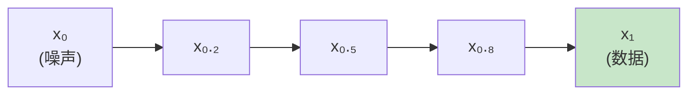
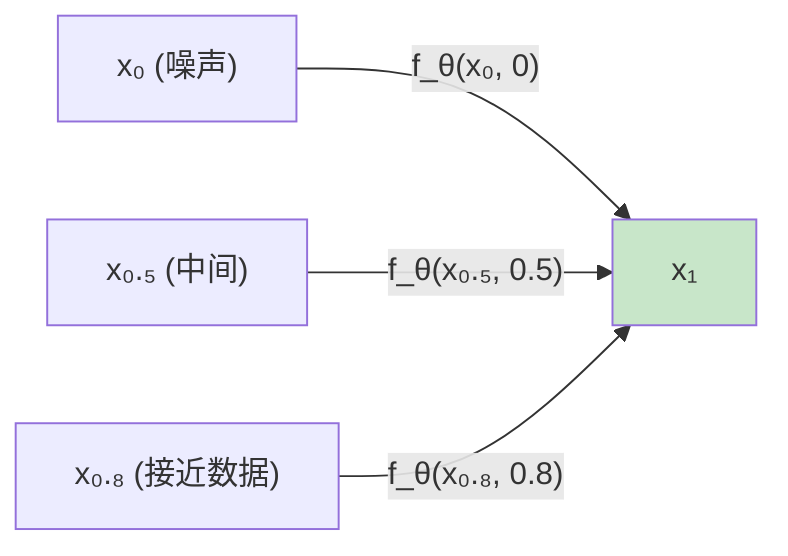
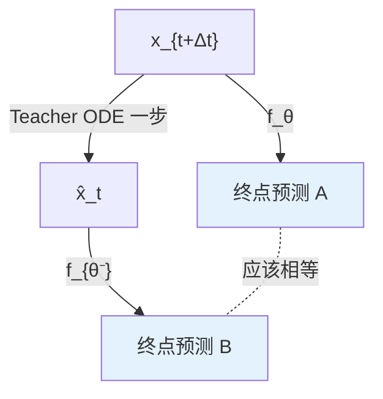
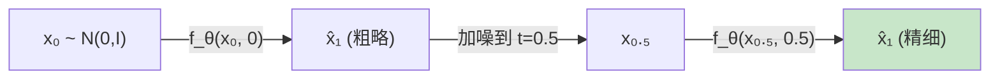
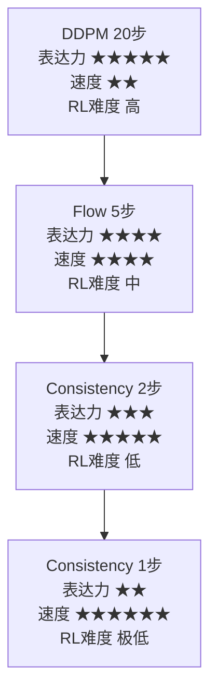

# 前置知识：Consistency Model 与一步生成

> **为什么要读这篇**：Consistency Model 是把扩散模型的多步推理压缩到 1–2 步的极端加速方案。在 Online DPRL 综述中被多次提及为"让 BPTT 方法完全可行"的关键技术。理解它才能判断什么时候该用多步扩散、什么时候该用一步一致性模型。
> **前置要求**：读完 000b（DDPM）、000g（Flow Matching）

**标签**: `#前置知识` `#Consistency Model` `#一步生成` `#蒸馏` `#自一致性` `#加速推理` `#机器人策略`

**知识链接**：
- [扩散模型 DDPM](./000b_前置知识_扩散模型DDPM) — Consistency Model 要加速的对象
- [Flow Matching](./000g_前置知识_Flow_Matching与连续归一化流) — 另一种加速方案的对比
- [为什么扩散策略难以 RL 微调](./000f_前置知识_为什么扩散策略难以RL微调) — 一步生成如何彻底解决梯度链问题
- [Online DPRL 综述](/论文综述/003_Online_DPRL_综述_扩散策略与在线RL) — 在算法家族中的定位

---

## 一、核心想法：自一致性约束

### 1.1 直觉

考虑一条从噪声到数据的 PF-ODE（Probability Flow ODE）轨迹：

普通扩散模型需要沿轨迹**逐步走**。Consistency Model 的想法是：

> **不管你在轨迹上的哪个位置，都能一步跳到终点 $\mathbf{x}_1$。**

### 1.2 形式化定义

定义一致性函数 $f_\theta : (\mathbf{x}_t, t) \to \mathbf{x}_1$，满足：

$$
\boxed{f_\theta(\mathbf{x}_t,\, t) = f_\theta(\mathbf{x}_{t'},\, t') \quad \forall\; (\mathbf{x}_t, t),\, (\mathbf{x}_{t'}, t') \;\text{在同一条 PF-ODE 轨迹上}}
$$

加上边界条件：

$$
f_\theta(\mathbf{x}_1,\, 1) = \mathbf{x}_1 \quad \text{（在数据端是恒等映射）}
$$

这两个条件保证了：从轨迹上任何点出发，输出都是同一个终点 $\mathbf{x}_1$。

### 1.3 推理——极度简化

$$
\text{采样}\; \mathbf{x}_0 \sim \mathcal{N}(\mathbf{0}, \mathbf{I}) \;\;\xrightarrow{\;f_\theta(\mathbf{x}_0,\, 0)\;}\;\; \mathbf{x}_1 = \text{最终动作}
$$

**一次前向传播！** 对比 DDPM 的 20–100 次和 Flow 的 4–10 次。

---

## 二、两种训练方式

### 2.1 Consistency Distillation (CD)

**前提**：已有一个训练好的扩散模型作为 teacher。

**核心 loss**：

**为什么需要这个 loss**：一致性约束说"同一轨迹上的任意两点都应映射到同一个终点"。但我们不能遍历轨迹上所有点对，所以退而求其次——只要求**相邻两点**的输出一致。如果每对相邻点输出都一样，传递性保证了整条轨迹的一致性。

$$
\mathcal{L}_{\text{CD}} = \mathbb{E}_{t,\,\mathbf{x}}\left\| f_\theta(\mathbf{x}_{t+\Delta t},\; t{+}\Delta t) - f_{\theta^-}(\hat{\mathbf{x}}_t,\; t) \right\|^2
$$

> **一句话直觉**：在同一条轨迹上取两个相邻点，让它们的"跳到终点"的预测尽量一致。

**逐项拆解**：

| 符号 | 含义 | 直觉 |
|------|------|------|
| $\mathbf{x}_{t+\Delta t}$ | 轨迹上较早的点（噪声更多） | "路上的上一站" |
| $\hat{\mathbf{x}}_t$ | 用 teacher ODE 从 $\mathbf{x}_{t+\Delta t}$ 走一步到 $t$ 得到的点 | "路上的下一站"（teacher 说的） |
| $f_\theta(\mathbf{x}_{t+\Delta t}, t{+}\Delta t)$ | 学生网络对上一站的终点预测 | "从这里跳，你觉得终点在哪" |
| $f_{\theta^-}(\hat{\mathbf{x}}_t, t)$ | EMA 网络对下一站的终点预测 | "从那里跳，EMA 觉得终点在哪" |
| $\theta^-$ | $\theta$ 的 EMA（慢速更新副本） | 稳定训练目标（类似 DQN 的 target network） |
| $\|\cdots\|^2$ | 两个预测的均方误差 | "两个终点预测一致吗" |
| $\Delta t$ | 相邻点的时间间隔 | 越小越精确，但训练越慢 |

**为什么用 EMA ($\theta^-$) 而不是 $\theta$**：如果两边都用 $\theta$，网络可以通过"两边一起输出常数"来作弊（loss=0 但没学到有用的东西）。用 EMA 作为 target 制造了不对称性——学生 $\theta$ 要去匹配一个"滞后版"的自己，迫使学到有意义的映射。

**数值例子**：$d=2$，$t=0.3$，$\Delta t = 0.1$

- $\mathbf{x}_{0.4}$ 是轨迹上 $t=0.4$ 的点 = $[1.2, -0.8]$
- Teacher ODE 走一步得 $\hat{\mathbf{x}}_{0.3}$ = $[1.5, -0.5]$
- 学生预测终点：$f_\theta([1.2, -0.8], 0.4) = [3.1, 2.0]$
- EMA 预测终点：$f_{\theta^-}([1.5, -0.5], 0.3) = [3.0, 2.1]$
- Loss = $(3.1-3.0)^2 + (2.0-2.1)^2 = 0.01 + 0.01 = 0.02$（很小 → 一致性好）

**直觉**：相邻两点在同一条轨迹上 → 它们的 $f_\theta$ 输出应该一致。

### 2.2 Consistency Training (CT)

不需要 teacher，直接从数据训练：

$$
\mathcal{L}_{\text{CT}} = \mathbb{E}_{t,\,\mathbf{x}_0,\,\mathbf{x}_1}\left\| f_\theta(\mathbf{x}_{t+\Delta t},\; t{+}\Delta t) - f_{\theta^-}(\mathbf{x}_t,\; t) \right\|^2
$$

其中 $\mathbf{x}_t, \mathbf{x}_{t+\Delta t}$ 通过线性插值直接构造（不需要跑 ODE）。

配合 $\Delta t$ 的退火调度：训练早期 $\Delta t$ 大（粗略一致性），后期 $\Delta t$ 小（精细一致性）。

### 2.3 对比

|  | CD（蒸馏） | CT（从头训练） |
|---|---|---|
| 需要 teacher | ✓ | ✗ |
| 生成质量 | 较高 | 略低 |
| 典型场景 | 已有 Diffusion Policy | 全新训练 |

---

## 三、网络架构：满足边界条件

一致性函数需要 $f_\theta(\mathbf{x}_1, 1) = \mathbf{x}_1$（在数据端是恒等映射）。如何让网络**硬性满足**这个约束？通过 skip connection 参数化：

$$
f_\theta(\mathbf{x}, t) = c_{\text{skip}}(t) \cdot \mathbf{x} + c_{\text{out}}(t) \cdot F_\theta(\mathbf{x}, t)
$$

> **一句话直觉**：输出 = 一部分直接抄输入（skip）+ 一部分由网络自由生成。通过让 skip 系数在 $t=1$ 时等于 1、网络系数等于 0，就硬性保证了边界条件。

**逐项拆解**：

| 符号 | 含义 | 直觉 |
|------|------|------|
| $c_{\text{skip}}(t)$ | 跳跃连接系数（从 0 到 1） | "直接抄输入的比例"——$t$ 接近 1 时几乎全抄 |
| $c_{\text{out}}(t)$ | 网络输出系数（从 1 到 0） | "网络自由发挥的比例"——$t$ 接近 0 时全靠网络 |
| $F_\theta(\mathbf{x}, t)$ | 自由网络（和 DDPM 架构相同） | "想怎么预测就怎么预测"的部分 |
| $\mathbf{x}$ | 输入的带噪数据 | 在 $t=1$ 时就是干净数据 $\mathbf{x}_1$ |

其中系数满足：

$$
c_{\text{skip}}(1) = 1,\; c_{\text{out}}(1) = 0 \quad \Rightarrow \quad f_\theta(\mathbf{x}_1, 1) = 1 \cdot \mathbf{x}_1 + 0 \cdot F_\theta = \mathbf{x}_1 \;\checkmark
$$

$$
c_{\text{skip}}(0) = 0,\; c_{\text{out}}(0) = 1 \quad \Rightarrow \quad f_\theta(\mathbf{x}_0, 0) = 0 + F_\theta(\mathbf{x}_0, 0) \;\text{（完全由网络决定）}
$$

**为什么不用 loss 来约束边界条件**：如果只在 loss 中加一个 $\|f_\theta(\mathbf{x}_1, 1) - \mathbf{x}_1\|^2$ 的惩罚项，网络可能在 $t=1$ 附近"近似"满足但不精确。参数化方式是**硬约束**——数学上保证精确满足，无论训练如何。

**数值例子**：假设 $c_{\text{skip}}(t) = t$，$c_{\text{out}}(t) = 1-t$（最简单的线性版本）

- 在 $t=0$（纯噪声输入 $\mathbf{x}_0 = [-1.2, 0.5]$）：
  - $f_\theta = 0 \times [-1.2, 0.5] + 1 \times F_\theta([-1.2, 0.5], 0) = F_\theta(\cdots)$
  - 网络完全自由决定输出（因为输入是纯噪声，没有有用信息可以"抄"）
  
- 在 $t=0.8$（接近数据的 $\mathbf{x}_{0.8} = [2.8, 4.1]$）：
  - $f_\theta = 0.8 \times [2.8, 4.1] + 0.2 \times F_\theta([2.8, 4.1], 0.8)$
  - 大部分来自直接抄输入（因为接近数据了，信号强）

$F_\theta$ 的架构和 DDPM 的去噪网络**完全相同**（UNet / MLP / Transformer），只是外面多了一层 skip connection。

---

## 四、多步一致性采样

### 4.1 为什么 1 步不够完美

理论上 1 步就能生成，但实际网络不可能完美满足一致性约束。2–3 步采样能大幅提升质量：

### 4.2 多步算法（$N=2$ 为例）

$$
\begin{aligned}
&\mathbf{x}_0 \sim \mathcal{N}(\mathbf{0}, \mathbf{I}) \\
&\hat{\mathbf{x}}_1 = f_\theta(\mathbf{x}_0,\; 0) &\text{（第一步：粗略预测终点）}\\
&\mathbf{x}_{0.5} = 0.5\,\boldsymbol{\epsilon} + 0.5\,\hat{\mathbf{x}}_1,\quad \boldsymbol{\epsilon}\sim\mathcal{N}(\mathbf{0},\mathbf{I}) &\text{（在中间时间重新注入噪声）}\\
&\hat{\mathbf{x}}_1 = f_\theta(\mathbf{x}_{0.5},\; 0.5) &\text{（第二步：精细化预测）}
\end{aligned}
$$

直觉：先画草图 → 加一点随机扰动 → 重新精细化。

---

## 五、对 RL 微调的影响

### 5.1 $N=1$ 时的策略梯度

当策略只有 1 步时，生成过程为：

$$
\mathbf{a} = f_\theta(\mathbf{x}_0,\; 0,\; \mathbf{s}), \quad \mathbf{x}_0 \sim \mathcal{N}(\mathbf{0}, \mathbf{I})
$$

> **一句话直觉**：从正态噪声出发，一步映射到动作。等价于一个"输入是噪声、输出是动作"的确定性变换。

这在形式上和**确定性策略 + 噪声输入**一样。$\log \pi(\mathbf{a}|\mathbf{s})$ 可以通过变量替换公式计算：

$$
\log \pi(\mathbf{a}|\mathbf{s}) = \log p(\mathbf{x}_0) - \log \left|\det\frac{\partial f_\theta}{\partial \mathbf{x}_0}\right|
$$

> **一句话直觉**：动作的概率 = 噪声起点的概率 / 变换对空间的拉伸程度。如果 $f_\theta$ 把噪声空间拉伸了（行列式大），那单个动作的概率就小了（概率质量被分散了）。

**逐项拆解**：

| 符号 | 含义 | 直觉 |
|------|------|------|
| $\log \pi(\mathbf{a}|\mathbf{s})$ | 在给定观测 $\mathbf{s}$ 下，生成动作 $\mathbf{a}$ 的对数概率 | "这个动作有多可能" |
| $\log p(\mathbf{x}_0)$ | 噪声起点的对数概率 | 标准正态，直接算：$-\frac{d}{2}\log(2\pi) - \frac{1}{2}\|\mathbf{x}_0\|^2$ |
| $\frac{\partial f_\theta}{\partial \mathbf{x}_0}$ | Jacobian 矩阵（$d \times d$） | 输出每个维度对输入每个维度的偏导数 |
| $\det(\cdots)$ | Jacobian 行列式 | 衡量 $f_\theta$ 在 $\mathbf{x}_0$ 附近把空间放大了多少倍 |
| $\log|\det(\cdots)|$ | 对数体积变化因子 | 减去它 = "补偿空间拉伸导致的密度稀释" |
| 减号 | 拉伸越大密度越低 | 把一团面拉大 → 面变薄 → 每个位置的"面密度"降低 |

**数值例子**：$d=2$，噪声 $\mathbf{x}_0 = [0.5, -0.3]$

- $\log p(\mathbf{x}_0) = -\log(2\pi) - \frac{1}{2}(0.25 + 0.09) = -1.837 - 0.17 = -2.007$
- 假设 Jacobian $= \begin{bmatrix} 2 & 0.5 \\ 0.1 & 1.5 \end{bmatrix}$，$\det = 2 \times 1.5 - 0.5 \times 0.1 = 2.95$
- $\log|\det| = \log(2.95) = 1.082$
- $\log \pi(\mathbf{a}|\mathbf{s}) = -2.007 - 1.082 = -3.089$

空间被放大了约 3 倍 → 概率密度下降了 3 倍 → log 概率减少了 $\log 3 \approx 1.08$。

> Jacobian 行列式计算 $O(d^3)$（完整），或用 Hutchinson estimator 近似到 $O(d)$。对于机器人动作维度（$d \leq 20$），精确计算通常可行。

更重要的是——**BPTT 完全无压力**：

$$
\nabla_\theta Q(\mathbf{s}, \mathbf{a})\Big|_{\mathbf{a}=f_\theta(\mathbf{x}_0, 0, \mathbf{s})} \quad \text{梯度只穿过 1 层网络}
$$

不存在梯度消失/爆炸。和训练普通神经网络策略一样简单。

### 5.2 和各方法的 RL 友好度对比

| 生成模型 | 推理步数 | BPTT 可行性 | 需要 DPPO 展开 | 直接 PG |
|---|---|---|---|---|
| DDPM 20步 | 20 | ✗ (梯度崩) | ✓ (必须) | ✗ |
| Flow 5步 | 5 | ✓ | 可选 | △ (方差) |
| Consistency 2步 | 2 | ✓✓ | 不需要 | △ |
| Consistency 1步 | 1 | ✓✓✓ | 不需要 | ✓ |

### 5.3 Trade-off：表达力 vs 推理速度 vs RL 友好度

> RL 微调本身会提升策略质量。即使初始表达力略低，微调后可能追平多步扩散。"Consistency Policy + 简单 PG" 是否能匹配 "Diffusion Policy + DPPO"？2026 年仍是开放问题。

---

## 六、和 Flow Matching 的对比

|  | Flow Matching | Consistency Model |
|---|---|---|
| 推理步数 | 4–10 | 1–2 |
| 路径定义 | 连续 ODE 轨迹 | 轨迹上任意点→终点 |
| 训练方式 | 向量场回归 | 一致性约束/蒸馏 |
| 表达力 | 高 | 中 |
| RL 微调方式 | BPTT / Proximity | 直接 PG / BPTT |
| 适用场景 | 速度和质量平衡 | 极致速度优先 |

---

## 七、总结

### 核心公式回顾

$$
\underbrace{f_\theta(\mathbf{x}_t, t) = f_\theta(\mathbf{x}_{t'}, t')}_{\text{一致性约束}} \qquad \underbrace{f_\theta(\mathbf{x}_1, 1) = \mathbf{x}_1}_{\text{边界条件}}
$$

### 什么时候选 Consistency Model

| 选它 | 不选它 |
|---|---|
| 控制频率 > 100Hz | 数据极其复杂多模态 |
| 边缘设备部署 | 不缺推理时间 |
| 需要简单 PG 做 RL | DPPO 已效果很好 |
| 已有 Diffusion Policy 可蒸馏 | — |

---

## 延伸阅读

- Song et al. (2023) "Consistency Models" ← 原始论文
- Song & Dhariwal (2024) "Improved Consistency Training"
- Prasad et al. (2024) "Consistency Policy" ← 用在机器人上
- [Flow Matching](./000g_前置知识_Flow_Matching与连续归一化流) ← 另一种加速方案
- [DPPO](/论文综述/001_DPPO_扩散策略策略优化) ← 多步扩散的 RL 微调方案
- [Online DPRL 综述](/论文综述/003_Online_DPRL_综述_扩散策略与在线RL) ← 步数对算法选择的影响
