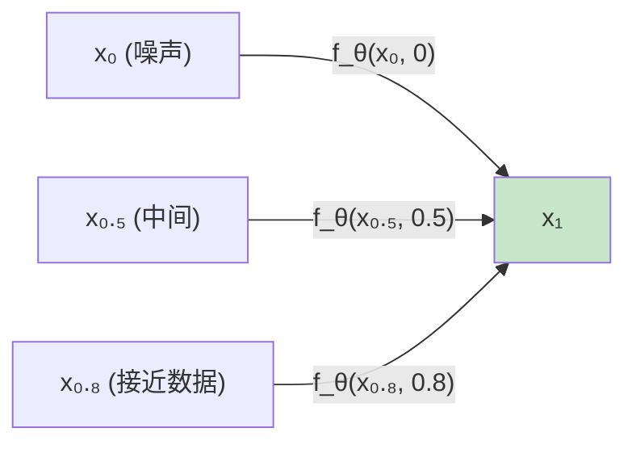
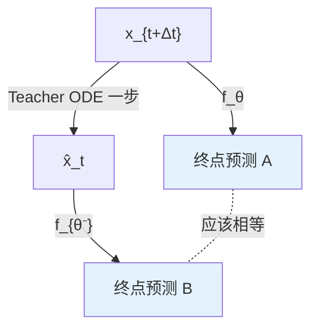
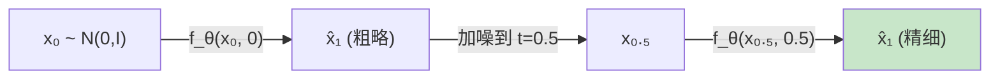
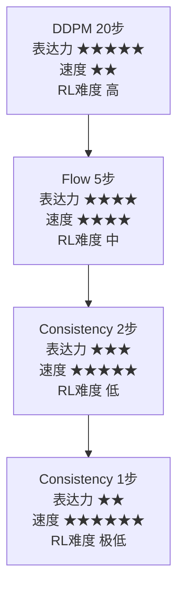

# 前置知识：Consistency Model 与一步生成

> **为什么要读这篇**：Consistency Model 是把扩散模型的多步推理压缩到 1–2 步的极端加速方案。在 Online DPRL 综述中被多次提及为"让 BPTT 方法完全可行"的关键技术。理解它才能判断什么时候该用多步扩散、什么时候该用一步一致性模型。
> **前置要求**：读完 000b（DDPM）、000g（Flow Matching）

**标签**: `#前置知识` `#Consistency Model` `#一步生成` `#蒸馏` `#自一致性` `#加速推理` `#机器人策略`

**知识链接**：
- [扩散模型 DDPM](./000b_前置知识_扩散模型DDPM) — Consistency Model 要加速的对象
- [Flow Matching](./000g_前置知识_Flow_Matching与连续归一化流) — 另一种加速方案的对比，本文第 1.1 节的轨迹例子沿用它的直线插值
- [常微分方程 ODE 直觉与数值求解](./001b_前置知识_常微分方程ODE直觉与数值求解) — 理解"给定一点即可积分出整条轨迹"这条 ODE 确定性的前提
- [随机微分方程 SDE 直觉与扩散模型的联系](./001c_前置知识_随机微分方程SDE直觉与扩散模型的联系) — 对比 SDE：有随机项时中间一点不足以确定终点
- [为什么扩散策略难以 RL 微调](./000f_前置知识_为什么扩散策略难以RL微调) — 一步生成如何彻底解决梯度链问题
- [Online DPRL 综述](/论文综述/003_Online_DPRL_综述_扩散策略与在线RL) — 在算法家族中的定位

---

## 一、核心想法：自一致性约束

### 1.1 出发点：PF-ODE 轨迹是完全确定的

先回忆一个已经在 [Flow Matching](/前置知识/000g_前置知识_Flow_Matching与连续归一化流) 和 [ODE 直觉](/前置知识/001b_前置知识_常微分方程ODE直觉与数值求解) 里讲过、但这里必须重新拿出来强调的事实：**PF-ODE（Probability Flow ODE，即扩散/Flow 模型推理时用的那条确定性微分方程）没有任何随机性**。给定一个速度场 $v(\mathbf{x},t)$，只要你知道轨迹上**任意一个点** $(\mathbf{x}_t, t)$，就可以用这个 ODE 把整条轨迹**唯一地**积分出来——往前积分到 $t=1$ 能求出终点 $\mathbf{x}_1$，往后积分到 $t=0$ 能求出起点 $\mathbf{x}_0$。这跟 [SDE](/前置知识/001c_前置知识_随机微分方程SDE直觉与扩散模型的联系) 完全不同：SDE 有随机项，知道中间一点不足以确定终点会落在哪；ODE 没有随机项，中间一点已经**唯一决定了**整条轨迹，包括还没走到的终点。

用一个具体的例子把这件事钉死。取 [Flow Matching](/前置知识/000g_前置知识_Flow_Matching与连续归一化流#3.1-条件-flow-conditional-flow) 里最简单的直线轨迹，速度场是常数 $v=4$，起点 $x_0=-1$：

$$
x_t = x_0 + v\cdot t = -1+4t
$$

代入几个时刻：

| $t$ | 0 | 0.25 | 0.5 | 0.75 | 1 |
|---|---|---|---|---|---|
| $x_t$ | $-1$ | $0$ | $1$ | $2$ | $3$ |

这条轨迹的终点是 $x_1=3$。关键点在这里：**如果只告诉你"在 $t=0.5$ 时 $x_t=1$"，不告诉你别的任何信息，你依然能算出终点必须是 $3$**——只要知道速度场是常数 $4$，往前推 $0.5$ 个时间单位就是 $1+4\times0.5=3$。同样地，如果只告诉你 $t=0.75$ 时 $x_t=2$，往前推 $0.25$ 个时间单位，$2+4\times0.25=3$，还是 $3$。

**这就是 Consistency Model 想利用的结构**：轨迹上每一个点，单独一个点，就已经携带了"终点在哪"的完整信息。既然信息已经在那儿了，就不需要老老实实沿着 ODE 一步步积分才能拿到终点——可以训练一个网络，直接学会"看到轨迹上任意一点，直接读出终点"这个映射。

### 1.2 "同一条轨迹"是什么意思

在写形式化定义之前，先把"同一条 PF-ODE 轨迹"这个说法钉准确：两个点 $(\mathbf{x}_t,t)$ 和 $(\mathbf{x}_{t'},t')$ 在同一条轨迹上，指的是——从其中一个点出发，沿着 PF-ODE 正向或反向积分，能够**精确**走到另一个点。等价地说，它们对应同一个起点 $\mathbf{x}_0$ 和同一个终点 $\mathbf{x}_1$，只是在轨迹上取样的时刻不同。上一节表格里的 5 个点 $(x_0=-1,x_{0.25}=0,x_{0.5}=1,x_{0.75}=2,x_1=3)$ 就是同一条轨迹上的 5 个点——它们是同一次"从 $-1$ 出发、以速度 $4$ 匀速运动"这个过程在 5 个不同时刻的快照。

### 1.3 一致性约束的形式化定义

**Step 1：这个约束在规定什么**

**它不是在计算一个具体的数值，而是在对函数 $f_\theta$ 提出一个结构性要求：只要两个输入点 $(\mathbf{x}_t,t)$ 和 $(\mathbf{x}_{t'},t')$ 来自同一条轨迹（哪怕 $t$ 和 $t'$ 相差很远），$f_\theta$ 就必须给出完全相同的输出。**

$$
\boxed{f_\theta(\mathbf{x}_t,\, t) = f_\theta(\mathbf{x}_{t'},\, t') \quad \forall\; (\mathbf{x}_t, t),\, (\mathbf{x}_{t'}, t') \;\text{在同一条 PF-ODE 轨迹上}}
$$

> **一句话直觉**：既然第 1.1 节已经证明了"轨迹上任意一点都已经唯一决定了终点"，那就应该存在一个函数，直接从"轨迹上的某一点"读出"这条轨迹的终点"——而且不管你喂给它这条轨迹上哪一个点，读出来的终点都应该是同一个数。这个约束就是把这句话写成了数学条件。

**逐符号拆解**：

| 符号 | 数学含义 | 在本场景中具体是什么 |
|---|---|---|
| $f_\theta$ | 待学习的神经网络函数 | 输入一个"轨迹上的点"，输出网络认为的"这条轨迹的终点" |
| $(\mathbf{x}_t, t)$ | 轨迹上的一个点，带时间戳 | 比如上面例子里的 $(1, 0.5)$——数值 $1$，加上"这是 $t=0.5$ 时刻的值"的标签 |
| $(\mathbf{x}_{t'}, t')$ | 同一条轨迹上的另一个点 | 比如 $(2, 0.75)$——同一条轨迹在不同时刻的另一个快照 |
| $\forall$ | 全称量词，"对所有" | 这个等式必须对**任意**取法的两个同轨迹点都成立，不是碰巧成立一次 |
| "在同一条 PF-ODE 轨迹上" | 第 1.2 节定义的限定条件 | 只约束"同一条轨迹"内部，不同轨迹之间 $f_\theta$ 的输出可以（而且应该）不同 |

**数值代入**：继续用第 1.1 节那条轨迹（$x_0=-1$，$v=4$，终点 $x_1=3$）。取轨迹上两个点 $(\mathbf{x}_{0.5},0.5)=(1,0.5)$ 和 $(\mathbf{x}_{0.75},0.75)=(2,0.75)$——它们在同一条轨迹上，所以一致性约束要求：

$$
f_\theta(1,\ 0.5) = f_\theta(2,\ 0.75)
$$

而且（结合下面的边界条件）这两个值还必须都等于 $3$。**反面例子**：如果训练出来的网络给出 $f_\theta(1,0.5)=2.8$、$f_\theta(2,0.75)=3.4$，这就是一个不满足一致性的网络——它意味着"这条轨迹的终点是多少"这个问题的答案，居然取决于你恰好用轨迹上哪一个时刻的快照去问它，这在逻辑上是矛盾的（第 1.1 节已经证明了终点是唯一确定的，不该随你选的时刻而变化）。训练的目标就是不断压低类似上面这种"同轨迹不同点输出不一致"的差异。

**为什么要提出这样一个约束（设计动机）**：普通扩散/Flow 模型的推理，是把"点 → 终点"这个映射，拆成很多个"点 → 轨迹上下一个点"的小步骤，一步步挪过去。这样做没有发挥出"任意一点已经唯一决定终点"这个事实——它把一步能做的事拆成了几十步。Consistency Model 反过来：既然终点已经被完全决定了，那就直接训练一个函数把这个"点 → 终点"的映射整体学出来，不再要求它必须一步一步挪。一致性约束正是"点 → 终点"这个映射天然具有的性质——同一条轨迹上取哪个点都无所谓，答案都一样——把这条性质显式地写成训练目标，就得到了上面的公式。

**但光有这一条还不够**：它只规定了"同一条轨迹上的点必须互相一致"，却没规定这个共同的输出值具体应该等于多少——理论上网络可以在每条轨迹上都一致地输出错误的值。要把这个共同值锚定成"轨迹的终点"，还需要下面这条边界条件：

$$
f_\theta(\mathbf{x}_1,\, 1) = \mathbf{x}_1 \quad \text{（在数据端是恒等映射）}
$$

这条很好理解：如果你喂给 $f_\theta$ 的点恰好就是终点本身（$t=1$），那它应该原样输出，不用做任何变换。把这条和一致性约束合在一起：轨迹上任意一点的输出，都必须等于终点处的输出（一致性），而终点处的输出被强制等于终点本身（边界条件）——两条加起来，**从轨迹上任何一点出发，$f_\theta$ 的输出都精确等于这条轨迹的终点 $\mathbf{x}_1$**。回到数值例子：$f_\theta(1,0.5)=f_\theta(2,0.75)=f_\theta(3,1)=3$，三个数完全相同，且等于终点值 $3$。

```mermaid
flowchart LR
    A["x₀ (噪声)"] -->|"f_θ(x₀, 0)"| D["x₁"]
    B["x₀.₅ (中间)"] -->|"f_θ(x₀.₅, 0.5)"| D
    C["x₀.₈ (接近数据)"] -->|"f_θ(x₀.₈, 0.8)"| D
    style D fill:#c8e6c9
```

### 1.4 推理——极度简化

$$
\text{采样}\; \mathbf{x}_0 \sim \mathcal{N}(\mathbf{0}, \mathbf{I}) \;\;\xrightarrow{\;f_\theta(\mathbf{x}_0,\, 0)\;}\;\; \mathbf{x}_1 = \text{最终动作}
$$

**一次前向传播！** 对比 DDPM 的 20–100 次和 Flow 的 4–10 次。

---

## 二、两种训练方式

### 2.1 Consistency Distillation (CD)

**前提**：已有一个训练好的扩散模型作为 teacher。

**核心 loss**：

**为什么需要这个 loss**：一致性约束说"同一轨迹上的任意两点都应映射到同一个终点"。但我们不能遍历轨迹上所有点对，所以退而求其次——只要求**相邻两点**的输出一致。如果每对相邻点输出都一样，传递性保证了整条轨迹的一致性。

$$
\mathcal{L}_{\text{CD}} = \mathbb{E}_{t,\,\mathbf{x}}\left\| f_\theta(\mathbf{x}_{t+\Delta t},\; t{+}\Delta t) - f_{\theta^-}(\hat{\mathbf{x}}_t,\; t) \right\|^2
$$

> **一句话直觉**：在同一条轨迹上取两个相邻点，让它们的"跳到终点"的预测尽量一致。

**逐项拆解**：

| 符号 | 含义 | 直觉 |
|------|------|------|
| $\mathbf{x}_{t+\Delta t}$ | 轨迹上较早的点（噪声更多） | "路上的上一站" |
| $\hat{\mathbf{x}}_t$ | 用 teacher ODE 从 $\mathbf{x}_{t+\Delta t}$ 走一步到 $t$ 得到的点 | "路上的下一站"（teacher 说的） |
| $f_\theta(\mathbf{x}_{t+\Delta t}, t{+}\Delta t)$ | 学生网络对上一站的终点预测 | "从这里跳，你觉得终点在哪" |
| $f_{\theta^-}(\hat{\mathbf{x}}_t, t)$ | EMA 网络对下一站的终点预测 | "从那里跳，EMA 觉得终点在哪" |
| $\theta^-$ | $\theta$ 的 EMA（慢速更新副本） | 稳定训练目标（类似 DQN 的 target network） |
| $\|\cdots\|^2$ | 两个预测的均方误差 | "两个终点预测一致吗" |
| $\Delta t$ | 相邻点的时间间隔 | 越小越精确，但训练越慢 |

**为什么用 EMA ($\theta^-$) 而不是 $\theta$**：如果两边都用 $\theta$，网络可以通过"两边一起输出常数"来作弊（loss=0 但没学到有用的东西）。用 EMA 作为 target 制造了不对称性——学生 $\theta$ 要去匹配一个"滞后版"的自己，迫使学到有意义的映射。

**数值例子**：$d=2$，$t=0.3$，$\Delta t = 0.1$

- $\mathbf{x}_{0.4}$ 是轨迹上 $t=0.4$ 的点 = $[1.2, -0.8]$
- Teacher ODE 走一步得 $\hat{\mathbf{x}}_{0.3}$ = $[1.5, -0.5]$
- 学生预测终点：$f_\theta([1.2, -0.8], 0.4) = [3.1, 2.0]$
- EMA 预测终点：$f_{\theta^-}([1.5, -0.5], 0.3) = [3.0, 2.1]$
- Loss = $(3.1-3.0)^2 + (2.0-2.1)^2 = 0.01 + 0.01 = 0.02$（很小 → 一致性好）

**直觉**：相邻两点在同一条轨迹上 → 它们的 $f_\theta$ 输出应该一致。

```mermaid
flowchart TD
    A["x_{t+Δt}"] -->|"f_θ"| C["终点预测 A"]
    A -->|"Teacher ODE 一步"| B["x̂_t"]
    B -->|"f_{θ⁻}"| D["终点预测 B"]
    C -.-|"应该相等"| D
    style C fill:#e3f2fd
    style D fill:#e3f2fd
```

### 2.2 Consistency Training (CT)

**为什么需要这个 loss**：CD 的 $\hat{\mathbf{x}}_t$ 是靠"跑一步 teacher ODE"算出来的，前提是必须先有一个训练好的 teacher。CT 想去掉这个前提——直接从训练数据构造轨迹上的点，不需要 teacher，也不需要跑 ODE。

$$
\mathcal{L}_{\text{CT}} = \mathbb{E}_{t,\,\mathbf{x}_0,\,\mathbf{x}_1}\left\| f_\theta(\mathbf{x}_{t+\Delta t},\; t{+}\Delta t) - f_{\theta^-}(\mathbf{x}_t,\; t) \right\|^2
$$

> **一句话直觉**：和 CD 用的是同一个"相邻两点应该输出一致"的约束，唯一区别是这两个相邻点怎么来——CD 靠 teacher 网络跑出来，CT 靠直接对同一个 $(\mathbf{x}_0,\mathbf{x}_1)$ 做两次不同时刻的线性插值算出来。

**逐项拆解**：

| 符号 | 含义 | 和 CD 对应项的区别 |
|------|------|------------------|
| $\mathbf{x}_0\sim\mathcal{N}(0,I)$ | 采样一个噪声起点 | CD 里没有单独采样 $\mathbf{x}_0$，是从数据反推轨迹 |
| $\mathbf{x}_1$ | 从训练数据里取一个真实样本 | 作为这条轨迹的终点 |
| $\mathbf{x}_t=(1-t)\mathbf{x}_0+t\mathbf{x}_1$ | 用 [直线插值公式](/前置知识/000g_前置知识_Flow_Matching与连续归一化流#3.1-条件-flow-conditional-flow) 直接算出轨迹上 $t$ 时刻的点 | CD 是从 $\mathbf{x}_{t+\Delta t}$ 跑一步 teacher ODE 才能得到 $\hat{\mathbf{x}}_t$；CT 直接用公式算，不跑网络 |
| $\mathbf{x}_{t+\Delta t}$ | 同一对 $(\mathbf{x}_0,\mathbf{x}_1)$，代入 $t+\Delta t$ 算出的另一个点 | 和 $\mathbf{x}_t$ 在同一条（人为构造的）直线轨迹上 |
| $f_{\theta^-}$ | EMA 网络，作用和 CD 完全一样 | 防止两边都用 $\theta$ 导致"输出常数"式作弊 |

**数值代入**：$d=1$，$t=0.3$，$\Delta t=0.1$，$\mathbf{x}_0=-1$，$\mathbf{x}_1=3$（第 1.1 节的同一条轨迹）：

$$
\mathbf{x}_{0.3} = 0.7\times(-1)+0.3\times3 = -0.7+0.9=0.2,\qquad \mathbf{x}_{0.4}=0.6\times(-1)+0.4\times3=-0.6+1.2=0.6
$$

假设学生网络 $f_\theta(0.6, 0.4)=2.9$，EMA 网络 $f_{\theta^-}(0.2,0.3)=3.05$，则这一项 loss $=(2.9-3.05)^2=0.0225$——训练目标就是把这类差异压小,让两边都逼近真正的终点 $3$。

**为什么这样能省掉 teacher**：CD 需要 teacher 是因为要通过跑一步 ODE 才能知道"轨迹上另一个点在哪"；而 CT 利用了直线插值公式本身就能直接算出轨迹上任意时刻的点（这正是 [Flow Matching](/前置知识/000g_前置知识_Flow_Matching与连续归一化流#3.1-条件-flow-conditional-flow) 里讲过的——路径是人为定义的直线，不需要模型参与就能算出任意 $t$ 处的坐标），所以不再需要一个额外训练好的网络来"告诉你"轨迹上的下一个点在哪。

配合 $\Delta t$ 的退火调度：训练早期 $\Delta t$ 大（粗略一致性），后期 $\Delta t$ 小（精细一致性）。

### 2.3 对比

|  | CD（蒸馏） | CT（从头训练） |
|---|---|---|
| 需要 teacher | ✓ | ✗ |
| 生成质量 | 较高 | 略低 |
| 典型场景 | 已有 Diffusion Policy | 全新训练 |

---

## 三、网络架构：满足边界条件

一致性函数需要 $f_\theta(\mathbf{x}_1, 1) = \mathbf{x}_1$（在数据端是恒等映射）。如何让网络**硬性满足**这个约束？通过 skip connection 参数化：

$$
f_\theta(\mathbf{x}, t) = c_{\text{skip}}(t) \cdot \mathbf{x} + c_{\text{out}}(t) \cdot F_\theta(\mathbf{x}, t)
$$

> **一句话直觉**：输出 = 一部分直接抄输入（skip）+ 一部分由网络自由生成。通过让 skip 系数在 $t=1$ 时等于 1、网络系数等于 0，就硬性保证了边界条件。

**逐项拆解**：

| 符号 | 含义 | 直觉 |
|------|------|------|
| $c_{\text{skip}}(t)$ | 跳跃连接系数（从 0 到 1） | "直接抄输入的比例"——$t$ 接近 1 时几乎全抄 |
| $c_{\text{out}}(t)$ | 网络输出系数（从 1 到 0） | "网络自由发挥的比例"——$t$ 接近 0 时全靠网络 |
| $F_\theta(\mathbf{x}, t)$ | 自由网络（和 DDPM 架构相同） | "想怎么预测就怎么预测"的部分 |
| $\mathbf{x}$ | 输入的带噪数据 | 在 $t=1$ 时就是干净数据 $\mathbf{x}_1$ |

其中系数满足：

$$
c_{\text{skip}}(1) = 1,\; c_{\text{out}}(1) = 0 \quad \Rightarrow \quad f_\theta(\mathbf{x}_1, 1) = 1 \cdot \mathbf{x}_1 + 0 \cdot F_\theta = \mathbf{x}_1 \;\checkmark
$$

$$
c_{\text{skip}}(0) = 0,\; c_{\text{out}}(0) = 1 \quad \Rightarrow \quad f_\theta(\mathbf{x}_0, 0) = 0 + F_\theta(\mathbf{x}_0, 0) \;\text{（完全由网络决定）}
$$

**为什么不用 loss 来约束边界条件**：如果只在 loss 中加一个 $\|f_\theta(\mathbf{x}_1, 1) - \mathbf{x}_1\|^2$ 的惩罚项，网络可能在 $t=1$ 附近"近似"满足但不精确。参数化方式是**硬约束**——数学上保证精确满足，无论训练如何。

**数值例子**：假设 $c_{\text{skip}}(t) = t$，$c_{\text{out}}(t) = 1-t$（最简单的线性版本）

- 在 $t=0$（纯噪声输入 $\mathbf{x}_0 = [-1.2, 0.5]$）：
  - $f_\theta = 0 \times [-1.2, 0.5] + 1 \times F_\theta([-1.2, 0.5], 0) = F_\theta(\cdots)$
  - 网络完全自由决定输出（因为输入是纯噪声，没有有用信息可以"抄"）
  
- 在 $t=0.8$（接近数据的 $\mathbf{x}_{0.8} = [2.8, 4.1]$）：
  - $f_\theta = 0.8 \times [2.8, 4.1] + 0.2 \times F_\theta([2.8, 4.1], 0.8)$
  - 大部分来自直接抄输入（因为接近数据了，信号强）

$F_\theta$ 的架构和 DDPM 的去噪网络**完全相同**（UNet / MLP / Transformer），只是外面多了一层 skip connection。

---

## 四、多步一致性采样

### 4.1 为什么 1 步不够完美

第一节的推导有一个隐藏前提：$f_\theta$ **完美**满足一致性约束。但网络是训练出来的，误差不可能为零——在实际使用的网络里，$f_\theta(\mathbf{x}_0,0)$ 给出的只是终点的一个**近似**，而不是精确值。1 步生成把这个近似误差全部暴露给了最终输出，没有任何修正机会。多步采样的思路是：把第一步的（不完美的）输出，重新当成"轨迹上一个新的点"，再问网络一次"从这里出发终点在哪"——利用一致性约束的性质再修正一轮。

### 4.2 多步算法（$N=2$ 为例）

**Step 1：这组公式在做什么**

**它先让网络粗略猜一次终点，然后把这个粗略猜测重新构造成"轨迹上 $t=0.5$ 处的一个点"（通过和一份新噪声按比例混合），再喂给网络问第二次，得到更精细的终点估计。**

$$
\begin{aligned}
&\mathbf{x}_0 \sim \mathcal{N}(\mathbf{0}, \mathbf{I}) \\
&\hat{\mathbf{x}}_1 = f_\theta(\mathbf{x}_0,\; 0) &\text{（第一步：粗略预测终点）}\\
&\mathbf{x}_{0.5} = 0.5\,\boldsymbol{\epsilon} + 0.5\,\hat{\mathbf{x}}_1,\quad \boldsymbol{\epsilon}\sim\mathcal{N}(\mathbf{0},\mathbf{I}) &\text{（在中间时间重新注入噪声）}\\
&\hat{\mathbf{x}}_1 = f_\theta(\mathbf{x}_{0.5},\; 0.5) &\text{（第二步：精细化预测）}
\end{aligned}
$$

**逐项拆解**：

| 符号 | 含义 | 为什么这么做 |
|---|---|---|
| $\hat{\mathbf{x}}_1=f_\theta(\mathbf{x}_0,0)$ | 第一步得到的终点估计 | 是"猜测值"，不是真终点——因为 $f_\theta$ 不完美 |
| $\mathbf{x}_{0.5}=0.5\boldsymbol\epsilon+0.5\hat{\mathbf{x}}_1$ | 把猜测的终点和一份**全新**噪声按 $t=0.5$ 的比例混合 | 这正是 [直线插值公式](/前置知识/000g_前置知识_Flow_Matching与连续归一化流#3.1-条件-flow-conditional-flow) $x_t=(1-t)x_0+tx_1$ 在 $t=0.5$ 时的写法，把 $\hat{\mathbf{x}}_1$ 当作"终点"、$\boldsymbol\epsilon$ 当作"新起点"，人为构造出一个"轨迹上 $t=0.5$ 处的点" |
| $f_\theta(\mathbf{x}_{0.5},0.5)$ | 第二次调用网络 | 网络再猜一次终点，这次输入点离真实终点更近（因为它是根据第一次的猜测构造出来的），猜测的误差有机会被修正 |

**为什么要重新注入噪声 $\boldsymbol\epsilon$，而不是直接把 $\hat{\mathbf{x}}_1$ 当成 $\mathbf{x}_{0.5}$**：如果不加噪声，直接把第一步的输出原样喂回网络当作 $\mathbf{x}_{0.5}$，那么第二次调用的输入 $(\hat{\mathbf{x}}_1, 0.5)$ 根本不在任何一条"真实"的 PF-ODE 轨迹上（它只是"终点的猜测值"，配上一个随便挑的时间标签 $0.5$）——网络在训练时从来没见过这种"标签和内容不匹配"的输入，输出没有意义。重新混入一份噪声，是在**模拟"如果这个猜测的终点是对的，那条轨迹在 $t=0.5$ 时应该长什么样"**，让第二次输入至少形式上符合网络训练时见过的分布。

**数值代入**：$d=1$，$\mathbf{x}_0=0.8$。第一步 $\hat{\mathbf{x}}_1=f_\theta(0.8,0)=2.6$（网络的粗略猜测，假设真实终点是 $3.0$，误差 $0.4$）。采样新噪声 $\boldsymbol\epsilon=-0.3$：

$$
\mathbf{x}_{0.5}=0.5\times(-0.3)+0.5\times2.6=-0.15+1.3=1.15
$$

第二步 $f_\theta(1.15,0.5)=2.85$（假设这次网络给出的估计更接近真实终点 $3.0$，误差缩小到 $0.15$）。两步之后的输出比一步更准，就是"多步能提升质量"的体现。

```mermaid
flowchart LR
    A["x₀ ~ N(0,I)"] -->|"f_θ(x₀, 0)"| B["x̂₁ (粗略)"]
    B -->|"加噪到 t=0.5"| C["x₀.₅"]
    C -->|"f_θ(x₀.₅, 0.5)"| D["x̂₁ (精细)"]
    style D fill:#c8e6c9
```

直觉：先画草图 → 加一点随机扰动 → 重新精细化。

---

## 五、对 RL 微调的影响

### 5.1 $N=1$ 时的策略梯度

当策略只有 1 步时，生成过程为：

$$
\mathbf{a} = f_\theta(\mathbf{x}_0,\; 0,\; \mathbf{s}), \quad \mathbf{x}_0 \sim \mathcal{N}(\mathbf{0}, \mathbf{I})
$$

> **一句话直觉**：从正态噪声出发，一步映射到动作。等价于一个"输入是噪声、输出是动作"的确定性变换。

这在形式上和**确定性策略 + 噪声输入**一样。$\log \pi(\mathbf{a}|\mathbf{s})$ 可以通过变量替换公式计算：

$$
\log \pi(\mathbf{a}|\mathbf{s}) = \log p(\mathbf{x}_0) - \log \left|\det\frac{\partial f_\theta}{\partial \mathbf{x}_0}\right|
$$

> **一句话直觉**：动作的概率 = 噪声起点的概率 / 变换对空间的拉伸程度。如果 $f_\theta$ 把噪声空间拉伸了（行列式大），那单个动作的概率就小了（概率质量被分散了）。

**逐项拆解**：

| 符号 | 含义 | 直觉 |
|------|------|------|
| $\log \pi(\mathbf{a}|\mathbf{s})$ | 在给定观测 $\mathbf{s}$ 下，生成动作 $\mathbf{a}$ 的对数概率 | "这个动作有多可能" |
| $\log p(\mathbf{x}_0)$ | 噪声起点的对数概率 | 标准正态，直接算：$-\frac{d}{2}\log(2\pi) - \frac{1}{2}\|\mathbf{x}_0\|^2$ |
| $\frac{\partial f_\theta}{\partial \mathbf{x}_0}$ | Jacobian 矩阵（$d \times d$） | 输出每个维度对输入每个维度的偏导数 |
| $\det(\cdots)$ | Jacobian 行列式 | 衡量 $f_\theta$ 在 $\mathbf{x}_0$ 附近把空间放大了多少倍 |
| $\log|\det(\cdots)|$ | 对数体积变化因子 | 减去它 = "补偿空间拉伸导致的密度稀释" |
| 减号 | 拉伸越大密度越低 | 把一团面拉大 → 面变薄 → 每个位置的"面密度"降低 |

**数值例子**：$d=2$，噪声 $\mathbf{x}_0 = [0.5, -0.3]$

- $\log p(\mathbf{x}_0) = -\log(2\pi) - \frac{1}{2}(0.25 + 0.09) = -1.837 - 0.17 = -2.007$
- 假设 Jacobian $= \begin{bmatrix} 2 & 0.5 \\ 0.1 & 1.5 \end{bmatrix}$，$\det = 2 \times 1.5 - 0.5 \times 0.1 = 2.95$
- $\log|\det| = \log(2.95) = 1.082$
- $\log \pi(\mathbf{a}|\mathbf{s}) = -2.007 - 1.082 = -3.089$

空间被放大了约 3 倍 → 概率密度下降了 3 倍 → log 概率减少了 $\log 3 \approx 1.08$。

> Jacobian 行列式计算 $O(d^3)$（完整），或用 Hutchinson estimator 近似到 $O(d)$。对于机器人动作维度（$d \leq 20$），精确计算通常可行。

更重要的是——**BPTT 完全无压力**：

$$
\nabla_\theta Q(\mathbf{s}, \mathbf{a})\Big|_{\mathbf{a}=f_\theta(\mathbf{x}_0, 0, \mathbf{s})} \quad \text{梯度只穿过 1 层网络}
$$

不存在梯度消失/爆炸。和训练普通神经网络策略一样简单。

### 5.2 和各方法的 RL 友好度对比

| 生成模型 | 推理步数 | BPTT 可行性 | 需要 DPPO 展开 | 直接 PG |
|---|---|---|---|---|
| DDPM 20步 | 20 | ✗ (梯度崩) | ✓ (必须) | ✗ |
| Flow 5步 | 5 | ✓ | 可选 | △ (方差) |
| Consistency 2步 | 2 | ✓✓ | 不需要 | △ |
| Consistency 1步 | 1 | ✓✓✓ | 不需要 | ✓ |

### 5.3 Trade-off：表达力 vs 推理速度 vs RL 友好度

```mermaid
graph TD
    A["DDPM 20步<br/>表达力 ★★★★★<br/>速度 ★★<br/>RL难度 高"]
    B["Flow 5步<br/>表达力 ★★★★<br/>速度 ★★★★<br/>RL难度 中"]
    C["Consistency 2步<br/>表达力 ★★★<br/>速度 ★★★★★<br/>RL难度 低"]
    D["Consistency 1步<br/>表达力 ★★<br/>速度 ★★★★★★<br/>RL难度 极低"]
    A --> B --> C --> D
```

> RL 微调本身会提升策略质量。即使初始表达力略低，微调后可能追平多步扩散。"Consistency Policy + 简单 PG" 是否能匹配 "Diffusion Policy + DPPO"？2026 年仍是开放问题。

---

## 六、和 Flow Matching 的对比

|  | Flow Matching | Consistency Model |
|---|---|---|
| 推理步数 | 4–10 | 1–2 |
| 路径定义 | 连续 ODE 轨迹 | 轨迹上任意点→终点 |
| 训练方式 | 向量场回归 | 一致性约束/蒸馏 |
| 表达力 | 高 | 中 |
| RL 微调方式 | BPTT / Proximity | 直接 PG / BPTT |
| 适用场景 | 速度和质量平衡 | 极致速度优先 |

---

## 七、总结

### 核心公式回顾

$$
\underbrace{f_\theta(\mathbf{x}_t, t) = f_\theta(\mathbf{x}_{t'}, t')}_{\text{一致性约束}} \qquad \underbrace{f_\theta(\mathbf{x}_1, 1) = \mathbf{x}_1}_{\text{边界条件}}
$$

### 什么时候选 Consistency Model

| 选它 | 不选它 |
|---|---|
| 控制频率 > 100Hz | 数据极其复杂多模态 |
| 边缘设备部署 | 不缺推理时间 |
| 需要简单 PG 做 RL | DPPO 已效果很好 |
| 已有 Diffusion Policy 可蒸馏 | — |

---

## 延伸阅读

- Song et al. (2023) "Consistency Models" ← 原始论文
- Song & Dhariwal (2024) "Improved Consistency Training"
- Prasad et al. (2024) "Consistency Policy" ← 用在机器人上
- [Flow Matching](./000g_前置知识_Flow_Matching与连续归一化流) ← 另一种加速方案
- [DPPO](/论文综述/001_DPPO_扩散策略策略优化) ← 多步扩散的 RL 微调方案
- [Online DPRL 综述](/论文综述/003_Online_DPRL_综述_扩散策略与在线RL) ← 步数对算法选择的影响
