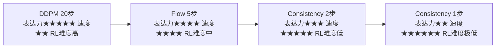

# 前置知识：Consistency Model 与一步生成

> **为什么要读这篇**：Consistency Model 是把扩散模型的多步推理压缩到 1–2 步的极端加速方案。理解它才能判断什么时候该用多步扩散、什么时候该用一步一致性模型。
> **前置要求**：读完 000b（DDPM）、000g（Flow Matching）
> **本文只讲直觉、结论和怎么用**。完整的公式推导、数值代入、逐符号拆解，全部放在配套的 [《Consistency Model 公式推导详解》](./000h2_前置知识_Consistency_Model公式推导详解) 里，需要深挖再点进去看，不看也不影响理解本文结论。

**标签**: `#前置知识` `#Consistency Model` `#一步生成` `#蒸馏` `#自一致性` `#加速推理` `#机器人策略`

**知识链接**：
- [扩散模型 DDPM](./000b_前置知识_扩散模型DDPM) — Consistency Model 要加速的对象
- [Flow Matching](./000g_前置知识_Flow_Matching与连续归一化流) — 另一种加速方案的对比
- [TD 学习与 n 步回报的偏差问题](./001k_前置知识_TD学习与n步回报的偏差问题) — 下面用来类比"自一致性训练"的 bootstrap 思想
- [为什么扩散策略难以 RL 微调](./000f_前置知识_为什么扩散策略难以RL微调) — 一步生成如何彻底解决梯度链问题
- [Consistency Model 公式推导详解](./000h2_前置知识_Consistency_Model公式推导详解) — 本文全部公式的完整推导，独立成篇
- [Online DPRL 综述](/论文综述/003_Online_DPRL_综述_扩散策略与在线RL) — 在算法家族中的定位

---

## 一、核心想法一句话

**Consistency Model 就是重新训练一个新网络 $f_\theta$，直接学"随机噪声 → 最终动作"这一个映射，不需要中间步骤。** 训练它有两种办法：

- 手上已经有一个训练好的 Diffusion/Flow 模型？拿它当"老师"，帮新网络造训练数据（下面叫 CD）。
- 没有也行，直接用原始数据自己造训练数据，从零训练新网络（下面叫 CT）。

不管哪种办法，训练完之后推理阶段只用这一个新网络：喂一个噪声点进去，一次前向输出就是最终动作。**对比**：DDPM 要 20–100 次前向，Flow Matching 要 4–10 次，Consistency Model 只要 **1 次**。

### 1.1 为什么 Flow Matching 自己不能直接一步到位

既然是新训练一个网络，那自然会问：Flow Matching 训练出来的网络 $v_\theta$，能不能直接掐头去尾当成一步生成器用？答案是不能，原因很直接：$v_\theta$ 学的是"站在当前这一点该往哪个方向走一小步"，不是"这条路最终去哪"。它是靠很多训练样本 $(x_0,x_1)$ 各自的直线方向回归出来的一个**平均方向场**，而不同的 $(x_0,x_1)$ 对可能会经过同一个中间点、却各自要去不同的终点——所以真实的推理轨迹（沿着这个平均方向场积分出来的路径）是**弯的**。1 步 = 只沿着起点处的切线方向直接冲到底，路径弯得越厉害，冲偏得越远，所以必须小步小步走、边走边问方向，10~50 步才能勉强贴合弯路。

### 1.2 Consistency Model 换了一个训练目标

Consistency Model 不学"这一步该往哪走"，直接学"这条弯曲轨迹最终会到哪"。这样一来，1 步会不会走偏这个问题就不存在了——它压根不用"走"，直接输出终点。

**新网络的训练数据从哪来，用数字走一遍**（以 CT 为例）：

1. 从真实数据里随机抓一个样本 $x_1=3$（网络最终不会直接看到这个数字当标签，往下看）。
2. 随机采一个噪声 $x_0=-1$。
3. 随机选时间 $t=0.3$、步长 $\Delta t=0.1$。到这一步为止全是随机抽样，不需要任何网络参与。
4. 用插值公式（纯算术）算出这条线上两个相邻点：$x_{0.3}=0.7\times(-1)+0.3\times3=0.2$，$x_{0.4}=0.6\times(-1)+0.4\times3=0.6$。
5. 把"离噪声更近"的点喂给学生网络：$f_\theta(0.6, 0.4)=2.9$（网络猜的终点）。
6. 把"离数据更近"的点喂给 EMA 网络（学生网络的滞后副本）：$f_{\theta^-}(0.2, 0.3)=3.05$（EMA 猜的终点）。
7. Loss $=(2.9-3.05)^2=0.0225$，只更新学生网络。

**关键点**：第 4 步用到了真实的 $x_1=3$，但只是用来算出两个输入点的坐标——真实值 $3$ 本身**从没出现在 loss 里**。Loss 比较的是"学生猜的 $2.9$"和"EMA 猜的 $3.05$"，两个都是网络自己的猜测，谁都没看到答案。这就是自举（bootstrap）：不拿真实答案当标签，拿自己另一个输出当标签，和 [TD 学习](./001k_前置知识_TD学习与n步回报的偏差问题) 里 $V(s_t)$ 去匹配 $r_t+\gamma V(s_{t+1})$ 是同一个技巧。

**为什么不直接拿 $x_1$ 当标签做回归**：这样更简单，但会出问题——$t$ 较小（接近纯噪声）时，同一个 $x_t$ 可能是很多条不同轨迹（对应很多不同真实样本）共同经过的点，直接回归会让网络学到这些真实值的**平均数**，输出一个哪个真实样本都不对应的模糊结果（和"L2 loss 让图像生成模糊"是同一个病）。自举方案不强迫网络对齐某个固定真实值，只强迫它和自己隔一步的猜测互相印证，训练出来的函数就能精确复现每条轨迹自己的终点，而不是把所有轨迹的终点混在一起取平均。

再加一条边界条件（在真正的终点处，网络必须原样输出输入）把这个"自己跟自己印证"的共同猜测钉死成真值，防止网络在每条轨迹上都一致地"猜错"。CD 和 CT 的唯一区别是第 4 步"怎么拿到相邻两点"：CD 靠训练好的 teacher 网络沿 ODE 走一步算出来，CT 靠插值公式直接算，不需要 teacher。第二节详细展开。

> **补充（可跳过）**：这套技巧之所以数学上说得通，是因为扩散/Flow 推理走的那条确定性方程（PF-ODE）没有随机项——不管轨迹是直的还是弯的，只要方向场是确定性的，轨迹上任意一点就唯一决定了终点。完整推导和例子见 [推导详解 §1](./000h2_前置知识_Consistency_Model公式推导详解#一致性约束与边界条件)。

---

## 二、怎么训练：CD 和 CT

网络训练不出"完美"的一致性，只能靠 loss 去逼近。这个 loss 的思路很直接：**只要求轨迹上相邻两点输出一致**（不是所有点对，那样算不完），只要每对相邻点都一致，传递性保证整条轨迹一致。

有两种拿到"相邻两点"的方式，对应两种训练法：

| | Consistency Distillation (CD，蒸馏) | Consistency Training (CT，从头训练) |
|---|---|---|
| 前提 | 已有训练好的扩散/Flow 模型当 teacher | 不需要 teacher |
| 相邻点怎么来 | teacher 沿 ODE 精确走一步 | 直接用直线插值公式算，不跑任何网络 |
| 生成质量 | 较高 | 略低 |
| 典型场景 | 已有 Diffusion Policy 可蒸馏 | 全新训练 |

两种 loss 长得几乎一样：学生网络在"上一站"猜终点，去匹配它自己的 EMA（滑动平均，防止左右手同时作弊）版本在"下一站"猜的终点。唯一区别是"下一站"这个点是 teacher 跑出来的（CD）还是插值算出来的（CT）。完整的 loss 公式、数值算例见 [推导详解 §2](./000h2_前置知识_Consistency_Model公式推导详解#cd-和-ct-的完整-loss)。

---

## 三、网络架构：怎么保证边界条件一定成立

边界条件要求"输入终点时网络必须原样输出"。靠 loss 惩罚只能让网络**近似**满足，做不到精确成立。解决办法是把这个约束直接焊进网络结构里：输出 = 一部分直接抄输入 + 一部分网络自由发挥，两部分的占比随时间 $t$ 变化——$t\to1$（终点）时全部抄输入，$t\to0$（纯噪声）时全部交给网络。这样边界条件不用训练，数学上自动精确成立。底层网络架构和 DDPM 的去噪网络完全相同（UNet/MLP/Transformer），只是外面多包了一层这个混合。公式和系数推导见 [推导详解 §3](./000h2_前置知识_Consistency_Model公式推导详解#skip-connection-参数化)。

---

## 四、多步采样：1 步不够准怎么办

网络不是完美的，1 步生成把全部误差暴露给最终输出。多步采样的思路：把第一步的（不完美的）输出重新混入一份新噪声，构造成"轨迹上一个新的中间点"，再问网络一次，让它精修一遍。$N=2$ 步大致是"先画草图，加一点扰动，再精细化"。为什么要重新混入噪声而不是直接把猜测喂回去，以及完整的数值算例，见 [推导详解 §4](./000h2_前置知识_Consistency_Model公式推导详解#多步采样怎么构造中间点)。

---

## 五、为什么对 RL 微调友好

当策略只有 1 步（$N=1$）时，生成过程就是"噪声 + 观测 → 网络 → 动作"，这在形式上等价于**确定性策略 + 噪声输入**。这带来两个好处：

1. **动作的概率密度可以精确算**：用标准的变量替换公式，从噪声的概率减去"网络把空间拉伸了多少倍"这个修正项即可，不需要像多步扩散那样对整条链路做近似。
2. **BPTT（把梯度沿计算图反向传播）完全没压力**：Q 函数对参数的梯度只需要穿过 1 次网络前向，不会像 DDPM 20 步链路那样梯度消失/爆炸，也不需要 [DPPO](/论文综述/001_DPPO_扩散策略策略优化) 那种 clip 展开技巧。

完整的 log-prob 推导和数值算例见 [推导详解 §5](./000h2_前置知识_Consistency_Model公式推导详解#rl-微调时的-log-prob-与梯度)。

**各方法的 RL 友好度对比**：

| 生成模型 | 推理步数 | BPTT 可行性 | 需要 DPPO 展开 | 直接 PG |
|---|---|---|---|---|
| DDPM 20步 | 20 | ✗（梯度崩） | ✓（必须） | ✗ |
| Flow 5步 | 5 | ✓ | 可选 | △（方差大） |
| Consistency 2步 | 2 | ✓✓ | 不需要 | △ |
| Consistency 1步 | 1 | ✓✓✓ | 不需要 | ✓ |

```mermaid
flowchart LR
    A["DDPM 20步<br/>表达力★★★★★ 速度★★ RL难度高"] --> B["Flow 5步<br/>表达力★★★★ 速度★★★★ RL难度中"]
    B --> C["Consistency 2步<br/>表达力★★★ 速度★★★★★ RL难度低"]
    C --> D["Consistency 1步<br/>表达力★★ 速度★★★★★★ RL难度极低"]
```

> RL 微调本身会提升策略质量。即使初始表达力略低，微调后可能追平多步扩散。"Consistency Policy + 简单 PG" 是否能匹配 "Diffusion Policy + DPPO"？2026 年仍是开放问题。

---

## 六、和 Flow Matching 的对比

|  | Flow Matching | Consistency Model |
|---|---|---|
| 推理步数 | 4–10 | 1–2 |
| 路径定义 | 连续 ODE 轨迹 | 轨迹上任意点→终点 |
| 训练方式 | 向量场回归 | 一致性约束/蒸馏 |
| 表达力 | 高 | 中 |
| RL 微调方式 | BPTT / Proximity | 直接 PG / BPTT |
| 适用场景 | 速度和质量平衡 | 极致速度优先 |

---

## 七、什么时候选 Consistency Model

| 选它 | 不选它 |
|---|---|
| 控制频率 > 100Hz | 数据极其复杂多模态 |
| 边缘设备部署 | 不缺推理时间 |
| 需要简单 PG 做 RL | DPPO 已效果很好 |
| 已有 Diffusion Policy 可蒸馏 | — |

---

## 延伸阅读

- Song et al. (2023) "Consistency Models" ← 原始论文
- Song & Dhariwal (2024) "Improved Consistency Training"
- Prasad et al. (2024) "Consistency Policy" ← 用在机器人上
- [Consistency Model 公式推导详解](./000h2_前置知识_Consistency_Model公式推导详解) ← 本文所有公式的完整推导，独立成篇
- [Flow Matching](./000g_前置知识_Flow_Matching与连续归一化流) ← 另一种加速方案
- [DPPO](/论文综述/001_DPPO_扩散策略策略优化) ← 多步扩散的 RL 微调方案
- [Online DPRL 综述](/论文综述/003_Online_DPRL_综述_扩散策略与在线RL) ← 步数对算法选择的影响
