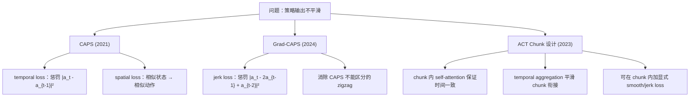

# 前置知识：动作平滑性正则化（CAPS / Grad-CAPS）

> **为什么要读这篇**：机器人策略输出的动作如果在时间上不连续（zigzag、jerky），会造成关节振荡、能耗增大和机械磨损。CAPS 和 Grad-CAPS 提出了简洁的正则化方法，在训练阶段就惩罚高频控制信号，让策略天然输出平滑动作。这对理解 ACT 等 action chunk 方法中如何保证 chunk 内时间一致性非常重要。
> **前置要求**：读完 000a（策略梯度与 PPO）、000c（Diffusion Policy）

**标签**: `#前置知识` `#CAPS` `#Grad-CAPS` `#动作平滑` `#正则化` `#ACT` `#Action Chunking`

**知识链接**：
- [策略梯度与 PPO](/前置知识/000a_前置知识_策略梯度与PPO) — CAPS 最初在 RL 策略训练中提出
- [Diffusion Policy](/前置知识/000c_前置知识_Diffusion_Policy) — 扩散策略天然有一定平滑性，但仍可结合 CAPS 思想
- [VLA 综述](/论文综述/S03_视觉语言动作模型VLA综述) — 动作精度与平滑性的系统讨论

**核心论文**：
- CAPS: *Reinforcement Learning with Smooth Policy Update* (Mysore et al., 2021) — [arXiv:2012.06644](https://arxiv.org/abs/2012.06644)
- Grad-CAPS: *Gradient-based Continuous Action Policy Smoothing* (2024) — [arXiv:2407.04315](https://arxiv.org/abs/2407.04315)
- ACT: *Learning Fine-Grained Bimanual Manipulation with Low-Cost Hardware* (Zhao et al., 2023) — [arXiv:2304.13705](https://arxiv.org/abs/2304.13705)

---

## 一、问题：为什么需要动作平滑性？

### 1.1 直觉

想象一个机器人手臂在做插入任务。如果策略每 20ms 输出一个动作，理想情况下相邻时间步的动作应该平滑过渡——位置变化小、速度连续、没有突然跳变。

但实际训练出的策略常常有这样的问题：

```
时间步:   t    t+1   t+2   t+3   t+4
动作:    +0.5  -0.3  +0.4  -0.2  +0.3   ← zigzag！
```

这种高频振荡（zigzag/jerky action）在仿真里也许能完成任务，但到真实机器人上会导致：

1. **关节振荡**：电机来回急停急转，产生机械应力
2. **能耗增大**：频繁变向消耗更多电能
3. **磨损加速**：减速器、齿轮等传动部件承受冲击载荷
4. **控制不稳定**：底层 PD 控制器跟不上高频指令，产生延迟振荡

### 1.2 为什么 RL 策略容易不平滑？

标准 RL 的优化目标是累积奖励：

$$
J(\theta) = \mathbb{E}\left[\sum_{t=0}^{T} \gamma^t r_t\right]
$$

这个目标**只关心最终结果，不关心到达方式**。只要能获得高奖励，策略完全可以输出 zigzag 动作——从 RL 角度看，两种轨迹如果总奖励一样，RL 不会偏好平滑的那条。

行为克隆（BC）同样有这个问题：人类示教数据中的微小抖动会被模型学到并放大，尤其在分布偏移（distribution shift）时更严重。

---

## 二、CAPS：Conditioning for Action Policy Smoothness

### 2.1 核心思想

CAPS（2021）提出两种正则化：

1. **Temporal Smoothness**：相邻时间步的动作应该接近
2. **Spatial Smoothness**：相似状态应该输出相似动作

### 2.2 Temporal Smoothness Loss

$$
\boxed{L_{\text{temporal}} = \mathbb{E}_{t}\left[\|\pi_\theta(s_t) - \pi_\theta(s_{t-1})\|^2\right]}
$$

**一句话**：惩罚策略在连续时间步输出的动作差异。

**逐项拆解**：
- $\pi_\theta(s_t)$ — 策略在状态 $s_t$ 下输出的动作
- $\pi_\theta(s_{t-1})$ — 上一时间步的动作
- $\|\cdot\|^2$ — L2 范数的平方，即各维度差值的平方和

**代入数字**：假设 $\pi_\theta(s_t) = [0.5, 0.3]$，$\pi_\theta(s_{t-1}) = [0.2, 0.4]$：
$$
L_{\text{temporal}} = (0.5 - 0.2)^2 + (0.3 - 0.4)^2 = 0.09 + 0.01 = 0.10
$$

如果动作变化更剧烈，比如 $[0.5, 0.3]$ 到 $[-0.3, -0.4]$：
$$
L_{\text{temporal}} = (0.5 + 0.3)^2 + (0.3 + 0.4)^2 = 0.64 + 0.49 = 1.13
$$

惩罚项增大 11 倍，迫使策略避免剧烈变化。

### 2.3 Spatial Smoothness Loss

$$
\boxed{L_{\text{spatial}} = \mathbb{E}_{s, s'}\left[\|\pi_\theta(s) - \pi_\theta(s')\|^2 \;\big/\; \|s - s'\|^2\right]}
$$

**一句话**：状态越接近，动作差异应该越小——像 Lipschitz 约束一样让策略函数变"光滑"。

**直觉**：假设机器人在位置 $x=0.5$ 应该向右走，那在 $x=0.501$ 也应该输出差不多的动作，不应该突然向左。

### 2.4 完整 CAPS 训练目标

$$
J_{\text{CAPS}}(\theta) = J_{\text{RL}}(\theta) - \lambda_T \cdot L_{\text{temporal}} - \lambda_S \cdot L_{\text{spatial}}
$$

- $\lambda_T, \lambda_S$ 是超参数，控制平滑性和性能的权衡
- 典型设置：$\lambda_T \in [0.1, 1.0]$，$\lambda_S \in [0.01, 0.1]$

**权衡**：$\lambda$ 太大 → 策略过度平滑，反应迟钝，跟不上快速变化的需求；$\lambda$ 太小 → 平滑效果不明显。

---

## 三、Grad-CAPS：用梯度差分消除 Zigzag

### 3.1 CAPS 的不足

CAPS 的 temporal loss 惩罚的是 $\|a_t - a_{t-1}\|$，即**一阶差分**（速度层面）。但有些 zigzag 模式的一阶差分不大，二阶差分却很大：

```
情况 A（匀速变化，一阶差分恒定）：
  a:    0.1  0.2  0.3  0.4  0.5
  Δa:      0.1  0.1  0.1  0.1      ← CAPS loss 小 ✓
  ΔΔa:       0    0    0           ← 加速度为 0，非常平滑 ✓

情况 B（振荡变化，一阶差分不大但方向频繁翻转）：
  a:    0.1  0.2  0.1  0.2  0.1
  Δa:      0.1 -0.1  0.1 -0.1      ← CAPS loss 和 A 一样！
  ΔΔa:      -0.2  0.2 -0.2         ← 加速度剧烈振荡 ✗
```

CAPS 对情况 A 和 B 给出相同惩罚，但 B 明显更差。

### 3.2 Grad-CAPS 的改进：惩罚动作梯度差分

Grad-CAPS（2024）引入**动作的二阶差分**（类似加速度/jerk）作为正则化目标：

$$
\boxed{L_{\text{grad}} = \mathbb{E}_{t}\left[\|(\pi_\theta(s_t) - \pi_\theta(s_{t-1})) - (\pi_\theta(s_{t-1}) - \pi_\theta(s_{t-2}))\|^2\right]}
$$

化简得：

$$
L_{\text{grad}} = \mathbb{E}_{t}\left[\|\pi_\theta(s_t) - 2\pi_\theta(s_{t-1}) + \pi_\theta(s_{t-2})\|^2\right]
$$

**一句话**：惩罚动作的"加速度变化"，即 jerk。这确保动作不仅变化小（速度平滑），而且变化的趋势也是渐进的（加速度平滑）。

**代入数字**（情况 B）：
$$
L_{\text{grad}} = \|0.1 - 2 \times 0.2 + 0.1\|^2 = \|0.1 - 0.4 + 0.1\|^2 = |-0.2|^2 = 0.04
$$

对比情况 A：
$$
L_{\text{grad}} = \|0.3 - 2 \times 0.2 + 0.1\|^2 = \|0.3 - 0.4 + 0.1\|^2 = |0|^2 = 0
$$

Grad-CAPS 能正确区分情况 A（零惩罚）和情况 B（有惩罚），而 CAPS 做不到。

### 3.3 完整 Grad-CAPS 目标

$$
J_{\text{Grad-CAPS}}(\theta) = J_{\text{task}}(\theta) - \lambda_1 \cdot L_{\text{temporal}} - \lambda_2 \cdot L_{\text{grad}}
$$

通常同时保留一阶（CAPS temporal）和二阶（Grad-CAPS）惩罚：
- 一阶保证"不要动太快"
- 二阶保证"不要来回抖动"

---

## 四、ACT 与动作平滑性的天然关系

### 4.1 Action Chunking 为什么天然更平滑

[ACT（Action Chunking with Transformers）](https://arxiv.org/abs/2304.13705) 不是一步预测一个动作，而是一次预测未来 $H$ 步的动作序列：

$$
\hat{a}_{t:t+H} = \text{Decoder}(z, \text{obs}_t) = [\hat{a}_t, \hat{a}_{t+1}, \ldots, \hat{a}_{t+H-1}]
$$

这种设计天然有平滑倾向，因为：

1. **同一次前向传播输出整个序列**：Transformer decoder 的 self-attention 让 $\hat{a}_{t+k}$ 在生成时可以"看到"同一 chunk 内其他时间步，鼓励时间一致性
2. **L2 loss 在 chunk 上平均**：如果某个时间步突然跳变，chunk 内整体 loss 会升高

但这不意味着 ACT 的输出一定平滑——**不同 chunk 之间的衔接可能不连续**。

### 4.2 在 ACT Chunk 内加时间连续 Loss

CAPS/Grad-CAPS 的思想可以直接迁移到 ACT 的 chunk 内部。对于一个预测的 chunk $[\hat{a}_t, \hat{a}_{t+1}, \ldots, \hat{a}_{t+H-1}]$：

**一阶平滑 loss（chunk 内）**：

$$
L_{\text{smooth}}^{\text{chunk}} = \frac{1}{H-1} \sum_{k=0}^{H-2} \|\hat{a}_{t+k+1} - \hat{a}_{t+k}\|^2
$$

**二阶平滑 loss（chunk 内，Grad-CAPS 风格）**：

$$
L_{\text{jerk}}^{\text{chunk}} = \frac{1}{H-2} \sum_{k=0}^{H-3} \|\hat{a}_{t+k+2} - 2\hat{a}_{t+k+1} + \hat{a}_{t+k}\|^2
$$

**ACT 完整训练目标**（加入平滑正则化后）：

$$
L_{\text{ACT+smooth}} = L_{\text{recon}} + \beta \cdot D_{\text{KL}} + \lambda_1 \cdot L_{\text{smooth}}^{\text{chunk}} + \lambda_2 \cdot L_{\text{jerk}}^{\text{chunk}}
$$

其中 $L_{\text{recon}}$ 是 ACT 原始的动作重建 loss，$D_{\text{KL}}$ 是 CVAE 的 KL 散度项。

### 4.3 Temporal Aggregation 的平滑作用

ACT 在部署时还使用 **temporal aggregation**：重叠的 chunk 预测会做指数加权平均：

$$
a_t^{\text{exec}} = \sum_{i} w_i \cdot \hat{a}_t^{(i)}, \quad w_i \propto \exp(-\alpha \cdot \Delta_i)
$$

其中 $\Delta_i$ 是预测 $\hat{a}_t^{(i)}$ 距离其所属 chunk 起始时间的步数。这相当于一个**低通滤波器**，抑制不同 chunk 之间的高频跳变。

### 4.4 对比：不同平滑机制的层次

| 机制 | 作用阶段 | 平滑什么 | 代表方法 |
|------|----------|----------|----------|
| CAPS temporal loss | 训练 | 相邻时间步动作差 | CAPS (2021) |
| Grad-CAPS jerk loss | 训练 | 动作加速度变化 | Grad-CAPS (2024) |
| Action Chunking | 架构 | chunk 内时间一致性 | ACT (2023) |
| Temporal Aggregation | 推理 | chunk 间衔接平滑 | ACT (2023) |
| Chunk 内 smooth loss | 训练 | chunk 内显式平滑 | CAPS + ACT 结合 |

---

## 五、实践建议

### 5.1 什么时候需要加平滑正则化

- **RL 训练**（如 PPO、SAC）：强烈推荐，RL 策略几乎总会出现 zigzag
- **BC 训练 + 短 chunk**（$H \leq 4$）：推荐加一阶平滑
- **BC 训练 + 长 chunk**（$H \geq 16$）：chunk 本身有平滑效果，但仍建议加二阶 jerk loss 防止 chunk 内部抖动
- **接触密集任务**（插入、拧螺丝）：二阶 loss 尤其重要，因为抖动会导致接触力突变

### 5.2 超参数参考

| 参数 | 典型范围 | 说明 |
|------|----------|------|
| $\lambda_1$（一阶） | 0.01 ~ 1.0 | 过大会让动作变化太慢 |
| $\lambda_2$（二阶） | 0.001 ~ 0.1 | 通常比一阶小 1 个数量级 |
| Temporal aggregation $\alpha$ | 0.01 ~ 0.1 | ACT 论文默认 0.01 |

### 5.3 注意事项

1. **不要过度平滑**：某些任务需要快速响应（如避障），过强的平滑约束会降低反应速度
2. **接触切换点的处理**：夹爪开合是离散跳变，不应该对 gripper 维度加平滑 loss
3. **与 action space 缩放的交互**：如果动作空间归一化到 $[-1, 1]$，平滑 loss 的量级和实际物理意义会变化，需要相应调整 $\lambda$

---

## 六、总结



| 方法 | 核心贡献 | 适用场景 | 论文 |
|------|----------|----------|------|
| CAPS | 一阶时间 + 空间平滑正则化 | RL 策略训练 | [arXiv:2012.06644](https://arxiv.org/abs/2012.06644) |
| Grad-CAPS | 二阶梯度差分消除 zigzag | RL/BC，接触密集任务 | [arXiv:2407.04315](https://arxiv.org/abs/2407.04315) |
| ACT | Action Chunking + Temporal Aggregation | BC 双臂操作 | [arXiv:2304.13705](https://arxiv.org/abs/2304.13705) |

**一句话总结**：CAPS 让策略"别抖"，Grad-CAPS 让策略"别来回摆"，ACT chunk 让策略"在一段时间内保持连贯意图"——三者从不同层面解决动作平滑性问题，可以组合使用。

---

## 延伸阅读

- [Diffusion Policy](/前置知识/000c_前置知识_Diffusion_Policy) — 扩散策略的多步去噪也有天然平滑性
- [VLA 综述 § 13.2 动作精度](/论文综述/S03_视觉语言动作模型VLA综述) — 精度与平滑性的系统讨论
- [ACT Decoder 架构详解](/工程实践/ACT_Decoder架构详解) — ACT 工程实现中的 temporal aggregation 细节
- [双臂动作扰动与数据增强调研](/工程实践/双臂动作扰动与数据增强调研) — chunk 平滑与闭环反馈的权衡
