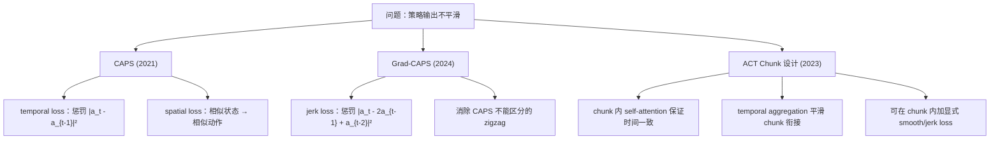

# 前置知识：动作平滑性正则化（CAPS / Grad-CAPS）

> **为什么要读这篇**：机器人策略输出的动作如果在时间上不连续（zigzag、jerky），会造成关节振荡、能耗增大和机械磨损。CAPS 和 Grad-CAPS 提出了简洁的正则化方法，在训练阶段就惩罚高频控制信号，让策略天然输出平滑动作。这对理解 ACT 等 action chunk 方法中如何保证 chunk 内时间一致性非常重要。
> **前置要求**：读完 000a（策略梯度与 PPO）、000c（Diffusion Policy）

**标签**: `#前置知识` `#CAPS` `#Grad-CAPS` `#动作平滑` `#正则化` `#ACT` `#Action Chunking`

**知识链接**：
- [策略梯度与 PPO](/前置知识/000a_前置知识_策略梯度与PPO) — CAPS 最初在 RL 策略训练中提出
- [Diffusion Policy](/前置知识/000c_前置知识_Diffusion_Policy) — 扩散策略天然有一定平滑性，但仍可结合 CAPS 思想
- [VLA 综述](/论文综述/S03_视觉语言动作模型VLA综述) — 动作精度与平滑性的系统讨论

**核心论文**：
- CAPS: *Reinforcement Learning with Smooth Policy Update* (Mysore et al., 2021) — [arXiv:2012.06644](https://arxiv.org/abs/2012.06644)
- Grad-CAPS: *Gradient-based Continuous Action Policy Smoothing* (2024) — [arXiv:2407.04315](https://arxiv.org/abs/2407.04315)
- ACT: *Learning Fine-Grained Bimanual Manipulation with Low-Cost Hardware* (Zhao et al., 2023) — [arXiv:2304.13705](https://arxiv.org/abs/2304.13705)

---

## 一、问题：为什么需要动作平滑性？

### 1.1 直觉

想象一个机器人手臂在做插入任务。如果策略每 20ms 输出一个动作，理想情况下相邻时间步的动作应该平滑过渡——位置变化小、速度连续、没有突然跳变。

但实际训练出的策略常常有这样的问题：

```
时间步:   t    t+1   t+2   t+3   t+4
动作:    +0.5  -0.3  +0.4  -0.2  +0.3   ← zigzag！
```

这种高频振荡（zigzag/jerky action）在仿真里也许能完成任务，但到真实机器人上会导致：

1. **关节振荡**：电机来回急停急转，产生机械应力
2. **能耗增大**：频繁变向消耗更多电能
3. **磨损加速**：减速器、齿轮等传动部件承受冲击载荷
4. **控制不稳定**：底层 PD 控制器跟不上高频指令，产生延迟振荡

### 1.2 为什么 RL 策略容易不平滑？

标准 RL 的优化目标是累积奖励：

$$
J(\theta) = \mathbb{E}\left[\sum_{t=0}^{T} \gamma^t r_t\right]
$$

**这个公式在做什么**：告诉策略"只要把从头到尾折扣累计的总奖励最大化就行"——完全不关心过程中动作是怎么变化的。

::: details 📐 公式详解（点击展开）

| 子表达式 | 它是谁 | 它在干嘛 |
|---------|--------|---------|
| $r_t$ | **单步计分** | 时间步 $t$ 拿到的即时奖励，只反映"这一步做得好不好"，不涉及动作变化幅度 |
| $\gamma^t$ | **远期打折器** | 折扣因子的 $t$ 次方，越往后的奖励权重越低，鼓励策略优先照顾近期收益 |
| $\sum_{t=0}^{T} \gamma^t r_t$ | **总账本** | 把整条轨迹上所有打过折的奖励加总，得到这条轨迹的"总分" |
| $\mathbb{E}[\cdot]$ | **多局平均** | 对策略采样出的多条轨迹取期望，训练时用采集到的一批轨迹求平均近似 |

**用人话读**："策略的唯一目标是让整条轨迹加权后的总奖励尽量高，中间动作是抖是稳，只要总分一样，RL 眼里就没有区别。"

**为什么是这个形式**：这是最基础的强化学习目标（参见 [策略梯度与 PPO](/前置知识/000a_前置知识_策略梯度与PPO)），它天然不包含任何"过程平滑"的约束，这正是 CAPS 类方法要额外补上的东西。
:::

这个目标**只关心最终结果，不关心到达方式**。只要能获得高奖励，策略完全可以输出 zigzag 动作——从 RL 角度看，两种轨迹如果总奖励一样，RL 不会偏好平滑的那条。

行为克隆（BC）同样有这个问题：人类示教数据中的微小抖动会被模型学到并放大，尤其在分布偏移（distribution shift）时更严重。

---

## 二、CAPS：Conditioning for Action Policy Smoothness

### 2.1 核心思想

CAPS（2021）提出两种正则化：

1. **Temporal Smoothness**：相邻时间步的动作应该接近
2. **Spatial Smoothness**：相似状态应该输出相似动作

### 2.2 Temporal Smoothness Loss

$$
\boxed{L_{\text{temporal}} = \mathbb{E}_{t}\left[\|\pi_\theta(s_t) - \pi_\theta(s_{t-1})\|^2\right]}
$$

**这个公式在做什么**：惩罚策略在连续时间步输出的动作差异——差异越大，惩罚越大，迫使策略输出前后连贯的动作。

::: details 📐 公式详解（点击展开）

| 子表达式 | 它是谁 | 它在干嘛 |
|---------|--------|---------|
| $\pi_\theta(s_t)$ | **这一步的决定** | 策略在当前状态 $s_t$ 下输出的动作 |
| $\pi_\theta(s_{t-1})$ | **上一步的决定** | 上一时间步策略输出的动作，作为对比基准 |
| $\|\pi_\theta(s_t) - \pi_\theta(s_{t-1})\|^2$ | **急刹车检测器** | 两步动作差值的 L2 范数平方（各维度差值的平方和），差异越大数值越大 |
| $\mathbb{E}_{t}[\cdot]$ | **全程平均** | 对轨迹上所有时间步的这个差值取平均，得到整条轨迹的平滑度打分 |

**用人话读**："看策略这一步和上一步给出的动作差多远，差得越多惩罚越重，逼着策略别在相邻两步之间跳来跳去。"

**为什么是这个形式**：这是最直接的一阶差分惩罚——只需要缓存上一步的动作就能计算，实现成本几乎为零，却能有效抑制最常见的高频抖动。

**代入数字**：假设 $\pi_\theta(s_t) = [0.5, 0.3]$，$\pi_\theta(s_{t-1}) = [0.2, 0.4]$，则 $L_{\text{temporal}} = (0.5-0.2)^2 + (0.3-0.4)^2 = 0.09 + 0.01 = 0.10$。如果动作变化更剧烈，比如从 $[0.5, 0.3]$ 跳到 $[-0.3, -0.4]$，则 $L_{\text{temporal}} = (0.5+0.3)^2 + (0.3+0.4)^2 = 0.64 + 0.49 = 1.13$——惩罚项增大了 11 倍，迫使策略避免这种剧烈变化。
:::

### 2.3 Spatial Smoothness Loss

$$
\boxed{L_{\text{spatial}} = \mathbb{E}_{s, s'}\left[\|\pi_\theta(s) - \pi_\theta(s')\|^2 \;\big/\; \|s - s'\|^2\right]}
$$

**这个公式在做什么**：要求状态越接近，策略输出的动作也要越接近——像给策略函数套上一个"变化率上限"（Lipschitz 约束），不允许状态微小变化时动作发生突变。

::: details 📐 公式详解（点击展开）

| 子表达式 | 它是谁 | 它在干嘛 |
|---------|--------|---------|
| $s, s'$ | **一对相邻观测** | 从状态空间里采样的两个（通常是相近的）状态 |
| $\|\pi_\theta(s) - \pi_\theta(s')\|^2$ | **动作分歧度** | 策略对这两个状态给出的动作差多少 |
| $\|s - s'\|^2$ | **状态分歧度** | 这两个状态本身差多少，作为分母做归一化 |
| 整体比值 | **变化率检测仪** | 动作差 ÷ 状态差，如果这个比值很大，说明策略在这一片区域"反应过于剧烈"，状态稍微一动，动作就跳变 |
| $\mathbb{E}_{s,s'}[\cdot]$ | **全空间平均** | 对采样到的所有状态对取平均，得到整个策略函数的平滑度打分 |

**用人话读**："检查状态稍微变一点，动作会不会跟着大幅跳变——如果'动作变化 / 状态变化'这个比值很大，就惩罚它，逼着策略函数变得更平滑。"

**为什么是这个形式**：这本质上是 Lipschitz 常数的经验估计——限制策略函数对输入的敏感度，使其不会因为状态的微小扰动（如传感器噪声）而输出剧烈不同的动作。假设机器人在位置 $x=0.5$ 应该向右走，那在 $x=0.501$ 也应该输出差不多的动作，不应该突然向左。
:::

### 2.4 完整 CAPS 训练目标

$$
J_{\text{CAPS}}(\theta) = J_{\text{RL}}(\theta) - \lambda_T \cdot L_{\text{temporal}} - \lambda_S \cdot L_{\text{spatial}}
$$

**这个公式在做什么**：把"完成任务拿高奖励"和"动作要平滑"两个目标合并成一个总目标——训练时既要追求高回报，又要为不平滑的动作付出代价。

::: details 📐 公式详解（点击展开）

| 子表达式 | 它是谁 | 它在干嘛 |
|---------|--------|---------|
| $J_{\text{RL}}(\theta)$ | **任务本分** | 原始的强化学习目标（累积奖励），负责让策略完成任务 |
| $\lambda_T \cdot L_{\text{temporal}}$ | **时间抖动罚单** | 一阶时间平滑惩罚乘以权重 $\lambda_T$，罚金大小由 $\lambda_T$ 决定 |
| $\lambda_S \cdot L_{\text{spatial}}$ | **空间敏感罚单** | 空间平滑惩罚乘以权重 $\lambda_S$，惩罚策略对状态微小变化过度敏感 |
| $J_{\text{RL}} - \lambda_T L_{\text{temporal}} - \lambda_S L_{\text{spatial}}$ | **总账** | 任务收益减去两张罚单后的净目标，策略要最大化这个净值 |

**用人话读**："策略在追求高奖励的同时，每次输出不平滑的动作（时间上跳变或对状态过度敏感）都要被扣分，扣分力度由 $\lambda_T$、$\lambda_S$ 两个旋钮控制。"

**为什么是这个形式**：用线性加权把多个目标合并成单一标量目标，是多目标优化里最简单直接的做法，方便直接接入现有的策略梯度/PPO 优化流程而不需要改动优化器本身。典型设置是 $\lambda_T \in [0.1, 1.0]$、$\lambda_S \in [0.01, 0.1]$；$\lambda$ 太大会让策略过度平滑、反应迟钝，太小则平滑效果不明显。
:::

---

## 三、Grad-CAPS：用梯度差分消除 Zigzag

### 3.1 CAPS 的不足

CAPS 的 temporal loss 惩罚的是 $\|a_t - a_{t-1}\|$，即**一阶差分**（速度层面）。但有些 zigzag 模式的一阶差分不大，二阶差分却很大：

```
情况 A（匀速变化，一阶差分恒定）：
  a:    0.1  0.2  0.3  0.4  0.5
  Δa:      0.1  0.1  0.1  0.1      ← CAPS loss 小 ✓
  ΔΔa:       0    0    0           ← 加速度为 0，非常平滑 ✓

情况 B（振荡变化，一阶差分不大但方向频繁翻转）：
  a:    0.1  0.2  0.1  0.2  0.1
  Δa:      0.1 -0.1  0.1 -0.1      ← CAPS loss 和 A 一样！
  ΔΔa:      -0.2  0.2 -0.2         ← 加速度剧烈振荡 ✗
```

CAPS 对情况 A 和 B 给出相同惩罚，但 B 明显更差。

### 3.2 Grad-CAPS 的改进：惩罚动作梯度差分

Grad-CAPS（2024）引入**动作的二阶差分**（类似加速度/jerk）作为正则化目标：

$$
\boxed{L_{\text{grad}} = \mathbb{E}_{t}\left[\|(\pi_\theta(s_t) - \pi_\theta(s_{t-1})) - (\pi_\theta(s_{t-1}) - \pi_\theta(s_{t-2}))\|^2\right]}
$$

**这个公式在做什么**：不再只看"这一步和上一步差多少"，而是看"这一步的变化量和上一步的变化量差多少"——也就是惩罚动作变化速度本身的突变（二阶差分）。

::: details 📐 公式详解（点击展开）

| 子表达式 | 它是谁 | 它在干嘛 |
|---------|--------|---------|
| $\pi_\theta(s_t) - \pi_\theta(s_{t-1})$ | **本段速度** | 当前这一步相对上一步的动作变化量，相当于"这一段的运动速度" |
| $\pi_\theta(s_{t-1}) - \pi_\theta(s_{t-2})$ | **上段速度** | 上一步相对再之前一步的动作变化量，作为对比基准 |
| 两个速度的差 | **急转弯探测器** | 这一段速度和上一段速度差多少，差得越多说明动作在"加速/减速"得越猛烈，即 jerk（加速度的变化）越大 |
| $\mathbb{E}_t[\cdot]$ | **全程平均** | 对轨迹上所有时间步取平均，得到这条轨迹的整体二阶抖动打分 |

**用人话读**："不只看动作变了多少，还要看'变化的幅度'本身有没有忽快忽慢——如果动作忽而快速右移、忽而快速左移，即使每一步单独看变化都不大，这个惩罚也会很高。"

**为什么要看二阶差分而不是一阶**：CAPS 的一阶 temporal loss 只惩罚"位置变化量"，但对情况 A（匀速渐进变化）和情况 B（振荡翻转变化）给出的惩罚是一样的——因为两者每一步的位置变化幅度相同，只是方向不同。二阶差分能捕捉到"方向频繁翻转"这种一阶差分捕捉不到的抖动模式。
:::

化简得：

$$
L_{\text{grad}} = \mathbb{E}_{t}\left[\|\pi_\theta(s_t) - 2\pi_\theta(s_{t-1}) + \pi_\theta(s_{t-2})\|^2\right]
$$

**这个公式在做什么**：和上面的公式是同一个惩罚项，只是把两次减法展开合并成了一个更紧凑的写法，方便直接套用到代码里（相当于中心差分的加速度公式）。

::: details 📐 公式详解（点击展开）

| 子表达式 | 它是谁 | 它在干嘛 |
|---------|--------|---------|
| $\pi_\theta(s_t)$ | **当前动作** | 三个连续动作里最新的一个 |
| $-2\pi_\theta(s_{t-1})$ | **中间动作（加倍反向）** | 上一步的动作乘以 $-2$，作为离散二阶导数公式里的中心项 |
| $\pi_\theta(s_{t-2})$ | **更早的动作** | 三个连续动作里最旧的一个 |
| $\|\pi_\theta(s_t) - 2\pi_\theta(s_{t-1}) + \pi_\theta(s_{t-2})\|^2$ | **加速度大小** | 三个连续动作的离散二阶差分（类似物理里的加速度），数值越大说明 jerk 越猛 |

**用人话读**："取三个连续时间步的动作，按 $a_t - 2a_{t-1} + a_{t-2}$ 这个固定公式算出'加速度'，加速度越大惩罚越重。"

**为什么是这个形式**：这是数值分析里标准的二阶中心差分公式，只需要缓存最近两步的动作即可在线计算，不需要额外的网络或复杂运算。

**代入数字**（情况 B：动作序列 $0.1, 0.2, 0.1$）：$L_{\text{grad}} = \|0.1 - 2\times 0.2 + 0.1\|^2 = \|0.1-0.4+0.1\|^2 = |-0.2|^2 = 0.04$。对比情况 A（动作序列 $0.3, 0.2, 0.1$，匀速变化）：$L_{\text{grad}} = \|0.3-2\times0.2+0.1\|^2 = \|0.3-0.4+0.1\|^2 = |0|^2 = 0$。Grad-CAPS 能正确区分情况 A（零惩罚）和情况 B（有惩罚），而 CAPS 的一阶 loss 做不到。
:::

### 3.3 完整 Grad-CAPS 目标

$$
J_{\text{Grad-CAPS}}(\theta) = J_{\text{task}}(\theta) - \lambda_1 \cdot L_{\text{temporal}} - \lambda_2 \cdot L_{\text{grad}}
$$

**这个公式在做什么**：在原始任务目标上同时叠加一阶（速度）和二阶（加速度/jerk）两张平滑罚单，让策略在完成任务之外，既不能动太快，也不能来回抖动。

::: details 📐 公式详解（点击展开）

| 子表达式 | 它是谁 | 它在干嘛 |
|---------|--------|---------|
| $J_{\text{task}}(\theta)$ | **任务本分** | 原始任务目标（累积奖励或行为克隆损失），负责让策略把任务做好 |
| $\lambda_1 \cdot L_{\text{temporal}}$ | **速度罚单** | 一阶平滑惩罚（CAPS），管的是"不要动太快" |
| $\lambda_2 \cdot L_{\text{grad}}$ | **加速度罚单** | 二阶平滑惩罚（Grad-CAPS），管的是"不要来回抖动" |
| 三项相加 | **总目标** | 任务收益减去两张罚单后的净值，策略要最大化这个净值 |

**用人话读**："策略除了要把任务做好，还要同时接受两层体检——变化快不快（一阶）、变化的变化猛不猛（二阶），两层都不合格就扣分。"

**为什么两层都要保留**：一阶和二阶惩罚捕捉的是不同频段的抖动，前者管低频的大幅跳变，后者管高频的来回摆动（3.1 节的情况 B），两者互补，同时使用效果比单用一个更好。
:::

---

## 四、ACT 与动作平滑性的天然关系

### 4.1 Action Chunking 为什么天然更平滑

[ACT（Action Chunking with Transformers）](https://arxiv.org/abs/2304.13705) 不是一步预测一个动作，而是一次预测未来 $H$ 步的动作序列：

$$
\hat{a}_{t:t+H} = \text{Decoder}(z, \text{obs}_t) = [\hat{a}_t, \hat{a}_{t+1}, \ldots, \hat{a}_{t+H-1}]
$$

**这个公式在做什么**：一次前向传播不是只输出一个动作，而是直接输出未来连续 $H$ 步的整段动作序列。

::: details 📐 公式详解（点击展开）

| 子表达式 | 它是谁 | 它在干嘛 |
|---------|--------|---------|
| $\text{obs}_t$ | **当前观测** | 时间步 $t$ 的输入（图像、本体状态等），Decoder 的条件信息之一 |
| $z$ | **风格/意图编码** | CVAE 的隐变量，编码"这段动作大致想怎么完成任务"的整体意图 |
| $\text{Decoder}(z, \text{obs}_t)$ | **整段动作生成器** | 一次前向传播直接把未来 $H$ 步的动作全部解码出来，而不是逐步自回归生成 |
| $[\hat{a}_t, \ldots, \hat{a}_{t+H-1}]$ | **动作序列包** | 输出结果本身：一个长度为 $H$ 的完整动作 chunk |

**用人话读**："给定当前观测和一个代表'整体意图'的隐变量，Decoder 一口气吐出接下来 $H$ 步该做的所有动作，而不是一步步现算现吐。"

**为什么是这个形式**：一次性生成整段序列，让 Transformer 的 self-attention 在生成时能同时看到同一 chunk 内其他时间步的信息，天然鼓励 chunk 内部的时间一致性（这是 ACT 平滑性的来源之一，见 4.1 节）。
:::

这种设计天然有平滑倾向，因为：

1. **同一次前向传播输出整个序列**：Transformer decoder 的 self-attention 让 $\hat{a}_{t+k}$ 在生成时可以"看到"同一 chunk 内其他时间步，鼓励时间一致性
2. **L2 loss 在 chunk 上平均**：如果某个时间步突然跳变，chunk 内整体 loss 会升高

但这不意味着 ACT 的输出一定平滑——**不同 chunk 之间的衔接可能不连续**。

### 4.2 在 ACT Chunk 内加时间连续 Loss

CAPS/Grad-CAPS 的思想可以直接迁移到 ACT 的 chunk 内部。对于一个预测的 chunk $[\hat{a}_t, \hat{a}_{t+1}, \ldots, \hat{a}_{t+H-1}]$：

**一阶平滑 loss（chunk 内）**：

$$
L_{\text{smooth}}^{\text{chunk}} = \frac{1}{H-1} \sum_{k=0}^{H-2} \|\hat{a}_{t+k+1} - \hat{a}_{t+k}\|^2
$$

**这个公式在做什么**：把 CAPS 的一阶时间平滑惩罚搬进单个 chunk 内部，惩罚同一 chunk 中相邻两步预测动作之间的差异。

::: details 📐 公式详解（点击展开）

| 子表达式 | 它是谁 | 它在干嘛 |
|---------|--------|---------|
| $\hat{a}_{t+k}, \hat{a}_{t+k+1}$ | **chunk 内相邻两步** | 同一次预测出的 chunk 里，第 $k$ 步和第 $k+1$ 步的动作 |
| $\|\hat{a}_{t+k+1} - \hat{a}_{t+k}\|^2$ | **单段抖动分** | 这两步动作差多少，差得越多分数越高 |
| $\sum_{k=0}^{H-2}$ | **逐段累加** | 把 chunk 内所有相邻对的抖动分加起来 |
| $\frac{1}{H-1}$ | **按长度摊平** | 除以对数，避免 chunk 越长惩罚总量越大，让不同长度的 chunk 可比 |

**用人话读**："在一个预测出来的动作 chunk 内部，逐对检查相邻两步差多远，全部加起来再按长度摊平，就是这个 chunk 的一阶抖动分。"

**为什么是这个形式**：直接把 CAPS 的 temporal loss（2.2 节）应用到 chunk 内部的每一对相邻步，是把 RL 里验证过的平滑正则化思想迁移到 BC/chunk 架构里最直接的方式。
:::

**二阶平滑 loss（chunk 内，Grad-CAPS 风格）**：

$$
L_{\text{jerk}}^{\text{chunk}} = \frac{1}{H-2} \sum_{k=0}^{H-3} \|\hat{a}_{t+k+2} - 2\hat{a}_{t+k+1} + \hat{a}_{t+k}\|^2
$$

**这个公式在做什么**：把 Grad-CAPS 的二阶抖动惩罚（3.2 节）也搬进 chunk 内部，防止同一 chunk 里出现方向频繁翻转的振荡。

::: details 📐 公式详解（点击展开）

| 子表达式 | 它是谁 | 它在干嘛 |
|---------|--------|---------|
| $\hat{a}_{t+k}, \hat{a}_{t+k+1}, \hat{a}_{t+k+2}$ | **chunk 内连续三步** | 同一 chunk 里的三个连续预测动作 |
| $\hat{a}_{t+k+2} - 2\hat{a}_{t+k+1} + \hat{a}_{t+k}$ | **局部加速度** | 这三步的离散二阶差分，衡量这一小段的"急转弯"程度 |
| $\sum_{k=0}^{H-3}$ | **逐段累加** | 把 chunk 内所有连续三元组的加速度惩罚加起来 |
| $\frac{1}{H-2}$ | **按长度摊平** | 除以对数，让不同长度 chunk 的惩罚可比 |

**用人话读**："在同一个动作 chunk 内部，每三个连续步算一次'加速度'，加速度越大说明这段越颠簸，全部加起来摊平就是这个 chunk 的二阶抖动分。"

**为什么是这个形式**：与一阶 loss 互补——一阶管 chunk 内"步子跨得大不大"，二阶管 chunk 内"方向翻转得猛不猛"，两者合用能同时压制 3.1 节里描述的两类抖动模式。
:::

**ACT 完整训练目标**（加入平滑正则化后）：

$$
L_{\text{ACT+smooth}} = L_{\text{recon}} + \beta \cdot D_{\text{KL}} + \lambda_1 \cdot L_{\text{smooth}}^{\text{chunk}} + \lambda_2 \cdot L_{\text{jerk}}^{\text{chunk}}
$$

**这个公式在做什么**：把 ACT 原始的两项训练损失（动作重建 + CVAE 正则化）和新加入的两项平滑损失打包成一个总损失，一次反向传播联合优化。

::: details 📐 公式详解（点击展开）

| 子表达式 | 它是谁 | 它在干嘛 |
|---------|--------|---------|
| $L_{\text{recon}}$ | **模仿老师傅** | ACT 原始的动作重建损失，让预测的 chunk 尽量贴近示教数据里的真实动作 |
| $\beta \cdot D_{\text{KL}}$ | **CVAE 正则闸门** | CVAE 隐变量分布与先验分布的 KL 散度乘以权重 $\beta$，防止隐变量退化 |
| $\lambda_1 \cdot L_{\text{smooth}}^{\text{chunk}}$ | **一阶抖动罚单** | chunk 内一阶平滑惩罚，管"步子跨太大" |
| $\lambda_2 \cdot L_{\text{jerk}}^{\text{chunk}}$ | **二阶抖动罚单** | chunk 内二阶平滑惩罚，管"方向翻转太猛" |
| 四项相加 | **总损失** | 四个目标一次性打包，一次反向传播同时优化 |

**用人话读**："训练时既要让预测动作贴近示教数据、又要让 CVAE 隐变量分布合理，同时还要让 chunk 内部的动作既不跨步太大也不来回翻转——四件事一起算进一个总损失里。"

**为什么是这个形式**：四项本质上优化的是不同但不冲突的目标，线性加权合并成单一标量损失是最简单的联合优化方式，方便直接复用现有的梯度下降训练流程。其中 $L_{\text{recon}}$ 是 ACT 原始的动作重建 loss，$D_{\text{KL}}$ 是 CVAE 的 KL 散度项。
:::

### 4.3 Temporal Aggregation 的平滑作用

ACT 在部署时还使用 **temporal aggregation**：重叠的 chunk 预测会做指数加权平均：

$$
a_t^{\text{exec}} = \sum_{i} w_i \cdot \hat{a}_t^{(i)}, \quad w_i \propto \exp(-\alpha \cdot \Delta_i)
$$

**这个公式在做什么**：同一个时间步 $t$ 可能被多个重叠的 chunk 各预测出一个动作值，这个公式把这些不同的预测值按"新鲜程度"加权平均，得到最终真正执行的动作。

::: details 📐 公式详解（点击展开）

| 子表达式 | 它是谁 | 它在干嘛 |
|---------|--------|---------|
| $\hat{a}_t^{(i)}$ | **第 $i$ 个候选** | 第 $i$ 个（较早或较近的）chunk 对时间步 $t$ 给出的预测动作 |
| $\Delta_i$ | **候选的"陈旧度"** | 这个预测距离其所属 chunk 起始时间的步数，数值越大说明这个预测越"老"（离预测起点越远） |
| $w_i \propto \exp(-\alpha \cdot \Delta_i)$ | **新鲜度权重** | 越新鲜（$\Delta_i$ 小）的预测权重越高，随 $\Delta_i$ 指数衰减 |
| $\sum_i w_i \cdot \hat{a}_t^{(i)}$ | **加权融合器** | 把所有候选预测按权重加权求和，得到最终执行的动作 $a_t^{\text{exec}}$ |

**用人话读**："对同一个时间步，把来自不同 chunk 的多个预测值按'越新鲜权重越高'的方式加权平均，而不是只用最新的一个或简单平均。"

**为什么是这个形式**：指数衰减权重相当于一个低通滤波器，能平滑掉不同 chunk 各自预测中的随机噪声和 chunk 边界处的跳变，同时又不会完全忽略较老但仍在有效期内的预测，是速度和平滑性之间的折中方案（ACT 论文中 $\alpha$ 默认取 0.01）。
:::

### 4.4 对比：不同平滑机制的层次

| 机制 | 作用阶段 | 平滑什么 | 代表方法 |
|------|----------|----------|----------|
| CAPS temporal loss | 训练 | 相邻时间步动作差 | CAPS (2021) |
| Grad-CAPS jerk loss | 训练 | 动作加速度变化 | Grad-CAPS (2024) |
| Action Chunking | 架构 | chunk 内时间一致性 | ACT (2023) |
| Temporal Aggregation | 推理 | chunk 间衔接平滑 | ACT (2023) |
| Chunk 内 smooth loss | 训练 | chunk 内显式平滑 | CAPS + ACT 结合 |

---

## 五、实践建议

### 5.1 什么时候需要加平滑正则化

- **RL 训练**（如 PPO、SAC）：强烈推荐，RL 策略几乎总会出现 zigzag
- **BC 训练 + 短 chunk**（$H \leq 4$）：推荐加一阶平滑
- **BC 训练 + 长 chunk**（$H \geq 16$）：chunk 本身有平滑效果，但仍建议加二阶 jerk loss 防止 chunk 内部抖动
- **接触密集任务**（插入、拧螺丝）：二阶 loss 尤其重要，因为抖动会导致接触力突变

### 5.2 超参数参考

| 参数 | 典型范围 | 说明 |
|------|----------|------|
| $\lambda_1$（一阶） | 0.01 ~ 1.0 | 过大会让动作变化太慢 |
| $\lambda_2$（二阶） | 0.001 ~ 0.1 | 通常比一阶小 1 个数量级 |
| Temporal aggregation $\alpha$ | 0.01 ~ 0.1 | ACT 论文默认 0.01 |

### 5.3 注意事项

1. **不要过度平滑**：某些任务需要快速响应（如避障），过强的平滑约束会降低反应速度
2. **接触切换点的处理**：夹爪开合是离散跳变，不应该对 gripper 维度加平滑 loss
3. **与 action space 缩放的交互**：如果动作空间归一化到 $[-1, 1]$，平滑 loss 的量级和实际物理意义会变化，需要相应调整 $\lambda$

---

## 六、总结


```mermaid
flowchart TD
    A["问题：策略输出不平滑"] --> B["CAPS (2021)"]
    A --> C["Grad-CAPS (2024)"]
    A --> D["ACT Chunk 设计 (2023)"]
    
    B --> B1["temporal loss：惩罚 |a_t - a_{t-1}|²"]
    B --> B2["spatial loss：相似状态 → 相似动作"]
    
    C --> C1["jerk loss：惩罚 |a_t - 2a_{t-1} + a_{t-2}|²"]
    C --> C2["消除 CAPS 不能区分的 zigzag"]
    
    D --> D1["chunk 内 self-attention 保证时间一致"]
    D --> D2["temporal aggregation 平滑 chunk 衔接"]
    D --> D3["可在 chunk 内加显式 smooth/jerk loss"]
```

| 方法 | 核心贡献 | 适用场景 | 论文 |
|------|----------|----------|------|
| CAPS | 一阶时间 + 空间平滑正则化 | RL 策略训练 | [arXiv:2012.06644](https://arxiv.org/abs/2012.06644) |
| Grad-CAPS | 二阶梯度差分消除 zigzag | RL/BC，接触密集任务 | [arXiv:2407.04315](https://arxiv.org/abs/2407.04315) |
| ACT | Action Chunking + Temporal Aggregation | BC 双臂操作 | [arXiv:2304.13705](https://arxiv.org/abs/2304.13705) |

**一句话总结**：CAPS 让策略"别抖"，Grad-CAPS 让策略"别来回摆"，ACT chunk 让策略"在一段时间内保持连贯意图"——三者从不同层面解决动作平滑性问题，可以组合使用。

---

## 延伸阅读

- [Diffusion Policy](/前置知识/000c_前置知识_Diffusion_Policy) — 扩散策略的多步去噪也有天然平滑性
- [VLA 综述 § 13.2 动作精度](/论文综述/S03_视觉语言动作模型VLA综述) — 精度与平滑性的系统讨论
- [ACT Decoder 架构详解](/工程实践/ACT_Decoder架构详解) — ACT 工程实现中的 temporal aggregation 细节
- [双臂动作扰动与数据增强调研](/工程实践/双臂动作扰动与数据增强调研) — chunk 平滑与闭环反馈的权衡
