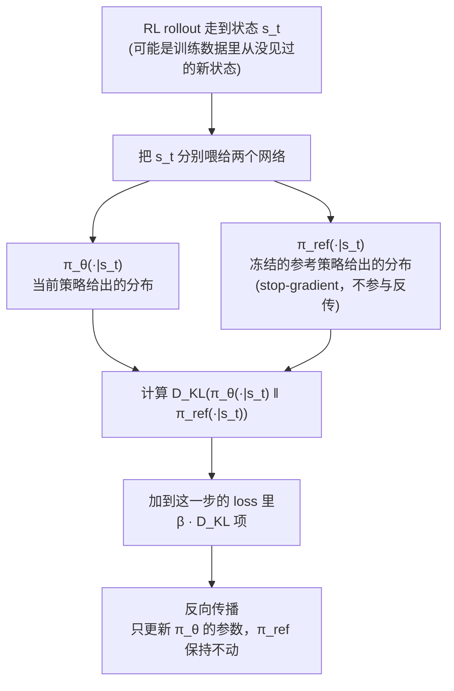

# 前置知识：KL 散度与策略约束（为什么 RL 微调不能跑太远）

> **为什么要读这篇**：VLA-RL、DPPO、RLHF 等所有 RL 后训练方法都用 KL 散度来约束策略更新幅度。不理解 KL 散度，就看不懂"为什么要加 KL penalty"、"$\beta$ 怎么选"、"约束太紧/太松会怎样"。
> **涉及概念**：
> - KL 散度 (Kullback-Leibler Divergence)
> - 信息熵 (Entropy)
> - 策略约束 (Policy Constraint)
> - Trust Region (信赖域)

**标签**: `#前置知识` `#KL散度` `#信息论` `#策略约束` `#RLHF` `#PPO`

---

## 贯穿全文的例子

> 一个 VLA 模型在 "pick up the red block" 任务上做 RL 微调。
> 在某个状态 $s$（看到红色方块在桌面左侧），策略需要决定下一步怎么移动机械臂。
> - 预训练策略 $\pi_{\text{ref}}$ 认为：70% 概率向左移动（对），20% 向前（还行），10% 向右（错）
> - RL 微调后的策略 $\pi_\theta$ 可能变成：95% 向左，4% 向前，1% 向右
>
> KL 散度衡量的就是：$\pi_\theta$ 和 $\pi_{\text{ref}}$ 之间的"差异"到底有多大？

---

## 一、信息熵：先理解"不确定性"

### 1.1 直觉

假设你掷一个骰子：
- 公平骰子（每面 1/6 概率）→ 很不确定下一次是什么 → **高熵**
- 灌铅骰子（99% 出 6）→ 几乎确定下一次是 6 → **低熵**

熵衡量的是一个概率分布的"不确定性"或"信息量"。

### 1.2 公式

对离散分布 $P = (p_1, p_2, \ldots, p_n)$：

$$
H(P) = -\sum_{i=1}^n p_i \log p_i
$$


**逐项拆解**：
- $p_i$：第 $i$ 个事件发生的概率
- $\log p_i$：概率的对数（通常用自然对数 $\ln$ 或以 2 为底 $\log_2$）
- $-p_i \log p_i$：事件 $i$ 的"信息量"乘以它出现的概率
- 求和：所有可能事件的加权信息量之和

**代入数字**：

公平硬币 $P = (0.5, 0.5)$：

$$
H = -(0.5 \ln 0.5 + 0.5 \ln 0.5) = -2 \times 0.5 \times (-0.693) = 0.693 \text{ nats}
$$

极端硬币 $P = (0.99, 0.01)$：

$$
H = -(0.99 \ln 0.99 + 0.01 \ln 0.01) = -(0.99 \times (-0.01) + 0.01 \times (-4.6)) = 0.056 \text{ nats}
$$

公平硬币的熵（0.693）远大于极端硬币（0.056）—— 越确定，熵越低。

---

## 二、KL 散度：衡量两个分布的"距离"

### 2.1 动机：为什么需要衡量分布间的距离

在 RL 后训练中，我们有两个策略：
- $\pi_{\text{ref}}$：预训练好的参考策略（SFT 后的 VLA）
- $\pi_\theta$：正在 RL 微调的策略

我们想让 $\pi_\theta$ 变好（提高 reward），但**不要和 $\pi_{\text{ref}}$ 差太远**。为什么？

1. $\pi_{\text{ref}}$ 经过大规模预训练，拥有丰富的泛化知识
2. 如果 $\pi_\theta$ 偏离太远，可能**灾难性遗忘**预训练知识
3. 在新任务上过度优化可能导致在其他任务上崩溃

所以我们需要一个数学工具来量化"两个分布差多远"，这就是 KL 散度。

### 2.2 KL 散度的定义

$$
D_{\text{KL}}(P \| Q) = \sum_{i} p_i \log \frac{p_i}{q_i}
$$

**为什么需要这个公式**：我们需要一个数字来回答"策略 $\pi_\theta$ 和参考策略 $\pi_{\text{ref}}$ 差了多远"。KL 散度就是这个数字。

**一句话**：KL 散度衡量"用分布 Q 来近似分布 P 时，损失了多少信息"。

**逐项拆解**：
- $p_i$：真实分布 P 中事件 $i$ 的概率
- $q_i$：近似分布 Q 中事件 $i$ 的概率
- $\log \frac{p_i}{q_i}$：P 和 Q 在事件 $i$ 上的"对数概率比"
- $p_i \log \frac{p_i}{q_i}$：用 P 的概率加权的对数比
- 求和：所有事件上的加权总和

**关键性质**：
- $D_{\text{KL}}(P \| Q) \geq 0$：永远非负
- $D_{\text{KL}}(P \| Q) = 0$ 当且仅当 $P = Q$：两个分布完全相同
- $D_{\text{KL}}(P \| Q) \neq D_{\text{KL}}(Q \| P)$：**不对称！** 这不是真正的"距离"

### 2.3 代入我们的例子


参考策略 $\pi_{\text{ref}}$：向左 0.7，向前 0.2，向右 0.1

微调后策略 $\pi_\theta$：向左 0.95，向前 0.04，向右 0.01

计算 $D_{\text{KL}}(\pi_\theta \| \pi_{\text{ref}})$：

$$
D_{\text{KL}} = 0.95 \log\frac{0.95}{0.7} + 0.04 \log\frac{0.04}{0.2} + 0.01 \log\frac{0.01}{0.1}
$$

逐项计算：
- 向左：$0.95 \times \log(1.357) = 0.95 \times 0.305 = 0.290$
- 向前：$0.04 \times \log(0.2) = 0.04 \times (-1.609) = -0.064$
- 向右：$0.01 \times \log(0.1) = 0.01 \times (-2.303) = -0.023$

$$
D_{\text{KL}} = 0.290 - 0.064 - 0.023 = 0.203 \text{ nats}
$$

**解读**：KL = 0.203，表示策略已经有一定偏移但不算极端。如果阈值设为 0.5，这个偏移是被允许的。

再看一个极端情况——如果 $\pi_\theta$ 变成了 100% 向左（完全确定）：

$$
D_{\text{KL}} = 1.0 \times \log\frac{1.0}{0.7} + 0 + 0 = \log(1.43) = 0.357
$$

偏移更大了。如果变成了 100% 向右（完全错误方向）：

$$
D_{\text{KL}} = 0 + 0 + 1.0 \times \log\frac{1.0}{0.1} = \log(10) = 2.303
$$

偏移非常大！KL 散度正确地反映了"策略偏移越离谱，数值越大"。

### 2.4 为什么 KL 不对称——在 RL 中用哪个方向

$$
D_{\text{KL}}(\pi_\theta \| \pi_{\text{ref}}) \neq D_{\text{KL}}(\pi_{\text{ref}} \| \pi_\theta)
$$

- **Forward KL** $D_{\text{KL}}(\pi_{\text{ref}} \| \pi_\theta)$：惩罚 $\pi_\theta$ 在 $\pi_{\text{ref}}$ 概率大的地方给低概率 → 倾向让 $\pi_\theta$ 覆盖 $\pi_{\text{ref}}$ 的所有模式（mode-covering）
- **Reverse KL** $D_{\text{KL}}(\pi_\theta \| \pi_{\text{ref}})$：惩罚 $\pi_\theta$ 在自己概率大的地方偏离 $\pi_{\text{ref}}$ → 倾向让 $\pi_\theta$ 集中在 $\pi_{\text{ref}}$ 的某些模式上（mode-seeking）

**在 VLA RL 后训练中**，通常用 **Reverse KL** $D_{\text{KL}}(\pi_\theta \| \pi_{\text{ref}})$ 作为正则项，因为我们希望新策略"聚焦于好的动作"而不是"覆盖所有旧策略曾做过的动作"。

### 2.5 这套机制具体怎么运作：$\pi_{\text{ref}}$ 是什么、KL 在哪一步被算出来、梯度怎么流

前面几节讲的都是"给定两个分布，怎么算它们的 KL"——但一个更基础的问题还没回答：**这两个分布到底是从哪来的？** 这一节把整个机制从头到尾串一遍。

#### 2.5.1 $\pi_{\text{ref}}$ 不是"BC 另外算一次"，是同一个网络的一份冻结拷贝

一个容易产生的误解是：$\pi_{\text{ref}}$ 是"用 BC 在数据集上重新跑出来的一个统计量"，或者"每次要算 KL 时才现场跑一次行为克隆"。**都不是**。实际做法是：

1. RL 微调开始**之前**，已经有一个训练好的模型（比如 SFT/BC 之后的 VLA），记这份权重为 $\theta_{\text{ref}}$
2. 在 RL 训练开始时，**把这份权重复制一份，冻住，不再更新**，就得到了 $\pi_{\text{ref}} = \pi_{\theta_{\text{ref}}}$
3. 接下来要训练的 $\pi_\theta$，用**同一套网络结构**，初始权重也是从 $\theta_{\text{ref}}$ 复制过来的，但这份会随着 RL 训练不断更新

所以 $\pi_{\text{ref}}$ 和 $\pi_\theta$ 是**两份完全相同结构、但参数不同步**的网络——一个被冻住当"锚点"，一个随训练变化。$\pi_{\text{ref}}$ 不产生新的训练信号，它唯一的作用就是"被查询、给出一个分布，用来跟 $\pi_\theta$ 当前的分布做对比"。

#### 2.5.2 KL 是在 rollout 过程中，逐状态现算出来的——不是在数据集上算的

这是最容易被忽略的一点。KL 惩罚项**完全不依赖训练数据集**，它依赖的是 RL 探索过程中**实际访问到的状态**：



**逐步说明每一格在干什么**：

| 步骤 | 具体在做什么 |
|------|-------------|
| ① 走到状态 $s_t$ | 这是 RL 智能体和环境交互产生的真实状态（比如机械臂当前看到的画面），可能是训练数据里根本没出现过的全新场景 |
| ② 分别喂给两个网络 | $\pi_\theta$ 和 $\pi_{\text{ref}}$ 结构完全一样，输入同一个 $s_t$，各自跑一次前向传播 |
| ③④ 两个分布 | 每个网络输出的不是一个具体动作，是一个完整的分布——比如连续动作场景下，输出的是高斯分布的均值 $\mu$ 和标准差 $\sigma$（见 2.5.3 节）|
| ⑤ 算 KL | 把这两个分布代入 KL 公式（2.2 节讲的离散版本，或 2.5.3 节讲的连续高斯版本） |
| ⑥ 加进 loss | 这一步的 KL 值乘上系数 $\beta$，作为惩罚项加进这一步的总损失 |
| ⑦ 反传 | 梯度只流向 $\pi_\theta$ 的参数——$\pi_{\text{ref}}$ 那条分支在计算图上是 stop-gradient（不参与更新），它只是提供一个"靠着比较的标尺" |

**关键澄清**：KL 惩罚在**每一个训练 step、每一个访问到的状态**上都会被重新计算一次，不是"先在整个数据集上算一次距离，再拿这个距离去约束"。$\pi_{\text{ref}}$ 全程冻住不动，充当一个固定的参照系；$\pi_\theta$ 每次更新后，下一次 rollout 再去和这个固定参照系比较——这样 $\pi_\theta$ 就被反复地、在它实际走到的每个状态上，"往回拉"向 $\pi_{\text{ref}}$。

#### 2.5.3 连续动作场景：两个高斯分布之间的 KL 散度长什么样

2.2、2.3 节的例子都是离散分布（向左/向前/向右）。但机器人 RL 里动作通常是连续的（比如关节力矩），这时候 $\pi_\theta(\cdot|s)$ 和 $\pi_{\text{ref}}(\cdot|s)$ 都是高斯分布（回顾 [策略梯度与 PPO 前置知识](/前置知识/000a_前置知识_策略梯度与PPO) 第十一节的高斯策略参数化）。两个高斯分布之间的 KL 散度有一个干净的闭式解——不需要用离散公式里的求和，直接套公式就行。

对一维高斯 $\pi_\theta = \mathcal{N}(\mu_\theta, \sigma_\theta^2)$ 和 $\pi_{\text{ref}} = \mathcal{N}(\mu_{\text{ref}}, \sigma_{\text{ref}}^2)$：

$$
D_{\text{KL}}\big(\mathcal{N}(\mu_\theta,\sigma_\theta^2) \,\|\, \mathcal{N}(\mu_{\text{ref}},\sigma_{\text{ref}}^2)\big) = \log\frac{\sigma_{\text{ref}}}{\sigma_\theta} + \frac{\sigma_\theta^2 + (\mu_\theta-\mu_{\text{ref}})^2}{2\sigma_{\text{ref}}^2} - \frac{1}{2}
$$

**为什么需要这个公式**：这就是 RLHF、VLA-RL 这类方法在连续动作场景下，每一步真正拿去算的 KL 公式。它把"两个分布差多远"直接压缩成一个只依赖四个数字（$\mu_\theta,\sigma_\theta,\mu_{\text{ref}},\sigma_{\text{ref}}$）的封闭表达式，不需要采样、不需要积分。

**逐项拆解**：

| 符号 | 含义 | 直觉 |
|------|------|------|
| $\mu_\theta,\sigma_\theta$ | 当前策略在状态 $s$ 下输出的均值、标准差 | "新策略觉得应该做什么、有多大把握" |
| $\mu_{\text{ref}},\sigma_{\text{ref}}$ | 参考策略在同一个状态 $s$ 下输出的均值、标准差 | "老策略（冻住的）觉得应该做什么" |
| $\log\dfrac{\sigma_{\text{ref}}}{\sigma_\theta}$ | 两个标准差之比的对数 | 如果新策略变得比老策略更"确定"（$\sigma_\theta$ 更小），这一项是正的；更"随机"则是负的 |
| $(\mu_\theta-\mu_{\text{ref}})^2$ | 两个均值差的平方 | 新旧策略"中心点"离多远，是整个式子里对均值偏移**最敏感**的一项 |
| $\sigma_\theta^2$ | 当前策略自身的方差 | 和均值差一起除以 $2\sigma_{\text{ref}}^2$，衡量"新分布的散布程度，用旧分布的尺度去量" |
| $-\dfrac{1}{2}$ | 常数修正项 | 保证当 $\mu_\theta=\mu_{\text{ref}},\sigma_\theta=\sigma_{\text{ref}}$（两个分布完全一样）时，整个式子精确等于 0 |

**数值例子**：延续贯穿全文的机械臂场景，某个状态 $s_t$ 下，动作是"末端沿 x 轴的位移"这一维（简化成一维方便手算）：

- 参考策略：$\mu_{\text{ref}}=0.02$（预训练模型觉得该往前移 2cm），$\sigma_{\text{ref}}=0.01$
- 当前策略（RL 微调了几步之后）：$\mu_\theta=0.035$，$\sigma_\theta=0.008$

代入公式：

$$
D_{\text{KL}} = \log\frac{0.01}{0.008} + \frac{0.008^2+(0.035-0.02)^2}{2\times0.01^2} - \frac{1}{2}
$$

逐项算：
- $\log\frac{0.01}{0.008}=\log(1.25)\approx0.223$
- $0.008^2=0.000064$，$(0.035-0.02)^2=0.015^2=0.000225$，两者相加 $=0.000289$
- $\frac{0.000289}{2\times0.0001}=\frac{0.000289}{0.0002}=1.445$
- 合计：$0.223+1.445-0.5=1.168$

$D_{\text{KL}}\approx1.168$——一个相当大的偏移（对比 2.3 节离散例子里 $0.2\sim0.36$ 算是"轻微偏移"的量级）。这提示我们：如果这一步的 $\beta$ 设得不够大，这个偏移会在 loss 里被记上一笔不小的惩罚，梯度会推动 $\mu_\theta$ 往 $0.02$ 靠近、$\sigma_\theta$ 往 $0.01$ 靠近。

**为什么均值差异这一项占主导**：注意在上面的数值例子里，均值差贡献的 $0.000225$ 比方差自身贡献的 $0.000064$ 大得多——这是因为均值差是**平方**关系，一旦新旧策略的"中心点"分道扬镳，这一项会迅速增大，KL 散度对"往哪个方向偏"比"分布散不散"更敏感。这也是为什么 KL 惩罚在实践中主要起到的效果是"不让策略的输出中心漂太远"，而不是"不让策略变得更确定/更随机"。

**这里的高斯和"高斯策略不够用"是两个不同的问题**：本节 $\pi_\theta,\pi_{\text{ref}}$ 都用高斯表示，KL 约束算得很顺利——这里高斯扮演的角色是"互相比较的两个参照分布"，$\pi_{\text{ref}}$ 只需要"待在原地当基准"，不需要重新去表示原始示教数据里可能存在的多个模式。这和 [行为约束策略优化](/前置知识/001l_前置知识_行为约束策略优化) 第 3.5 节讨论的"高斯策略约束不了多模态数据"完全是另一个问题——那里的高斯网络扮演的角色是"必须重新学会还原原始数据分布"，如果原始数据是双峰的，单峰高斯就会把两个峰错误地平均到中间。两节看似都在说"高斯策略"，但套在了完全不同的角色上，建议对照着读一遍第 3.5 节。

#### 2.5.4 一句话串起来

$\pi_{\text{ref}}$ 是训练开始前那个模型的冻结拷贝；RL 每走到一个状态，就把这个状态同时喂给 $\pi_\theta$ 和 $\pi_{\text{ref}}$，各自吐出一个分布（离散场景是一组概率、连续场景是均值方差），代入 2.2 节或本节的公式算出一个数，乘上 $\beta$ 加进 loss，反传只更新 $\pi_\theta$。整个过程和"训练数据集"没有直接关系——它比较的是两个网络在**同一个当前状态**下"想法差多远"，而这个当前状态可以是 RL 探索到的任意新状态。

---

## 三、KL 散度在 RL 后训练中的应用

### 3.1 作为 penalty 加到目标函数中

最常见的用法——在 RL 的目标函数中加一个 KL 惩罚项：

$$
J(\theta) = \mathbb{E}_{\tau \sim \pi_\theta}\left[R(\tau)\right] - \beta \cdot D_{\text{KL}}(\pi_\theta \| \pi_{\text{ref}})
$$


**为什么需要这个公式**：纯 RL 优化 reward 会让策略跑飞（灾难性遗忘），加上 KL penalty 把策略拴在预训练模型附近。

**逐项拆解**：
- $\mathbb{E}_{\tau \sim \pi_\theta}[R(\tau)]$：RL 的原始目标——最大化累积奖励
- $D_{\text{KL}}(\pi_\theta \| \pi_{\text{ref}})$：新策略和参考策略的距离——越大说明偏离越远
- $\beta > 0$：权衡系数（超参数）——$\beta$ 越大越保守
- 减号：惩罚偏离，让目标函数在偏离大时变小

**$\beta$ 的直觉**：

| $\beta$ 值 | 效果 | 类比 |
|------------|------|------|
| $\beta = 0$ | 纯 RL，不约束 | 放风筝没线 |
| $\beta = 0.01$ | 轻微约束 | 长绳子风筝 |
| $\beta = 0.1$ | 中等约束（常用） | 中等绳子 |
| $\beta = 1.0$ | 强约束 | 短绳子，飞不远 |
| $\beta \to \infty$ | 完全不更新 | 拴死了 |

**在 VLA-RL 中的实际用法**：

$$
L(\theta) = -\mathbb{E}_t\left[\min(r_t \hat{A}_t, \text{clip}(\cdot)\hat{A}_t)\right] + \beta \sum_t D_{\text{KL}}\left(\pi_\theta(\cdot|s_t) \| \pi_{\text{ref}}(\cdot|s_t)\right)
$$

对于自回归 VLA（输出离散 token），每个 token 位置的 KL 是：

$$
D_{\text{KL}}\left(\pi_\theta(\cdot|s_t, a_{<i}) \| \pi_{\text{ref}}(\cdot|s_t, a_{<i})\right) = \sum_{v=0}^{255} \pi_\theta(v) \log \frac{\pi_\theta(v)}{\pi_{\text{ref}}(v)}
$$

对 256 个 bin 求和。

### 3.2 PPO 的 clip 本身也是一种隐式 KL 约束

[PPO 的 clip 机制](/前置知识/000a_前置知识_策略梯度与PPO) 通过限制概率比 $r_t \in [1-\epsilon, 1+\epsilon]$ 来间接限制策略变化。可以证明，当 $r_t$ 接近 1 时：

$$
D_{\text{KL}}(\pi_\theta \| \pi_{\text{old}}) \approx \frac{1}{2}(r_t - 1)^2
$$

所以 clip 到 $[0.8, 1.2]$ 相当于限制了 KL 散度在 $\frac{1}{2} \times 0.04 = 0.02$ 量级。

### 3.3 RLHF / VLA-RL 的实际 KL 控制策略

实践中经常用**自适应 $\beta$**：

```
如果 KL > target_KL × 1.5:
    β ← β × 2      # KL 太大了，加强约束
如果 KL < target_KL / 1.5:
    β ← β / 2      # KL 太小了，放松约束让策略多探索
```

典型设置：`target_KL = 0.01 ~ 0.05`

---

## 四、直觉总结

| 概念 | 直觉 | 在 VLA RL 中的角色 |
|------|------|-------------------|
| 熵 $H(\pi)$ | 策略的"随机性" | 熵太低 → 策略坍塌；熵 bonus 保持探索 |
| $D_{\text{KL}}(\pi_\theta \| \pi_{\text{ref}})$ | 新旧策略的"距离" | KL penalty 防止灾难性遗忘 |
| $\beta$ | 约束的"松紧度" | 太松策略跑飞，太紧学不到新东西 |

**核心 takeaway**：KL 散度在 RL 后训练中扮演"安全绳"的角色——允许策略在预训练知识的基础上改进，但不允许走太远把预训练学到的好东西搞丢。

---

## 延伸阅读

- [策略梯度与 PPO](/前置知识/000a_前置知识_策略梯度与PPO) — PPO clip 作为隐式 KL 约束
- [行为克隆与 RL 微调范式](/前置知识/000d_前置知识_行为克隆与RL微调范式) — 为什么需要约束微调
- [VLA 模型的 RL 后训练综述](/论文综述/S06_VLA模型的RL后训练综述) — KL 在各方法中的使用
