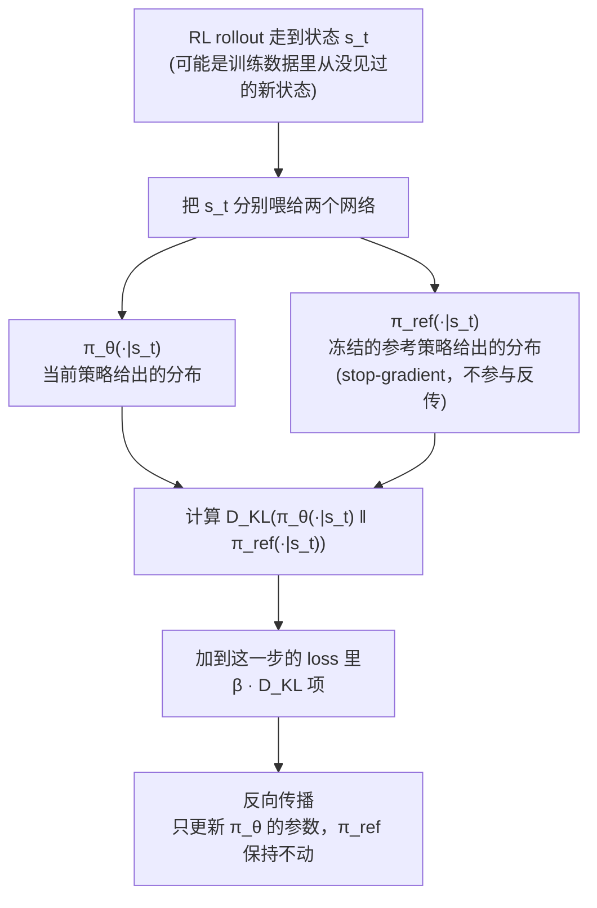

# 前置知识：KL 散度与策略约束（为什么 RL 微调不能跑太远）

> **为什么要读这篇**：VLA-RL、DPPO、RLHF 等所有 RL 后训练方法都用 KL 散度来约束策略更新幅度。不理解 KL 散度，就看不懂"为什么要加 KL penalty"、"$\beta$ 怎么选"、"约束太紧/太松会怎样"。
> **涉及概念**：
> - KL 散度 (Kullback-Leibler Divergence)
> - 信息熵 (Entropy)
> - 策略约束 (Policy Constraint)
> - Trust Region (信赖域)

**标签**: `#前置知识` `#KL散度` `#信息论` `#策略约束` `#RLHF` `#PPO`

---

## 贯穿全文的例子

> 一个 VLA 模型在 "pick up the red block" 任务上做 RL 微调。
> 在某个状态 $s$（看到红色方块在桌面左侧），策略需要决定下一步怎么移动机械臂。
> - 预训练策略 $\pi_{\text{ref}}$ 认为：70% 概率向左移动（对），20% 向前（还行），10% 向右（错）
> - RL 微调后的策略 $\pi_\theta$ 可能变成：95% 向左，4% 向前，1% 向右
>
> KL 散度衡量的就是：$\pi_\theta$ 和 $\pi_{\text{ref}}$ 之间的"差异"到底有多大？

---

## 一、信息熵：先理解"不确定性"

### 1.1 直觉

假设你掷一个骰子：
- 公平骰子（每面 1/6 概率）→ 很不确定下一次是什么 → **高熵**
- 灌铅骰子（99% 出 6）→ 几乎确定下一次是 6 → **低熵**

熵衡量的是一个概率分布的"不确定性"或"信息量"。

### 1.2 公式

**为什么需要这个公式**：光说"公平骰子比灌铅骰子更不确定"是感觉，没法拿去算数、比大小、放进 loss 里当正则项（比如 RL 里常见的"熵 bonus"）。我们需要一个数字，把"一个分布有多不确定"精确量化出来，这就是熵。

对离散分布 $P = (p_1, p_2, \ldots, p_n)$：

$$
H(P) = -\sum_{i=1}^n p_i \log p_i
$$

**这个公式在做什么**：把每个事件"有多让人惊讶"（概率越低越惊讶）按它实际发生的概率加权平均起来，得到这个分布整体"有多让人捉摸不透"的一个数。

::: details 📐 公式详解（点击展开）

| 子表达式 | 它是谁 | 它在干嘛 |
|---------|--------|---------|
| $p_i$ | **发生概率** | 第 $i$ 个事件发生的概率，$\sum_i p_i=1$，是分布里第 $i$ 种结果出现的可能性 |
| $\log p_i$ | **对数尺子** | $p_i$ 越小，$\log p_i$ 越负（越"意外"）；$p_i=1$ 时 $\log p_i=0$（完全不意外），本文统一用自然对数 $\ln$，单位是 nats |
| $-\log p_i$ | **惊讶度打分器** | 定义为事件 $i$ 的"信息量"/"惊讶程度"，取负号后恒为非负数 |
| $-p_i \log p_i$ | **加权后的惊讶值** | 惊讶程度乘以它出现的概率，只有真的会发生的事件，它的"惊讶值"才计入总账 |
| $\sum_{i=1}^n$ | **总账簿** | 把每个事件贡献的加权惊讶值全部累加，得到分布整体的不确定性 |

**用人话读**："把每个事件有多意外，按它实际发生的概率加权平均起来，算出这个分布整体有多让人捉摸不透。"

**为什么是这个形式**：取 $\log$ 是为了让"信息量"具备可加性——两个独立事件同时发生的联合概率是 $p_1 p_2$，取 $\log$ 后变成 $\log p_1+\log p_2$，正好等于两件事各自信息量之和，符合"独立信息可以直接相加"的直觉。前面加负号是因为 $\log p_i\le 0$（概率 $\le 1$），加负号让"信息量"变成非负数，方便理解成"要付出多少代价才能消除这个不确定性"。按 $p_i$ 加权求和（而不是简单平均）是因为熵要衡量的是"整个分布"的不确定性，出现频率越高的事件对总体不确定性的贡献理应越大。
:::

**代入数字**：

公平硬币 $P = (0.5, 0.5)$：

$$
H = -(0.5 \ln 0.5 + 0.5 \ln 0.5) = -2 \times 0.5 \times (-0.693) = 0.693 \text{ nats}
$$

**这个公式在做什么**：把公平硬币的两个概率代入熵公式，算出这个分布的具体不确定性数值。

::: details 📐 公式详解（点击展开）

| 子表达式 | 它是谁 | 它在干嘛 |
|---------|--------|---------|
| $0.5 \ln 0.5$ | **单个事件的加权惊讶值** | 正反面各自贡献的 $p_i\log p_i$，因为对称所以两项相等 |
| $-2\times0.5\times(-0.693)$ | **加总取负** | 两个相等的项加起来再取负号 |
| $0.693\text{ nats}$ | **最终熵值** | 公平硬币的不确定性数值，是二元分布能取到的最大熵 |

**用人话读**："正反面各占一半的硬币，算出来的不确定性是 0.693 nats。"

**为什么是这个形式**：公平硬币是"最不确定"的极端情况，代入验证熵公式在这种极端下取到理论最大值。
:::

极端硬币 $P = (0.99, 0.01)$：

$$
H = -(0.99 \ln 0.99 + 0.01 \ln 0.01) = -(0.99 \times (-0.01) + 0.01 \times (-4.6)) = 0.056 \text{ nats}
$$

**这个公式在做什么**：把几乎已经确定结果的硬币概率代入熵公式，验证"越确定，熵越低"。

::: details 📐 公式详解（点击展开）

| 子表达式 | 它是谁 | 它在干嘛 |
|---------|--------|---------|
| $0.99\ln 0.99$ | **大概率事件的贡献** | 几乎必然发生的一面，惊讶值很小 |
| $0.01\ln 0.01$ | **小概率事件的贡献** | 几乎不会发生的一面，虽然单次惊讶值大，但权重 $0.01$ 很小 |
| $0.056\text{ nats}$ | **最终熵值** | 远小于公平硬币的 $0.693$，量化了"几乎确定"这件事 |

**用人话读**："99% 概率出正面的硬币，几乎没有不确定性，算出来的熵只有 0.056 nats。"

**为什么是这个形式**：对比公平硬币的结果，直接验证了熵的核心性质——分布越偏向某一个结果，熵越低。
:::

公平硬币的熵（0.693）远大于极端硬币（0.056）—— 越确定，熵越低。

---

## 二、KL 散度：衡量两个分布的"距离"

### 2.1 动机：为什么需要衡量分布间的距离

在 RL 后训练中，我们有两个策略：
- $\pi_{\text{ref}}$：预训练好的参考策略（SFT 后的 VLA）
- $\pi_\theta$：正在 RL 微调的策略

我们想让 $\pi_\theta$ 变好（提高 reward），但**不要和 $\pi_{\text{ref}}$ 差太远**。为什么？

1. $\pi_{\text{ref}}$ 经过大规模预训练，拥有丰富的泛化知识
2. 如果 $\pi_\theta$ 偏离太远，可能**灾难性遗忘**预训练知识
3. 在新任务上过度优化可能导致在其他任务上崩溃

所以我们需要一个数学工具来量化"两个分布差多远"，这就是 KL 散度。

### 2.2 KL 散度的定义

$$
D_{\text{KL}}(P \| Q) = \sum_{i} p_i \log \frac{p_i}{q_i}
$$

**这个公式在做什么**：算出"如果实际情况是分布 P，但你却用分布 Q 的想法去行动/编码，平均要多付出多少额外代价"——这就是量化"策略 $\pi_\theta$ 和参考策略 $\pi_{\text{ref}}$ 差了多远"的数字。

::: details 📐 公式详解（点击展开）

| 子表达式 | 它是谁 | 它在干嘛 |
|---------|--------|---------|
| $p_i$ | **真实分布的话事人** | 分布 P 中事件 $i$ 的概率，对应 $\pi_\theta$（正在训练的策略）在动作 $i$ 上的概率——"我们实际正在用的分布" |
| $q_i$ | **参照基准** | 分布 Q 中事件 $i$ 的概率，对应 $\pi_{\text{ref}}$（冻结的参考策略）在动作 $i$ 上的概率——"拿来当基准比较的分布" |
| $\frac{p_i}{q_i}$ | **偏爱倍数计** | 两个分布在同一事件上的概率比值，比值 $>1$ 说明 P 比 Q 更看重这个事件 |
| $\log \frac{p_i}{q_i}$ | **偏离度量尺** | 比值为 1（两者一致）时该项为 0；偏离越大，绝对值越大 |
| $p_i \log \frac{p_i}{q_i}$ | **只按 P 的口味计较** | 用 P 自己的概率加权这一项对数比，只在 P 真的会发生的事件上"计较差异"，P 认为不会发生的事件（$p_i\approx0$）几乎不贡献 |
| $\sum_{i}$ | **总差异累加器** | 对所有可能的动作（向左/向前/向右）求和，把每个事件上的加权差异累加成一个总分 |

**用人话读**："按 P 自己真实发生的概率去加权，算出'用 Q 的想法来描述 P 的真实情况'平均要多付出多少额外代价，这个代价总量就是 KL 散度。"

**为什么是这个形式**：分子分母都取 $\log$ 再加权求和，本质是熵的推广——$D_{\text{KL}}(P\|Q)=\sum_i p_i\log p_i-\sum_i p_i\log q_i$，前一项是 $-H(P)$（P 自身的负熵），后一项是"用 Q 编码 P 产生的期望信息量"（交叉熵）。两者相减，正好衡量"用错了分布 Q 之后，比用对分布 P 多付出的信息代价"。用 $p_i$ 而不是 $q_i$ 加权（不对称的根源）是因为我们关心的是"P 真实发生的事件上，Q 猜得有多准"，而不是反过来。
:::

**关键性质**：
- $D_{\text{KL}}(P \| Q) \geq 0$：永远非负
- $D_{\text{KL}}(P \| Q) = 0$ 当且仅当 $P = Q$：两个分布完全相同
- $D_{\text{KL}}(P \| Q) \neq D_{\text{KL}}(Q \| P)$：**不对称！** 这不是真正的"距离"

### 2.3 代入我们的例子


参考策略 $\pi_{\text{ref}}$：向左 0.7，向前 0.2，向右 0.1

微调后策略 $\pi_\theta$：向左 0.95，向前 0.04，向右 0.01

计算 $D_{\text{KL}}(\pi_\theta \| \pi_{\text{ref}})$：

$$
D_{\text{KL}} = 0.95 \log\frac{0.95}{0.7} + 0.04 \log\frac{0.04}{0.2} + 0.01 \log\frac{0.01}{0.1}
$$

**这个公式在做什么**：把微调后策略和参考策略在"左/前/右"三个动作上的具体概率代入 KL 公式，展开成三项待计算的形式。

::: details 📐 公式详解（点击展开）

| 子表达式 | 它是谁 | 它在干嘛 |
|---------|--------|---------|
| $0.95\log\frac{0.95}{0.7}$ | **向左这一项** | 微调策略在"向左"上比参考策略更偏爱多少 |
| $0.04\log\frac{0.04}{0.2}$ | **向前这一项** | 微调策略在"向前"上比参考策略降低了多少偏爱 |
| $0.01\log\frac{0.01}{0.1}$ | **向右这一项** | 微调策略在"向右"上比参考策略降低了多少偏爱 |

**用人话读**："把三个动作各自的'新旧概率比对数加权'算出来，等下一步加总就是总的 KL 散度。"

**为什么是这个形式**：直接套用 2.2 节定义的 KL 公式，把抽象的 $p_i,q_i$ 换成三个具体动作各自的概率数值。
:::

逐项计算：
- 向左：$0.95 \times \log(1.357) = 0.95 \times 0.305 = 0.290$
- 向前：$0.04 \times \log(0.2) = 0.04 \times (-1.609) = -0.064$
- 向右：$0.01 \times \log(0.1) = 0.01 \times (-2.303) = -0.023$

$$
D_{\text{KL}} = 0.290 - 0.064 - 0.023 = 0.203 \text{ nats}
$$

**这个公式在做什么**：把三项逐项计算的结果加总，得到这次策略偏移的最终 KL 数值。

::: details 📐 公式详解（点击展开）

| 子表达式 | 它是谁 | 它在干嘛 |
|---------|--------|---------|
| $0.290$ | **向左项的贡献** | 正值，说明"向左"这个概率大幅提升带来的正向偏离 |
| $-0.064,-0.023$ | **向前/向右项的贡献** | 负值，因为这两个动作的概率都降低了（$\log$ 比值 $<0$） |
| $0.203\text{ nats}$ | **总偏移量** | 三项相加，正负项相互抵消后的最终 KL 值 |

**用人话读**："三个动作各自的偏离贡献加起来，得到策略整体偏移了 0.203 nats。"

**为什么是这个形式**：这就是 2.2 节公式在具体数值下的直接结果，验证了"KL 是所有事件偏离贡献的加权总和"这一定义。
:::

**解读**：KL = 0.203，表示策略已经有一定偏移但不算极端。如果阈值设为 0.5，这个偏移是被允许的。

再看一个极端情况——如果 $\pi_\theta$ 变成了 100% 向左（完全确定）：

$$
D_{\text{KL}} = 1.0 \times \log\frac{1.0}{0.7} + 0 + 0 = \log(1.43) = 0.357
$$

**这个公式在做什么**：验证"策略变得完全确定（只选一个动作）"这种极端情况下 KL 会有多大。

::: details 📐 公式详解（点击展开）

| 子表达式 | 它是谁 | 它在干嘛 |
|---------|--------|---------|
| $1.0\times\log\frac{1.0}{0.7}$ | **唯一非零项** | 只有"向左"概率非零（=1），其余两项因为 $p_i=0$ 自动消失 |
| $0.357$ | **偏移量** | 比 0.203 更大，说明策略从"以左为主"变成"完全只选左"时，偏移进一步增大 |

**用人话读**："如果新策略把所有概率都押在参考策略本来就偏爱的那个动作上，KL 也会变大，因为完全排除了其他可能性。"

**为什么是这个形式**：这个例子说明 KL 不只衡量"选错了方向"，哪怕方向选对了，只要把分布变得比参考策略更极端（更确定），KL 也会增大。
:::

偏移更大了。如果变成了 100% 向右（完全错误方向）：

$$
D_{\text{KL}} = 0 + 0 + 1.0 \times \log\frac{1.0}{0.1} = \log(10) = 2.303
$$

**这个公式在做什么**：验证"策略选择了参考策略认为最不可能的动作"这种最坏情况下 KL 会有多大。

::: details 📐 公式详解（点击展开）

| 子表达式 | 它是谁 | 它在干嘛 |
|---------|--------|---------|
| $1.0\times\log\frac{1.0}{0.1}$ | **唯一非零项** | 新策略 100% 选择了参考策略只给 10% 概率的"向右" |
| $2.303$ | **偏移量** | 远大于前两个例子，是"完全选错方向"付出的代价 |

**用人话读**："如果新策略完全押在参考策略认为最不靠谱的动作上，KL 会飙升到 2.303，比前面两种情况都大得多。"

**为什么是这个形式**：这组对比（0.203 → 0.357 → 2.303）验证了 KL 散度确实能正确反映"策略偏移越离谱，数值越大"这一核心性质。
:::

偏移非常大！KL 散度正确地反映了"策略偏移越离谱，数值越大"。

### 2.4 为什么 KL 不对称——在 RL 中用哪个方向

$$
D_{\text{KL}}(\pi_\theta \| \pi_{\text{ref}}) \neq D_{\text{KL}}(\pi_{\text{ref}} \| \pi_\theta)
$$

**这个公式在做什么**：明确指出 KL 散度不是对称的——交换两个分布的位置，算出来的值一般不一样，这意味着"用谁当基准"这个选择本身是有讲究的。

::: details 📐 公式详解（点击展开）

| 子表达式 | 它是谁 | 它在干嘛 |
|---------|--------|---------|
| $D_{\text{KL}}(\pi_\theta \| \pi_{\text{ref}})$ | **Reverse KL** | 用新策略自己的概率加权，衡量"新策略偏爱的地方，参考策略跟不跟得上" |
| $D_{\text{KL}}(\pi_{\text{ref}} \| \pi_\theta)$ | **Forward KL** | 用参考策略的概率加权，衡量"参考策略偏爱的地方，新策略跟不跟得上" |
| $\neq$ | **不对称警示** | 提醒读者这不是真正的"距离"，选哪个方向会导致完全不同的优化行为 |

**用人话读**："同样两个分布，从哪个方向算 KL，得到的数字和引导的优化方向都不一样。"

**为什么是这个形式**：这不是设计出来的公式，是 2.2 节 KL 定义本身的直接推论——因为加权用的是 $p_i$ 而不是 $q_i$，交换 P 和 Q 的位置自然会得到不同的结果，这个不对称性正是接下来讨论"该用哪个方向"的原因。
:::

- **Forward KL** $D_{\text{KL}}(\pi_{\text{ref}} \| \pi_\theta)$：惩罚 $\pi_\theta$ 在 $\pi_{\text{ref}}$ 概率大的地方给低概率 → 倾向让 $\pi_\theta$ 覆盖 $\pi_{\text{ref}}$ 的所有模式（mode-covering）
- **Reverse KL** $D_{\text{KL}}(\pi_\theta \| \pi_{\text{ref}})$：惩罚 $\pi_\theta$ 在自己概率大的地方偏离 $\pi_{\text{ref}}$ → 倾向让 $\pi_\theta$ 集中在 $\pi_{\text{ref}}$ 的某些模式上（mode-seeking）

**在 VLA RL 后训练中**，通常用 **Reverse KL** $D_{\text{KL}}(\pi_\theta \| \pi_{\text{ref}})$ 作为正则项，因为我们希望新策略"聚焦于好的动作"而不是"覆盖所有旧策略曾做过的动作"。

### 2.5 这套机制具体怎么运作：$\pi_{\text{ref}}$ 是什么、KL 在哪一步被算出来、梯度怎么流

前面几节讲的都是"给定两个分布，怎么算它们的 KL"——但一个更基础的问题还没回答：**这两个分布到底是从哪来的？** 这一节把整个机制从头到尾串一遍。

#### 2.5.1 $\pi_{\text{ref}}$ 不是"BC 另外算一次"，是同一个网络的一份冻结拷贝

一个容易产生的误解是：$\pi_{\text{ref}}$ 是"用 BC 在数据集上重新跑出来的一个统计量"，或者"每次要算 KL 时才现场跑一次行为克隆"。**都不是**。实际做法是：

1. RL 微调开始**之前**，已经有一个训练好的模型（比如 SFT/BC 之后的 VLA），记这份权重为 $\theta_{\text{ref}}$
2. 在 RL 训练开始时，**把这份权重复制一份，冻住，不再更新**，就得到了 $\pi_{\text{ref}} = \pi_{\theta_{\text{ref}}}$
3. 接下来要训练的 $\pi_\theta$，用**同一套网络结构**，初始权重也是从 $\theta_{\text{ref}}$ 复制过来的，但这份会随着 RL 训练不断更新

所以 $\pi_{\text{ref}}$ 和 $\pi_\theta$ 是**两份完全相同结构、但参数不同步**的网络——一个被冻住当"锚点"，一个随训练变化。$\pi_{\text{ref}}$ 不产生新的训练信号，它唯一的作用就是"被查询、给出一个分布，用来跟 $\pi_\theta$ 当前的分布做对比"。

#### 2.5.2 KL 是在 rollout 过程中，逐状态现算出来的——不是在数据集上算的

这是最容易被忽略的一点。KL 惩罚项**完全不依赖训练数据集**，它依赖的是 RL 探索过程中**实际访问到的状态**：


```mermaid
flowchart TD
    A["RL rollout 走到状态 s_t<br/>(可能是训练数据里从没见过的新状态)"] --> B["把 s_t 分别喂给两个网络"]
    B --> C["π_θ(·|s_t)<br/>当前策略给出的分布"]
    B --> D["π_ref(·|s_t)<br/>冻结的参考策略给出的分布<br/>(stop-gradient，不参与反传)"]
    C --> E["计算 D_KL(π_θ(·|s_t) ‖ π_ref(·|s_t))"]
    D --> E
    E --> F["加到这一步的 loss 里<br/>β · D_KL 项"]
    F --> G["反向传播<br/>只更新 π_θ 的参数，π_ref 保持不动"]
```

**逐步说明每一格在干什么**：

| 步骤 | 具体在做什么 |
|------|-------------|
| ① 走到状态 $s_t$ | 这是 RL 智能体和环境交互产生的真实状态（比如机械臂当前看到的画面），可能是训练数据里根本没出现过的全新场景 |
| ② 分别喂给两个网络 | $\pi_\theta$ 和 $\pi_{\text{ref}}$ 结构完全一样，输入同一个 $s_t$，各自跑一次前向传播 |
| ③④ 两个分布 | 每个网络输出的不是一个具体动作，是一个完整的分布——比如连续动作场景下，输出的是高斯分布的均值 $\mu$ 和标准差 $\sigma$（见 2.5.3 节）|
| ⑤ 算 KL | 把这两个分布代入 KL 公式（2.2 节讲的离散版本，或 2.5.3 节讲的连续高斯版本） |
| ⑥ 加进 loss | 这一步的 KL 值乘上系数 $\beta$，作为惩罚项加进这一步的总损失 |
| ⑦ 反传 | 梯度只流向 $\pi_\theta$ 的参数——$\pi_{\text{ref}}$ 那条分支在计算图上是 stop-gradient（不参与更新），它只是提供一个"靠着比较的标尺" |

**关键澄清**：KL 惩罚在**每一个训练 step、每一个访问到的状态**上都会被重新计算一次，不是"先在整个数据集上算一次距离，再拿这个距离去约束"。$\pi_{\text{ref}}$ 全程冻住不动，充当一个固定的参照系；$\pi_\theta$ 每次更新后，下一次 rollout 再去和这个固定参照系比较——这样 $\pi_\theta$ 就被反复地、在它实际走到的每个状态上，"往回拉"向 $\pi_{\text{ref}}$。

#### 2.5.3 连续动作场景：两个高斯分布之间的 KL 散度长什么样

2.2、2.3 节的例子都是离散分布（向左/向前/向右）。但机器人 RL 里动作通常是连续的（比如关节力矩），这时候 $\pi_\theta(\cdot|s)$ 和 $\pi_{\text{ref}}(\cdot|s)$ 都是高斯分布（回顾 [策略梯度与 PPO 前置知识](/前置知识/000a_前置知识_策略梯度与PPO) 第十一节的高斯策略参数化）。两个高斯分布之间的 KL 散度有一个干净的闭式解——不需要用离散公式里的求和，直接套公式就行。

对一维高斯 $\pi_\theta = \mathcal{N}(\mu_\theta, \sigma_\theta^2)$ 和 $\pi_{\text{ref}} = \mathcal{N}(\mu_{\text{ref}}, \sigma_{\text{ref}}^2)$：

$$
D_{\text{KL}}\big(\mathcal{N}(\mu_\theta,\sigma_\theta^2) \,\|\, \mathcal{N}(\mu_{\text{ref}},\sigma_{\text{ref}}^2)\big) = \log\frac{\sigma_{\text{ref}}}{\sigma_\theta} + \frac{\sigma_\theta^2 + (\mu_\theta-\mu_{\text{ref}})^2}{2\sigma_{\text{ref}}^2} - \frac{1}{2}
$$

**这个公式在做什么**：把"两个分布差多远"直接压缩成一个只依赖四个数字（$\mu_\theta,\sigma_\theta,\mu_{\text{ref}},\sigma_{\text{ref}}$）的封闭表达式，不需要采样、不需要积分，这就是 RLHF、VLA-RL 在连续动作场景下每一步真正拿去算的 KL 公式。

::: details 📐 公式详解（点击展开）

| 子表达式 | 它是谁 | 它在干嘛 |
|---------|--------|---------|
| $\mu_\theta,\sigma_\theta$ | **新策略的判断** | 当前策略在状态 $s$ 下输出的均值、标准差——"新策略觉得应该做什么、有多大把握" |
| $\mu_{\text{ref}},\sigma_{\text{ref}}$ | **老策略的判断** | 参考策略在同一个状态 $s$ 下输出的均值、标准差——"老策略（冻住的）觉得应该做什么" |
| $\log\dfrac{\sigma_{\text{ref}}}{\sigma_\theta}$ | **确定性差异计** | 两个标准差之比的对数，如果新策略变得比老策略更"确定"（$\sigma_\theta$ 更小），这一项是正的；更"随机"则是负的 |
| $(\mu_\theta-\mu_{\text{ref}})^2$ | **中心漂移量** | 两个均值差的平方，是整个式子里对均值偏移**最敏感**的一项 |
| $\sigma_\theta^2$ | **自身散布度** | 当前策略自身的方差，和均值差一起除以 $2\sigma_{\text{ref}}^2$，用旧分布的尺度去量新分布的散布程度 |
| $-\dfrac{1}{2}$ | **归零修正项** | 保证当 $\mu_\theta=\mu_{\text{ref}},\sigma_\theta=\sigma_{\text{ref}}$（两个分布完全一样）时，整个式子精确等于 0 |

**用人话读**："两个高斯的差异来自'中心点差多远'（均值差）和'胖瘦差多少'（方差差），把这两块差异分别算出来再加在一起，用参考分布的方差当尺子去衡量差异有多大。"

**为什么是这个形式**：这是两个正态分布 KL 散度的标准闭式解——由 KL 定义 $\int p\log(p/q)$ 对高斯密度直接积分得到，均值差以平方形式出现是因为高斯的对数密度里 $(x-\mu)^2$ 就是平方项，方差比取对数是因为高斯的归一化常数里带着标准差。
:::

**数值例子**：延续贯穿全文的机械臂场景，某个状态 $s_t$ 下，动作是"末端沿 x 轴的位移"这一维（简化成一维方便手算）：

- 参考策略：$\mu_{\text{ref}}=0.02$（预训练模型觉得该往前移 2cm），$\sigma_{\text{ref}}=0.01$
- 当前策略（RL 微调了几步之后）：$\mu_\theta=0.035$，$\sigma_\theta=0.008$

代入公式：

$$
D_{\text{KL}} = \log\frac{0.01}{0.008} + \frac{0.008^2+(0.035-0.02)^2}{2\times0.01^2} - \frac{1}{2}
$$

**这个公式在做什么**：把机械臂位移这一维的具体均值和标准差数值代入高斯 KL 公式，算出这一步策略更新造成的实际偏移量。

::: details 📐 公式详解（点击展开）

| 子表达式 | 它是谁 | 它在干嘛 |
|---------|--------|---------|
| $\log\frac{0.01}{0.008}$ | **确定性变化项** | 新策略标准差 $0.008$ 比老策略 $0.01$ 更小，说明新策略更"确定" |
| $\frac{0.008^2+(0.035-0.02)^2}{2\times0.01^2}$ | **中心漂移+散布项** | 均值差 $0.015$ 和自身方差 $0.008^2$ 一起，用老策略的方差 $0.01^2$ 当尺子衡量 |
| $-\frac{1}{2}$ | **归零修正** | 固定常数项 |

**用人话读**："把新旧策略在这一维动作上的均值和标准差代进公式，算出这一步实际偏移了多少。"

**为什么是这个形式**：这就是上一个公式在具体数值下的直接代入，用来验证"均值差异一旦出现，KL 会明显增大"这一后续结论。
:::

逐项算：
- $\log\frac{0.01}{0.008}=\log(1.25)\approx0.223$
- $0.008^2=0.000064$，$(0.035-0.02)^2=0.015^2=0.000225$，两者相加 $=0.000289$
- $\frac{0.000289}{2\times0.0001}=\frac{0.000289}{0.0002}=1.445$
- 合计：$0.223+1.445-0.5=1.168$

$D_{\text{KL}}\approx1.168$——一个相当大的偏移（对比 2.3 节离散例子里 $0.2\sim0.36$ 算是"轻微偏移"的量级）。这提示我们：如果这一步的 $\beta$ 设得不够大，这个偏移会在 loss 里被记上一笔不小的惩罚，梯度会推动 $\mu_\theta$ 往 $0.02$ 靠近、$\sigma_\theta$ 往 $0.01$ 靠近。

**为什么均值差异这一项占主导**：注意在上面的数值例子里，均值差贡献的 $0.000225$ 比方差自身贡献的 $0.000064$ 大得多——这是因为均值差是**平方**关系，一旦新旧策略的"中心点"分道扬镳，这一项会迅速增大，KL 散度对"往哪个方向偏"比"分布散不散"更敏感。这也是为什么 KL 惩罚在实践中主要起到的效果是"不让策略的输出中心漂太远"，而不是"不让策略变得更确定/更随机"。

**这里的高斯和"高斯策略不够用"是两个不同的问题**：本节 $\pi_\theta,\pi_{\text{ref}}$ 都用高斯表示，KL 约束算得很顺利——这里高斯扮演的角色是"互相比较的两个参照分布"，$\pi_{\text{ref}}$ 只需要"待在原地当基准"，不需要重新去表示原始示教数据里可能存在的多个模式。这和 [行为约束策略优化](/前置知识/001l_前置知识_行为约束策略优化) 第 3.5 节讨论的"高斯策略约束不了多模态数据"完全是另一个问题——那里的高斯网络扮演的角色是"必须重新学会还原原始数据分布"，如果原始数据是双峰的，单峰高斯就会把两个峰错误地平均到中间。两节看似都在说"高斯策略"，但套在了完全不同的角色上，建议对照着读一遍第 3.5 节。

#### 2.5.4 一句话串起来

$\pi_{\text{ref}}$ 是训练开始前那个模型的冻结拷贝；RL 每走到一个状态，就把这个状态同时喂给 $\pi_\theta$ 和 $\pi_{\text{ref}}$，各自吐出一个分布（离散场景是一组概率、连续场景是均值方差），代入 2.2 节或本节的公式算出一个数，乘上 $\beta$ 加进 loss，反传只更新 $\pi_\theta$。整个过程和"训练数据集"没有直接关系——它比较的是两个网络在**同一个当前状态**下"想法差多远"，而这个当前状态可以是 RL 探索到的任意新状态。

---

## 三、KL 散度在 RL 后训练中的应用

### 3.1 作为 penalty 加到目标函数中

最常见的用法——在 RL 的目标函数中加一个 KL 惩罚项：

$$
J(\theta) = \mathbb{E}_{\tau \sim \pi_\theta}\left[R(\tau)\right] - \beta \cdot D_{\text{KL}}(\pi_\theta \| \pi_{\text{ref}})
$$

**这个公式在做什么**：把"尽量拿高分"和"但离老策略太远就扣分"两个目标合并成一个总目标，让优化器自动在两者之间找平衡点——纯 RL 优化 reward 会让策略跑飞（灾难性遗忘），加上 KL penalty 把策略拴在预训练模型附近。

::: details 📐 公式详解（点击展开）

| 子表达式 | 它是谁 | 它在干嘛 |
|---------|--------|---------|
| $\mathbb{E}_{\tau \sim \pi_\theta}[R(\tau)]$ | **拿分动力** | 用当前策略 $\pi_\theta$ 采样轨迹 $\tau$ 的累积折扣奖励期望，实践中用一个 mini-batch（比如 64 条轨迹）的样本均值近似，把 $\pi_\theta$ 往高 reward 的方向拉 |
| $D_{\text{KL}}(\pi_\theta \| \pi_{\text{ref}})$ | **安全绳** | 2.2 节定义的 KL 散度，逐状态计算后再对访问到的状态求平均/求和，把 $\pi_\theta$ 往参考策略 $\pi_{\text{ref}}$ 的方向拉，惩罚偏离防止跑飞 |
| $\beta>0$ | **绳子松紧调节器** | 权衡系数（超参数），训练脚本里的一个配置数值（比如 `kl_coef=0.1`），决定两个力谁更强 |
| 减号 | **相互拉扯的对抗关系** | 使得 KL 越大，$J(\theta)$ 越小；优化器在最大化 $J(\theta)$ 时会自动被推向"少要一点 reward、但少偏离一点参考策略"的折中点 |

**用人话读**："目标 = 尽量拿高分，减去离老策略太远的扣分，两个目标互相拉扯，最终收敛到一个既比老策略强又没跑太偏的平衡点。"

**为什么是这个形式（而不是把 KL 作为硬约束）**：如果把 KL 写成硬约束（比如 $D_{\text{KL}}\le\delta$，[TRPO](/前置知识/000a_前置知识_策略梯度与PPO) 的做法），每一步都要解一个带约束的优化问题，计算代价高。把 KL 写成惩罚项加进目标函数（Lagrangian 松弛），可以直接用梯度上升/下降求解，$\beta$ 相当于这个约束问题的拉格朗日乘子。
:::

**数值代入**：假设某个 mini-batch 采样了 4 条轨迹，$R(\tau)$ 分别是 $8, 5, 9, 6$，样本均值 $\hat{\mathbb{E}}[R(\tau)] = \frac{8+5+9+6}{4}=7$；同一批轨迹上算出的平均 KL 是 $D_{\text{KL}}=0.3$（对照 2.3 节的量级），设 $\beta=0.1$：

$$
J(\theta) \approx 7 - 0.1 \times 0.3 = 7 - 0.03 = 6.97
$$

**这个公式在做什么**：把具体的采样均值和 KL 数值代入目标函数，算出这一步的实际目标值。

::: details 📐 公式详解（点击展开）

| 子表达式 | 它是谁 | 它在干嘛 |
|---------|--------|---------|
| $7$ | **样本平均回报** | 4 条轨迹回报的样本均值，近似 $\mathbb{E}[R(\tau)]$ |
| $0.1\times0.3=0.03$ | **KL 扣分** | 权衡系数乘以本批次的平均 KL，是从总分里扣掉的部分 |
| $6.97$ | **最终目标值** | 两者相减后的净得分 |

**用人话读**："这一批平均能拿 7 分，但因为偏离参考策略扣了 0.03 分，净得分是 6.97。"

**为什么是这个形式**：这是上面公式在具体数值下的直接代入，说明 KL 惩罚在实际训练里只是从总目标里减去一个小数值。
:::

如果这一步策略更新让 KL 从 $0.3$ 涨到 $1.2$（偏离更远了，对照 2.5.3 节数值例子的量级），即使 $\mathbb{E}[R(\tau)]$ 涨到了 $7.5$：

$$
J(\theta) \approx 7.5 - 0.1 \times 1.2 = 7.5 - 0.12 = 7.38
$$

**这个公式在做什么**：对比"reward 涨了但 KL 涨得更多"的情况，验证 KL 惩罚会削弱目标函数的净增长。

::: details 📐 公式详解（点击展开）

| 子表达式 | 它是谁 | 它在干嘛 |
|---------|--------|---------|
| $7.5$ | **涨高后的样本平均回报** | 比上一个例子的 $7$ 更高 |
| $0.1\times1.2=0.12$ | **更大的 KL 扣分** | KL 从 $0.3$ 涨到 $1.2$，扣分也从 $0.03$ 涨到 $0.12$ |
| $7.38$ | **最终目标值** | 比只有 $7.38$ 增益、比理想情况下不受 KL 惩罚的 $7.5$ 要低 |

**用人话读**："即使这一步 reward 涨到了 7.5，但因为偏离参考策略也涨得更多，扣掉的分数更多，实际目标值反而没有单纯涨 reward 时那么高。"

**为什么是这个形式**：这组对比直接验证了"减号"在起作用——reward 涨得越多，如果 KL 涨得更多，目标函数增长会被削弱，从而在梯度上体现为"别再往那个方向冲了"。
:::

仍然比只涨 reward 不受 KL 惩罚时的 $7.5$ 要低——这就是"减号"在起作用：reward 涨得越多，如果 KL 涨得更多，目标函数增长会被削弱甚至变负增长，从而在梯度上体现为"别再往那个方向冲了"。

**为什么是这个形式（而不是把 KL 作为硬约束）**：如果把 KL 写成硬约束（比如 $D_{\text{KL}}\le\delta$，[TRPO](/前置知识/000a_前置知识_策略梯度与PPO) 的做法），每一步都要解一个带约束的优化问题，计算代价高。把 KL 写成惩罚项加进目标函数（Lagrangian 松弛），可以直接用梯度上升/下降求解，$\beta$ 相当于这个约束问题的拉格朗日乘子，用一个超参数换取了工程实现的简单性。

**$\beta$ 的直觉**：

| $\beta$ 值 | 效果 | 类比 |
|------------|------|------|
| $\beta = 0$ | 纯 RL，不约束 | 放风筝没线 |
| $\beta = 0.01$ | 轻微约束 | 长绳子风筝 |
| $\beta = 0.1$ | 中等约束（常用） | 中等绳子 |
| $\beta = 1.0$ | 强约束 | 短绳子，飞不远 |
| $\beta \to \infty$ | 完全不更新 | 拴死了 |

**在 VLA-RL 中的实际用法**：上面的 $J(\theta)$ 是最一般的写法。真实的 VLA-RL 训练（比如结合 [PPO](/前置知识/000a_前置知识_策略梯度与PPO) 的实现）会把 KL 惩罚直接加进 PPO 的 loss 里：

$$
L(\theta) = -\mathbb{E}_t\left[\min(r_t \hat{A}_t, \text{clip}(\cdot)\hat{A}_t)\right] + \beta \sum_t D_{\text{KL}}\left(\pi_\theta(\cdot|s_t) \| \pi_{\text{ref}}(\cdot|s_t)\right)
$$

**这个公式在做什么**：这是 3.1 节 $J(\theta)$ 在"用 PPO 训练"这个具体场景下的落地写法——把 $\mathbb{E}_{\tau\sim\pi_\theta}[R(\tau)]$ 替换成 [PPO 的 clip 目标](/前置知识/000a_前置知识_策略梯度与PPO)，KL 惩罚项原样保留，两个机制同时生效。

::: details 📐 公式详解（点击展开）

| 子表达式 | 它是谁 | 它在干嘛 |
|---------|--------|---------|
| $-\mathbb{E}_t[\min(r_t\hat{A}_t,\text{clip}(\cdot)\hat{A}_t)]$ | **PPO 的 clip 目标** | 详见 [PPO 前置知识](/前置知识/000a_前置知识_策略梯度与PPO) 第五步，前面加负号是因为这里 $L$ 是要最小化的 loss，而 PPO 原目标是要最大化的，把策略拉向"高 advantage 的动作"但每步幅度被 clip 限制 |
| $\beta\sum_t D_{\text{KL}}(\pi_\theta(\cdot\|s_t)\|\pi_{\text{ref}}(\cdot\|s_t))$ | **KL 安全绳** | 对这条轨迹上每一个时间步 $t$ 访问到的状态 $s_t$，都算一次 KL 再求和，把策略在每一个实际访问到的状态上都拉回参考策略附近 |

**用人话读**："总 loss = PPO 的 clip 目标（取负变成最小化）加上这条轨迹每一步的 KL 惩罚总和，两个机制各管各的、同时生效。"

**为什么是这个形式**：直接优化 reward 期望在实践中方差太大、容易一步走太远，PPO 用 clip 机制解决"步子太大"的问题；KL 惩罚解决"离参考策略太远"的问题，两者是互补而非重复的两道安全阀，因此简单相加即可。
:::

**实际训练中怎么近似**：$\sum_t$ 是对一条 rollout 轨迹的所有时间步求和，$\mathbb{E}_t$ 隐含的期望是对 mini-batch 里所有轨迹、所有时间步的样本再取平均——也就是把一个 batch 里收集到的所有 $(s_t,a_t)$ 对拿来算一次 loss，反传更新一次 $\theta$。

对于自回归 VLA（输出离散 token，比如把动作切成 256 个 bin 编码成 token），每个 token 位置的 KL 是：

$$
D_{\text{KL}}\left(\pi_\theta(\cdot|s_t, a_{<i}) \| \pi_{\text{ref}}(\cdot|s_t, a_{<i})\right) = \sum_{v=0}^{255} \pi_\theta(v) \log \frac{\pi_\theta(v)}{\pi_{\text{ref}}(v)}
$$

**这个公式在做什么**：把 2.2 节的离散 KL 公式套到"自回归 VLA 生成每一个动作 token"这个具体场景上——因为 VLA 是逐个 token 生成的（类似语言模型逐字生成），第 $i$ 个 token 的分布不仅依赖状态 $s_t$，还依赖前面已经生成的 token $a_{<i}$。

::: details 📐 公式详解（点击展开）

| 子表达式 | 它是谁 | 它在干嘛 |
|---------|--------|---------|
| $a_{<i}$ | **已生成的历史** | 第 $i$ 个 token 之前已经生成的所有 token，比如动作被编码成 7 个 token（对应 7 个关节），生成第 3 个 token 时 $a_{<3}$ 就是前两个 token |
| $v$ | **词表候选值** | 动作值被离散化成 256 个 bin，$v$ 取值 $0$ 到 $255$，代表"这一维动作落在第 $v$ 个 bin" |
| $\pi_\theta(v)$ | **模型的预测概率** | 在给定 $s_t,a_{<i}$ 的条件下，模型预测第 $i$ 个 token 取值为 $v$ 的概率，即 softmax 输出向量里第 $v$ 个分量 |
| $\sum_{v=0}^{255}$ | **全词表累加器** | 对词表里全部 256 个可能取值求和，是 2.2 节 $\sum_i$ 的具体化 |

**用人话读**："在生成每一个动作 token 时，把新旧策略在这 256 个候选取值上的概率分布代入 KL 公式，就得到了这个 token 位置的 KL。"

**为什么是这个形式**：VLA 把连续动作离散化成 token 后本质上就是一个多分类分布，直接套用 2.2 节离散 KL 公式即可，只是"事件"从"左/前/右"变成了"256 个 bin 中的某一个"。
:::

**数值代入**：假设某个 token 位置只有 3 个可能取值简化说明（真实场景是 256 个，计算方式完全一样，只是求和项更多）：$\pi_\theta=(0.6,0.3,0.1)$，$\pi_{\text{ref}}=(0.5,0.4,0.1)$：

$$
D_{\text{KL}}=0.6\log\frac{0.6}{0.5}+0.3\log\frac{0.3}{0.4}+0.1\log\frac{0.1}{0.1}=0.6\times0.182+0.3\times(-0.288)+0.1\times0=0.109-0.086+0=0.023
$$

**这个公式在做什么**：用一个简化到 3 个候选值的例子演示 token 级 KL 的具体计算过程。

::: details 📐 公式详解（点击展开）

| 子表达式 | 它是谁 | 它在干嘛 |
|---------|--------|---------|
| $0.6\times0.182=0.109$ | **第一个 bin 的贡献** | 新策略更偏爱这个 bin（0.6 > 0.5），贡献正值 |
| $0.3\times(-0.288)=-0.086$ | **第二个 bin 的贡献** | 新策略降低了对这个 bin 的偏爱（0.3 < 0.4），贡献负值 |
| $0.1\times0=0$ | **第三个 bin 的贡献** | 两个策略概率完全相同，贡献为 0 |
| $0.023$ | **最终 KL 值** | 三项加总，这个 token 位置的偏移量 |

**用人话读**："三个候选取值各自的偏离贡献加起来，得到这个 token 位置的 KL 是 0.023。"

**为什么是这个形式**：真实的 256 项求和是同一个计算逐项累加 256 次，计算逻辑和这个 3 项例子完全一样：每一维乘以 $\log$ 比值再累加。
:::

### 3.2 PPO 的 clip 本身也是一种隐式 KL 约束

[PPO 的 clip 机制](/前置知识/000a_前置知识_策略梯度与PPO) 通过限制概率比 $r_t \in [1-\epsilon, 1+\epsilon]$ 来间接限制策略变化。可以证明，当 $r_t$ 接近 1 时，两者存在下面这个近似关系：

$$
D_{\text{KL}}(\pi_\theta \| \pi_{\text{old}}) \approx \frac{1}{2}(r_t - 1)^2
$$

**这个公式在做什么**：说明 PPO 的 clip 机制限制概率比 $r_t$，本质上也是在（隐式地）限制 KL 散度，只是没有显式算出来——回答了"clip 和 KL 惩罚是不是在做同一件事"这个问题。

::: details 📐 公式详解（点击展开）

| 子表达式 | 它是谁 | 它在干嘛 |
|---------|--------|---------|
| $r_t=\dfrac{\pi_\theta(a_t\|s_t)}{\pi_{\text{old}}(a_t\|s_t)}$ | **概率比值** | 新旧策略在这个动作上的比值（见 [PPO 前置知识](/前置知识/000a_前置知识_策略梯度与PPO) 第五步定义），$r_t=1$ 表示这个动作的概率完全没变 |
| $r_t-1$ | **偏离量** | 新策略把这个动作的概率提高/降低了多少（相对量） |
| $(r_t-1)^2$ | **平方惩罚** | 不管是变大还是变小，只要偏离就是正的惩罚，且偏离越大惩罚增长越快 |
| $\frac{1}{2}$ | **泰勒展开系数** | 来自 KL 散度对 $r_t$ 在 $r_t=1$ 处做二阶泰勒展开后二阶项自带的系数，零阶和一阶项恰好为 0，只留下二阶项 |

**用人话读**："新旧策略的概率比越接近 1，KL 散度就近似等于'偏离 1 的程度'的平方乘以一半。"

**为什么是这个形式**：这个近似不是重新设计出来的公式，而是 KL 散度函数本身在 $r_t=1$ 附近的数学性质（二阶泰勒展开）——说明"clip 机制"和"KL 惩罚"在小偏离范围内其实是同一件事的两种实现方式。
:::

**数值代入**：假设 clip 范围 $\epsilon=0.2$，即 $r_t$ 被限制在 $[0.8,1.2]$。取 $r_t$ 恰好到达上边界 $1.2$：

$$
D_{\text{KL}}\approx\frac{1}{2}(1.2-1)^2=\frac{1}{2}\times0.04=0.02
$$

**这个公式在做什么**：代入 clip 上边界数值，算出 PPO clip 隐式对应的 KL 上限有多大。

::: details 📐 公式详解（点击展开）

| 子表达式 | 它是谁 | 它在干嘛 |
|---------|--------|---------|
| $(1.2-1)^2=0.04$ | **上边界偏离的平方** | clip 上限对应的相对偏离量平方 |
| $0.02$ | **隐式 KL 上限** | clip 到 $[0.8,1.2]$ 时，对应的近似 KL 散度值 |

**用人话读**："当概率比涨到 clip 允许的最大值 1.2 时，对应的隐式 KL 大约是 0.02。"

**为什么是这个形式**：直接代入上面的近似公式，验证 clip 边界对应多大的隐式 KL 约束。
:::

取 $r_t$ 到达下边界 $0.8$：

$$
D_{\text{KL}}\approx\frac{1}{2}(0.8-1)^2=\frac{1}{2}\times0.04=0.02
$$

**这个公式在做什么**：代入 clip 下边界数值，验证两个边界对应的隐式 KL 是否相同。

::: details 📐 公式详解（点击展开）

| 子表达式 | 它是谁 | 它在干嘛 |
|---------|--------|---------|
| $(0.8-1)^2=0.04$ | **下边界偏离的平方** | 因为是平方关系，和上边界的 $(1.2-1)^2$ 结果相同 |
| $0.02$ | **隐式 KL 上限** | 与上边界算出的结果一致 |

**用人话读**："概率比降到 clip 允许的最小值 0.8 时，隐式 KL 同样大约是 0.02。"

**为什么是这个形式**：平方关系对正负偏离一视同仁，这解释了为什么上下两个边界算出的近似 KL 完全相同。
:::

两个边界算出来的近似 KL 都是 $0.02$（因为平方对正负偏离一视同仁）。所以 clip 到 $[0.8,1.2]$ 相当于隐式地把 KL 散度限制在了 $0.02$ 量级——这个量级比 2.3 节例子里"正常范围"的 KL（$0.2\sim0.36$）小得多，说明 PPO 的 clip 本身就是一个相当保守的约束，这也是为什么很多 VLA-RL 实现里 PPO clip + 显式 KL penalty 会同时使用（双重保险）而不冲突。

**为什么是这个形式**：这个近似不是重新设计出来的公式，而是 KL 散度函数本身在 $r_t=1$ 附近的数学性质（二阶泰勒展开）——之所以有意义，是因为它说明了"clip 机制"和"KL 惩罚"这两个看起来不同的正则化手段，在小偏离范围内其实是同一件事的两种实现方式，这也解释了为什么很多论文里两者可以互相替代或叠加使用。

### 3.3 RLHF / VLA-RL 的实际 KL 控制策略

实践中经常用**自适应 $\beta$**：

```
如果 KL > target_KL × 1.5:
    β ← β × 2      # KL 太大了，加强约束
如果 KL < target_KL / 1.5:
    β ← β / 2      # KL 太小了，放松约束让策略多探索
```

典型设置：`target_KL = 0.01 ~ 0.05`

---

## 四、直觉总结

| 概念 | 直觉 | 在 VLA RL 中的角色 |
|------|------|-------------------|
| 熵 $H(\pi)$ | 策略的"随机性" | 熵太低 → 策略坍塌；熵 bonus 保持探索 |
| $D_{\text{KL}}(\pi_\theta \| \pi_{\text{ref}})$ | 新旧策略的"距离" | KL penalty 防止灾难性遗忘 |
| $\beta$ | 约束的"松紧度" | 太松策略跑飞，太紧学不到新东西 |

**核心 takeaway**：KL 散度在 RL 后训练中扮演"安全绳"的角色——允许策略在预训练知识的基础上改进，但不允许走太远把预训练学到的好东西搞丢。

---

## 延伸阅读

- [策略梯度与 PPO](/前置知识/000a_前置知识_策略梯度与PPO) — PPO clip 作为隐式 KL 约束
- [行为克隆与 RL 微调范式](/前置知识/000d_前置知识_行为克隆与RL微调范式) — 为什么需要约束微调
- [VLA 模型的 RL 后训练综述](/论文综述/S06_VLA模型的RL后训练综述) — KL 在各方法中的使用
