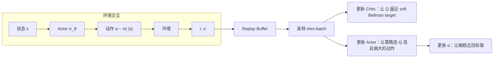

# 前置知识：SAC (Soft Actor-Critic)——最大熵 Off-Policy RL

> **一句话**：SAC 在标准 RL 目标上加了"最大熵"正则，让策略在获得高奖励的同时尽量保持随机性——既能高效利用数据（off-policy），又不会过早收敛到单一行为。

**知识链接**：
- [Q 函数与 Value 函数](/前置知识/000o_前置知识_Q函数与Value函数) — Q 值的定义和 Bellman 方程
- [DDPG（确定性策略梯度）](/前置知识/000p_前置知识_DDPG_确定性策略梯度) — SAC 的前身
- [TD3（Twin Delayed DDPG）](/前置知识/000q_前置知识_TD3) — 双 Q 取 min 的来源
- [Replay Buffer（经验回放）](/前置知识/000r_前置知识_Replay_Buffer_经验回放) — Off-Policy 的数据复用核心
- [策略梯度与 PPO](/前置知识/000a_前置知识_策略梯度与PPO) — On-Policy 路线的对比
- [连续动作与离散动作的梯度回传](/前置知识/001r_前置知识_连续动作与离散动作的梯度回传) — 重参数化 trick 的详细推导

---

## 贯穿全文的例子

> 一个 7 自由度机械臂学习抓取方块并放到目标位置。
> - **状态** $s \in \mathbb{R}^{20}$：关节角/速度 + 方块位姿
> - **动作** $a \in \mathbb{R}^7$：关节力矩，每维 $[-1, 1]$
> - **奖励**：离方块越近越好，抓住 +10，放到位 +20

---

## 一、SAC 整体在做什么（先看全貌）

### 1.1 一句话总结

SAC 的全部设计可以浓缩为一个公式：

$$
\pi^* = \arg\max_\pi \;\mathbb{E}\left[\sum_t \gamma^t\Big(r_t + \alpha\mathcal{H}(\pi(\cdot|s_t))\Big)\right]
$$

> 一句话直觉：找一个策略，让"累积奖励 + 累积随机性"之和最大。

这就是 SAC 和标准 RL 的**唯一根本区别**——目标函数里多了一项熵 $\mathcal{H}$。SAC 所有后续的设计（双 Q 网络、重参数化、自动 $\alpha$）都是**为了高效求解这个目标**的工程手段。

### 1.2 SAC 的设计框架：三个问题 → 三个组件

为了最大化"奖励 + 熵"，SAC 需要解决三个问题，对应三个组件：

| 问题 | 组件 | 做什么 |
|------|------|--------|
| ① 怎么评估"当前策略在某状态做某动作的总价值"？ | **Critic**（双 Q 网络） | 估计 soft Q 值 |
| ② 怎么改进策略，让它选更好的动作同时保持随机性？ | **Actor**（高斯策略） | 最大化 $Q - \alpha\log\pi$ |
| ③ 怎么平衡"奖励"和"探索"的权重？ | **自动温度 $\alpha$** | 让熵自动趋近目标值 |

训练时三者交替更新：Critic 先学会打分 → Actor 根据 Critic 的分数改进 → $\alpha$ 根据 Actor 的随机程度自动调节。

### 1.3 一轮训练的数据流



下面逐个组件详细展开。

---

## 二、为什么要最大化熵？（设计动机）

### 2.1 标准 RL 的问题

标准 RL 只最大化奖励 $\sum \gamma^t r_t$。一旦策略发现某种"还行"的行为模式，就会快速坍缩——变成确定性地重复那个模式，不再探索。

**在我们的例子中**：机械臂发现"从上方直压"能抓到方块 → 策略收敛到这一种姿态 → 方块位置稍变就失败了。

### 2.2 加熵后解决了什么

在目标中加入策略熵 $\mathcal{H}(\pi) = -\mathbb{E}[\log\pi(a|s)]$（衡量策略的"随机程度"），效果是：

1. **不会过早收敛**：即使找到一种好的行为，熵项也在"拉着"策略保持多样性
2. **多模态行为**：如果左绕和右绕都能到达目标，最大熵策略会同时保持两种模式
3. **自适应探索**：在"各方向差不多好"的状态保持大随机性；在"只有一种好动作"的状态自然收窄

### 2.3 温度 $\alpha$ 的角色

$\alpha$ 控制"奖励"和"熵"的相对权重：
- $\alpha$ 大 → 更看重随机性 → 策略更像"到处乱试"
- $\alpha$ 小 → 更看重奖励 → 策略更像确定性最优
- $\alpha = 0$ → 退化为标准 RL（没有熵项）

---

## 三、组件 ①：Critic——Soft Q 值估计

### 3.1 Soft Bellman 方程

因为目标函数变成了"奖励 + 熵"，Q 值的递归定义也要加入熵项：

$$
Q(s, a) = r + \gamma \,\mathbb{E}_{s'}\Big[\mathbb{E}_{a' \sim \pi}\big[Q(s', a') - \alpha\log\pi(a'|s')\big]\Big]
$$

**为什么需要这个公式**：Critic 需要一个"标准答案"来训练自己。Soft Bellman 方程就是这个标准——它说"当前 Q = 即时奖励 + 折扣后的（未来 Q + 未来熵奖励）"。

> 一句话直觉：评价"在 $s$ 做 $a$ 有多好"时，不仅算它带来多少奖励，还算它把你送到的下一个状态"有多自由"。

**逐项拆解**：
- $r$：做动作 $a$ 获得的即时奖励
- $Q(s', a')$：下一步的任务价值
- $-\alpha\log\pi(a'|s')$：下一步的"探索价值"——动作越不可能（$\log\pi$ 越负），这一项越大，说明策略在那个状态越随机，越好
- $\gamma$：折扣因子，让远期价值逐渐衰减

**代入数字**：
- 当前：$s =$ 手在方块上方 5cm，$a =$ 向下运动
- $r = -0.05$（距离惩罚）
- 下一状态 $s' =$ 手在方块上方 2cm
- 当前策略在 $s'$ 采样了 $a'$：$Q(s', a') = 15.0$，$\log\pi(a'|s') = -2.5$
- $Q(s, a) = -0.05 + 0.99 \times (15.0 - 0.2 \times (-2.5)) = -0.05 + 0.99 \times 15.5 = 15.3$

### 3.2 Critic 的训练 Loss

实际训练时，用两个 Q 网络（防过估计，借鉴自 [TD3](/前置知识/000q_前置知识_TD3)），loss 为：

$$
L_Q(\phi_i) = \mathbb{E}_{(s,a,r,s') \sim \mathcal{B}}\Big[\big(Q_{\phi_i}(s,a) - y\big)^2\Big]
$$

$$
y = r + \gamma\Big(\min(Q_{\bar\phi_1}(s', \tilde{a}'), Q_{\bar\phi_2}(s', \tilde{a}')) - \alpha\log\pi_\theta(\tilde{a}'|s')\Big), \quad \tilde{a}' \sim \pi_\theta(\cdot|s')
$$

**逐项拆解**：
- $(s,a,r,s') \sim \mathcal{B}$：从 [Replay Buffer](/前置知识/000r_前置知识_Replay_Buffer_经验回放) 随机抽样。$a$ 是旧策略采的没关系——Critic 学的是整个 $(s,a)$ 空间的函数
- $\tilde{a}' \sim \pi_\theta(\cdot|s')$：用**当前策略**在 $s'$ 重新采样。这保证了 target 评估的是当前策略的价值
- $\min(Q_{\bar\phi_1}, Q_{\bar\phi_2})$：双 Q 取 min，防止过估计
- $Q_{\bar\phi}$（带横线）：Target 网络——Critic 的慢更新副本，通过 EMA 追踪：$\bar\phi \leftarrow 0.995\bar\phi + 0.005\phi$

**关键点：为什么 Buffer 里的旧 $a$ 不影响正确性？**

Critic 学的是"在状态 $s$ 做动作 $a$ 值多少"这个**函数**。旧策略采的 $(s, a)$ 就是这个函数的一个采样点——不管是谁选的这个点，它对应的真实 Q 值是客观存在的。Buffer 只是提供了各种各样的 $(s, a)$ 采样点让 Critic 拟合，**不要求它们来自当前策略**。

---

## 四、组件 ②：Actor——高斯策略与重参数化更新

### 4.1 策略的参数化

SAC 的 Actor 输出一个对角高斯分布的参数：

$$
\pi_\theta(a|s)：\quad \text{网络}(s) \to (\mu, \log\sigma) \quad \Rightarrow \quad u \sim \mathcal{N}(\mu, \sigma^2 I) \quad \Rightarrow \quad a = \tanh(u)
$$

- **为什么高斯**：连续空间最自然的分布，只需均值和方差两组参数
- **为什么 $\tanh$**：把无界的高斯输出压到 $(-1, 1)$，匹配物理动作范围
- **为什么输出 $\log\sigma$ 而不是 $\sigma$**：$\log\sigma \in (-\infty, +\infty)$ 比 $\sigma > 0$ 更方便优化

### 4.2 Actor 的优化目标

Actor 需要回答一个问题：**给定 Critic 的评分函数 $Q(s,a)$，策略应该怎么调整才能让"动作价值高 + 保持随机性"？**

这通过最小化以下 loss 来实现：

$$
L_\pi(\theta) = \mathbb{E}_{s \sim \mathcal{B}}\Big[\alpha\log\pi_\theta(a|s) - \min\big(Q_{\phi_1}(s, a),\; Q_{\phi_2}(s, a)\big)\Big], \quad a = f_\theta(s, \epsilon)
$$

**为什么需要这个公式**：Critic 已经学会了给任意 $(s, a)$ 打分。现在 Actor 需要一个优化目标，告诉它"该把策略往哪个方向调"。这个 loss 就是答案——它同时编码了两个需求："选 Q 值高的动作"和"不要太确定"。

> 一句话直觉：Actor 在 Critic 画出的"好坏地图"上，把概率质量朝高分区域挪，但不能全堆在一个点上——熵项像弹簧一样把概率质量往"分散"的方向拉。

**逐项拆解**：

这个 loss 有两项，分别在"拉"策略往不同方向走：

**第一项 $\alpha\log\pi_\theta(a|s)$——"分散力"（熵惩罚）**：
- $\pi_\theta(a|s)$ 是策略在状态 $s$ 下输出动作 $a$ 的概率密度
- $\log\pi$ 越大 → 说明策略把概率集中在 $a$ 附近（很确定）→ loss 增大 → 梯度下降会**减小** $\log\pi$ → 策略被迫变得更分散
- $\alpha$ 是这股"分散力"的强度系数
- 物理直觉：像一股把概率质量"推开"的排斥力

**第二项 $-\min(Q_{\phi_1}(s,a), Q_{\phi_2}(s,a))$——"集中力"（Q 值追踪）**：
- $Q_\phi(s, a)$ 是 Critic 对"在 $s$ 做 $a$ 的长期价值"的评估
- 取 min 是为了防过估计（来自 [TD3](/前置知识/000q_前置知识_TD3) 的双 Q 技巧）
- 负号：$Q$ 越大越好，但 loss 要最小化，所以取负 → 最小化 $-Q$ = 最大化 $Q$
- 梯度下降会推动 Actor 输出使 $Q$ 更大的动作 → 策略的概率质量被**拉向高 Q 区域**
- 物理直觉：像一股把概率质量"吸引"到高分区域的引力

**两项博弈的平衡**：
- $-Q$ 项想把概率全集中到 $\arg\max_a Q(s,a)$ 一个点上
- $\alpha\log\pi$ 项想把概率尽量摊平
- 平衡结果：概率集中在高 Q 区域，但以有限宽度的分布形式存在（不是 delta 函数）

**$\mathbb{E}_{s \sim \mathcal{B}}$ 的含义**：
- 对状态 $s$ 求期望，$s$ 从 Replay Buffer 均匀采样
- 实际训练中用 mini-batch（256 个 $s$）近似这个期望

**$a = f_\theta(s, \epsilon)$ 的含义**：
- 动作不是从 Buffer 里取的旧动作，而是当前策略**重新采样**的
- $f_\theta(s, \epsilon) = \tanh(\mu_\theta(s) + \sigma_\theta(s) \odot \epsilon)$，$\epsilon \sim \mathcal{N}(0, I)$
- 用重参数化写法，让 $a$ 关于 $\theta$ 可微，梯度能从 $Q(s,a)$ 传回 $\theta$

**代入数字**（1 维简化，动作范围 $[-1,1]$）：

状态 $s$：手在方块正上方。假设 $\alpha = 0.2$。

当前策略在 $s$ 输出 $\mathcal{N}(\mu=0.6, \sigma=0.15)$（大概率输出 ~0.6 附近的力矩）。
采样 $\epsilon = 0.5$ → $u = 0.6 + 0.15 \times 0.5 = 0.675$ → $a = \tanh(0.675) = 0.589$

- $\log\pi(a|s)$：高斯 log-prob + tanh 修正 ≈ $-1.2$
- $Q_{\phi_1}(s, a) = 12.5$，$Q_{\phi_2}(s, a) = 11.8$ → $\min = 11.8$
- $L_\pi = 0.2 \times (-1.2) - 11.8 = -0.24 - 11.8 = -12.04$

如果策略改为输出更靠近 $a=0.8$（Q 更高的区域，$Q(s, 0.8) = 14.0$），且 $\sigma$ 不变：
- $\log\pi$ 变化不大（$\sigma$ 没变）
- $\min Q$ 变大 → $-\min Q$ 更负 → **loss 更小** → 梯度下降方向正确

如果策略不移动均值，而是缩小 $\sigma$ 到 0.01：
- $\log\pi$ 变大（更集中 → 概率密度更高）→ $\alpha\log\pi$ 增大 → loss 增大 → **被惩罚**
- 虽然集中在高 Q 点让 $-Q$ 稍变小，但 $\alpha\log\pi$ 的增加更大 → 净效果是 loss 增大

这就是熵项阻止策略坍缩的机制。

**为什么是这个形式**：
- 为什么用 $\log\pi$ 而不是直接用 $-\mathcal{H}$？因为 $\mathcal{H} = -\mathbb{E}[\log\pi]$，展开后每个样本的贡献就是 $\log\pi(a|s)$，直接可以用采样估计，不需要解析计算整个分布的熵。
- 为什么 $Q$ 用两个网络的 min？防止 Actor "作弊"——如果只用一个 Q 网络，Actor 可能找到让该 Q 网络高估的动作（而不是真正好的动作）。
- 为什么 $\alpha = 0$ 时退化为 DDPG？去掉 $\alpha\log\pi$ 项，loss = $-Q(s, a)$，最小化它就是最大化 Q——和 DDPG 的 Actor 更新完全一样。

### 4.3 重参数化：让梯度能穿过采样操作

"从分布中采样"不可微——梯度无法穿过随机节点。重参数化把采样改写为：

$$
a = f_\theta(s, \epsilon) = \tanh\big(\mu_\theta(s) + \sigma_\theta(s) \odot \epsilon\big), \quad \epsilon \sim \mathcal{N}(0, I)
$$

随机性全在 $\epsilon$ 中（与 $\theta$ 无关），$a$ 关于 $\theta$ 变成了确定性函数 → 链式法则可用 → 梯度从 $Q(s, a)$ 流回 $\theta$。

详细的推导和与离散动作 Score Function 梯度的对比，参见 [连续动作与离散动作的梯度回传](/前置知识/001r_前置知识_连续动作与离散动作的梯度回传)。

### 4.4 tanh 的 log-prob 修正

由于 $a = \tanh(u)$ 是非线性变换，概率密度需要 Jacobian 修正：

$$
\log\pi(a|s) = \log\mathcal{N}(u;\mu,\sigma^2) - \sum_{i=1}^d \log(1 - \tanh^2(u_i))
$$

这个修正在计算 Actor loss 和 Critic target 中的 $\log\pi$ 时都必须加。直觉：$\tanh$ 在边界附近"堆积"了概率密度，必须补偿这个效应。

---

## 五、组件 ③：自动温度 $\alpha$ 调节

### 5.1 为什么需要自动调

$\alpha$ 手动设很难：不同任务奖励量级不同、训练不同阶段最优 $\alpha$ 也不同。

### 5.2 核心思路：约束优化

把最大熵 RL 改写为带约束的问题：

$$
\max_\pi \;\mathbb{E}\left[\sum_t \gamma^t r_t\right] \quad \text{s.t.} \quad \mathbb{E}[-\log\pi(a|s_t)] \geq \bar{\mathcal{H}}, \;\forall t
$$

> 一句话直觉：不是"让策略尽量随机"，而是"保证策略的随机性不低于一个下限 $\bar{\mathcal{H}}$，在此约束下最大化奖励"。

$\alpha$ 变成了这个约束的 Lagrange 乘子。当策略熵低于目标 → $\alpha$ 自动增大（加强探索）；高于目标 → $\alpha$ 自动减小（更专注奖励）。

### 5.3 更新公式

$$
L(\alpha) = -\alpha\,\mathbb{E}_{a \sim \pi}\big[\log\pi(a|s) + \bar{\mathcal{H}}\big]
$$

- $\bar{\mathcal{H}} = -\dim(\mathcal{A})$：目标熵，经验值。对我们的 7 维动作空间，$\bar{\mathcal{H}} = -7$
- 当前熵低于目标（$-\mathbb{E}[\log\pi] < 7$）→ $\alpha$ 增大
- 当前熵高于目标 → $\alpha$ 减小

这是 SAC 中唯一需要手动设的与熵相关的超参数——而且 $-\dim(\mathcal{A})$ 对大多数任务都足够好。

---

## 六、合在一起：完整训练循环

现在把三个组件组装回来。每一步训练做以下事情：

```
从 Buffer 采 mini-batch (s, a, r, s', done)

1. 更新 Critic（让 Q 估计更准）
   ├── 用当前策略在 s' 采样 ã' = f_θ(s', ε')
   ├── 算 target: y = r + γ(1-done) · [min(Q̄₁(s',ã'), Q̄₂(s',ã')) - α·logπ(ã'|s')]
   └── 最小化 (Q_φᵢ(s,a) - y)²

2. 更新 Actor（让策略更好）
   ├── 用当前策略在 s 采样 ã = f_θ(s, ε)
   └── 最小化 α·logπ(ã|s) - min(Q_φ₁(s,ã), Q_φ₂(s,ã))

3. 更新 α（调节探索力度）
   └── 最小化 -α · (logπ(ã|s) + H̄)

4. 软更新 Target 网络
   └── Q̄ ← 0.995·Q̄ + 0.005·Q
```

**更新顺序的逻辑**：Critic 先更新 → 它的打分变准了 → Actor 才能根据准确的分数改进 → Actor 改进后熵变了 → α 相应调整。

---

## 七、Off-Policy 的关键理解：为什么可以用 Replay Buffer 里的旧策略数据

这是初学 SAC 最常见的疑惑：Buffer 里的 $(s, a, r, s')$ 中的 $a$ 是旧策略 $\pi_{\text{old}}$ 采的，当前策略 $\pi_\theta$ 在同一个 $s$ 可能选完全不同的 $a$。这些"过期数据"凭什么还能拿来训练当前策略？

### 7.1 根本原因：SAC 要学的是 Q 函数，不是策略梯度

对比 PPO（on-policy）和 SAC（off-policy）的核心区别：

**PPO 为什么必须用当前策略的数据**：PPO 直接估计策略梯度 $\nabla_\theta J(\pi_\theta)$。这个梯度的计算依赖"当前策略访问各状态的概率分布"——如果用旧策略的数据，等于在错误的状态分布上算梯度，方向就是错的。

**SAC 为什么可以用任何数据**：SAC 的核心中间产物是 $Q(s, a)$ 函数——它是一个关于 **$(s, a)$ 二元输入**的标量函数，定义为"在状态 $s$ 执行动作 $a$ 后，按照当前策略继续走，能获得的总价值"。这个函数的定义**和数据来源无关**——$Q(s, a)$ 对任意 $(s, a)$ 对都有一个客观的值，不管这个 $(s, a)$ 是谁采集的。

类比：你要拟合一个二元函数 $f(x, y)$ 的曲面。训练数据 $(x_i, y_i, f_i)$ 不管是什么"策略"（什么顺序、什么分布）采集的，只要这些点确实落在真实曲面上，它们对拟合都有帮助。

### 7.2 逐组件分析：每个组件用了旧数据的哪些部分

| | Critic 更新 | Actor 更新 | α 更新 |
|--|------------|-----------|--------|
| 用了 Buffer 里的什么 | $s, a, r, s'$（全部） | 只用 $s$ | 只用 $s$ |
| 动作来源 | 旧 $a$：作为 $Q_\phi(s, a)$ 的输入 | 新 $\tilde{a} \sim \pi_\theta(\cdot\|s)$ | 新 $\tilde{a} \sim \pi_\theta(\cdot\|s)$ |
| 为什么旧数据合理 | 见下方详解 | Buffer 只提供"在哪些状态上优化"，动作是新采的 | 同 Actor |

**Critic 为什么能用旧 $(s, a)$**：

Critic 的 loss 是 $(Q_\phi(s, a) - y)^2$。这就是一个回归问题：已知一些 $(s, a)$ 点处的"标签" $y$，让 Q 网络拟合这些点。

关键洞察：**$y$ 的计算不依赖 Buffer 里的旧 $a$**。$y = r + \gamma(\min Q_{\bar\phi}(s', \tilde{a}') - \alpha\log\pi(\tilde{a}'|s'))$ 中，$\tilde{a}'$ 是当前策略在 $s'$ **重新采样**的。所以 target $y$ 反映的是**当前策略**的价值，不是旧策略的。

Buffer 里的旧 $a$ 只决定了"在 Q 曲面的哪个 $(s, a)$ 点上做回归"——这相当于"选了一些采样点来拟合函数"，采样点是谁选的不影响函数本身的正确性。唯一的代价是：如果旧策略从不访问某些 $(s, a)$ 区域，Critic 在那些区域的估计可能不准——但这不影响正确性，只影响效率。

**Actor 为什么能在旧状态 $s$ 上更新**：

Actor loss 是 $\mathbb{E}_{s \sim \mathcal{B}}[\alpha\log\pi(a|s) - Q(s, a)]$，其中 $a$ 是**当前策略新采的**。

Buffer 里的状态 $s$ 只是告诉 Actor "在哪些状态上练习"。这相当于给 Actor 一个"练习题集"——题目的来源不影响学习效果，只要这些题目覆盖了足够多的状态就行。

严格来说，用旧策略的状态分布（而不是当前策略的状态分布）来更新 Actor，会引入一个状态分布偏移（distribution shift）。但实际中，因为 Replay Buffer 很大且持续有新数据加入，状态分布的偏移不大，不会影响收敛。

### 7.3 与 On-Policy 方法的本质对比

| | On-Policy (PPO) | Off-Policy (SAC) |
|--|----------------|-----------------|
| 优化什么 | 直接优化 $J(\pi_\theta) = \mathbb{E}_{\tau \sim \pi_\theta}[R(\tau)]$ | 间接优化：先学 $Q$，再用 $Q$ 改进 $\pi$ |
| 梯度估计需要什么数据 | 当前策略 $\pi_\theta$ 采的完整轨迹（因为梯度公式中有 $\pi_\theta$ 的对数概率） | 任意 $(s,a,r,s')$ 点（因为只做函数拟合） |
| 数据过期怎么办 | 必须扔掉重采 | 不存在"过期"——旧数据是 Q 曲面上的有效观测点 |
| 代价 | 样本效率低（数据用一次就扔） | 需要额外维护 Critic（多训一组网络） |

**总结**：SAC 能用 Replay Buffer 的根本原因是——它把"优化策略"拆成了两步：(1) 用任意数据拟合 Q 函数（回归问题，不挑数据来源），(2) 在 Q 函数这张"固定地图"上找最优策略（优化问题，只需要知道当前地图的形状）。这个两步拆解让数据采集和策略优化**解耦**——采数据的策略和正在被优化的策略可以是不同的。

---

## 八、SAC 与其他算法的关系

### 8.1 演化线路

$$
\text{DDPG} \xrightarrow{\text{双Q+延迟更新}} \text{TD3} \xrightarrow{\text{随机策略+最大熵}} \text{SAC}
$$

| 从 TD3 继承的 | SAC 新增的 |
|-------------|-----------|
| 双 Q 网络取 min | 随机高斯策略（取代确定性策略） |
| Target 网络 EMA 软更新 | 最大熵目标（取代外加噪声探索） |
| Replay Buffer | tanh squashing + log-prob 修正 |
| | 自动温度 $\alpha$ 调节 |

### 8.2 SAC vs PPO 的选择

| 场景 | 选 SAC | 选 [PPO](/前置知识/000a_前置知识_策略梯度与PPO) |
|------|--------|------|
| 真实机器人 / 交互昂贵 | ✅ 样本效率高 | ❌ 太浪费 |
| 小网络（< 10M 参数） | ✅ 直接适用 | 过杀 |
| 大规模并行仿真（Isaac Gym） | 不太适合 | ✅ 天然并行 |
| 大模型 RL 微调（VLA/LLM） | 不太适合 | ✅ |
| 离散动作空间 | ❌ 原生不支持 | ✅ |
| 连续动作 + 需要多模态行为 | ✅ 熵项保持多模态 | 可能坍缩 |

---

## 九、常见超参数

| 超参数 | 典型值 | 说明 |
|--------|--------|------|
| 学习率 | 3e-4 | Actor/Critic/α 通常相同 |
| $\gamma$ | 0.99 | 折扣因子 |
| $\tau$ | 0.005 | Target 网络软更新速率 |
| Buffer 大小 | 1M | |
| Batch size | 256 | |
| 目标熵 $\bar{\mathcal{H}}$ | $-\dim(\mathcal{A})$ | 唯一的熵相关超参 |
| 隐藏层 | 256×2 MLP + ReLU | Actor 和 Critic |
| 初始随机步数 | 5K-10K | 开始训练前纯随机探索 |

---

## 十、总结：SAC 做了什么

回到最开始的全貌：

1. **设计动机**：让策略在学习最优行为的同时保持随机性（最大熵），避免过早坍缩、保留探索能力
2. **为此设计了三个组件**：
   - Critic（双 Q 网络）：学习 soft Q 值——"在某状态做某动作的长期价值（含熵）"
   - Actor（高斯策略）：最大化 "Q 值 − α·log概率"——既追求好动作又保持随机
   - 自动 $\alpha$：保证策略熵始终在合理范围内
3. **数据利用**：Off-policy，所有历史数据存在 Buffer 中反复使用，样本效率远高于 PPO
4. **适用场景**：连续动作空间 + 中小型网络 + 环境交互昂贵

---

## 延伸阅读

- [Q 函数与 Value 函数](/前置知识/000o_前置知识_Q函数与Value函数) — Bellman 方程的完整讲解
- [DDPG](/前置知识/000p_前置知识_DDPG_确定性策略梯度) / [TD3](/前置知识/000q_前置知识_TD3) — SAC 的前身，理解演化脉络
- [Replay Buffer](/前置知识/000r_前置知识_Replay_Buffer_经验回放) — Off-Policy 数据复用的细节
- [策略梯度与 PPO](/前置知识/000a_前置知识_策略梯度与PPO) — On-Policy 路线的完整对比
- [KL 散度与策略约束](/前置知识/000j_前置知识_KL散度与策略约束) — 最大熵和 KL 约束的数学联系

**原始论文**：
- Haarnoja et al., "Soft Actor-Critic: Off-Policy Maximum Entropy Deep RL with a Stochastic Actor" (ICML 2018)
- Haarnoja et al., "Soft Actor-Critic Algorithms and Applications" (2018) — v2，引入自动 α
