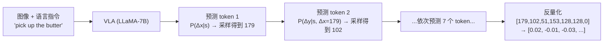

# 前置知识：动作 Token 化与自回归策略（VLA 如何把机器人动作变成"说话"）

> **为什么要读这篇**：VLA-RL、SimpleVLA-RL、TGRPO 等所有自回归 VLA 的 RL 后训练方法都依赖于"把动作变成离散 token，像 LLM 预测下一个词一样预测下一个动作 token"。不理解这个过程，就看不懂为什么 PPO 可以直接用在 VLA 上、为什么 $\log\pi(a|s)$ 可以直接算、动作精度为什么受限于 bin 数量。
> **涉及概念**：
> - 动作离散化 / 量化 (Action Discretization / Quantization)
> - 自回归模型 (Autoregressive Model)
> - Next-Token Prediction
> - Action Chunk（动作块）

**标签**: `#前置知识` `#动作Token化` `#自回归` `#VLA` `#量化` `#OpenVLA`

---

## 贯穿全文的例子

> 一个 6-DoF 桌面机械臂 + 平行夹爪，动作空间为 7 维连续向量：
> $$a = [\Delta x, \Delta y, \Delta z, \Delta r_x, \Delta r_y, \Delta r_z, g] \in \mathbb{R}^7$$
> - $(\Delta x, \Delta y, \Delta z)$：末端位置增量，范围 $[-0.05, 0.05]$ 米
> - $(\Delta r_x, \Delta r_y, \Delta r_z)$：旋转增量，范围 $[-0.25, 0.25]$ 弧度
> - $g$：夹爪开合，范围 $[0, 1]$（0=关, 1=开）
>
> 当前时刻需要输出的动作：$a = [0.02, -0.01, -0.03, 0.05, 0.0, 0.0, 0.0]$
> （向右 2cm、向后 1cm、向下 3cm、绕 x 轴转 0.05 弧度、夹爪关闭）

---

## 一、问题：LLM 只能输出离散 token，机器人需要连续动作

### 1.1 LLM 的输出方式


大语言模型（GPT、LLaMA 等）的核心操作是 **next-token prediction**：

1. 输入一个 token 序列 $[t_1, t_2, \ldots, t_n]$
2. 模型输出一个概率分布 $P(t_{n+1} | t_1, \ldots, t_n)$，覆盖词表中所有 token
3. 从分布中采样一个 token $t_{n+1}$
4. 把 $t_{n+1}$ 拼到序列后面，重复

词表大小通常是 32,000~128,000 个离散 token。每个 token 是一个整数 ID。

### 1.2 VLA 的难题

VLA（如 OpenVLA）底层就是一个 LLM（如 LLaMA-7B），但机器人动作是**连续的浮点数**，不是离散的词。

怎么把连续动作"喂"进 LLM 的框架？

答案：**动作 token 化**——把连续动作量化为离散整数，然后当作"特殊词汇"。

---

## 二、动作 Token 化：具体怎么做

### 2.1 均匀量化（Uniform Quantization）

最简单的方法：把每个动作维度的取值范围均匀切成 $B$ 个 bin（通常 $B=256$）。

**Step 1: 归一化到 [0, 1]**

$$
\hat{a}_i = \frac{a_i - a_i^{\min}}{a_i^{\max} - a_i^{\min}}
$$

**Step 2: 量化到整数 [0, B-1]**

$$
\text{token}_i = \text{round}(\hat{a}_i \times (B - 1))
$$

**在我们的例子中**，对第一维 $\Delta x = 0.02$，范围 $[-0.05, 0.05]$：

$$
\hat{a}_1 = \frac{0.02 - (-0.05)}{0.05 - (-0.05)} = \frac{0.07}{0.10} = 0.7
$$

$$
\text{token}_1 = \text{round}(0.7 \times 255) = \text{round}(178.5) = 179
$$

对所有 7 维重复这个过程：

| 维度 | 原始值 | 范围 | 归一化 | Token |
|------|--------|------|--------|-------|
| $\Delta x$ | 0.02 | [-0.05, 0.05] | 0.70 | 179 |
| $\Delta y$ | -0.01 | [-0.05, 0.05] | 0.40 | 102 |
| $\Delta z$ | -0.03 | [-0.05, 0.05] | 0.20 | 51 |
| $\Delta r_x$ | 0.05 | [-0.25, 0.25] | 0.60 | 153 |
| $\Delta r_y$ | 0.0 | [-0.25, 0.25] | 0.50 | 128 |
| $\Delta r_z$ | 0.0 | [-0.25, 0.25] | 0.50 | 128 |
| $g$ | 0.0 | [0, 1] | 0.00 | 0 |

最终动作表示为 7 个 token：**[179, 102, 51, 153, 128, 128, 0]**

### 2.2 解码：token 还原为连续动作

推理时需要反向操作——把模型输出的 token 还原为连续值：

$$
a_i = \frac{\text{token}_i}{B - 1} \times (a_i^{\max} - a_i^{\min}) + a_i^{\min}
$$

对 token = 179：

$$
a_1 = \frac{179}{255} \times (0.05 - (-0.05)) + (-0.05) = 0.702 \times 0.1 - 0.05 = 0.0202
$$

原始值是 0.02，还原后是 0.0202。量化误差 = 0.0002 米 = 0.2mm。

### 2.3 量化精度分析

每个维度的量化分辨率：

$$
\text{resolution}_i = \frac{a_i^{\max} - a_i^{\min}}{B - 1}
$$

| 维度 | 范围 | 256 bins 分辨率 | 意味着 |
|------|------|----------------|--------|
| 位置 | 0.1m | 0.39mm | 对粗操作够用 |
| 旋转 | 0.5rad | 1.96mrad ≈ 0.11° | 通常够用 |
| 夹爪 | 1.0 | 0.004 | 足够精细 |


**什么时候 256 bins 不够？**
- 精密装配（USB 插拔）：需要 0.1mm 精度，但 256 bins 只能给 0.39mm → 不够！
- 需要 1024+ bins 或改用连续动作头

---

## 三、自回归生成：像说话一样逐个输出动作 token

### 3.1 自回归模型的定义

自回归（Autoregressive）的意思是：**第 $i$ 个输出依赖于前面所有输出**。

$$
P(a_1, a_2, \ldots, a_7 | s) = \prod_{i=1}^{7} P(a_i | s, a_1, a_2, \ldots, a_{i-1})
$$

**为什么需要这个公式**：这是自回归 VLA 的核心——它把联合概率 $P(\text{整个7维动作}|s)$ 分解为 7 个条件概率的乘积。每次只需要预测一个 token（256-way 分类），不需要一次性输出 7 维联合分布。

**逐项拆解**：
- $P(a_1 | s)$：给定观测 $s$，第 1 维动作 token 的概率（256-way softmax）
- $P(a_2 | s, a_1)$：已知第 1 维 token 后，预测第 2 维（256-way softmax）
- ...
- $P(a_7 | s, a_1, \ldots, a_6)$：已知前 6 维后，预测第 7 维

**类比**：就像人说话——"我"→"要"→"去"→"超市"，每个词的选择都考虑了前面已经说的内容。

### 3.2 在 VLA 中的具体生成过程



每一步的计算：
1. 把 [图像特征 + 语言 token + 已生成的动作 token] 拼接成一个序列
2. 通过 Transformer 做一次前向传播
3. 取最后一个位置的 logits（$\mathbb{R}^{256}$）
4. 过 softmax 得到概率分布
5. 从分布中采样一个 token

### 3.3 为什么自回归对 RL 后训练友好

这是关键——**自回归 VLA 有显式的 $\log\pi(a|s)$！**

$$
\log\pi_\theta(\mathbf{a}|s) = \sum_{i=1}^{7} \log P_\theta(a_i | s, a_{<i})
$$

每个 $\log P_\theta(a_i | s, a_{<i})$ 就是 softmax 后取对数，是**解析可算**的：

$$
\log P_\theta(a_i = v | s, a_{<i}) = \text{logits}_v - \log\sum_{k=0}^{255} e^{\text{logits}_k}
$$

**这意味着**：
- [PPO](/前置知识/000a_前置知识_策略梯度与PPO) 需要的 $\log\pi$ 可以直接算 ✅
- 概率比 $r_t = \frac{\pi_\theta(a|s)}{\pi_{\text{old}}(a|s)}$ 可以直接算 ✅
- [KL 散度](/前置知识/000j_前置知识_KL散度与策略约束) 可以直接算 ✅
- 不需要像 [扩散策略](/前置知识/000c_前置知识_Diffusion_Policy) 那样纠结"似然不可算"的问题 ✅

对比 Diffusion Policy：
- 扩散策略的 $\log\pi(\mathbf{a}|s)$ 需要对 $K$ 步去噪的所有中间路径积分 → **不可算**
- 自回归 VLA 的 $\log\pi$ 就是 7 个 softmax log-prob 之和 → **一行代码搞定**

```python
# 自回归 VLA 计算 log_pi 的伪代码
log_pi = 0
for i in range(7):
    logits = model.forward(state, action_tokens[:i])  # (256,)
    log_prob_i = logits[action_tokens[i]] - torch.logsumexp(logits, dim=0)
    log_pi += log_prob_i
```

### 3.4 自回归的代价：误差累积与速度


**问题 1：维度间误差累积**

如果第 1 维 token 采样错了（应该是 179 但采了 170），后面所有维度的条件概率都"条件在错误信息上"了。

- 正确链：$P(a_2|s, a_1=179)$ → 可能给出合理的 $a_2$
- 错误链：$P(a_2|s, a_1=170)$ → 模型认为"第一维说你要向右移得少"，可能调整后面的动作

这在实践中影响不大（只有 7 个 token，链很短），但如果动作维度很高（如 30 维灵巧手）就会成问题。

**问题 2：推理速度**

生成 7 个 token 需要 7 次前向传播（严格来说，用 KV-cache 可以加速，但仍是 7 次 decoder pass）。

对比：
- 自回归 VLA：7 次前向传播 / 每步动作
- 连续动作头（如 Flow Matching）：1 次 VLA 前向 + 4~8 步 ODE 求解
- 实际延迟类似（都在 50-200ms 量级）

---

## 四、Action Chunk：一次预测多步

### 4.1 动机

控制频率通常 5-10Hz，但 LLM 推理可能需要 100-200ms/步。如果每步都要等模型推理完才能执行下一步，延迟太大。

解决方案：**一次性预测未来 $H$ 步动作**（Action Chunk），然后按顺序执行，期间不需要再推理。

### 4.2 Token 化的 Action Chunk

假设 chunk size $H = 4$（一次预测 4 步，每步 7 维）：

$$
\text{总 token 数} = H \times d = 4 \times 7 = 28 \text{ 个 token}
$$

自回归生成 28 个 token：

$$
P(\mathbf{a}_{1:4} | s) = \prod_{t=1}^{4}\prod_{i=1}^{7} P(a_t^{(i)} | s, a_{<t}, a_t^{(<i)})
$$

**代价**：28 次前向传播（或用 parallel decoding 加速到 ~7 次）

**好处**：
- 推理频率从 "7 tokens × 10Hz = 70 tokens/s" 变成 "28 tokens / 4步 = 2.5Hz 推理但仍 10Hz 执行"
- 动作更平滑（chunk 内部是一次性规划的，不存在逐步决策的抖动）
- 更容易分配 reward（一个 chunk 整体对应一个 reward）

### 4.3 对 RL 的影响

Action Chunk 对 RL 训练有重要影响：

- **Advantage 分配**：reward 是整条轨迹的，但 PPO 需要给每个 token 一个 advantage。28 个 token 共享一个 chunk 的 reward，怎么分配？
  - 方法 1：整个 chunk 的所有 token 共享同一个 advantage
  - 方法 2：用 GAE 在 chunk 之间做 TD，chunk 内部均匀分配
- **探索粒度**：chunk 内部的 token 相互依赖，修改一个可能让整个 chunk 不协调
- **KL 约束**：28 个 token 的联合 KL 比 7 个 token 大得多，需要调整 $\beta$

---

## 五、总结：自回归 VLA 的优劣

| 特性 | 自回归 VLA（动作 token 化） | 连续动作头（Diffusion/Flow） |
|------|---------------------------|---------------------------|
| $\log\pi$ 可算 | ✅ 直接算 softmax log-prob | ❌ 需要近似 |
| PPO 可直接用 | ✅ | ❌ 需要特殊处理 |
| 动作精度 | 受限（$\frac{\text{range}}{B}$） | 浮点精度 |
| 多模态分布 | 受限（逐维 argmax 倾向单模态） | ✅ 天然支持 |
| 推理速度 | 较慢（$d$ 次前向） | 较慢（$K$ 步去噪） |
| 架构改动 | 无（复用 LLM） | 需额外模块 |

**核心 takeaway**：动作 token 化是"让 VLA 能直接复用 LLM 所有基础设施（包括 RLHF/PPO 训练流程）"的桥梁。代价是精度损失和多模态表达能力下降。

---

## 延伸阅读

- [视觉-语言-动作模型 VLA 综述](/论文综述/S03_视觉语言动作模型VLA综述) — 动作 token 化 vs 连续动作头的完整对比
- [VLA 模型的 RL 后训练综述](/论文综述/S06_VLA模型的RL后训练综述) — 基于动作 token 的 RL 方法
- [策略梯度与 PPO](/前置知识/000a_前置知识_策略梯度与PPO) — PPO 需要 $\log\pi$ 的原因
- [Diffusion Policy](/前置知识/000c_前置知识_Diffusion_Policy) — 连续动作的替代方案
