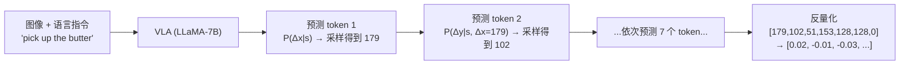

# 前置知识：动作 Token 化与自回归策略（VLA 如何把机器人动作变成"说话"）

> **为什么要读这篇**：VLA-RL、SimpleVLA-RL、TGRPO 等所有自回归 VLA 的 RL 后训练方法都依赖于"把动作变成离散 token，像 LLM 预测下一个词一样预测下一个动作 token"。不理解这个过程，就看不懂为什么 PPO 可以直接用在 VLA 上、为什么 $\log\pi(a|s)$ 可以直接算、动作精度为什么受限于 bin 数量。
> **涉及概念**：
> - 动作离散化 / 量化 (Action Discretization / Quantization)
> - 自回归模型 (Autoregressive Model)
> - Next-Token Prediction
> - Action Chunk（动作块）

**标签**: `#前置知识` `#动作Token化` `#自回归` `#VLA` `#量化` `#OpenVLA`

---

## 贯穿全文的例子

> 一个 6-DoF 桌面机械臂 + 平行夹爪，动作空间为 7 维连续向量：
> $$a = [\Delta x, \Delta y, \Delta z, \Delta r_x, \Delta r_y, \Delta r_z, g] \in \mathbb{R}^7$$
> - $(\Delta x, \Delta y, \Delta z)$：末端位置增量，范围 $[-0.05, 0.05]$ 米
> - $(\Delta r_x, \Delta r_y, \Delta r_z)$：旋转增量，范围 $[-0.25, 0.25]$ 弧度
> - $g$：夹爪开合，范围 $[0, 1]$（0=关, 1=开）
>
> 当前时刻需要输出的动作：$a = [0.02, -0.01, -0.03, 0.05, 0.0, 0.0, 0.0]$
> （向右 2cm、向后 1cm、向下 3cm、绕 x 轴转 0.05 弧度、夹爪关闭）

---

## 一、问题：LLM 只能输出离散 token，机器人需要连续动作

### 1.1 LLM 的输出方式


大语言模型（GPT、LLaMA 等）的核心操作是 **next-token prediction**：

1. 输入一个 token 序列 $[t_1, t_2, \ldots, t_n]$
2. 模型输出一个概率分布 $P(t_{n+1} | t_1, \ldots, t_n)$，覆盖词表中所有 token
3. 从分布中采样一个 token $t_{n+1}$
4. 把 $t_{n+1}$ 拼到序列后面，重复

词表大小通常是 32,000~128,000 个离散 token。每个 token 是一个整数 ID。

### 1.2 VLA 的难题

VLA（如 OpenVLA）底层就是一个 LLM（如 LLaMA-7B），但机器人动作是**连续的浮点数**，不是离散的词。

怎么把连续动作"喂"进 LLM 的框架？

答案：**动作 token 化**——把连续动作量化为离散整数，然后当作"特殊词汇"。

---

## 二、动作 Token 化：具体怎么做

### 2.1 均匀量化（Uniform Quantization）

最简单的方法：把每个动作维度的取值范围均匀切成 $B$ 个 bin（通常 $B=256$）。

**Step 1: 归一化到 [0, 1]**

$$
\hat{a}_i = \frac{a_i - a_i^{\min}}{a_i^{\max} - a_i^{\min}}
$$

**这个公式在做什么**：把动作第 $i$ 维的原始值，按它自己的取值范围压缩成一个 0~1 之间的比例——"这个动作在它的可行范围里，处于百分之多少的位置"。

::: details 📐 公式详解（点击展开）

| 子表达式 | 它是谁 | 它在干嘛 |
|---------|--------|---------|
| $a_i$ | **原始动作值** | 第 $i$ 维的连续物理量，如"末端 x 方向移动了多少米" |
| $a_i^{\min}, a_i^{\max}$ | **量程上下限** | 这一维动作物理上允许的最小值和最大值，由机器人硬件/任务定义 |
| $a_i - a_i^{\min}$ | **相对起点的位移** | 当前值离下限还有多远 |
| $a_i^{\max} - a_i^{\min}$ | **总量程** | 这一维一共能变化多大的范围，当分母用来做比例归一化 |
| $\hat{a}_i$ | **百分比坐标** | 结果落在 $[0,1]$，之后可以统一乘以 bin 数变成整数 token |

**用人话读**："看看这个动作值在它允许范围里走到了百分之几的位置。"

**为什么是这个形式**：不同维度的物理量程差异很大（位置是米级、旋转是弧度级），先归一化到统一的 $[0,1]$，才能用同一套整数 bin 规则处理所有维度。

**代入数字**：对第一维 $\Delta x = 0.02$，范围 $[-0.05, 0.05]$：

$$
\hat{a}_1 = \frac{0.02 - (-0.05)}{0.05 - (-0.05)} = \frac{0.07}{0.10} = 0.7
$$

即当前位移在整个允许范围里处于 70% 的位置。
:::

**Step 2: 量化到整数 [0, B-1]**

$$
\text{token}_i = \text{round}(\hat{a}_i \times (B - 1))
$$

**这个公式在做什么**：把 Step 1 算出的百分比坐标，映射到一个具体的整数格子上——这个整数格子就是喂给 LLM 的"动作词汇表"里的一个 token ID。

::: details 📐 公式详解（点击展开）

| 子表达式 | 它是谁 | 它在干嘛 |
|---------|--------|---------|
| $\hat{a}_i$ | **百分比坐标** | Step 1 算出的 $[0,1]$ 比例值 |
| $B$ | **词汇表容量** | 把这一维切成多少个格子（bin），通常 $B=256$ |
| $B-1$ | **最大格子编号** | 整数编号从 0 开到 $B-1$，共 $B$ 个格子 |
| $\hat{a}_i \times (B-1)$ | **落在哪个格子** | 把百分比坐标缩放到整数编号的量级 |
| $\text{round}(\cdot)$ | **四舍五入取整** | 把浮点数格子编号强行归到最近的整数格子上，这一步产生了量化误差 |
| $\text{token}_i$ | **动作 token ID** | 最终交给 LLM 当作"词"来处理的整数 |

**用人话读**："把 0~1 的百分比乘上 255，四舍五入取整，得到一个 0~255 的整数编号，这个整数就是这一维动作对应的 token。"

**为什么是这个形式**：LLM 的词表本质上是一组离散整数 ID，`round` 是把连续值塞进离散格子最简单直接的方式；$B$ 越大格子越密，精度越高但词表也越大。

**代入数字**：接着上面 $\hat{a}_1 = 0.7$，取 $B=256$：

$$
\text{token}_1 = \text{round}(0.7 \times 255) = \text{round}(178.5) = 179
$$

对所有 7 维重复这个过程：

| 维度 | 原始值 | 范围 | 归一化 | Token |
|------|--------|------|--------|-------|
| $\Delta x$ | 0.02 | [-0.05, 0.05] | 0.70 | 179 |
| $\Delta y$ | -0.01 | [-0.05, 0.05] | 0.40 | 102 |
| $\Delta z$ | -0.03 | [-0.05, 0.05] | 0.20 | 51 |
| $\Delta r_x$ | 0.05 | [-0.25, 0.25] | 0.60 | 153 |
| $\Delta r_y$ | 0.0 | [-0.25, 0.25] | 0.50 | 128 |
| $\Delta r_z$ | 0.0 | [-0.25, 0.25] | 0.50 | 128 |
| $g$ | 0.0 | [0, 1] | 0.00 | 0 |

最终动作表示为 7 个 token：**[179, 102, 51, 153, 128, 128, 0]**
:::

### 2.2 解码：token 还原为连续动作

推理时需要反向操作——把模型输出的 token 还原为连续值：

$$
a_i = \frac{\text{token}_i}{B - 1} \times (a_i^{\max} - a_i^{\min}) + a_i^{\min}
$$

**这个公式在做什么**：把 Step 2 得到的整数 token 反着走一遍归一化的路，还原成一个连续的物理动作值——这是量化公式的逆运算。

::: details 📐 公式详解（点击展开）

| 子表达式 | 它是谁 | 它在干嘛 |
|---------|--------|---------|
| $\text{token}_i$ | **模型吐出的整数** | LLM 采样得到的动作 token ID，取值 $[0, B-1]$ |
| $\dfrac{\text{token}_i}{B-1}$ | **还原百分比坐标** | 把整数格子编号换算回 $[0,1]$ 的比例，是 Step 2 的逆运算 |
| $(a_i^{\max}-a_i^{\min})$ | **总量程** | 和归一化时用的量程完全一致，负责把比例放大回物理单位 |
| $+\,a_i^{\min}$ | **平移回原点** | 把比例值加上下限，对齐到原始物理量的坐标系 |
| $a_i$ | **还原后的连续动作** | 最终喂给机器人执行器的浮点数 |

**用人话读**："整数 token 除以最大格子数，还原成百分比，再乘上原来的量程、加上下限，就变回了原来的物理单位的数值。"

**为什么是这个形式**：这是归一化 + 量化两步的严格逆过程，保证"编码-解码"在没有 round 误差的理想情况下是可逆的；唯一的信息损失来自 Step 2 的 `round`。

**代入数字**：对 token = 179：

$$
a_1 = \frac{179}{255} \times (0.05 - (-0.05)) + (-0.05) = 0.702 \times 0.1 - 0.05 = 0.0202
$$

原始值是 0.02，还原后是 0.0202。量化误差 = 0.0002 米 = 0.2mm。
:::

### 2.3 量化精度分析

每个维度的量化分辨率：

$$
\text{resolution}_i = \frac{a_i^{\max} - a_i^{\min}}{B - 1}
$$

**这个公式在做什么**：算出"每个整数格子对应多大的物理误差"——这决定了动作 token 化能达到的最高精度。

::: details 📐 公式详解（点击展开）

| 子表达式 | 它是谁 | 它在干嘛 |
|---------|--------|---------|
| $a_i^{\max}-a_i^{\min}$ | **总量程** | 这一维物理量允许变化的总跨度 |
| $B-1$ | **格子总数减一** | 量化用了多少个整数编号来切分这段量程 |
| $\text{resolution}_i$ | **每格代表的物理量** | 相邻两个 token 之间对应的最小可分辨物理差异，格子越多这个值越小 |

**用人话读**："把总量程平均分成 $B-1$ 份，每一份的宽度就是这个维度能分辨的最小精度。"

**为什么是这个形式**：均匀量化把量程等分成 $B$ 个整数编号（$B-1$ 个间隔），分辨率直接决定了"两个物理上不同的动作，会不会被归到同一个 token"——这是动作 token 化精度损失的根源。

**代入数字**：见下表——位置维度总量程 0.1m，$B=256$（即 255 个间隔），分辨率 $=0.1/255\approx0.39\text{mm}$；旋转维度总量程 0.5rad，分辨率 $\approx1.96\text{mrad}\approx0.11°$；夹爪维度总量程 1.0，分辨率 $\approx0.004$。
:::

| 维度 | 范围 | 256 bins 分辨率 | 意味着 |
|------|------|----------------|--------|
| 位置 | 0.1m | 0.39mm | 对粗操作够用 |
| 旋转 | 0.5rad | 1.96mrad ≈ 0.11° | 通常够用 |
| 夹爪 | 1.0 | 0.004 | 足够精细 |


**什么时候 256 bins 不够？**
- 精密装配（USB 插拔）：需要 0.1mm 精度，但 256 bins 只能给 0.39mm → 不够！
- 需要 1024+ bins 或改用连续动作头

---

## 三、自回归生成：像说话一样逐个输出动作 token

### 3.1 自回归模型的定义

自回归（Autoregressive）的意思是：**第 $i$ 个输出依赖于前面所有输出**。

$$
P(a_1, a_2, \ldots, a_7 | s) = \prod_{i=1}^{7} P(a_i | s, a_1, a_2, \ldots, a_{i-1})
$$

**这个公式在做什么**：把"一次性猜出整个 7 维动作"这个高难度问题，拆解成"依次猜每一维、并且允许参考前面已经猜出的维度"的 7 个简单问题——这是自回归 VLA 敢直接复用 LLM 架构的核心原因。

::: details 📐 公式详解（点击展开）

| 子表达式 | 它是谁 | 它在干嘛 |
|---------|--------|---------|
| $P(a_1,\ldots,a_7\|s)$ | **终极目标** | 给定观测 $s$，整个 7 维动作同时成立的联合概率，直接建模很难（256⁷ 种组合） |
| $P(a_i \mid s, a_1,\ldots,a_{i-1})$ | **单步接话人** | 已经知道观测和前面选好的维度，只需要在 256 个候选里选一个——一次简单的分类问题 |
| $\prod_{i=1}^{7}$ | **接力连乘** | 把 7 个单步概率依次相乘，链式法则保证这个乘积严格等于左边的联合概率，没有近似 |

**用人话读**："先猜第 1 维，然后拿着第 1 维的结果去猜第 2 维，再拿着前两维的结果去猜第 3 维……一直接力到第 7 维，把 7 步的概率乘起来就是整个动作的概率。"

**为什么是这个形式**：这是概率论的链式法则（chain rule），对任何联合分布都精确成立、不是近似；好处是把一个 256⁷ 量级的分类问题拆成 7 个 256-way 的分类问题，正好对应 LLM 天然擅长的 next-token prediction。

**逐项举例**：
- $P(a_1 \mid s)$：给定观测 $s$，第 1 维动作 token 的概率（256-way softmax）
- $P(a_2 \mid s, a_1)$：已知第 1 维 token 后，预测第 2 维（256-way softmax）
- ……
- $P(a_7 \mid s, a_1, \ldots, a_6)$：已知前 6 维后，预测第 7 维

**类比**：就像人说话——"我"→"要"→"去"→"超市"，每个词的选择都考虑了前面已经说的内容。
:::

### 3.2 在 VLA 中的具体生成过程


```mermaid
flowchart LR
    A["图像 + 语言指令<br/>'pick up the butter'"] --> B["VLA (LLaMA-7B)"]
    B --> C["预测 token 1<br/>P(Δx|s) → 采样得到 179"]
    C --> D["预测 token 2<br/>P(Δy|s, Δx=179) → 采样得到 102"]
    D --> E["...依次预测 7 个 token..."]
    E --> F["反量化<br/>[179,102,51,153,128,128,0]<br/>→ [0.02, -0.01, -0.03, ...]"]
```

每一步的计算：
1. 把 [图像特征 + 语言 token + 已生成的动作 token] 拼接成一个序列
2. 通过 Transformer 做一次前向传播
3. 取最后一个位置的 logits（$\mathbb{R}^{256}$）
4. 过 softmax 得到概率分布
5. 从分布中采样一个 token

### 3.3 为什么自回归对 RL 后训练友好

这是关键——**自回归 VLA 有显式的 $\log\pi(a|s)$！**

$$
\log\pi_\theta(\mathbf{a}|s) = \sum_{i=1}^{7} \log P_\theta(a_i | s, a_{<i})
$$

**这个公式在做什么**：把上一节的联乘公式两边取对数，得到整个动作的对数概率——这是 PPO 等 RL 算法计算概率比、KL 散度时**必须要用到**的量。

::: details 📐 公式详解（点击展开）

| 子表达式 | 它是谁 | 它在干嘛 |
|---------|--------|---------|
| $\pi_\theta(\mathbf{a}\|s)$ | **策略给整个动作的打分** | 参数为 $\theta$ 的策略网络认为"在状态 $s$ 下选出这整个 7 维动作"的概率 |
| $\log P_\theta(a_i\|s,a_{<i})$ | **单步对数概率** | 上一节每个接力步骤的概率取对数，$a_{<i}$ 表示前 $i-1$ 维已经选定的 token |
| $\sum_{i=1}^{7}$ | **对数世界里的接力连乘** | 因为 $\log(\prod x_i)=\sum\log x_i$，乘法在对数域变成了加法，数值上更稳定 |

**用人话读**："整个动作的对数概率，就是把 7 步里每一步的对数概率加起来。"

**为什么是这个形式**：直接对上一节的联乘公式取对数得到，乘法变加法既避免了多个小于 1 的概率连乘导致数值下溢，也让每一步的 $\log P_\theta$ 可以独立地、精确地算出来。

**这意味着什么**：PPO 需要的概率比 $r_t=\pi_\theta/\pi_{\text{old}}$、KL 散度等，都可以通过 $\exp(\log\pi_\theta-\log\pi_{\text{old}})$ 之类的运算精确得到，不需要任何近似——这正是自回归 VLA 相比扩散策略的关键优势（见下文对比）。
:::

每个 $\log P_\theta(a_i | s, a_{<i})$ 就是 softmax 后取对数，是**解析可算**的：

$$
\log P_\theta(a_i = v | s, a_{<i}) = \text{logits}_v - \log\sum_{k=0}^{255} e^{\text{logits}_k}
$$

**这个公式在做什么**：把"网络输出的原始分数（logits）"转换成"选中某个具体 token $v$ 的对数概率"——这是标准 softmax 的对数形式，Transformer 每一步前向传播后直接就能算出来。

::: details 📐 公式详解（点击展开）

| 子表达式 | 它是谁 | 它在干嘛 |
|---------|--------|---------|
| $\text{logits}_v$ | **候选 $v$ 的原始得分** | 网络最后一层线性输出的、对 token $v$ 的打分，没有归一化，可以是任意实数 |
| $\sum_{k=0}^{255} e^{\text{logits}_k}$ | **256 个候选的总热度** | 对所有可能 token 的分数取指数再求和，softmax 的归一化分母 |
| $\log\sum_k e^{\text{logits}_k}$ | **归一化常数（对数域）** | 常记作 logsumexp，把分母搬到对数域方便和分子相减 |
| $\text{logits}_v - \log\sum_k e^{\text{logits}_k}$ | **$v$ 的对数概率** | 等价于 $\log\dfrac{e^{\text{logits}_v}}{\sum_k e^{\text{logits}_k}}$，即标准 softmax 概率取了对数 |

**用人话读**："token $v$ 的对数概率，等于它自己的原始得分，减去所有候选得分的'对数总热度'。"

**为什么是这个形式**：这是 softmax 定义 $P(v)=\frac{e^{\text{logits}_v}}{\sum_k e^{\text{logits}_k}}$ 直接取对数的结果；用 logsumexp 而不是先算 softmax 再取 log，是为了数值稳定（避免指数运算先上溢或下溢），深度学习框架里对应 `log_softmax`。

**这意味着**：
- [PPO](/前置知识/000a_前置知识_策略梯度与PPO) 需要的 $\log\pi$ 可以直接算 ✅
- 概率比 $r_t = \frac{\pi_\theta(a|s)}{\pi_{\text{old}}(a|s)}$ 可以直接算 ✅
- [KL 散度](/前置知识/000j_前置知识_KL散度与策略约束) 可以直接算 ✅
- 不需要像 [扩散策略](/前置知识/000c_前置知识_Diffusion_Policy) 那样纠结"似然不可算"的问题 ✅

对比 Diffusion Policy：
- 扩散策略的 $\log\pi(\mathbf{a}|s)$ 需要对 $K$ 步去噪的所有中间路径积分 → **不可算**
- 自回归 VLA 的 $\log\pi$ 就是 7 个 softmax log-prob 之和 → **一行代码搞定**

```python
# 自回归 VLA 计算 log_pi 的伪代码
log_pi = 0
for i in range(7):
    logits = model.forward(state, action_tokens[:i])  # (256,)
    log_prob_i = logits[action_tokens[i]] - torch.logsumexp(logits, dim=0)
    log_pi += log_prob_i
```
:::

### 3.4 自回归的代价：误差累积与速度


**问题 1：维度间误差累积**

如果第 1 维 token 采样错了（应该是 179 但采了 170），后面所有维度的条件概率都"条件在错误信息上"了。

- 正确链：$P(a_2|s, a_1=179)$ → 可能给出合理的 $a_2$
- 错误链：$P(a_2|s, a_1=170)$ → 模型认为"第一维说你要向右移得少"，可能调整后面的动作

这在实践中影响不大（只有 7 个 token，链很短），但如果动作维度很高（如 30 维灵巧手）就会成问题。

**问题 2：推理速度**

生成 7 个 token 需要 7 次前向传播（严格来说，用 KV-cache 可以加速，但仍是 7 次 decoder pass）。

对比：
- 自回归 VLA：7 次前向传播 / 每步动作
- 连续动作头（如 Flow Matching）：1 次 VLA 前向 + 4~8 步 ODE 求解
- 实际延迟类似（都在 50-200ms 量级）

---

## 四、Action Chunk：一次预测多步

### 4.1 动机

控制频率通常 5-10Hz，但 LLM 推理可能需要 100-200ms/步。如果每步都要等模型推理完才能执行下一步，延迟太大。

解决方案：**一次性预测未来 $H$ 步动作**（Action Chunk），然后按顺序执行，期间不需要再推理。

### 4.2 Token 化的 Action Chunk

假设 chunk size $H = 4$（一次预测 4 步，每步 7 维）：

$$
\text{总 token 数} = H \times d = 4 \times 7 = 28 \text{ 个 token}
$$

**这个公式在做什么**：算出一次预测 Action Chunk（动作块，一次性输出未来连续多步动作）总共需要生成多少个 token——这决定了单次推理要跑多少步自回归解码。

::: details 📐 公式详解（点击展开）

| 子表达式 | 它是谁 | 它在干嘛 |
|---------|--------|---------|
| $H$ | **chunk 长度** | 一次性预测未来多少个时间步的动作，这里是 4 步 |
| $d$ | **单步动作维度** | 每一步动作有多少维，这里沿用贯穿全文的例子，$d=7$ |
| $H\times d$ | **总 token 数** | 把"步数"和"每步维度"相乘，得到整个 chunk 需要生成的 token 总量 |

**用人话读**："一次预测 4 步、每步 7 维，所以总共要生成 4×7=28 个 token。"

**为什么是这个形式**：Action Chunk 本质上是把时间维度也拉平进自回归序列——原来只对 7 个"空间维度"做接力，现在变成对 $H\times d=28$ 个"时间×空间维度"做接力，公式结构不变，只是序列变长了。

**代入数字**：$H=4$，$d=7$，$4\times7=28$ 个 token。
:::

自回归生成 28 个 token：

$$
P(\mathbf{a}_{1:4} | s) = \prod_{t=1}^{4}\prod_{i=1}^{7} P(a_t^{(i)} | s, a_{<t}, a_t^{(<i)})
$$

**这个公式在做什么**：把前面"7 维动作的联乘分解"公式，从单步动作推广到整个 4 步 Action Chunk——变成"时间步"和"维度"两层嵌套的接力链。

::: details 📐 公式详解（点击展开）

| 子表达式 | 它是谁 | 它在干嘛 |
|---------|--------|---------|
| $\mathbf{a}_{1:4}$ | **整个动作块** | 未来 4 个时间步、每步 7 维，共 28 个数的集合 |
| $a_t^{(i)}$ | **第 $t$ 步第 $i$ 维的 token** | 接力链上的一个具体节点，比如第 2 步的第 3 维动作 |
| $a_{<t}$ | **之前所有时间步** | 第 $t$ 步之前已经生成完的所有步的全部 7 维 token |
| $a_t^{(<i)}$ | **当前步已生成的前几维** | 第 $t$ 步内部，第 $i$ 维之前已经生成的那些维度 |
| $\prod_{i=1}^{7}$（内层） | **单步内部接力** | 和前面公式一样，先在当前时间步内部按维度做 7 步接力 |
| $\prod_{t=1}^{4}$（外层） | **跨时间步接力** | 一个时间步的 7 维全部生成完，才轮到下一个时间步 |

**用人话读**："按时间步从第 1 步到第 4 步依次生成，每一步内部再按 7 个维度依次生成，每一个 token 都能看到它之前所有已经生成过的 token。"

**为什么是这个形式**：Action Chunk 只是把"要接力的对象"从 7 个维度扩展成 28 个（时间×维度）位置，链式法则本身没有变化——这也是为什么自回归 VLA 天然支持任意长度的 chunk，不需要改模型架构。
:::

**代价**：28 次前向传播（或用 parallel decoding 加速到 ~7 次）

**好处**：
- 推理频率从 "7 tokens × 10Hz = 70 tokens/s" 变成 "28 tokens / 4步 = 2.5Hz 推理但仍 10Hz 执行"
- 动作更平滑（chunk 内部是一次性规划的，不存在逐步决策的抖动）
- 更容易分配 reward（一个 chunk 整体对应一个 reward）

### 4.3 对 RL 的影响

Action Chunk 对 RL 训练有重要影响：

- **Advantage 分配**：reward 是整条轨迹的，但 PPO 需要给每个 token 一个 advantage。28 个 token 共享一个 chunk 的 reward，怎么分配？
  - 方法 1：整个 chunk 的所有 token 共享同一个 advantage
  - 方法 2：用 GAE 在 chunk 之间做 TD，chunk 内部均匀分配
- **探索粒度**：chunk 内部的 token 相互依赖，修改一个可能让整个 chunk 不协调
- **KL 约束**：28 个 token 的联合 KL 比 7 个 token 大得多，需要调整 $\beta$

---

## 五、总结：自回归 VLA 的优劣

| 特性 | 自回归 VLA（动作 token 化） | 连续动作头（Diffusion/Flow） |
|------|---------------------------|---------------------------|
| $\log\pi$ 可算 | ✅ 直接算 softmax log-prob | ❌ 需要近似 |
| PPO 可直接用 | ✅ | ❌ 需要特殊处理 |
| 动作精度 | 受限（$\frac{\text{range}}{B}$） | 浮点精度 |
| 多模态分布 | 受限（逐维 argmax 倾向单模态） | ✅ 天然支持 |
| 推理速度 | 较慢（$d$ 次前向） | 较慢（$K$ 步去噪） |
| 架构改动 | 无（复用 LLM） | 需额外模块 |

**核心 takeaway**：动作 token 化是"让 VLA 能直接复用 LLM 所有基础设施（包括 RLHF/PPO 训练流程）"的桥梁。代价是精度损失和多模态表达能力下降。

---

## 延伸阅读

- [视觉-语言-动作模型 VLA 综述](/论文综述/S03_视觉语言动作模型VLA综述) — 动作 token 化 vs 连续动作头的完整对比
- [VLA 模型的 RL 后训练综述](/论文综述/S06_VLA模型的RL后训练综述) — 基于动作 token 的 RL 方法
- [策略梯度与 PPO](/前置知识/000a_前置知识_策略梯度与PPO) — PPO 需要 $\log\pi$ 的原因
- [Diffusion Policy](/前置知识/000c_前置知识_Diffusion_Policy) — 连续动作的替代方案
