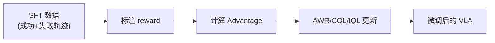

# 离线强化学习基础

> **一句话概括**：不和环境交互，只用已有数据来训练 RL 策略。

---

## 相关阅读

- [策略梯度与 PPO](/前置知识/000a_前置知识_策略梯度与PPO) — 对比：在线 RL
- [Q 函数与 Value 函数](/前置知识/000o_前置知识_Q函数与Value函数) — 离线 RL 的核心组件
- [Replay Buffer](/前置知识/000r_前置知识_Replay_Buffer_经验回放) — 数据存储
- [SAC](/前置知识/000k_前置知识_SAC_Soft_Actor_Critic) — 对比：在线 off-policy
- [KL 散度与策略约束](/前置知识/000j_前置知识_KL散度与策略约束) — 约束策略偏移

---

## 一、为什么需要离线 RL

### 1.1 在线 RL 的困境

标准 RL（如 PPO、SAC）需要和环境**不断交互**：

```
while not converged:
    a = policy(s)          # 策略选动作
    s', r = env.step(a)    # 环境执行
    update_policy(s, a, r, s')  # 更新策略
```

但在很多场景中，在线交互成本极高或不可行：

| 场景 | 为什么不能在线交互 |
|------|-------------------|
| 真实机器人 | 执行慢（5s/step）、有安全风险 |
| 医疗决策 | 不能拿患者做实验 |
| 自动驾驶 | 探索失败 = 车祸 |
| 推荐系统 | 每次坏推荐都是收入损失 |

**离线 RL 的承诺**：只用已有数据（如人类示教、历史日志），不需要新的环境交互就能学出好策略。

### 1.2 和监督学习（BC）的区别

| 维度 | BC（行为克隆） | 离线 RL |
|------|--------------|---------|
| 目标 | 模仿数据中的动作 | 最大化累积奖励 |
| 学到什么 | 数据中的平均行为 | 数据中的**最优**行为 |
| 能超越数据吗 | ❌ 不能 | ✅ 可以"拼接"数据中的最优片段 |
| 需要 reward 吗 | ❌ | ✅ |

**关键直觉**：如果数据中有 100 条轨迹，其中 5 条是成功的、95 条是失败的。BC 会学到"平均行为"（大概率失败），离线 RL 会学到"从成功轨迹中提取的策略"。

---

## 二、离线 RL 的核心挑战：分布偏移

### 2.1 外推误差（Extrapolation Error）

离线 RL 的致命问题是 **Q 函数对未见动作的过度乐观估计**。

**举例**：
- 数据中只有 $a \in \{-1, 0, +1\}$ 的经验
- Q 网络被训练后，可能对 $a=+5$（从未见过的动作）给出很高的 Q 值
- 策略选择 $a=+5$ → 实际执行后发现很差 → 但离线 RL 不执行，就不知道它差

这就像学生只做过难度 1-3 的题，但"以为"自己能做难度 10 的题——因为没试过，就没有失败反馈来纠正这个错觉。

### 2.2 为什么在线 RL 没这个问题

在线 RL 会真正**执行** $a=+5$ → 发现 reward 很低 → 更新 Q 值下调。

离线 RL 没有这个纠正机制——所以必须**主动限制策略不要选数据以外的动作**。

---

## 三、核心方法

### 3.1 策略约束方法：AWR（Advantage Weighted Regression）

**核心思想**：不要尝试新动作，只在已有数据中"挑好的模仿"。

$$
\mathcal{L}_{\text{AWR}} = -\mathbb{E}_{(s,a) \sim \mathcal{D}} \left[ \exp\left(\frac{A(s,a)}{\beta}\right) \cdot \log \pi_\theta(a|s) \right]
$$

**逐项拆解**：
- $(s,a) \sim \mathcal{D}$ — 从离线数据中采样
- $A(s,a)$ — 优势估计：正值表示比平均好
- $\exp(A/\beta)$ — 把 advantage 转化为正权重
- $\log \pi_\theta(a|s)$ — 策略对这个动作的对数概率

**一句话**：对数据中的"好动作"加大模仿力度，对"差动作"降低模仿力度。本质上是**加权的行为克隆**。

**代入数字**：$\beta = 1.0$，三个 $(s, a)$ 对：
- $(s_1, a_1)$：$A=+2.0$ → 权重 $= e^2 = 7.39$
- $(s_2, a_2)$：$A=0$ → 权重 $= e^0 = 1.0$
- $(s_3, a_3)$：$A=-1.0$ → 权重 $= e^{-1} = 0.37$

好动作的训练权重是差动作的 20 倍。

**优点**：简单、稳定、不需要训练 Q 网络
**缺点**：无法超越数据中最好的动作

### 3.2 保守 Q 学习：CQL（Conservative Q-Learning）

**核心思想**：主动压低未见动作的 Q 值，使策略不会选到数据外的动作。

$$
\mathcal{L}_{\text{CQL}} = \underbrace{\alpha \left( \mathbb{E}_{a \sim \pi}[Q(s,a)] - \mathbb{E}_{a \sim \mathcal{D}}[Q(s,a)] \right)}_{\text{保守正则项}} + \underbrace{\mathcal{L}_{\text{TD}}}_{\text{标准 TD loss}}
$$

**逐项拆解**：
- $\mathbb{E}_{a \sim \pi}[Q(s,a)]$ — 当前策略可能选的动作的 Q 值（要压低）
- $\mathbb{E}_{a \sim \mathcal{D}}[Q(s,a)]$ — 数据中实际出现的动作的 Q 值（要保持或抬高）
- $\alpha$ — 保守程度控制

**直觉**：让 Q 函数"悲观"——对没见过的动作给低分，对见过的动作给正常分。这样策略自然不会选没见过的动作。

### 3.3 隐式 Q 学习：IQL（Implicit Q-Learning）

**核心思想**：通过 expectile regression 隐式地从数据中提取最优动作的 Q 值，无需显式的策略约束。

$$
\mathcal{L}_{\text{IQL}} = \mathbb{E}_{(s,a) \sim \mathcal{D}} \left[ L_\tau^2(Q(s,a) - r - \gamma V(s')) \right]
$$

其中 $L_\tau^2(u) = |\tau - \mathbb{1}(u < 0)| \cdot u^2$ 是 expectile loss。

当 $\tau > 0.5$ 时，IQL 倾向于拟合数据中**较高**的 Q 值 → 隐式地关注好动作。

---

## 四、离线 RL 在 VLA 中的应用

VLA 的离线 RL 微调流程：



**为什么特别适合 VLA**：
1. VLA 已有大量 SFT 数据（人类示教）→ 天然的离线数据集
2. 避免了环境交互 → 无需仿真器
3. 训练稳定 → 大模型最怕不稳定的梯度

**代表工作**：
- [CO-RFT](/论文综述/021_CO_RFT_离线分块RL微调VLA)：Chunk 级 AWR
- [ARFM](/论文综述/027_ARFM_自适应离线RL后训练Flow_VLA)：自适应加权的 Flow VLA 离线 RL

---

## 五、三种方法对比

| 维度 | AWR | CQL | IQL |
|------|-----|-----|-----|
| 类型 | 策略约束 | Q 值惩罚 | 隐式最优 |
| 需要 Q 网络？ | ❌（可选） | ✅ | ✅ |
| 保守程度 | 最保守 | 中等 | 中等 |
| 超越数据？ | ❌ | 有限 | 有限 |
| 实现难度 | ⭐ | ⭐⭐⭐ | ⭐⭐ |
| VLA 适用性 | ✅ 最佳 | ⚠️ 需调参 | ✅ 好 |

---

## 六、总结

| 概念 | 核心要点 |
|------|---------|
| 离线 RL 定义 | 不与环境交互，只从已有数据中学策略 |
| 核心挑战 | 分布偏移 → Q 值对未见动作的过度估计 |
| 解决思路 | 约束策略不偏离数据分布太远 |
| AWR | 加权模仿学习：好动作多学、差动作少学 |
| CQL | 主动压低 OOD 动作的 Q 值 |
| IQL | 用 expectile regression 隐式提取最优行为 |
| VLA 适用性 | 非常适合（有数据、无仿真、要稳定） |

---

## 延伸阅读

- [策略梯度与 PPO](/前置知识/000a_前置知识_策略梯度与PPO) — 在线 RL 对比
- [SAC](/前置知识/000k_前置知识_SAC_Soft_Actor_Critic) — 在线 off-policy 对比
- [CO-RFT 精读](/论文综述/021_CO_RFT_离线分块RL微调VLA) — 离线 RL 在 VLA 中的实际应用
