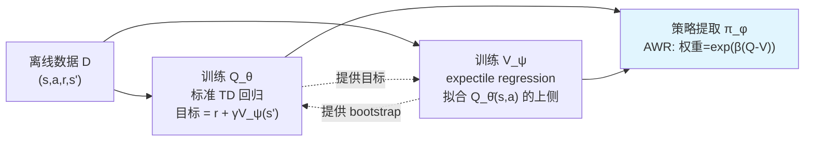
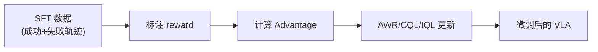

# 离线强化学习基础

> **一句话概括**：不和环境交互，只用已有数据来训练 RL 策略。

---

## 相关阅读

- [策略梯度与 PPO](/前置知识/000a_前置知识_策略梯度与PPO) — 对比：在线 RL
- [Q 函数与 Value 函数](/前置知识/000o_前置知识_Q函数与Value函数) — 离线 RL 的核心组件
- [Replay Buffer](/前置知识/000r_前置知识_Replay_Buffer_经验回放) — 数据存储
- [SAC](/前置知识/000k_前置知识_SAC_Soft_Actor_Critic) — 对比：在线 off-policy
- [KL 散度与策略约束](/前置知识/000j_前置知识_KL散度与策略约束) — 约束策略偏移

---

## 一、为什么需要离线 RL

### 1.1 在线 RL 的困境

标准 RL（如 PPO、SAC）需要和环境**不断交互**：

```
while not converged:
    a = policy(s)          # 策略选动作
    s', r = env.step(a)    # 环境执行
    update_policy(s, a, r, s')  # 更新策略
```

但在很多场景中，在线交互成本极高或不可行：

| 场景 | 为什么不能在线交互 |
|------|-------------------|
| 真实机器人 | 执行慢（5s/step）、有安全风险 |
| 医疗决策 | 不能拿患者做实验 |
| 自动驾驶 | 探索失败 = 车祸 |
| 推荐系统 | 每次坏推荐都是收入损失 |

**离线 RL 的承诺**：只用已有数据（如人类示教、历史日志），不需要新的环境交互就能学出好策略。

### 1.2 和监督学习（BC）的区别

| 维度 | BC（行为克隆） | 离线 RL |
|------|--------------|---------|
| 目标 | 模仿数据中的动作 | 最大化累积奖励 |
| 学到什么 | 数据中的平均行为 | 数据中的**最优**行为 |
| 能超越数据吗 | ❌ 不能 | ✅ 可以"拼接"数据中的最优片段 |
| 需要 reward 吗 | ❌ | ✅ |

**关键直觉**：如果数据中有 100 条轨迹，其中 5 条是成功的、95 条是失败的。BC 会学到"平均行为"（大概率失败），离线 RL 会学到"从成功轨迹中提取的策略"。

---

## 二、离线 RL 的核心挑战：分布偏移

### 2.1 外推误差（Extrapolation Error）

离线 RL 的致命问题是 **Q 函数对未见动作的过度乐观估计**。

**举例**：
- 数据中只有 $a \in \{-1, 0, +1\}$ 的经验
- Q 网络被训练后，可能对 $a=+5$（从未见过的动作）给出很高的 Q 值
- 策略选择 $a=+5$ → 实际执行后发现很差 → 但离线 RL 不执行，就不知道它差

这就像学生只做过难度 1-3 的题，但"以为"自己能做难度 10 的题——因为没试过，就没有失败反馈来纠正这个错觉。

### 2.2 为什么在线 RL 没这个问题

在线 RL 会真正**执行** $a=+5$ → 发现 reward 很低 → 更新 Q 值下调。

离线 RL 没有这个纠正机制——所以必须**主动限制策略不要选数据以外的动作**。

---

## 三、核心方法

### 3.1 策略约束方法：AWR（Advantage Weighted Regression）

**核心思想**：不要尝试新动作，只在已有数据中"挑好的模仿"。

$$
\mathcal{L}_{\text{AWR}} = -\mathbb{E}_{(s,a) \sim \mathcal{D}} \left[ \exp\left(\frac{A(s,a)}{\beta}\right) \cdot \log \pi_\theta(a|s) \right]
$$

**逐项拆解**：
- $(s,a) \sim \mathcal{D}$ — 从离线数据中采样
- $A(s,a)$ — 优势估计：正值表示比平均好
- $\exp(A/\beta)$ — 把 advantage 转化为正权重
- $\log \pi_\theta(a|s)$ — 策略对这个动作的对数概率

**一句话**：对数据中的"好动作"加大模仿力度，对"差动作"降低模仿力度。本质上是**加权的行为克隆**。

**代入数字**：$\beta = 1.0$，三个 $(s, a)$ 对：
- $(s_1, a_1)$：$A=+2.0$ → 权重 $= e^2 = 7.39$
- $(s_2, a_2)$：$A=0$ → 权重 $= e^0 = 1.0$
- $(s_3, a_3)$：$A=-1.0$ → 权重 $= e^{-1} = 0.37$

好动作的训练权重是差动作的 20 倍。

**优点**：简单、稳定、不需要训练 Q 网络
**缺点**：无法超越数据中最好的动作

### 3.2 保守 Q 学习：CQL（Conservative Q-Learning）

**核心思想**：主动压低未见动作的 Q 值，使策略不会选到数据外的动作。

$$
\mathcal{L}_{\text{CQL}} = \underbrace{\alpha \left( \mathbb{E}_{a \sim \pi}[Q(s,a)] - \mathbb{E}_{a \sim \mathcal{D}}[Q(s,a)] \right)}_{\text{保守正则项}} + \underbrace{\mathcal{L}_{\text{TD}}}_{\text{标准 TD loss}}
$$

**逐项拆解**：
- $\mathbb{E}_{a \sim \pi}[Q(s,a)]$ — 当前策略可能选的动作的 Q 值（要压低）
- $\mathbb{E}_{a \sim \mathcal{D}}[Q(s,a)]$ — 数据中实际出现的动作的 Q 值（要保持或抬高）
- $\alpha$ — 保守程度控制

**直觉**：让 Q 函数"悲观"——对没见过的动作给低分，对见过的动作给正常分。这样策略自然不会选没见过的动作。

### 3.3 隐式 Q 学习：IQL（Implicit Q-Learning）

**核心思想**：通过 expectile regression 隐式地从数据中提取"最优动作的价值"，完全不需要在 TD 目标里显式对动作求 max，也不需要像 AWR 那样直接约束策略、或像 CQL 那样加惩罚项。

#### 3.3.1 为什么要"隐式"地做最大化：先回到问题根源

回顾第二节的核心矛盾：标准 Q-learning 的 TD 目标是

$$
y = r + \gamma \max_{a'} Q(s', a')
$$

这个 $\max_{a'}$ 要求我们能对**任意**动作 $a'$ 查询 $Q(s',a')$——但离线数据里，状态 $s'$ 下只出现过少数几个动作。如果 $\max$ 恰好选中了一个数据里没见过的动作（比如前面举的 $a=+5$ 的例子），$Q$ 网络对它的估计完全没有真实反馈校准过，往往严重偏高——这正是**外推误差**的直接来源。

AWR（3.1 节）绕开这个问题的方式是**完全不训练 Q 网络**，只用 advantage 加权模仿；CQL（3.2 节）的方式是**训练 Q 但主动压低它**。IQL 走了第三条路：**换一种方式计算"这个状态下最好能拿多少"，只用数据里出现过的动作，从不查询数据外的动作**。这个"换一种方式"就是 expectile regression。

#### 3.3.2 铺垫：expectile 是什么，为什么能"隐式"求最大值

在讲公式之前，先建立直觉。假设你有一堆样本 $\{x_1, x_2, \ldots, x_n\}$，想找一个统计量来概括它们：

- **均值**：所有样本的算术平均，对每个样本一视同仁
- **中位数**（0.5-分位数，quantile）：一半样本比它大，一半比它小
- **expectile**（$\tau$-expectile）：均值的一个推广。$\tau=0.5$ 时就是均值；$\tau$ 越接近 1，这个统计量就越被"拉向"样本中**较大**的那些值

> **一句话直觉**：expectile 就像一个"偏心的平均"——普通平均对每个样本给相同的权重，$\tau$-expectile（$\tau>0.5$）对"比当前估计值更大"的样本给更高的权重，所以最终结果会比普通均值更靠近数据中较大的那一部分。

这为什么有用？因为在状态 $s$ 下，数据里出现过的动作 $a_1, a_2, \ldots$ 各自有一个 $Q(s, a_i)$。真正的最优值是 $\max_i Q(s, a_i)$——但如果直接用 $\max$，样本少的时候极不稳定（有噪声的 Q 网络，$\max$ 会放大噪声，见 CQL 一节讨论的过估计问题）。用一个 $\tau$ 接近 1（但不等于 1）的 expectile，可以**在只用数据里已出现动作的前提下**，得到一个"贴近最大值但更稳健"的估计——这就是"隐式"最大化的含义：没有出现 $\max$ 这个算子，但效果上近似在做最大化。

#### 3.3.3 第一步：用 expectile regression 训练价值函数 $V$

**为什么需要这个公式**：我们要训练一个价值函数 $V_\psi(s)$，让它逼近"状态 $s$ 下，数据里最好的那个动作能拿到的 $Q$ 值"，但只用数据里实际出现过的 $(s,a)$ 对来训练，不查询任何数据外的动作。

$$
\mathcal{L}_V(\psi) = \mathbb{E}_{(s,a) \sim \mathcal{D}} \left[ L_2^\tau\big(Q_{\bar\theta}(s,a) - V_\psi(s)\big) \right]
$$

其中 $L_2^\tau(u) = |\tau - \mathbb{1}(u < 0)| \cdot u^2$ 是**非对称平方损失**（expectile loss）。

> **一句话直觉**：让 $V(s)$ 去拟合 $Q(s,a)$，但"拟合得不够高"（$V$ 比 $Q$ 小，即 $u=Q-V>0$）要比"拟合得太高"（$V$ 比 $Q$ 大，即 $u<0$）受到更重的惩罚——这样 $V$ 就会被系统性地"推高"，逼近数据中较大的 $Q$ 值。

**逐项拆解**：

| 符号 | 含义 | 直觉 |
|------|------|------|
| $(s,a)\sim\mathcal{D}$ | 从离线数据里采样一个真实出现过的状态-动作对 | 训练信号只来自数据里发生过的事，不查询未见动作 |
| $Q_{\bar\theta}(s,a)$ | 目标网络（target network）给出的 Q 值 | 用一个更新较慢、更稳定的 Q 网络做回归目标 |
| $V_\psi(s)$ | 待训练的价值网络，只依赖状态不依赖动作 | "这个状态下，大概能拿多少分" |
| $u = Q_{\bar\theta}(s,a) - V_\psi(s)$ | 残差：Q 值比当前 V 估计高多少 | $u>0$ 说明这个动作比 $V$ 当前估计的"平均水平"更好 |
| $\mathbb{1}(u<0)$ | 指示函数：残差是否为负 | 用来决定当前样本该受到哪种权重的惩罚 |
| $\tau \in (0.5, 1)$ | expectile 参数，通常取 $0.7\sim0.9$ | 控制"往上拉"的强度，越接近 1 越贴近 $\max$ |

**拆解 $L_2^\tau(u)$ 本身**：这是一个分段的加权平方损失——

$$
L_2^\tau(u) = \begin{cases} \tau \cdot u^2 & \text{if } u \ge 0 \quad(\text{即 } Q > V, \text{V 估计偏低}) \\ (1-\tau) \cdot u^2 & \text{if } u < 0 \quad(\text{即 } Q < V, \text{V 估计偏高}) \end{cases}
$$

当 $\tau > 0.5$ 时，$\tau > 1-\tau$——也就是说，**"V 估计偏低"这一侧的惩罚系数更大**。梯度下降为了减小这个更大的惩罚，会倾向于把 $V(s)$ 往上调，直到"偏低"和"偏高"两侧的期望损失重新平衡。平衡点正是 $Q(s,\cdot)$ 在状态 $s$ 下、按数据分布的 $\tau$-expectile——不是均值，也不是精确的 $\max$，而是介于两者之间、偏向较大值的一个统计量。

**数值例子**：状态 $s$（机械臂在方块正上方 5cm 处），数据中出现过 3 个不同的动作，对应的 $Q_{\bar\theta}(s,a)$ 分别是 $\{6, 8, 10\}$（比如"向左偏"、"垂直下压偏慢"、"垂直下压恰好抓到"三种历史尝试）。假设当前 $V_\psi(s)=8$，取 $\tau=0.8$：

| 动作 $a_i$ | $Q(s,a_i)$ | $u=Q-V$ | 符号 | 损失 $L_2^\tau(u)$ |
|---|---|---|---|---|
| $a_1$ | 6 | $-2$ | 偏高($u<0$) | $(1-0.8)\times 4=0.8$ |
| $a_2$ | 8 | $0$ | 边界 | $0$ |
| $a_3$ | 10 | $+2$ | 偏低($u\ge0$) | $0.8\times4=3.2$ |

三个样本的平均损失是 $(0.8+0+3.2)/3\approx1.33$。注意 $a_3$（$Q$ 更高、$V$ 偏低）贡献的损失是 $a_1$（$Q$ 更低、$V$ 偏高）的 **4 倍**——这个不对称的惩罚会驱动梯度把 $V_\psi(s)$ 往上调整，直到它更接近 $10$ 而不是停留在 $8$。反复迭代后，$V(s)$ 会稳定在比简单平均（$(6+8+10)/3=8$）更高的一个值——这正是"隐式地关注好动作"的数学机制。

**为什么是这个形式（设计动机）**：

- **为什么不直接用 $\max_i Q(s,a_i)$**：如果数据里某个动作的 $Q$ 值恰好被高估（网络噪声），直接取 $\max$ 会把这个噪声原封不动地当成"最优值"，一次抓取错误的估计就永久带入训练。Expectile regression 是对**整个分布**做加权拟合，单个异常样本的影响被摊薄，更稳健。
- **为什么 $\tau$ 通常取 $0.7$–$0.9$ 而不是 $1.0$**：$\tau\to1$ 时 expectile 会退化成精确的 $\max$，重新引入上面说的脆弱性；$\tau$ 取一个较大但不到 1 的值，是在"贴近最优"和"抗噪声"之间做权衡。
- **为什么只训练 $V(s)$ 而不是继续用 $\max_{a'}Q(s',a')$ 做 Q 的 TD 目标**：这是承接下一步的关键——一旦有了这个"隐式最大化"过的 $V(s)$，后面训练 $Q$ 的时候就可以直接拿 $V(s')$ 当 bootstrap 目标，彻底避免了对动作做显式 $\max$ 或采样查询数据外动作的需要。

#### 3.3.4 第二步：用标准 TD 回归训练 $Q$（但 bootstrap 目标换成了 $V$）

有了上面训练好的 $V_\psi$，$Q_\theta$ 的训练目标变成一个非常朴素的均方回归：

$$
\mathcal{L}_Q(\theta) = \mathbb{E}_{(s,a,r,s') \sim \mathcal{D}} \left[ \big(Q_\theta(s,a) - (r + \gamma V_\psi(s'))\big)^2 \right]
$$

**为什么需要这个公式**：这一步要把即时奖励 $r$ 和"隐式最大化"过的未来价值 $V_\psi(s')$ 结合起来，训练出一个能评估"这个具体状态-动作对"值多少分的 $Q$ 函数——用来支撑下一步的策略提取。

**逐项拆解**：

| 符号 | 含义 | 与标准 Q-learning 的区别 |
|------|------|--------------------------|
| $r + \gamma V_\psi(s')$ | TD 目标 | 标准 Q-learning 用 $r+\gamma\max_{a'}Q(s',a')$，这里直接用 $V_\psi(s')$ 代替整个 $\max$ 操作 |
| $Q_\theta(s,a)$ | 当前 Q 网络的预测 | 和标准做法一样 |
| $(s,a,r,s')\sim\mathcal{D}$ | 数据里真实的 transition | 只用数据里记录下来的转移，$s'$ 也是数据里真实到达的下一状态 |

**这一步为什么"干净"**：$V_\psi(s')$ 已经在上一步吸收了"在 $s'$ 处应该选什么最好的动作"这个信息（通过 expectile regression），所以这里不再需要对 $a'$ 做任何搜索或采样——普通的 MSE 回归就够了，训练极其稳定，也是 IQL 相比 CQL（需要额外的对抗式采样和正则调参）实现简单得多的原因。

**数值例子**：延续上面的场景，机械臂在 $s$ 处执行了动作 $a_3$（垂直下压），获得即时奖励 $r=-0.01$（还没抓到，时间惩罚），到达下一状态 $s'$（更靠近方块），假设 $V_\psi(s')=9.2$，$\gamma=0.99$：

$$
\text{目标值} = -0.01 + 0.99\times9.2 = -0.01+9.108=9.098
$$

如果当前 $Q_\theta(s,a_3)=8.5$，MSE loss $=(8.5-9.098)^2\approx0.358$，梯度会把 $Q_\theta(s,a_3)$ 往 $9.098$ 调整。

#### 3.3.5 第三步：从 $Q,V$ 提取策略（复用 AWR）

$V,Q$ 训练好之后，IQL 用和 3.1 节 AWR **完全相同的公式**把它们转成一个可执行的策略，只是这里的 advantage 是用训练好的 $Q_\theta$ 减去训练好的 $V_\psi$ 算出来的：

$$
\mathcal{L}_\pi(\phi) = -\mathbb{E}_{(s,a)\sim\mathcal{D}}\left[\exp\big(\beta\,(Q_\theta(s,a)-V_\psi(s))\big)\cdot\log\pi_\phi(a|s)\right]
$$

这里的 $A(s,a):=Q_\theta(s,a)-V_\psi(s)$ 正是 [Advantage 函数](/前置知识/000o_前置知识_Q函数与Value函数) 的标准定义（见该文第五节）——数据里那个让 $A(s,a)$ 很大的动作，会在策略提取时获得指数级放大的模仿权重。

#### 3.3.6 把这一整套 $L$ 放回 RL 整体框架里看

这是理解 IQL 最容易卡住的地方——上面拆成了三个独立的 loss（$\mathcal{L}_V$、$\mathcal{L}_Q$、$\mathcal{L}_\pi$），它们不是三个互相竞争的目标，而是一条**单向的流水线**，训练时三个网络交替（或联合）更新：



**和标准 Actor-Critic 框架对比着看**：

回忆标准的 off-policy Actor-Critic（比如 [SAC](/前置知识/000k_前置知识_SAC_Soft_Actor_Critic)）：Critic（$Q$）通过 TD 学习评估当前策略，Actor（$\pi$）通过"顺着 $Q$ 值梯度上升"或"最大化 $Q$"来更新，两者交替、迭代改进，形成一个闭环——这套机制天然要求能**主动查询**任意动作的 $Q$ 值（比如从当前策略采样一个新动作问 $Q$ 好不好），这在在线环境里没问题，因为可以随时用这个新动作去环境里试。

IQL 把这个闭环**拆开、拉直**成了一条流水线，原因正是离线设定下"不能试新动作"这个硬约束（见第二节）：

| 环节 | 标准 Actor-Critic 里的角色 | IQL 里的替代方案 |
|------|--------------------------|------------------|
| Critic 评估策略 | $Q(s,a)$，bootstrap 用 $\max_{a'}Q(s',a')$ 或当前策略采样 | $Q(s,a)$，bootstrap 换成 $V_\psi(s')$（3.3.4 节） |
| "策略改进"这一步隐含的 $\max$ | 显式对动作求 $\max$/采样，需要查询任意动作 | 挪到 $V$ 的训练里，用 expectile regression **隐式**完成（3.3.3 节），只用数据里的动作 |
| Actor 更新 | 沿 $\nabla_a Q$ 或最大化 $Q$ 更新策略网络 | 用 AWR 加权模仿（3.3.5 节），策略永远不会被推向数据外的动作 |

**为什么要这样拆**：标准 Actor-Critic 的 Actor 更新步骤本质上要问"如果我把策略往这个方向调一点，新选出来的动作 $Q$ 值会不会更高"——这个"新选出来的动作"很可能是数据里没有的。IQL 把"隐式求最大化"这件事**提前**做在 $V$ 的训练阶段（只用数据里已有的动作做 expectile regression），这样后续 $Q$ 的训练和策略提取都只需要在数据支持的范围内做回归/加权模仿，**全程不产生任何需要查询数据外动作的步骤**。这正是 IQL 名字里"Implicit"（隐式）的含义：最大化操作被隐式地"编码"进了 $V$ 网络的训练目标里，而不是在算法的某一步显式地写出 $\max_a$。

**在线微调阶段的衔接**：一旦有了在线交互的机会（[离线到在线 RL](/论文综述/071_QChunking_RL与动作分块) 场景），这条流水线不需要改变结构——只是 $\mathcal{D}$ 从"固定的离线数据集"变成"离线数据 + 不断增长的在线 replay buffer"（见 [Replay Buffer](/前置知识/000r_前置知识_Replay_Buffer_经验回放)），$\mathcal{L}_V,\mathcal{L}_Q,\mathcal{L}_\pi$ 三个 loss 继续按同样的方式交替更新，策略会随着在线数据的加入自然地评估到更多、更好的动作。这也是为什么 IQL 在 offline-to-online 的文献里经常被当作一个**默认起点**（baseline）：它的流水线结构本身就没有要在线/离线之间切换任何机制。

---

## 四、离线 RL 在 VLA 中的应用

VLA 的离线 RL 微调流程：



**为什么特别适合 VLA**：
1. VLA 已有大量 SFT 数据（人类示教）→ 天然的离线数据集
2. 避免了环境交互 → 无需仿真器
3. 训练稳定 → 大模型最怕不稳定的梯度

**代表工作**：
- [CO-RFT](/论文综述/021_CO_RFT_离线分块RL微调VLA)：Chunk 级 AWR
- [ARFM](/论文综述/027_ARFM_自适应离线RL后训练Flow_VLA)：自适应加权的 Flow VLA 离线 RL

---

## 五、三种方法对比

| 维度 | AWR | CQL | IQL |
|------|-----|-----|-----|
| 类型 | 策略约束 | Q 值惩罚 | 隐式最优 |
| 需要 Q 网络？ | ❌（可选） | ✅ | ✅ |
| 保守程度 | 最保守 | 中等 | 中等 |
| 超越数据？ | ❌ | 有限 | 有限 |
| 实现难度 | ⭐ | ⭐⭐⭐ | ⭐⭐ |
| VLA 适用性 | ✅ 最佳 | ⚠️ 需调参 | ✅ 好 |

---

## 六、总结

| 概念 | 核心要点 |
|------|---------|
| 离线 RL 定义 | 不与环境交互，只从已有数据中学策略 |
| 核心挑战 | 分布偏移 → Q 值对未见动作的过度估计 |
| 解决思路 | 约束策略不偏离数据分布太远 |
| AWR | 加权模仿学习：好动作多学、差动作少学 |
| CQL | 主动压低 OOD 动作的 Q 值 |
| IQL | 用 expectile regression 隐式提取最优行为 |
| VLA 适用性 | 非常适合（有数据、无仿真、要稳定） |

---

## 延伸阅读

- [策略梯度与 PPO](/前置知识/000a_前置知识_策略梯度与PPO) — 在线 RL 对比
- [SAC](/前置知识/000k_前置知识_SAC_Soft_Actor_Critic) — 在线 off-policy 对比
- [CO-RFT 精读](/论文综述/021_CO_RFT_离线分块RL微调VLA) — 离线 RL 在 VLA 中的实际应用
