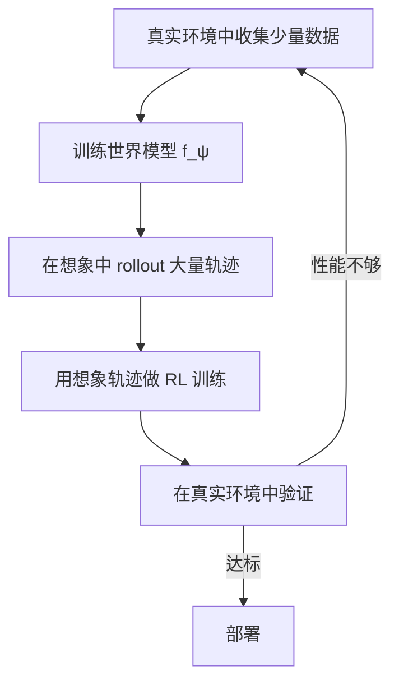

# 世界模型基础（World Model）

> **一句话概括**：在脑中模拟"如果我这样做，世界会变成什么样"，然后基于想象来做决策。

---

## 相关阅读

- [策略梯度与 PPO](/前置知识/000a_前置知识_策略梯度与PPO) — 基于模型-free 的 RL 对比
- [扩散模型 DDPM](/前置知识/000b_前置知识_扩散模型DDPM) — 世界模型常用的生成架构
- [Q 函数与 Value 函数](/前置知识/000o_前置知识_Q函数与Value函数) — 世界模型可替代的功能

---

## 一、什么是世界模型

### 1.1 直觉解释

人类在行动前会"在脑中模拟"：

- 想要拿桌子上的杯子 → 脑中想象手伸过去的画面 → 预判能不能抓到 → 再执行
- 想过马路 → 脑中预测车辆运动 → 判断安全 → 再迈步

世界模型（World Model）就是让 AI 也有这种"脑中模拟"的能力：

$$
\hat{s}_{t+1} = f_\psi(s_t, a_t)
$$

给定当前状态 $s_t$ 和动作 $a_t$，预测下一个状态 $\hat{s}_{t+1}$。

### 1.2 为什么需要世界模型

**Model-Free RL**（无模型 RL）的问题：

- 必须在真实/仿真环境中执行动作才能知道结果
- 每一步交互都有成本（时间、安全、金钱）
- 采样效率低：需要大量交互

**World Model 的好处**：

| 优势 | 说明 |
|------|------|
| 加速训练 | 在想象中"免费"体验数千条轨迹 |
| 安全探索 | 危险动作只在想象中尝试 |
| 规划 | 可以展望多步未来再做决策 |
| 不需要环境 | 训练完世界模型后，环境可以"下线" |

---

## 二、世界模型的形式

### 2.1 基本公式

一个完整的世界模型通常包含三个部分：

$$
\begin{aligned}
\text{Transition Model:} & \quad \hat{s}_{t+1} = f_\psi(s_t, a_t) \\
\text{Reward Model:} & \quad \hat{r}_t = g_\psi(s_t, a_t) \\
\text{Termination Model:} & \quad \hat{d}_t = h_\psi(s_t, a_t)
\end{aligned}
$$

- $f_\psi$：状态转移模型（核心）
- $g_\psi$：奖励预测模型
- $h_\psi$：终止条件预测

### 2.2 三种主要形式

**形式一：状态空间世界模型**

在低维状态空间（如关节角度、物体位置）中做预测：

$$
\hat{s}_{t+1} \in \mathbb{R}^n, \quad n = 10 \sim 100
$$

**优点**：快、准确、容易训练
**缺点**：需要状态表示（不能直接处理图像）

**形式二：潜空间世界模型（RSSM / Dreamer 系列）**

先将图像编码到潜空间 $z$，在潜空间中做预测：

$$
z_t = \text{Encoder}(o_t) \quad \text{(图像→潜变量)}
$$
$$
\hat{z}_{t+1} = f_\psi(z_t, a_t) \quad \text{(潜空间转移)}
$$
$$
\hat{o}_{t+1} = \text{Decoder}(\hat{z}_{t+1}) \quad \text{(潜变量→图像)}
$$

**优点**：可以处理高维图像输入
**缺点**：潜空间压缩可能丢失信息

**形式三：视频预测世界模型**

直接在像素空间预测未来帧：

$$
\hat{o}_{t+1} = \text{VideoModel}(o_t, a_t)
$$

通常基于扩散模型或 Transformer。

**优点**：输出可视化，可以用 VLM 评估
**缺点**：计算量大，长时间预测不稳定

### 2.3 一个具体例子

**场景**：机器人桌面抓取。

状态空间世界模型的预测：

$$
s_t = [\underbrace{0.3, 0.2, 0.15}_{\text{末端位置}}, \underbrace{0.5, 0.4, 0.08}_{\text{物体位置}}, \underbrace{1.0}_{\text{夹爪开}}]
$$

动作 $a_t = [0.05, 0, -0.03, 0, 0, 0, 0]$（向右移动 5cm，向下 3cm）

预测：

$$
\hat{s}_{t+1} = [0.35, 0.2, 0.12, 0.5, 0.4, 0.08, 1.0]
$$

物体没动（还没碰到），末端往物体方向移动了。

---

## 三、世界模型如何加速 RL

### 3.1 想象训练（Imagination-based Training）

核心流程：

**Dreamer 算法**（经典世界模型 RL）的核心思路：

1. 用少量真实数据训练世界模型
2. 用世界模型生成"梦境"（想象的轨迹）
3. 在梦境中用 Actor-Critic 训练策略
4. 偶尔在真实环境验证，收集更多数据改进世界模型

### 3.2 数据量对比

| 方法 | 真实环境交互量 | 训练策略的数据量 |
|------|-------------|---------------|
| Model-free (PPO) | 100万步 | 100万步 |
| Model-based (Dreamer) | 1万步 | 100万步（想象） |

世界模型让 1 万步真实数据"变出" 100 万步训练数据。

### 3.3 代入数字

假设：
- 真实环境交互：10 步/秒 → 100万步需要 28 小时
- 想象 rollout：10000 步/秒 → 100万步只需 100 秒
- 世界模型训练：用 1 万步真实数据训练 1 小时

**总时间对比**：
- Model-free：28 小时
- Model-based：收集 1 万步 (17 分钟) + 训练世界模型 (1 小时) + 想象训练 (5 分钟) ≈ **1.5 小时**

加速约 **20 倍**。

---

## 四、世界模型的核心挑战

### 4.1 模型误差累积（Compounding Error）

世界模型的预测不完美。单步误差很小，但多步预测时误差会累积：

$$
\text{误差}(t) \approx \epsilon \cdot t
$$

10 步后误差可能已经让预测变得不可信。

**解决方案**：
- 限制想象 rollout 长度（如最多 15 步）
- 用集成模型（多个世界模型取平均）来量化不确定性
- 当不确定性高时停止想象

### 4.2 分布偏移

世界模型只在已见数据上训练 → 对未见状态的预测不可靠。

如果策略探索到新状态 → 世界模型的预测可能完全错误 → 策略可能被"误导"。

### 4.3 高维观测的困难

对于图像观测，预测"下一帧画面"非常困难——需要建模物理、遮挡、光照等。

---

## 五、世界模型在 VLA 后训练中的应用

世界模型在 VLA RL 后训练中有两种用法：

### 5.1 用法一：替代物理仿真器

无需建真实的物理仿真环境，用视频预测世界模型提供状态转移：

$$
\hat{o}_{t+1} = \text{VideoWorldModel}(o_t, a_{\text{VLA}})
$$

代表工作：[World-Env](/论文综述/024_WorldEnv_世界模型虚拟环境VLA后训练)

### 5.2 用法二：提供密集奖励

世界模型预测未来帧，VLM 对预测帧打分作为奖励：

$$
r_t = \text{VLM}(\hat{o}_{t+k}, \text{instruction})
$$

代表工作：[VLA-RFT](/论文综述/017_VLA_RFT_世界模型验证奖励RL微调)、[ProphRL](/论文综述/022_ProphRL_预测式VLA后训练)

---

## 六、经典世界模型方法时间线

| 年份 | 方法 | 核心创新 |
|------|------|---------|
| 2018 | World Models | RNN 预测潜空间 + 在梦中训练 |
| 2020 | Dreamer v1 | RSSM + Actor-Critic in imagination |
| 2021 | Dreamer v2 | 离散潜空间 + 更好的训练 |
| 2023 | Dreamer v3 | 统一框架，多领域 SOTA |
| 2024 | GAIA-1 / UniSim | 视频扩散世界模型用于自动驾驶 |
| 2025 | World-Env / VLA-RFT | 世界模型用于 VLA 后训练 |

---

## 七、总结

| 概念 | 核心要点 |
|------|---------|
| 世界模型定义 | 预测"动作→下一状态"的模型 |
| 核心公式 | $\hat{s}_{t+1} = f(s_t, a_t)$ |
| 主要形式 | 状态空间 / 潜空间 / 视频预测 |
| 核心优势 | 采样效率高（想象训练）、安全、不需在线环境 |
| 核心挑战 | 误差累积、分布偏移、高维预测难 |
| VLA 应用 | 替代仿真器 + 提供密集奖励 |

---

## 延伸阅读

- [World-Env：世界模型虚拟环境 VLA 后训练](/论文综述/024_WorldEnv_世界模型虚拟环境VLA后训练)
- [VLA-RFT：世界模型验证奖励 RL 微调](/论文综述/017_VLA_RFT_世界模型验证奖励RL微调)
- [ProphRL：预测式 VLA 后训练](/论文综述/022_ProphRL_预测式VLA后训练)
