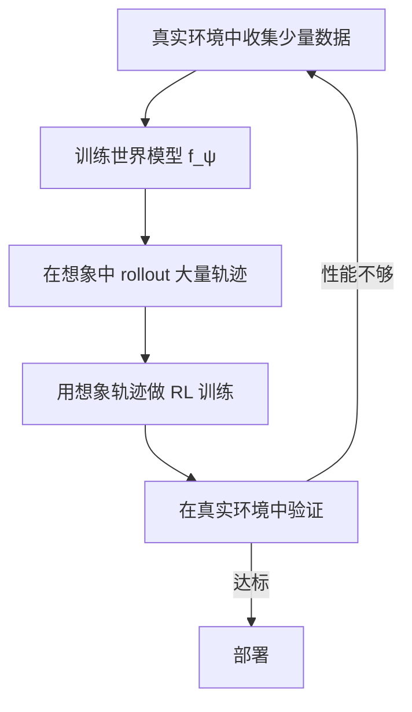

# 世界模型基础（World Model）

> **一句话概括**：在脑中模拟"如果我这样做，世界会变成什么样"，然后基于想象来做决策。

---

## 相关阅读

- [策略梯度与 PPO](/前置知识/000a_前置知识_策略梯度与PPO) — 基于模型-free 的 RL 对比
- [扩散模型 DDPM](/前置知识/000b_前置知识_扩散模型DDPM) — 世界模型常用的生成架构
- [Q 函数与 Value 函数](/前置知识/000o_前置知识_Q函数与Value函数) — 世界模型可替代的功能

---

## 一、什么是世界模型

### 1.1 直觉解释

人类在行动前会"在脑中模拟"：

- 想要拿桌子上的杯子 → 脑中想象手伸过去的画面 → 预判能不能抓到 → 再执行
- 想过马路 → 脑中预测车辆运动 → 判断安全 → 再迈步

世界模型（World Model）就是让 AI 也有这种"脑中模拟"的能力。要让智能体在真正执行一个动作之前先知道"大概会发生什么"，就需要一个函数，输入当前状态和打算做的动作，输出下一时刻状态的预测——这就是世界模型要解决的问题：

$$
\hat{s}_{t+1} = f_\psi(s_t, a_t)
$$

**这个公式在做什么**：用一个参数为 $\psi$ 的神经网络 $f_\psi$，根据当前状态和动作，预测下一时刻的状态，从而不需要真实执行动作就能知道结果。

> **一句话**：给世界模型看"现在的样子"和"我打算做的动作"，它猜"做完之后会变成什么样子"。

**逐项拆解**：

| 符号 | 数学含义 | 在世界模型中具体是什么 | 直觉 |
|------|---------|----------------------|------|
| $s_t$ | 当前时刻 $t$ 的状态向量 | 如机械臂末端位置、物体位置等，维度 $n$ | "世界现在长什么样" |
| $a_t$ | 时刻 $t$ 执行的动作 | 如末端位移、夹爪开合，维度 $m$ | "我打算做什么" |
| $f_\psi$ | 参数为 $\psi$ 的函数（通常是神经网络） | MLP/RNN/Transformer，$\psi$ 是训练得到的权重 | "大脑里的物理直觉" |
| $\hat{s}_{t+1}$ | 对下一时刻状态的**预测**（带 $\hat{}$ 表示是估计值，非真实值） | 与 $s_t$ 同维度的向量 | "猜出来的下一帧" |

**代入数字**：假设状态是二维小车的位置和速度 $s_t = [x, v] = [0, 1.0]$（在原点，速度 1 m/s），动作 $a_t = 0.5$（施加的加速度）。若 $f_\psi$ 学到了近似真实物理的关系 $\hat{s}_{t+1} = [x + v\Delta t,\; v + a_t \Delta t]$，取 $\Delta t = 1$：

$$
\hat{s}_{t+1} = [0 + 1.0 \times 1,\; 1.0 + 0.5 \times 1] = [1.0, 1.5]
$$

也就是模型预测"1 秒后小车移动到位置 1.0，速度变为 1.5"——这个预测不需要真的推一下小车，只是网络前向传播算出来的。

**为什么是这个形式**：之所以只依赖 $s_t$ 和 $a_t$（而不是整段历史），是因为假设环境满足（近似）马尔可夫性——下一状态只取决于当前状态和当前动作，历史信息已经被压缩进 $s_t$ 里了。这个假设在状态定义足够完整时通常成立，也是几乎所有 RL 环境建模的默认前提。

### 1.2 为什么需要世界模型

**Model-Free RL**（无模型 RL）的问题：

- 必须在真实/仿真环境中执行动作才能知道结果
- 每一步交互都有成本（时间、安全、金钱）
- 采样效率低：需要大量交互

**World Model 的好处**：

| 优势 | 说明 |
|------|------|
| 加速训练 | 在想象中"免费"体验数千条轨迹 |
| 安全探索 | 危险动作只在想象中尝试 |
| 规划 | 可以展望多步未来再做决策 |
| 不需要环境 | 训练完世界模型后，环境可以"下线" |

---

## 二、世界模型的形式

### 2.1 基本公式

只预测下一状态还不够——要在想象中完整地跑一条轨迹并用它来训练策略，还需要知道"这一步能拿多少奖励"以及"这一步之后 episode 有没有结束"。因此一个完整的世界模型通常由三个子模型组成：

$$
\begin{aligned}
\text{Transition Model:} & \quad \hat{s}_{t+1} = f_\psi(s_t, a_t) \\
\text{Reward Model:} & \quad \hat{r}_t = g_\psi(s_t, a_t) \\
\text{Termination Model:} & \quad \hat{d}_t = h_\psi(s_t, a_t)
\end{aligned}
$$

> **一句话**：三个网络分别回答"接下来会变成什么样"、"这一步能拿多少分"、"游戏是不是该结束了"。

**逐项拆解**：

| 符号 | 数学含义 | 具体是什么 | 直觉 |
|------|---------|-----------|------|
| $f_\psi(s_t, a_t)$ | 状态转移函数 | 输出下一状态的预测 $\hat{s}_{t+1}$ | "世界变成了什么样" |
| $g_\psi(s_t, a_t)$ | 奖励函数 | 输出标量 $\hat{r}_t$，预测这一步的即时奖励 | "这一步做得好不好" |
| $h_\psi(s_t, a_t)$ | 终止函数 | 输出 $\hat{d}_t \in [0,1]$，预测 episode 是否结束（如撞墙、任务完成） | "该不该停下来" |
| $\psi$ | 三个子网络共享或各自的参数 | 训练时用真实交互数据通过监督学习拟合 | "学到的世界知识" |

三个子模型通常共享同一个 backbone（如同一个编码器），只是输出头不同，因为它们都依赖同一个 $(s_t, a_t)$ 输入，共享特征可以减少参数、提升数据效率。

**代入数字**：延续上面小车的例子，$s_t = [0, 1.0]$，$a_t = 0.5$：
- Transition：$\hat{s}_{t+1} = [1.0, 1.5]$（如上一节算出）
- Reward：假设任务是"尽快到达 $x=10$"，奖励设计为 $-|x_{\text{target}} - x|$，模型预测 $\hat{r}_t = g_\psi(s_t, a_t) \approx -9.0$（因为还离目标很远）
- Termination：假设终止条件是 $x \geq 10$，当前 $\hat{x}=1.0$ 远未达到，模型预测 $\hat{d}_t \approx 0.02$（几乎不可能这一步就结束）

有了这三个数，就可以在想象中完整地把这一步"走完"：得到新状态、拿到奖励、判断是否停止，而不需要真实环境参与。

**为什么是这个形式**：这三个子模型的输入都取 $(s_t, a_t)$ 而不是更多信息，是为了和标准 MDP（马尔可夫决策过程）的定义保持一致——MDP 本身就定义了转移概率 $P(s'|s,a)$、奖励函数 $R(s,a)$、终止条件都只依赖当前状态和动作，世界模型只是用神经网络去拟合这三个函数。

### 2.2 三种主要形式

**形式一：状态空间世界模型**

在低维状态空间（如关节角度、物体位置）中做预测：

$$
\hat{s}_{t+1} \in \mathbb{R}^n, \quad n = 10 \sim 100
$$

**优点**：快、准确、容易训练
**缺点**：需要状态表示（不能直接处理图像）

**形式二：潜空间世界模型（RSSM / Dreamer 系列）**

直接在原始图像（几十万像素）上做预测和规划计算量太大、也很难学到稳定的转移规律。解决办法是先把图像压缩成一个低维向量（潜变量），所有预测都在这个低维空间里做，最后需要看图像时再解码回来：

$$
z_t = \text{Encoder}(o_t) \quad \text{(图像→潜变量)}
$$
$$
\hat{z}_{t+1} = f_\psi(z_t, a_t) \quad \text{(潜空间转移)}
$$
$$
\hat{o}_{t+1} = \text{Decoder}(\hat{z}_{t+1}) \quad \text{(潜变量→图像)}
$$

> **一句话**：把图像"压缩成几个数字"，在这几个数字上做预测（比直接预测整张图便宜得多），要看结果时再"还原成图像"。

**逐项拆解**：

| 符号 | 含义 | 具体是什么 | 直觉 |
|------|------|-----------|------|
| $o_t$ | 时刻 $t$ 的原始观测 | 一张 RGB 图像，如 $64\times64\times3$，共 12288 个数 | "眼睛看到的画面" |
| $\text{Encoder}$ | 编码器网络（通常是 CNN） | 把图像压缩成低维向量 | "提炼画面里的关键信息" |
| $z_t$ | 潜变量（latent） | 一个低维向量，如 $\mathbb{R}^{32}$ 或 $\mathbb{R}^{1024}$ | "压缩后的世界状态" |
| $f_\psi(z_t, a_t)$ | 潜空间转移函数 | 和 2.1 节的 $f_\psi$ 是同一类东西，只是输入换成了 $z_t$ | "在压缩空间里想象下一步" |
| $\hat{z}_{t+1}$ | 对下一时刻潜变量的预测 | 同样是低维向量 | "猜出来的下一个压缩状态" |
| $\text{Decoder}$ | 解码器网络 | 把低维向量还原成图像 | "把压缩后的信息画出来" |
| $\hat{o}_{t+1}$ | 对下一帧图像的预测 | 和 $o_t$ 同尺寸的图像 | "猜出来的下一帧画面" |

**代入数字**：假设图像 $o_t$ 是 $64\times64\times3 = 12288$ 维，Encoder 把它压缩成 $z_t \in \mathbb{R}^{32}$（32 个数）。潜空间转移 $f_\psi$ 只需要处理 32 维输入而不是 12288 维，参数量和计算量可以缩小两到三个数量级。假设 $z_t = [0.1, -0.3, \ldots]$（32 个数），动作 $a_t$ 编码后拼接进去，网络前向传播一次输出 $\hat{z}_{t+1}$（同样 32 维）；如果这一步需要"看图"（比如给人展示预测结果），才调用 Decoder 把 32 维向量还原成 $64\times64\times3$ 的图像，这一步在训练策略时通常可以跳过，进一步省计算。

**为什么是这个形式**：转移预测放在潜空间而不是像素空间，是因为策略学习真正需要的是"状态怎么变"这个抽象信息，而不是每个像素的具体数值——在低维空间做数千步的想象 rollout 比在像素空间快得多，这是 Dreamer 系列世界模型能做到"想象训练"的关键工程原因。

**优点**：可以处理高维图像输入
**缺点**：潜空间压缩可能丢失信息

**形式三：视频预测世界模型**

如果不想承受潜空间压缩带来的信息损失，另一种做法是放弃压缩，直接在像素空间用足够强大的生成模型预测未来帧：

$$
\hat{o}_{t+1} = \text{VideoModel}(o_t, a_t)
$$

> **一句话**：跳过"压缩成几个数字"这一步，直接用一个强力的图像生成模型，看着当前画面和动作，画出下一帧画面。

**逐项拆解**：

| 符号 | 含义 | 具体是什么 | 直觉 |
|------|------|-----------|------|
| $o_t$ | 当前观测图像 | 如 $256\times256\times3$ 的 RGB 图 | "当前这一帧" |
| $a_t$ | 当前动作 | 通常以文本或向量形式作为条件输入 | "接下来要做的操作" |
| $\text{VideoModel}$ | 视频生成模型 | 通常是[扩散模型](/前置知识/000b_前置知识_扩散模型DDPM)或视频 Transformer | "直接画出未来" |
| $\hat{o}_{t+1}$ | 预测的下一帧图像 | 与 $o_t$ 同尺寸 | "猜出来的下一帧" |

这里没有 Encoder/Decoder，是因为 $\text{VideoModel}$ 本身（如扩散模型的 U-Net）就是在像素空间直接操作的生成网络，输入输出都是图像。

**代入数字**：假设 $o_t$ 是一张 $256\times256\times3$（约 19.6 万像素通道值）的图像，动作 $a_t$ 是文本"向右移动机械臂"。VideoModel 前向传播（对扩散模型而言是若干步去噪迭代，比如 20 步）后输出同尺寸的 $\hat{o}_{t+1}$——一张画面上机械臂位置略微右移的图像。相比潜空间方法的 32 维张量，这里每次预测都要生成完整的 19.6 万维张量，计算量高出好几个数量级，这也是下面"缺点：计算量大"的直接原因。

**为什么是这个形式**：直接在像素空间预测的好处是预测结果本身就是可以直接看的图像，可以用人或 VLM 直接评估预测质量（这也是后面"用法二：提供密集奖励"的基础），但代价是计算成本远高于潜空间方法。

通常基于扩散模型或 Transformer。

**优点**：输出可视化，可以用 VLM 评估
**缺点**：计算量大，长时间预测不稳定

### 2.3 一个具体例子

**场景**：机器人桌面抓取。

状态空间世界模型的预测：

$$
s_t = [\underbrace{0.3, 0.2, 0.15}_{\text{末端位置}}, \underbrace{0.5, 0.4, 0.08}_{\text{物体位置}}, \underbrace{1.0}_{\text{夹爪开}}]
$$

动作 $a_t = [0.05, 0, -0.03, 0, 0, 0, 0]$（向右移动 5cm，向下 3cm）

预测：

$$
\hat{s}_{t+1} = [0.35, 0.2, 0.12, 0.5, 0.4, 0.08, 1.0]
$$

物体没动（还没碰到），末端往物体方向移动了。

---

## 三、世界模型如何加速 RL

### 3.1 想象训练（Imagination-based Training）

核心流程：

```mermaid
flowchart TB
    A["真实环境中收集少量数据"] --> B["训练世界模型 f_ψ"]
    B --> C["在想象中 rollout 大量轨迹"]
    C --> D["用想象轨迹做 RL 训练"]
    D --> E["在真实环境中验证"]
    E -->|性能不够| A
    E -->|达标| F["部署"]
```

**Dreamer 算法**（经典世界模型 RL）的核心思路：

1. 用少量真实数据训练世界模型
2. 用世界模型生成"梦境"（想象的轨迹）
3. 在梦境中用 Actor-Critic 训练策略
4. 偶尔在真实环境验证，收集更多数据改进世界模型

### 3.2 数据量对比

| 方法 | 真实环境交互量 | 训练策略的数据量 |
|------|-------------|---------------|
| Model-free (PPO) | 100万步 | 100万步 |
| Model-based (Dreamer) | 1万步 | 100万步（想象） |

世界模型让 1 万步真实数据"变出" 100 万步训练数据。

### 3.3 代入数字

假设：
- 真实环境交互：10 步/秒 → 100万步需要 28 小时
- 想象 rollout：10000 步/秒 → 100万步只需 100 秒
- 世界模型训练：用 1 万步真实数据训练 1 小时

**总时间对比**：
- Model-free：28 小时
- Model-based：收集 1 万步 (17 分钟) + 训练世界模型 (1 小时) + 想象训练 (5 分钟) ≈ **1.5 小时**

加速约 **20 倍**。

---

## 四、世界模型的核心挑战

### 4.1 模型误差累积（Compounding Error）

世界模型的预测不完美。单步误差很小，但如果拿"预测出来的状态"当作下一步的输入继续预测（也就是想象 rollout 的做法），误差会一步步累积、越滚越大：

$$
\text{误差}(t) \approx \epsilon \cdot t
$$

**这个公式在做什么**：粗略估计想象 $t$ 步之后，累积误差大概是多大。

> **一句话**：每一步都带一点小误差，这些误差不会抵消，而是像滚雪球一样越滚越大。

**逐项拆解**：

| 符号 | 含义 | 具体是什么 |
|------|------|-----------|
| $\epsilon$ | 单步预测误差 | 世界模型每预测一步引入的平均误差大小（如状态向量的均方误差），由模型精度决定 |
| $t$ | 想象的步数 | rollout 已经进行了多少步 |
| $\text{误差}(t)$ | 第 $t$ 步时累积的总误差 | 随 $t$ 线性增长的近似估计 |

**代入数字**：假设单步误差 $\epsilon = 0.02$（比如状态每维平均偏差 2%）。
- 第 1 步：误差 $\approx 0.02$，很小，预测基本可信
- 第 5 步：误差 $\approx 0.02 \times 5 = 0.1$，已经有明显偏差
- 第 15 步：误差 $\approx 0.02 \times 15 = 0.3$，预测很可能已经严重偏离真实轨迹

10 步后误差可能已经让预测变得不可信，这也是为什么下面"解决方案"里第一条是"限制想象 rollout 长度"。

**为什么是这个形式**：这里用线性增长 $\epsilon \cdot t$ 只是最简化的近似——实际系统中误差往往是指数级累积（因为第 $t$ 步的输入本身就带着第 $t-1$ 步的误差，误差会被网络非线性地放大），线性形式给出的是一个乐观的下界估计，用来说明"误差一定会随步数增长"这个定性结论,而非精确公式。

**解决方案**：
- 限制想象 rollout 长度（如最多 15 步）
- 用集成模型（多个世界模型取平均）来量化不确定性
- 当不确定性高时停止想象

### 4.2 分布偏移

世界模型只在已见数据上训练 → 对未见状态的预测不可靠。

如果策略探索到新状态 → 世界模型的预测可能完全错误 → 策略可能被"误导"。

### 4.3 高维观测的困难

对于图像观测，预测"下一帧画面"非常困难——需要建模物理、遮挡、光照等。

---

## 五、世界模型在 VLA 后训练中的应用

世界模型在 VLA RL 后训练中有两种用法：

### 5.1 用法一：替代物理仿真器

训练 VLA 的 RL 阶段需要海量的"动作→结果"交互，但搭建真实机器人环境或高精度物理仿真器成本很高、速度也慢。既然 2.2 节的视频预测世界模型已经能直接预测下一帧图像，就可以把它当作一个"虚拟环境"，让 VLA 在里面反复试错：

$$
\hat{o}_{t+1} = \text{VideoWorldModel}(o_t, a_{\text{VLA}})
$$

> **一句话**：让世界模型扮演环境的角色——VLA 输出一个动作，世界模型直接告诉它"世界变成了什么样"，不需要真实机器人或物理仿真器参与。

**逐项拆解**：

| 符号 | 含义 | 具体是什么 |
|------|------|-----------|
| $o_t$ | 当前观测 | 摄像头图像，作为世界模型的输入 |
| $a_{\text{VLA}}$ | VLA 策略输出的动作 | 如末端位姿增量、关节角指令，这里下标特意标注来源是 VLA 而不是随便一个策略 |
| $\text{VideoWorldModel}$ | 视频预测世界模型 | 与 2.2 节 $\text{VideoModel}$ 是同一类模型，这里强调其被用作"环境" |
| $\hat{o}_{t+1}$ | 预测的下一帧观测 | 直接反馈给 VLA，作为它看到的"新环境状态"，替代真实相机拍摄 |

**代入数字**：一条真实机器人 rollout 通常需要几十毫秒的物理执行时间加上传感器读取延迟，假设单步真实交互耗时 50ms；而 VideoWorldModel 在 GPU 上前向推理一次可能只需 20ms，且不需要占用真实机器人硬件，可以多个 rollout 并行跑。如果需要收集 10 万步交互数据用于 RL 训练，真实环境需要约 83 分钟且只能串行使用一台机器人，而用世界模型可以在多张 GPU 上并行生成，实际耗时可以压缩到几分钟。

**为什么是这个形式**：直接复用 2.2 节的视频预测世界模型架构而不是重新设计，是因为"预测下一帧"这个能力本身和"是不是被当作环境用"无关——只要预测足够准，就可以当作环境的替代品，这也是世界模型能够跨场景复用的原因。

代表工作：[World-Env](/论文综述/024_WorldEnv_世界模型虚拟环境VLA后训练)

### 5.2 用法二：提供密集奖励

很多真实任务的奖励非常稀疏（比如只有"任务是否成功"这一个 0/1 信号），RL 训练效率极低。世界模型可以先在想象中预测出未来几步之后的画面，再用一个视觉语言模型（VLM）去"看图打分"，把这个分数当作中间奖励，从而把稀疏奖励变成密集奖励：

$$
r_t = \text{VLM}(\hat{o}_{t+k}, \text{instruction})
$$

> **一句话**：让世界模型先"想象"未来会发生什么，再让 VLM 看着这个想象画面打分，分数就是当前这一步的奖励。

**逐项拆解**：

| 符号 | 含义 | 具体是什么 |
|------|------|-----------|
| $\hat{o}_{t+k}$ | 世界模型预测的、$k$ 步之后的观测 | 由 2.2/2.3 节的世界模型对当前 $o_t$ 和未来动作滚动预测 $k$ 步得到 |
| $k$ | 向前看的步数 | 典型取值如 5～20 步，取决于任务时间尺度 |
| $\text{instruction}$ | 任务指令 | 如"把红色方块放进篮子里"，作为 VLM 打分的评判标准 |
| $\text{VLM}$ | 视觉语言模型 | 输入图像和指令，输出一个标量分数（或者转换为标量的类别判断） |
| $r_t$ | 时刻 $t$ 的奖励 | 直接喂给 RL 算法（如 PPO）用于更新 VLA 策略 |

**代入数字**：假设指令是"把方块放进篮子"，世界模型预测 $k=10$ 步之后的画面 $\hat{o}_{t+10}$，画面里方块已经在篮子边缘。VLM 根据这张预测图判断"接近完成但未完全放入"，给出评分 $r_t = 0.7$（满分 1.0，任务真正完成给 1.0，完全没进展给 0）。这个 0.7 就作为当前时刻 $t$ 的奖励反馈给 RL 训练循环，比起等到整个 episode 结束才知道成功与否（可能几十步之后才有一次 0/1 信号），密集得多。

**为什么是这个形式**：用 VLM 而不是手写规则给预测帧打分，是因为真实任务的成功判据往往难以用简单规则描述（"方块有没有放进篮子"涉及视觉判断），而 VLM 具备通用的视觉理解能力，可以直接对图像做语义评估，省去了为每个任务单独设计奖励函数的成本。

代表工作：[VLA-RFT](/论文综述/017_VLA_RFT_世界模型验证奖励RL微调)、[ProphRL](/论文综述/022_ProphRL_预测式VLA后训练)

---

## 六、经典世界模型方法时间线

| 年份 | 方法 | 核心创新 |
|------|------|---------|
| 2018 | World Models | RNN 预测潜空间 + 在梦中训练 |
| 2020 | Dreamer v1 | RSSM + Actor-Critic in imagination |
| 2021 | Dreamer v2 | 离散潜空间 + 更好的训练 |
| 2023 | Dreamer v3 | 统一框架，多领域 SOTA |
| 2024 | GAIA-1 / UniSim | 视频扩散世界模型用于自动驾驶 |
| 2025 | World-Env / VLA-RFT | 世界模型用于 VLA 后训练 |

---

## 七、总结

| 概念 | 核心要点 |
|------|---------|
| 世界模型定义 | 预测"动作→下一状态"的模型 |
| 核心公式 | $\hat{s}_{t+1} = f(s_t, a_t)$ |
| 主要形式 | 状态空间 / 潜空间 / 视频预测 |
| 核心优势 | 采样效率高（想象训练）、安全、不需在线环境 |
| 核心挑战 | 误差累积、分布偏移、高维预测难 |
| VLA 应用 | 替代仿真器 + 提供密集奖励 |

---

## 延伸阅读

- [World-Env：世界模型虚拟环境 VLA 后训练](/论文综述/024_WorldEnv_世界模型虚拟环境VLA后训练)
- [VLA-RFT：世界模型验证奖励 RL 微调](/论文综述/017_VLA_RFT_世界模型验证奖励RL微调)
- [ProphRL：预测式 VLA 后训练](/论文综述/022_ProphRL_预测式VLA后训练)
