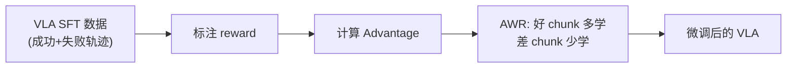

# AWR：优势加权回归

> **一句话概括**：好动作多学、差动作少学——用 advantage 加权的模仿学习。

---

## 相关阅读

- [策略梯度与 PPO](/前置知识/000a_前置知识_策略梯度与PPO) — 对比：在线策略优化
- [离线强化学习基础](/前置知识/000s_前置知识_离线强化学习基础) — AWR 所属的大类
- [Q 函数与 Value 函数](/前置知识/000o_前置知识_Q函数与Value函数) — 计算 Advantage 的基础
- [KL 散度与策略约束](/前置知识/000j_前置知识_KL散度与策略约束) — AWR 的理论动机

---

## 一、动机：为什么需要 AWR

### 1.1 问题背景

假设我们有一批数据（如人类示教），想用来训练一个比数据"平均水平"更好的策略。

**行为克隆（BC）的问题**：对所有数据一视同仁地模仿。如果数据中有好有坏：

| 数据 | BC 的做法 | 期望做法 |
|------|----------|---------|
| 好轨迹（成功） | 等权学习 | 重点学习 |
| 坏轨迹（失败） | 等权学习 | 忽略或少学 |

**PPO 的问题**：需要在线环境交互（可能不可行）。

**AWR 的定位**：结合两者优点——**用已有数据做策略提升，不需要新的环境交互**。

### 1.2 直觉

AWR 的直觉极其简单：

> **给好动作加大学习权重，给差动作降低学习权重。**

"好不好"用 advantage 来衡量：$A(s,a) > 0$ 表示比平均好。

---

## 二、核心公式

### 2.1 AWR 的 Loss Function

$$
\mathcal{L}_{\text{AWR}}(\theta) = -\mathbb{E}_{(s,a) \sim \mathcal{D}} \left[ w(s,a) \cdot \log \pi_\theta(a|s) \right]
$$

其中权重：

$$
w(s,a) = \frac{1}{Z} \exp\left(\frac{A(s,a)}{\beta}\right)
$$

**逐项拆解**：
- $(s,a) \sim \mathcal{D}$ — 从已有数据中采样（离线）
- $A(s,a) = Q(s,a) - V(s)$ — 优势函数：这个动作比状态平均价值好多少
- $\beta > 0$ — 温度参数，控制权重的"锐度"
- $\exp(A/\beta)$ — 将 advantage 转化为非负权重
- $Z$ — 归一化常数（使权重平均为 1）
- $\log \pi_\theta(a|s)$ — 策略对动作 $a$ 的对数概率

### 2.2 温度 $\beta$ 的作用

$\beta$ 控制"挑食程度"：

| $\beta$ 值 | 效果 | 极端情况 |
|-----------|------|---------|
| $\beta \to \infty$ | 所有权重趋近相等 | 退化为普通 BC |
| $\beta$ 中等 | 好动作权重大，差动作权重小 | **最常用** |
| $\beta \to 0$ | 只学最好的一个动作 | 退化为最优动作选择 |

**代入数字**：三个 $(s,a)$ 对，advantage 分别为 $[+2.0, 0, -1.5]$

$\beta = 1.0$ 时：
- 权重：$[e^2, e^0, e^{-1.5}] = [7.39, 1.0, 0.22]$
- 归一化后：$[0.86, 0.12, 0.02]$ → 好动作占 86% 权重

$\beta = 0.5$ 时：
- 权重：$[e^4, e^0, e^{-3}] = [54.6, 1.0, 0.05]$
- 归一化后：$[0.98, 0.02, 0.00]$ → 好动作占 98% 权重

$\beta$ 越小，越"挑食"。

### 2.3 为什么用 $\exp$ 而不是直接用 $A$

直接用 $A$ 作为权重有问题：
- $A < 0$ 时权重为负 → 含义不明确
- 需要额外处理负值（如 clip 到 0）

$\exp(A/\beta)$ 保证：
- 永远为正数
- advantage 越大权重越大
- 连续且可微

### 2.4 理论基础：KL 约束优化

AWR 实际上是以下约束优化问题的闭式解：

$$
\max_\pi \mathbb{E}_{(s,a) \sim \mathcal{D}} \left[ \pi(a|s) \cdot A(s,a) \right] \quad \text{s.t.} \quad D_{\text{KL}}(\pi \| \pi_{\text{data}}) \leq \epsilon
$$

**一句话**：在不偏离数据分布太远的前提下，最大化期望 advantage。

最优解正是 AWR 的形式：

$$
\pi^*(a|s) \propto \pi_{\text{data}}(a|s) \cdot \exp(A(s,a) / \beta)
$$

其中 $\beta$ 是 KL 约束的 Lagrange 乘子——$\epsilon$ 越大（允许偏离越远），$\beta$ 越小。

---

## 三、实现细节

### 3.1 如何计算 Advantage

离线数据中没有在线 Value 估计，有两种做法：

**做法一：Monte Carlo 回报**

$$
A(s_t, a_t) = \sum_{k=0}^{T-t} \gamma^k r_{t+k} - V(s_t)
$$

用完整轨迹的回报减去 baseline。

**做法二：TD(λ) 估计**

需要训练一个 Value 网络，用 TD 学习估计 $V(s)$：

$$
V(s_t) \leftarrow r_t + \gamma V(s_{t+1})
$$

然后 $A = r_t + \gamma V(s_{t+1}) - V(s_t)$。

### 3.2 训练流程

```python
# AWR 训练伪代码
for epoch in range(num_epochs):
    # 1. 从离线数据采样
    batch = sample(replay_buffer)
    
    # 2. 计算 advantage
    values = value_net(batch.states)
    advantages = batch.returns - values
    
    # 3. 计算权重
    weights = torch.exp(advantages / beta)
    weights = weights / weights.mean()  # 归一化
    
    # 4. 加权 BC loss
    log_probs = policy.log_prob(batch.actions, batch.states)
    loss = -(weights * log_probs).mean()
    
    # 5. 更新策略
    optimizer.zero_grad()
    loss.backward()
    optimizer.step()
```

### 3.3 实际训练技巧

| 技巧 | 作用 |
|------|------|
| 权重 clip（最大值限制） | 防止单个样本主导梯度 |
| 温度退火（$\beta$ 逐渐减小） | 从保守到激进 |
| 多次遍历数据 | 充分利用离线数据 |
| Value 网络预训练 | 更准确的 advantage 估计 |

---

## 四、AWR vs 其他方法

| 维度 | AWR | PPO | CQL |
|------|-----|-----|-----|
| 在线/离线 | 离线 | 在线 | 离线 |
| 需要环境？ | ❌ | ✅ | ❌ |
| 实现复杂度 | ⭐ | ⭐⭐ | ⭐⭐⭐ |
| 能超越数据？ | ❌ 不能 | ✅ 能 | 有限 |
| 训练稳定性 | ✅ 最稳定 | ⚠️ 可能崩溃 | ✅ 稳定 |
| 核心思想 | 加权模仿 | 约束优化 | Q 值惩罚 |

**AWR 适合的场景**：
- 有一批混合质量的数据（有好有坏）
- 不能做在线交互
- 要求训练稳定
- 不需要超越数据中最好的表现

---

## 五、AWR 在 VLA 中的应用

VLA 的离线 RL 微调中，AWR 是最常用的方法之一：



代表应用：[CO-RFT](/论文综述/021_CO_RFT_离线分块RL微调VLA) 在 chunk 级别使用 AWR。

---

## 六、总结

| 概念 | 核心要点 |
|------|---------|
| AWR 定义 | 用 advantage 加权的行为克隆 |
| 核心公式 | $w = \exp(A/\beta)$，好动作权重大 |
| 温度 $\beta$ | 控制"挑食程度"，越小越挑 |
| 理论基础 | KL 约束策略优化的闭式解 |
| 优点 | 简单、稳定、纯离线 |
| 缺点 | 无法超越数据上界 |
| VLA 应用 | CO-RFT、离线 VLA RL 微调 |

---

## 延伸阅读

- [离线强化学习基础](/前置知识/000s_前置知识_离线强化学习基础) — AWR 所属的大类
- [CO-RFT 精读](/论文综述/021_CO_RFT_离线分块RL微调VLA) — AWR 在 VLA 中的实际应用
- [策略梯度与 PPO](/前置知识/000a_前置知识_策略梯度与PPO) — 在线 RL 对比
