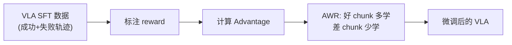

# AWR：优势加权回归

> **一句话概括**：好动作多学、差动作少学——用 advantage 加权的模仿学习。

---

## 相关阅读

- [策略梯度与 PPO](/前置知识/000a_前置知识_策略梯度与PPO) — 对比：在线策略优化
- [离线强化学习基础](/前置知识/000s_前置知识_离线强化学习基础) — AWR 所属的大类
- [Q 函数与 Value 函数](/前置知识/000o_前置知识_Q函数与Value函数) — 计算 Advantage 的基础
- [KL 散度与策略约束](/前置知识/000j_前置知识_KL散度与策略约束) — AWR 的理论动机

---

## 一、动机：为什么需要 AWR

### 1.1 问题背景

假设我们有一批数据（如人类示教），想用来训练一个比数据"平均水平"更好的策略。

**行为克隆（BC）的问题**：对所有数据一视同仁地模仿。如果数据中有好有坏：

| 数据 | BC 的做法 | 期望做法 |
|------|----------|---------|
| 好轨迹（成功） | 等权学习 | 重点学习 |
| 坏轨迹（失败） | 等权学习 | 忽略或少学 |

**PPO 的问题**：需要在线环境交互（可能不可行）。

**AWR 的定位**：结合两者优点——**用已有数据做策略提升，不需要新的环境交互**。

### 1.2 直觉

AWR 的直觉极其简单：

> **给好动作加大学习权重，给差动作降低学习权重。**

"好不好"用 advantage 来衡量：$A(s,a) > 0$ 表示比平均好。

---

## 二、核心公式

### 2.1 AWR 的 Loss Function

普通行为克隆（BC）的 loss 是 $-\mathbb{E}_{(s,a)\sim\mathcal{D}}[\log\pi_\theta(a|s)]$——对所有数据一视同仁。要让"好动作学得更用力、差动作学得更少"，最直接的办法是给每个样本的 log-likelihood 项乘上一个权重，权重由这个动作有多好（advantage）决定：

$$
\mathcal{L}_{\text{AWR}}(\theta) = -\mathbb{E}_{(s,a) \sim \mathcal{D}} \left[ w(s,a) \cdot \log \pi_\theta(a|s) \right]
$$

其中权重：

$$
w(s,a) = \frac{1}{Z} \exp\left(\frac{A(s,a)}{\beta}\right)
$$

**这两个公式在做什么**：第一个公式是加权模仿学习的 loss——最小化它等价于最大化 $\sum w(s,a)\log\pi_\theta(a|s)$，也就是让权重大的样本获得更高概率；第二个公式定义权重具体怎么算，用 advantage 把"好"翻译成一个正数。

> **一句话**：这就是普通的模仿学习 loss，只是给每条数据乘了一个"这个动作有多好"的权重——好动作乘的数大，梯度贡献就大；差动作乘的数接近 0，几乎不参与更新。

**逐项拆解**：

| 符号 | 数学含义 | 在 AWR 中具体是什么 | 直觉 |
|------|---------|-------------------|------|
| $(s,a) \sim \mathcal{D}$ | 从数据集 $\mathcal{D}$ 中采样一对状态动作 | 离线数据集里的一条 (state, action) 记录，如示教轨迹里的一步 | "看一条历史数据" |
| $\log \pi_\theta(a|s)$ | 策略网络对动作 $a$ 的对数概率 | 当前策略网络在状态 $s$ 下给动作 $a$ 打的对数似然分数 | "策略觉得这个动作有多可能被选中" |
| $A(s,a) = Q(s,a)-V(s)$ | 优势函数 | 这个动作比状态平均水平好多少，可参考[Q函数与Value函数](/前置知识/000o_前置知识_Q函数与Value函数) | "这个动作比'随便选'好多少" |
| $\beta > 0$ | 温度参数（超参数） | 控制权重分布的"锐度"，典型取值 0.05～1.0 | "挑食程度旋钮" |
| $\exp(A/\beta)$ | 指数函数 | 把可正可负的 advantage 映射成永远为正的数 | "把'好坏程度'变成'学习力度'" |
| $Z$ | 归一化常数 | $Z = \mathbb{E}_{(s,a)\sim\mathcal{D}}[\exp(A(s,a)/\beta)]$，使权重期望为 1 | "让权重的平均力度保持在正常水平，不整体放大或缩小 loss" |
| $w(s,a)$ | 最终权重 | 上面计算出的标量，直接乘进 loss | "这条数据该被学多用力" |

**代入数字**：假设数据集里有 3 条样本，advantage 分别是 $A = [+2.0, 0, -1.5]$，取 $\beta = 1.0$：
- 未归一化权重：$\exp(2.0) = 7.39$，$\exp(0) = 1.0$，$\exp(-1.5) = 0.22$
- 归一化常数 $Z = (7.39+1.0+0.22)/3 = 2.87$
- 归一化后权重：$w = [7.39/2.87,\ 1.0/2.87,\ 0.22/2.87] = [2.57,\ 0.35,\ 0.08]$

假设三条样本的 $\log\pi_\theta(a|s) = [-0.5, -0.5, -0.5]$（初始策略对三个动作给的概率一样），则：

$$
\mathcal{L}_{\text{AWR}} = -\frac{1}{3}\big[2.57\times(-0.5) + 0.35\times(-0.5) + 0.08\times(-0.5)\big] = -\frac{1}{3}\times(-1.5) = 0.5
$$

梯度下降会优先增大第一条样本（好动作，权重 2.57）的概率，对第三条样本（差动作，权重仅 0.08）几乎不施加压力——这正是"好动作多学、差动作少学"的效果。

### 2.2 温度 $\beta$ 的作用

$\beta$ 控制"挑食程度"：

| $\beta$ 值 | 效果 | 极端情况 |
|-----------|------|---------|
| $\beta \to \infty$ | 所有权重趋近相等 | 退化为普通 BC |
| $\beta$ 中等 | 好动作权重大，差动作权重小 | **最常用** |
| $\beta \to 0$ | 只学最好的一个动作 | 退化为最优动作选择 |

**代入数字**：三个 $(s,a)$ 对，advantage 分别为 $[+2.0, 0, -1.5]$

$\beta = 1.0$ 时：
- 权重：$[e^2, e^0, e^{-1.5}] = [7.39, 1.0, 0.22]$
- 归一化后：$[0.86, 0.12, 0.02]$ → 好动作占 86% 权重

$\beta = 0.5$ 时：
- 权重：$[e^4, e^0, e^{-3}] = [54.6, 1.0, 0.05]$
- 归一化后：$[0.98, 0.02, 0.00]$ → 好动作占 98% 权重

$\beta$ 越小，越"挑食"。

### 2.3 为什么用 $\exp$ 而不是直接用 $A$

直接用 $A$ 作为权重有问题：
- $A < 0$ 时权重为负 → 含义不明确
- 需要额外处理负值（如 clip 到 0）

$\exp(A/\beta)$ 保证：
- 永远为正数
- advantage 越大权重越大
- 连续且可微

### 2.4 理论基础：KL 约束优化

2.3 节解释了为什么权重要用 $\exp(A/\beta)$ 这个形式，但没说明它从何而来。事实上它不是拍脑袋设计的，而是一个约束优化问题的精确解——如果把"提升策略"表述为"在不偏离原始数据分布太远的前提下最大化 advantage"，数学上唯一的最优解就正好是 AWR 的权重形式：

$$
\max_\pi \mathbb{E}_{(s,a) \sim \mathcal{D}} \left[ \pi(a|s) \cdot A(s,a) \right] \quad \text{s.t.} \quad D_{\text{KL}}(\pi \| \pi_{\text{data}}) \leq \epsilon
$$

> **一句话**：在不偏离数据分布太远的前提下，最大化期望 advantage。

**逐项拆解**：

| 符号 | 含义 | 具体是什么 |
|------|------|-----------|
| $\max_\pi$ | 对策略 $\pi$ 求最大化 | 在所有可能的策略中找一个 |
| $\mathbb{E}_{(s,a)\sim\mathcal{D}}[\pi(a|s)\cdot A(s,a)]$ | 期望目标 | 数据集中的状态下，新策略给"好动作"分配的概率越高越好 |
| $D_{\text{KL}}(\pi \| \pi_{\text{data}})$ | 新策略 $\pi$ 与数据行为策略 $\pi_{\text{data}}$ 之间的 [KL 散度](/前置知识/000j_前置知识_KL散度与策略约束) | 衡量新策略偏离原始数据分布的程度 |
| $\epsilon$ | KL 约束的上限（超参数） | 允许偏离数据分布的最大幅度 |
| s.t. | subject to，"约束条件是" | 优化时必须满足右边的不等式 |

**为什么需要这个约束**：如果没有 KL 约束，直接最大化 $\mathbb{E}[\pi(a|s) A(s,a)]$ 会让策略把所有概率质量都堆到 advantage 最大的那个动作上（退化成贪心策略），这在离线数据有限、Q/V 估计本身有误差的情况下非常危险——策略可能"自信地"选择一个实际上被高估的动作。KL 约束强制新策略不能离数据行为太远，起到正则化作用。

用 Lagrange 乘子法求解这个带约束的优化问题，可以证明最优解具有如下形式：

$$
\pi^*(a|s) \propto \pi_{\text{data}}(a|s) \cdot \exp(A(s,a) / \beta)
$$

**这个公式在做什么**：给出上面约束优化问题的解析解——最优策略就是"原始数据分布乘以一个由 advantage 决定的指数权重"。

**逐项拆解**：

| 符号 | 含义 | 具体是什么 |
|------|------|-----------|
| $\pi^*(a|s)$ | 最优策略 | 约束优化问题的解 |
| $\propto$ | 正比于 | 两边相差一个归一化常数（也就是 2.1 节的 $Z$） |
| $\pi_{\text{data}}(a|s)$ | 数据的行为策略 | 产生离线数据集 $\mathcal{D}$ 的原始策略（人类示教或历史策略），实践中用数据本身近似 |
| $\beta$ | KL 约束对应的 Lagrange 乘子 | 数学上由 $\epsilon$ 决定，实践中直接当超参数调 |

**代入数字**：延续 2.1 节的例子，$\pi_{\text{data}}$ 对三个动作给出的概率（比如均匀）都是 $1/3$，advantage 是 $[+2.0, 0, -1.5]$，$\beta=1$：
$$
\pi^* \propto [1/3 \times e^{2.0},\ 1/3 \times e^{0},\ 1/3 \times e^{-1.5}] = [0.333\times 7.39,\ 0.333,\ 0.333\times0.22] = [2.46,\ 0.33,\ 0.07]
$$
归一化后 $\pi^* \approx [0.86, 0.12, 0.02]$——最优策略把 86% 的概率放在最好的那个动作上，这和 2.2 节 $\beta=1.0$ 算出的权重分布是一致的，说明"用 advantage 加权模仿"确实就是在逼近这个约束优化问题的解。

**为什么是这个形式**：$\epsilon$ 越大表示允许新策略偏离数据分布越远，对应的 Lagrange 乘子 $\beta$ 就越小（约束越松，惩罚力度越低），这与 2.2 节"$\beta$ 越小越挑食"的结论完全吻合——$\beta\to 0$ 时几乎不受 KL 约束，策略可以自由地把概率集中到最优动作上；$\beta\to\infty$ 时约束极严，策略几乎不能偏离 $\pi_{\text{data}}$，退化为普通 BC。

---

## 三、实现细节

### 3.1 如何计算 Advantage

离线数据中没有在线 Value 估计，有两种做法：

**做法一：Monte Carlo 回报**

离线数据里没有一个在线环境让我们随时查询 $Q(s,a)$，但轨迹是完整记录下来的，所以可以直接把这条轨迹后续实际拿到的奖励加总，作为 $Q(s_t,a_t)$ 的估计，再减去一个 baseline 得到 advantage：

$$
A(s_t, a_t) = \sum_{k=0}^{T-t} \gamma^k r_{t+k} - V(s_t)
$$

> **一句话**：把这条轨迹从当前时刻往后实际拿到的所有奖励折扣累加，减去"这个状态平均能拿多少"，剩下的就是这个动作的"超额贡献"。

**逐项拆解**：

| 符号 | 含义 | 具体是什么 |
|------|------|-----------|
| $T$ | 轨迹总长度 | 这条示教/历史轨迹一共走了多少步 |
| $k$ | 从当前时刻 $t$ 往后数的步数偏移 | 求和变量，从 0 累加到 $T-t$（轨迹结束） |
| $r_{t+k}$ | 轨迹中第 $t+k$ 步实际拿到的奖励 | 记录在离线数据里的真实标量奖励 |
| $\gamma \in (0,1)$ | 折扣因子 | 典型值 0.99，让远期奖励的权重衰减 |
| $\sum_{k=0}^{T-t}\gamma^k r_{t+k}$ | 从 $t$ 时刻到轨迹结束的折扣累计回报 | 对 $Q(s_t,a_t)$ 的 Monte Carlo 估计 |
| $V(s_t)$ | 状态 $s_t$ 的价值估计（baseline） | 由一个单独训练的 Value 网络给出 |

**代入数字**：假设轨迹从 $t$ 时刻开始一共还剩 3 步（$T-t=2$），奖励依次是 $r_t=1, r_{t+1}=0, r_{t+2}=5$（比如最后一步任务成功给了大奖励），$\gamma=0.9$，$V(s_t)=2.0$：
$$
\sum_{k=0}^{2}\gamma^k r_{t+k} = 1\times1 + 0.9\times0 + 0.81\times5 = 1 + 0 + 4.05 = 5.05
$$
$$
A(s_t,a_t) = 5.05 - 2.0 = 3.05
$$
这是一个正的、较大的 advantage，说明这个动作所在的轨迹表现远好于该状态的平均水平，在 2.1 节的权重公式里会拿到很高的权重。

**为什么是这个形式**：用完整轨迹的真实回报（而不是单步奖励）作为 $Q$ 的估计，是因为离线数据没有额外的环境可以查询，Monte Carlo 回报是唯一不需要 bootstrap、只依赖已记录数据就能算出的无偏估计；代价是方差较大（一条轨迹的随机性会直接反映在估计里），这也是下面"做法二"用 TD 估计来降低方差的动机。

**做法二：TD(λ) 估计**

Monte Carlo 回报方差大，且必须等到轨迹结束才能算。另一种做法是训练一个 Value 网络，用自举（bootstrap）的方式只看一步转移就更新价值估计：

$$
V(s_t) \leftarrow r_t + \gamma V(s_{t+1})
$$

> **一句话**：不用等轨迹跑完，只用"这一步的奖励 + 下一状态的价值估计"就能更新对当前状态价值的判断。

**逐项拆解**：

| 符号 | 含义 | 具体是什么 |
|------|------|-----------|
| $\leftarrow$ | 更新/赋值操作 | 训练时用右边的目标值去拟合左边的 Value 网络输出（TD target） |
| $r_t$ | 当前步的即时奖励 | 数据中记录的真实奖励 |
| $\gamma V(s_{t+1})$ | 折扣后的下一状态价值估计 | 用 Value 网络对 $s_{t+1}$ 的当前估计，而不是真实的未来回报 |

**代入数字**：延续上例，$r_t=1$，$\gamma=0.9$，假设 Value 网络当前对 $s_{t+1}$ 的估计是 $V(s_{t+1})=4.0$：
$$
\text{TD target} = 1 + 0.9\times4.0 = 1+3.6 = 4.6
$$
如果 Value 网络当前输出 $V(s_t)=2.0$，那么 TD 误差是 $4.6-2.0=2.6$，训练时会用这个误差（通常是其平方）作为 loss 去更新 Value 网络参数，让 $V(s_t)$ 逐渐逼近 4.6。

然后 $A = r_t + \gamma V(s_{t+1}) - V(s_t)$，也就是把上面算出的 TD target 减去 baseline $V(s_t)$：$A = 4.6 - 2.0 = 2.6$。

**为什么是这个形式**：TD 估计只依赖"一步真实奖励 + 下一状态的价值估计"而不是整条轨迹，因此方差远小于 Monte Carlo（不受轨迹后续随机性的影响），但代价是引入了偏差（$V(s_{t+1})$ 本身是估计值，可能不准）。这是强化学习中经典的偏差-方差权衡，TD(λ) 的 $\lambda$ 参数就是用来在两种估计之间插值调节的。

### 3.2 训练流程

```python
# AWR 训练伪代码
for epoch in range(num_epochs):
    # 1. 从离线数据采样
    batch = sample(replay_buffer)
    
    # 2. 计算 advantage
    values = value_net(batch.states)
    advantages = batch.returns - values
    
    # 3. 计算权重
    weights = torch.exp(advantages / beta)
    weights = weights / weights.mean()  # 归一化
    
    # 4. 加权 BC loss
    log_probs = policy.log_prob(batch.actions, batch.states)
    loss = -(weights * log_probs).mean()
    
    # 5. 更新策略
    optimizer.zero_grad()
    loss.backward()
    optimizer.step()
```

### 3.3 实际训练技巧

| 技巧 | 作用 |
|------|------|
| 权重 clip（最大值限制） | 防止单个样本主导梯度 |
| 温度退火（$\beta$ 逐渐减小） | 从保守到激进 |
| 多次遍历数据 | 充分利用离线数据 |
| Value 网络预训练 | 更准确的 advantage 估计 |

---

## 四、AWR vs 其他方法

| 维度 | AWR | PPO | CQL |
|------|-----|-----|-----|
| 在线/离线 | 离线 | 在线 | 离线 |
| 需要环境？ | ❌ | ✅ | ❌ |
| 实现复杂度 | ⭐ | ⭐⭐ | ⭐⭐⭐ |
| 能超越数据？ | ❌ 不能 | ✅ 能 | 有限 |
| 训练稳定性 | ✅ 最稳定 | ⚠️ 可能崩溃 | ✅ 稳定 |
| 核心思想 | 加权模仿 | 约束优化 | Q 值惩罚 |

**AWR 适合的场景**：
- 有一批混合质量的数据（有好有坏）
- 不能做在线交互
- 要求训练稳定
- 不需要超越数据中最好的表现

---

## 五、AWR 在 VLA 中的应用

VLA 的离线 RL 微调中，AWR 是最常用的方法之一：


```mermaid
flowchart LR
    A["VLA SFT 数据<br>(成功+失败轨迹)"] --> B["标注 reward"]
    B --> C["计算 Advantage"]
    C --> D["AWR: 好 chunk 多学<br>差 chunk 少学"]
    D --> E["微调后的 VLA"]
```

代表应用：[CO-RFT](/论文综述/021_CO_RFT_离线分块RL微调VLA) 在 chunk 级别使用 AWR。

---

## 六、总结

| 概念 | 核心要点 |
|------|---------|
| AWR 定义 | 用 advantage 加权的行为克隆 |
| 核心公式 | $w = \exp(A/\beta)$，好动作权重大 |
| 温度 $\beta$ | 控制"挑食程度"，越小越挑 |
| 理论基础 | KL 约束策略优化的闭式解 |
| 优点 | 简单、稳定、纯离线 |
| 缺点 | 无法超越数据上界 |
| VLA 应用 | CO-RFT、离线 VLA RL 微调 |

---

## 延伸阅读

- [离线强化学习基础](/前置知识/000s_前置知识_离线强化学习基础) — AWR 所属的大类
- [CO-RFT 精读](/论文综述/021_CO_RFT_离线分块RL微调VLA) — AWR 在 VLA 中的实际应用
- [策略梯度与 PPO](/前置知识/000a_前置知识_策略梯度与PPO) — 在线 RL 对比
