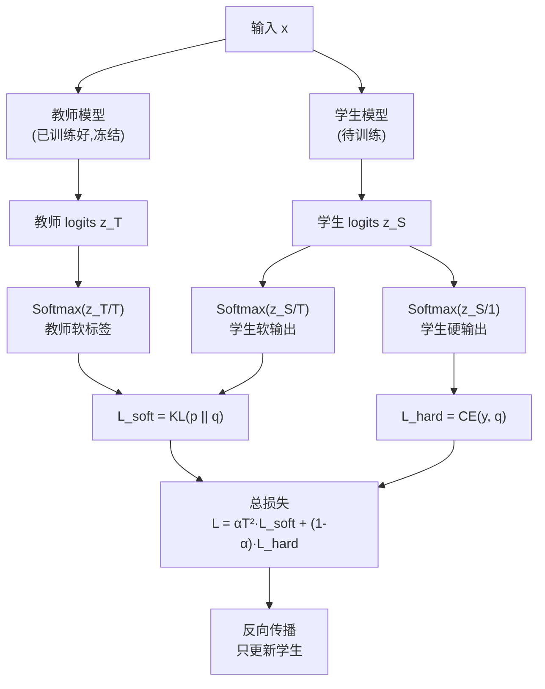

# 前置知识：知识蒸馏（Knowledge Distillation）

> **一句话**：知识蒸馏让一个小型"学生"模型通过模仿大型"教师"模型的软输出（soft labels）来学习，因为软输出中包含了比硬标签更丰富的类间关系信息——这就是"暗知识（Dark Knowledge）"。

**前置概念**：
- [KL 散度与策略约束](/前置知识/000j_前置知识_KL散度与策略约束) — 蒸馏损失的核心数学工具

---

## 贯穿全文的例子

> 场景：一个图像分类模型，输入手写数字图片，输出 10 个类别的概率。
>
> 教师模型（ResNet-152，参数量 60M）对一张"7"的图片输出：
> - P(7) = 0.85, P(1) = 0.08, P(9) = 0.05, P(2) = 0.01, 其他 ≈ 0.001
>
> 硬标签（one-hot）只告诉你"答案是 7"，但教师的软输出还告诉你："7 和 1 长得有点像（笔画都是一竖），7 和 9 也有相似性（上面都有弧线），但 7 和 0 完全不像。"
>
> 学生模型（小型 CNN，参数量 1M）如果只学硬标签，就丢失了这些类间关系。但如果学教师的软输出，就能继承这些"暗知识"。

---

## 一、为什么需要知识蒸馏

### 1.1 模型压缩的需求

大模型（如 GPT-4、ResNet-152）效果好但推理慢、内存大，无法部署到边缘设备。直接训练小模型通常效果差。

**矛盾**：想要大模型的效果 + 小模型的速度。

### 1.2 为什么"教"比"直接学"好

直接用硬标签训练小模型：
- 标签只有一个正确答案（one-hot），信息量极少
- 10 类分类中，一个 one-hot 标签只有 $\log_2(10) \approx 3.3$ bits 信息

用教师软输出训练小模型：
- 10 个概率值，每个都在 [0,1] 之间，包含更丰富的信息
- 特别是那些"非零但很小"的概率——它们编码了类间相似性

---

## 二、核心方法：Hinton 的知识蒸馏（2015）

### 2.1 温度缩放（Temperature Scaling）

标准 softmax 输出的概率往往非常"尖锐"——最大类概率接近 1，其他接近 0。这不利于学生学习类间关系。

**解决办法**：引入温度参数 $T$，使输出更"平滑"：

$$
p_i = \frac{\exp(z_i / T)}{\sum_j \exp(z_j / T)}
$$

**逐项拆解**：
- $z_i$：模型倒数第二层的输出（logit），未经 softmax
- $T$：温度。$T=1$ 是标准 softmax；$T>1$ 让分布更平坦；$T \to \infty$ 趋向均匀分布
- 分母：归一化常数，确保概率和为 1

**为什么要"加温"**：温度高时，原本很小的概率会被放大，让学生更容易"看到"教师对非最大类的判断。

**代入数字**：假设教师对某张"7"图片的 logits 为 $z = [0.1, 1.5, 0.3, 0.1, 0.0, 0.1, 0.0, 8.0, 0.0, 1.0]$

$T=1$（标准 softmax）：
$$
p_7 = \frac{e^{8.0}}{e^{0.1}+e^{1.5}+...+e^{8.0}+...} \approx 0.997
$$
几乎所有概率都集中在类 7，其他类 ≈ 0。学生学不到什么有用的类间信息。

$T=5$（加温 softmax）：
$$
p_i \propto \exp(z_i / 5) = [e^{0.02}, e^{0.3}, e^{0.06}, e^{0.02}, e^{0}, e^{0.02}, e^{0}, e^{1.6}, e^{0}, e^{0.2}]
$$
$$
p_7 = \frac{e^{1.6}}{\text{sum}} \approx \frac{4.95}{12.5} \approx 0.40
$$
$$
p_1 = \frac{e^{0.3}}{12.5} \approx 0.108, \quad p_9 = \frac{e^{0.2}}{12.5} \approx 0.098
$$

现在"7 和 1 相似"、"7 和 9 相似"这些信息就显著了，学生可以学到。

### 2.2 蒸馏损失函数

总损失是两部分的加权和：

$$
\mathcal{L} = (1-\alpha) \cdot \mathcal{L}_{\text{hard}} + \alpha \cdot T^2 \cdot \mathcal{L}_{\text{soft}}
$$

其中：

$$
\mathcal{L}_{\text{hard}} = -\sum_i y_i \log q_i^{(T=1)}
$$

$$
\mathcal{L}_{\text{soft}} = D_{\text{KL}}\left(p^{(T)} \| q^{(T)}\right) = \sum_i p_i^{(T)} \log \frac{p_i^{(T)}}{q_i^{(T)}}
$$

**逐项拆解**：
- $y_i$：真实硬标签（one-hot）
- $q_i^{(T)}$：学生模型在温度 $T$ 下的 softmax 输出
- $p_i^{(T)}$：教师模型在温度 $T$ 下的 softmax 输出
- $\alpha$：平衡系数，通常 0.5~0.9
- $T^2$：缩放因子，补偿温度增大带来的梯度缩小效应

**为什么乘 $T^2$**：当 $T$ 增大时，softmax 梯度大约缩小 $1/T^2$ 倍。乘以 $T^2$ 保持梯度在相同量级。

**代入数字**（$T=5$, $\alpha=0.7$）：

假设教师对类 7 的加温概率为 $p_7^{(5)} = 0.40$，学生为 $q_7^{(5)} = 0.30$：

$$
\text{KL 中类 7 的贡献} = 0.40 \times \log\frac{0.40}{0.30} = 0.40 \times 0.288 = 0.115
$$

$$
\mathcal{L}_{\text{soft}} = \sum_i p_i \log(p_i/q_i) \approx 0.35 \quad \text{(累加所有类)}
$$

$$
\mathcal{L} = 0.3 \times \mathcal{L}_{\text{hard}} + 0.7 \times 25 \times 0.35 = 0.3 \times 0.5 + 6.125 = 6.275
$$

### 2.3 Teacher-Student 训练流程

---

## 三、为什么软标签包含更多信息——"暗知识"

### 3.1 Hinton 的核心洞察

硬标签：$y = [0, 0, 0, 0, 0, 0, 0, 1, 0, 0]$ — 只说"是 7"

软标签：$p = [0.001, 0.08, 0.01, 0.003, 0.001, 0.002, 0.001, 0.85, 0.002, 0.05]$

软标签额外告诉你：
- 7 和 1 有 8% 的相似度（都有竖笔画）
- 7 和 9 有 5% 的相似度（上部结构相似）
- 7 和 0 几乎无关（0.1%）

这些类间关系就是"Dark Knowledge"——它不在硬标签中显现，但编码在教师的输出分布里。

### 3.2 信息论视角

一个 $K$ 类分类的硬标签信息量：$\log_2 K$ bits（对 10 类 ≈ 3.3 bits）

教师软标签的信息量（用熵衡量）：
$$
H(p) = -\sum_i p_i \log_2 p_i
$$

对上面的例子：$H(p) \approx 1.2$ bits（因为分布集中），但相比 one-hot 的 0 bits 熵，**每个训练样本传递了更多的梯度信号**给学生。

### 3.3 与标签平滑的关系

标签平滑（Label Smoothing）是一种"穷人版蒸馏"：

$$
y_{\text{smooth}} = (1-\epsilon) \cdot y_{\text{one-hot}} + \epsilon \cdot \frac{1}{K}
$$

但标签平滑对所有非正确类施加**相同**的概率 $\epsilon/K$，而教师软标签对不同类给出**不同**的概率。蒸馏包含了类间相似性结构，标签平滑没有。

---

## 四、知识蒸馏在持续学习中的应用

### 4.1 LwF（Learning without Forgetting）

在持续学习中，"旧教师"就是学习新任务之前的模型自己：

$$
\mathcal{L}_{\text{LwF}} = \mathcal{L}_{\text{new task}} + \lambda \cdot D_{\text{KL}}\left(p_{\text{old model}}^{(T)} \| q_{\text{current}}^{(T)}\right)
$$

**含义**：在学新任务的同时，要求当前模型在旧数据上的输出不要偏离"旧版自己"太远。

### 4.2 Dark Experience Replay

将蒸馏思想与 [经验回放](/前置知识/000r_前置知识_Replay_Buffer_经验回放) 结合：存储旧数据时，不只存 $(x, y)$，还存当时模型的 logits $z_{\text{old}}$。回放时用 KL 散度对齐当前 logits 和旧 logits。

这比只回放硬标签有效得多：
| 回放方式 | 存储 | 损失 | 效果 |
|---------|------|------|------|
| 经典回放 | $(x, y)$ | 交叉熵 | 基线 |
| Dark Experience | $(x, y, z_{\text{old}})$ | 交叉熵 + KL | 显著更好 |

### 4.3 策略蒸馏（Policy Distillation）在 VLA 中的应用

对于机器人策略（VLA），蒸馏的"输出"不是分类 logits，而是动作分布：

$$
\mathcal{L}_{\text{policy distill}} = D_{\text{KL}}\left(\pi_{\text{teacher}}(\cdot|s) \| \pi_{\text{student}}(\cdot|s)\right)
$$

典型场景：
- 把大型 VLA（7B）的能力蒸馏到小型 VLA（1B）用于部署
- 把 RL 训练后的在线策略蒸馏回行为克隆模型（稳定性更好）

---

## 五、总结

| 维度 | 说明 |
|------|------|
| 核心思想 | 学教师的软输出分布，而非硬标签 |
| 关键超参 | 温度 $T$（2~20），平衡系数 $\alpha$（0.5~0.9） |
| 暗知识 | 软标签中编码的类间关系信息 |
| 主要用途 | 模型压缩、持续学习（LwF / DER）、策略迁移 |
| 局限 | 教师必须足够好；温度选择敏感；不适合教师-学生差距过大的情况 |

---

## 延伸阅读

- [KL 散度与策略约束](/前置知识/000j_前置知识_KL散度与策略约束) — 蒸馏损失的数学基础
- [Replay Buffer](/前置知识/000r_前置知识_Replay_Buffer_经验回放) — Dark Experience Replay 的存储基础
