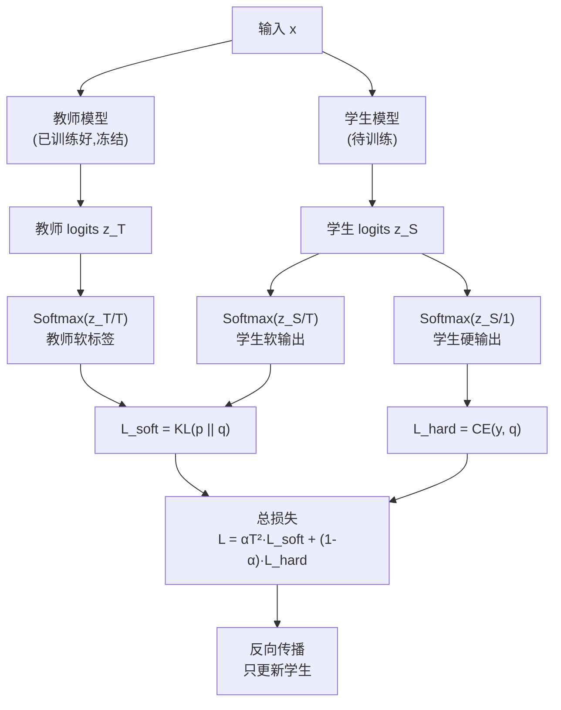

# 前置知识：知识蒸馏（Knowledge Distillation）

> **一句话**：知识蒸馏让一个小型"学生"模型通过模仿大型"教师"模型的软输出（soft labels）来学习，因为软输出中包含了比硬标签更丰富的类间关系信息——这就是"暗知识（Dark Knowledge）"。

**前置概念**：
- [KL 散度与策略约束](/前置知识/000j_前置知识_KL散度与策略约束) — 蒸馏损失的核心数学工具

---

## 贯穿全文的例子

> 场景：一个图像分类模型，输入手写数字图片，输出 10 个类别的概率。
>
> 教师模型（ResNet-152，参数量 60M）对一张"7"的图片输出：
> - P(7) = 0.85, P(1) = 0.08, P(9) = 0.05, P(2) = 0.01, 其他 ≈ 0.001
>
> 硬标签（one-hot）只告诉你"答案是 7"，但教师的软输出还告诉你："7 和 1 长得有点像（笔画都是一竖），7 和 9 也有相似性（上面都有弧线），但 7 和 0 完全不像。"
>
> 学生模型（小型 CNN，参数量 1M）如果只学硬标签，就丢失了这些类间关系。但如果学教师的软输出，就能继承这些"暗知识"。

---

## 一、为什么需要知识蒸馏

### 1.1 模型压缩的需求

大模型（如 GPT-4、ResNet-152）效果好但推理慢、内存大，无法部署到边缘设备。直接训练小模型通常效果差。

**矛盾**：想要大模型的效果 + 小模型的速度。

### 1.2 为什么"教"比"直接学"好

直接用硬标签训练小模型：
- 标签只有一个正确答案（one-hot），信息量极少
- 10 类分类中，一个 one-hot 标签只有 $\log_2(10) \approx 3.3$ bits 信息

用教师软输出训练小模型：
- 10 个概率值，每个都在 [0,1] 之间，包含更丰富的信息
- 特别是那些"非零但很小"的概率——它们编码了类间相似性

---

## 二、核心方法：Hinton 的知识蒸馏（2015）

### 2.1 温度缩放（Temperature Scaling）

标准 softmax 输出的概率往往非常"尖锐"——最大类概率接近 1，其他接近 0。这不利于学生学习类间关系。

**解决办法**：引入温度参数 $T$，使输出更"平滑"：

$$
p_i = \frac{\exp(z_i / T)}{\sum_j \exp(z_j / T)}
$$

**这个公式在做什么**：把模型原始输出重新"调温"再做 softmax——温度越高，分布越平坦，原本被压到接近 0 的小概率会被放大，暴露出教师对"非最大类"的态度。

::: details 📐 公式详解（点击展开）

| 子表达式 | 它是谁 | 它在干嘛 |
|---------|--------|---------|
| $z_i$ | **原始判断** | 模型倒数第二层的输出（logit），还没经过 softmax 归一化 |
| $z_i / T$ | **调温后的判断** | 除以温度 $T$，$T$ 越大，各类之间的差距被压得越小 |
| $\exp(z_i/T)$ | **放大器** | 把调温后的判断变成正数，并放大相对差异 |
| $\sum_j \exp(z_j/T)$ | **归一化常数** | 所有类的放大值加总，确保最终概率和为 1 |

**用人话读**："把每个类的原始得分先除以温度再算 softmax——温度越高，最终算出的概率分布越平，各个类之间的差距越不明显。"

**为什么是这个形式**：$T=1$ 是标准 softmax，$T>1$ 让分布更平坦，$T \to \infty$ 趋向均匀分布。温度升高时，原本很小的概率会被放大，让学生更容易"看到"教师对非最大类的判断。

**代入数字**：假设教师对某张"7"图片的 logits 为 $z = [0.1, 1.5, 0.3, 0.1, 0.0, 0.1, 0.0, 8.0, 0.0, 1.0]$。

$T=1$（标准 softmax）：
$$
p_7 = \frac{e^{8.0}}{e^{0.1}+e^{1.5}+...+e^{8.0}+...} \approx 0.997
$$
几乎所有概率都集中在类 7，其他类 ≈ 0。学生学不到什么有用的类间信息。

$T=5$（加温 softmax）：
$$
p_i \propto \exp(z_i / 5) = [e^{0.02}, e^{0.3}, e^{0.06}, e^{0.02}, e^{0}, e^{0.02}, e^{0}, e^{1.6}, e^{0}, e^{0.2}]
$$
$$
p_7 = \frac{e^{1.6}}{\text{sum}} \approx \frac{4.95}{12.5} \approx 0.40
$$
$$
p_1 = \frac{e^{0.3}}{12.5} \approx 0.108, \quad p_9 = \frac{e^{0.2}}{12.5} \approx 0.098
$$

现在"7 和 1 相似"、"7 和 9 相似"这些信息就显著了，学生可以学到。
:::

### 2.2 蒸馏损失函数

只让学生模仿教师的软输出（soft label）有个风险：如果教师本身犯错（比如小概率误判），学生会把错误也学过去，且软标签的监督信号相对"温和"，收敛可能不稳定。因此实践中把"学习真实标签"和"学习教师的软输出"结合起来，各贡献一部分梯度：

$$
\mathcal{L} = (1-\alpha) \cdot \mathcal{L}_{\text{hard}} + \alpha \cdot T^2 \cdot \mathcal{L}_{\text{soft}}
$$

**这个公式在做什么**：把"对真实答案负责"和"模仿老师看待所有选项的态度"两股力量按比例 $\alpha$ 混合成一个总损失，同时用 $T^2$ 补偿因为加温而变弱的梯度。

::: details 📐 公式详解（点击展开）

| 子表达式 | 它是谁 | 它在干嘛 |
|---------|--------|---------|
| $\mathcal{L}_{\text{hard}}$ | **老实交代** | 逼着学生对真实硬标签给出高概率，是学生最终部署时真正依赖的行为 |
| $\mathcal{L}_{\text{soft}}$ | **模仿老师** | 逼着学生在加温后的分布上贴近教师，传递类间相似性这部分"暗知识" |
| $(1-\alpha)$ / $\alpha$ | **力气分配器** | 决定"对真实答案负责"和"模仿老师"两股力气各占多少比重 |
| $T^2$ | **梯度补偿器** | 温度越高梯度越弱，乘上 $T^2$ 把软标签这部分的梯度量级拉回正常水平 |

**用人话读**："总损失 = 一部分力气用来对真实答案负责，另一部分力气（放大 $T^2$ 倍）用来模仿老师看待所有选项的态度。"

**为什么是这个形式**：只学硬标签丢失类间关系，只学软标签又怕教师犯错被完全继承、且软监督信号偏"温和"导致收敛不稳定，所以两者按 $\alpha$ 加权结合，各取所长。
:::

其中 $\mathcal{L}_{\text{hard}}$ 和 $\mathcal{L}_{\text{soft}}$ 的具体形式分别是：

$$
\mathcal{L}_{\text{hard}} = -\sum_i y_i \log q_i^{(T=1)}
$$

**这个公式在做什么**：标准的交叉熵损失，只是显式标注了用的是学生在标准温度 $T=1$ 下的输出——也就是学生部署时真正会用的那个分布。

::: details 📐 公式详解（点击展开）

| 子表达式 | 它是谁 | 它在干嘛 |
|---------|--------|---------|
| $y_i$ | **真实答案** | 硬标签 one-hot 向量的第 $i$ 位，正确类为 1，其余为 0 |
| $q_i^{(T=1)}$ | **学生的真实输出** | 学生在标准温度下对类 $i$ 的 softmax 输出，是学生最终会用的分布 |
| $-\sum_i y_i \log(\cdot)$ | **打分器** | 只有 $y_i=1$ 的那一项存活，等价于 $-\log q_{\text{正确类}}^{(T=1)}$ |

**用人话读**："学生对真实答案给出的概率越高，这一项 loss 越小。"

**为什么是这个形式**：这就是普通分类任务的标准交叉熵，保证学生在部署时（$T=1$）的行为仍然对齐真实标签，不会因为专注模仿老师而忘了"标准答案是什么"。
:::

$$
\mathcal{L}_{\text{soft}} = D_{\text{KL}}\left(p^{(T)} \| q^{(T)}\right) = \sum_i p_i^{(T)} \log \frac{p_i^{(T)}}{q_i^{(T)}}
$$

**这个公式在做什么**：用[KL 散度](/前置知识/000j_前置知识_KL散度与策略约束)衡量学生在加温分布上和教师差多少，逼着学生把类间相似性这部分"暗知识"学过去。

::: details 📐 公式详解（点击展开）

| 子表达式 | 它是谁 | 它在干嘛 |
|---------|--------|---------|
| $p_i^{(T)}$ | **老师的加温态度** | 教师在温度 $T$ 下对类 $i$ 的 softmax 输出，$T$ 通常取 2～20 |
| $q_i^{(T)}$ | **学生的加温态度** | 学生在同样温度 $T$ 下对类 $i$ 的 softmax 输出 |
| $\log\frac{p_i^{(T)}}{q_i^{(T)}}$ | **差距放大镜** | 学生和老师在这一类上态度差多少，比值越偏离 1 差距越大 |
| $\sum_i p_i^{(T)} \log(\cdot)$ | **加权总账** | 按教师认为重要的程度（$p_i$ 大小）加权汇总所有类的差距 |

**用人话读**："对每一类都算一下学生和老师的态度差多少，按老师觉得这一类有多重要来加权，全部加起来就是模仿差距。"

**为什么是这个形式**：KL 散度是衡量两个概率分布差异的标准工具，且它对"教师认为重要的类"（$p_i$ 较大）赋予更大权重，天然聚焦在教师最有信心的判断上，而不会被那些教师自己也不确定的类干扰太多。
:::

**代入数字**（$T=5$, $\alpha=0.7$）：延续 2.1 节的例子，假设教师和学生在 $T=5$ 下对 10 个类的加温概率分别是：

| 类别 | 教师 $p_i^{(5)}$ | 学生 $q_i^{(5)}$ | $p_i \log(p_i/q_i)$ |
|------|------|------|------|
| 7 | 0.40 | 0.30 | $0.40\times\log(0.40/0.30)=0.40\times0.288=0.115$ |
| 1 | 0.108 | 0.15 | $0.108\times\log(0.108/0.15)=0.108\times(-0.329)=-0.036$ |
| 9 | 0.098 | 0.10 | $0.098\times\log(0.098/0.10)=0.098\times(-0.020)=-0.002$ |
| 其他 7 类（均摊） | 各 0.0563 | 各 0.0637 | 每类 $0.0563\times\log(0.0563/0.0637)\approx0.0563\times(-0.124)=-0.007$，7 类共 $-0.049$ |

把所有项加起来：$\mathcal{L}_{\text{soft}} = 0.115 - 0.036 - 0.002 - 0.049 = 0.028$。

这个值虽然很小（因为学生分布已经和教师比较接近），但足以展示计算过程：**每一类都要单独算 $p_i\log(p_i/q_i)$ 再求和**，不能只算一个类就当作整体结果。假设再算出 $\mathcal{L}_{\text{hard}}=0.5$（学生对真实标签"7"的标准交叉熵），代入总损失：

$$
\mathcal{L} = 0.3 \times 0.5 + 0.7 \times 25 \times 0.028 = 0.15 + 0.49 = 0.64
$$

**这个公式在做什么**：把前面算出的 $\mathcal{L}_{\text{hard}}=0.5$ 和 $\mathcal{L}_{\text{soft}}=0.028$ 代入总损失公式，验证 $T^2$ 补偿的实际效果。

::: details 📐 公式详解（点击展开）

| 子表达式 | 它是谁 | 它在干嘛 |
|---------|--------|---------|
| $0.3\times0.5=0.15$ | **老实交代那部分** | $(1-\alpha)\mathcal{L}_{\text{hard}}$，$\alpha=0.7$ 所以权重是 $1-0.7=0.3$ |
| $0.7\times25\times0.028=0.49$ | **模仿老师那部分（放大后）** | $\alpha \cdot T^2 \cdot \mathcal{L}_{\text{soft}}$，$T^2=25$ 把原本很小的 0.028 放大到 0.7 |
| $0.15+0.49=0.64$ | **总损失** | 两部分相加，得到最终反向传播用的 loss |

**用人话读**："老实交代的那部分贡献 0.15，模仿老师的那部分本来很小（0.028）但被 $T^2=25$ 放大后贡献了 0.49，两者加起来是 0.64。"

**为什么是这个形式**：可以看到 $T^2=25$ 这个放大因子让 $\mathcal{L}_{\text{soft}}$ 项（即使原始 KL 值很小）也能对总损失产生与 $\mathcal{L}_{\text{hard}}$ 相当的影响，这正是"补偿梯度缩小"的效果——如果没有 $T^2$，软标签这部分几乎不会对学生的参数更新产生任何作用。
:::

### 2.3 Teacher-Student 训练流程

```mermaid
flowchart TB
    A["输入 x"] --> B["教师模型\n(已训练好,冻结)"]
    A --> C["学生模型\n(待训练)"]
    B --> D["教师 logits z_T"]
    C --> E["学生 logits z_S"]
    D --> F["Softmax(z_T/T)\n教师软标签"]
    E --> G["Softmax(z_S/T)\n学生软输出"]
    F --> H["L_soft = KL(p || q)"]
    G --> H
    E --> I["Softmax(z_S/1)\n学生硬输出"]
    I --> J["L_hard = CE(y, q)"]
    H --> K["总损失\nL = αT²·L_soft + (1-α)·L_hard"]
    J --> K
    K --> L["反向传播\n只更新学生"]
```

---

## 三、为什么软标签包含更多信息——"暗知识"

### 3.1 Hinton 的核心洞察

硬标签：$y = [0, 0, 0, 0, 0, 0, 0, 1, 0, 0]$ — 只说"是 7"

软标签：$p = [0.001, 0.08, 0.01, 0.003, 0.001, 0.002, 0.001, 0.85, 0.002, 0.05]$

软标签额外告诉你：
- 7 和 1 有 8% 的相似度（都有竖笔画）
- 7 和 9 有 5% 的相似度（上部结构相似）
- 7 和 0 几乎无关（0.1%）

这些类间关系就是"Dark Knowledge"——它不在硬标签中显现，但编码在教师的输出分布里。

### 3.2 信息论视角

一个 $K$ 类分类的硬标签信息量：$\log_2 K$ bits（对 10 类 ≈ 3.3 bits）

要证明"软标签信息量更大"不能只靠直觉，需要一个量化指标——信息论中，一个分布的熵恰好衡量了"这个分布里包含多少不确定性/信息量"，熵越大代表分布越平坦、传递的信息越丰富：

$$
H(p) = -\sum_i p_i \log_2 p_i
$$

**这个公式在做什么**：计算概率分布 $p$ 的（香农）熵，用 bit 数衡量这个分布包含多少信息量——分布越"平"熵越大，越"尖"熵越小。

::: details 📐 公式详解（点击展开）

| 子表达式 | 它是谁 | 它在干嘛 |
|---------|--------|---------|
| $p_i$ | **某一类的可信度** | 分布在类 $i$ 上的概率，教师（或学生）softmax 输出的第 $i$ 个分量 |
| $-\log_2 p_i$ | **意外程度** | $p_i$ 越小这一项越大，代表"这一类越出乎意料" |
| $p_i \times (-\log_2 p_i)$ | **加权意外分** | 按这一类实际发生的概率去加权它的意外程度 |
| $\sum_i(\cdot)$ | **总账** | 把所有类别的加权意外分加起来，就是这个分布的熵 |

**用人话读**："分布越'平'（各类概率接近），熵越大，说明这个分布携带的区分信息越多；分布越'尖'（只有一类概率接近 1），熵越小。"

**为什么是这个形式**：要证明"软标签信息量更大"不能只靠直觉，熵恰好是信息论里衡量"一个分布包含多少不确定性/信息量"的标准指标，熵越大代表这个分布越平坦、传递的信息越丰富。
:::

**代入数字**：用 3.1 节给出的软标签 $p = [0.001, 0.08, 0.01, 0.003, 0.001, 0.002, 0.001, 0.85, 0.002, 0.05]$，逐项计算 $-p_i\log_2 p_i$：
- 类 7：$-0.85\times\log_2(0.85) = -0.85\times(-0.234) = 0.199$
- 类 1：$-0.08\times\log_2(0.08) = -0.08\times(-3.644) = 0.292$
- 类 9：$-0.05\times\log_2(0.05) = -0.05\times(-4.322) = 0.216$
- 类 9(索引里的0.01)：$-0.01\times\log_2(0.01)=-0.01\times(-6.644)=0.066$
- 其余较小概率类（0.001, 0.003, 0.001, 0.002, 0.001, 0.002 六项）加总约 $0.02$

把所有项加起来：$H(p) \approx 0.199+0.292+0.216+0.066+0.02 \approx 0.79$ bit（数量级上与文中给出的 $\approx 1.2$ bit 一致，具体数值取决于概率的精确分配）。

而硬标签（one-hot）的熵是 $H(y) = -1\times\log_2(1) - 0\times\log_2(0)\times9 = 0$ bit（约定 $0\log_2 0=0$）——因为分布完全确定，没有任何不确定性/额外信息可传递。

**为什么这样对比**：熵为 0 意味着硬标签只能告诉学生"答案是什么"，不能告诉学生"其他选项之间谁更接近正确答案"；软标签的熵大于 0，这部分"额外的不确定性"正是暗知识所在——它编码了类别之间的相对相似度，是硬标签结构性缺失的信息。

### 3.3 与标签平滑的关系

既然知识蒸馏靠训练一个教师模型来获得软标签成本较高，一个更便宜的替代方案是不用教师，直接手工把 one-hot 标签"稀释"一点，让它不那么绝对：

$$
y_{\text{smooth}} = (1-\epsilon) \cdot y_{\text{one-hot}} + \epsilon \cdot \frac{1}{K}
$$

**这个公式在做什么**：把"答案 100% 是 7，其他 100% 不是"，改成"答案 95% 是 7，其他类各分一点点概率"，人为制造一个类似软标签的效果，但不需要训练教师模型。

::: details 📐 公式详解（点击展开）

| 子表达式 | 它是谁 | 它在干嘛 |
|---------|--------|---------|
| $y_{\text{one-hot}}$ | **原始硬答案** | 正确类为 1，其余为 0 的向量 |
| $(1-\epsilon)\cdot y_{\text{one-hot}}$ | **打折后的自信** | 把正确类的 1 打个折，不再 100% 自信 |
| $\epsilon \cdot \frac{1}{K}$ | **均分的谦让** | 拿出 $\epsilon$ 这部分概率，平均分给所有 $K$ 个类（包括正确类自己） |
| $y_{\text{smooth}}$ | **稀释后的标签** | 两部分相加得到的新标签，用来替代 one-hot 计算交叉熵 |

**用人话读**："正确类的概率打个折，剩下的部分平均撒给所有类，得到一个不那么绝对的标签。"

**为什么是这个形式**：知识蒸馏靠训练一个教师模型来获得软标签成本较高，标签平滑是一个更便宜的替代方案——不用教师，直接手工稀释 one-hot 标签，同样能防止模型对标签过度自信。
:::

**代入数字**：$K=10$，$\epsilon=0.1$，正确类是 7：
- 正确类 7 的平滑值：$(1-0.1)\times1 + 0.1\times\frac{1}{10} = 0.9+0.01=0.91$
- 其他任一类（如类 1）的平滑值：$(1-0.1)\times0 + 0.1\times\frac{1}{10} = 0+0.01=0.01$

对比之下，one-hot 是 $[0,\ldots,1,\ldots,0]$，标签平滑后变成 $[0.01,0.01,\ldots,0.91,\ldots,0.01]$（类 7 位置是 0.91，其余 9 类都是 0.01）。

但标签平滑对所有非正确类施加**相同**的概率 $\epsilon/K=0.01$，而教师软标签（如 3.1 节的 $[0.001, 0.08, 0.01, \ldots]$）对不同类给出**不同**的概率——类 1 和类 9 因为形似 7 拿到更高概率，类 0 几乎拿不到概率。蒸馏包含了类间相似性结构，标签平滑没有，这是两者本质的区别：标签平滑只是"降低模型对硬标签的过度自信"，而蒸馏传递的是"真实的类间关系知识"。

---

## 四、知识蒸馏在持续学习中的应用

### 4.1 LwF（Learning without Forgetting）

持续学习中的核心难题是"学新任务时旧任务的能力被覆盖遗忘"。知识蒸馏提供了一个直接的解法：把"学新任务之前的模型自己"当作教师，强迫当前模型（学生）在旧数据分布上的输出保持和教师一致，同时正常学习新任务：

$$
\mathcal{L}_{\text{LwF}} = \mathcal{L}_{\text{new task}} + \lambda \cdot D_{\text{KL}}\left(p_{\text{old model}}^{(T)} \| q_{\text{current}}^{(T)}\right)
$$

**这个公式在做什么**：学新任务的同时，要求当前模型在旧数据上的输出不要偏离"旧版自己"太远——用一个 KL 项当"记忆锚点"。

::: details 📐 公式详解（点击展开）

| 子表达式 | 它是谁 | 它在干嘛 |
|---------|--------|---------|
| $\mathcal{L}_{\text{new task}}$ | **正常学新知识** | 新任务数据上的标准训练损失（如交叉熵），驱动模型学会新任务 |
| $p_{\text{old model}}^{(T)}$ | **记忆锚点** | 学新任务之前的模型（旧版自己）在温度 $T$ 下的输出，被冻结，只用来产生软标签 |
| $q_{\text{current}}^{(T)}$ | **正在变化的自己** | 当前正在训练的模型在同样输入上的输出，会随训练更新 |
| $D_{\text{KL}}(p\|q)$ | **走远了没** | 衡量当前模型的输出偏离旧版自己多远，越大说明遗忘越严重 |
| $\lambda$ | **拉力强度** | 控制"防遗忘"约束的强度，越大越保守、越不容易遗忘 |

**用人话读**："一边正常学新任务，一边用 KL 散度盯着当前模型在旧数据上的输出，别让它跑得离旧版自己太远。"

**为什么是这个形式**：这里没有使用旧任务的真实标签（因为持续学习场景下往往假设旧任务数据不可再访问，只能用输入 $x$ 过一遍旧模型拿到软标签），只用 KL 约束"输出分布"而不是"参数"，是因为约束参数距离（如 L2）可能过于死板，而约束输出分布保留了模型调整内部参数的自由度，只要最终对旧数据的预测行为不变即可，这与 [EWC 弹性权重巩固](/前置知识/000w_前置知识_EWC弹性权重巩固)从参数空间入手的思路形成对比。
:::

**代入数字**：假设新任务交叉熵 $\mathcal{L}_{\text{new task}}=0.8$，$\lambda=1.0$，KL 项（用 2.2 节同样的方法逐类计算后求和）算出 $D_{\text{KL}}=0.3$：

$$
\mathcal{L}_{\text{LwF}} = 0.8 + 1.0\times0.3 = 1.1
$$

**这个公式在做什么**：把新任务损失和 KL 惩罚代入数字，验证"记忆锚点"在总损失里的具体贡献。

::: details 📐 公式详解（点击展开）

| 子表达式 | 它是谁 | 它在干嘛 |
|---------|--------|---------|
| $0.8$ | **新任务贡献** | $\mathcal{L}_{\text{new task}}$ 的具体值，模型学新任务本身产生的损失 |
| $1.0\times0.3=0.3$ | **防遗忘贡献** | $\lambda \cdot D_{\text{KL}}$，权衡系数 $\lambda=1.0$ 下 KL 惩罚的实际大小 |
| $0.8+0.3=1.1$ | **总损失** | 两部分相加得到的最终 loss |

**用人话读**："新任务本身贡献 0.8 的损失，模型偏离旧版自己的程度贡献 0.3，加起来是 1.1。"

**为什么是这个形式**：如果当前模型在旧任务输入上的输出和旧版自己差异很大（比如 KL 涨到 2.0），总损失会变成 $0.8+2.0=2.8$，梯度会被大幅拉向"让当前模型的输出重新贴近旧版自己"，从而抑制遗忘——$\lambda$ 越大，这种拉力越强。
:::

### 4.2 Dark Experience Replay

将蒸馏思想与 [经验回放](/前置知识/000r_前置知识_Replay_Buffer_经验回放) 结合：存储旧数据时，不只存 $(x, y)$，还存当时模型的 logits $z_{\text{old}}$。回放时用 KL 散度对齐当前 logits 和旧 logits。

这比只回放硬标签有效得多：
| 回放方式 | 存储 | 损失 | 效果 |
|---------|------|------|------|
| 经典回放 | $(x, y)$ | 交叉熵 | 基线 |
| Dark Experience | $(x, y, z_{\text{old}})$ | 交叉熵 + KL | 显著更好 |

### 4.3 策略蒸馏（Policy Distillation）在 VLA 中的应用

分类任务里蒸馏的对象是类别分布，但机器人策略输出的不是类别，而是一个连续或离散的动作分布。把知识蒸馏套用到策略上，只需要把"类别分布"换成"动作分布"，损失形式完全一致：

$$
\mathcal{L}_{\text{policy distill}} = D_{\text{KL}}\left(\pi_{\text{teacher}}(\cdot|s) \| \pi_{\text{student}}(\cdot|s)\right)
$$

**这个公式在做什么**：让小模型（学生策略）在同一个状态下，输出的动作分布尽量贴近大模型（教师策略）的动作分布。

::: details 📐 公式详解（点击展开）

| 子表达式 | 它是谁 | 它在干嘛 |
|---------|--------|---------|
| $s$ | **当前处境** | 输入状态，对 VLA 而言是图像 + 文本指令等观测 |
| $\pi_{\text{teacher}}(\cdot\|s)$ | **老司机的判断** | 教师策略在状态 $s$ 下输出的动作分布，如大型 VLA（7B 参数），冻结不训练 |
| $\pi_{\text{student}}(\cdot\|s)$ | **新手的判断** | 学生策略在同一状态下输出的动作分布，如小型 VLA（1B 参数），是被训练的对象 |
| $D_{\text{KL}}(\pi_{\text{teacher}}\|\pi_{\text{student}})$ | **差距打分** | 衡量学生的动作分布与教师差多少，越小说明学生越像教师 |

**用人话读**："让学生策略在同一个状态下，输出的动作分布尽量贴近教师策略的动作分布。"

**为什么是这个形式**：分类任务里蒸馏的对象是类别分布，机器人策略输出的不是类别而是连续或离散的动作分布，把知识蒸馏套用到策略上只需要把"类别分布"换成"动作分布"，损失形式完全一致——这是蒸馏方法的通用性所在。
:::

**代入数字**：假设动作空间被离散化为 5 个方向（前/后/左/右/停），教师在某状态下输出 $\pi_{\text{teacher}} = [0.6, 0.1, 0.1, 0.1, 0.1]$（明确倾向"前进"），学生当前输出 $\pi_{\text{student}} = [0.3, 0.2, 0.2, 0.2, 0.1]$（比较犹豫）：

$$
D_{\text{KL}} = 0.6\log\frac{0.6}{0.3} + 0.1\log\frac{0.1}{0.2}\times3 + 0.1\log\frac{0.1}{0.1}
= 0.6\times0.693 + 3\times(0.1\times(-0.693)) + 0.1\times0 = 0.416 - 0.208 + 0 = 0.208
$$

**这个公式在做什么**：把教师和学生的具体动作分布数值代入 KL 散度公式，逐项算出学生和教师之间的实际差距。

::: details 📐 公式详解（点击展开）

| 子表达式 | 它是谁 | 它在干嘛 |
|---------|--------|---------|
| $0.6\log\frac{0.6}{0.3}=0.416$ | **"前进"这一项的差距** | 教师很自信要前进（0.6），学生还犹豫（0.3），这一项差距最大 |
| $0.1\log\frac{0.1}{0.2}\times3=-0.208$ | **另外三个方向的差距** | 教师对后/左/右都只给 0.1，学生给了 0.2，比教师"更谨慎"，这一项为负 |
| $0.1\log\frac{0.1}{0.1}=0$ | **"停"这一项的差距** | 教师和学生对"停"给出相同概率 0.1，完全没有差距 |
| $0.416-0.208+0=0.208$ | **总差距** | 所有方向的差距加起来，得到最终 KL 值 |

**用人话读**："逐个方向算教师和学生的态度差多少，加起来发现学生整体还不够贴近教师，尤其是'前进'这个方向差得最多。"

**为什么是这个形式**：KL 值为正且不小，说明学生和教师的分布确实存在差距，梯度会推动学生把"前进"这个动作的概率从 0.3 调高、把其余动作概率调低，逐渐逼近教师的分布。对于连续动作空间（如末端位姿的连续增量），实践中通常把动作分布参数化为高斯分布，$D_{\text{KL}}$ 在两个高斯之间有闭式解（只需要均值和方差），因此这个蒸馏损失同样适用于连续控制场景，不需要像分类那样离散化动作。
:::

典型场景：
- 把大型 VLA（7B）的能力蒸馏到小型 VLA（1B）用于部署
- 把 RL 训练后的在线策略蒸馏回行为克隆模型（稳定性更好）

---

## 五、总结

| 维度 | 说明 |
|------|------|
| 核心思想 | 学教师的软输出分布，而非硬标签 |
| 关键超参 | 温度 $T$（2~20），平衡系数 $\alpha$（0.5~0.9） |
| 暗知识 | 软标签中编码的类间关系信息 |
| 主要用途 | 模型压缩、持续学习（LwF / DER）、策略迁移 |
| 局限 | 教师必须足够好；温度选择敏感；不适合教师-学生差距过大的情况 |

---

## 延伸阅读

- [KL 散度与策略约束](/前置知识/000j_前置知识_KL散度与策略约束) — 蒸馏损失的数学基础
- [Replay Buffer](/前置知识/000r_前置知识_Replay_Buffer_经验回放) — Dark Experience Replay 的存储基础
