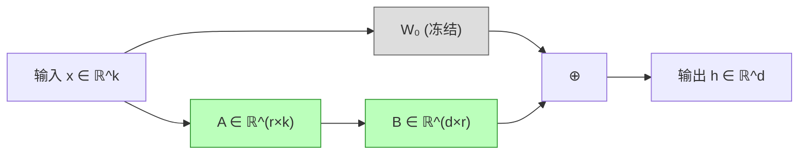

# 前置知识：LoRA (Low-Rank Adaptation)——大模型参数高效微调的核心方法

> **一句话**：LoRA 的核心思想是——与其微调整个巨大的权重矩阵 $W \in \mathbb{R}^{d \times k}$，不如只训练一个低秩增量 $\Delta W = BA$（其中 $B \in \mathbb{R}^{d \times r}$, $A \in \mathbb{R}^{r \times k}$, $r \ll \min(d,k)$），用不到原参数 1% 的可训练参数就能达到接近全参数微调的效果。

**前置概念**：
- [矩阵的秩与低秩近似](/前置知识/000z_前置知识_矩阵的秩与低秩近似) — 理解"秩"是什么、为什么低秩矩阵可以压缩
- 神经网络全连接层的前向传播
- [参数高效微调(PEFT)概览](/前置知识/000y_前置知识_参数高效微调PEFT概览) — LoRA 在 PEFT 家族中的位置

**如果你想了解 LoRA 在工程实操中的完整流程**（模型怎么注入、怎么训练、怎么部署），请直接阅读 [LoRA 实操全流程：模型如何支持 LoRA](/前置知识/001a_前置知识_LoRA实操全流程_模型如何支持LoRA)。

---

## 贯穿全文的例子

> 假设我们有一个预训练好的 7B 参数语言模型（如 LLaMA-2-7B），我们想让它学会以特定风格回答机器人操控相关的问题。
>
> - **全参数微调**：需要训练全部 7B 参数，需要 ~56GB 显存（FP16），训练一次需要 8×A100
> - **LoRA 微调**：冻结全部 7B 参数，只训练每层注入的低秩矩阵，可训练参数约 20M（不到原来的 0.3%），单张 A100 就够
>
> 最终效果？在目标任务上，LoRA 微调可以达到全参数微调 95%~100% 的性能。

---

## 一、为什么需要 LoRA？全参数微调的困境

### 1.1 大模型时代的微调挑战

随着模型规模爆炸式增长，全参数微调（Full Fine-Tuning）面临严峻挑战：

| 模型 | 参数量 | FP16 显存需求 | 训练显存（batch=1） | 所需 GPU |
|------|--------|-------------|-------------------|---------|
| GPT-2 | 1.5B | 3 GB | ~8 GB | 1×V100 |
| LLaMA-7B | 7B | 14 GB | ~56 GB | 1×A100-80G |
| LLaMA-70B | 70B | 140 GB | ~560 GB | 8×A100-80G |
| GPT-4 (推测) | ~1.8T | ~3.6 TB | ~15 TB | 128×H100 |

**核心矛盾**：我们有了超强的预训练模型，却用不起全参数微调。尤其是：
- **部署成本**：如果每个下游任务都存一份完整的微调模型，存储成本爆炸
- **训练成本**：全参数微调需要大量 GPU 和时间
- **灾难性遗忘**：微调全部参数容易破坏预训练学到的通用知识

### 1.2 一个关键观察：微调的本质是低秩的

Aghajanyan et al. (2020) 在论文 *"Intrinsic Dimensionality Explains the Effectiveness of Language Model Fine-Tuning"* 中发现了一个重要现象：

> **预训练模型的权重变化矩阵 $\Delta W = W_{\text{fine-tuned}} - W_{\text{pretrained}}$ 具有极低的内在秩（intrinsic rank）。**

什么意思？假设预训练权重是 $W_0 \in \mathbb{R}^{768 \times 768}$（约 59 万参数），全参数微调后变成 $W_1$。如果我们对 $\Delta W = W_1 - W_0$ 做 SVD 分解，会发现：
- 前 4~8 个奇异值就集中了 $\Delta W$ 90% 以上的能量
- 也就是说，$\Delta W$ 可以被一个秩为 4~8 的矩阵很好地近似

**直觉理解**：预训练模型已经学到了极其丰富的通用表示。微调只是在这个巨大的参数空间中"微调方向"——而这个调整方向所张成的子空间维度很低。

**类比**：想象一个已经训练好的画家（预训练模型）。让他学画水墨画（微调任务），他不需要重新学怎么拿笔、怎么调色——他只需要学几个关键的笔法变化和墨色浓淡的规律。这些"需要改变的东西"相比他全部的绘画技能来说，维度很低。

### 1.3 LoRA 的核心 Insight

基于上述观察，LoRA 的思路就很自然了：

> 既然 $\Delta W$ 是低秩的，我们何不**直接把 $\Delta W$ 参数化为两个小矩阵的乘积** $\Delta W = BA$？

这就是 LoRA 的全部核心思想。简单、优雅、有效。

---

## 二、LoRA 的数学原理

### 2.1 标准全连接层的前向传播

一个标准的全连接层（或 Transformer 中的投影层）的前向传播为：

$$
h = W_0 x
$$

其中：
- $W_0 \in \mathbb{R}^{d \times k}$ 是预训练的权重矩阵
- $x \in \mathbb{R}^{k}$ 是输入向量
- $h \in \mathbb{R}^{d}$ 是输出向量

全参数微调时，我们更新 $W_0 \rightarrow W_0 + \Delta W$，所以前向传播变成：

$$
h = (W_0 + \Delta W)x = W_0 x + \Delta W \cdot x
$$

### 2.2 LoRA 的低秩参数化

LoRA 的关键操作是**用低秩分解来参数化 $\Delta W$**：

$$
\Delta W = BA, \quad B \in \mathbb{R}^{d \times r}, \quad A \in \mathbb{R}^{r \times k}, \quad r \ll \min(d, k)
$$

所以前向传播变成：

$$
h = W_0 x + BAx
$$



**逐项拆解**：
- $W_0$：预训练权重，**完全冻结**，不参与梯度计算
- $A \in \mathbb{R}^{r \times k}$：**降维矩阵**，把 $k$ 维输入投影到 $r$ 维低秩空间
- $B \in \mathbb{R}^{d \times r}$：**升维矩阵**，把 $r$ 维低秩表示映射回 $d$ 维输出空间
- $r$：**秩**（rank），LoRA 最核心的超参数，通常取 4、8、16、32、64

**参数量对比**（以 $d = k = 4096$, $r = 8$ 为例）：
- 全参数：$d \times k = 4096 \times 4096 = 16,777,216$（1677 万）
- LoRA：$d \times r + r \times k = 4096 \times 8 + 8 \times 4096 = 65,536$（6.5 万）
- **压缩比**：$\frac{65536}{16777216} = 0.39\%$

### 2.3 初始化策略

LoRA 的初始化有一个精巧的设计：

- $A$ 使用 **Kaiming 均匀初始化**（或高斯初始化）
- $B$ 初始化为 **全零矩阵**

为什么这样设计？因为训练开始时：

$$
\Delta W = BA = \mathbf{0} \cdot A = \mathbf{0}
$$

这意味着**训练的起点就是原始预训练模型**。LoRA 不会在初始化阶段就破坏预训练的表示。模型从预训练权重出发，逐渐学习需要的调整。

**类比**：就像从原点（零修改）出发，慢慢探索需要改变的方向，而不是一开始就随机扰动预训练模型。

### 2.4 缩放因子 $\alpha$

完整的 LoRA 前向传播还包含一个缩放因子：

$$
h = W_0 x + \frac{\alpha}{r} \cdot BAx
$$

其中 $\alpha$ 是一个常数超参数（通常设为 $r$ 的 1~2 倍），$\frac{\alpha}{r}$ 起到的作用是：

- **当增大 $r$ 时，保持输出量级稳定**：如果没有 $\frac{\alpha}{r}$，增大 $r$ 会使 $BA$ 的输出增大（更多列的累加），学习率就需要相应调整
- **允许固定学习率不调**：有了这个缩放，换 $r$ 时不需要重新调学习率
- **实践中**：常见设置是 $\alpha = r$（等价于缩放因子为 1）或 $\alpha = 2r$

**代入数字**：
- 设 $r = 8$, $\alpha = 16$，则缩放因子为 $\frac{16}{8} = 2$
- 设 $r = 16$, $\alpha = 16$，则缩放因子为 $\frac{16}{16} = 1$

---

## 三、LoRA 应用到 Transformer 的哪些位置？

### 3.1 Transformer 中的线性层

一个标准 Transformer 层包含以下线性投影：

| 模块 | 线性层 | 维度（以 LLaMA-7B 为例） |
|------|-------|------------------------|
| Self-Attention | $W_Q, W_K, W_V, W_O$ | $4096 \times 4096$ |
| MLP (FFN) | $W_{\text{gate}}, W_{\text{up}}, W_{\text{down}}$ | $4096 \times 11008$ 或 $11008 \times 4096$ |

LoRA 可以应用到其中任意一个或多个线性层。

### 3.2 实践中的选择

**原始 LoRA 论文的实验结论**：
- 只对 $W_Q$ 和 $W_V$ 加 LoRA 就能获得很好的效果
- 对所有注意力层（$W_Q, W_K, W_V, W_O$）加 LoRA 效果最佳
- MLP 层加不加影响不大（在 NLU 任务上）

**现代实践经验**（2024 年后的共识）：
- 对**所有线性层**（注意力 + MLP）都加 LoRA 效果最好
- 使用较小的 $r$（如 8-16）+ 更多层 > 使用大 $r$（如 64）+ 少数层
- Hugging Face PEFT 库默认配置：`target_modules="all-linear"`

### 3.3 具体数值例子

以 LLaMA-7B（32 层 Transformer）为例：

**方案 A：只对 $W_Q, W_V$ 加 LoRA，$r=8$**
- 每层参数：$2 \times (4096 \times 8 + 8 \times 4096) = 2 \times 65536 = 131072$
- 总参数：$32 \times 131072 = 4,194,304$（约 **4.2M**）
- 占比：$4.2M / 7000M = 0.06\%$

**方案 B：对所有线性层加 LoRA，$r=16$**
- 注意力层每层：$4 \times (4096 \times 16 + 16 \times 4096) = 4 \times 131072 = 524288$
- MLP 层每层：$3 \times (4096 \times 16 + 16 \times 11008) \approx 3 \times 241664 = 724992$（注意维度不对称）
- 总参数：$32 \times (524288 + 724992) \approx 40M$
- 占比：$40M / 7000M \approx 0.57\%$

---

## 四、LoRA 的训练过程

### 4.1 梯度流

训练时，梯度只流过 $A$ 和 $B$：

$$
\frac{\partial \mathcal{L}}{\partial B} = \frac{\alpha}{r} \cdot \frac{\partial \mathcal{L}}{\partial h} \cdot (Ax)^T
$$

$$
\frac{\partial \mathcal{L}}{\partial A} = \frac{\alpha}{r} \cdot B^T \cdot \frac{\partial \mathcal{L}}{\partial h} \cdot x^T
$$

由于 $W_0$ 被冻结，它不需要计算梯度，也不需要存储优化器状态（如 Adam 的一阶和二阶动量），这是 LoRA 节省显存的关键原因。

### 4.2 显存节省的来源

| 显存占用项 | 全参数微调 | LoRA（$r=16$, 所有线性层） |
|-----------|-----------|--------------------------|
| 模型参数 (FP16) | 14 GB | 14 GB（冻结但仍需加载） |
| 梯度 (FP16) | 14 GB | ~80 MB |
| 优化器状态 (FP32) | 56 GB | ~320 MB |
| **总计** | **~84 GB** | **~15 GB** |

核心节省在于：
1. **梯度**：只为 LoRA 参数计算和存储梯度
2. **优化器状态**：Adam 对每个可训练参数存两个状态（均值和方差），全参数微调时是模型大小的 4 倍，LoRA 时几乎忽略不计

### 4.3 推理时的合并

训练完成后，LoRA 支持**无损合并**到原始权重：

$$
W_{\text{merged}} = W_0 + \frac{\alpha}{r} \cdot BA
$$

合并后的模型：
- **推理速度完全不变**：没有任何额外计算开销
- **可以导出为标准模型格式**：与原始模型结构完全相同
- **也可以不合并**：保持 LoRA 分支，方便切换不同任务的适配器

这是 LoRA 相比其他 PEFT 方法（如 Adapter、Prefix Tuning）的重要优势——**推理时零开销**。

---

## 五、LoRA 的超参数选择

### 5.1 秩 $r$ 的选择

$r$ 是 LoRA 最重要的超参数，它决定了适配能力的上限：

| $r$ 值 | 参数量（LLaMA-7B, 所有线性层） | 适用场景 |
|--------|-------------------------------|---------|
| 4 | ~10M | 简单任务（风格转换、格式调整） |
| 8 | ~20M | 常见下游任务 |
| 16 | ~40M | 复杂任务（代码生成、数学推理） |
| 32 | ~80M | 需要较大适配能力的任务 |
| 64 | ~160M | 接近全参数微调的效果 |
| 128+ | ~320M+ | 极少使用，此时应考虑全参数微调 |

**经验法则**：
- 从 $r=8$ 或 $r=16$ 开始尝试
- 如果欠拟合（loss 降不下去）→ 增大 $r$
- 如果过拟合（验证集 loss 上升）→ 减小 $r$ 或加正则

### 5.2 学习率

LoRA 的学习率通常比全参数微调大：
- 全参数微调：$1\text{e-}5 \sim 3\text{e-}5$
- LoRA 微调：$1\text{e-}4 \sim 3\text{e-}4$

原因：LoRA 参数量少，每次更新步幅可以更大。

### 5.3 目标模块选择

```python
# Hugging Face PEFT 配置示例
from peft import LoraConfig

config = LoraConfig(
    r=16,
    lora_alpha=32,      # α = 2r
    lora_dropout=0.05,
    target_modules="all-linear",  # 现代最佳实践
    bias="none",
    task_type="CAUSAL_LM",
)
```

---

## 六、LoRA vs 其他 PEFT 方法

| 方法 | 可训练参数 | 推理开销 | 效果 | 原理 |
|------|-----------|---------|------|------|
| **LoRA** | 0.1%~1% | **零** | 接近全参数 | 低秩增量 |
| Adapter | 0.5%~3% | 有（额外层） | 好 | 插入小型前馈层 |
| Prefix Tuning | 0.1% | 有（占用序列长度） | 中等 | 在输入前加可学习向量 |
| Prompt Tuning | <0.01% | 有（占用序列长度） | 简单任务好 | 只学习输入 embedding |
| BitFit | <0.1% | 零 | 中等 | 只训练 bias 项 |

LoRA 的核心优势：
1. **推理零开销**（合并后与原模型完全相同）
2. **效果好**（接近全参数微调）
3. **可组合**（多个 LoRA 可以切换或合并）
4. **实现简单**（不需要修改模型架构）

---

## 七、代码实现：从零实现 LoRA

```python
import torch
import torch.nn as nn
import math

class LoRALinear(nn.Module):
    """从零实现的 LoRA 线性层"""
    
    def __init__(self, original_linear: nn.Linear, r: int = 8, alpha: int = 16):
        super().__init__()
        self.original = original_linear
        self.original.weight.requires_grad = False  # 冻结原始权重
        if self.original.bias is not None:
            self.original.bias.requires_grad = False
        
        d, k = original_linear.out_features, original_linear.in_features
        self.r = r
        self.alpha = alpha
        self.scaling = alpha / r
        
        # LoRA 矩阵
        self.A = nn.Parameter(torch.empty(r, k))
        self.B = nn.Parameter(torch.zeros(d, r))  # B 初始化为零！
        
        # A 使用 Kaiming 初始化
        nn.init.kaiming_uniform_(self.A, a=math.sqrt(5))
    
    def forward(self, x: torch.Tensor) -> torch.Tensor:
        # 原始路径 + LoRA 路径
        h = self.original(x)                     # W₀x
        lora_out = (x @ self.A.T) @ self.B.T     # x·Aᵀ·Bᵀ = (BA)ᵀx 的等价写法
        return h + self.scaling * lora_out       # W₀x + (α/r)·BAx
```

**关键实现细节**：
1. $B$ 初始化为零 → 保证训练起点 = 预训练模型
2. `requires_grad = False` → 冻结原始权重，节省梯度显存
3. 计算 `x @ A.T @ B.T` 而不是先算 `BA` 再乘 `x`——因为 `x` 的 batch 维度使得分步计算更高效

---

## 八、LoRA 的局限性与改进方向

尽管 LoRA 非常成功，但它也有一些固有的局限：

| 局限 | 描述 | 改进方法 |
|------|------|---------|
| 秩固定 | 所有层使用相同的 $r$，但不同层可能需要不同的适配能力 | AdaLoRA（自适应秩分配） |
| 表达能力有上限 | 低秩限制了能学到的变化范围 | MoRA（高秩更新）、DoRA（分解方向与幅度） |
| A/B 学习不对称 | A 和 B 使用相同学习率，但作用不同 | LoRA+（不同学习率） |
| 训练不稳定 | 大 $r$ 时梯度可能不稳定 | rsLoRA（秩稳定缩放） |
| 显存仍有优化空间 | 仍需存储完整的冻结权重 | QLoRA（量化基础模型） |

这些改进方法我们将在后续文章中逐一详解。

---

## 九、总结

### LoRA 的核心要点

1. **动机**：大模型全参数微调太贵，而微调的本质是低秩的
2. **方法**：冻结预训练权重 $W_0$，只训练低秩增量 $\Delta W = BA$
3. **优势**：参数高效、推理零开销、可组合
4. **关键超参**：秩 $r$、缩放 $\alpha$、目标模块
5. **适用范围**：几乎所有基于 Transformer 的模型微调场景

### 延伸阅读

- [参数高效微调(PEFT)概览](/前置知识/000y_前置知识_参数高效微调PEFT概览) — LoRA 在 PEFT 大家族中的位置
- LoRA 原始论文精读（即将发布）— 论文的完整技术细节与实验分析
- QLoRA — 结合量化进一步降低显存
- AdaLoRA — 自适应分配不同层的秩
- DoRA — 分解权重的方向与幅度分别适配
