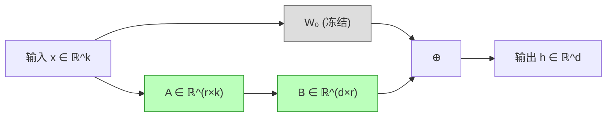

# 前置知识：LoRA (Low-Rank Adaptation)——大模型参数高效微调的核心方法

> **一句话**：LoRA 的核心思想是——与其微调整个巨大的权重矩阵 $W \in \mathbb{R}^{d \times k}$，不如只训练一个低秩增量 $\Delta W = BA$（其中 $B \in \mathbb{R}^{d \times r}$, $A \in \mathbb{R}^{r \times k}$, $r \ll \min(d,k)$），用不到原参数 1% 的可训练参数就能达到接近全参数微调的效果。

**前置概念**：
- [矩阵的秩与低秩近似](/前置知识/000z_前置知识_矩阵的秩与低秩近似) — 理解"秩"是什么、为什么低秩矩阵可以压缩
- 神经网络全连接层的前向传播
- [参数高效微调(PEFT)概览](/前置知识/000y_前置知识_参数高效微调PEFT概览) — LoRA 在 PEFT 家族中的位置

**如果你想了解 LoRA 在工程实操中的完整流程**（模型怎么注入、怎么训练、怎么部署），请直接阅读 [LoRA 实操全流程：模型如何支持 LoRA](/前置知识/001a_前置知识_LoRA实操全流程_模型如何支持LoRA)。

---

## 贯穿全文的例子

> 假设我们有一个预训练好的 7B 参数语言模型（如 LLaMA-2-7B），我们想让它学会以特定风格回答机器人操控相关的问题。
>
> - **全参数微调**：需要训练全部 7B 参数，需要 ~56GB 显存（FP16），训练一次需要 8×A100
> - **LoRA 微调**：冻结全部 7B 参数，只训练每层注入的低秩矩阵，可训练参数约 20M（不到原来的 0.3%），单张 A100 就够
>
> 最终效果？在目标任务上，LoRA 微调可以达到全参数微调 95%~100% 的性能。

---

## 一、为什么需要 LoRA？全参数微调的困境

### 1.1 大模型时代的微调挑战

随着模型规模爆炸式增长，全参数微调（Full Fine-Tuning）面临严峻挑战：

| 模型 | 参数量 | FP16 显存需求 | 训练显存（batch=1） | 所需 GPU |
|------|--------|-------------|-------------------|---------|
| GPT-2 | 1.5B | 3 GB | ~8 GB | 1×V100 |
| LLaMA-7B | 7B | 14 GB | ~56 GB | 1×A100-80G |
| LLaMA-70B | 70B | 140 GB | ~560 GB | 8×A100-80G |
| GPT-4 (推测) | ~1.8T | ~3.6 TB | ~15 TB | 128×H100 |

**核心矛盾**：我们有了超强的预训练模型，却用不起全参数微调。尤其是：
- **部署成本**：如果每个下游任务都存一份完整的微调模型，存储成本爆炸
- **训练成本**：全参数微调需要大量 GPU 和时间
- **灾难性遗忘**：微调全部参数容易破坏预训练学到的通用知识

### 1.2 一个关键观察：微调的本质是低秩的

Aghajanyan et al. (2020) 在论文 *"Intrinsic Dimensionality Explains the Effectiveness of Language Model Fine-Tuning"* 中发现了一个重要现象：

> **预训练模型的权重变化矩阵 $\Delta W = W_{\text{fine-tuned}} - W_{\text{pretrained}}$ 具有极低的内在秩（intrinsic rank）。**

什么意思？假设预训练权重是 $W_0 \in \mathbb{R}^{768 \times 768}$（约 59 万参数），全参数微调后变成 $W_1$。如果我们对 $\Delta W = W_1 - W_0$ 做 SVD 分解，会发现：
- 前 4~8 个奇异值就集中了 $\Delta W$ 90% 以上的能量
- 也就是说，$\Delta W$ 可以被一个秩为 4~8 的矩阵很好地近似

**直觉理解**：预训练模型已经学到了极其丰富的通用表示。微调只是在这个巨大的参数空间中"微调方向"——而这个调整方向所张成的子空间维度很低。

**类比**：想象一个已经训练好的画家（预训练模型）。让他学画水墨画（微调任务），他不需要重新学怎么拿笔、怎么调色——他只需要学几个关键的笔法变化和墨色浓淡的规律。这些"需要改变的东西"相比他全部的绘画技能来说，维度很低。

### 1.3 LoRA 的核心 Insight

基于上述观察，LoRA 的思路就很自然了：

> 既然 $\Delta W$ 是低秩的，我们何不**直接把 $\Delta W$ 参数化为两个小矩阵的乘积** $\Delta W = BA$？

这就是 LoRA 的全部核心思想。简单、优雅、有效。

---

## 二、LoRA 的数学原理

### 2.1 标准全连接层的前向传播

一个标准的全连接层（或 Transformer 中的投影层）的前向传播为：

$$
h = W_0 x
$$

**这个公式在做什么**：最普通的线性层前向传播——输入向量经过一个权重矩阵变换，得到输出向量。

::: details 📐 公式详解（点击展开）

| 子表达式 | 它是谁 | 它在干嘛 |
|---------|--------|---------|
| $W_0$ | **预训练权重** | 已经训练好的 $d\times k$ 矩阵，存储着模型学到的知识 |
| $x$ | **输入向量** | 这一层收到的输入，维度 $k$ |
| $h$ | **输出向量** | 这一层算出的结果，维度 $d$，会传给下一层 |

**用人话读**："输入向量乘一下权重矩阵，就得到输出向量——最普通的全连接层。"

**为什么是这个形式**：这是神经网络里最基础的线性变换，后面所有 LoRA 的改动都是在这个式子基础上加东西，不是重新发明前向传播。
:::

其中：
- $W_0 \in \mathbb{R}^{d \times k}$ 是预训练的权重矩阵
- $x \in \mathbb{R}^{k}$ 是输入向量
- $h \in \mathbb{R}^{d}$ 是输出向量

全参数微调时，我们更新 $W_0 \rightarrow W_0 + \Delta W$，所以前向传播变成：

$$
h = (W_0 + \Delta W)x = W_0 x + \Delta W \cdot x
$$

**这个公式在做什么**：把"更新后的权重"拆成"原始权重 + 变化量"两部分，说明全参数微调本质上就是给权重加了一个 $\Delta W$。

::: details 📐 公式详解（点击展开）

| 子表达式 | 它是谁 | 它在干嘛 |
|---------|--------|---------|
| $W_0+\Delta W$ | **微调后的新权重** | 全参数微调实际更新出来的权重矩阵 |
| $W_0 x$ | **原始输出** | 用没微调之前的权重算出的结果 |
| $\Delta W\cdot x$ | **变化量带来的额外输出** | 权重变化这部分单独对输出的贡献 |

**用人话读**："微调后的输出，等于用原始权重算一遍，再加上'权重变化量'对输入的作用。"

**为什么是这个形式**：矩阵乘法对加法满足分配律，这一步纯粹是代数拆分，目的是把"要微调的对象"从 $W_0+\Delta W$ 聚焦到 $\Delta W$ 本身——这正是 LoRA 要动刀的地方。
:::

### 2.2 LoRA 的低秩参数化

LoRA 的关键操作是**用低秩分解来参数化 $\Delta W$**：

$$
\Delta W = BA, \quad B \in \mathbb{R}^{d \times r}, \quad A \in \mathbb{R}^{r \times k}, \quad r \ll \min(d, k)
$$

**这个公式在做什么**：不直接学一个和 $W_0$ 同样大小的 $\Delta W$，而是把它拆成两个"瘦"矩阵 $B$ 和 $A$ 的乘积，中间的瓶颈维度 $r$ 远小于 $d,k$。

::: details 📐 公式详解（点击展开）

| 子表达式 | 它是谁 | 它在干嘛 |
|---------|--------|---------|
| $A\in\mathbb{R}^{r\times k}$ | **降维矩阵** | 把 $k$ 维输入先压缩到 $r$ 维的低秩空间 |
| $B\in\mathbb{R}^{d\times r}$ | **升维矩阵** | 把 $r$ 维的低秩表示再映射回 $d$ 维输出空间 |
| $BA$ | **低秩增量** | 两个瘦矩阵相乘，得到一个形状和 $\Delta W$ 一样但内在自由度只有 $r$ 的矩阵 |
| $r\ll\min(d,k)$ | **瓶颈约束** | 强制中间维度很小，这是"低秩"的真正含义，也是参数量暴降的来源 |

**用人话读**："不直接存一个和原权重一样大的变化矩阵，而是先压缩再还原，中间只留一条很窄的通道。"

**为什么是这个形式**：1.2 节的实验观察表明 $\Delta W$ 本身的有效自由度很低（少数几个奇异值就能解释大部分变化），所以用一个秩为 $r$ 的矩阵去逼近它，既不损失多少精度，又能把参数量从 $d\times k$ 降到 $(d+k)\times r$。
:::

所以前向传播变成：

$$
h = W_0 x + BAx
$$

**这个公式在做什么**：把 LoRA 的低秩增量代入前向传播，得到 LoRA 层实际计算时用的公式——原始路径和低秩路径并行算完再相加。

::: details 📐 公式详解（点击展开）

| 子表达式 | 它是谁 | 它在干嘛 |
|---------|--------|---------|
| $W_0x$ | **主路径** | 用冻结的原始权重算出的输出，完全不变 |
| $BAx$ | **旁路（LoRA 支路）** | 输入先经过 $A$ 压缩、再经过 $B$ 还原，产生一个额外的修正量 |
| $h$ | **最终输出** | 两条路径的结果直接相加 |

**用人话读**："输出 = 原来权重算的结果 + 一条额外的低秩旁路算的修正量。"

**为什么是这个形式**：这样设计使得 $W_0$ 完全不需要参与梯度计算（旁路是独立的计算图分支），只需训练 $A,B$ 这两个小矩阵，就能等效于在学习一个新的 $\Delta W$。
:::


```mermaid
flowchart LR
    X["输入 x ∈ ℝ^k"] --> W0["W₀ (冻结)"]
    X --> A["A ∈ ℝ^(r×k)"]
    A --> B["B ∈ ℝ^(d×r)"]
    W0 --> Plus["⊕"]
    B --> Plus
    Plus --> H["输出 h ∈ ℝ^d"]
    
    style W0 fill:#ddd,stroke:#666
    style A fill:#bfb,stroke:#393
    style B fill:#bfb,stroke:#393
```

**逐项拆解**：
- $W_0$：预训练权重，**完全冻结**，不参与梯度计算
- $A \in \mathbb{R}^{r \times k}$：**降维矩阵**，把 $k$ 维输入投影到 $r$ 维低秩空间
- $B \in \mathbb{R}^{d \times r}$：**升维矩阵**，把 $r$ 维低秩表示映射回 $d$ 维输出空间
- $r$：**秩**（rank），LoRA 最核心的超参数，通常取 4、8、16、32、64

**参数量对比**（以 $d = k = 4096$, $r = 8$ 为例）：
- 全参数：$d \times k = 4096 \times 4096 = 16,777,216$（1677 万）
- LoRA：$d \times r + r \times k = 4096 \times 8 + 8 \times 4096 = 65,536$（6.5 万）
- **压缩比**：$\frac{65536}{16777216} = 0.39\%$

### 2.3 初始化策略

LoRA 的初始化有一个精巧的设计：

- $A$ 使用 **Kaiming 均匀初始化**（或高斯初始化）
- $B$ 初始化为 **全零矩阵**

为什么这样设计？因为训练开始时：

$$
\Delta W = BA = \mathbf{0} \cdot A = \mathbf{0}
$$

**这个公式在做什么**：验证初始化设计的效果——因为 $B$ 被初始化为全零矩阵，训练还没开始时低秩增量就恰好等于零。

::: details 📐 公式详解（点击展开）

| 子表达式 | 它是谁 | 它在干嘛 |
|---------|--------|---------|
| $B=\mathbf{0}$ | **升维矩阵的初始状态** | 人为设定成全零矩阵，是这个式子成立的唯一原因 |
| $\mathbf{0}\cdot A$ | **零矩阵乘任意矩阵** | 无论 $A$ 里是什么数，只要有一个因子是零矩阵，乘积必然是零矩阵 |
| $\Delta W=\mathbf{0}$ | **训练起点的增量** | 初始化那一刻，低秩增量对权重没有任何修正 |

**用人话读**："因为 $B$ 一开始就是全零，不管 $A$ 是什么，乘出来的增量在训练第一步之前必然是零。"

**为什么是这个形式**：这是刻意设计的初始化策略，目的是让训练从"完全等于预训练模型"这个安全的起点开始，避免一上来就用随机噪声污染预训练学到的表示——如果 $A,B$ 都随机初始化，训练第一步就会给模型加上一个无意义的随机扰动。
:::

这意味着**训练的起点就是原始预训练模型**。LoRA 不会在初始化阶段就破坏预训练的表示。模型从预训练权重出发，逐渐学习需要的调整。

**类比**：就像从原点（零修改）出发，慢慢探索需要改变的方向，而不是一开始就随机扰动预训练模型。

### 2.4 缩放因子 $\alpha$

完整的 LoRA 前向传播还包含一个缩放因子：

$$
h = W_0 x + \frac{\alpha}{r} \cdot BAx
$$

**这个公式在做什么**：在低秩旁路的输出上再乘一个缩放系数 $\alpha/r$，让不同的秩 $r$ 之间输出量级保持一致。

::: details 📐 公式详解（点击展开）

| 子表达式 | 它是谁 | 它在干嘛 |
|---------|--------|---------|
| $BAx$ | **未缩放的旁路输出** | 2.2 节算出的低秩修正量，量级会随 $r$ 变化 |
| $\alpha$ | **缩放强度超参数** | 人为设定的常数，控制旁路输出的整体幅度 |
| $\frac{\alpha}{r}$ | **归一化缩放系数** | 用 $r$ 去除 $\alpha$，抵消掉"$r$ 越大旁路输出量级越大"这个副作用 |
| $\frac{\alpha}{r}\cdot BAx$ | **缩放后的旁路输出** | 真正加到主路径输出上的修正量 |

**用人话读**："低秩旁路算出来的修正量，还要再乘一个和秩成反比的系数，这样换秩的时候输出幅度不会跟着乱跳。"

**为什么是这个形式**：$BAx$ 是 $r$ 个秩 1 分量累加的结果，$r$ 越大，累加的项越多，输出量级天然会变大；除以 $r$（再乘常数 $\alpha$ 调整整体强度）正好抵消这个效应，这样调 $r$ 时不用重新调学习率。
:::

其中 $\alpha$ 是一个常数超参数（通常设为 $r$ 的 1~2 倍），$\frac{\alpha}{r}$ 起到的作用是：

- **当增大 $r$ 时，保持输出量级稳定**：如果没有 $\frac{\alpha}{r}$，增大 $r$ 会使 $BA$ 的输出增大（更多列的累加），学习率就需要相应调整
- **允许固定学习率不调**：有了这个缩放，换 $r$ 时不需要重新调学习率
- **实践中**：常见设置是 $\alpha = r$（等价于缩放因子为 1）或 $\alpha = 2r$

**代入数字**：
- 设 $r = 8$, $\alpha = 16$，则缩放因子为 $\frac{16}{8} = 2$
- 设 $r = 16$, $\alpha = 16$，则缩放因子为 $\frac{16}{16} = 1$

---

## 三、LoRA 应用到 Transformer 的哪些位置？

### 3.1 Transformer 中的线性层

一个标准 Transformer 层包含以下线性投影：

| 模块 | 线性层 | 维度（以 LLaMA-7B 为例） |
|------|-------|------------------------|
| Self-Attention | $W_Q, W_K, W_V, W_O$ | $4096 \times 4096$ |
| MLP (FFN) | $W_{\text{gate}}, W_{\text{up}}, W_{\text{down}}$ | $4096 \times 11008$ 或 $11008 \times 4096$ |

LoRA 可以应用到其中任意一个或多个线性层。

### 3.2 实践中的选择

**原始 LoRA 论文的实验结论**：
- 只对 $W_Q$ 和 $W_V$ 加 LoRA 就能获得很好的效果
- 对所有注意力层（$W_Q, W_K, W_V, W_O$）加 LoRA 效果最佳
- MLP 层加不加影响不大（在 NLU 任务上）

**现代实践经验**（2024 年后的共识）：
- 对**所有线性层**（注意力 + MLP）都加 LoRA 效果最好
- 使用较小的 $r$（如 8-16）+ 更多层 > 使用大 $r$（如 64）+ 少数层
- Hugging Face PEFT 库默认配置：`target_modules="all-linear"`

### 3.3 具体数值例子

以 LLaMA-7B（32 层 Transformer）为例：

**方案 A：只对 $W_Q, W_V$ 加 LoRA，$r=8$**
- 每层参数：$2 \times (4096 \times 8 + 8 \times 4096) = 2 \times 65536 = 131072$
- 总参数：$32 \times 131072 = 4,194,304$（约 **4.2M**）
- 占比：$4.2M / 7000M = 0.06\%$

**方案 B：对所有线性层加 LoRA，$r=16$**
- 注意力层每层：$4 \times (4096 \times 16 + 16 \times 4096) = 4 \times 131072 = 524288$
- MLP 层每层：$3 \times (4096 \times 16 + 16 \times 11008) \approx 3 \times 241664 = 724992$（注意维度不对称）
- 总参数：$32 \times (524288 + 724992) \approx 40M$
- 占比：$40M / 7000M \approx 0.57\%$

---

## 四、LoRA 的训练过程

### 4.1 梯度流

前向传播是 $h = W_0 x + \frac{\alpha}{r}BAx$，反向传播时需要知道 loss 对 $A$、$B$ 分别怎么变化才能用梯度下降更新它们。对 $h=W_0x+\frac{\alpha}{r}BAx$ 分别关于 $B$、$A$ 用链式法则求导，得到：

$$
\frac{\partial \mathcal{L}}{\partial B} = \frac{\alpha}{r} \cdot \frac{\partial \mathcal{L}}{\partial h} \cdot (Ax)^T
$$

**这个公式在做什么**：算出 loss 相对于升维矩阵 $B$ 的梯度，告诉优化器 $B$ 里的每个元素该往哪个方向调整。

::: details 📐 公式详解（点击展开）

| 子表达式 | 它是谁 | 它在干嘛 |
|---------|--------|---------|
| $\partial\mathcal{L}/\partial h$ | **上游传来的梯度信号** | 由更靠后的层反向传播过来，维度 $d$（与输出 $h$ 相同） |
| $(Ax)^\top$ | **低秩中间表示的转置** | $A$ 对输入 $x$ 投影后的结果（维度 $r$），转置后用于做外积 |
| $\frac{\partial\mathcal{L}}{\partial h}\cdot(Ax)^\top$ | **外积运算** | 把两个向量外积成一个 $d\times r$ 矩阵，形状正好和 $B$ 一致 |
| $\frac{\alpha}{r}$ | **缩放因子原样乘回** | 前向传播乘了这个系数，链式法则求导时把它原样乘回梯度里 |

**用人话读**："$B$ 的梯度 = 缩放系数 × 上游梯度和低秩中间表示的外积。"

**为什么是这个形式**：这是对 $h=W_0x+\frac{\alpha}{r}BAx$ 关于 $B$ 求偏导的直接结果——链式法则要求把 $h$ 对 $B$ 的依赖（也就是 $Ax$ 这部分）转置后和上游梯度做外积，得到形状和 $B$ 完全一致的梯度矩阵。
:::

$$
\frac{\partial \mathcal{L}}{\partial A} = \frac{\alpha}{r} \cdot B^T \cdot \frac{\partial \mathcal{L}}{\partial h} \cdot x^T
$$

**这个公式在做什么**：算出 loss 相对于降维矩阵 $A$ 的梯度，告诉优化器 $A$ 里的每个元素该往哪个方向调整。

::: details 📐 公式详解（点击展开）

| 子表达式 | 它是谁 | 它在干嘛 |
|---------|--------|---------|
| $B^\top$ | **把上游梯度传回低秩空间** | 上游梯度原本是 $d$ 维，乘上 $B^\top$ 后压缩回 $r$ 维，对应 $A$ 所在的空间 |
| $\frac{\partial\mathcal{L}}{\partial h}$ | **上游传来的梯度信号** | 和上一个公式里同一个量，同时用来更新 $B$ 和 $A$ |
| $x^\top$ | **输入的转置** | 与压缩回 $r$ 维的梯度做外积，凑出形状 $r\times k$，正好和 $A$ 一致 |
| $\frac{\alpha}{r}$ | **缩放因子原样乘回** | 同样是前向传播缩放系数的直接延续 |

**用人话读**："$A$ 的梯度 = 缩放系数 × （先用 $B$ 转置把上游梯度压回低秩空间，再和输入外积）。"

**为什么是这个形式**：$A$ 在计算图中比 $B$ 更靠前一层（输入先经过 $A$ 再经过 $B$），所以梯度要先经过 $B^\top$ 反向传回 $r$ 维空间，再和输入 $x$ 做外积——这正是链式法则逐层往回传的体现。反向传播中 $\mathcal{L}$ 是训练损失（如交叉熵），是整个反向传播的起点。
:::

**代入数字**：取 $d=4, k=4, r=2, \alpha=4$（缩放因子 $\alpha/r=2$）。假设 $x=[1,0,1,0]^\top$，$A=\begin{bmatrix}0.1&0&0.2&0\\0&0.1&0&0.2\end{bmatrix}$，算出 $Ax=[0.1+0.2,\ 0+0]=[0.3,0]^\top$（2 维）。假设上游传回的梯度 $\partial\mathcal{L}/\partial h = [0.5,-0.2,0.1,0.3]^\top$（4 维）。则：

$$
\frac{\partial\mathcal{L}}{\partial B} = 2\times\frac{\partial\mathcal{L}}{\partial h}\times(Ax)^\top = 2\times\begin{bmatrix}0.5\\-0.2\\0.1\\0.3\end{bmatrix}\times[0.3,\ 0] = \begin{bmatrix}0.3&0\\-0.12&0\\0.06&0\\0.18&0\end{bmatrix}
$$

**这个公式在做什么**：把前面推导出的 $B$ 梯度公式代入具体的数字，实际算出一个 $4\times2$ 的梯度矩阵。

::: details 📐 公式详解（点击展开）

| 子表达式 | 它是谁 | 它在干嘛 |
|---------|--------|---------|
| $2$ | **具体的缩放系数** | 本例中 $\alpha/r=4/2=2$，代入公式的具体数值 |
| $\partial\mathcal{L}/\partial h=[0.5,-0.2,0.1,0.3]^\top$ | **假设的上游梯度** | 4 维向量，模拟从后面层传回来的梯度信号 |
| $(Ax)^\top=[0.3,\ 0]$ | **低秩中间表示的转置** | 用给定的 $A,x$ 算出 $Ax=[0.3,0]^\top$ 再转置成行向量 |
| 结果矩阵 $4\times2$ | **算出的 $B$ 梯度** | 形状与 $B$ 完全一致，可以直接用来做梯度下降更新 $B$ |

**用人话读**："把假设的具体数字代进梯度公式，一步步算出一个形状和 $B$ 一样的矩阵，这就是 $B$ 该往哪个方向调整的具体指令。"

**为什么是这个形式**：这只是把抽象的梯度公式代入具体数值验算一遍，确认公式在实际计算中确实能得到形状正确、数值确定的梯度；$A$ 的梯度同理，用 $B^\top$ 把 4 维梯度先压回 2 维再乘 $x^\top$，最终得到 $2\times4$ 的矩阵（与 $A$ 形状一致）。
:::

**为什么是这个形式**：由于 $W_0$ 被冻结，它不需要计算梯度，也不需要存储优化器状态（如 Adam 的一阶和二阶动量），这是 LoRA 节省显存的关键原因——反向传播的计算图中 $W_0x$ 这一支路直接被截断，梯度只沿着 $BAx$ 这一支路流动，且流动路径始终保持在 $r$ 维的低秩空间里，计算量远小于对整个 $d\times k$ 的 $W_0$ 求梯度。

### 4.2 显存节省的来源

| 显存占用项 | 全参数微调 | LoRA（$r=16$, 所有线性层） |
|-----------|-----------|--------------------------|
| 模型参数 (FP16) | 14 GB | 14 GB（冻结但仍需加载） |
| 梯度 (FP16) | 14 GB | ~80 MB |
| 优化器状态 (FP32) | 56 GB | ~320 MB |
| **总计** | **~84 GB** | **~15 GB** |

核心节省在于：
1. **梯度**：只为 LoRA 参数计算和存储梯度
2. **优化器状态**：Adam 对每个可训练参数存两个状态（均值和方差），全参数微调时是模型大小的 4 倍，LoRA 时几乎忽略不计

### 4.3 推理时的合并

训练时把 $W_0x$ 和 $\frac{\alpha}{r}BAx$ 分开算是为了让 $W_0$ 保持冻结、节省显存；但训练结束后不再需要区分"哪部分是可训练的"，可以把两条路径提前加到一起，变成一个和原模型形状完全相同的权重矩阵，这样推理时就不用额外算一条 LoRA 支路：

$$
W_{\text{merged}} = W_0 + \frac{\alpha}{r} \cdot BA
$$

**这个公式在做什么**：把训练好的低秩增量提前加到原始权重上，合并成一个和原模型形状完全相同的新权重矩阵，推理时不再需要分开算两条路径。

::: details 📐 公式详解（点击展开）

| 子表达式 | 它是谁 | 它在干嘛 |
|---------|--------|---------|
| $W_0$ | **原始冻结权重** | $d\times k$ 矩阵，训练全程都没变过 |
| $\frac{\alpha}{r}BA$ | **训练好的低秩增量（带缩放）** | 同样是 $d\times k$ 矩阵（$B$ 是 $d\times r$，$A$ 是 $r\times k$，乘出来自动是 $d\times k$） |
| $W_{\text{merged}}$ | **合并后的权重** | 与 $W_0$ 形状完全相同的 $d\times k$ 矩阵，可以直接替换原模型的权重 |

**用人话读**："训练时 $W_0$ 和 $BA$ 是分开算再相加的，现在把它们提前加好存成一个矩阵，效果完全一样，但推理时省了一次额外的矩阵乘法路径。"

**为什么是这个形式**：因为矩阵乘法对加法满足分配律，$(W_0+\frac{\alpha}{r}BA)x = W_0x+\frac{\alpha}{r}BAx$ 在数学上严格相等，合并只是提前把加法算好，不引入任何数值近似（除了浮点运算本身的精度误差），所以推理效果与训练时完全一致。
:::

**代入数字**：延续前面 $d=k=4096, r=8, \alpha=16$ 的例子，缩放因子 $\alpha/r=2$。$BA$ 是把一个 $4096\times8$ 矩阵和一个 $8\times4096$ 矩阵相乘得到的 $4096\times4096$ 矩阵——虽然 $B,A$ 本身参数量很小（共 6.5 万），但相乘后的 $BA$ 是和 $W_0$ 同样大小的稠密矩阵。合并时只需做一次 $W_0 + 2\times BA$ 的矩阵加法（逐元素相加，$4096\times4096\approx1677$ 万次加法），此后推理时前向传播直接用 $h=W_{\text{merged}}x$，不再需要分别计算 $W_0x$ 和 $BAx$ 两条路径再相加——计算量和一个标准的全连接层完全一样。

合并后的模型：
- **推理速度完全不变**：没有任何额外计算开销
- **可以导出为标准模型格式**：与原始模型结构完全相同
- **也可以不合并**：保持 LoRA 分支，方便切换不同任务的适配器

这是 LoRA 相比其他 PEFT 方法（如 Adapter、Prefix Tuning）的重要优势——**推理时零开销**。

---

## 五、LoRA 的超参数选择

### 5.1 秩 $r$ 的选择

$r$ 是 LoRA 最重要的超参数，它决定了适配能力的上限：

| $r$ 值 | 参数量（LLaMA-7B, 所有线性层） | 适用场景 |
|--------|-------------------------------|---------|
| 4 | ~10M | 简单任务（风格转换、格式调整） |
| 8 | ~20M | 常见下游任务 |
| 16 | ~40M | 复杂任务（代码生成、数学推理） |
| 32 | ~80M | 需要较大适配能力的任务 |
| 64 | ~160M | 接近全参数微调的效果 |
| 128+ | ~320M+ | 极少使用，此时应考虑全参数微调 |

**经验法则**：
- 从 $r=8$ 或 $r=16$ 开始尝试
- 如果欠拟合（loss 降不下去）→ 增大 $r$
- 如果过拟合（验证集 loss 上升）→ 减小 $r$ 或加正则

### 5.2 学习率

LoRA 的学习率通常比全参数微调大：
- 全参数微调：$1\text{e-}5 \sim 3\text{e-}5$
- LoRA 微调：$1\text{e-}4 \sim 3\text{e-}4$

原因：LoRA 参数量少，每次更新步幅可以更大。

### 5.3 目标模块选择

```python
# Hugging Face PEFT 配置示例
from peft import LoraConfig

config = LoraConfig(
    r=16,
    lora_alpha=32,      # α = 2r
    lora_dropout=0.05,
    target_modules="all-linear",  # 现代最佳实践
    bias="none",
    task_type="CAUSAL_LM",
)
```

---

## 六、LoRA vs 其他 PEFT 方法

| 方法 | 可训练参数 | 推理开销 | 效果 | 原理 |
|------|-----------|---------|------|------|
| **LoRA** | 0.1%~1% | **零** | 接近全参数 | 低秩增量 |
| Adapter | 0.5%~3% | 有（额外层） | 好 | 插入小型前馈层 |
| Prefix Tuning | 0.1% | 有（占用序列长度） | 中等 | 在输入前加可学习向量 |
| Prompt Tuning | <0.01% | 有（占用序列长度） | 简单任务好 | 只学习输入 embedding |
| BitFit | <0.1% | 零 | 中等 | 只训练 bias 项 |

LoRA 的核心优势：
1. **推理零开销**（合并后与原模型完全相同）
2. **效果好**（接近全参数微调）
3. **可组合**（多个 LoRA 可以切换或合并）
4. **实现简单**（不需要修改模型架构）

---

## 七、代码实现：从零实现 LoRA

```python
import torch
import torch.nn as nn
import math

class LoRALinear(nn.Module):
    """从零实现的 LoRA 线性层"""
    
    def __init__(self, original_linear: nn.Linear, r: int = 8, alpha: int = 16):
        super().__init__()
        self.original = original_linear
        self.original.weight.requires_grad = False  # 冻结原始权重
        if self.original.bias is not None:
            self.original.bias.requires_grad = False
        
        d, k = original_linear.out_features, original_linear.in_features
        self.r = r
        self.alpha = alpha
        self.scaling = alpha / r
        
        # LoRA 矩阵
        self.A = nn.Parameter(torch.empty(r, k))
        self.B = nn.Parameter(torch.zeros(d, r))  # B 初始化为零！
        
        # A 使用 Kaiming 初始化
        nn.init.kaiming_uniform_(self.A, a=math.sqrt(5))
    
    def forward(self, x: torch.Tensor) -> torch.Tensor:
        # 原始路径 + LoRA 路径
        h = self.original(x)                     # W₀x
        lora_out = (x @ self.A.T) @ self.B.T     # x·Aᵀ·Bᵀ = (BA)ᵀx 的等价写法
        return h + self.scaling * lora_out       # W₀x + (α/r)·BAx
```

**关键实现细节**：
1. $B$ 初始化为零 → 保证训练起点 = 预训练模型
2. `requires_grad = False` → 冻结原始权重，节省梯度显存
3. 计算 `x @ A.T @ B.T` 而不是先算 `BA` 再乘 `x`——因为 `x` 的 batch 维度使得分步计算更高效

---

## 八、LoRA 的局限性与改进方向

尽管 LoRA 非常成功，但它也有一些固有的局限：

| 局限 | 描述 | 改进方法 |
|------|------|---------|
| 秩固定 | 所有层使用相同的 $r$，但不同层可能需要不同的适配能力 | AdaLoRA（自适应秩分配） |
| 表达能力有上限 | 低秩限制了能学到的变化范围 | MoRA（高秩更新）、DoRA（分解方向与幅度） |
| A/B 学习不对称 | A 和 B 使用相同学习率，但作用不同 | LoRA+（不同学习率） |
| 训练不稳定 | 大 $r$ 时梯度可能不稳定 | rsLoRA（秩稳定缩放） |
| 显存仍有优化空间 | 仍需存储完整的冻结权重 | QLoRA（量化基础模型） |

这些改进方法我们将在后续文章中逐一详解。

---

## 九、总结

### LoRA 的核心要点

1. **动机**：大模型全参数微调太贵，而微调的本质是低秩的
2. **方法**：冻结预训练权重 $W_0$，只训练低秩增量 $\Delta W = BA$
3. **优势**：参数高效、推理零开销、可组合
4. **关键超参**：秩 $r$、缩放 $\alpha$、目标模块
5. **适用范围**：几乎所有基于 Transformer 的模型微调场景

### 延伸阅读

- [参数高效微调(PEFT)概览](/前置知识/000y_前置知识_参数高效微调PEFT概览) — LoRA 在 PEFT 大家族中的位置
- LoRA 原始论文精读（即将发布）— 论文的完整技术细节与实验分析
- QLoRA — 结合量化进一步降低显存
- AdaLoRA — 自适应分配不同层的秩
- DoRA — 分解权重的方向与幅度分别适配
