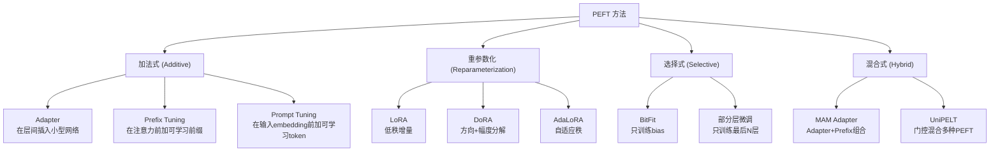

# 前置知识：参数高效微调 (PEFT) 概览——大模型适配的核心范式

> **一句话**：PEFT (Parameter-Efficient Fine-Tuning) 是一类方法的统称——它们在冻结绝大部分预训练参数的前提下，通过只训练极少量新增参数（通常 <1%），就能让大模型适配到特定下游任务。

**前置概念**：
- 基本的深度学习训练流程（前向传播、反向传播、梯度下降）
- Transformer 架构的基本结构（Self-Attention、FFN）

---

## 贯穿全文的例子

> 你有一个预训练好的 7B 参数语言模型，需要让它分别适配以下 5 个不同任务：
> 1. 中文对话
> 2. 代码生成
> 3. 医学问答
> 4. 法律文书
> 5. 机器人指令理解
>
> **全参数微调方案**：训练 5 个完整模型 → 存储 5 × 14GB = 70 GB → 服务时需要 5 个独立的推理实例
>
> **PEFT 方案**：训练 5 个小型适配模块 → 存储 14GB + 5 × 50MB = 14.25 GB → 服务时共享一个基础模型，动态切换适配器

---

## 一、为什么需要 PEFT？

### 1.1 全参数微调的三大痛点

| 痛点 | 具体描述 | 影响 |
|------|---------|------|
| **训练成本高** | 7B 模型全参数微调需要 ~80GB 显存 | 小团队/个人买不起或用不起 |
| **存储成本高** | 每个任务一份完整模型 | 多任务场景存储爆炸 |
| **灾难性遗忘** | 微调可能破坏预训练的通用能力 | 模型在非目标任务上退化 |

### 1.2 PEFT 的核心哲学

PEFT 的核心假设：

> **预训练模型已经学到了极其丰富的通用表示。适配到下游任务只需要很小的"调整量"，这个调整量可以用极少的参数来表达。**

这个假设得到了大量实证支持——多项研究表明，微调后的权重变化矩阵具有极低的内在维度。

---

## 二、PEFT 方法分类体系

PEFT 方法可以按**参数注入位置**分为四大流派：



### 2.1 加法式方法 (Additive)

**核心思想**：在预训练模型的现有结构中**插入新的可学习模块**。

#### Adapter (2019, Houlsby et al.)

在每个 Transformer 层的 Self-Attention 和 FFN 之后各插入一个小型前馈网络：

$$
\text{Adapter}(x) = x + f(x \cdot W_{\text{down}}) \cdot W_{\text{up}}
$$

其中 $W_{\text{down}} \in \mathbb{R}^{d \times r}$, $W_{\text{up}} \in \mathbb{R}^{r \times d}$，$f$ 是非线性激活。

**优点**：表达能力强（有非线性）  
**缺点**：推理时有额外计算（必须经过 Adapter 层），增加延迟

#### Prefix Tuning (2021, Li & Liang)

在每层注意力计算的 Key 和 Value 前面拼接一组可学习的向量：

$$
\text{Attention}(Q, [P_K; K], [P_V; V])
$$

其中 $P_K, P_V \in \mathbb{R}^{l \times d}$，$l$ 是 prefix 长度。

**优点**：不修改模型内部结构  
**缺点**：占用序列长度（prefix 会减少实际可处理的文本长度），对长序列不友好

#### Prompt Tuning (2021, Lester et al.)

只在输入 embedding 层前面加几个可学习的 "soft token"：

$$
\text{input} = [\underbrace{p_1, p_2, ..., p_m}_{\text{可学习 prompt}}, x_1, x_2, ..., x_n]
$$

**优点**：参数量极少  
**缺点**：效果不如 LoRA / Adapter，主要适用于大模型 + 简单任务

### 2.2 重参数化方法 (Reparameterization)

**核心思想**：不改变模型结构，用低秩或其他参数化方式**重新表达权重的变化量**。

#### LoRA (2022, Hu et al.)

$$
W = W_0 + \frac{\alpha}{r} BA
$$

详见 [LoRA 低秩适配基础](/前置知识/000x_前置知识_LoRA低秩适配基础)。

**核心优势**：推理时可以把 $BA$ 合并到 $W_0$，**零额外推理开销**。

#### DoRA (2024)

将权重分解为方向和幅度：$W = m \cdot \frac{V}{\|V\|}$，分别用 LoRA 适配方向 $V$，用标量适配幅度 $m$。

#### AdaLoRA (2023)

自适应地为不同层分配不同的秩 $r$——重要的层分配更多参数，不重要的层减少参数。

### 2.3 选择式方法 (Selective)

**核心思想**：不添加任何新参数，而是**选择性地解冻**预训练模型中的少量参数进行微调。

#### BitFit (2022)

只微调所有 bias 项（约占总参数的 0.05%）。

$$
\text{可训练参数} = \{b_Q, b_K, b_V, b_O, b_{\text{FFN1}}, b_{\text{FFN2}}, ...\}
$$

**优点**：极简  
**缺点**：效果有限，适合简单任务

#### 部分层微调

解冻最后 N 层全参数微调，冻结前面的层。

---

## 三、方法对比：关键维度

| 方法 | 可训练参数占比 | 推理额外开销 | 效果（相对全参数） | 多任务支持 | 实现复杂度 |
|------|--------------|-------------|-------------------|-----------|-----------|
| Adapter | 0.5~3% | **有**（额外层） | 95~98% | 好 | 中 |
| Prefix Tuning | 0.1~0.5% | **有**（占序列长度） | 90~95% | 好 | 低 |
| Prompt Tuning | <0.01% | **有**（占序列长度） | 85~92% | 极好 | 极低 |
| **LoRA** | 0.1~1% | **零** | **97~100%** | 好 | 低 |
| BitFit | ~0.05% | **零** | 85~90% | 差 | 极低 |
| DoRA | 0.1~1% | **零** | **98~100%** | 好 | 中 |

**结论**：LoRA 及其变体（DoRA、AdaLoRA 等）是当前最主流的 PEFT 方法，因为它们在效果、效率、推理开销之间取得了最优平衡。

---

## 四、PEFT 在不同场景中的应用

### 4.1 自然语言处理

- **对话微调**：用 LoRA 让基础模型学会对话格式（如 ChatGPT 的 SFT 阶段）
- **指令微调**：Alpaca、Vicuna 等开源模型大量使用 LoRA
- **RLHF**：PPO 训练时用 LoRA 减少 Actor 模型的显存占用

### 4.2 计算机视觉

- **Stable Diffusion 风格微调**：用 LoRA 训练特定画风（DreamBooth + LoRA）
- **目标检测微调**：在预训练 ViT 上加 LoRA 适配到特定域

### 4.3 机器人学习

- **VLA 模型微调**：在大型 VLA（如 OpenVLA、Pi0）上用 LoRA 适配特定机器人/任务
- **多任务适配**：不同任务使用不同 LoRA 模块，共享同一个冻结的 VLA backbone
- **持续学习**：新任务只训练新的 LoRA，不干扰旧任务的 LoRA

### 4.4 多模态模型

- **视觉-语言模型微调**：LLaVA 等模型的视觉编码器或语言模型部分使用 LoRA
- **音频模型微调**：Whisper 等模型的域适配

---

## 五、PEFT 的理论基础

### 5.1 内在维度假说 (Intrinsic Dimensionality Hypothesis)

Aghajanyan et al. (2020) 证明了：

> 预训练模型的微调过程可以在一个**远低于参数总数的低维子空间**中有效进行。

具体实验：将 RoBERTa-Large (355M 参数) 的微调限制在一个随机的 $d$ 维子空间中，发现 $d \approx 200$（仅占 0.00006%）时就能恢复 90% 的全参数微调性能。

这为 LoRA 等低秩方法提供了坚实的理论基础。

### 5.2 为什么 LoRA 能逼近全参数微调？

直觉解释：
1. 预训练模型的参数空间极其冗余
2. 适配到特定任务只需要在几个关键方向上做调整
3. 这些关键方向构成一个低秩子空间
4. LoRA 的 $BA$ 恰好参数化了一个秩为 $r$ 的子空间

---

## 六、工程实践：主流框架

### 6.1 Hugging Face PEFT

```python
from peft import get_peft_model, LoraConfig, TaskType

# 定义 LoRA 配置
peft_config = LoraConfig(
    task_type=TaskType.CAUSAL_LM,
    r=16,
    lora_alpha=32,
    lora_dropout=0.05,
    target_modules="all-linear",
)

# 包装模型
model = get_peft_model(base_model, peft_config)
model.print_trainable_parameters()
# 输出: trainable params: 39,976,960 || all params: 6,738,415,616 || trainable%: 0.5934%
```

### 6.2 常见训练框架支持

| 框架 | PEFT 支持 | 特点 |
|------|----------|------|
| Hugging Face PEFT | LoRA, AdaLoRA, Prefix, Adapter... | 最完整，社区最活跃 |
| LLaMA-Factory | LoRA, QLoRA | 专注 LLM 微调，配置简单 |
| Axolotl | LoRA, QLoRA | 灵活配置 |
| Unsloth | LoRA, QLoRA | 速度优化，2-5x 加速 |

---

## 七、总结

### PEFT 的核心价值

1. **民主化大模型**：让个人和小团队也能微调大模型
2. **多任务高效部署**：一个基础模型 + N 个轻量适配器
3. **保护预训练知识**：冻结大部分参数，减少灾难性遗忘
4. **LoRA 是当前王者**：在效果、效率、实现简洁性上全面领先

### 延伸阅读

- [LoRA 低秩适配基础](/前置知识/000x_前置知识_LoRA低秩适配基础) — LoRA 的完整技术细节
- QLoRA — 量化 + LoRA 的极致显存节省
- DoRA — 方向与幅度分解的改进
- AdaLoRA — 自适应秩分配
