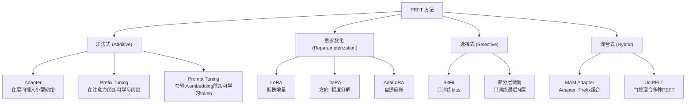

# 前置知识：参数高效微调 (PEFT) 概览——大模型适配的核心范式

> **一句话**：PEFT (Parameter-Efficient Fine-Tuning) 是一类方法的统称——它们在冻结绝大部分预训练参数的前提下，通过只训练极少量新增参数（通常 <1%），就能让大模型适配到特定下游任务。

**前置概念**：
- 基本的深度学习训练流程（前向传播、反向传播、梯度下降）
- Transformer 架构的基本结构（Self-Attention、FFN）

---

## 贯穿全文的例子

> 你有一个预训练好的 7B 参数语言模型，需要让它分别适配以下 5 个不同任务：
> 1. 中文对话
> 2. 代码生成
> 3. 医学问答
> 4. 法律文书
> 5. 机器人指令理解
>
> **全参数微调方案**：训练 5 个完整模型 → 存储 5 × 14GB = 70 GB → 服务时需要 5 个独立的推理实例
>
> **PEFT 方案**：训练 5 个小型适配模块 → 存储 14GB + 5 × 50MB = 14.25 GB → 服务时共享一个基础模型，动态切换适配器

---

## 一、为什么需要 PEFT？

### 1.1 全参数微调的三大痛点

| 痛点 | 具体描述 | 影响 |
|------|---------|------|
| **训练成本高** | 7B 模型全参数微调需要 ~80GB 显存 | 小团队/个人买不起或用不起 |
| **存储成本高** | 每个任务一份完整模型 | 多任务场景存储爆炸 |
| **灾难性遗忘** | 微调可能破坏预训练的通用能力 | 模型在非目标任务上退化 |

### 1.2 PEFT 的核心哲学

PEFT 的核心假设：

> **预训练模型已经学到了极其丰富的通用表示。适配到下游任务只需要很小的"调整量"，这个调整量可以用极少的参数来表达。**

这个假设得到了大量实证支持——多项研究表明，微调后的权重变化矩阵具有极低的内在维度。

---

## 二、PEFT 方法分类体系

PEFT 方法可以按**参数注入位置**分为四大流派：


```mermaid
flowchart TB
    PEFT["PEFT 方法"]
    PEFT --> A["加法式 (Additive)"]
    PEFT --> R["重参数化 (Reparameterization)"]
    PEFT --> S["选择式 (Selective)"]
    PEFT --> H["混合式 (Hybrid)"]
    
    A --> A1["Adapter<br/>在层间插入小型网络"]
    A --> A2["Prefix Tuning<br/>在注意力前加可学习前缀"]
    A --> A3["Prompt Tuning<br/>在输入embedding前加可学习token"]
    
    R --> R1["LoRA<br/>低秩增量"]
    R --> R2["DoRA<br/>方向+幅度分解"]
    R --> R3["AdaLoRA<br/>自适应秩"]
    
    S --> S1["BitFit<br/>只训练bias"]
    S --> S2["部分层微调<br/>只训练最后N层"]
    
    H --> H1["MAM Adapter<br/>Adapter+Prefix组合"]
    H --> H2["UniPELT<br/>门控混合多种PEFT"]
```

### 2.1 加法式方法 (Additive)

**核心思想**：在预训练模型的现有结构中**插入新的可学习模块**。

#### Adapter (2019, Houlsby et al.)

LoRA 是在权重矩阵旁边"并联"一个低秩增量，而 Adapter 走另一条路：不改动原来的权重，而是在每个 Transformer 层的 Self-Attention 和 FFN 之后**串联**插入一个小型前馈网络，让输出经过一次额外的非线性变换再传下去：

$$
\text{Adapter}(x) = x + f(x \cdot W_{\text{down}}) \cdot W_{\text{up}}
$$

> **一句话**：把输入先压缩到一个小维度、过一个非线性激活、再放大回原维度，最后加回原始输入（残差连接），整个过程只有两个小矩阵是可训练的。

**逐项拆解**：

| 符号 | 数学含义 | 具体是什么 |
|------|---------|-----------|
| $x \in \mathbb{R}^d$ | 该层原始输出（Adapter 的输入） | 如某个 Transformer 层 Self-Attention 之后的隐藏状态 |
| $W_{\text{down}} \in \mathbb{R}^{d\times r}$ | 降维矩阵 | 把 $d$ 维压缩到瓶颈维度 $r$（$r\ll d$），可训练 |
| $f(\cdot)$ | 非线性激活函数 | 如 ReLU 或 GeLU，让 Adapter 具备非线性表达能力（这是它和 LoRA 的关键区别，LoRA 全程线性） |
| $W_{\text{up}} \in \mathbb{R}^{r\times d}$ | 升维矩阵 | 把压缩后的表示映射回 $d$ 维，可训练 |
| $x + (\cdot)$ | 残差连接 | 保证即使 Adapter 部分输出为零，整体也退化为恒等映射（类似 LoRA 中 $B$ 初始化为零的效果） |

**代入数字**：设 $d=4$，$r=2$，$x=[1.0, 0.5, -0.5, 2.0]^\top$。假设 $W_{\text{down}}$ 把它投影为瓶颈表示 $x\cdot W_{\text{down}} = [0.3, -0.1]$，经过 ReLU 激活 $f$ 后变为 $[0.3, 0]$（负值被截断为 0），再乘以 $W_{\text{up}}$ 放大回 4 维，假设结果是 $[0.1, 0.05, -0.02, 0.08]$。最终输出：
$$
\text{Adapter}(x) = [1.0,0.5,-0.5,2.0] + [0.1,0.05,-0.02,0.08] = [1.1, 0.55, -0.52, 2.08]
$$
可以看到输出只在原始值基础上做了小幅调整，调整量完全由 $W_{\text{down}}, W_{\text{up}}$ 这两个小矩阵和激活函数决定。

**为什么是这个形式**：与 LoRA 的 $BA$ 相比，Adapter 中间多了一个非线性激活 $f$，因此表达能力更强，但代价是这个计算发生在主干网络的前向路径**内部**（串联），推理时必须实际执行这次额外的矩阵乘法和激活，无法像 LoRA 那样提前合并消除；这正是下面"缺点：推理时有额外计算"的根源。

#### Prefix Tuning (2021, Li & Liang)

Adapter 需要在网络内部插入新的计算模块，会引入推理延迟。Prefix Tuning 换了一个思路：完全不改变网络结构，只是在注意力机制原本要处理的 Key、Value 序列前面，拼接一段可学习的"虚拟历史"，让模型在计算注意力时能看到这些可训练向量，从而间接影响输出：

$$
\text{Attention}(Q, [P_K; K], [P_V; V])
$$

> **一句话**：给每一层的注意力偷偷加几个"假的历史 token"，这些 token 的 Key/Value 是可学习的，模型在做注意力计算时会"参考"它们，从而调整行为。

**逐项拆解**：

| 符号 | 数学含义 | 具体是什么 |
|------|---------|-----------|
| $Q$ | 真实输入产生的 Query | 与标准注意力机制中的 $Q$ 完全一样，不做改动 |
| $K, V$ | 真实输入产生的 Key、Value | 标准注意力的 $K,V$ |
| $P_K, P_V \in \mathbb{R}^{l\times d}$ | 可学习的前缀 Key、Value 矩阵 | $l$ 是设定的前缀长度（如 20），$d$ 是隐藏维度，这两个矩阵是训练时唯一更新的参数 |
| $[P_K; K]$ | 拼接操作 | 把可学习前缀放在真实 Key 序列前面，结果是长度为 $l+n$ 的序列（$n$ 是真实序列长度） |
| $\text{Attention}(Q, [P_K;K], [P_V;V])$ | 标准注意力函数，但作用在拼接后的 K/V 上 | 计算方式和普通注意力完全一样，只是 K、V 变长了 |

**代入数字**：设真实序列长度 $n=100$，前缀长度 $l=20$，隐藏维度 $d=768$。拼接后 K、V 的序列长度变为 $120$。Query 长度仍是 $100$（Query 不加前缀），所以注意力矩阵 $QK^\top$ 从原本的 $100\times100$ 变成 $100\times120$——每个真实 token 现在多了 20 个"虚拟 token"可以参与加权，这 20 个虚拟 token 的权重完全由 $P_K, P_V$ 里训练出的数值决定。

**为什么是这个形式**：不修改 Attention 计算本身的公式（Query 依然只来自真实输入），只是扩展 K、V 的候选集合，这保证了不需要改动模型代码结构（复用现成的注意力实现），代价是每次前向传播的 K、V 序列都变长了 $l$，这直接占用了本可以留给真实 token 的计算和显存预算——这正是下面"缺点：占用序列长度"的原因。

#### Prompt Tuning (2021, Lester et al.)

Prefix Tuning 要在**每一层**都插入可学习的 K/V，参数量和层数成正比。Prompt Tuning 把这个思路推向极致：只在**输入层**的 embedding 序列前面加几个可学习的向量，之后所有层都不做任何修改，让模型自己在正向传播中把这几个向量的影响传播到后续所有层：

$$
\text{input} = [\underbrace{p_1, p_2, ..., p_m}_{\text{可学习 prompt}}, x_1, x_2, ..., x_n]
$$

> **一句话**：在输入序列最前面加几个可训练的"隐藏词"，模型看到的输入变长了，但这几个词的向量是训练出来的，能引导模型往任务需要的方向走。

**逐项拆解**：

| 符号 | 含义 | 具体是什么 |
|------|------|-----------|
| $x_1,\ldots,x_n$ | 真实输入的 token embedding 序列 | 长度 $n$，与原模型输入完全一样 |
| $p_1,\ldots,p_m$ | 可学习的 soft prompt 向量 | 每个 $p_i \in \mathbb{R}^d$（与 token embedding 同维度），$m$ 通常取 10～100 |
| $[\cdot;\cdot]$ | 序列拼接 | 把 $m$ 个可学习向量放在真实输入前面，构成长度 $m+n$ 的新输入序列 |

**代入数字**：设 $d=768$（embedding 维度），$m=20$。可训练参数总量只有 $20\times768=15360$ 个数，与 Prefix Tuning 需要在每一层（比如 24 层）都存一份 $P_K,P_V$ 相比（$24\times2\times20\times768\approx737280$），Prompt Tuning 的参数量少了将近 48 倍——因为它只在输入层加了一次，后续层的"前缀效果"是通过模型自身的前向计算传递下去的，不需要额外参数。

**为什么是这个形式**：只在输入层修改，是参数效率的极致，但代价是这几个向量必须靠模型自身的深度把影响传递到所有层，对小模型（层数少、表达能力有限）效果会打折扣；这也是"缺点：效果不如 LoRA/Adapter，主要适用于大模型"的原因——大模型的深层网络能更好地放大和利用这几个向量携带的信息。

### 2.2 重参数化方法 (Reparameterization)

**核心思想**：不改变模型结构，用低秩或其他参数化方式**重新表达权重的变化量**。

#### LoRA (2022, Hu et al.)

$$
W = W_0 + \frac{\alpha}{r} BA
$$

详见 [LoRA 低秩适配基础](/前置知识/000x_前置知识_LoRA低秩适配基础)。

**核心优势**：推理时可以把 $BA$ 合并到 $W_0$，**零额外推理开销**。

#### DoRA (2024)

将权重分解为方向和幅度：$W = m \cdot \frac{V}{\|V\|}$，分别用 LoRA 适配方向 $V$，用标量适配幅度 $m$。

#### AdaLoRA (2023)

自适应地为不同层分配不同的秩 $r$——重要的层分配更多参数，不重要的层减少参数。

### 2.3 选择式方法 (Selective)

**核心思想**：不添加任何新参数，而是**选择性地解冻**预训练模型中的少量参数进行微调。

#### BitFit (2022)

前面几种方法都是"新增参数"，BitFit 走向另一个极端：不新增任何参数，只从模型本已存在的参数里挑一小部分解冻训练——具体挑的是每个线性层自带的偏置项（bias）：

$$
\text{可训练参数} = \{b_Q, b_K, b_V, b_O, b_{\text{FFN1}}, b_{\text{FFN2}}, ...\}
$$

> **一句话**：模型里本来就有的每个线性层都带一个 bias 项，正常情况下这些 bias 也会被冻结，BitFit 只解冻这些 bias，其余全部权重（包括 $W_Q,W_K,W_V$ 等主体权重）保持冻结。

**逐项拆解**：

| 符号 | 含义 | 具体是什么 |
|------|------|-----------|
| $b_Q, b_K, b_V, b_O$ | 注意力模块中 Query/Key/Value/Output 投影层各自的 bias 向量 | 维度等于对应层的输出维度 $d$ |
| $b_{\text{FFN1}}, b_{\text{FFN2}}$ | FFN 两个线性层各自的 bias 向量 | 维度分别是 FFN 中间维度和 $d$ |
| $\{\cdot\}$ | 集合 | 表示把模型中所有这类 bias 项收集起来，作为唯一可训练的参数集合 |

**代入数字**：以 $d=768$ 的 Transformer 层为例，一层大约有 6 个 bias 向量（$b_Q,b_K,b_V,b_O$ 各 768 维，加上 FFN 两个 bias 假设分别是 3072 维和 768 维），单层 bias 总数约 $4\times768+3072+768=6912$。而该层的权重矩阵总参数量约 $4\times768^2+2\times768\times3072\approx7.08\text{M}$。可训练的 bias 只占这一层参数的 $6912/7.08\text{M}\approx0.098\%$，这与文中"约占总参数 0.05%"的量级一致（具体比例随模型结构略有差异）。

**为什么是这个形式**：bias 项虽然数量少，但它直接控制每个神经元激活前的偏移量，调整 bias 相当于整体平移该层输出的分布，在一定程度上可以让模型适应新任务的输出分布偏好；但它无法像权重矩阵那样调整特征之间的组合方式，因此表达能力天然有限，这也是"缺点：效果有限，适合简单任务"的原因。

#### 部分层微调

解冻最后 N 层全参数微调，冻结前面的层。

---

## 三、方法对比：关键维度

| 方法 | 可训练参数占比 | 推理额外开销 | 效果（相对全参数） | 多任务支持 | 实现复杂度 |
|------|--------------|-------------|-------------------|-----------|-----------|
| Adapter | 0.5~3% | **有**（额外层） | 95~98% | 好 | 中 |
| Prefix Tuning | 0.1~0.5% | **有**（占序列长度） | 90~95% | 好 | 低 |
| Prompt Tuning | <0.01% | **有**（占序列长度） | 85~92% | 极好 | 极低 |
| **LoRA** | 0.1~1% | **零** | **97~100%** | 好 | 低 |
| BitFit | ~0.05% | **零** | 85~90% | 差 | 极低 |
| DoRA | 0.1~1% | **零** | **98~100%** | 好 | 中 |

**结论**：LoRA 及其变体（DoRA、AdaLoRA 等）是当前最主流的 PEFT 方法，因为它们在效果、效率、推理开销之间取得了最优平衡。

---

## 四、PEFT 在不同场景中的应用

### 4.1 自然语言处理

- **对话微调**：用 LoRA 让基础模型学会对话格式（如 ChatGPT 的 SFT 阶段）
- **指令微调**：Alpaca、Vicuna 等开源模型大量使用 LoRA
- **RLHF**：PPO 训练时用 LoRA 减少 Actor 模型的显存占用

### 4.2 计算机视觉

- **Stable Diffusion 风格微调**：用 LoRA 训练特定画风（DreamBooth + LoRA）
- **目标检测微调**：在预训练 ViT 上加 LoRA 适配到特定域

### 4.3 机器人学习

- **VLA 模型微调**：在大型 VLA（如 OpenVLA、Pi0）上用 LoRA 适配特定机器人/任务
- **多任务适配**：不同任务使用不同 LoRA 模块，共享同一个冻结的 VLA backbone
- **持续学习**：新任务只训练新的 LoRA，不干扰旧任务的 LoRA

### 4.4 多模态模型

- **视觉-语言模型微调**：LLaVA 等模型的视觉编码器或语言模型部分使用 LoRA
- **音频模型微调**：Whisper 等模型的域适配

---

## 五、PEFT 的理论基础

### 5.1 内在维度假说 (Intrinsic Dimensionality Hypothesis)

Aghajanyan et al. (2020) 证明了：

> 预训练模型的微调过程可以在一个**远低于参数总数的低维子空间**中有效进行。

具体实验：将 RoBERTa-Large (355M 参数) 的微调限制在一个随机的 $d$ 维子空间中，发现 $d \approx 200$（仅占 0.00006%）时就能恢复 90% 的全参数微调性能。

这为 LoRA 等低秩方法提供了坚实的理论基础。

### 5.2 为什么 LoRA 能逼近全参数微调？

直觉解释：
1. 预训练模型的参数空间极其冗余
2. 适配到特定任务只需要在几个关键方向上做调整
3. 这些关键方向构成一个低秩子空间
4. LoRA 的 $BA$ 恰好参数化了一个秩为 $r$ 的子空间

---

## 六、工程实践：主流框架

### 6.1 Hugging Face PEFT

```python
from peft import get_peft_model, LoraConfig, TaskType

# 定义 LoRA 配置
peft_config = LoraConfig(
    task_type=TaskType.CAUSAL_LM,
    r=16,
    lora_alpha=32,
    lora_dropout=0.05,
    target_modules="all-linear",
)

# 包装模型
model = get_peft_model(base_model, peft_config)
model.print_trainable_parameters()
# 输出: trainable params: 39,976,960 || all params: 6,738,415,616 || trainable%: 0.5934%
```

### 6.2 常见训练框架支持

| 框架 | PEFT 支持 | 特点 |
|------|----------|------|
| Hugging Face PEFT | LoRA, AdaLoRA, Prefix, Adapter... | 最完整，社区最活跃 |
| LLaMA-Factory | LoRA, QLoRA | 专注 LLM 微调，配置简单 |
| Axolotl | LoRA, QLoRA | 灵活配置 |
| Unsloth | LoRA, QLoRA | 速度优化，2-5x 加速 |

---

## 七、总结

### PEFT 的核心价值

1. **民主化大模型**：让个人和小团队也能微调大模型
2. **多任务高效部署**：一个基础模型 + N 个轻量适配器
3. **保护预训练知识**：冻结大部分参数，减少灾难性遗忘
4. **LoRA 是当前王者**：在效果、效率、实现简洁性上全面领先

### 延伸阅读

- [LoRA 低秩适配基础](/前置知识/000x_前置知识_LoRA低秩适配基础) — LoRA 的完整技术细节
- QLoRA — 量化 + LoRA 的极致显存节省
- DoRA — 方向与幅度分解的改进
- AdaLoRA — 自适应秩分配
