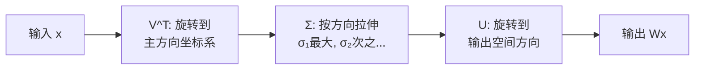

# 前置知识：矩阵的秩（Rank）与低秩近似——理解 LoRA 的数学基石

> **一句话**：矩阵的秩就是矩阵中"真正有用的独立信息方向"的数量。一个 $4096 \times 4096$ 的矩阵有 1677 万个参数，但如果它的秩只有 8，说明这 1677 万个数其实只编码了 8 个独立方向的信息——其余全是冗余。LoRA 正是利用了这一点：微调大模型时权重变化的秩很低，所以用两个小矩阵就能表达。

**前置概念**：
- 向量、矩阵乘法的基本概念
- 高中水平的线性方程组知识

**本文将回答**：
- 什么是矩阵的秩？为什么重要？
- 秩和神经网络有什么关系？
- 什么是 SVD（奇异值分解）？
- 什么是低秩近似？为什么 LoRA 能工作？

---

## 贯穿全文的例子

> 想象一个小型全连接层，权重 $W \in \mathbb{R}^{4 \times 4}$（4 个输入特征映射到 4 个输出特征）。
>
> 我们将用这个小矩阵来直观理解"秩"的含义，然后推广到大模型中 $4096 \times 4096$ 的权重矩阵。


---

## 一、从直觉开始：矩阵的秩是什么？

### 1.1 最直观的理解：独立方向的数量

考虑以下三个矩阵：

**矩阵 A（秩 = 3）**：
$$
A = \begin{pmatrix} 1 & 0 & 0 \\ 0 & 1 & 0 \\ 0 & 0 & 1 \end{pmatrix}
$$

这是单位矩阵。三行分别指向 x、y、z 三个方向——彼此完全独立，没有任何一行可以由其他行组合得到。秩 = 3。

**矩阵 B（秩 = 2）**：
$$
B = \begin{pmatrix} 1 & 0 & 0 \\ 0 & 1 & 0 \\ 1 & 1 & 0 \end{pmatrix}
$$

第三行 $[1, 1, 0]$ = 第一行 $[1, 0, 0]$ + 第二行 $[0, 1, 0]$。第三行没有提供新信息！所以虽然有 3 行，真正独立的只有 2 行。秩 = 2。

**矩阵 C（秩 = 1）**：
$$
C = \begin{pmatrix} 1 & 2 & 3 \\ 2 & 4 & 6 \\ 3 & 6 & 9 \end{pmatrix}
$$

第二行 = 第一行 × 2，第三行 = 第一行 × 3。只有一个独立方向！秩 = 1。


### 1.2 正式定义

> **矩阵的秩**（Rank）= 矩阵中线性无关的行（或列）的最大数量。

等价地：
- 秩 = 行空间的维度 = 列空间的维度
- 秩 = 矩阵能把输入空间映射到的输出子空间的维度
- 秩 = 非零奇异值的个数（后面会解释）

对于 $m \times n$ 的矩阵 $W$：
$$
0 \leq \text{rank}(W) \leq \min(m, n)
$$

如果 $\text{rank}(W) = \min(m, n)$，称为**满秩**（Full Rank）。
如果 $\text{rank}(W) < \min(m, n)$，称为**降秩**或**秩亏**（Rank Deficient）。

### 1.3 生活类比

| 类比 | 对应概念 |
|------|---------|
| 一支乐队有 5 个人，但只有 3 个人在弹不同的旋律，另外 2 个在重复前面的人 | 5×5 矩阵，秩 = 3 |
| 一间教室有 100 个学生的考试成绩（100 维向量），但所有科目成绩高度相关，基本由"理科能力"和"文科能力"两个因素决定 | 100 维数据，内在维度（近似秩）= 2 |
| 一张 1000×1000 像素的纯色图片 | 秩 = 1（所有像素相同） |
| 一张 1000×1000 的自然照片 | 秩接近满秩，但前 50 个奇异值可能包含 90% 的信息 |

---

## 二、秩和神经网络的关系

### 2.1 全连接层就是矩阵乘法

一个神经网络的全连接层（Linear Layer）本质上就是做矩阵乘法：

$$
\mathbf{y} = W \mathbf{x}
$$

其中 $W \in \mathbb{R}^{d_{\text{out}} \times d_{\text{in}}}$ 是权重矩阵。

**矩阵的秩决定了这一层能学到多少独立的"变换方向"。**

具体来说：
- 如果 $W$ 的秩 = $r$，则不管输入 $\mathbf{x}$ 是什么，输出 $\mathbf{y}$ 都只能落在一个 $r$ 维的子空间中
- 即使 $d_{\text{out}} = 4096$，如果 $\text{rank}(W) = 8$，输出的 4096 维向量实际上只有 8 个自由度

**代入数字**：
- LLaMA-7B 的注意力层 $W_Q \in \mathbb{R}^{4096 \times 4096}$
- 如果这个矩阵满秩（秩 = 4096），它可以把输入映射到 4096 维空间的任意方向
- 如果它的秩只有 256，说明输出只在 256 个方向上有变化——其余 3840 个维度是冗余的


### 2.2 一个关键事实：低秩矩阵可以用更少的参数表示

如果 $W \in \mathbb{R}^{m \times n}$ 的秩为 $r$，那么它一定可以分解为：

$$
W = B \cdot A, \quad B \in \mathbb{R}^{m \times r}, \quad A \in \mathbb{R}^{r \times n}
$$

**参数对比**：
- 原始矩阵 $W$：$m \times n$ 个参数
- 分解后 $B, A$：$m \times r + r \times n$ 个参数

**代入数字**（$m = n = 4096$, $r = 8$）：
- 原始：$4096 \times 4096 = 16,777,216$（1677 万）
- 分解：$4096 \times 8 + 8 \times 4096 = 65,536$（6.5 万）
- 压缩比：$\frac{65536}{16777216} = 0.39\%$

**惊人结论**：如果一个 1677 万参数的矩阵实际秩只有 8，我们只用 6.5 万个数就能精确表示它——节省了 99.6% 的存储。

**这就是 LoRA 的数学基础**：如果微调时权重的变化 $\Delta W$ 是低秩的，我们就可以用 $\Delta W = BA$（两个小矩阵的乘积）来参数化它，大幅减少需要训练的参数量。

### 2.3 为什么模型微调的权重变化是低秩的？

这是一个实证发现（Aghajanyan et al., 2020），直觉解释：

> 预训练模型已经学到了极其丰富的表示。微调只是在这个已有的高维空间中做"微小的方向调整"。这种调整涉及的独立方向很少——因为目标任务只需要模型在几个关键方面做出改变。

**类比**：一个训练有素的画家（预训练模型）已经掌握了上万种技巧。让他学画水墨画（新任务），他只需要在"用墨方式"、"留白技巧"等几个维度上调整——不需要重新学怎么拿笔、怎么构图。这几个"需要调整的维度"构成的子空间维度很低 → 微调的权重变化秩很低。

---

## 三、奇异值分解（SVD）：理解秩的最强工具

### 3.1 SVD 是什么？

任何 $m \times n$ 的矩阵 $W$ 都可以分解为：

$$
W = U \Sigma V^T
$$

其中：
- $U \in \mathbb{R}^{m \times m}$：**左奇异向量矩阵**（正交矩阵，列是"输出空间的方向"）
- $\Sigma \in \mathbb{R}^{m \times n}$：**奇异值对角矩阵**（对角线上的非负数从大到小排列）
- $V \in \mathbb{R}^{n \times n}$：**右奇异向量矩阵**（正交矩阵，列是"输入空间的方向"）

$$
\Sigma = \begin{pmatrix} \sigma_1 & & & \\ & \sigma_2 & & \\ & & \ddots & \\ & & & \sigma_{\min(m,n)} \end{pmatrix}, \quad \sigma_1 \geq \sigma_2 \geq \cdots \geq 0
$$


### 3.2 SVD 的直觉：矩阵在做什么？

SVD 告诉我们，**任何线性变换（矩阵乘法）都可以分解为三步**：

1. **旋转**（$V^T$）：在输入空间中找到最重要的方向
2. **拉伸**（$\Sigma$）：沿着每个方向按奇异值拉伸（$\sigma$ 大的方向拉伸多）
3. **旋转**（$U$）：把结果旋转到输出空间的对应方向



### 3.3 奇异值与秩的关系

**矩阵的秩 = 非零奇异值的个数。**

| 矩阵类型 | 奇异值分布 | 秩 |
|---------|-----------|-----|
| 单位矩阵 $I$ | 全是 1 | 满秩 |
| 零矩阵 | 全是 0 | 0 |
| 秩为 1 的矩阵 | $\sigma_1 > 0$, 其余为 0 | 1 |
| "近似低秩" | $\sigma_1 \gg \sigma_2 \gg \cdots$，快速衰减 | 名义上满秩，实际上有效秩很低 |

### 3.4 数值例子：一个 $4 \times 4$ 矩阵的 SVD

考虑：
$$
W = \begin{pmatrix} 3 & 2 & 2 \\ 2 & 3 & -2 \end{pmatrix}
$$

SVD 分解后（近似值）：
- $\sigma_1 = 5$, $\sigma_2 = 3$
- 秩 = 2（两个非零奇异值）
- 第一个方向（$\sigma_1 = 5$）比第二个（$\sigma_2 = 3$）重要 1.67 倍

**在大模型中的典型情况**：

假设 LLaMA-7B 某一层 $W_Q$ 的奇异值（共 4096 个）：

| 排名 | 奇异值 $\sigma_i$ | 累积能量占比 |
|------|-------------------|------------|
| 1 | 152.3 | 15% |
| 2 | 98.7 | 25% |
| 3 | 76.4 | 33% |
| ... | ... | ... |
| 50 | 12.1 | 80% |
| 100 | 5.3 | 90% |
| 256 | 1.2 | 97% |
| 500 | 0.3 | 99% |
| 4096 | 0.001 | 100% |

**含义**：虽然矩阵名义上是满秩（4096），但前 256 个奇异值就包含了 97% 的"能量"。后面的 3840 个方向贡献微乎其微——这个矩阵的**有效秩**大约是 256。


---

## 四、低秩近似：用少量信息捕捉矩阵的精髓

### 4.1 截断 SVD

如果我们只保留前 $r$ 个最大的奇异值和对应的奇异向量：

$$
W \approx W_r = U_r \Sigma_r V_r^T
$$

其中 $U_r \in \mathbb{R}^{m \times r}$, $\Sigma_r \in \mathbb{R}^{r \times r}$, $V_r \in \mathbb{R}^{n \times r}$。

这就是**最优的秩 $r$ 近似**——在所有秩为 $r$ 的矩阵中，$W_r$ 与 $W$ 的误差（Frobenius 范数）最小。

**Eckart-Young 定理**：
$$
\min_{\text{rank}(\tilde{W}) = r} \|W - \tilde{W}\|_F = \sqrt{\sigma_{r+1}^2 + \sigma_{r+2}^2 + \cdots}
$$

**直觉**：舍弃的误差恰好等于被丢掉的那些奇异值。如果 $\sigma_{r+1}$ 及之后的奇异值都很小，近似就很好。

### 4.2 数值例子：图像压缩

这是理解低秩近似最直观的例子。一张灰度图片可以看作一个矩阵（行×列）。

一张 $1000 \times 1000$ 的照片：
- 原始存储：$1000 \times 1000 = 1,000,000$ 个像素值
- 秩 1 近似：$1000 + 1000 + 1 = 2001$ 个数 → 模糊到只有整体亮度
- 秩 10 近似：$10 \times (1000 + 1000 + 1) = 20,010$ 个数 → 能看到大致轮廓
- 秩 50 近似：$50 \times (1000 + 1000 + 1) = 100,050$ 个数 → 主要特征清晰
- 秩 200 近似：$200 \times (1000 + 1000 + 1) = 400,200$ 个数 → 几乎与原图无差别

用 40% 的存储就能保留 99%+ 的视觉信息——因为自然图片的"有效秩"远低于像素维度。

### 4.3 低秩近似在深度学习中的意义

| 应用 | 低秩在干什么 |
|------|------------|
| **LoRA 微调** | 假设微调的权重变化 $\Delta W$ 是低秩的 → 用 $BA$ 参数化 |
| **模型压缩** | 把大权重矩阵用低秩近似替代 → 减少参数和计算 |
| **注意力近似** | 长序列注意力矩阵近似低秩 → 线性注意力方法 |
| **数据分析** | PCA 就是低秩近似 → 降维 |

---

## 五、回到 LoRA：为什么秩的概念如此关键？

### 5.1 LoRA 的核心假设

LoRA 的全部合理性建立在一个实证观察上：

> **微调时权重的变化 $\Delta W = W_{\text{微调后}} - W_{\text{预训练}}$ 具有极低的秩。**

具体数据（来自 Aghajanyan et al., 2020 和 LoRA 原始论文）：
- GPT-3 (175B) 在特定任务上微调后，各层 $\Delta W$ 的 SVD 分析显示：前 4 个奇异值占总能量的 90%+
- 也就是说，1677 万参数的权重矩阵在微调中的变化，可以被一个秩为 4 的矩阵很好地近似

### 5.2 用秩的语言重新理解 LoRA

$$
W_{\text{微调后}} = W_{\text{预训练}} + \Delta W = W_0 + BA
$$

- $\Delta W = BA$, 其中 $B \in \mathbb{R}^{d \times r}$, $A \in \mathbb{R}^{r \times k}$
- $\text{rank}(BA) \leq r$
- 所以 LoRA 在说：**微调的变化只需要 $r$ 个独立方向就够了**

**$r$ 的含义**：
- $r = 4$：微调只在 4 个独立方向上改变模型 → 4 种"调整类型"
- $r = 16$：16 个独立方向 → 更丰富的调整
- $r = 4096$（满秩）：退化为全参数微调 → 没有低秩约束


### 5.3 一个完整的数值例子

假设一个小型全连接层 $W_0 \in \mathbb{R}^{4 \times 4}$（为了方便计算用小矩阵）：

$$
W_0 = \begin{pmatrix} 1.2 & 0.5 & -0.3 & 0.8 \\ -0.1 & 2.1 & 0.4 & -0.5 \\ 0.7 & -0.2 & 1.8 & 0.3 \\ 0.4 & 0.9 & -0.1 & 1.5 \end{pmatrix}
$$

全参数微调后变成 $W_1$，变化量：
$$
\Delta W = W_1 - W_0 = \begin{pmatrix} 0.2 & 0.4 & 0.1 & 0.3 \\ 0.6 & 1.2 & 0.3 & 0.9 \\ -0.1 & -0.2 & -0.05 & -0.15 \\ 0.4 & 0.8 & 0.2 & 0.6 \end{pmatrix}
$$

仔细观察 $\Delta W$：
- 第 2 行 = 第 1 行 × 3
- 第 3 行 = 第 1 行 × (-0.5)
- 第 4 行 = 第 1 行 × 2

**所有行都是第一行的倍数！秩 = 1！**

这意味着 $\Delta W$ 可以精确分解为：
$$
\Delta W = \mathbf{b} \cdot \mathbf{a}^T = \begin{pmatrix} 1 \\ 3 \\ -0.5 \\ 2 \end{pmatrix} \begin{pmatrix} 0.2 & 0.4 & 0.1 & 0.3 \end{pmatrix}
$$

即 $B \in \mathbb{R}^{4 \times 1}$, $A \in \mathbb{R}^{1 \times 4}$，秩 $r = 1$。

**参数对比**：
- 存储完整的 $\Delta W$：$4 \times 4 = 16$ 个参数
- 存储 $B, A$：$4 + 4 = 8$ 个参数
- 节省了 50%！

在实际大模型中（$4096 \times 4096$, $r = 8$）：
- 完整 $\Delta W$：16,777,216 个参数
- $B, A$：$4096 \times 8 + 8 \times 4096 = 65,536$ 个参数
- 节省了 **99.6%**！

---

## 六、"有效秩"和"精确秩"的区别

### 6.1 精确秩 vs 有效秩

在实际中，矩阵很少恰好是低秩的。更常见的情况是**近似低秩**：

- **精确秩**：非零奇异值的个数（可能等于 $\min(m,n)$，即满秩）
- **有效秩/数值秩**：奇异值"显著大于零"的个数（主观判断）

**类比**：
- 精确秩就像问"这个班有多少人考了大于 0 分？"→ 可能全班都大于 0
- 有效秩就像问"这个班有多少人成绩真正好（比如 >60 分）？"→ 可能只有少数人

### 6.2 为什么"近似低秩"就够了？

以 LoRA 微调为例：
- 实际的 $\Delta W$ 精确秩可能是 4096（满秩）
- 但前 8 个奇异值占了 95% 的能量
- 用秩 8 的 $BA$ 近似只有 5% 的误差
- 这 5% 的误差在梯度下降中可以被进一步修正
- 最终效果与全参数微调几乎无差

**关键 insight**：深度学习对精确性的要求并不高。模型本身就有大量冗余。丢掉 5% 的"微调信号"通常不会对最终性能产生可感知的影响。


---

## 七、秩的运算性质（LoRA 中会用到）

### 7.1 乘积的秩

$$
\text{rank}(BA) \leq \min(\text{rank}(B), \text{rank}(A)) \leq \min(d, r, k) = r
$$

这就是为什么 $\Delta W = BA$（$B \in \mathbb{R}^{d \times r}$, $A \in \mathbb{R}^{r \times k}$）的秩**不超过** $r$。

### 7.2 和的秩

$$
\text{rank}(W_1 + W_2) \leq \text{rank}(W_1) + \text{rank}(W_2)
$$

这在 LoRA Merge 中很重要：合并两个秩为 $r$ 的 LoRA，结果秩最高为 $2r$。

### 7.3 秩与线性方程组

如果 $W \in \mathbb{R}^{m \times n}$ 的秩为 $r < n$，则方程 $W\mathbf{x} = \mathbf{0}$ 有 $n - r$ 维的解空间（核空间/零空间）。

**在深度学习中的含义**：如果权重矩阵秩亏，说明某些输入方向会被"压死"（映射为零），模型无法区分这些方向上的差异。

---

## 八、代码实践：用 Python 计算秩和 SVD

```python
import numpy as np
import torch

# 1. 创建一个"看起来大但实际低秩"的矩阵
d, k, r = 4096, 4096, 8  # 大矩阵，真实秩只有 8

B = np.random.randn(d, r)  # [4096, 8]
A = np.random.randn(r, k)  # [8, 4096]
W_low_rank = B @ A          # [4096, 4096]，虽然有 1677 万个元素，但秩 = 8

# 2. 验证秩
rank = np.linalg.matrix_rank(W_low_rank)
print(f"矩阵形状: {W_low_rank.shape}")
print(f"参数量: {W_low_rank.size:,}")
print(f"实际秩: {rank}")  # 输出: 8

# 3. SVD 分析
U, S, Vt = np.linalg.svd(W_low_rank, full_matrices=False)
print(f"\n前 12 个奇异值:")
print(f"  {S[:12].round(2)}")
# 输出类似: [128.5, 127.3, ..., 125.1, 0.0, 0.0, 0.0, 0.0]
# 前 8 个非零，后面全是 0（数值精度内）

# 4. 能量分析
energy = np.cumsum(S**2) / np.sum(S**2)
print(f"\n累积能量占比:")
print(f"  前 4 个奇异值: {energy[3]:.1%}")   # ~50%
print(f"  前 8 个奇异值: {energy[7]:.1%}")   # ~100%
print(f"  前 16 个奇异值: {energy[15]:.1%}") # ~100%

# 5. 低秩近似的误差
for approx_r in [1, 4, 8]:
    W_approx = U[:, :approx_r] @ np.diag(S[:approx_r]) @ Vt[:approx_r, :]
    error = np.linalg.norm(W_low_rank - W_approx) / np.linalg.norm(W_low_rank)
    print(f"  秩 {approx_r} 近似相对误差: {error:.6f}")
# 秩 8 近似误差 = 0（因为真实秩就是 8）
```

---

## 九、常见误解澄清

### 误解 1："参数多 = 秩高"

❌ 错。一个 $4096 \times 4096$ 的矩阵有 1677 万参数，但它的秩可能只有 1。

参数量是矩阵的"存储大小"，秩是矩阵的"信息维度"。就像一本 500 页的书可能翻来覆去在讲同一件事（低秩），也可能每一页都有新内容（高秩）。

### 误解 2："低秩 = 信息少 = 不好"

❌ 不一定。低秩意味着信息集中在少数方向上，这在很多场景下恰恰是高效的表现。比如：
- 一个好的分类器可能只需要在几个关键方向上区分类别
- 微调只需要调整少数方向来适配新任务

### 误解 3："LoRA 的 $r$ = 模型最终权重的秩"

❌ 不对。$r$ 是 **变化量** $\Delta W = BA$ 的秩。最终权重 $W_0 + BA$ 的秩可以是满秩（$W_0$ 本身通常是满秩的）。LoRA 限制的是"改变了多少独立方向"，而不是"模型有多少方向"。

### 误解 4："秩为 0 的矩阵就是空矩阵"

✅ 是的。秩为 0 的矩阵是全零矩阵——它把所有输入都映射为零向量。


---

## 十、秩的概念如何贯穿整个 LoRA 家族

| LoRA 变体 | 如何使用"秩"的概念 |
|-----------|-------------------|
| **LoRA** | 直接假设 $\Delta W$ 是低秩的，用 $r$ 控制秩上限 |
| **AdaLoRA** | 不同层自适应分配不同的秩（重要层给高秩） |
| **rsLoRA** | 修正缩放因子使大秩 LoRA 也能有效训练 |
| **DyLoRA** | 训练时随机采样不同秩，推理时灵活选择 |
| **MoRA** | 突破低秩限制——用相同参数量实现更高秩的更新 |
| **PiSSA** | 用 SVD 的主成分（最大奇异值对应方向）初始化 LoRA |
| **GaLore** | 利用梯度矩阵的低秩性质来压缩优化器状态 |
| **VeRA** | 固定随机基底（相当于固定秩方向），只学缩放 |

---

## 十一、总结

### 核心要点

1. **矩阵的秩 = 独立信息方向的数量**。秩低意味着信息集中、冗余多。
2. **低秩矩阵可以用更少参数精确表示**：$W = BA$，参数从 $mn$ 降到 $(m+n)r$。
3. **SVD 是分析矩阵秩的最强工具**：分解为方向 × 重要性 × 方向。
4. **大模型微调的权重变化是近似低秩的**——这是 LoRA 有效的根本原因。
5. **秩 $r$ 是 LoRA 最核心的超参数**：它决定了微调的"表达能力上限"。

### 一句话记住

> 矩阵的秩告诉你"这个矩阵到底能做多少种不同的事"。LoRA 说：微调大模型？其实你只需要做 4~16 种不同的事就够了。

---

### 延伸阅读

- [LoRA 低秩适配基础](/前置知识/000x_前置知识_LoRA低秩适配基础) — 如何利用低秩性质微调大模型
- [参数高效微调(PEFT)概览](/前置知识/000y_前置知识_参数高效微调PEFT概览) — PEFT 方法大家族
- [PiSSA 精读](/论文综述/066_PiSSA_主成分初始化LoRA) — 用 SVD 主成分初始化 LoRA
- [AdaLoRA 精读](/论文综述/057_AdaLoRA_自适应秩分配) — 自动选择每层最优秩
