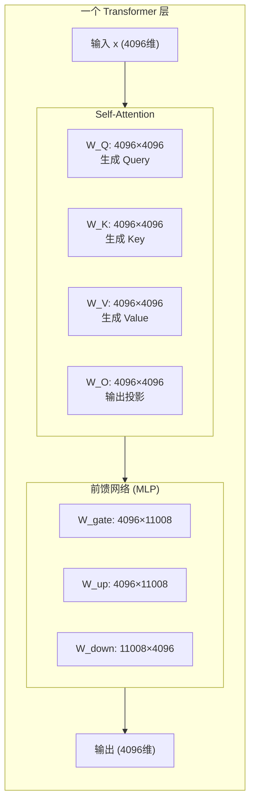
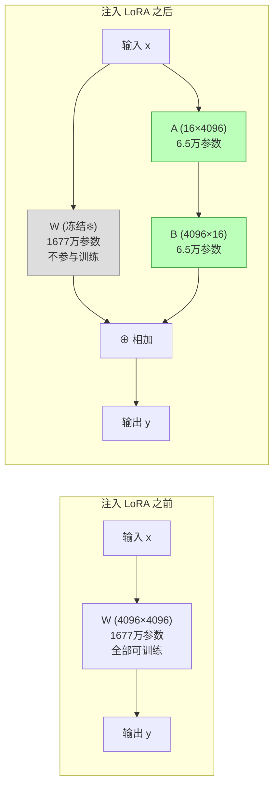
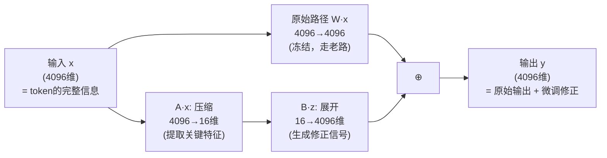
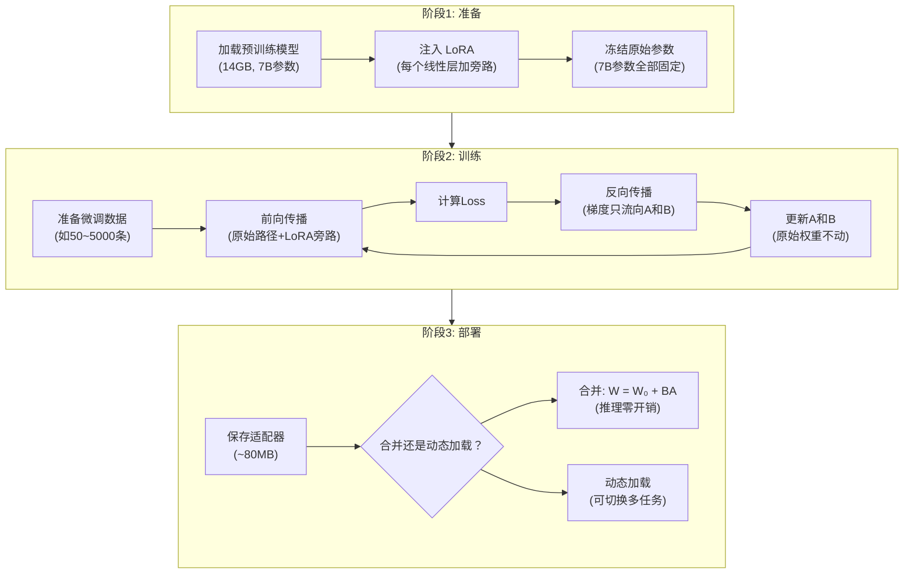

# 前置知识：LoRA 实操全流程——一个模型到底是怎么"装上"LoRA 并完成微调的？

> **一句话**：LoRA 不是一种新的模型架构，而是一种"手术"——它在已有模型的每个线性层旁边**并联一条小旁路**（两个小矩阵），冻结原模型全部参数，只训练这些旁路。训练完成后，旁路可以合并回原模型，就像什么都没发生过一样。

**前置概念**：
- [矩阵的秩与低秩近似](/前置知识/000z_前置知识_矩阵的秩与低秩近似) — 为什么可以用小矩阵近似大矩阵
- [LoRA 低秩适配基础](/前置知识/000x_前置知识_LoRA低秩适配基础) — LoRA 的数学公式

**本文目标**：如果你已经大概知道 $\Delta W = BA$ 的公式，但还是不理解"实际操作中到底怎么回事"，这篇文章帮你彻底打通。

---

## 贯穿全文的例子

> 我们手头有一个已经训练好的小模型（2 层 Transformer，隐藏维度 512），我们要用 50 条"用户提问 → 回答"数据对它做 LoRA 微调，让它学会以某种风格回答问题。
>
> 我会**逐步展示**这个过程中模型发生了什么变化——从加载原模型、注入 LoRA、训练、到最终合并部署。


---

## 一、先理解"没有 LoRA 时"模型长什么样

### 1.1 一个 Transformer 线性层的本质

Transformer 中的每一个线性层（全连接层），本质上就是一个**矩阵乘法**：

```
输入 x → [矩阵乘法 W·x] → 输出 y
```

以 LLaMA-7B 的 Query 投影层为例：
- 输入 $x$：一个 4096 维的向量（代表一个 token 的隐藏状态）
- 权重 $W_Q$：一个 $4096 \times 4096$ 的矩阵（1677 万个固定数字）
- 输出 $y = W_Q \cdot x$：一个新的 4096 维向量（Query 向量）

**关键理解**：这个矩阵 $W_Q$ 在预训练完成后就是**固定的一堆数字**。它被存在文件里（`model.safetensors`），加载到 GPU 显存中，推理时就做这一个乘法。

### 1.2 一个 Transformer 层有多少这样的矩阵？



一个 Transformer 层有 **7 个线性层**（以 LLaMA 为例）。LLaMA-7B 有 32 层，所以总共有 $32 \times 7 = 224$ 个线性层。

**全参数微调**就是允许这 224 个矩阵中的每一个数字都被修改。

---

## 二、LoRA 注入：在现有层旁边"接一条旁路"

### 2.1 核心操作：并联，不是替换

LoRA **不会修改**原始的 $W_Q$ 矩阵。它是在 $W_Q$ **旁边**并联一条小旁路：

```
原始模型：
  x → [W_Q · x] → y

加了 LoRA 之后：
  x → [W_Q · x] + [B · A · x] → y
       ↑冻结不动      ↑这是新加的旁路，可训练
```

**类比**：想象高速公路（原始模型）已经建好了，你不能拆它也不能改它。LoRA 就是在高速公路旁边修了一条**小辅路**。辅路很窄（参数少），但它可以调整最终去到的目的地（输出）。

### 2.2 代码层面发生了什么？

在代码层面，LoRA 注入的过程是**用一个包装类替换原始的线性层**：

```python
# 原始模型的一个线性层
class OriginalLinear:
    def __init__(self):
        self.weight = torch.randn(4096, 4096)  # 预训练好的权重，1677万参数
    
    def forward(self, x):
        return x @ self.weight.T  # 就是一个矩阵乘法


# 加了 LoRA 之后，这个层变成了这样：
class LinearWithLoRA:
    def __init__(self, original_weight, r=16):
        # 原始权重——冻结！不训练！
        self.weight = original_weight       # 4096×4096, 不计算梯度
        self.weight.requires_grad = False   # ← 关键：冻结
        
        # LoRA 旁路——这是唯一可训练的部分
        self.lora_A = torch.randn(16, 4096) * 0.01   # 小矩阵 A: 16×4096
        self.lora_B = torch.zeros(4096, 16)           # 小矩阵 B: 4096×16
        # B 初始化为零 → 刚开始旁路输出 = 0 → 起点就是原始模型
    
    def forward(self, x):
        # 原始路径（冻结，不产生梯度）
        original_output = x @ self.weight.T
        
        # LoRA 旁路（可训练，产生梯度）
        lora_output = x @ self.lora_A.T @ self.lora_B.T
        
        # 两者相加
        return original_output + lora_output
```

**关键点**：
1. 原始权重 `self.weight` 被**冻结**（`requires_grad = False`）→ 不训练、不更新、不算梯度
2. 新增两个小矩阵 `lora_A`（16×4096）和 `lora_B`（4096×16）→ 这是唯一参与训练的参数
3. 前向传播时，两条路径的结果**相加** → 原始能力保留，LoRA 提供微调


### 2.3 形象地看：注入前 vs 注入后



**对比**：
- 注入前：1677 万参数全部可训练
- 注入后：1677 万参数冻结 + 13 万参数可训练（A + B）
- 可训练参数减少了 **99.2%**

### 2.4 为什么 B 初始化为零？

这是一个精巧的设计。训练刚开始时：
- $B = 0$ → $BA = 0 \cdot A = 0$
- 所以 LoRA 旁路的输出 = 0
- 总输出 = $Wx + 0 = Wx$（就是原始模型的输出）

**意义**：LoRA 注入后，模型的行为**和原来完全一样**。训练是从原始模型的性能水平出发，慢慢学习调整。而不是一开始就因为随机的 LoRA 参数把模型搞乱。

---

## 三、完整的 LoRA 微调流程（逐步详解）

### 第 1 步：加载预训练模型

```python
# 从硬盘加载预训练模型（比如 LLaMA-7B）
model = load_pretrained("llama-7b")
# 此时模型有 7B 参数，全部是预训练好的数值
# 如果直接用它回答问题，它可能格式不对/风格不对/不够专业
```

### 第 2 步：注入 LoRA（"做手术"）

```python
# 遍历模型中所有线性层，给每个都"装上"LoRA 旁路
for layer in model.all_linear_layers:
    layer.lora_A = new_parameter(shape=(r, in_dim))   # 随机初始化
    layer.lora_B = new_parameter(shape=(out_dim, r))  # 零初始化
    layer.original_weight.requires_grad = False        # 冻结原始权重！

# 现在模型变成了：
# - 原始 7B 参数：全部冻结（不训练）
# - 新增 ~20M 参数（所有层的 A 和 B）：可训练
```

**这一步在实际框架中只需要两行代码**：
```python
from peft import LoraConfig, get_peft_model

config = LoraConfig(r=16, target_modules="all-linear")
model = get_peft_model(model, config)  # 一行完成注入！
```

### 第 3 步：准备训练数据

```python
# 微调数据（比如 50 条指令-回答对）
data = [
    {"input": "什么是 LoRA？", "output": "LoRA 是一种参数高效微调方法..."},
    {"input": "如何部署机器人？", "output": "首先确保硬件连接..."},
    # ... 还有 48 条
]
```

### 第 4 步：训练（只更新 A 和 B）

```python
optimizer = Adam(model.trainable_parameters())  # 只优化 A 和 B！

for epoch in range(10):
    for batch in data:
        # 前向传播
        output = model(batch["input"])
        loss = compute_loss(output, batch["output"])
        
        # 反向传播：计算梯度
        loss.backward()
        # ← 此时只有 A 和 B 有梯度（原始权重被冻结了）
        
        # 更新参数
        optimizer.step()  # 只更新 A 和 B
        optimizer.zero_grad()
```

**关键理解**：反向传播时，梯度仍然会流过整个模型（用于计算 A 和 B 的梯度），但**只有 A 和 B 被更新**。原始权重像石头一样一动不动。

### 第 5 步：保存 LoRA 适配器

```python
# 只保存 LoRA 参数（A 和 B），非常小！
save_lora_weights(model, "my_lora_adapter.bin")
# 文件大小：约 80MB（对比完整模型 14GB）
```

### 第 6 步（部署时）：合并或动态加载

**方案 A：合并到原始权重（推理零开销）**
```python
# 把 LoRA 的效果"融入"原始权重
for layer in model.all_linear_layers:
    layer.weight = layer.weight + layer.lora_B @ layer.lora_A
    # 现在 weight 包含了微调的效果
    del layer.lora_A, layer.lora_B  # 删掉旁路

# 结果：模型结构恢复原样，但权重已经包含微调效果
# 推理速度和原始模型完全相同！
```

**方案 B：动态加载（方便切换任务）**
```python
# 基础模型加载一次
base_model = load_pretrained("llama-7b")

# 切换到"数学模式"
apply_lora(base_model, "math_lora.bin")

# 切换到"代码模式"  
apply_lora(base_model, "code_lora.bin")

# 一个基础模型 + N 个小文件 = N 种能力
```


---

## 四、深入理解：训练过程中数据是怎么流动的？

### 4.1 一次前向传播的完整流程

假设输入是 "什么是 LoRA？" 这句话，经过 tokenizer 变成 token 序列 `[1234, 567, 89, 2]`。

以第 1 层的 $W_Q$（Query 投影）为例，追踪一个 token 的处理过程：

```
token embedding x = [0.12, -0.34, 0.56, ..., 0.78]  (4096维向量)

原始路径：
  y_original = W_Q · x
  = [4096×4096矩阵] · [4096维向量]
  = [一个新的4096维向量]

LoRA 旁路：
  step 1: z = A · x         ← 4096维压缩到16维
  = [16×4096矩阵] · [4096维向量]
  = [16维向量]              ← 信息被"浓缩"了！
  
  step 2: y_lora = B · z    ← 16维展开回4096维
  = [4096×16矩阵] · [16维向量]
  = [4096维向量]

最终输出：
  y = y_original + y_lora
  = [原始模型的输出] + [LoRA的修正]
```

### 4.2 信息流的直觉



**A 在做什么**：从 4096 维的输入中，提取出 16 个最与"微调目标"相关的特征维度。就像从一本 4096 页的书中，挑出 16 页最重要的来读。

**B 在做什么**：根据 A 提取出的 16 维"精华信息"，生成一个 4096 维的修正向量。告诉模型"原来的输出需要在哪些方向上微调"。

### 4.3 一次反向传播：梯度只更新 A 和 B

```
Loss = 模型输出 vs 期望输出 的差距（比如交叉熵）

反向传播计算梯度：
  ∂Loss/∂W_Q = ...  → 但 W_Q 被冻结了，这个梯度被丢弃！
  ∂Loss/∂B = ...    → 这个会被用来更新 B
  ∂Loss/∂A = ...    → 这个会被用来更新 A

优化器更新：
  B_new = B_old - lr × ∂Loss/∂B
  A_new = A_old - lr × ∂Loss/∂A
  W_Q 不变（冻结）
```

**为什么这样能省显存？**

| 组件 | 全参数微调 | LoRA 微调 |
|------|-----------|----------|
| 前向传播 | 计算 $Wx$ | 计算 $Wx + BAx$（多一点计算） |
| 存储梯度 | 为所有 7B 参数存梯度（14GB） | 只为 20M 参数存梯度（~40MB） |
| 优化器状态 | Adam 需要 2×7B×4bytes = 56GB | Adam 需要 2×20M×4bytes = 160MB |
| **总显存** | **~84 GB** | **~15 GB** |

---

## 五、模型架构上到底改了什么？实际代码对比

### 5.1 没有 LoRA 时模型的样子（以 PyTorch 为例）

```python
# LLaMA 模型简化结构
class LlamaAttention(nn.Module):
    def __init__(self, dim=4096):
        self.q_proj = nn.Linear(4096, 4096)  # Query投影
        self.k_proj = nn.Linear(4096, 4096)  # Key投影
        self.v_proj = nn.Linear(4096, 4096)  # Value投影
        self.o_proj = nn.Linear(4096, 4096)  # Output投影
    
    def forward(self, x):
        q = self.q_proj(x)  # 就是 W_Q · x
        k = self.k_proj(x)  # 就是 W_K · x
        v = self.v_proj(x)  # 就是 W_V · x
        attn_output = attention(q, k, v)
        return self.o_proj(attn_output)
```

### 5.2 注入 LoRA 后模型的样子

```python
# 注入 LoRA 后，每个 nn.Linear 被替换为 LoRALinear
class LoRALinear(nn.Module):
    def __init__(self, original_linear, r=16):
        # 保留原始权重但冻结
        self.weight = original_linear.weight  # [4096, 4096]
        self.weight.requires_grad = False     # ❄️ 冻结！
        
        # 新增 LoRA 旁路
        self.lora_A = nn.Parameter(torch.randn(r, 4096) * 0.01)  # [16, 4096]
        self.lora_B = nn.Parameter(torch.zeros(4096, r))          # [4096, 16]
    
    def forward(self, x):
        # 原始输出（不产生关于 weight 的梯度）
        original = F.linear(x, self.weight)
        
        # LoRA 旁路输出（产生关于 A 和 B 的梯度）
        lora = (x @ self.lora_A.T) @ self.lora_B.T
        
        return original + lora


# 注入过程（框架帮你做的事）
class LlamaAttention_WithLoRA(nn.Module):
    def __init__(self, dim=4096, r=16):
        # 原来的 nn.Linear 被替换成 LoRALinear
        self.q_proj = LoRALinear(original_q_proj, r=16)  # ← 替换！
        self.k_proj = LoRALinear(original_k_proj, r=16)  # ← 替换！
        self.v_proj = LoRALinear(original_v_proj, r=16)  # ← 替换！
        self.o_proj = LoRALinear(original_o_proj, r=16)  # ← 替换！
    
    def forward(self, x):
        # 用法完全不变！调用方感知不到变化
        q = self.q_proj(x)
        k = self.k_proj(x)
        v = self.v_proj(x)
        attn_output = attention(q, k, v)
        return self.o_proj(attn_output)
```

**关键理解**：LoRA 的注入就是**把模型中的每个 `nn.Linear` 替换为 `LoRALinear`**。模型的整体结构、前向传播的逻辑、输入输出的形状——全都不变。唯一变化的是每个线性层内部多了一条旁路。


---

## 六、完整实战代码：从零到微调完成

下面是一个**完整的、可以直接运行**的 LoRA 微调脚本（使用 Hugging Face 库）：

```python
from transformers import AutoModelForCausalLM, AutoTokenizer, TrainingArguments, Trainer
from peft import LoraConfig, get_peft_model, TaskType
from datasets import load_dataset
import torch

# ========== 第 1 步：加载预训练模型 ==========
model_name = "meta-llama/Llama-2-7b-hf"
model = AutoModelForCausalLM.from_pretrained(model_name, torch_dtype=torch.bfloat16)
tokenizer = AutoTokenizer.from_pretrained(model_name)

print(f"原始模型参数量: {model.num_parameters():,}")
# 输出: 原始模型参数量: 6,738,415,616 (约 6.7B)

# ========== 第 2 步：配置并注入 LoRA ==========
lora_config = LoraConfig(
    r=16,                          # 秩：旁路的"宽度"
    lora_alpha=32,                 # 缩放因子
    target_modules="all-linear",   # 对所有线性层都注入 LoRA
    lora_dropout=0.05,             # 轻度 Dropout 防过拟合
    task_type=TaskType.CAUSAL_LM,  # 任务类型：因果语言模型
)

model = get_peft_model(model, lora_config)  # ← 一行完成注入！

model.print_trainable_parameters()
# 输出: trainable params: 39,976,960 || all params: 6,778,392,576 || trainable%: 0.59%
# 解读: 67亿参数被冻结，只有 4000万 参数可训练（0.59%）

# ========== 第 3 步：准备数据 ==========
dataset = load_dataset("json", data_files="my_training_data.jsonl")
# 数据格式: {"text": "### 问题: xxx\n### 回答: yyy"}

# ========== 第 4 步：配置训练参数 ==========
training_args = TrainingArguments(
    output_dir="./lora_output",
    num_train_epochs=3,
    per_device_train_batch_size=4,
    learning_rate=2e-4,       # LoRA 的学习率通常比全参数微调大 10x
    warmup_steps=100,
    logging_steps=10,
    save_strategy="epoch",
    bf16=True,                # 使用 bfloat16 混合精度
)

# ========== 第 5 步：开始训练 ==========
trainer = Trainer(
    model=model,
    args=training_args,
    train_dataset=dataset["train"],
)
trainer.train()
# 训练中只有 LoRA 的 A 和 B 在被更新
# 原始 6.7B 参数纹丝不动

# ========== 第 6 步：保存 LoRA 适配器 ==========
model.save_pretrained("./my_lora_adapter")
# 保存的文件只有 ~80MB（对比完整模型 14GB）
# 文件内容：所有层的 lora_A 和 lora_B 矩阵

# ========== 第 7 步（部署时）：加载并合并 ==========
from peft import PeftModel

# 加载基础模型
base_model = AutoModelForCausalLM.from_pretrained(model_name)
# 加载 LoRA 适配器
model = PeftModel.from_pretrained(base_model, "./my_lora_adapter")
# 合并到基础权重（推理时零开销）
model = model.merge_and_unload()
# 现在 model 就是一个普通的 LLaMA，但行为已经被微调过了
```

---

## 七、几个关键问题的解答

### Q1：模型本身需要"支持" LoRA 吗？需要改模型代码吗？

**不需要！** 任何基于 Transformer 的模型（或者说任何有 `nn.Linear` 层的模型）都可以使用 LoRA，**不需要模型本身做任何修改**。

LoRA 是在模型外部"套"上去的：
- 模型作者不需要预先设计 LoRA 支持
- 使用者通过 PEFT 库自动注入
- 模型代码一行不改

就像你不需要改造一辆车就能给它装上行车记录仪——LoRA 是一个外部附件。

### Q2：LoRA 怎么知道要修改模型的哪些层？

由 `target_modules` 参数决定：

```python
# 只修改注意力层的 Q 和 V
config = LoraConfig(target_modules=["q_proj", "v_proj"])

# 修改所有线性层（现代最佳实践）
config = LoraConfig(target_modules="all-linear")

# 自定义选择
config = LoraConfig(target_modules=["q_proj", "k_proj", "v_proj", "o_proj",
                                     "gate_proj", "up_proj", "down_proj"])
```

PEFT 库会遍历模型中所有命名模块，凡是名字匹配的 `nn.Linear` 都会被注入 LoRA。

### Q3：训练完成后，推理时 LoRA 会让模型变慢吗？

**合并后完全不会。**

```python
# 合并前：推理要走两条路径
y = W·x + B·A·x  # 多了一次矩阵乘法

# 合并后：W_merged = W + B·A
y = W_merged · x  # 和原来完全一样的计算量！
```

合并操作只需做一次（部署前），之后推理与原始模型速度完全相同。

### Q4：多个 LoRA 可以共存吗？怎么切换？

可以！这是 LoRA 的重要优势：

```python
# 基础模型只加载一次（14GB）
base = load_model("llama-7b")

# 不同任务的适配器（每个 ~80MB）
base.load_adapter("lora_math.bin", adapter_name="math")
base.load_adapter("lora_code.bin", adapter_name="code")
base.load_adapter("lora_chat.bin", adapter_name="chat")

# 运行时切换
base.set_adapter("math")   # 现在是数学模式
output = base("证明勾股定理")

base.set_adapter("code")   # 现在是代码模式
output = base("写一个快排")
```

**类比**：基础模型是一个人的"基本素质"，每个 LoRA 适配器是一顶不同的"技能帽子"。戴上数学帽子就擅长数学，换上代码帽子就擅长编程。换帽子几乎瞬间完成（只是切换几十MB的参数）。


### Q5：LoRA 适配器文件里到底存了什么？

```
my_lora_adapter/
├── adapter_config.json    # 配置：r=16, alpha=32, target_modules=...
├── adapter_model.bin      # 所有层的 lora_A 和 lora_B 参数
└── README.md              # 元信息

adapter_model.bin 的内容（伪代码）：
{
    "layer.0.self_attn.q_proj.lora_A": tensor([16, 4096]),
    "layer.0.self_attn.q_proj.lora_B": tensor([4096, 16]),
    "layer.0.self_attn.v_proj.lora_A": tensor([16, 4096]),
    "layer.0.self_attn.v_proj.lora_B": tensor([4096, 16]),
    ... (每个被注入的层都有 A 和 B)
    "layer.31.mlp.down_proj.lora_A": tensor([16, 11008]),
    "layer.31.mlp.down_proj.lora_B": tensor([4096, 16]),
}
```

就是一堆小矩阵的数值，加上一个配置文件说明怎么把它们装回模型。

---

## 八、全流程的鸟瞰图



---

## 九、和全参数微调的对比总结

| 维度 | 全参数微调 | LoRA 微调 |
|------|-----------|----------|
| **修改了什么** | 模型全部参数 | 只有旁路的 A 和 B |
| **冻结了什么** | 无 | 原始全部参数 |
| **可训练参数量** | 7B (100%) | ~40M (0.6%) |
| **训练显存** | ~84 GB | ~15 GB |
| **训练速度** | 慢 | 快 2-3x |
| **保存大小** | 14 GB/任务 | ~80 MB/任务 |
| **推理速度** | 正常 | 合并后与正常相同 |
| **多任务支持** | 每任务一个完整模型 | 一个基础模型+多个适配器 |
| **灾难性遗忘** | 严重 | 轻微（原始参数未动） |
| **效果** | 100%（上限） | 95~100%（接近上限） |

---

## 十、总结

### 核心要点

1. **LoRA 不修改模型架构**——它是在每个线性层旁边并联一条小旁路
2. **注入过程**：把 `nn.Linear` 替换为 `LoRALinear`（旧权重冻结 + 新增 A/B 小矩阵）
3. **训练过程**：前向走两条路径相加，反向只更新 A 和 B
4. **部署时**：合并 $W_{\text{new}} = W_0 + BA$ → 推理零开销
5. **模型不需要预先"支持" LoRA**——任何有线性层的模型都能用
6. **适配器文件很小**——一个基础模型 + 多个小适配器 = 多种能力

### 一句话记住

> LoRA = 冻结老师（预训练模型），在旁边放一个小学生（A和B矩阵）跟着学。小学生学到的东西加到老师身上，老师就会做新任务了。

---

### 延伸阅读

- [矩阵的秩与低秩近似](/前置知识/000z_前置知识_矩阵的秩与低秩近似) — 为什么 A、B 这么小就够用
- [LoRA 低秩适配基础](/前置知识/000x_前置知识_LoRA低秩适配基础) — LoRA 的数学细节（$\alpha$、初始化等）
- [参数高效微调(PEFT)概览](/前置知识/000y_前置知识_参数高效微调PEFT概览) — LoRA 在方法家族中的位置
- [QLoRA 精读](/论文综述/056_QLoRA_量化低秩适配) — 进一步省显存：4-bit 量化 + LoRA
