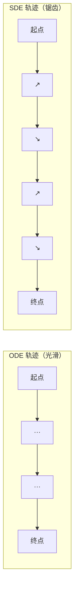
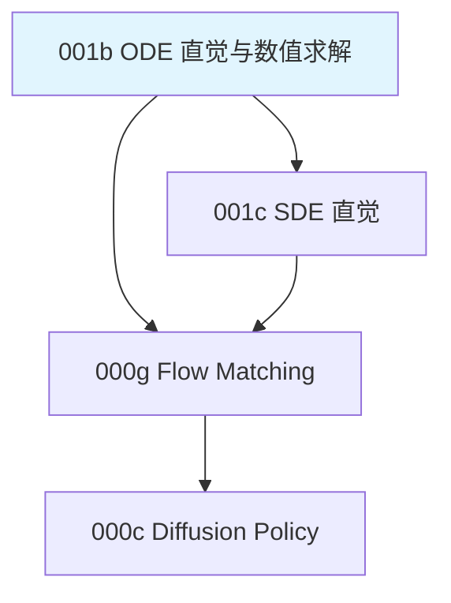

# 前置知识：常微分方程 ODE——直觉与数值求解

> **为什么要读这篇**：在 Flow Matching、连续归一化流（CNF）、Neural ODE 等现代生成模型中，"ODE"是核心数学语言。很多教程直接写出 $\frac{\mathrm{d}\mathbf{x}}{\mathrm{d}t} = v_\theta(\mathbf{x}, t)$ 就开始推导，默认读者知道 ODE 是什么、怎么数值求解。本文从零建立 ODE 的直觉，并讲清楚它在深度学习中为什么重要。
> **前置要求**：高中微积分（导数、积分的基本概念）

**标签**: `#前置知识` `#ODE` `#常微分方程` `#数值求解` `#Euler方法` `#Neural ODE`

**知识链接**：
- [随机微分方程 SDE](./001c_前置知识_随机微分方程SDE直觉与扩散模型的联系) — ODE 的"加了随机性"的兄弟
- [Flow Matching 与连续归一化流](./000g_前置知识_Flow_Matching与连续归一化流) — ODE 在生成模型中的核心应用
- [扩散模型 DDPM](./000b_前置知识_扩散模型DDPM) — 从 SDE 视角理解 DDPM，然后通过 Probability Flow ODE 桥接到 Flow Matching

---

## 一、ODE 是什么？一句话版本

> **ODE（Ordinary Differential Equation，常微分方程）**：一个描述"某个量的变化速度"的方程。

就这么简单。你告诉我"速度是多少"，我就能从起点一路跑到终点。

---

## 二、从生活例子建立直觉

### 2.1 最简单的例子：匀速行驶的车

一辆车以 60 km/h 的速度行驶。用数学写：

$$
\frac{\mathrm{d}x}{\mathrm{d}t} = 60
$$

**拆解**：
- $x$：车的位置（km）
- $t$：时间（小时）
- $\frac{\mathrm{d}x}{\mathrm{d}t}$：位置对时间的变化率 = 速度
- 右边的 $60$：速度是常数 60 km/h

如果车在 $t=0$ 时位于 $x=0$（起点），那 $t$ 小时后车在哪？

$$
x(t) = 60t
$$

这就是 ODE 的**解**：给定初始条件和变化规则，算出任意时刻的状态。

### 2.2 稍难一点：变速行驶

如果速度不是常数，而是和当前位置有关呢？比如"离终点越远，开得越快"：

$$
\frac{\mathrm{d}x}{\mathrm{d}t} = 100 - x
$$

- 当 $x=0$（刚出发），速度 = 100，很快
- 当 $x=50$（走了一半），速度 = 50，慢了
- 当 $x=99$（快到了），速度 = 1，很慢

这个方程的解析解是 $x(t) = 100(1 - e^{-t})$，车永远接近但不会完全到达 $x=100$。

**关键观察**：ODE 的右边（速度/变化率）可以依赖当前状态 $x$ 本身，这让系统有了"反馈"——当前位置影响未来走向。

### 2.3 向量版本：多维空间中的运动

如果不是一维的位置，而是二维平面上的点 $\mathbf{x} = (x_1, x_2)$？

$$
\frac{\mathrm{d}\mathbf{x}}{\mathrm{d}t} = \mathbf{v}(\mathbf{x}, t)
$$

这里 $\mathbf{v}(\mathbf{x}, t)$ 是一个**向量场**——在每个位置、每个时刻都给出一个"走哪个方向、走多快"的箭头。

想象你站在一条河流中：
- 河流的水流方向就是向量场
- 你的位置 $\mathbf{x}$ 随时间被水流带着走
- ODE 描述了"你在时刻 $t$、位置 $\mathbf{x}$ 处被带动的速度"

**这就是 Flow Matching 中"流"的含义**：一群粒子（噪声样本）在向量场中流动，最终到达数据分布。

---

## 三、ODE 的一般形式与术语

### 3.1 标准形式

$$
\frac{\mathrm{d}\mathbf{x}}{\mathrm{d}t} = f(\mathbf{x}, t), \quad \mathbf{x}(t_0) = \mathbf{x}_0
$$

| 术语 | 含义 | 例子 |
|------|------|------|
| $\mathbf{x}(t)$ | 状态（随时间变化的量） | 粒子位置、图像像素、机器人动作 |
| $t$ | 时间（自变量） | 从 0 到 1 |
| $f(\mathbf{x}, t)$ | 向量场 / 速度场 / 漂移项 | 网络 $v_\theta(\mathbf{x}, t)$ 的输出 |
| $\mathbf{x}(t_0) = \mathbf{x}_0$ | 初始条件 | 从标准正态分布采样的噪声 |
| 解 $\mathbf{x}(t)$ | 满足方程的轨迹 | 从噪声到数据的一条路径 |

### 3.2 为什么叫"常"微分方程

"常"（Ordinary）是相对于"偏"（Partial）而言的：
- **ODE**：只有一个自变量（时间 $t$），导数是 $\frac{\mathrm{d}}{\mathrm{d}t}$
- **PDE**（偏微分方程）：有多个自变量（如时间+空间），导数是 $\frac{\partial}{\partial t}$、$\frac{\partial}{\partial x}$ 等

在深度学习的生成模型中，我们几乎只关心 ODE。

### 3.3 "解 ODE"意味着什么

给定：
- 初始状态 $\mathbf{x}_0$
- 变化规则 $f(\mathbf{x}, t)$

求：
- 从 $t=0$ 到 $t=1$ 的轨迹 $\mathbf{x}(t)$，特别是终点 $\mathbf{x}(1)$

如果 $f$ 形式简单（如常数或线性），可以手算解析解。但在深度学习中，$f$ 是一个神经网络——没有解析解，只能**数值求解**。

---

## 四、数值求解 ODE：从 Euler 到高阶方法

### 4.1 核心思想：小步推进

既然无法一步跳到答案，那就把时间切成很多小段，每一小段内假设速度不变，一步一步走过去。

### 4.2 Euler 方法（1 阶）

**想法**：在当前位置算出速度，假设这个速度在整个 $\Delta t$ 内不变，走一步。

$$
\mathbf{x}_{t+\Delta t} = \mathbf{x}_t + \Delta t \cdot f(\mathbf{x}_t, t)
$$

**具体数值例子**：

假设 $f(x, t) = -x$（指数衰减），初始 $x_0 = 10$，求 $x(1)$。

精确解：$x(1) = 10 \cdot e^{-1} \approx 3.679$

用 Euler 方法，步长 $\Delta t = 0.5$（2 步）：

| 步骤 | $t$ | $x$ | $f(x,t) = -x$ | $x_{\text{new}} = x + 0.5 \cdot (-x)$ |
|------|-----|------|----------------|---------------------------------------|
| 0 | 0 | 10 | -10 | $10 + 0.5 \times (-10) = 5$ |
| 1 | 0.5 | 5 | -5 | $5 + 0.5 \times (-5) = 2.5$ |

结果：$x(1) = 2.5$，精确值 3.679，误差 32%。

步长 $\Delta t = 0.25$（4 步）：

| 步骤 | $t$ | $x$ | $x_{\text{new}} = x \times 0.75$ |
|------|-----|------|----------------------------------|
| 0 | 0 | 10 | 7.5 |
| 1 | 0.25 | 7.5 | 5.625 |
| 2 | 0.5 | 5.625 | 4.219 |
| 3 | 0.75 | 4.219 | 3.164 |

结果：$x(1) = 3.164$，误差 14%。步数翻倍，误差减半——这就是 1 阶精度的特征。

### 4.3 中点法（Midpoint，2 阶）

**为什么需要这个方法**：Euler 方法用起点的速度来代表整段的速度，如果速度在这一段内变化很大，误差就大。能不能先"探路"看看中间的速度是多少，再用更准的速度走整步？

$$
\begin{aligned}
\mathbf{k}_1 &= f(\mathbf{x}_t, t) \\
\mathbf{x}_{\text{mid}} &= \mathbf{x}_t + \frac{\Delta t}{2} \cdot \mathbf{k}_1 \\
\mathbf{k}_2 &= f(\mathbf{x}_{\text{mid}}, t + \frac{\Delta t}{2}) \\
\mathbf{x}_{t+\Delta t} &= \mathbf{x}_t + \Delta t \cdot \mathbf{k}_2
\end{aligned}
$$

> **一句话直觉**：先用起点速度走半步"侦察"，看看半路的速度是多少，再用半路的速度从起点走完整步。

**逐项拆解**：

| 行 | 含义 | 类比 |
|---|---|---|
| $\mathbf{k}_1 = f(\mathbf{x}_t, t)$ | 在起点算速度（和 Euler 一样） | 站在门口看路况 |
| $\mathbf{x}_{\text{mid}} = \mathbf{x}_t + \frac{\Delta t}{2} \cdot \mathbf{k}_1$ | 用起点速度"试探性"走半步 | 先走到路中间看看 |
| $\mathbf{k}_2 = f(\mathbf{x}_{\text{mid}}, t + \frac{\Delta t}{2})$ | 在中间点重新算速度 | 在路中间重新看路况 |
| $\mathbf{x}_{t+\Delta t} = \mathbf{x}_t + \Delta t \cdot \mathbf{k}_2$ | 用中间的速度，从**起点**走整步 | 用更准的信息做最终决策 |

**具体数值例子**：$f(x, t) = -x$，$x_0 = 10$，$\Delta t = 0.5$

- $\mathbf{k}_1 = f(10, 0) = -10$（起点速度）
- $\mathbf{x}_{\text{mid}} = 10 + 0.25 \times (-10) = 7.5$（走到中间看看）
- $\mathbf{k}_2 = f(7.5, 0.25) = -7.5$（中间点的速度）
- $\mathbf{x}_{0.5} = 10 + 0.5 \times (-7.5) = 6.25$

精确解 $x(0.5) = 10 \cdot e^{-0.5} = 6.065$。Midpoint 结果 6.25，误差 3%；而 Euler 给出 5.0，误差 17.5%。精度提升 5 倍！

**代价**：每步要算 2 次 $f$（2 次网络前向传播），但精度提高一个数量级。

**为什么这个形式有效**：Euler 相当于用矩形面积近似曲线下面积（左端点），Midpoint 相当于用中点值近似——中点法在数值积分中本来就比左端点法精确得多。

### 4.4 RK4（Runge-Kutta 4 阶）

**为什么需要这个方法**：Midpoint 看了 2 个点（起点和中间），如果曲线更复杂呢？RK4 看 4 个点——起点、两个中间点、终点——然后加权平均，像是"综合了更多情报"后做决策。

$$
\begin{aligned}
\mathbf{k}_1 &= f(\mathbf{x}_t, t) \\
\mathbf{k}_2 &= f\!\left(\mathbf{x}_t + \frac{\Delta t}{2}\mathbf{k}_1,\; t + \frac{\Delta t}{2}\right) \\
\mathbf{k}_3 &= f\!\left(\mathbf{x}_t + \frac{\Delta t}{2}\mathbf{k}_2,\; t + \frac{\Delta t}{2}\right) \\
\mathbf{k}_4 &= f\!\left(\mathbf{x}_t + \Delta t \cdot \mathbf{k}_3,\; t + \Delta t\right) \\
\mathbf{x}_{t+\Delta t} &= \mathbf{x}_t + \frac{\Delta t}{6}\left(\mathbf{k}_1 + 2\mathbf{k}_2 + 2\mathbf{k}_3 + \mathbf{k}_4\right)
\end{aligned}
$$

> **一句话直觉**：在起点、中间（两种方式）、终点各看一次速度，按 1:2:2:1 加权平均后走一步。看得越多，走得越准。

**逐项拆解**：

| 行 | 含义 | 类比 |
|---|---|---|
| $\mathbf{k}_1 = f(\mathbf{x}_t, t)$ | 起点速度 | 站在门口看一次路况 |
| $\mathbf{k}_2 = f(\mathbf{x}_t + \frac{\Delta t}{2}\mathbf{k}_1, t+\frac{\Delta t}{2})$ | 用 $\mathbf{k}_1$ 走到中间，看中间速度 | 用第一个情报走到路中间看 |
| $\mathbf{k}_3 = f(\mathbf{x}_t + \frac{\Delta t}{2}\mathbf{k}_2, t+\frac{\Delta t}{2})$ | 用 $\mathbf{k}_2$（更准的中间速度）再走到中间 | 用更准的情报重新走到路中间 |
| $\mathbf{k}_4 = f(\mathbf{x}_t + \Delta t \cdot \mathbf{k}_3, t+\Delta t)$ | 用 $\mathbf{k}_3$ 走到终点，看终点速度 | 走到路尽头看看那边啥情况 |
| 最终：$\frac{\Delta t}{6}(\mathbf{k}_1 + 2\mathbf{k}_2 + 2\mathbf{k}_3 + \mathbf{k}_4)$ | 加权平均所有情报，做最终决策 | 综合所有侦察结果选最优路径 |

**为什么权重是 1:2:2:1**：这来自 Simpson 积分法则——给中间点更高的权重，因为中间点的信息对整段积分贡献最大。$\frac{1+2+2+1}{6} = 1$，保证总权重为 1。

**具体数值例子**：$f(x, t) = -x$，$x_0 = 10$，$\Delta t = 1.0$（一步跨完！）

- $\mathbf{k}_1 = -10$
- $\mathbf{k}_2 = f(10 + 0.5 \times (-10), 0.5) = f(5, 0.5) = -5$
- $\mathbf{k}_3 = f(10 + 0.5 \times (-5), 0.5) = f(7.5, 0.5) = -7.5$
- $\mathbf{k}_4 = f(10 + 1.0 \times (-7.5), 1.0) = f(2.5, 1.0) = -2.5$
- $x_1 = 10 + \frac{1}{6}[(-10) + 2(-5) + 2(-7.5) + (-2.5)] = 10 + \frac{1}{6}(-37.5) = 10 - 6.25 = 3.75$

精确解：$10 \cdot e^{-1} = 3.679$。只用 **1 步** RK4 就得到 3.75，误差仅 1.9%！而 1 步 Euler 给出 0（误差 100%）。

**代价**：每步 4 次网络前向传播。但精度极高，适合步数极少（2-3 步）的场景。

### 4.5 精度对比总结

| 方法 | 每步网络调用次数 | 局部截断误差 | 适用场景 |
|------|-----------------|-------------|---------|
| Euler（1 阶） | 1 | $O(\Delta t^2)$ | 步数充裕（5-10 步） |
| Midpoint（2 阶） | 2 | $O(\Delta t^3)$ | 中等步数（3-5 步） |
| RK4（4 阶） | 4 | $O(\Delta t^5)$ | 极少步数（2-3 步） |

**直觉**：误差 $\sim O(\Delta t^{k+1})$ 中，$k$ 是方法的阶数。阶数越高，步长 $\Delta t$ 越大时仍然准确。

**对 Flow Matching 的意义**：

$$
\text{总网络调用次数} = \text{步数} \times \text{每步调用次数}
$$

- Euler 5 步 = 5 次调用，精度 OK
- Midpoint 3 步 = 6 次调用，精度更好
- RK4 2 步 = 8 次调用，精度极好

实践中 Euler 5-10 步是最常用的选择（简单、快、够好）。

---

## 五、ODE 在深度学习中的角色

### 5.1 Neural ODE（Chen et al., 2018）

Neural ODE 的核心想法：**把神经网络看成连续深度的 ODE**。

传统的 ResNet 做了什么？

$$
\mathbf{h}_{l+1} = \mathbf{h}_l + f_\theta(\mathbf{h}_l, l)
$$

> **一句话直觉**：下一层的输出 = 当前层的输出 + 一个"修正量"。

**拆解**：
- $\mathbf{h}_l$：第 $l$ 层的隐藏状态
- $f_\theta(\mathbf{h}_l, l)$：第 $l$ 层的残差块输出（"这一层要加什么修正"）
- $+$：残差连接（ResNet 的核心）

这不就是 Euler 步进吗！把层号 $l$ 当时间，步长 $\Delta t = 1$，$f_\theta$ 当向量场，ResNet 就是在用 Euler 方法"解 ODE"。

Neural ODE 把离散的层变成连续的时间：

$$
\frac{\mathrm{d}\mathbf{h}}{\mathrm{d}t} = f_\theta(\mathbf{h}(t), t), \quad \mathbf{h}(0) = \text{输入}, \quad \mathbf{h}(1) = \text{输出}
$$

> **一句话直觉**：不再一层层堆叠网络，而是定义一个"连续变换场"，输入数据在这个场中流动，流到终点就是输出。

**拆解**：
- $\mathbf{h}(0) = \text{输入}$：数据从 $t=0$ 开始
- $f_\theta(\mathbf{h}(t), t)$：一个由参数 $\theta$ 定义的向量场，决定数据在每个时刻的变化速度
- $\mathbf{h}(1) = \text{输出}$：积分到 $t=1$ 就是网络的输出

**和 ResNet 的精确对应**：ResNet 是 Neural ODE 的 Euler 离散化。层数 = ODE 步数。加更多层 ≈ 用更小步长解 ODE ≈ 更精确。

### 5.2 连续归一化流（CNF）

用 ODE 做生成模型：

$$
\frac{\mathrm{d}\mathbf{x}}{\mathrm{d}t} = v_\theta(\mathbf{x}, t)
$$

- $t=0$：从简单分布（如正态分布）采样
- $t=1$：积分到达数据分布

**关键性质**：ODE 是可逆的——从 $t=0$ 到 $t=1$ 生成数据，从 $t=1$ 到 $t=0$ 可以计算数据的概率密度。这利用了"变量替换公式"（instantaneous change of variables）：

$$
\log p_1(\mathbf{x}_1) = \log p_0(\mathbf{x}_0) - \int_0^1 \mathrm{div}\big(v_\theta(\mathbf{x}_t, t)\big)\,\mathrm{d}t
$$

> **一句话直觉**：这个公式告诉你——如果你知道起点的概率密度（正态分布，好算），再沿路跟踪向量场"压缩或拉伸"空间的程度，就能算出终点的概率密度。

**逐项拆解**：

| 符号 | 含义 | 直觉 |
|------|------|------|
| $\log p_1(\mathbf{x}_1)$ | 生成出的数据点 $\mathbf{x}_1$ 的对数概率密度 | 你想求的东西——"这个样本有多可能" |
| $\log p_0(\mathbf{x}_0)$ | 起点噪声 $\mathbf{x}_0$ 的对数概率密度 | 标准正态分布，直接算：$-\frac{d}{2}\log(2\pi) - \frac{1}{2}\|\mathbf{x}_0\|^2$ |
| $\int_0^1 (\cdots)\,\mathrm{d}t$ | 从 $t=0$ 到 $t=1$ 沿路径累加 | "一路上空间被挤压/拉伸了多少" |
| $\mathrm{div}(v_\theta) = \sum_{i=1}^d \frac{\partial v_i}{\partial x_i}$ | 向量场的**散度** | 正值=空间在膨胀（密度下降），负值=空间在收缩（密度上升） |

**为什么需要散度**：想象一群水分子在河中流动。如果某处河道变窄（散度<0），水流速度加快但密度增大；如果河道变宽（散度>0），速度变慢密度变小。散度正好衡量了"局部空间的膨胀率"。

**数值例子**：假设 $d=2$，$\mathbf{x}_0 = [0.5, -0.3]$（噪声采样）

- $\log p_0(\mathbf{x}_0) = -\log(2\pi) - \frac{1}{2}(0.5^2 + 0.3^2) = -1.837 - 0.17 = -2.007$
- 假设沿路径积分得到 $\int_0^1 \mathrm{div}(v_\theta)\,\mathrm{d}t = 0.5$（空间轻微膨胀）
- 则 $\log p_1(\mathbf{x}_1) = -2.007 - 0.5 = -2.507$

**为什么是减号**：散度为正=空间膨胀=同样多的"概率质量"分散到更大体积=密度降低=log 概率减小。

### 5.3 Flow Matching 中的 ODE

Flow Matching 就是在训练一个向量场 $v_\theta$，让 ODE：

$$
\frac{\mathrm{d}\mathbf{x}}{\mathrm{d}t} = v_\theta(\mathbf{x}, t)
$$

从噪声 $\mathbf{x}_0 \sim \mathcal{N}(\mathbf{0}, \mathbf{I})$ 流到数据 $\mathbf{x}_1$。

推理时就是**数值解这个 ODE**——用 Euler 方法走 5-10 步：

$$
\mathbf{x}_{t+\Delta t} = \mathbf{x}_t + \Delta t \cdot v_\theta(\mathbf{x}_t, t)
$$

每一步的 $v_\theta(\mathbf{x}_t, t)$ 就是一次网络前向传播。所以 5 步 = 5 次前向传播 = 5 次网络推理。

### 5.4 Probability Flow ODE

DDPM 本质上是一个 SDE（有随机性），但 Song et al. (2021) 证明：每个 SDE 都有一个对应的 ODE，产生相同的概率分布演化。这个 ODE 被称为 **Probability Flow ODE**：

$$
\frac{\mathrm{d}\mathbf{x}}{\mathrm{d}t} = f(\mathbf{x},t) - \frac{1}{2}g(t)^2 \nabla_{\mathbf{x}} \log p_t(\mathbf{x})
$$

> **一句话直觉**：这个 ODE 说的是——粒子的速度 = 原来的漂移方向 + 一个"被数据吸引"的力。后面那个力（score function）会把粒子从噪声区域拉向数据密度高的区域。

**逐项拆解**：

| 符号 | 含义 | 直觉 |
|------|------|------|
| $\frac{\mathrm{d}\mathbf{x}}{\mathrm{d}t}$ | 粒子在 $t$ 时刻的速度 | 粒子往哪走、走多快 |
| $f(\mathbf{x}, t)$ | 原始 SDE 的漂移项 | "惯性"——如果没有数据引导，粒子会怎么走 |
| $\frac{1}{2}g(t)^2$ | 扩散系数的平方的一半 | 噪声越大（$g$ 越大），score 引导力越强 |
| $\nabla_{\mathbf{x}} \log p_t(\mathbf{x})$ | **Score function**——概率密度的梯度 | 指向"数据更多的方向"，把粒子拉向数据 |
| 前面的负号 | 减去意味着"反向"——从噪声走向数据 | 生成（从噪声到数据）是去噪方向 |

**为什么是 $\frac{1}{2}g^2$ 而不是 $g^2$**：在逆向 SDE 中 score 的系数是 $g^2$，但那里还有随机噪声 $g\mathrm{d}\bar{\mathbf{W}}$ 帮助"探索"。ODE 没有随机项了，所以只需要一半的 score 引导力就能达到相同的分布演化效果。直觉上：SDE 的随机项贡献了另一半"扩散力"。

**数值例子**：假设在某时刻 $t=0.5$，位置 $\mathbf{x} = [2, 3]$

- $f(\mathbf{x}, t) = -0.5 \times 0.5 \times [2, 3] = [-0.5, -0.75]$（VP-SDE 的漂移：往零拉）
- $g(t) = \sqrt{0.5} \approx 0.707$，$\frac{1}{2}g^2 = 0.25$
- 假设 score $\nabla \log p_t(\mathbf{x}) = [-1, -2]$（指向原点方向=数据密度更高的方向）
- 速度 = $[-0.5, -0.75] - 0.25 \times [-1, -2] = [-0.5, -0.75] + [0.25, 0.5] = [-0.25, -0.25]$

粒子以速度 $[-0.25, -0.25]$ 朝原点方向移动，逐步回到数据分布。

意义：可以用确定性的 ODE 求解器来做 DDPM 的采样，理论上比 SDE 更快。

> 更多关于 SDE 的内容，请阅读 [随机微分方程 SDE](./001c_前置知识_随机微分方程SDE直觉与扩散模型的联系)。

---

## 六、为什么 ODE 比 SDE 需要更少步数？

这是 Flow Matching 比 DDPM 更快的数学根源。详细对比：

| | ODE | SDE |
|---|---|---|
| 方程 | $\mathrm{d}\mathbf{x} = f(\mathbf{x},t)\,\mathrm{d}t$ | $\mathrm{d}\mathbf{x} = f(\mathbf{x},t)\,\mathrm{d}t + g(t)\,\mathrm{d}\mathbf{W}$ |
| 路径性质 | 确定性、光滑 | 随机、到处不可微 |
| 数值精度 | 高阶方法有效（RK4 精度 $O(\Delta t^5)$） | 高阶方法被随机噪声淹没 |
| 步数需求 | 4-10 步 | 20-100 步 |
| 同一初始点的结果 | 唯一确定 | 每次不同（随机） |

**直觉**：ODE 的轨迹是一条光滑曲线，沿着曲线走大步也不会偏太远；SDE 的轨迹是锯齿状的随机游走，你必须走小步才能跟上它的方向变化。



---

## 七、代码示例：用 Euler 方法解 ODE

```python
import numpy as np

def euler_solve(f, x0, t_start, t_end, num_steps):
    """
    用 Euler 方法解 ODE: dx/dt = f(x, t)
    
    参数:
        f: 向量场函数 f(x, t) -> dx/dt
        x0: 初始状态
        t_start: 起始时间
        t_end: 结束时间
        num_steps: 步数
    
    返回:
        x_final: 终点状态
    """
    dt = (t_end - t_start) / num_steps
    x = x0.copy()
    t = t_start
    
    for _ in range(num_steps):
        x = x + dt * f(x, t)  # 核心：一步 Euler
        t = t + dt
    
    return x


# 示例 1：简单指数衰减 dx/dt = -x
f_decay = lambda x, t: -x
x_result = euler_solve(f_decay, np.array([10.0]), 0, 1, 10)
print(f"Euler (10步): {x_result[0]:.4f}, 精确解: {10*np.exp(-1):.4f}")

# 示例 2：模拟 Flow Matching 推理
# 假设 v_theta 是一个训练好的网络（这里用线性近似代替）
def fake_v_theta(x, t):
    """假装这是训练好的网络，实际上是 target - x"""
    target = np.array([3.0, 5.0])  # 目标数据点
    return target - x  # 这就是条件向量场的简化版

x0 = np.random.randn(2)  # 采样噪声
x_generated = euler_solve(fake_v_theta, x0, 0, 1, 5)
print(f"5步生成结果: {x_generated}")  # 应该接近 [3, 5]
```

---

## 八、常见疑问

### Q1：ODE 和积分有什么关系？

$$
\frac{\mathrm{d}\mathbf{x}}{\mathrm{d}t} = f(\mathbf{x}, t) \quad \Longleftrightarrow \quad \mathbf{x}(T) = \mathbf{x}(0) + \int_0^T f(\mathbf{x}(t), t)\,\mathrm{d}t
$$

"解 ODE"就是"做积分"。数值解 ODE 就是数值积分。Euler 方法就是矩形法求积分。

### Q2：为什么不直接积分，要一步步走？

因为 $f(\mathbf{x}, t)$ 里面有 $\mathbf{x}$——被积函数依赖积分变量本身！这不是普通的 $\int g(t)\,\mathrm{d}t$（那种可以直接算），而是一个自我引用的系统。必须"走一步算一步"。

### Q3：Flow Matching 里的 ODE 时间方向是什么？

- $t=0$：纯噪声 $\mathbf{x}_0 \sim \mathcal{N}(\mathbf{0}, \mathbf{I})$
- $t=1$：干净数据 $\mathbf{x}_1$
- 从 $t=0$ **正向**积分到 $t=1$ = 生成数据

注意这和 DDPM 的惯例**相反**！DDPM 通常 $t=0$ 是数据，$t=T$ 是噪声。

### Q4：Neural ODE 和普通网络的区别是什么？

| | 普通 ResNet | Neural ODE |
|---|---|---|
| 深度 | 离散的 $L$ 层 | 连续的 $t \in [0,1]$ |
| 内存 | 存所有中间层（$O(L)$） | 伴随方法反向传播（$O(1)$） |
| 前向传播 | 逐层计算 | ODE 求解器 |
| 灵活性 | 固定层数 | 可自适应步数 |

---

## 九、总结

### 一句话

> ODE 就是"告诉你速度，从起点积分到终点"的方程。在 Flow Matching 中，神经网络充当速度场 $v_\theta$，用 Euler 方法走 5-10 步就能从噪声生成数据。

### 核心要点

1. ODE = 描述变化率的方程，$\frac{\mathrm{d}\mathbf{x}}{\mathrm{d}t} = f(\mathbf{x}, t)$
2. 数值求解 = 把时间切碎，每步用当前速度走一小段
3. Euler（1阶）最简单，每步 1 次网络调用；RK4（4阶）最精确，每步 4 次
4. ODE 路径光滑确定 → 可以用大步长 → Flow Matching 只需 5 步
5. SDE 有随机噪声 → 路径锯齿 → 必须小步走 → DDPM 需要 20-100 步

### 知识链



---

## 延伸阅读

- Chen et al. (2018) "Neural Ordinary Differential Equations" ← Neural ODE 原始论文
- [随机微分方程 SDE](./001c_前置知识_随机微分方程SDE直觉与扩散模型的联系) ← ODE 的随机版本
- [Flow Matching 与连续归一化流](./000g_前置知识_Flow_Matching与连续归一化流) ← ODE 在生成模型中的应用
- 任何数值分析教材的"初值问题"章节
