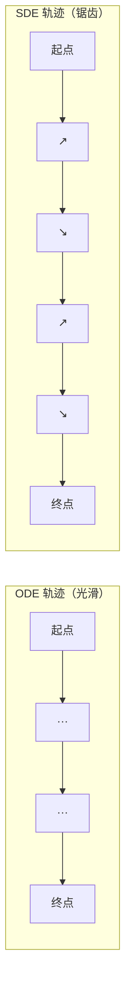
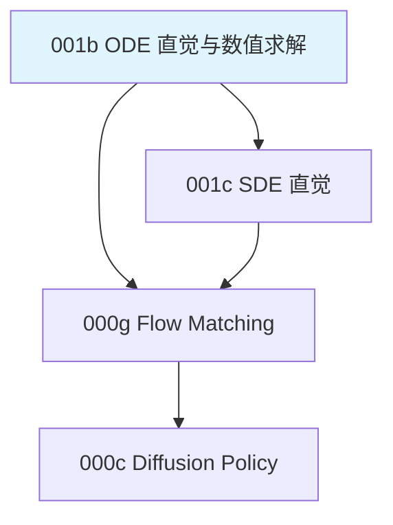

# 前置知识：常微分方程 ODE——直觉与数值求解

> **为什么要读这篇**：在 Flow Matching、连续归一化流（CNF）、Neural ODE 等现代生成模型中，"ODE"是核心数学语言。很多教程直接写出 $\frac{\mathrm{d}\mathbf{x}}{\mathrm{d}t} = v_\theta(\mathbf{x}, t)$ 就开始推导，默认读者知道 ODE 是什么、怎么数值求解。本文从零建立 ODE 的直觉，并讲清楚它在深度学习中为什么重要。
> **前置要求**：高中微积分（导数、积分的基本概念）

**标签**: `#前置知识` `#ODE` `#常微分方程` `#数值求解` `#Euler方法` `#Neural ODE`

**知识链接**：
- [随机微分方程 SDE](./001c_前置知识_随机微分方程SDE直觉与扩散模型的联系) — ODE 的"加了随机性"的兄弟
- [Flow Matching 与连续归一化流](./000g_前置知识_Flow_Matching与连续归一化流) — ODE 在生成模型中的核心应用
- [扩散模型 DDPM](./000b_前置知识_扩散模型DDPM) — 从 SDE 视角理解 DDPM，然后通过 Probability Flow ODE 桥接到 Flow Matching

---

## 一、ODE 是什么？一句话版本

> **ODE（Ordinary Differential Equation，常微分方程）**：一个描述"某个量的变化速度"的方程。

就这么简单。你告诉我"速度是多少"，我就能从起点一路跑到终点。

---

## 二、从生活例子建立直觉

### 2.1 最简单的例子：匀速行驶的车

一辆车以 60 km/h 的速度行驶。用数学写：

$$
\frac{\mathrm{d}x}{\mathrm{d}t} = 60
$$

**这个公式在做什么**：说"车的位置随时间的变化率恒为 60"，也就是"车以 60 km/h 匀速行驶"这句话的数学写法。

::: details 📐 公式详解（点击展开）

| 子表达式 | 它是谁 | 它在干嘛 |
|---------|--------|---------|
| $x$ | **车的位置** | 单位是 km，随时间变化的量 |
| $t$ | **时间** | 单位是小时，自变量 |
| $\frac{\mathrm{d}x}{\mathrm{d}t}$ | **位置的变化率** | 就是速度，位置对时间求导 |
| $60$ | **恒定速度** | 方程右边是常数，说明速度不随时间变化 |

**用人话读**："车的位置每小时增加 60 km，也就是以 60 km/h 匀速行驶。"

**为什么是这个形式**：这是 ODE 最简单的例子——右边是常数，意味着变化率不依赖当前状态或时间，是"给定变化速度、求轨迹"这类问题的起点。
:::

**拆解**：
- $x$：车的位置（km）
- $t$：时间（小时）
- $\frac{\mathrm{d}x}{\mathrm{d}t}$：位置对时间的变化率 = 速度
- 右边的 $60$：速度是常数 60 km/h

如果车在 $t=0$ 时位于 $x=0$（起点），那 $t$ 小时后车在哪？

$$
x(t) = 60t
$$

**这个公式在做什么**：给出上面那个 ODE 的解——任意时刻 $t$，车的位置具体是多少。

::: details 📐 公式详解（点击展开）

| 子表达式 | 它是谁 | 它在干嘛 |
|---------|--------|---------|
| $60t$ | **位置随时间线性增长** | 速度恒定时，位置就是速度乘以经过的时间 |
| $x(t)$ | **ODE 的解** | 满足前面那个微分方程、又满足初始条件 $x(0)=0$ 的函数 |

**用人话读**："知道车以恒定速度 60 km/h 出发，$t$ 小时后车走了 $60t$ 公里。"

**为什么是这个形式**：这是"给定初始条件和变化规则，算出任意时刻的状态"这件事最简单的例子——当变化率是常数时，直接积分（速度乘时间）就能得到解析解，不需要数值方法。
:::

这就是 ODE 的**解**：给定初始条件和变化规则，算出任意时刻的状态。

### 2.2 稍难一点：变速行驶

如果速度不是常数，而是和当前位置有关呢？比如"离终点越远，开得越快"：

$$
\frac{\mathrm{d}x}{\mathrm{d}t} = 100 - x
$$

**这个公式在做什么**：让速度不再是常数，而是随当前位置变化——离终点越远（$x$ 越小），跑得越快。

::: details 📐 公式详解（点击展开）

| 子表达式 | 它是谁 | 它在干嘛 |
|---------|--------|---------|
| $100$ | **终点位置** | 车要到达的目标位置 |
| $100-x$ | **剩余距离** | 终点减去当前位置，离终点越远这个值越大 |
| $\frac{\mathrm{d}x}{\mathrm{d}t}=100-x$ | **速度依赖状态** | 当前速度等于剩余距离，距离越远跑得越快 |

**用人话读**："车的速度等于离终点还有多远——越远跑得越快，越近跑得越慢。"

**为什么是这个形式**：这个例子展示了 ODE 右边可以依赖当前状态 $x$ 本身，形成"反馈"——当前位置影响未来速度，这正是 ODE 比"匀速运动"更一般、更贴近真实系统的地方。
:::

- 当 $x=0$（刚出发），速度 = 100，很快
- 当 $x=50$（走了一半），速度 = 50，慢了
- 当 $x=99$（快到了），速度 = 1，很慢

这个方程的解析解是 $x(t) = 100(1 - e^{-t})$，车永远接近但不会完全到达 $x=100$。

**关键观察**：ODE 的右边（速度/变化率）可以依赖当前状态 $x$ 本身，这让系统有了"反馈"——当前位置影响未来走向。

### 2.3 向量版本：多维空间中的运动

如果不是一维的位置，而是二维平面上的点 $\mathbf{x} = (x_1, x_2)$？

$$
\frac{\mathrm{d}\mathbf{x}}{\mathrm{d}t} = \mathbf{v}(\mathbf{x}, t)
$$

**这个公式在做什么**：把 ODE 从一维推广到多维——描述空间中每一点、每一时刻应该往哪个方向、多快移动。

::: details 📐 公式详解（点击展开）

| 子表达式 | 它是谁 | 它在干嘛 |
|---------|--------|---------|
| $\mathbf{x}=(x_1,x_2)$ | **多维状态** | 二维平面上的点，比一维位置多了一个维度 |
| $\mathbf{v}(\mathbf{x},t)$ | **向量场** | 在每个位置、每个时刻都给出一个"往哪走、走多快"的箭头 |
| $\frac{\mathrm{d}\mathbf{x}}{\mathrm{d}t}$ | **多维速度向量** | 位置向量对时间的导数，本身也是一个向量 |

**用人话读**："这个点在空间中的移动速度和方向，由它当前所在位置和时刻共同决定的一个箭头给出。"

**为什么是这个形式**：把标量情形（一维位置、一维速度）直接推广到向量情形，是描述"一群粒子在空间中流动"这类问题（如 Flow Matching）的标准写法——每个坐标分量都有自己的 ODE，但可以统一写成向量形式。
:::

这里 $\mathbf{v}(\mathbf{x}, t)$ 是一个**向量场**——在每个位置、每个时刻都给出一个"走哪个方向、走多快"的箭头。

想象你站在一条河流中：
- 河流的水流方向就是向量场
- 你的位置 $\mathbf{x}$ 随时间被水流带着走
- ODE 描述了"你在时刻 $t$、位置 $\mathbf{x}$ 处被带动的速度"

**这就是 Flow Matching 中"流"的含义**：一群粒子（噪声样本）在向量场中流动，最终到达数据分布。

---

## 三、ODE 的一般形式与术语

### 3.1 标准形式

$$
\frac{\mathrm{d}\mathbf{x}}{\mathrm{d}t} = f(\mathbf{x}, t), \quad \mathbf{x}(t_0) = \mathbf{x}_0
$$

**这个公式在做什么**：给出 ODE 的通用标准形式——一个变化规则加一个起点，这是本文后面所有 ODE 都遵循的统一写法。

::: details 📐 公式详解（点击展开）

| 子表达式 | 它是谁 | 它在干嘛 |
|---------|--------|---------|
| $f(\mathbf{x},t)$ | **一般化的向量场** | 任意一个描述"当前状态下变化速度"的函数，可以是神经网络 |
| $\mathbf{x}(t_0)=\mathbf{x}_0$ | **初始条件** | 规定了在起始时刻 $t_0$，状态从哪个具体值开始 |
| $\frac{\mathrm{d}\mathbf{x}}{\mathrm{d}t}=f(\mathbf{x},t)$ | **变化规则** | 描述状态在任意时刻的瞬时变化速度 |

**用人话读**："给定一个描述'当前速度'的函数和一个出发点，就确定了整条轨迹。"

**为什么是这个形式**：这是把前面几个具体例子（匀速、变速、多维流动）统一成一个抽象记号——不论 $f$ 具体长什么样，只要给定它和初始条件，理论上就唯一确定了一条轨迹 $\mathbf{x}(t)$，这是后面讨论"怎么求解"的统一起点。
:::

| 术语 | 含义 | 例子 |
|------|------|------|
| $\mathbf{x}(t)$ | 状态（随时间变化的量） | 粒子位置、图像像素、机器人动作 |
| $t$ | 时间（自变量） | 从 0 到 1 |
| $f(\mathbf{x}, t)$ | 向量场 / 速度场 / 漂移项 | 网络 $v_\theta(\mathbf{x}, t)$ 的输出 |
| $\mathbf{x}(t_0) = \mathbf{x}_0$ | 初始条件 | 从标准正态分布采样的噪声 |
| 解 $\mathbf{x}(t)$ | 满足方程的轨迹 | 从噪声到数据的一条路径 |

### 3.2 为什么叫"常"微分方程

"常"（Ordinary）是相对于"偏"（Partial）而言的：
- **ODE**：只有一个自变量（时间 $t$），导数是 $\frac{\mathrm{d}}{\mathrm{d}t}$
- **PDE**（偏微分方程）：有多个自变量（如时间+空间），导数是 $\frac{\partial}{\partial t}$、$\frac{\partial}{\partial x}$ 等

在深度学习的生成模型中，我们几乎只关心 ODE。

### 3.3 "解 ODE"意味着什么

给定：
- 初始状态 $\mathbf{x}_0$
- 变化规则 $f(\mathbf{x}, t)$

求：
- 从 $t=0$ 到 $t=1$ 的轨迹 $\mathbf{x}(t)$，特别是终点 $\mathbf{x}(1)$

如果 $f$ 形式简单（如常数或线性），可以手算解析解。但在深度学习中，$f$ 是一个神经网络——没有解析解，只能**数值求解**。

---

## 四、数值求解 ODE：从 Euler 到高阶方法

### 4.1 核心思想：小步推进

既然无法一步跳到答案，那就把时间切成很多小段，每一小段内假设速度不变，一步一步走过去。

### 4.2 Euler 方法（1 阶）

**想法**：在当前位置算出速度，假设这个速度在整个 $\Delta t$ 内不变，走一步。

$$
\mathbf{x}_{t+\Delta t} = \mathbf{x}_t + \Delta t \cdot f(\mathbf{x}_t, t)
$$

**这个公式在做什么**：用当前位置算出的速度，假设它在整个小时间段 $\Delta t$ 内不变，直接走一步——这是最简单的数值求解方法（Euler 方法）。

::: details 📐 公式详解（点击展开）

| 子表达式 | 它是谁 | 它在干嘛 |
|---------|--------|---------|
| $f(\mathbf{x}_t,t)$ | **当前速度** | 在当前位置 $\mathbf{x}_t$、当前时刻 $t$ 算出的瞬时变化率 |
| $\Delta t$ | **步长** | 假设速度不变的这一小段时间长度 |
| $\Delta t\cdot f(\mathbf{x}_t,t)$ | **这一步走的距离** | 速度乘时间，得到这一小段内的位移 |
| $\mathbf{x}_{t+\Delta t}$ | **走完这一步后的新位置** | 起点加上这一步的位移 |

**用人话读**："在当前位置算一次速度，假设这个速度在接下来一小段时间内不变，直接走过去。"

**为什么是这个形式**：这是把"瞬时变化率"当作"这一小段的平均变化率"的最直接近似——只用起点的速度信息，计算量最小（每步只需 1 次函数调用），但因为速度实际上在这段时间内会变化，所以存在误差，步长越小误差越小。
:::

**具体数值例子**：

假设 $f(x, t) = -x$（指数衰减），初始 $x_0 = 10$，求 $x(1)$。

精确解：$x(1) = 10 \cdot e^{-1} \approx 3.679$

用 Euler 方法，步长 $\Delta t = 0.5$（2 步）：

| 步骤 | $t$ | $x$ | $f(x,t) = -x$ | $x_{\text{new}} = x + 0.5 \cdot (-x)$ |
|------|-----|------|----------------|---------------------------------------|
| 0 | 0 | 10 | -10 | $10 + 0.5 \times (-10) = 5$ |
| 1 | 0.5 | 5 | -5 | $5 + 0.5 \times (-5) = 2.5$ |

结果：$x(1) = 2.5$，精确值 3.679，误差 32%。

步长 $\Delta t = 0.25$（4 步）：

| 步骤 | $t$ | $x$ | $x_{\text{new}} = x \times 0.75$ |
|------|-----|------|----------------------------------|
| 0 | 0 | 10 | 7.5 |
| 1 | 0.25 | 7.5 | 5.625 |
| 2 | 0.5 | 5.625 | 4.219 |
| 3 | 0.75 | 4.219 | 3.164 |

结果：$x(1) = 3.164$，误差 14%。步数翻倍，误差减半——这就是 1 阶精度的特征。

### 4.3 中点法（Midpoint，2 阶）

**为什么需要这个方法**：Euler 方法用起点的速度来代表整段的速度，如果速度在这一段内变化很大，误差就大。能不能先"探路"看看中间的速度是多少，再用更准的速度走整步？

$$
\begin{aligned}
\mathbf{k}_1 &= f(\mathbf{x}_t, t) \\
\mathbf{x}_{\text{mid}} &= \mathbf{x}_t + \frac{\Delta t}{2} \cdot \mathbf{k}_1 \\
\mathbf{k}_2 &= f(\mathbf{x}_{\text{mid}}, t + \frac{\Delta t}{2}) \\
\mathbf{x}_{t+\Delta t} &= \mathbf{x}_t + \Delta t \cdot \mathbf{k}_2
\end{aligned}
$$

**这个公式在做什么**：先用起点速度"侦察"半步，看看路中间的速度，再用这个更准的速度从起点走完整步——比只看起点速度的 Euler 方法更准。

::: details 📐 公式详解（点击展开）

| 子表达式 | 它是谁 | 它在干嘛 |
|---------|--------|---------|
| $\mathbf{k}_1=f(\mathbf{x}_t,t)$ | **起点速度** | 和 Euler 一样，在起点算一次速度 |
| $\mathbf{x}_{\text{mid}}=\mathbf{x}_t+\frac{\Delta t}{2}\mathbf{k}_1$ | **试探性半步** | 用起点速度先走到路中间的位置 |
| $\mathbf{k}_2=f(\mathbf{x}_{\text{mid}},t+\frac{\Delta t}{2})$ | **中间点速度** | 在半路重新算一次速度，比起点速度更准 |
| $\mathbf{x}_{t+\Delta t}=\mathbf{x}_t+\Delta t\cdot\mathbf{k}_2$ | **用中间速度走整步** | 从起点出发，但用中间点算出的速度走完整个 $\Delta t$ |

**用人话读**："先用起点速度走半步侦察一下中间的路况，再用中间的速度信息从起点直接走完整步。"

**为什么是这个形式**：Euler 方法只用起点速度代表整段速度，如果速度在这段时间内变化较大，误差就大；中点法先"探路"看中间速度再走整步，相当于用积分中点值近似整段积分，比左端点法精确得多。
:::

**具体数值例子**：$f(x, t) = -x$，$x_0 = 10$，$\Delta t = 0.5$

- $\mathbf{k}_1 = f(10, 0) = -10$（起点速度）
- $\mathbf{x}_{\text{mid}} = 10 + 0.25 \times (-10) = 7.5$（走到中间看看）
- $\mathbf{k}_2 = f(7.5, 0.25) = -7.5$（中间点的速度）
- $\mathbf{x}_{0.5} = 10 + 0.5 \times (-7.5) = 6.25$

精确解 $x(0.5) = 10 \cdot e^{-0.5} = 6.065$。Midpoint 结果 6.25，误差 3%；而 Euler 给出 5.0，误差 17.5%。精度提升 5 倍！

**代价**：每步要算 2 次 $f$（2 次网络前向传播），但精度提高一个数量级。

**为什么这个形式有效**：Euler 相当于用矩形面积近似曲线下面积（左端点），Midpoint 相当于用中点值近似——中点法在数值积分中本来就比左端点法精确得多。

### 4.4 RK4（Runge-Kutta 4 阶）

**为什么需要这个方法**：Midpoint 看了 2 个点（起点和中间），如果曲线更复杂呢？RK4 看 4 个点——起点、两个中间点、终点——然后加权平均，像是"综合了更多情报"后做决策。

$$
\begin{aligned}
\mathbf{k}_1 &= f(\mathbf{x}_t, t) \\
\mathbf{k}_2 &= f\!\left(\mathbf{x}_t + \frac{\Delta t}{2}\mathbf{k}_1,\; t + \frac{\Delta t}{2}\right) \\
\mathbf{k}_3 &= f\!\left(\mathbf{x}_t + \frac{\Delta t}{2}\mathbf{k}_2,\; t + \frac{\Delta t}{2}\right) \\
\mathbf{k}_4 &= f\!\left(\mathbf{x}_t + \Delta t \cdot \mathbf{k}_3,\; t + \Delta t\right) \\
\mathbf{x}_{t+\Delta t} &= \mathbf{x}_t + \frac{\Delta t}{6}\left(\mathbf{k}_1 + 2\mathbf{k}_2 + 2\mathbf{k}_3 + \mathbf{k}_4\right)
\end{aligned}
$$

**这个公式在做什么**：在起点、两个中间点、终点各算一次速度，按 1:2:2:1 加权平均后走一步——看得越多，走得越准。

::: details 📐 公式详解（点击展开）

| 子表达式 | 它是谁 | 它在干嘛 |
|---------|--------|---------|
| $\mathbf{k}_1=f(\mathbf{x}_t,t)$ | **起点速度** | 和 Euler 一样，站在起点看一次路况 |
| $\mathbf{k}_2$ | **第一次中间点速度** | 用 $\mathbf{k}_1$ 走到中间，重新算速度 |
| $\mathbf{k}_3$ | **第二次中间点速度** | 用更准的 $\mathbf{k}_2$ 再走到中间，再算一次速度 |
| $\mathbf{k}_4$ | **终点速度** | 用 $\mathbf{k}_3$ 走到终点，算终点处的速度 |
| $\frac{\Delta t}{6}(\mathbf{k}_1+2\mathbf{k}_2+2\mathbf{k}_3+\mathbf{k}_4)$ | **加权平均后的位移** | 四次速度按 1:2:2:1 加权平均，作为整段的代表速度 |

**用人话读**："在起点、两次中间、终点分别算一次速度，把这四次速度按 1:2:2:1 加权平均，用这个平均速度走完整步。"

**为什么权重是 1:2:2:1**：这来自 Simpson 积分法则——给中间点更高的权重，因为中间点的信息对整段积分贡献最大，$\frac{1+2+2+1}{6}=1$ 保证总权重为 1，这也是 RK4 比 Euler、Midpoint 精度更高（每步误差量级更小）的数学原因。
:::

**具体数值例子**：$f(x, t) = -x$，$x_0 = 10$，$\Delta t = 1.0$（一步跨完！）

- $\mathbf{k}_1 = -10$
- $\mathbf{k}_2 = f(10 + 0.5 \times (-10), 0.5) = f(5, 0.5) = -5$
- $\mathbf{k}_3 = f(10 + 0.5 \times (-5), 0.5) = f(7.5, 0.5) = -7.5$
- $\mathbf{k}_4 = f(10 + 1.0 \times (-7.5), 1.0) = f(2.5, 1.0) = -2.5$
- $x_1 = 10 + \frac{1}{6}[(-10) + 2(-5) + 2(-7.5) + (-2.5)] = 10 + \frac{1}{6}(-37.5) = 10 - 6.25 = 3.75$

精确解：$10 \cdot e^{-1} = 3.679$。只用 **1 步** RK4 就得到 3.75，误差仅 1.9%！而 1 步 Euler 给出 0（误差 100%）。

**代价**：每步 4 次网络前向传播。但精度极高，适合步数极少（2-3 步）的场景。

### 4.5 精度对比总结

| 方法 | 每步网络调用次数 | 局部截断误差 | 适用场景 |
|------|-----------------|-------------|---------|
| Euler（1 阶） | 1 | $O(\Delta t^2)$ | 步数充裕（5-10 步） |
| Midpoint（2 阶） | 2 | $O(\Delta t^3)$ | 中等步数（3-5 步） |
| RK4（4 阶） | 4 | $O(\Delta t^5)$ | 极少步数（2-3 步） |

**直觉**：误差 $\sim O(\Delta t^{k+1})$ 中，$k$ 是方法的阶数。阶数越高，步长 $\Delta t$ 越大时仍然准确。

**对 Flow Matching 的意义**：

$$
\text{总网络调用次数} = \text{步数} \times \text{每步调用次数}
$$

**这个公式在做什么**：把三种数值方法（Euler、Midpoint、RK4）的实际计算开销统一成一个可比较的量——总共要跑多少次网络前向传播。

::: details 📐 公式详解（点击展开）

| 子表达式 | 它是谁 | 它在干嘛 |
|---------|--------|---------|
| 步数 | **走了多少段** | 把整个时间区间切成的段数 |
| 每步调用次数 | **单步的代价** | Euler 是 1 次、Midpoint 是 2 次、RK4 是 4 次 |
| 总网络调用次数 | **实际计算成本** | 两者相乘，就是推理时真正要跑的网络前向次数 |

**用人话读**："总共要跑网络多少次，等于切成了多少段乘以每段要跑几次。"

**为什么是这个形式**：这解释了为什么不能只看"阶数越高越好"——高阶方法每步更贵，实际选择要在"步数"和"每步代价"之间权衡，这正是 Flow Matching 里选择合适数值方法和步数的依据。
:::

- Euler 5 步 = 5 次调用，精度 OK
- Midpoint 3 步 = 6 次调用，精度更好
- RK4 2 步 = 8 次调用，精度极好

实践中 Euler 5-10 步是最常用的选择（简单、快、够好）。

---

## 五、ODE 在深度学习中的角色

### 5.1 Neural ODE（Chen et al., 2018）

Neural ODE 的核心想法：**把神经网络看成连续深度的 ODE**。

传统的 ResNet 做了什么？

$$
\mathbf{h}_{l+1} = \mathbf{h}_l + f_\theta(\mathbf{h}_l, l)
$$

**这个公式在做什么**：写出 ResNet 残差连接的标准形式——下一层的输出等于当前层的输出加一个修正量。

::: details 📐 公式详解（点击展开）

| 子表达式 | 它是谁 | 它在干嘛 |
|---------|--------|---------|
| $\mathbf{h}_l$ | **第 $l$ 层的隐藏状态** | 当前层输出的特征向量 |
| $f_\theta(\mathbf{h}_l,l)$ | **残差块的输出** | 由参数 $\theta$ 决定的、这一层要加的修正量 |
| $\mathbf{h}_{l+1}$ | **下一层的输出** | 当前状态加上修正量得到的新状态 |

**用人话读**："下一层的输出等于当前层的输出加上这一层网络算出的修正量。"

**为什么是这个形式**：这正是残差连接的定义——不直接学习"下一层应该是什么"，而是学习"要在当前基础上加什么修正"，这种写法恰好和 Euler 步进公式（$\mathbf{x}_{t+\Delta t}=\mathbf{x}_t+\Delta t\cdot f(\mathbf{x}_t,t)$，取 $\Delta t=1$）在数学结构上完全一致。
:::

这不就是 Euler 步进吗！把层号 $l$ 当时间，步长 $\Delta t = 1$，$f_\theta$ 当向量场，ResNet 就是在用 Euler 方法"解 ODE"。

Neural ODE 把离散的层变成连续的时间：

$$
\frac{\mathrm{d}\mathbf{h}}{\mathrm{d}t} = f_\theta(\mathbf{h}(t), t), \quad \mathbf{h}(0) = \text{输入}, \quad \mathbf{h}(1) = \text{输出}
$$

**这个公式在做什么**：把 ResNet 的离散层堆叠，改写成一个连续时间的 ODE——网络不再是有限多层，而是一个连续变换场。

::: details 📐 公式详解（点击展开）

| 子表达式 | 它是谁 | 它在干嘛 |
|---------|--------|---------|
| $\mathbf{h}(0)=\text{输入}$ | **起点** | 数据从 $t=0$ 时刻的初始状态开始 |
| $f_\theta(\mathbf{h}(t),t)$ | **连续变换场** | 由参数 $\theta$ 定义的向量场，决定数据在每个时刻的变化速度，取代了"一层一层的残差块" |
| $\mathbf{h}(1)=\text{输出}$ | **终点** | 积分到 $t=1$ 时的状态就是网络的最终输出 |

**用人话读**："不再一层层堆叠网络，而是定义一个连续的变换场，数据从起点流动到终点，终点位置就是输出。"

**为什么是这个形式**：这是把 ResNet 的离散残差连接（$\mathbf{h}_{l+1}=\mathbf{h}_l+f_\theta(\mathbf{h}_l,l)$）在层数趋于无穷、每层修正量趋于无穷小的极限下，自然得到的连续版本——层号 $l$ 变成连续时间 $t$，"层" 的概念被"ODE 求解器的步数"取代。
:::

**和 ResNet 的精确对应**：ResNet 是 Neural ODE 的 Euler 离散化。层数 = ODE 步数。加更多层 ≈ 用更小步长解 ODE ≈ 更精确。

### 5.2 连续归一化流（CNF）

用 ODE 做生成模型：

$$
\frac{\mathrm{d}\mathbf{x}}{\mathrm{d}t} = v_\theta(\mathbf{x}, t)
$$

**这个公式在做什么**：用一个神经网络定义的向量场，描述"简单分布的样本"如何随时间连续变形成"数据分布的样本"——这是连续归一化流（CNF）做生成模型的核心方程。

::: details 📐 公式详解（点击展开）

| 子表达式 | 它是谁 | 它在干嘛 |
|---------|--------|---------|
| $v_\theta(\mathbf{x},t)$ | **可学习的向量场** | 神经网络，输入当前位置和时刻，输出移动方向和速度 |
| $t=0$ | **简单分布的起点** | 通常是标准正态分布采样的噪声 |
| $t=1$ | **数据分布的终点** | 积分到这个时刻得到的样本近似真实数据分布 |

**用人话读**："用一个神经网络定义的速度场，把简单分布的样本一步步'吹'成数据分布的样本。"

**为什么是这个形式**：这是把前面 Neural ODE 的一般框架应用到生成建模问题上——用 ODE 连接两个分布，而不是学习一个显式的概率密度变换公式，好处是网络只需要学"速度"，不需要保证输出严格是一个合法的概率密度。
:::

- $t=0$：从简单分布（如正态分布）采样
- $t=1$：积分到达数据分布

**关键性质**：ODE 是可逆的——从 $t=0$ 到 $t=1$ 生成数据，从 $t=1$ 到 $t=0$ 可以计算数据的概率密度。这利用了"变量替换公式"（instantaneous change of variables）：

$$
\log p_1(\mathbf{x}_1) = \log p_0(\mathbf{x}_0) - \int_0^1 \mathrm{div}\big(v_\theta(\mathbf{x}_t, t)\big)\,\mathrm{d}t
$$

**这个公式在做什么**：如果知道起点的概率密度（正态分布，好算），再沿路跟踪向量场"压缩或拉伸"空间的程度，就能算出终点的概率密度。

::: details 📐 公式详解（点击展开）

| 子表达式 | 它是谁 | 它在干嘛 |
|---------|--------|---------|
| $\log p_1(\mathbf{x}_1)$ | **想求的终点密度** | 生成出的数据点的对数概率密度，"这个样本有多可能" |
| $\log p_0(\mathbf{x}_0)$ | **已知的起点密度** | 标准正态分布，直接算：$-\frac{d}{2}\log(2\pi)-\frac{1}{2}\|\mathbf{x}_0\|^2$ |
| $\mathrm{div}(v_\theta)$ | **空间膨胀率** | 向量场的散度，正值表示空间在膨胀，负值表示在收缩 |
| $\int_0^1(\cdots)\,\mathrm{d}t$ | **沿路径累加** | 把整条路径上每个时刻的膨胀率累加起来 |

**用人话读**："知道出发点的概率密度，再算出沿路空间被挤压或拉伸了多少，两者相减就是终点的概率密度。"

**为什么是这个形式**：这是"变量替换公式"（instantaneous change of variables）——ODE 保持轨迹之间一一对应，散度描述了这个变换对局部体积的拉伸压缩程度，拉伸导致密度下降（减号），压缩导致密度上升，这正是 ODE"可逆"这一关键性质在数学上的体现。
:::

**数值例子**：假设 $d=2$，$\mathbf{x}_0 = [0.5, -0.3]$（噪声采样）

- $\log p_0(\mathbf{x}_0) = -\log(2\pi) - \frac{1}{2}(0.5^2 + 0.3^2) = -1.837 - 0.17 = -2.007$
- 假设沿路径积分得到 $\int_0^1 \mathrm{div}(v_\theta)\,\mathrm{d}t = 0.5$（空间轻微膨胀）
- 则 $\log p_1(\mathbf{x}_1) = -2.007 - 0.5 = -2.507$

**为什么是减号**：散度为正=空间膨胀=同样多的"概率质量"分散到更大体积=密度降低=log 概率减小。

### 5.3 Flow Matching 中的 ODE

Flow Matching 就是在训练一个向量场 $v_\theta$，让 ODE：

$$
\frac{\mathrm{d}\mathbf{x}}{\mathrm{d}t} = v_\theta(\mathbf{x}, t)
$$

**这个公式在做什么**：这就是 5.2 节的 CNF 方程在 Flow Matching 场景下的具体应用——训练一个网络 $v_\theta$，让它定义的向量场把噪声连续变形成数据。

::: details 📐 公式详解（点击展开）

| 子表达式 | 它是谁 | 它在干嘛 |
|---------|--------|---------|
| $v_\theta(\mathbf{x},t)$ | **训练目标本身** | Flow Matching 训练的就是这个网络，让它在每个位置、时刻都指对方向 |
| $\mathbf{x}_0\sim\mathcal N(\mathbf 0,\mathbf I)$ | **起点** | 标准正态噪声，采样容易 |
| $\mathbf{x}_1$ | **终点** | 积分到 $t=1$ 得到的、近似真实数据分布的样本 |

**用人话读**："训练一个速度场网络，让噪声沿着这个速度场流动到数据分布。"

**为什么是这个形式**：和 5.2 节 CNF 的方程完全一致，Flow Matching 只是给这个通用框架一个具体的训练目标（让 $v_\theta$ 拟合"噪声到数据"这条特定路径上的速度），推理时只需要数值求解这个 ODE，不需要像 CNF 训练那样计算散度。
:::

从噪声 $\mathbf{x}_0 \sim \mathcal{N}(\mathbf{0}, \mathbf{I})$ 流到数据 $\mathbf{x}_1$。

推理时就是**数值解这个 ODE**——用 Euler 方法走 5-10 步：

$$
\mathbf{x}_{t+\Delta t} = \mathbf{x}_t + \Delta t \cdot v_\theta(\mathbf{x}_t, t)
$$

**这个公式在做什么**：把 4.2 节的 Euler 步进公式直接套用在 Flow Matching 的向量场 $v_\theta$ 上，作为推理阶段实际执行的计算。

::: details 📐 公式详解（点击展开）

| 子表达式 | 它是谁 | 它在干嘛 |
|---------|--------|---------|
| $v_\theta(\mathbf{x}_t,t)$ | **一次网络前向** | 训练好的速度场网络，在当前位置和时刻给出移动方向 |
| $\Delta t\cdot v_\theta(\mathbf{x}_t,t)$ | **这一步的位移** | 速度乘以步长，得到这一小步该走多远 |
| $\mathbf{x}_{t+\Delta t}$ | **走完这一步的新位置** | 反复执行这个更新，从噪声一步步走到数据 |

**用人话读**："每一步都调用一次训练好的网络算出方向，沿这个方向走一小步，反复几步就从噪声走到了数据。"

**为什么是这个形式**：这是 Euler 方法在生成模型推理阶段的直接应用——每一步的 $v_\theta(\mathbf{x}_t,t)$ 对应一次网络前向传播，所以走 5 步就是 5 次网络推理，这正是 Flow Matching 推理速度快的原因（相比 DDPM 需要 20-100 步）。
:::

每一步的 $v_\theta(\mathbf{x}_t, t)$ 就是一次网络前向传播。所以 5 步 = 5 次前向传播 = 5 次网络推理。

### 5.4 Probability Flow ODE

DDPM 本质上是一个 SDE（有随机性），但 Song et al. (2021) 证明：每个 SDE 都有一个对应的 ODE，产生相同的概率分布演化。这个 ODE 被称为 **Probability Flow ODE**：

$$
\frac{\mathrm{d}\mathbf{x}}{\mathrm{d}t} = f(\mathbf{x},t) - \frac{1}{2}g(t)^2 \nabla_{\mathbf{x}} \log p_t(\mathbf{x})
$$

**这个公式在做什么**：给出一个和原始 SDE（有随机性）产生相同概率分布演化，但完全确定性（没有随机项）的 ODE，让 DDPM 的采样也能用 ODE 求解器完成。

::: details 📐 公式详解（点击展开）

| 子表达式 | 它是谁 | 它在干嘛 |
|---------|--------|---------|
| $f(\mathbf{x},t)$ | **原始漂移方向** | "惯性"部分——如果没有数据引导，粒子会怎么走 |
| $\frac{1}{2}g(t)^2$ | **引导力强度** | 扩散系数平方的一半，噪声越大引导力越强 |
| $\nabla_{\mathbf{x}}\log p_t(\mathbf{x})$ | **Score function** | 概率密度的梯度，指向"数据更多的方向" |
| 减号 | **反向引导** | 把粒子从噪声区域拉向数据密度高的区域 |

**用人话读**："粒子的速度等于原来的惯性方向，减去一个被数据密度梯度拉动的力，这个力会把粒子拉向数据更集中的地方。"

**为什么是 $\frac12g^2$ 而不是 $g^2$**：在逆向 SDE 中 score 的系数是 $g^2$，但那里还有随机噪声帮助"探索"；ODE 没有随机项了，所以只需要一半的 score 引导力就能达到相同的分布演化效果——SDE 的随机项贡献了另一半"扩散力"。
:::

**数值例子**：假设在某时刻 $t=0.5$，位置 $\mathbf{x} = [2, 3]$

- $f(\mathbf{x}, t) = -0.5 \times 0.5 \times [2, 3] = [-0.5, -0.75]$（VP-SDE 的漂移：往零拉）
- $g(t) = \sqrt{0.5} \approx 0.707$，$\frac{1}{2}g^2 = 0.25$
- 假设 score $\nabla \log p_t(\mathbf{x}) = [-1, -2]$（指向原点方向=数据密度更高的方向）
- 速度 = $[-0.5, -0.75] - 0.25 \times [-1, -2] = [-0.5, -0.75] + [0.25, 0.5] = [-0.25, -0.25]$

粒子以速度 $[-0.25, -0.25]$ 朝原点方向移动，逐步回到数据分布。

意义：可以用确定性的 ODE 求解器来做 DDPM 的采样，理论上比 SDE 更快。

> 更多关于 SDE 的内容，请阅读 [随机微分方程 SDE](./001c_前置知识_随机微分方程SDE直觉与扩散模型的联系)。

---

## 六、为什么 ODE 比 SDE 需要更少步数？

这是 Flow Matching 比 DDPM 更快的数学根源。详细对比：

| | ODE | SDE |
|---|---|---|
| 方程 | $\mathrm{d}\mathbf{x} = f(\mathbf{x},t)\,\mathrm{d}t$ | $\mathrm{d}\mathbf{x} = f(\mathbf{x},t)\,\mathrm{d}t + g(t)\,\mathrm{d}\mathbf{W}$ |
| 路径性质 | 确定性、光滑 | 随机、到处不可微 |
| 数值精度 | 高阶方法有效（RK4 精度 $O(\Delta t^5)$） | 高阶方法被随机噪声淹没 |
| 步数需求 | 4-10 步 | 20-100 步 |
| 同一初始点的结果 | 唯一确定 | 每次不同（随机） |

**直觉**：ODE 的轨迹是一条光滑曲线，沿着曲线走大步也不会偏太远；SDE 的轨迹是锯齿状的随机游走，你必须走小步才能跟上它的方向变化。


```mermaid
graph LR
    subgraph "ODE 轨迹（光滑）"
        A1["起点"] --> A2["···"] --> A3["···"] --> A4["终点"]
    end
    subgraph "SDE 轨迹（锯齿）"
        B1["起点"] --> B2["↗"] --> B3["↘"] --> B4["↗"] --> B5["↘"] --> B6["终点"]
    end
```

---

## 七、代码示例：用 Euler 方法解 ODE

```python
import numpy as np

def euler_solve(f, x0, t_start, t_end, num_steps):
    """
    用 Euler 方法解 ODE: dx/dt = f(x, t)
    
    参数:
        f: 向量场函数 f(x, t) -> dx/dt
        x0: 初始状态
        t_start: 起始时间
        t_end: 结束时间
        num_steps: 步数
    
    返回:
        x_final: 终点状态
    """
    dt = (t_end - t_start) / num_steps
    x = x0.copy()
    t = t_start
    
    for _ in range(num_steps):
        x = x + dt * f(x, t)  # 核心：一步 Euler
        t = t + dt
    
    return x


# 示例 1：简单指数衰减 dx/dt = -x
f_decay = lambda x, t: -x
x_result = euler_solve(f_decay, np.array([10.0]), 0, 1, 10)
print(f"Euler (10步): {x_result[0]:.4f}, 精确解: {10*np.exp(-1):.4f}")

# 示例 2：模拟 Flow Matching 推理
# 假设 v_theta 是一个训练好的网络（这里用线性近似代替）
def fake_v_theta(x, t):
    """假装这是训练好的网络，实际上是 target - x"""
    target = np.array([3.0, 5.0])  # 目标数据点
    return target - x  # 这就是条件向量场的简化版

x0 = np.random.randn(2)  # 采样噪声
x_generated = euler_solve(fake_v_theta, x0, 0, 1, 5)
print(f"5步生成结果: {x_generated}")  # 应该接近 [3, 5]
```

---

## 八、常见疑问

### Q1：ODE 和积分有什么关系？

$$
\frac{\mathrm{d}\mathbf{x}}{\mathrm{d}t} = f(\mathbf{x}, t) \quad \Longleftrightarrow \quad \mathbf{x}(T) = \mathbf{x}(0) + \int_0^T f(\mathbf{x}(t), t)\,\mathrm{d}t
$$

**这个公式在做什么**：说明"解 ODE"和"做积分"其实是同一件事的两种写法——微分方程的解，正好就是把变化率从头积到尾。

::: details 📐 公式详解（点击展开）

| 子表达式 | 它是谁 | 它在干嘛 |
|---------|--------|---------|
| $\frac{\mathrm{d}\mathbf{x}}{\mathrm{d}t}=f(\mathbf{x},t)$ | **微分形式** | 描述"瞬时变化率"的方程 |
| $\int_0^T f(\mathbf{x}(t),t)\,\mathrm{d}t$ | **积分形式** | 把从 0 到 $T$ 每个瞬间的变化率累加起来 |
| $\mathbf{x}(T)=\mathbf{x}(0)+(\cdots)$ | **等价关系** | 终点状态等于起点加上整段路径上变化率的累积 |

**用人话读**："知道每一刻的变化速度，把这些速度从头到尾加起来（积分），就能算出终点在哪。"

**为什么是这个形式**：这是微积分基本定理的直接体现——微分和积分是互逆运算，这也解释了为什么数值求解 ODE（Euler、Midpoint、RK4）本质上都是在做数值积分，只是用不同精度的方法近似这个积分。
:::

"解 ODE"就是"做积分"。数值解 ODE 就是数值积分。Euler 方法就是矩形法求积分。

### Q2：为什么不直接积分，要一步步走？

因为 $f(\mathbf{x}, t)$ 里面有 $\mathbf{x}$——被积函数依赖积分变量本身！这不是普通的 $\int g(t)\,\mathrm{d}t$（那种可以直接算），而是一个自我引用的系统。必须"走一步算一步"。

### Q3：Flow Matching 里的 ODE 时间方向是什么？

- $t=0$：纯噪声 $\mathbf{x}_0 \sim \mathcal{N}(\mathbf{0}, \mathbf{I})$
- $t=1$：干净数据 $\mathbf{x}_1$
- 从 $t=0$ **正向**积分到 $t=1$ = 生成数据

注意这和 DDPM 的惯例**相反**！DDPM 通常 $t=0$ 是数据，$t=T$ 是噪声。

### Q4：Neural ODE 和普通网络的区别是什么？

| | 普通 ResNet | Neural ODE |
|---|---|---|
| 深度 | 离散的 $L$ 层 | 连续的 $t \in [0,1]$ |
| 内存 | 存所有中间层（$O(L)$） | 伴随方法反向传播（$O(1)$） |
| 前向传播 | 逐层计算 | ODE 求解器 |
| 灵活性 | 固定层数 | 可自适应步数 |

---

## 九、总结

### 一句话

> ODE 就是"告诉你速度，从起点积分到终点"的方程。在 Flow Matching 中，神经网络充当速度场 $v_\theta$，用 Euler 方法走 5-10 步就能从噪声生成数据。

### 核心要点

1. ODE = 描述变化率的方程，$\frac{\mathrm{d}\mathbf{x}}{\mathrm{d}t} = f(\mathbf{x}, t)$
2. 数值求解 = 把时间切碎，每步用当前速度走一小段
3. Euler（1阶）最简单，每步 1 次网络调用；RK4（4阶）最精确，每步 4 次
4. ODE 路径光滑确定 → 可以用大步长 → Flow Matching 只需 5 步
5. SDE 有随机噪声 → 路径锯齿 → 必须小步走 → DDPM 需要 20-100 步

### 知识链


```mermaid
graph TD
    This["001b ODE 直觉与数值求解"] --> FM["000g Flow Matching"]
    SDE["001c SDE 直觉"] --> FM
    This --> SDE
    FM --> Policy["000c Diffusion Policy"]
    style This fill:#e1f5fe
```

---

## 延伸阅读

- Chen et al. (2018) "Neural Ordinary Differential Equations" ← Neural ODE 原始论文
- [随机微分方程 SDE](./001c_前置知识_随机微分方程SDE直觉与扩散模型的联系) ← ODE 的随机版本
- [Flow Matching 与连续归一化流](./000g_前置知识_Flow_Matching与连续归一化流) ← ODE 在生成模型中的应用
- 任何数值分析教材的"初值问题"章节
