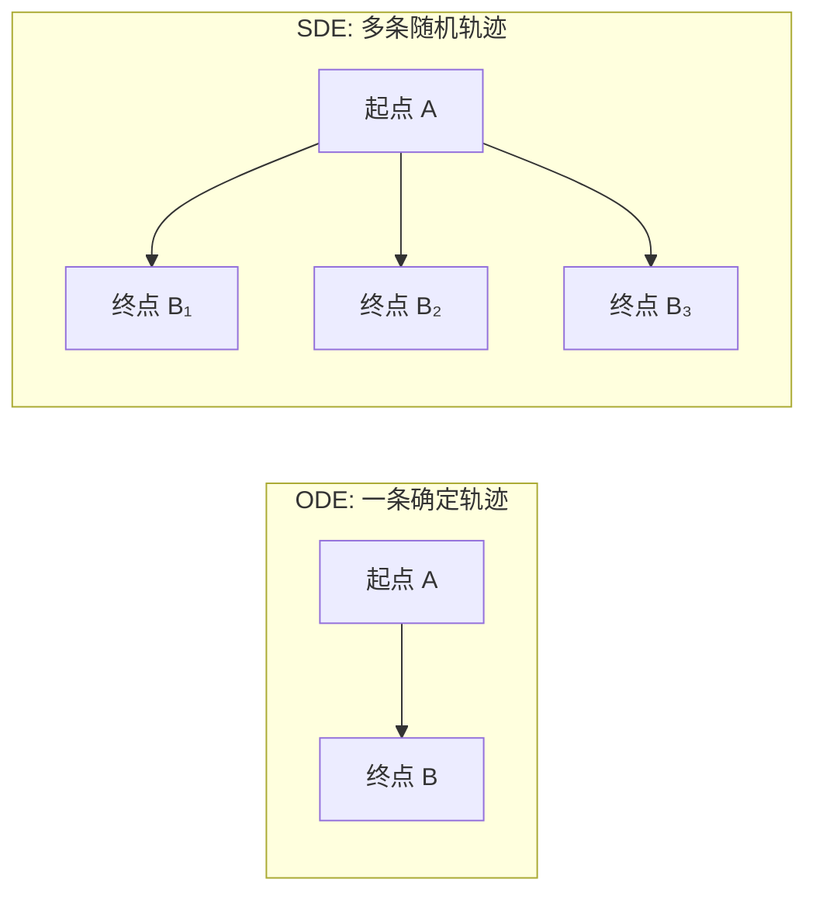
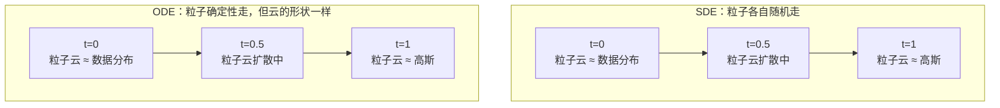
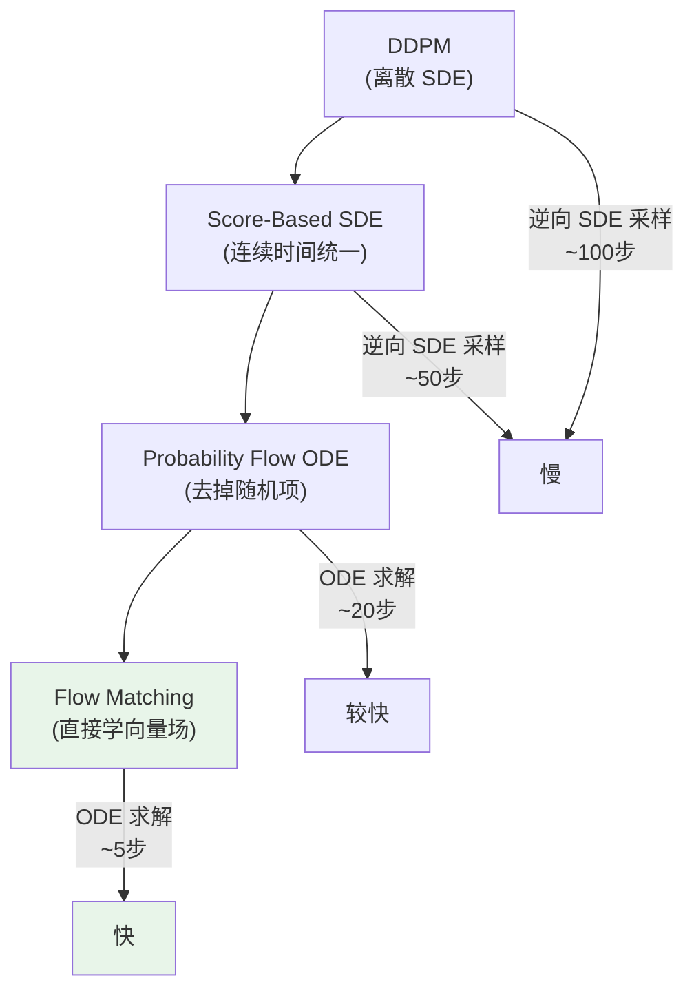
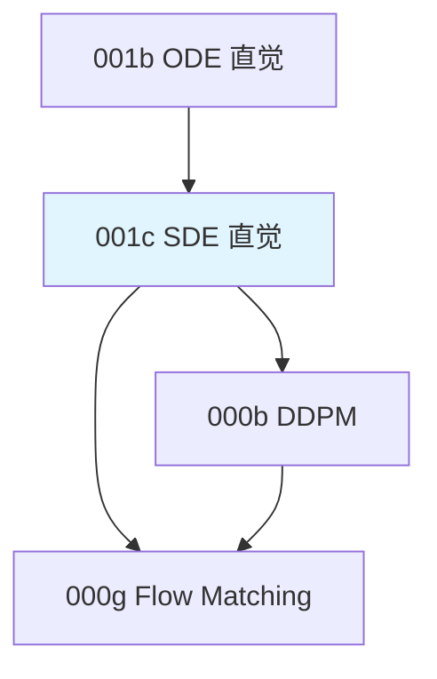

# 前置知识：随机微分方程 SDE——直觉与扩散模型的联系

> **为什么要读这篇**：扩散模型（DDPM）的连续时间理论建立在 SDE 之上。很多文章写到"前向过程是一个 SDE"就不再解释，甩出 $\mathrm{d}\mathbf{x} = f(\mathbf{x},t)\mathrm{d}t + g(t)\mathrm{d}\mathbf{W}$ 让读者自己理解。本文从零建立 SDE 的物理直觉，讲清楚每一项在说什么，以及为什么 DDPM 本质上是在解一个逆向 SDE。
> **前置要求**：读完 [ODE 直觉与数值求解](./001b_前置知识_常微分方程ODE直觉与数值求解)

**标签**: `#前置知识` `#SDE` `#随机微分方程` `#布朗运动` `#扩散模型` `#Probability Flow ODE`

**知识链接**：
- [常微分方程 ODE](./001b_前置知识_常微分方程ODE直觉与数值求解) — SDE 是 ODE 加上随机噪声
- [扩散模型 DDPM](./000b_前置知识_扩散模型DDPM) — DDPM 的离散版本，本文给出连续时间视角
- [Flow Matching](./000g_前置知识_Flow_Matching与连续归一化流) — 用 ODE 代替 SDE 的更快方案

---

## 一、SDE 是什么？一句话版本

> **SDE（Stochastic Differential Equation，随机微分方程）**：描述"确定性运动 + 随机扰动"的方程。

对比：
- **ODE**：告诉你速度 → 轨迹完全确定
- **SDE**：告诉你速度 + 每时每刻被随机推一把 → 轨迹是随机的

---

## 二、从生活例子建立直觉

### 2.1 醉汉走路（布朗运动）

想象一个喝醉的人在直线道路上走：
- 他**想**往家的方向走（确定性漂移）
- 但每一步都**随机**偏左或偏右（随机扰动）

如果用数学描述他在极短时间 $\mathrm{d}t$ 内的位移：

$$
\mathrm{d}x = \underbrace{v \cdot \mathrm{d}t}_{\text{想走的方向}} + \underbrace{\sigma \cdot \mathrm{d}W}_{\text{随机乱晃}}
$$

- $v$：平均速度（漂移），代表"大方向"
- $\sigma$：乱晃的幅度（扩散强度）
- $\mathrm{d}W$：一个随机增量，代表"这一瞬间被随机推了多少"

### 2.2 什么是布朗运动 $W(t)$？

$W(t)$ 是数学中最重要的随机过程，又叫**维纳过程（Wiener Process）**。它的性质：

1. $W(0) = 0$（从零开始）
2. 增量 $W(t+\Delta t) - W(t) \sim \mathcal{N}(0, \Delta t)$（每段时间的变化服从正态分布）
3. 不同时间段的增量**互相独立**
4. 路径**连续但处处不可微**（到处是锯齿）

**关键直觉**：$\mathrm{d}W$ 可以理解为一个"瞬时的随机推力"，大小约为 $\sqrt{\mathrm{d}t}$ 量级的正态随机变量。

**具体数值感受**：
- 如果 $\Delta t = 0.01$，则 $\Delta W \sim \mathcal{N}(0, 0.01)$，标准差 $\approx 0.1$
- 如果 $\Delta t = 0.001$，则 $\Delta W \sim \mathcal{N}(0, 0.001)$，标准差 $\approx 0.032$

### 2.3 把 ODE 和 SDE 放在一起对比

同一个"从 A 走到 B"的任务：

| | ODE（确定性） | SDE（随机） |
|---|---|---|
| 方程 | $\mathrm{d}x = v(x,t)\,\mathrm{d}t$ | $\mathrm{d}x = v(x,t)\,\mathrm{d}t + \sigma(t)\,\mathrm{d}W$ |
| 轨迹 | 一条光滑曲线 | 一条锯齿状随机路径 |
| 相同起点的结果 | 每次都一样 | 每次都不同 |
| 描述的是 | 一个点的确定运动 | 一群粒子的统计行为 |
| 生活类比 | 清醒的人走直线 | 醉汉走路 |



---

## 三、SDE 的一般形式与逐项拆解

### 3.1 标准 Itô SDE

$$
\mathrm{d}\mathbf{x} = f(\mathbf{x}, t)\,\mathrm{d}t + g(t)\,\mathrm{d}\mathbf{W}
$$

**逐项拆解**：

| 符号 | 名称 | 含义 | 生活类比 |
|------|------|------|---------|
| $\mathbf{x}$ | 状态 | 系统在时刻 $t$ 的状态（如图像、动作） | 醉汉的位置 |
| $f(\mathbf{x}, t)$ | **漂移系数** | 确定性的"想去哪"的速度 | 家的方向 |
| $g(t)$ | **扩散系数** | 随机扰动的强度 | 醉的程度 |
| $\mathrm{d}t$ | 时间微元 | 极小的时间间隔 | 一小步的时间 |
| $\mathrm{d}\mathbf{W}$ | **布朗运动增量** | 随机推力（$\sim \mathcal{N}(\mathbf{0}, \mathrm{d}t \cdot \mathbf{I})$） | 随机踉跄 |

### 3.2 离散化版本（Euler-Maruyama 方法）

**为什么需要离散化**：计算机不能处理"无穷小"的 $\mathrm{d}t$，必须把连续时间切成有限步。就像动画片用每秒 24 帧来模拟连续运动一样。

要在计算机上模拟 SDE，把连续时间切成离散步（步长 $\Delta t$）：

$$
\mathbf{x}_{t+\Delta t} = \mathbf{x}_t + f(\mathbf{x}_t, t) \cdot \Delta t + g(t) \cdot \sqrt{\Delta t} \cdot \boldsymbol{\epsilon}, \quad \boldsymbol{\epsilon} \sim \mathcal{N}(\mathbf{0}, \mathbf{I})
$$

> **一句话直觉**：新位置 = 旧位置 + 确定性走一步 + 随机晃一下。

**逐项拆解**：

| 项 | 对应连续版本 | 含义 | 大小量级 |
|---|---|---|---|
| $\mathbf{x}_t$ | — | 当前位置 | — |
| $f(\mathbf{x}_t, t) \cdot \Delta t$ | $f \cdot \mathrm{d}t$ | 确定性漂移：沿"大方向"走一步 | $\sim \Delta t$ |
| $g(t) \cdot \sqrt{\Delta t} \cdot \boldsymbol{\epsilon}$ | $g \cdot \mathrm{d}\mathbf{W}$ | 随机扰动：被随机推一把 | $\sim \sqrt{\Delta t}$ |
| $\boldsymbol{\epsilon} \sim \mathcal{N}(\mathbf{0}, \mathbf{I})$ | — | 标准正态随机向量（每步重新采样） | $\sim 1$ |

**为什么是 $\sqrt{\Delta t}$ 不是 $\Delta t$**？

因为 $\mathrm{d}W \sim \mathcal{N}(0, \mathrm{d}t)$，标准差 = $\sqrt{\mathrm{d}t}$。离散化时 $\Delta W \sim \mathcal{N}(0, \Delta t)$，即 $\Delta W = \sqrt{\Delta t} \cdot \boldsymbol{\epsilon}$。

这是一个非常反直觉但极其重要的性质：随机项按 $\sqrt{\Delta t}$ 缩放，而确定性项按 $\Delta t$ 缩放。

**数值例子**：$\Delta t = 0.01$，$f = 2.0$，$g = 1.0$，$\epsilon = 0.8$（本次采样到的随机数）

- 漂移项贡献：$f \cdot \Delta t = 2.0 \times 0.01 = 0.02$
- 随机项贡献：$g \cdot \sqrt{\Delta t} \cdot \epsilon = 1.0 \times 0.1 \times 0.8 = 0.08$

随机项（0.08）是漂移项（0.02）的 4 倍！这就是为什么 SDE 的路径看起来是锯齿状的——短时间内随机项完全主导了运动方向。只有在很长时间后，漂移的累积效应才能体现出来。

### 3.3 为什么 SDE 需要更多步数

对比离散化误差：

| | ODE Euler | SDE Euler-Maruyama |
|---|---|---|
| 确定性误差 | $O(\Delta t^2)$（每步） | $O(\Delta t^2)$ |
| 随机误差 | 无 | $O(\sqrt{\Delta t})$（每步） |
| 总误差 (N步) | $O(\Delta t) = O(1/N)$ | $O(\sqrt{\Delta t}) = O(1/\sqrt{N})$ |
| 精度翻倍需步数 | 2× | 4× |

**直觉**：随机噪声的"锯齿"让你必须用很小的步长才能准确跟踪概率分布的演化。这就是 DDPM 需要 20-100 步的数学原因。

---

## 四、DDPM 的 SDE 视角

### 4.1 前向过程：给数据加噪声

DDPM 的前向过程（从数据到噪声）可以写成 SDE：

$$
\mathrm{d}\mathbf{x} = -\frac{1}{2}\beta(t)\,\mathbf{x}\,\mathrm{d}t + \sqrt{\beta(t)}\,\mathrm{d}\mathbf{W}
$$

**逐项拆解**：

| 项 | 是什么 | 做了什么 |
|---|---|---|
| $-\frac{1}{2}\beta(t)\,\mathbf{x}\,\mathrm{d}t$ | 漂移项 | 把 $\mathbf{x}$ 往零拉（缩小信号） |
| $\sqrt{\beta(t)}\,\mathrm{d}\mathbf{W}$ | 扩散项 | 注入随机噪声 |
| $\beta(t)$ | 噪声调度 | 控制加噪速度（通常随 $t$ 递增） |

**物理直觉**：想象一滴墨水滴入水中。墨水（数据结构）逐渐扩散、变淡（信号衰减），最终均匀分布在整杯水中（纯噪声 $\mathcal{N}(\mathbf{0}, \mathbf{I})$）。

**数值例子**：假设 $\beta(t) = 0.1$，当前 $\mathbf{x} = [3, 5]$，$\Delta t = 0.01$：

$$
\mathbf{x}_{\text{new}} = [3, 5] + (-\frac{1}{2} \times 0.1) \times [3, 5] \times 0.01 + \sqrt{0.1} \times \sqrt{0.01} \times \boldsymbol{\epsilon}
$$
$$
= [3, 5] - [0.0015, 0.0025] + 0.0316 \times \boldsymbol{\epsilon}
$$

信号每步衰减极少（-0.0015），但噪声注入相对大得多（0.0316 × 随机），这就是为什么经过很多步后，信号会被噪声淹没。

### 4.2 逆向过程：从噪声还原数据

**为什么需要逆向 SDE**：前向 SDE 把数据变成噪声。如果我们能"倒放"这个过程——从噪声走回数据——就完成了生成！Anderson (1982) 证明了一个惊人的结果：**任何前向 SDE 都有一个逆向 SDE**，可以从终态回到初态。

$$
\mathrm{d}\mathbf{x} = \left[f(\mathbf{x},t) - g(t)^2\,\nabla_{\mathbf{x}} \log p_t(\mathbf{x})\right]\mathrm{d}t + g(t)\,\mathrm{d}\bar{\mathbf{W}}
$$

> **一句话直觉**：粒子的运动 = 原来的漂移 + 一个"被数据吸引的力"（score function）+ 继续随机晃。Score function 像是一个"数据指南针"，告诉粒子往哪个方向走能到达数据密度高的地方。

**逐项拆解**：

| 项 | 数学含义 | 物理直觉 |
|---|---|---|
| $f(\mathbf{x},t)\,\mathrm{d}t$ | 和前向一样的漂移 | "惯性"——如果没有任何引导，粒子会怎么动 |
| $-g(t)^2\,\nabla_{\mathbf{x}} \log p_t(\mathbf{x})\,\mathrm{d}t$ | Score function 引导项 | **核心**：一个"力"，把粒子从低密度区域推向高密度区域 |
| $g(t)\,\mathrm{d}\bar{\mathbf{W}}$ | 逆向布朗运动的随机项 | 继续随机晃动（保持随机性/多样性） |
| $\nabla_{\mathbf{x}} \log p_t(\mathbf{x})$ | 对数概率密度对 $\mathbf{x}$ 的梯度 | "哪个方向数据更多"——梯度指向密度升高最快的方向 |
| $g(t)^2$ 系数 | 扩散系数的平方 | 噪声越大的区域（$g$ 越大），score 引导力越强——因为越嘈杂越需要更强的引导 |

**为什么有 $g(t)^2$**：直觉上，噪声越大的地方，数据信号越弱，你需要更强的"引力"才能把粒子拉回正轨。$g(t)^2$ 恰好提供了这种自适应的引导强度。

**数值例子**：假设 $d=2$，$t=0.7$（接近纯噪声），$\mathbf{x} = [1.5, -0.8]$

- $f(\mathbf{x}, t) = -\frac{1}{2} \times 0.7 \times [1.5, -0.8] = [-0.525, 0.28]$（VP-SDE 漂移：往零拉）
- $g(t) = \sqrt{0.7} \approx 0.837$，$g^2 = 0.7$
- Score $\nabla \log p_t(\mathbf{x}) = [-0.5, 1.2]$（假设数据中心偏左上方）
- Score 引导力：$-0.7 \times [-0.5, 1.2] = [0.35, -0.84]$（把粒子往数据中心拉）
- 确定性部分：$[-0.525 + 0.35, 0.28 - 0.84] \times \mathrm{d}t = [-0.175, -0.56] \times \mathrm{d}t$
- 再加上随机项 $0.837 \times \mathrm{d}\bar{W}$

可以看到 score 引导（[0.35, -0.84]）实质性地改变了粒子运动方向，把它拉向数据分布。

**DDPM 在做什么**：训练一个网络 $\boldsymbol{\epsilon}_\theta(\mathbf{x}, t)$ 来估计 score function（通过预测噪声），然后用它来模拟逆向 SDE。

### 4.3 离散化 = DDPM 的采样步

**为什么要看这个公式**：这就是 DDPM 代码里那个去噪循环的核心——每一步到底在算什么。理解了它，你就理解了整个 DDPM 采样过程。

DDPM 的逆向采样公式：

$$
\mathbf{x}_{t-1} = \frac{1}{\sqrt{\alpha_t}}\left(\mathbf{x}_t - \frac{\beta_t}{\sqrt{1-\bar{\alpha}_t}}\,\boldsymbol{\epsilon}_\theta(\mathbf{x}_t, t)\right) + \sigma_t\,\mathbf{z}
$$

> **一句话直觉**：新的（更干净的）图像 = 把当前图像缩放一下 - 减掉网络预测的噪声成分 + 加一点新鲜随机噪声保持多样性。

**逐项拆解**：

| 符号 | 含义 | 直觉 |
|------|------|------|
| $\mathbf{x}_t$ | 当前（含噪声的）状态 | 当前这张"模糊"的图 |
| $\mathbf{x}_{t-1}$ | 去噪一步后的状态 | 稍微"清晰"一点的图 |
| $\frac{1}{\sqrt{\alpha_t}}$ | 缩放因子（$\alpha_t = 1 - \beta_t$，接近 1） | 补偿前向过程中信号被缩小的量 |
| $\frac{\beta_t}{\sqrt{1-\bar{\alpha}_t}}$ | 噪声预测的缩放权重 | 把网络输出的"标准化噪声"转换为当前步需要减去的实际噪声量 |
| $\boldsymbol{\epsilon}_\theta(\mathbf{x}_t, t)$ | 网络预测的噪声 | "我觉得你身上有这么多噪声，让我帮你擦掉" |
| $\sigma_t\,\mathbf{z}$ | 新注入的小噪声（$\mathbf{z} \sim \mathcal{N}(\mathbf{0}, \mathbf{I})$） | 保持随机性/多样性（SDE 的随机项） |
| $\bar{\alpha}_t = \prod_{i=1}^t \alpha_i$ | 累积缩放因子 | 到时间步 $t$ 为止信号被缩小了多少 |

**为什么要加新噪声 $\sigma_t \mathbf{z}$**：这对应逆向 SDE 中的随机项 $g(t)\mathrm{d}\bar{\mathbf{W}}$。如果去掉它（设 $\sigma_t = 0$），就变成了 DDIM——确定性采样——本质上就是 Probability Flow ODE。

**数值例子**：假设 $t=5$（早期去噪步），$\alpha_t = 0.99$，$\beta_t = 0.01$，$\bar{\alpha}_t = 0.95$，$\sigma_t = 0.01$

当前状态 $\mathbf{x}_t = [0.8, -0.3]$，网络预测噪声 $\boldsymbol{\epsilon}_\theta = [0.5, -0.1]$，随机采样 $\mathbf{z} = [0.2, 0.7]$：

$$
\mathbf{x}_{t-1} = \frac{1}{\sqrt{0.99}}\left([0.8, -0.3] - \frac{0.01}{\sqrt{1-0.95}} \times [0.5, -0.1]\right) + 0.01 \times [0.2, 0.7]
$$
$$
= \frac{1}{0.995}\left([0.8, -0.3] - \frac{0.01}{0.224} \times [0.5, -0.1]\right) + [0.002, 0.007]
$$
$$
= 1.005 \times ([0.8, -0.3] - [0.0223, -0.00446]) + [0.002, 0.007]
$$
$$
= 1.005 \times [0.7777, -0.2955] + [0.002, 0.007] = [0.783, -0.290]
$$

可以看到：减去噪声后图像值略有变化（从 0.8 变为 0.783），新噪声贡献很小（0.002），整个过程是渐进式的——需要很多步才能完全去噪。

这个公式本质上就是逆向 SDE 的 Euler-Maruyama 离散化：
- $\frac{1}{\sqrt{\alpha_t}}(\cdots)$：确定性漂移部分（score 引导）
- $\sigma_t \mathbf{z}$：随机项（$\mathbf{z} \sim \mathcal{N}(\mathbf{0}, \mathbf{I})$）

每一步去噪 = 逆向 SDE 走一步 = 一次网络前向传播 + 加一次噪声。

---

## 五、从 SDE 到 ODE：Probability Flow ODE

### 5.1 关键定理

**为什么需要这个定理**：逆向 SDE 有随机项 → 路径锯齿 → 必须小步走 → 慢。如果能去掉随机项变成确定性 ODE，就能用大步长+高阶求解器 → 快。但去掉随机项后分布还一样吗？这个定理说：**一样！**

Song et al. (2021) 证明了一个核心结果：

> 对于任意前向 SDE $\mathrm{d}\mathbf{x} = f(\mathbf{x},t)\mathrm{d}t + g(t)\mathrm{d}\mathbf{W}$，存在一个**确定性 ODE**，使得在每个时刻 $t$，ODE 解的**概率分布**和 SDE 解的概率分布**完全相同**。

这个 ODE 是：

$$
\frac{\mathrm{d}\mathbf{x}}{\mathrm{d}t} = f(\mathbf{x},t) - \frac{1}{2}\,g(t)^2\,\nabla_{\mathbf{x}} \log p_t(\mathbf{x})
$$

> **一句话直觉**：把随机晃动去掉，但把 score 引导力从"全力"减到"半力"来补偿——粒子群的整体分布不变，只是每个粒子各自走确定路径了。

**逐项拆解**：

| 符号 | 含义 | 和逆向 SDE 的对比 |
|------|------|------------------|
| $f(\mathbf{x},t)$ | 漂移项（和 SDE 一样） | 完全相同 |
| $\frac{1}{2}g(t)^2$ | score 引导的强度 | SDE 中是 $g^2$（全力），这里减半 |
| $\nabla_{\mathbf{x}} \log p_t(\mathbf{x})$ | score function（密度梯度方向） | 完全相同 |
| 无随机项 | 没有 $\mathrm{d}\bar{\mathbf{W}}$ | SDE 中有 $g\,\mathrm{d}\bar{\mathbf{W}}$ |

**为什么系数从 $g^2$ 变成 $\frac{1}{2}g^2$**：SDE 中 score 引导用了 $g^2$ 的力度，但同时随机项 $g\mathrm{d}\bar{\mathbf{W}}$ 也在贡献"扩散效果"。去掉随机项后，如果 score 力度不变（仍用 $g^2$），粒子会"过度集中"——分布会比 SDE 版本更窄。减半为 $\frac{1}{2}g^2$ 恰好补偿了缺失的随机扩散，让分布保持一致。

**数值例子**：$d=2$，$t=0.5$，$\mathbf{x} = [1.0, 2.0]$

- 漂移 $f = -0.5 \times 0.5 \times [1.0, 2.0] = [-0.25, -0.5]$
- $g = \sqrt{0.5} = 0.707$，$\frac{1}{2}g^2 = 0.25$
- Score $\nabla \log p_t = [-0.8, -1.5]$（指向数据密度高的方向）
- ODE 速度 = $[-0.25, -0.5] - 0.25 \times [-0.8, -1.5] = [-0.25 + 0.2, -0.5 + 0.375] = [-0.05, -0.125]$

对比逆向 SDE（确定性部分）：
- SDE 确定性部分 = $[-0.25, -0.5] - 0.5 \times [-0.8, -1.5] = [-0.25 + 0.4, -0.5 + 0.75] = [0.15, 0.25]$

SDE 确定性部分更"激进"（score 引导更强），但它还有随机项在"稀释"这个集中效应。ODE 引导力更温和，但没有随机稀释——最终效果等价。

**和逆向 SDE 对比**：

$$
\begin{aligned}
\text{逆向 SDE:}\quad &\mathrm{d}\mathbf{x} = \left[f - g^2\,\nabla \log p_t\right]\mathrm{d}t + g\,\mathrm{d}\bar{\mathbf{W}} \\
\text{Probability Flow ODE:}\quad &\mathrm{d}\mathbf{x} = \left[f - \tfrac{1}{2}g^2\,\nabla \log p_t\right]\mathrm{d}t
\end{aligned}
$$

**区别**：
1. ODE 没有随机项 $g\,\mathrm{d}\bar{\mathbf{W}}$
2. score 项的系数不同（$g^2$ vs $\frac{1}{2}g^2$）——减半恰好补偿了缺失的随机扩散

### 5.2 直觉理解：为什么去掉随机项还能得到相同分布？

想象一群粒子（而不是一个粒子）：

**SDE 视角**：每个粒子各自走随机路径（布朗运动），但总体上形成的"粒子云"在确定性地演化。

**ODE 视角**：每个粒子走确定性路径，但这些路径被精心设计（通过 score function），使得粒子云的形状在每个时刻都和 SDE 版本一样。



单个粒子的路径完全不同，但统计性质（分布）完全相同。

### 5.3 为什么 Probability Flow ODE 比逆向 SDE 更快

| 特性 | 逆向 SDE | Probability Flow ODE |
|------|---------|---------------------|
| 有随机项？ | ✅ 有 $g(t)\mathrm{d}\bar{\mathbf{W}}$ | ❌ 纯确定性 |
| 路径性质 | 锯齿状、不可微 | 光滑曲线 |
| 可用高阶求解器？ | ❌ 随机噪声淹没高阶精度 | ✅ RK4 等方法有效 |
| 典型步数 | 20-100 | 10-20 |
| 每次采样结果 | 不同（随机） | 相同（确定） |

### 5.4 Probability Flow ODE 的局限

虽然步数少了，但仍然需要 score function $\nabla_{\mathbf{x}} \log p_t(\mathbf{x})$。这个 score 是通过训练 DDPM 的噪声预测网络间接得到的：

$$
\nabla_{\mathbf{x}} \log p_t(\mathbf{x}) \approx -\frac{\boldsymbol{\epsilon}_\theta(\mathbf{x}, t)}{\sqrt{1 - \bar{\alpha}_t}}
$$

> **一句话直觉**：网络预测的"噪声方向"，归一化后取反，就是"走向数据的方向"（score）。

**逐项拆解**：

| 符号 | 含义 |
|------|------|
| $\boldsymbol{\epsilon}_\theta(\mathbf{x}, t)$ | DDPM 网络预测的噪声（"你身上有多少噪声、什么方向的"） |
| $\sqrt{1 - \bar{\alpha}_t}$ | 归一化系数——当前时刻总噪声的标准差 |
| 负号 | 噪声方向的反方向 = 数据方向 |

**为什么取反就是 score**：score 指向数据密度高的方向 = "去噪方向"。噪声预测告诉你"噪声从哪来"，取反就是"数据在哪"。

**数值例子**：$t$ 较大时（噪声多），$\bar{\alpha}_t = 0.1$

- $\sqrt{1-0.1} = \sqrt{0.9} \approx 0.949$
- 如果网络预测 $\boldsymbol{\epsilon}_\theta = [0.8, -0.5]$
- Score $\approx -[0.8, -0.5] / 0.949 = [-0.843, 0.527]$
- 含义：数据在当前位置的左上方（x 方向减小，y 方向增大）

Score 估计的误差会在 ODE 积分中累积。这就是为什么 **Flow Matching 更进一步**——它直接学向量场，不经过 score function 这个中间环节。

---

## 六、SDE 家族谱：DDPM、SMLD、和 VP/VE

Song et al. (2021) 统一了不同的扩散模型为不同的 SDE：

### 6.1 VP-SDE（Variance Preserving，对应 DDPM）

$$
\mathrm{d}\mathbf{x} = -\frac{1}{2}\beta(t)\,\mathbf{x}\,\mathrm{d}t + \sqrt{\beta(t)}\,\mathrm{d}\mathbf{W}
$$

> **一句话直觉**：同时做两件事——缩小信号（$-\frac{1}{2}\beta \mathbf{x}$）和加噪声（$\sqrt{\beta}\mathrm{d}W$）。两者的力度精心配合，使得过程中 $\mathbf{x}$ 的总方差大致保持为 1（所以叫 Variance Preserving）。

**为什么漂移项是 $-\frac{1}{2}\beta(t)\mathbf{x}$**：负号表示往零拉，$\mathbf{x}$ 表示离零越远拉力越大（像弹簧），$\frac{1}{2}\beta$ 是拉力强度。如果只有漂移没有噪声，$\mathbf{x}$ 会指数衰减到零。配上 $\sqrt{\beta}$ 的噪声，最终稳态是标准正态 $\mathcal{N}(\mathbf{0}, \mathbf{I})$。

特点：过程中方差大致保持不变（先缩小信号再加噪声）。

### 6.2 VE-SDE（Variance Exploding，对应 SMLD/NCSN）

$$
\mathrm{d}\mathbf{x} = \sqrt{\frac{\mathrm{d}\sigma^2(t)}{\mathrm{d}t}}\,\mathrm{d}\mathbf{W}
$$

> **一句话直觉**：不缩小信号（没有漂移项！），只是不断地叠加越来越多的噪声。方差从小到大"爆炸式"增长（所以叫 Variance Exploding）。

**逐项拆解**：
- 漂移 = 0：数据本身不动
- $\sqrt{\frac{\mathrm{d}\sigma^2(t)}{\mathrm{d}t}}$：噪声强度随时间增大。$\sigma(t)$ 是噪声调度函数（如从 0.01 增到 100），它的导数控制了每个时刻噪声注入的速率

**和 VP-SDE 的关键区别**：VP 是"同时缩小信号+加噪声"来保持方差稳定；VE 是"不管信号，只管加噪声"，方差一路暴涨。

特点：只有扩散项没有漂移项，方差不断增大。

### 6.3 对比表

| | VP-SDE (DDPM) | VE-SDE (SMLD) |
|---|---|---|
| 漂移 $f$ | $-\frac{1}{2}\beta(t)\mathbf{x}$ | $\mathbf{0}$ |
| 扩散 $g$ | $\sqrt{\beta(t)}$ | $\sqrt{\frac{\mathrm{d}\sigma^2}{\mathrm{d}t}}$ |
| 终态分布 | $\mathcal{N}(\mathbf{0}, \mathbf{I})$ | $\mathcal{N}(\mathbf{0}, \sigma_{\max}^2 \mathbf{I})$ |
| 方差行为 | 大致不变 | 单调增大 |

**共同点**：都可以通过各自的 Probability Flow ODE 转化为确定性采样。

---

## 七、完整图景：从 SDE 到 Flow Matching 的进化



**进化逻辑**：

1. **DDPM**：离散步加噪/去噪 → 需要很多步
2. **Score-Based SDE**：把 DDPM 推广到连续时间 → 理论更统一，但采样仍慢
3. **Probability Flow ODE**：发现可以用确定性 ODE 得到相同分布 → 可用高阶求解器，步数减半
4. **Flow Matching**：不再通过 score 间接定义 ODE，而是直接学习最优向量场 → 路径更直，5 步搞定

---

## 八、代码示例：模拟前向 SDE

```python
import numpy as np

def simulate_forward_sde(x0, beta_func, num_steps=100, dt=0.01):
    """
    模拟 VP-SDE 前向过程（DDPM 的连续版本）
    dx = -0.5 * beta(t) * x * dt + sqrt(beta(t)) * dW
    
    参数:
        x0: 初始数据点（干净数据）
        beta_func: 噪声调度函数 beta(t)
        num_steps: 离散步数
        dt: 时间步长
    """
    x = x0.copy()
    trajectory = [x.copy()]
    
    for i in range(num_steps):
        t = i * dt
        beta_t = beta_func(t)
        
        # 漂移项：把 x 往 0 拉
        drift = -0.5 * beta_t * x * dt
        
        # 扩散项：注入随机噪声
        noise = np.sqrt(beta_t) * np.sqrt(dt) * np.random.randn(*x.shape)
        
        # SDE 一步
        x = x + drift + noise
        trajectory.append(x.copy())
    
    return np.array(trajectory)


# 线性噪声调度
beta = lambda t: 0.1 + 10 * t  # 从 0.1 线性增到 10.1

# 从一个 2D 数据点出发
x0 = np.array([3.0, 5.0])
traj = simulate_forward_sde(x0, beta, num_steps=100, dt=0.01)

print(f"起点 (数据): {traj[0]}")
print(f"终点 (噪声): {traj[-1]}")  # 应该接近 N(0, I)
print(f"终点均值应接近 0: {np.mean(traj[-1]):.3f}")
```

---

## 九、SDE vs ODE：何时用哪个？

| 选 SDE（逆向 SDE 采样） | 选 ODE（Probability Flow / Flow Matching） |
|---|---|
| 需要采样多样性（SDE 天然有随机性） | 需要快速推理（少步数） |
| 对质量要求高于速度 | 需要确定性结果（可复现） |
| 步数预算充裕 | 计算预算有限 |
| 想要 DDPM 类方法的成熟生态 | 想用 BPTT 做 RL 微调 |

实践中的折中方案：**在 ODE 的基础上注入少量噪声**（如 Flow Matching 推理时在初始或中间步加小扰动），既保持速度又获得一定探索性。

---

## 十、常见疑问

### Q1："$\mathrm{d}\mathbf{W}$" 到底是什么？能给个具体的数吗？

$\mathrm{d}\mathbf{W}$ 是一个无穷小的随机增量。在离散化时，它变成：

$$
\Delta \mathbf{W} = \sqrt{\Delta t} \cdot \boldsymbol{\epsilon}, \quad \boldsymbol{\epsilon} \sim \mathcal{N}(\mathbf{0}, \mathbf{I})
$$

如果 $\Delta t = 0.01$，维度 $d=2$，一次具体的实现可能是：
$$
\Delta \mathbf{W} = 0.1 \times [-0.73, 1.22] = [-0.073, 0.122]
$$

每次采样都不同，这就是"随机性"的来源。

### Q2：为什么扩散模型用 SDE 而不是直接用 ODE？

历史原因 + 数学自然性：
- DDPM 的设计灵感来自物理中的**扩散过程**（本质是随机的）
- 加噪声是天然的 SDE：给图片加高斯噪声就是在做 $\mathbf{x} + \sigma\boldsymbol{\epsilon}$
- 后来才发现可以用 ODE 等价替代（Probability Flow ODE）
- Flow Matching 更进一步：从一开始就设计为 ODE，不经过 SDE 这个弯路

### Q3：Score function $\nabla_{\mathbf{x}} \log p_t(\mathbf{x})$ 到底在做什么？

Score function 是概率密度的梯度方向——它指向"数据更可能出现的方向"。

**类比**：你在一个漆黑的山谷中（低概率区域），score function 告诉你"往哪个方向走能到人多的地方（高概率区域）"。

逆向 SDE/ODE 用 score function 引导粒子从噪声回到数据：
- 粒子在噪声区 → score 指向数据区 → 粒子被拉回去

### Q4：DDIM 和 Probability Flow ODE 是什么关系？

DDIM（Denoising Diffusion Implicit Models）就是 Probability Flow ODE 的离散版本！

Song et al. 在 DDIM 论文中发现：设置 $\sigma_t = 0$（去掉逆向采样中的随机项）仍然能生成好的样本，而且可以跳步。这本质上就是在做 ODE 求解。

后来 Song et al. (2021) 的统一论文把这个观察提升到了连续时间的 Probability Flow ODE 理论。

### Q5：SDE 的 "S" 代表什么？和普通微分方程的本质区别是什么？

"S" = Stochastic（随机的）。本质区别就一个：**方程里有没有 $\mathrm{d}\mathbf{W}$（随机项）**。

- 有 → SDE → 解是随机过程（每次运行结果不同）
- 没有 → ODE → 解是确定函数（每次运行结果相同）

---

## 十一、总结

### 一句话

> SDE 就是"ODE + 随机噪声"：$\mathrm{d}\mathbf{x} = \underbrace{f(\mathbf{x},t)\mathrm{d}t}_{\text{确定性漂移}} + \underbrace{g(t)\mathrm{d}\mathbf{W}}_{\text{随机扰动}}$。DDPM 的加噪是前向 SDE，去噪是逆向 SDE，而 Probability Flow ODE 是去掉随机项后的等价确定性版本，Flow Matching 则进一步简化为直接学习最优 ODE 向量场。

### 核心要点

1. SDE = ODE + 布朗运动噪声，描述"确定趋势 + 随机扰动"
2. $f(\mathbf{x},t)$ 是漂移（想去哪），$g(t)\mathrm{d}\mathbf{W}$ 是扩散（随机晃动）
3. DDPM 前向 = VP-SDE（缩小信号 + 加噪声），逆向 = 用 score function 引导的逆向 SDE
4. Probability Flow ODE：去掉随机项，用更强的 score 引导补偿 → 分布等价，但确定性、可用高阶求解器
5. Flow Matching：不走 SDE → score → ODE 这条弯路，直接定义最优 ODE

### 知识链



---

## 延伸阅读

- Song et al. (2021) "Score-Based Generative Modeling through Stochastic Differential Equations" ← SDE 统一框架的原始论文
- Anderson (1982) "Reverse-time diffusion equation models" ← 逆向 SDE 的数学基础
- [常微分方程 ODE](./001b_前置知识_常微分方程ODE直觉与数值求解) ← 理解 SDE 的前置
- [扩散模型 DDPM](./000b_前置知识_扩散模型DDPM) ← SDE 在生成模型中的具体应用
- [Flow Matching](./000g_前置知识_Flow_Matching与连续归一化流) ← 用 ODE 代替 SDE 的更快方案
