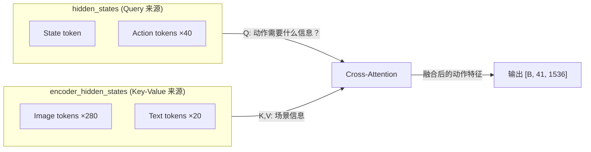
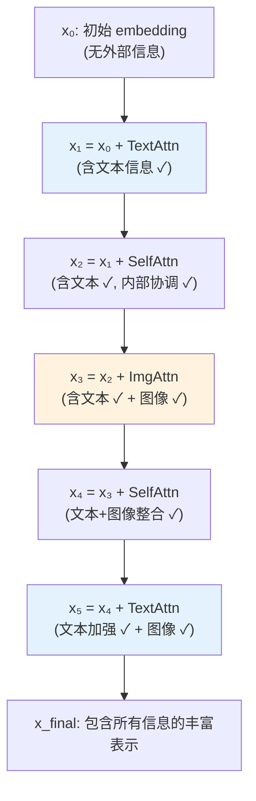
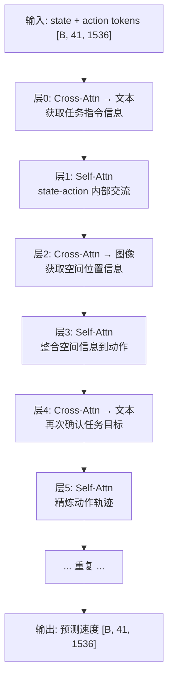

# Cross-Attention 与交替注意力机制

> Self-Attention 让序列"看自己"，Cross-Attention 让一个序列"看另一个序列"。交替注意力则是让模型在不同层交替关注不同的外部信息源。本文从零讲透这三个概念。

## 相关阅读

- [VLM 层截断](/前置知识/001d_前置知识_VLM层截断_只用大模型的前N层)
- [GR00T N1.7 - DiT 架构](/系列/groot_n1d7_deep_dive/11_DiT架构逐层拆解)
- [GR00T N1.7 - AlternateVLDiT](/系列/groot_n1d7_deep_dive/12_AlternateVLDiT_交替注意力设计)

---

## 1. 前置概念：注意力的本质

### 1.1 一句话定义

注意力机制的本质是：**用 Query 去"查询" Key-Value 对，得到加权组合的结果**。

类比：你去图书馆（Value 是书的内容，Key 是书的标题），拿着你的问题（Query），
找到和你问题最相关的书（Key 和 Query 的相似度高），然后把那些书的内容加权组合作为回答。

### 1.2 数学表示

$$
\text{Attention}(Q, K, V) = \text{softmax}\left(\frac{QK^T}{\sqrt{d_k}}\right) V
$$

> **一句话直觉**：Q 和 K 做点积得到"相关性分数"，归一化后作为权重，对 V 做加权求和。

**逐项拆解**：
- $Q \in \mathbb{R}^{n \times d_k}$：Query（查询），$n$ 个位置各自的"问题"
- $K \in \mathbb{R}^{m \times d_k}$：Key（键），$m$ 个位置各自的"标签"
- $V \in \mathbb{R}^{m \times d_v}$：Value（值），$m$ 个位置各自的"内容"
- $QK^T \in \mathbb{R}^{n \times m}$：相似度矩阵，第 $(i,j)$ 个元素表示第 $i$ 个 query 和第 $j$ 个 key 的相关程度
- $\sqrt{d_k}$：缩放因子，防止点积值过大导致 softmax 梯度消失
- softmax：将相似度转为概率权重（行方向归一化）

**具体数值例子**（$d_k = 2$）：

假设有 2 个 query 位置、3 个 key-value 位置：
```
Q = [[1, 0],    K = [[1, 0],    V = [[10, 20],
     [0, 1]]         [0, 1],         [30, 40],
                     [1, 1]]         [50, 60]]

QK^T = [[1, 0, 1],    # Q[0] 和 K[0]、K[2] 相似
        [0, 1, 1]]    # Q[1] 和 K[1]、K[2] 相似

softmax(QK^T / √2) ≈ [[0.39, 0.22, 0.39],
                        [0.22, 0.39, 0.39]]

Output ≈ [[0.39×[10,20] + 0.22×[30,40] + 0.39×[50,60]],  = [[30.2, 43.6],
           [0.22×[10,20] + 0.39×[30,40] + 0.39×[50,60]]]    [33.4, 47.2]]
```

Q[0]（更关注第 0 和第 2 个 key）得到的输出偏向 V[0] 和 V[2] 的混合。

---

## 2. Self-Attention：序列看自己

### 2.1 定义

**Self-Attention**：Q、K、V 全部来自**同一个**输入序列。

```python
# Self-Attention
Q = W_Q @ hidden_states  # hidden_states: [B, seq_len, dim]
K = W_K @ hidden_states  # 同一个输入
V = W_V @ hidden_states  # 同一个输入
output = Attention(Q, K, V)  # [B, seq_len, dim]
```

### 2.2 作用

让序列中的每个位置都能"看到"其他所有位置，从而学到位置之间的关系。

**例子**：输入是 `["The", "red", "cube", "is", "here"]`
- "cube" 位置 attend 到 "red" → 学到"这是一个红色的方块"
- "here" 位置 attend 到 "cube" → 学到"方块在这里"

### 2.3 在 GR00T 中的使用

DiT 的 Self-Attention 层让 **state token 和 action token 互相交流**：
- state token 能影响 action token 的生成
- 不同时间步的 action token 能互相协调（保证时序连贯性）

---

## 3. Cross-Attention：一个序列看另一个序列

### 3.1 定义

**Cross-Attention**：Q 来自一个序列，K 和 V 来自**另一个**序列。

```python
# Cross-Attention
Q = W_Q @ hidden_states         # 来自序列 A（如 action）
K = W_K @ encoder_hidden_states  # 来自序列 B（如 VL 特征）
V = W_V @ encoder_hidden_states  # 来自序列 B
output = Attention(Q, K, V)      # [B, seq_len_A, dim]
```

### 3.2 直觉

Cross-Attention 让一个序列"查询"另一个序列的信息。
- 序列 A 提出问题（Query）
- 序列 B 提供答案（Key-Value）

### 3.3 贯穿全文的例子

在 GR00T 的 DiT 中：
- **序列 A**（hidden_states）：state + action 的嵌入，形状 `[B, 41, 1536]`
  - 1 个 state token + 40 个 action token
- **序列 B**（encoder_hidden_states）：VLM 骨干输出的视觉-语言特征，形状 `[B, ~300, 2048]`
  - ~280 个图像 token + ~20 个文本 token

Cross-Attention 让 action token "看到"图像和语言信息——
相当于机器人在生成动作时"看"场景理解结果。



### 3.4 和 Self-Attention 的对比

| 维度 | Self-Attention | Cross-Attention |
|------|---------------|-----------------|
| Q 来源 | 自身 | 自身 |
| K,V 来源 | **自身** | **外部序列** |
| 作用 | 内部交流 | 引入外部信息 |
| 计算形状 | $[n, n]$ 的注意力矩阵 | $[n, m]$ 的注意力矩阵 |
| GR00T 中的例子 | action token 之间协调 | action attend 到 VL 特征 |

---

## 4. 交替注意力：在不同层关注不同信息

### 4.1 问题：标准 Cross-Attention 的局限

在 GR00T 的 DiT 中，外部序列（encoder_hidden_states）包含**两种**信息：
- **图像 token**（~280 个）：场景的视觉信息——"物体在哪、长什么样"
- **文本 token**（~20 个）：语言指令——"要做什么"

如果每一层的 Cross-Attention 都同时 attend 到所有 300 个 token，会发生什么？

**问题 1：数量压制**

softmax 将注意力权重归一化为概率分布。300 个 token 中有 280 个是图像——
即使文本 token 同等重要，它们也只能分到 20/300 ≈ 7% 的注意力权重。
文本的"做什么"信息被图像的"在哪里"信息**淹没**了。

**问题 2：信息性质冲突**

图像 token 携带的是细粒度空间信息（像素级位置），
文本 token 携带的是高层语义信息（任务目标）。
在同一层中同时处理两种截然不同的信息，网络需要学会"同时做两件不同的事"——
这比"每次专注做一件事"要困难得多。

### 4.2 解决方案：交替注意力 (Alternating Attention)

**核心思想**：让不同层的 Cross-Attention 关注**不同类型**的 token。

```
层 0 (Cross-Attn): 只 attend 到文本 token → 理解"要做什么"
层 1 (Self-Attn):  内部消化
层 2 (Cross-Attn): 只 attend 到图像 token → 理解"在哪做"
层 3 (Self-Attn):  内部消化
层 4 (Cross-Attn): 只 attend 到文本 token → 再次确认目标
层 5 (Self-Attn):  内部消化
...重复...
```

### 4.3 关键理解：残差连接让信息逐层累积

**⚠️ 极其重要的一点**：虽然每一层只"新获取"一种信息，但之前层获取的信息**通过残差连接保留在 hidden_states 中**！

具体来说，每一层的计算是：

$$
x_{l+1} = x_l + \text{Attention}(x_l, \ldots)
$$

> **一句话直觉**：每层的输出 = 输入 + 新信息。新信息被"加"到已有信息上，不是"替换"。

**用具体数值追踪信息流**：

```
x₀ = [初始 action embedding, 不含任何外部信息]

层0 (Cross-Attn → 文本):
  新信息 = CrossAttn(x₀, 文本tokens) → "要抓红色方块"
  x₁ = x₀ + 新信息 → x₁ 现在包含了文本信息 ✓

层1 (Self-Attn):
  新信息 = SelfAttn(x₁) → action tokens 之间互相交流
  x₂ = x₁ + 新信息 → x₂ 仍然包含文本信息 ✓（残差保留了）

层2 (Cross-Attn → 图像):
  新信息 = CrossAttn(x₂, 图像tokens) → "红色方块在桌子左边"
  x₃ = x₂ + 新信息 → x₃ 现在同时包含文本+图像信息 ✓

层3 (Self-Attn):
  新信息 = SelfAttn(x₃) → 整合文本和图像信息
  x₄ = x₃ + 新信息 → x₄ 同时包含文本+图像+整合后的信息 ✓

...到最后一层，hidden_states 累积了所有层的所有信息
```

**所以"交替"并不意味着信息被隔离！** 它只是说每一层**新引入**的外部信息类型不同。
通过残差连接，所有层的输出逐步叠加——最终的 hidden_states 同时包含了：
- 多轮文本 attention 获取的语义理解
- 多轮图像 attention 获取的空间定位
- 多轮 self-attention 完成的内部整合



### 4.4 和"每层都看全部"相比，交替的优势

既然信息最终都会累积到一起，那为什么还要交替而不是每层都看全部？

**答案在于注意力的"带宽"有限**。

每一层 Cross-Attention 的注意力权重总和为 1（softmax 归一化）。
如果一层同时看 300 个 token（280 图像 + 20 文本），每个 token 平均分到 1/300 的注意力。

但如果一层只看 20 个文本 token，每个文本 token 能分到 1/20 的注意力——
信息提取的"浓度"高了 15 倍！

这就像：
- 混合模式 = 一次性读 300 页书（每页扫一眼）
- 交替模式 = 先精读 20 页文本，再精读 280 页图，最后整合

每次"精读"得到的信息质量远高于"扫一眼"。

标准 Cross-Attention：
$$
\text{Output} = \text{Attn}(Q_A, K_{ALL}, V_{ALL})
$$

交替 Cross-Attention（偶数 cross-attn 层看文本，奇数看图像）：
$$
\text{Output}^{(\text{even})} = \text{Attn}(Q_A, K_{\text{text}}, V_{\text{text}})
$$
$$
\text{Output}^{(\text{odd})} = \text{Attn}(Q_A, K_{\text{image}}, V_{\text{image}})
$$

实际实现中通过 **attention mask** 来选择性屏蔽 token：

```python
# 文本层：屏蔽图像 token
text_mask = ~image_mask & attention_mask  # True = 文本位置
output = Attention(Q, K, V, mask=text_mask)  # 只 attend 到文本

# 图像层：屏蔽文本 token  
img_mask = image_mask & attention_mask  # True = 图像位置
output = Attention(Q, K, V, mask=img_mask)  # 只 attend 到图像
```

### 4.5 通过 mask 实现而非物理分离

一个重要的工程细节：交替注意力**不需要**把图像和文本 token 物理分离成两个张量。
它只需要一个 boolean mask——在 softmax 之前将不想 attend 的位置设为 $-\infty$：

$$
\text{Attn}(Q, K, V, \text{mask}) = \text{softmax}\left(\frac{QK^T}{\sqrt{d_k}} + \text{mask\_bias}\right) V
$$

其中 mask_bias 对被屏蔽的位置设为 $-10000$（使 softmax 输出趋近 0）。

这样 K 和 V 仍然是完整的序列，计算上更高效（不需要动态切分张量）。

### 4.6 为什么交替比混合更好？

| 维度 | 混合（标准 Cross-Attn） | 交替 |
|------|---------------------|------|
| 文本注意力份额 | ~7%（被图像淹没） | ~100%（文本层中） |
| 信息处理方式 | 一层同时处理两种信息 | 一层只处理一种 |
| 学习难度 | 高（多任务学习） | 低（单任务学习） |
| 总信息摄入 | 相同（所有层加起来） | 相同（文本层+图像层） |

**类比**：
- 混合注意力 ≈ 一边听音乐一边看书（两种输入互相干扰）
- 交替注意力 ≈ 先专注听一段音乐，再专注看一段书（每次全神贯注一件事）

---

## 5. Interleave Self-Attention：自注意力与交叉注意力的交替

### 5.1 概念

除了"Cross-Attention 内部的图像/文本交替"，还有一个更基础的交替——
**Self-Attention 层和 Cross-Attention 层本身的交替**。

标准 Transformer Decoder（如 GPT）只有 Self-Attention。
标准 Encoder-Decoder Transformer（如原始 Transformer、BERT-GPT）
在每个 block 中先做 Self-Attention，再做 Cross-Attention：

```
标准 Encoder-Decoder Block:
  hidden_states → Self-Attn → Cross-Attn → FFN → output
```

GR00T 的 DiT 使用 **interleaved** 模式——Self-Attn 和 Cross-Attn 交替出现在**不同层**：

```
GR00T Interleaved DiT:
  层 0: Cross-Attn + FFN  (从外部获取信息)
  层 1: Self-Attn + FFN   (内部消化信息)
  层 2: Cross-Attn + FFN  (从外部获取信息)
  层 3: Self-Attn + FFN   (内部消化信息)
  ...
```

### 5.2 为什么交替排列？

对比两种设计：

**设计 A：每层都有 Self + Cross（标准 encoder-decoder）**
```
每层：Self-Attn → Cross-Attn → FFN
优点：每层都能同时做内部交流和外部获取
缺点：每层计算量大（两次注意力）
```

**设计 B：奇偶交替（GR00T 选择的方式）**
```
偶数层：Cross-Attn → FFN（获取外部信息）
奇数层：Self-Attn → FFN（内部消化整合）
优点：每层只做一种注意力，计算更高效
缺点：信息获取和消化有一层延迟
```

GR00T 选择设计 B 的原因：
1. **效率**：每层少一次注意力计算，32 层的总计算量约等于设计 A 的 16 层
2. **专注**：每一层只做一件事，梯度信号更清晰，更容易训练
3. **足够的深度**：32 层（16 层 cross + 16 层 self）足以建模复杂关系

### 5.3 信息流可视化



---

## 6. 完整图景：GR00T N1.7 的注意力层组合

GR00T 的 AlternateVLDiT 同时使用了两种交替：

1. **层级交替**：Self-Attn 和 Cross-Attn 交替出现（interleave_self_attention）
2. **内容交替**：Cross-Attn 层内部交替 attend 图像和文本（attend_text_every_n_blocks）

组合起来（32 层，attend_text_every_n_blocks=2）：

| 层号 | 类型 | Attend 到 |
|------|------|----------|
| 0 | Cross-Attn | **文本** token |
| 1 | Self-Attn | 自身（state+action） |
| 2 | Cross-Attn | **图像** token |
| 3 | Self-Attn | 自身 |
| 4 | Cross-Attn | **文本** token |
| 5 | Self-Attn | 自身 |
| 6 | Cross-Attn | **图像** token |
| 7 | Self-Attn | 自身 |
| ... | ... | ... |
| 30 | Cross-Attn | 图像 |
| 31 | Self-Attn | 自身 |

32 层中：16 个 Cross-Attn（8 个看文本 + 8 个看图像）+ 16 个 Self-Attn。
文本和图像各获得 **均等的注意力资源**，尽管 token 数量相差 14 倍。

---

## 7. 代码实现模板

```python
class AlternatingCrossAttentionBlock(nn.Module):
    """交替注意力的一个 Cross-Attention 层"""
    
    def __init__(self, dim, num_heads, cross_dim):
        super().__init__()
        self.norm = nn.LayerNorm(dim)
        self.attn = nn.MultiheadAttention(dim, num_heads, kdim=cross_dim, vdim=cross_dim)
    
    def forward(self, x, encoder_states, mask=None):
        """
        Args:
            x: [B, T, D] 动作序列
            encoder_states: [B, S, D] VL 特征（完整序列）
            mask: [B, S] 布尔 mask，True = 要 attend 的位置
        """
        residual = x
        x = self.norm(x)
        
        # mask 转换为 attention bias（False 位置设为 -inf）
        if mask is not None:
            attn_mask = torch.zeros_like(mask, dtype=x.dtype)
            attn_mask[~mask] = float('-inf')  # 被屏蔽位置
        
        out, _ = self.attn(query=x, key=encoder_states, value=encoder_states,
                          key_padding_mask=~mask)  # 注意取反
        return out + residual
```

---

## 8. 总结

| 概念 | 一句话定义 | GR00T 中的用途 |
|------|-----------|---------------|
| Self-Attention | 序列内部互相看 | state 和 action token 互相交流 |
| Cross-Attention | 一个序列看另一个序列 | action 看 VL 特征（获取视觉和语言信息） |
| 交替注意力 | 不同层关注不同类型的外部 token | 偶数层看文本、奇数层看图像 |
| Interleave Self-Attn | Self 和 Cross 层交替出现 | 获取→消化→获取→消化 的节奏 |

这四个概念的组合构成了 GR00T N1.7 中 AlternateVLDiT 的核心设计。
理解了它们，你就能理解为什么模型能在 32 层中同时做好"理解任务目标"和"精确定位物体"。
