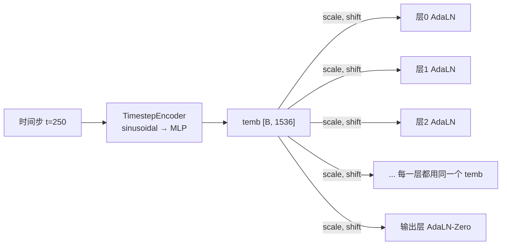

# AdaLayerNorm：条件化归一化

> 标准 LayerNorm 对所有输入做相同的归一化。AdaLayerNorm 让归一化的行为**随条件动态变化**——告诉网络"你现在在去噪的第几步"，让网络的工作模式自适应调整。

## 相关阅读

- [Cross-Attention 与交替注意力](/前置知识/001e_前置知识_Cross_Attention与交替注意力机制)
- [Flow Matching 数学基础](/系列/groot_n1d7_deep_dive/09_Flow_Matching数学基础)
- [GR00T N1.7 - DiT 架构](/系列/groot_n1d7_deep_dive/11_DiT架构逐层拆解)

---

## 1. 先回顾：标准 LayerNorm 做了什么？

### 1.1 LayerNorm 的公式

$$
\text{LayerNorm}(x) = \gamma \cdot \frac{x - \mu}{\sigma + \epsilon} + \beta
$$

> **一句话直觉**：把输入的分布"拉"到均值为 0、方差为 1 的标准分布，然后用可学习的 $\gamma$ 和 $\beta$ 做缩放和偏移。

**逐项拆解**：
- $x \in \mathbb{R}^d$：输入向量（一个 token 的特征）
- $\mu = \frac{1}{d}\sum_i x_i$：各维度的均值
- $\sigma = \sqrt{\frac{1}{d}\sum_i (x_i - \mu)^2}$：各维度的标准差
- $\gamma, \beta \in \mathbb{R}^d$：可学习的缩放和偏移参数
- $\epsilon$：防止除零的小常数（通常 $10^{-5}$）

**具体数值例子**（$d=4$）：

输入：$x = [2, 4, 6, 8]$
- $\mu = 5$，$\sigma = \sqrt{5} \approx 2.24$
- 归一化：$\frac{x - 5}{2.24} = [-1.34, -0.45, 0.45, 1.34]$
- 假设 $\gamma = [1,1,1,1]$，$\beta = [0,0,0,0]$
- 输出：$[-1.34, -0.45, 0.45, 1.34]$

### 1.2 LayerNorm 的局限

标准 LayerNorm 的 $\gamma$ 和 $\beta$ 是**固定的**可学习参数——
一旦训练完成，不管输入是什么、条件是什么，都用同一组 $\gamma, \beta$。

但在扩散模型中，我们希望网络在不同的去噪时间步有**不同的行为**：
- $t=0$（纯噪声）：网络需要做"大幅度修正"
- $t=0.75$（接近干净）：网络只需要做"微小微调"

用同一组 $\gamma, \beta$ 无法表达这种"时间步相关"的动态行为。

---

## 2. AdaLayerNorm：让归一化随条件变化

### 2.1 核心思想

**Adaptive Layer Normalization (AdaLN)**：用条件信息（如时间步 embedding）
动态生成 $\gamma$ 和 $\beta$，替代固定的可学习参数。

$$
\text{AdaLN}(x, c) = (1 + \gamma_c) \cdot \text{LN}(x) + \beta_c
$$

其中 $\gamma_c$ 和 $\beta_c$ 是从条件 $c$ 计算得到的：

$$
[\gamma_c, \beta_c] = \text{Linear}(\text{SiLU}(c))
$$

> **一句话直觉**：条件（时间步）通过 scale 和 shift 告诉每一层"用什么强度工作"——去噪早期用大力，后期用小力。

### 2.2 数学表示（GR00T 中的实现）

$$
\text{AdaLN}(x, \text{temb}) = \text{LN}(x) \cdot (1 + s) + b
$$

其中：
$$
[s, b] = \text{Linear}(\text{SiLU}(\text{temb}))
$$

**逐项拆解**：
- $x \in \mathbb{R}^{B \times T \times D}$：输入特征
- $\text{temb} \in \mathbb{R}^{B \times D}$：时间步 embedding（从 TimestepEncoder 得到）
- $\text{SiLU}(\text{temb})$：非线性激活（$\text{SiLU}(x) = x \cdot \sigma(x)$）
- $\text{Linear}$：线性层，输入维度 $D$，输出维度 $2D$（一半是 scale，一半是 shift）
- $s \in \mathbb{R}^{B \times D}$：scale 参数（对应 $\gamma$）
- $b \in \mathbb{R}^{B \times D}$：shift 参数（对应 $\beta$）
- $(1 + s)$：加 1 是为了让 scale 的默认值为 1（未经训练时 $s \approx 0$ → 不缩放）

### 2.3 GR00T 中的代码

```python
class AdaLayerNorm(nn.Module):
    def __init__(self, embedding_dim):
        self.silu = nn.SiLU()
        self.linear = nn.Linear(embedding_dim, 2 * embedding_dim)  # 输出 scale + shift
        self.norm = nn.LayerNorm(embedding_dim, elementwise_affine=False)  # 无可学习参数的 LN
    
    def forward(self, x, temb):
        # temb: [B, D] 时间步embedding
        temb = self.linear(self.silu(temb))  # [B, 2D]
        scale, shift = temb.chunk(2, dim=1)  # 各 [B, D]
        x = self.norm(x) * (1 + scale[:, None]) + shift[:, None]  # [:, None] 扩展到序列维度
        return x
```

注意 `self.norm` 使用 `elementwise_affine=False`——即标准 LayerNorm **没有**自己的 $\gamma, \beta$。
所有的缩放和偏移完全由外部条件 `temb` 控制。

---

## 3. 具体数值例子

假设 $D=4$，batch 中有 2 个样本，对应不同的去噪时间步。

**样本 1**：$t=0$（纯噪声阶段）
```
temb_1 = [2.0, -1.0, 0.5, 1.5]  (时间步 embedding)
经过 SiLU + Linear 后:
  scale_1 = [0.8, 0.8, 0.8, 0.8]  (大 scale → 大幅调制)
  shift_1 = [0.3, -0.2, 0.1, 0.4]
```

**样本 2**：$t=0.75$（接近干净阶段）
```
temb_2 = [-0.5, 0.3, -0.2, 0.1]  (不同的时间步 embedding)
经过 SiLU + Linear 后:
  scale_2 = [0.1, 0.1, 0.1, 0.1]  (小 scale → 轻微调制)
  shift_2 = [0.01, 0.02, -0.01, 0.01]
```

相同的输入 $x$，因为时间步不同，经过 AdaLN 后的输出完全不同：
- 样本 1：$\text{LN}(x) \times 1.8 + 0.3$ → 特征被大幅放大和偏移
- 样本 2：$\text{LN}(x) \times 1.1 + 0.01$ → 特征几乎不变

---

## 4. 为什么 DiT 要用 AdaLayerNorm？

### 4.1 扩散模型中条件注入的需求

扩散模型（包括 DDPM 和 Flow Matching）的核心流程是：
- 训练时：给定带噪声的数据 $x_t$ 和时间步 $t$，预测噪声/速度
- 推理时：从 $t=0$ 逐步积分到 $t=1$

关键需求：**网络必须知道当前是"去噪的第几步"**。

为什么？因为同样的输入 $x$：
- 如果 $t=0$（几乎全是噪声），网络需要预测"大方向"
- 如果 $t=0.75$（几乎已经干净），网络需要预测"微小修正"

如果网络不知道 $t$，它无法区分这两种情况。

### 4.2 条件注入的三种方式对比

| 方式 | 做法 | 缺点 |
|------|------|------|
| 拼接 | 把 $t$ 的 embedding 拼在输入后面 | 只在第一层有效，深层可能被忘记 |
| 相加 | $x + \text{temb}$ | 改变了输入的分布，可能导致训练不稳定 |
| **AdaLN** | 通过 scale/shift 调制每一层 | ✅ 每一层都直接受 $t$ 控制，效果最强 |

AdaLN 的优势：**每一层**的归一化都被条件调制——
时间步信息在网络的每一层都被"注入"，不会随着层数增加而衰减。

### 4.3 在 GR00T 中的信息流



同一个 `temb` 被送入每一层的 AdaLN——每一层都"知道"当前的去噪进度。

---

## 5. AdaLN-Zero：输出层的特殊变体

GR00T 的 DiT 在最终输出时还使用了一个变体—— **AdaLN-Zero**：

```python
# DiT 输出层
conditioning = temb                    # [B, 1536]
shift, scale = self.proj_out_1(F.silu(conditioning)).chunk(2, dim=1)  # 各 [B, 1536]
hidden_states = self.norm_out(hidden_states) * (1 + scale[:, None]) + shift[:, None]
output = self.proj_out_2(hidden_states)  # 投影到 output_dim
```

和中间层 AdaLN 的区别：
- 中间层 AdaLN 后面还有注意力和 FFN
- 输出层 AdaLN 直接跟最终投影——是最后一次条件调制的机会

"Zero" 的含义：初始化时让 scale 和 shift 接近 0，
使得网络初始行为接近**恒等映射**（输出约等于输入）。
这有助于训练稳定性——刚开始训练时网络不会输出垃圾值。

---

## 6. 和其他条件化技术的对比

| 技术 | 条件注入位置 | 强度 | 计算开销 | 使用场景 |
|------|------------|------|---------|---------|
| 拼接输入 | 只在输入层 | 弱 | 低 | 简单条件 |
| Cross-Attention | 每个 cross-attn 层 | 中等 | 中等 | 序列化条件（如文本） |
| **AdaLayerNorm** | **每一层的归一化** | **强** | 低 | 标量/向量条件（如时间步） |
| FiLM (Feature-wise Linear Modulation) | 任意层 | 中等 | 低 | AdaLN 的泛化版本 |

GR00T 中两种主要条件同时使用：
- **时间步** → AdaLayerNorm（标量条件，每层注入）
- **VL 特征** → Cross-Attention（序列条件，交替注入）

两者互不冲突，各自负责不同类型的条件信息。

---

## 7. 总结

| 要点 | 内容 |
|------|------|
| **是什么** | 用外部条件动态生成 LayerNorm 的 scale 和 shift 参数 |
| **为什么需要** | 让网络行为随去噪时间步动态调整（早期大力，后期轻柔） |
| **怎么实现** | `[scale, shift] = Linear(SiLU(condition))`，然后 `LN(x) * (1+scale) + shift` |
| **和标准 LN 的区别** | 标准 LN 的 γ/β 是固定参数；AdaLN 的 scale/shift 每次根据条件动态计算 |
| **GR00T 中的应用** | DiT 的每一层都用 AdaLN 注入时间步信息 |
| **优势** | 每一层都直接受条件控制，信息不会衰减 |

AdaLayerNorm 是所有现代扩散 Transformer（DiT、SD3、Flux 等）的标准组件。
理解它是理解 DiT 架构的关键——没有 AdaLN，DiT 就不知道自己在去噪的哪一步。
