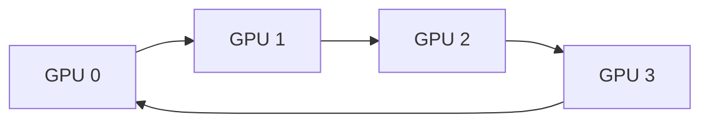
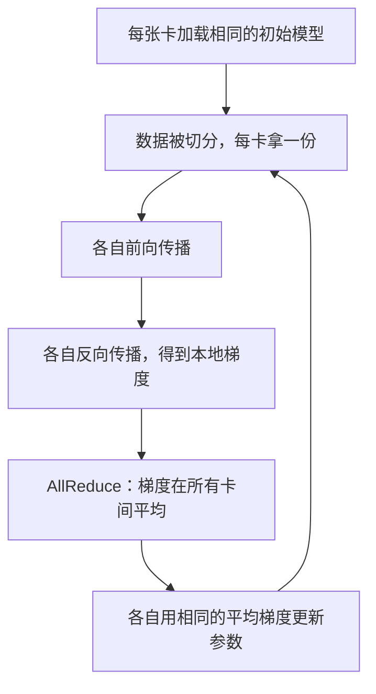

# 数据并行与 AllReduce 基础

> 一张 GPU 训练一个模型要跑很久，能不能找 8 张卡一起跑？8 张卡各自算各自的，最后怎么"对齐"成同一个模型？本文讲清楚数据并行（Data Parallel）和 AllReduce 通信原语的原理，这是后面理解 FSDP、Megatron 等一切分布式训练技术的地基。

## 相关阅读

- 后续：[FSDP：全分片数据并行](/前置知识/001i_前置知识_FSDP全分片数据并行)
- 后续：[张量并行与流水线并行：Megatron 核心思想](/前置知识/001j_前置知识_张量并行与流水线并行_Megatron核心思想)

---

## 贯穿全文的例子

> 假设我们要训练一个小模型：一个只有 3 个参数的线性层 $y = w_1 x_1 + w_2 x_2 + w_3 x_3$。手头有 4 张 GPU，每张卡上都放一份完整的模型副本。数据集被切成 4 份，每张卡负责其中一份。我们会用这个例子说明"数据并行"到底在做什么、梯度是怎么被"对齐"的。

---

## 一、问题的起点：为什么一张卡不够用

训练一个神经网络的核心循环是：

1. 拿一个 batch 的数据做前向传播，算出 loss
2. 反向传播，算出每个参数的梯度
3. 优化器根据梯度更新参数

如果这个 batch 很大（比如几千条样本），或者想要更快跑完一个 epoch，一张 GPU 算得太慢。最直接的想法是：**多找几张 GPU，把数据切开，同时算**。

这就是**数据并行**（Data Parallelism, DP）：

- 每张 GPU 上都保存一份**完整的、相同的**模型参数
- 把一个大 batch 切成 N 份（N = GPU 数量），每张 GPU 分到一份不同的数据
- 每张 GPU 各自独立做前向 + 反向，算出**自己那份数据对应的梯度**
- 关键问题来了：4 张卡算出了 4 份不同的梯度，怎么保证 4 张卡上的模型**始终保持一致**？

如果不做任何处理，4 张卡各自更新参数，几步之后 4 个模型就会变成 4 个不同的模型——这不是我们想要的（我们想要的是"一个更大 batch 训练出的一个模型"，而不是 4 个独立训练的模型）。

**解决方案**：在每一步更新参数之前，把 4 张卡算出的梯度**做平均**，让每张卡拿到的都是"全局梯度"，再各自用这份相同的梯度去更新参数。因为起点相同（相同初始化）+ 每步用相同的梯度更新，4 张卡上的模型会**始终保持完全一致**。

## 二、梯度平均：数据并行的核心公式

假设有 $N$ 张 GPU，第 $i$ 张卡上算出的梯度是 $g_i$（对同一组参数）。数据并行要做的是：

$$
\bar{g} = \frac{1}{N} \sum_{i=1}^{N} g_i
$$

**为什么需要这个公式**：每张卡只看到了整个 batch 的 $1/N$，它算出的梯度只是"局部梯度"。如果直接拿局部梯度去更新参数，等价于用一个小 batch 训练——batch 越小，梯度噪声越大，训练越不稳定。我们真正想要的是**大 batch 的梯度**，而大 batch 梯度正好等于所有小 batch 梯度的平均（因为 loss 本身就是对样本求平均）。

> **一句话直觉**：把 4 张卡看到的"局部意见"汇总起来，取个平均，得到"全局共识"，然后所有卡都按这个共识更新，保持步调一致。

**逐项拆解**：

| 符号 | 含义 |
|------|------|
| $N$ | 参与训练的 GPU 数量（这里是 4） |
| $g_i$ | 第 $i$ 张 GPU 上，用它分到的那份数据算出的梯度 |
| $\bar{g}$ | 平均后的梯度，也叫"全局梯度"，所有卡最终都会拿到这个值 |

**代入数字**：假设我们的模型只有一个参数 $w$（简化到极致），4 张卡分别算出梯度：

$$
g_1 = 0.2, \quad g_2 = 0.4, \quad g_3 = 0.1, \quad g_4 = 0.3
$$

$$
\bar{g} = \frac{0.2 + 0.4 + 0.1 + 0.3}{4} = \frac{1.0}{4} = 0.25
$$

之后，4 张卡都会用 $\bar{g} = 0.25$ 去更新自己那份参数副本——四张卡更新完之后，参数值仍然完全一样。

**为什么是取平均而不是求和**：如果直接求和，等价于把学习率放大了 $N$ 倍（4 倍），训练会变得不稳定。取平均保证了"无论用多少张卡，等效学习率不变"，这样多卡训练和单卡训练在数学上是一致的，只是数据切分方式不同。

## 三、AllReduce：怎么把 4 张卡的梯度"凑"到一起

上一节说"把梯度平均"，但这句话背后藏着一个通信问题：4 张卡在物理上是分开的（不同的 GPU，甚至不同的机器），梯度数据分散在各自的显存里，怎么让每张卡都拿到"平均值"？

这就是 **AllReduce** 通信原语要解决的问题。

> **一句话直觉**：AllReduce 做的事情是——每张卡贡献出自己手里的一份数据，所有卡的数据被汇总（比如求和），然后**每张卡都拿到汇总后的结果**（不是只有一张卡拿到，是所有卡都拿到同一份结果）。

### 3.1 最朴素的实现：一张卡当"总管"

最容易想到的方式：

1. 所有卡把梯度发给 GPU 0（当"总管"）
2. GPU 0 把 4 份梯度加起来，除以 4
3. GPU 0 把结果发回给其他 3 张卡

**问题**：GPU 0 需要接收 3 份数据、发送 3 份数据，通信压力集中在一张卡上。如果有 100 张卡，GPU 0 要处理 99 次收发——它会成为瓶脏颈，其他卡大部分时间在等待。

### 3.2 更聪明的实现：Ring AllReduce

实际系统（如 NCCL，NVIDIA 的多卡通信库）采用的是**环形（Ring）拓扑**：把所有 GPU 排成一个环，每张卡只跟左右相邻的卡通信，没有"中心节点"。

Ring AllReduce 分两个阶段：

1. **Reduce-Scatter 阶段**：把梯度切成 $N$ 段，每张卡沿着环传递数据，逐步把"部分和"累加起来。$N$ 步之后，每张卡手里恰好有**全局梯度的 $1/N$**（不同卡拿到不同的 $1/N$ 段）。
2. **All-Gather 阶段**：每张卡把自己手里那 $1/N$ 段的完整结果，沿着环广播给所有其他卡。$N$ 步之后，每张卡都拿到了完整的全局梯度。

**为什么这样设计**：Ring 拓扑下，每张卡在任意时刻都同时在"发一点"和"收一点"，带宽被均匀利用，不存在某张卡是瓶颈。当 $N$ 很大时（比如几百张卡），Ring AllReduce 的总通信量几乎不随 $N$ 增长——每张卡固定发送和接收大约 $2 \times \text{数据量}$，与卡数无关。

### 3.3 通信量的数值例子

假设梯度总大小是 $S$（比如一个 1B 参数模型的梯度，fp32 下 $S = 4\text{GB}$），$N = 8$ 张卡做 Ring AllReduce：

- 每张卡在 Reduce-Scatter 阶段发送数据总量：$\frac{N-1}{N} \times S = \frac{7}{8} \times 4\text{GB} = 3.5\text{GB}$
- 每张卡在 All-Gather 阶段发送数据总量：同样是 $\frac{7}{8} \times 4\text{GB} = 3.5\text{GB}$
- 每张卡总发送量：$2 \times \frac{N-1}{N} \times S \approx 7\text{GB}$

对比"一张卡当总管"的方式：GPU 0 需要发送/接收 $(N-1) \times S = 28\text{GB}$——是 Ring 方式的 4 倍还多，而且全部压在一张卡上。这就是为什么实际系统都用 Ring（或更先进的 Tree、Double-Binary-Tree）拓扑，而不是朴素的中心化方案。

## 四、DDP：PyTorch 中的数据并行实现

PyTorch 提供的 `DistributedDataParallel`（简称 DDP）把上面的逻辑封装好了。使用时的直觉流程：

DDP 有一个重要的工程细节：**它不会等反向传播全部完成才开始通信**。反向传播是从最后一层往前算的，DDP 会在某一层的梯度算完的瞬间就立刻发起这一层的 AllReduce，和后面层的梯度计算**同时进行**（overlap）。这样通信时间被"藏"在计算时间里，几乎不拖慢训练。

### 4.1 no_sync()：暂停梯度同步

DDP 提供了一个 `model.no_sync()` 的上下文管理器，作用是**临时关闭梯度的自动 AllReduce**。为什么需要这个？

典型场景是**梯度累积**（Gradient Accumulation）：如果想要的 batch size 比显存能装下的更大，可以把一个大 batch 拆成多个小的 micro-batch，依次做前向+反向，梯度在本地累加，直到最后一个 micro-batch 才做一次参数更新。

如果不用 `no_sync()`，每个 micro-batch 反向传播完都会触发一次 AllReduce——比如拆成 4 个 micro-batch，就要做 4 次 AllReduce，通信开销白白多了 4 倍。用 `no_sync()` 包住前 3 个 micro-batch，只在最后一个 micro-batch 正常同步，就只需要 1 次 AllReduce。

这个机制在后面的 [FSDP](/前置知识/001i_前置知识_FSDP全分片数据并行) 里会以另一种形式再次出现（`set_requires_gradient_sync`），原理完全一样。

## 五、数据并行的局限：显存是硬瓶颈

数据并行有一个前提：**每张 GPU 必须能装下完整的一份模型**——包括参数本身、参数的梯度、以及优化器状态（比如 Adam 需要给每个参数额外存两个动量项）。

拿一个 7B 参数的模型举例，用 fp32 精度、Adam 优化器训练：

| 显存占用项 | 计算方式 | 大小 |
|-----------|---------|------|
| 参数 | $7\text{B} \times 4\text{Byte}$ | 28 GB |
| 梯度 | $7\text{B} \times 4\text{Byte}$ | 28 GB |
| Adam 优化器状态（一阶+二阶动量） | $7\text{B} \times 4\text{Byte} \times 2$ | 56 GB |
| **总计** | | **112 GB** |

一张 A100（80GB）根本装不下——而且这还没算前向传播中间激活值占用的显存。数据并行的思路是"每张卡都存一份完整模型"，卡越多只是让 batch 更大、算得更快，**并不能解决单张卡装不下模型的问题**。

这正是下一篇 [FSDP：全分片数据并行](/前置知识/001i_前置知识_FSDP全分片数据并行) 要解决的问题：既然每张卡存一份完整模型太浪费，能不能把参数、梯度、优化器状态也像数据一样"切开"，分别存在不同的卡上？

## 六、总结

| 概念 | 核心要点 |
|------|---------|
| 数据并行 (DP) | 每卡存完整模型副本，数据切分，梯度通过通信对齐 |
| 梯度平均公式 | $\bar{g} = \frac{1}{N}\sum g_i$，保证多卡等效于单卡大 batch 训练 |
| AllReduce | 所有卡贡献数据、汇总、结果广播回所有卡的通信原语 |
| Ring AllReduce | 环形拓扑，通信量与卡数无关，避免中心节点瓶颈 |
| DDP | PyTorch 的数据并行实现，通信与反向传播 overlap |
| no_sync() | 梯度累积时临时关闭自动同步，减少不必要的通信 |
| 局限 | 每卡必须能装下完整模型 + 梯度 + 优化器状态 |

## 延伸阅读

- [FSDP：全分片数据并行](/前置知识/001i_前置知识_FSDP全分片数据并行)
- [张量并行与流水线并行：Megatron 核心思想](/前置知识/001j_前置知识_张量并行与流水线并行_Megatron核心思想)
- [训练后端：FSDP 与 Megatron（RLinf 深度解析系列）](/系列/rlinf_deep_dive/06_训练后端_FSDP与Megatron)
