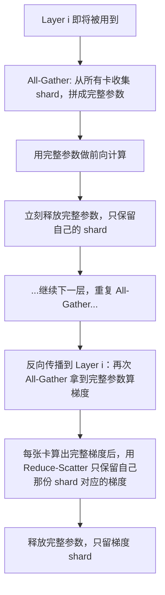
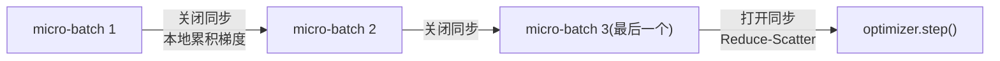

# FSDP：全分片数据并行

> 上一篇讲到，普通数据并行（DDP）要求每张卡都存一份完整的模型 + 梯度 + 优化器状态，这对大模型来说显存根本不够用。FSDP（Fully Sharded Data Parallel）的思路是：既然数据能切开分给每张卡，参数、梯度、优化器状态为什么不能也切开？本文讲清楚 FSDP 怎么切、什么时候拼回来、以及它和 ZeRO 的关系。

## 相关阅读

- 前置：[数据并行与 AllReduce 基础](/前置知识/001h_前置知识_数据并行与AllReduce基础)
- 后续：[张量并行与流水线并行：Megatron 核心思想](/前置知识/001j_前置知识_张量并行与流水线并行_Megatron核心思想)
- 应用：[训练后端：FSDP 与 Megatron（RLinf 深度解析系列）](/系列/rlinf_deep_dive/06_训练后端_FSDP与Megatron)

---

## 贯穿全文的例子

> 一个简化的两层网络，每层是一个 $4 \times 4$ 的权重矩阵（16 个参数），一共 32 个参数。我们用 2 张 GPU 做 FSDP 训练，看看这 32 个参数、它们的梯度、优化器状态分别是怎么被"切开"存放，又是怎么在需要的时候"拼回来"用的。

---

## 一、问题的起点：DDP 存了太多冗余

回顾 [上一篇](/前置知识/001h_前置知识_数据并行与AllReduce基础) 的结论：DDP 下，每张卡都保存一份**完整的**参数、梯度、优化器状态。如果有 8 张卡，就相当于把同一份东西存了 8 遍——这是巨大的冗余。

拿前面算过的例子：一个 7B 模型用 fp32 + Adam 训练，单卡需要 112GB 显存。如果用 8 张卡做 DDP，总共占用的显存是 $8 \times 112\text{GB} = 896\text{GB}$，但这 896GB 里存的信息其实和单卡的 112GB 完全一样，只是被复制了 8 份。

**FSDP 的核心想法**：既然有 8 张卡，为什么不把这 112GB 拆成 8 份，每张卡只存 $112/8 = 14\text{GB}$？这样总显存占用还是 112GB（没有浪费），但摊在每张卡上的显存压力从 112GB 降到了 14GB——原本一张卡放不下的模型，现在放得下了。

这正是"全分片"（**F**ully **S**harded）的含义：不只是数据分片（这是 DDP 已经做的），而是把**参数、梯度、优化器状态**这三者也都按卡数切分存储。

> 这个思想最早由微软的 **ZeRO**（Zero Redundancy Optimizer）提出，FSDP 是 PyTorch 官方对这一思想的原生实现，两者在核心原理上是一致的。

## 二、切分单位：谁来决定"怎么切"

FSDP 不是把整个模型的所有参数一股脑打乱平分，而是以**层（Module）为单位**进行切分和管理。具体来说，FSDP 会遍历模型的子模块（比如 Transformer 的每一个 `DecoderLayer`），把每个子模块的参数**在卡间平均切分**成 $N$ 份（$N$ = GPU 数量）。

延续本文的例子：两层网络，每层 16 个参数，2 张卡。FSDP 会这样切：

| | GPU 0 存的 shard | GPU 1 存的 shard |
|---|---|---|
| 第 1 层（16 个参数） | 前 8 个参数 | 后 8 个参数 |
| 第 2 层（16 个参数） | 前 8 个参数 | 后 8 个参数 |

每张卡永久保存的只是"自己那一份 shard"，而不是完整的层。梯度和优化器状态也按同样的方式切分——GPU 0 只需要为它保存的那 8 个参数维护梯度和 Adam 动量，不需要管另外 8 个参数。

## 三、核心机制：什么时候"拼回来"，什么时候"切开"

问题来了：前向传播算 $y = Wx$ 的时候，需要完整的权重矩阵 $W$，但每张卡手里只有 $W$ 的一半，怎么算？

答案是：**在需要用到某一层的完整参数时，临时把各卡的 shard 拼回一份完整的参数（All-Gather），用完之后立刻丢弃，只留回自己的那一份 shard**。

完整的 FSDP 前向 + 反向流程：

这里出现了两个在 [上一篇](/前置知识/001h_前置知识_数据并行与AllReduce基础) 提到的通信原语：

- **All-Gather**：每张卡贡献出自己的 shard，拼成完整数据，**所有卡都拿到完整版本**——用于前向/反向时临时还原参数。
- **Reduce-Scatter**：把多张卡算出的完整梯度求和，然后**按 shard 切分，每张卡只留自己那一份**——这一步同时完成了"梯度平均"和"梯度切分"两件事，比"先 AllReduce 再切分"更省一次通信。

> **一句话直觉**：FSDP 把参数常态化地"拆开存"，只在真正要用的那一刻"临时拼起来"，用完马上拆开还回去——像图书馆的书，大家平时分散保管书架的一部分，谁要读某本书就临时把它凑齐，读完立刻还回原位。

### 3.1 为什么这样设计能省显存

关键在于：**任意时刻，GPU 显存里只需要保留"当前正在计算的那一层"的完整参数**，其他层永远只以 shard 形式存在。对比 DDP（每张卡永久保存所有层的完整参数），FSDP 把"完整参数占用显存"的时间从"整个训练过程"压缩到了"处理这一层的那一小段时间"。

## 四、reshard_after_forward：一个关键的权衡开关

FSDP2（PyTorch 新版 API，用 `fully_shard()`）里有个配置叫 `reshard_after_forward`，直接体现了 FSDP 的一个核心权衡：

- **`reshard_after_forward=True`**：前向算完某一层后，立刻把刚 All-Gather 出来的完整参数丢弃，只留 shard。等反向传播到这一层时，**再做一次 All-Gather** 重新拼出完整参数算梯度。
- **`reshard_after_forward=False`**：前向算完后，把完整参数**留在显存里**，反向传播到这一层时直接用，不需要再 All-Gather。

**代入数字**：假设某一层的完整参数是 2GB，一次 All-Gather 通信耗时 20ms。

| 配置 | 显存占用（该层） | 反向时是否需要再通信 |
|------|-----------------|-------------------|
| `reshard_after_forward=True` | 只占 shard 大小（如 2 卡时是 1GB） | 需要，多花 20ms |
| `reshard_after_forward=False` | 占完整 2GB | 不需要，省下 20ms |

**为什么这样设计**：这是显存和通信时间的经典权衡（trade-off）——省显存就要多花通信时间，省时间就要多占显存。RLinf 里对模型最外层（整个模型作为一个 FSDP 单元）设置 `reshard_after_forward=False`，因为最外层反向传播时马上就要用到，不需要立刻释放；而对每个 Transformer 层，默认按配置决定，显存紧张就设 `True`。

## 五、sharding_strategy：切多少东西

FSDP1（老版 API）里有一个 `sharding_strategy` 选项，决定"参数、梯度、优化器状态"里到底哪些被切分：

| 策略 | 参数切分 | 梯度切分 | 优化器状态切分 | 显存占用 | 通信量 |
|------|---------|---------|--------------|---------|--------|
| `full_shard` | ✓ | ✓ | ✓ | 最低 | 最高（每层都要 All-Gather 参数） |
| `shard_grad_op` | ✗（常驻完整参数） | ✓ | ✓ | 中等 | 中等（不需要为参数做 All-Gather） |
| `no_shard` | ✗ | ✗ | ✗ | 最高，等价于纯 DDP | 最低（只有梯度 AllReduce） |

**为什么会有 `no_shard` 这个选项，明明它不切分任何东西**：因为 FSDP 的切分/拼接会引入额外的通信（All-Gather），如果模型本身不大，单卡显存完全够用，切分反而是多余的开销——这时候直接退化成普通 DDP（`no_shard`）反而更快。这也是为什么很多 VLA 模型（3B~7B 参数量，单机 8 卡显存够用）在实践中会选择 `no_shard`，只用 FSDP 的框架但不真正分片，图的是 API 统一、少一套代码。

## 六、显存账本：具体数字对比 DDP 和 FSDP

延续前面 7B 模型 + fp32 + Adam 的例子，用 8 张卡：

| 方案 | 单卡显存占用（参数+梯度+优化器状态） |
|------|----------------------------------|
| DDP（每卡存完整份） | 112 GB |
| FSDP `full_shard`（8 卡平分） | $112 / 8 = 14$ GB |

**这就是为什么 FSDP 能训练 DDP 训不了的大模型**——不是算法变了，纯粹是把冗余的存储砍掉了。当然，代价是训练过程中会有额外的 All-Gather / Reduce-Scatter 通信，但只要卡间带宽足够快（比如同机内的 NVLink），这个代价通常是可以接受的。

## 七、梯度累积时的同步控制

和 [DDP 的 `no_sync()`](/前置知识/001h_前置知识_数据并行与AllReduce基础#41-no-sync-暂停梯度同步) 一样，FSDP 在做梯度累积（把一个大 batch 拆成多个 micro-batch）时，也需要一个"先不同步梯度"的开关。

FSDP1 直接复用了 `model.no_sync()`。FSDP2 因为内部实现方式不同（用 `fully_shard()` 包装每一层，而不是把整个模型包一层），提供的是 `model.set_requires_gradient_sync(False)`——原理完全一样：非最后一个 micro-batch 时关闭梯度的 Reduce-Scatter，只在本地累加；到最后一个 micro-batch 才打开同步，做一次 Reduce-Scatter 把累积的梯度分发好。

## 八、混合精度：另一层显存优化

FSDP 通常会搭配混合精度使用，进一步压缩显存和通信量。核心思路是给三个不同用途的张量分别指定精度：

- **`param_dtype`**：参数在计算时用的精度（如 `bf16`），比 `fp32` 省一半显存
- **`reduce_dtype`**：做 All-Gather / Reduce-Scatter 通信时用的精度，通常和 `param_dtype` 一致，省一半通信带宽
- **`buffer_dtype`**：BatchNorm 等层内部 buffer 的精度

**为什么不是所有东西都用 `bf16`**：优化器状态（如 Adam 的动量）通常仍然保留 `fp32`，因为动量是多步梯度的累积，用低精度容易产生数值误差累积，影响训练稳定性。这是"哪里能省就省，哪里需要精度就保留"的工程权衡，而不是简单地"全部用低精度"。

## 九、FSDP 只解决了"数据并行方向"的显存问题

FSDP 切分的是**同一份数据并行组内**的冗余——本质上，$N$ 张卡还是在跑同一个模型的$N$份不同数据，只是不再每张卡存完整参数。但 FSDP 没有改变一件事：任意时刻，**某一层的完整参数、完整的一次前向计算，仍然要在单张卡上完成**（哪怕是临时拼出来的）。

如果模型单独一层就大到一张卡塞不下（比如超大词表的 Embedding 层，或者百亿参数级别的单层），FSDP 也无能为力——这时候需要的是另一种完全不同的切分思路：把**同一层内部**的计算也切开分给多张卡算，这就是下一篇要讲的[张量并行](/前置知识/001j_前置知识_张量并行与流水线并行_Megatron核心思想)。FSDP 和张量并行不是互斥的，实践中常常组合使用（FSDP 做跨机器/跨节点的数据并行，张量并行做单机内的层内切分）。

## 十、总结

| 概念 | 核心要点 |
|------|---------|
| FSDP 核心思想 | 把参数、梯度、优化器状态也像数据一样按卡切分（shard），消除 DDP 的冗余存储 |
| 切分单位 | 以子模块（层）为单位切分，而非全局打乱 |
| 拼接时机 | 只在真正计算某一层时用 All-Gather 临时拼出完整参数，用完立刻释放 |
| 梯度处理 | Reduce-Scatter 同时完成"求和平均"和"按 shard 切分"两件事 |
| reshard_after_forward | True 省显存多通信，False 省通信多显存——经典 trade-off |
| sharding_strategy | full_shard 全切分，shard_grad_op 只切梯度+优化器，no_shard 退化为 DDP |
| 局限 | 只解决数据并行方向的冗余，单层过大仍需要张量并行 |

## 延伸阅读

- [数据并行与 AllReduce 基础](/前置知识/001h_前置知识_数据并行与AllReduce基础)
- [张量并行与流水线并行：Megatron 核心思想](/前置知识/001j_前置知识_张量并行与流水线并行_Megatron核心思想)
- [训练后端：FSDP 与 Megatron（RLinf 深度解析系列）](/系列/rlinf_deep_dive/06_训练后端_FSDP与Megatron)
