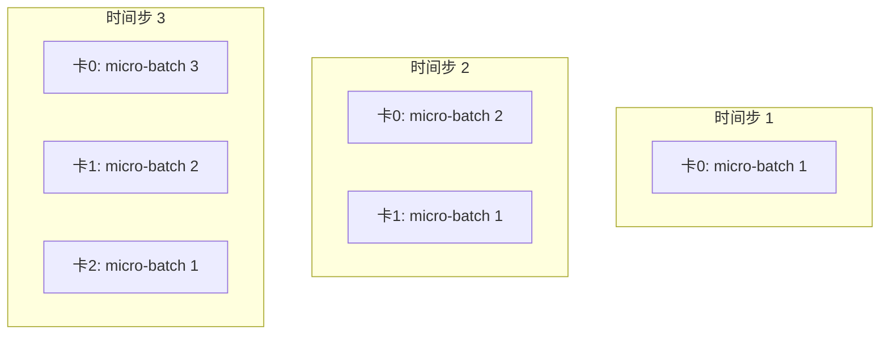

# 张量并行与流水线并行：Megatron 核心思想

> [FSDP](/前置知识/001i_前置知识_FSDP全分片数据并行) 解决了"同一份模型存太多份冗余"的问题，但它有个前提：模型的**某一层**在临时拼出完整参数后，必须能塞进一张卡的显存。如果单独一层就大到塞不进去呢（比如百亿参数级别模型的一个 Transformer 层，或者词表几十万的 Embedding 层）？这时候需要把**层内部**的计算也切开分给多张卡——这正是 Megatron-LM 提出的张量并行和流水线并行要解决的问题。

## 相关阅读

- 前置：[数据并行与 AllReduce 基础](/前置知识/001h_前置知识_数据并行与AllReduce基础)
- 前置：[FSDP：全分片数据并行](/前置知识/001i_前置知识_FSDP全分片数据并行)
- 应用：[训练后端：FSDP 与 Megatron（RLinf 深度解析系列）](/系列/rlinf_deep_dive/06_训练后端_FSDP与Megatron)

---

## 贯穿全文的例子

> 一个简化的 Transformer 模型，只有 4 层，每层的核心是一个矩阵乘法 $Y = XW$，其中 $W$ 的形状是 $[\text{hidden}, \text{hidden}]$。假设 $\text{hidden}$ 大到一张卡根本存不下一整个 $W$。我们用这个例子说明张量并行怎么把**一次矩阵乘法**拆给多张卡算，流水线并行怎么把**不同层**分给不同卡算。

---

## 一、和 FSDP 的本质区别：切"谁"

先明确三种并行方式切分的对象完全不同，这是理解 Megatron 的关键前提：

| 并行方式 | 切分对象 | 类比 |
|---------|---------|------|
| 数据并行 / FSDP | 把不同的**数据样本**分给不同卡，模型（或模型的存储）跟着分 | 4 个人分别读 4 本不同的书 |
| 张量并行（Tensor Parallel, TP） | 把**同一层内部的矩阵运算**切开，多张卡合作完成"一次"计算 | 4 个人合力抬一根太重、一个人抬不动的大梁 |
| 流水线并行（Pipeline Parallel, PP） | 把模型的**不同层**分给不同卡，像工厂流水线一样接力处理 | 4 个工位分别负责组装的第 1/2/3/4 道工序 |

FSDP 全程操作的单位是"同一层的参数副本"——不管怎么切，每张卡上某一时刻拿到的都是**完整的一层**（哪怕是临时拼出来的）。张量并行则更进一步：**同一层内部**的一次矩阵乘法都可以被拆开，分布在多张卡上**同时**算，没有一张卡见过完整的权重矩阵。

## 二、张量并行：把一次矩阵乘法拆开算

### 2.1 直觉：为什么矩阵乘法可以拆

考虑本文的例子：$Y = XW$，其中 $X$ 是输入（$[batch, hidden]$），$W$ 是权重（$[hidden, hidden]$）。张量并行最常用的两种切法，来自线性代数的基本性质：

**按列切分权重（Column Parallel）**：把 $W$ 按列切成 $N$ 份，$W = [W_1, W_2, \ldots, W_N]$，每张卡存一份 $W_i$。

$$
Y = X[W_1, W_2, \ldots, W_N] = [XW_1, XW_2, \ldots, XW_N]
$$

**为什么能这样切**：矩阵乘法按列分块是精确成立的等式——$X$ 乘以 $W$ 的第 $i$ 列块，正好等于结果 $Y$ 的第 $i$ 列块，各卡之间**完全不需要通信**就能各自算出自己那部分结果。算完后把每张卡的结果 $XW_i$ 在列方向拼起来（Concat），就是完整的 $Y$。

**按行切分权重（Row Parallel）**：把 $W$ 按行切成 $N$ 份，同时也要求输入 $X$ 已经是按对应方式切分好的（通常紧跟在 Column Parallel 后面用）。

$$
Y = X_1 W_1 + X_2 W_2 + \cdots + X_N W_N
$$

**为什么需要通信**：这里每张卡算出的 $X_i W_i$ 只是最终结果的一部分（一个部分和），必须把 $N$ 张卡的部分和**加起来**才是真正的 $Y$——这一步需要一次 AllReduce（求和），是张量并行里通信开销的来源。

### 2.2 具体数值例子

设 hidden = 4，$N = 2$ 张卡，$X = [1, 2, 3, 4]$（一行输入），$W$ 是 $4\times4$：

$$
W = \begin{pmatrix} 1&0&1&0 \\ 0&1&0&1 \\ 1&1&0&0 \\ 0&0&1&1 \end{pmatrix}
$$

**Column Parallel 切法**：卡 0 存 $W$ 的前 2 列，卡 1 存后 2 列：

$$
W_0=\begin{pmatrix}1&0\\0&1\\1&1\\0&0\end{pmatrix}, \quad
W_1=\begin{pmatrix}1&0\\0&1\\0&0\\1&1\end{pmatrix}
$$

卡 0 算：$X W_0 = [1\times1+2\times0+3\times1+4\times0,\ 1\times0+2\times1+3\times1+4\times0] = [4, 5]$

卡 1 算：$X W_1 = [1\times1+2\times0+3\times0+4\times1,\ 1\times0+2\times1+3\times0+4\times1] = [5, 6]$

两张卡各自独立算完，**没有发生任何通信**。最后把 $[4,5]$ 和 $[5,6]$ 拼起来，得到完整结果 $Y = [4,5,5,6]$——和直接用完整 $W$ 算 $XW$ 的结果一致（可以自行验算）。

这个例子直观展示了张量并行的核心优势：**卡 0 和卡 1 都只需要存半个 $W$（$4\times2$ 而不是 $4\times4$），而且这一步计算完全不需要通信**。

### 2.3 Megatron 的经典组合：Column 后接 Row

Megatron-LM 对 Transformer 的 MLP 层（两个线性层夹一个激活函数）采用了一个精巧的组合：第一个线性层用 Column Parallel 切分，第二个线性层用 Row Parallel 切分。这样设计的原因：

- 第一层 Column Parallel 后，每张卡手里是**部分**的中间结果（不需要通信就能立刻送入激活函数，因为激活函数是逐元素操作，不需要完整数据）
- 第二层 Row Parallel 正好"消化"这种切分方式的输入，算完后自然地在最后做一次 AllReduce 得到完整输出

这样一整个 MLP 模块（两层线性 + 中间激活）**只需要一次 AllReduce 通信**（在两层之间不用通信，只在最终输出前做一次），而不是每层都单独通信一次——这是刻意设计出来的最省通信的组合方式。

## 三、流水线并行：把不同层分给不同卡

### 3.1 直觉

如果一个模型有 32 层，4 张卡，流水线并行的做法很直接：卡 0 存第 1-8 层，卡 1 存第 9-16 层，卡 2 存第 17-24 层，卡 3 存第 25-32 层。数据像工厂流水线一样依次经过 4 张卡：

每张卡只需要存 32/4 = 8 层的参数——这直接解决了"单卡存不下整个模型"的问题，而且**不需要**像张量并行那样为了一次矩阵乘法反复通信，卡与卡之间只需要传递"层与层之间的激活值"（比张量并行的通信量小得多）。

### 3.2 流水线气泡（Pipeline Bubble）问题

天真的实现有个严重问题：卡 1 必须等卡 0 算完第 1-8 层才能开始工作，卡 3 必须等前面所有卡都算完——如果只有一个 batch 在流水线里跑，任意时刻只有 1 张卡在真正计算，剩下 3 张卡都在空闲等待（这段空闲时间叫"气泡"，Bubble）。

**解决方案**：把一个大 batch 切成多个 micro-batch，连续送入流水线，让不同 micro-batch 在不同阶段同时被处理：

**代入数字**：4 张卡，切成 8 个 micro-batch。理想情况下（忽略反向传播，只看前向），4 个时间步之后所有卡都进入"满载"状态，只有开始的 3 步和结束的 3 步存在气泡。气泡占比大约是 $\frac{N-1}{M}$（$N$=卡数，$M$=micro-batch数）——本例中 $\frac{3}{8}=37.5\%$。如果把 micro-batch 数增加到 32，气泡占比降到 $\frac{3}{32}\approx 9.4\%$。

**为什么这样设计**：micro-batch 数越多，气泡占比越小，但每个 micro-batch 太小会导致 GPU 计算效率下降（矩阵运算的并行度不够）。实践中需要在"气泡小"和"每个 micro-batch 效率高"之间找平衡点，这也是为什么流水线并行的配置里会有专门的 micro-batch size 和累积步数参数需要调。

## 四、三种并行方式的组合：3D 并行

实际训练超大模型时，三种并行方式（数据并行 / 张量并行 / 流水线并行）通常**同时使用**，业内称为"3D 并行"：

| 维度 | 解决的问题 | 通信开销 | 通常的切分范围 |
|------|-----------|---------|--------------|
| 数据并行（DP） | 训练数据太多，想要更大 batch / 更快训练 | 较低（每步一次梯度 AllReduce） | 跨机器、跨节点 |
| 张量并行（TP） | 单层参数太大，一张卡存不下 | 最高（每层内部都要通信） | 通常限制在**同一台机器内**（依赖高速的卡间互联，如 NVLink） |
| 流水线并行（PP） | 模型层数太多，全部参数一张卡存不下 | 中等（只传层间激活值） | 可以跨机器 |

**为什么张量并行要限制在同一台机器内**：张量并行的通信发生在**每一层内部**，频率极高（一次前向可能要通信几十次），如果卡之间是跨机器的慢速网络连接，这个通信开销会完全拖垃训练速度。所以实践中的分配原则通常是：一台机器内的多张卡做张量并行（利用机器内高速的 NVLink），机器之间做数据并行或流水线并行（通信频率低，可以承受较慢的网络）。

## 五、和 FSDP 的关系：不是替代，是互补

回到本文开头的问题：FSDP 和张量并行/流水线并行解决的是不同维度的问题，实践中经常组合使用：

- FSDP（或普通 DDP）：处理"有 N 份不同数据要并行跑"这个维度
- 张量并行：处理"单层参数太大，一张卡存不下"这个维度
- 流水线并行：处理"模型层数太多，全部参数一张卡存不下"这个维度

一个百亿参数模型的典型配置可能是：8 台机器（数据并行），每台机器内 8 张卡（张量并行），模型再按层切成 4 段分布在不同的机器组（流水线并行）——三个维度叠加，才能把超大模型的训练塞进有限的硬件里。

这也解释了为什么 [RLinf](/系列/rlinf_deep_dive/06_训练后端_FSDP与Megatron) 这类框架会同时支持 FSDP 和 Megatron 两套训练后端：中小模型（几十亿参数以内）用 FSDP 就够了，配置简单；超大模型（几百亿甚至更大）需要 Megatron 的张量并行+流水线并行组合，才能真正把模型塞进硬件。

## 六、总结

| 概念 | 核心要点 |
|------|---------|
| 张量并行核心思想 | 把同一层内部的矩阵乘法拆开，多卡合作完成一次计算 |
| Column Parallel | 按列切权重，各卡独立算，结果拼接（Concat），不需通信 |
| Row Parallel | 按行切权重，各卡算部分和，结果求和（AllReduce） |
| Megatron 的 MLP 组合 | Column 接 Row，整个 MLP 模块只需一次 AllReduce |
| 流水线并行核心思想 | 把不同层分给不同卡，像工厂流水线一样接力处理 |
| 流水线气泡 | 卡之间存在等待空闲，用多个 micro-batch 填充流水线来缓解 |
| 3D 并行 | 数据并行 + 张量并行 + 流水线并行组合使用，覆盖不同维度的显存/计算瓶颈 |
| 与 FSDP 的关系 | 互补而非替代，解决的是模型规模的不同维度问题 |

## 延伸阅读

- [数据并行与 AllReduce 基础](/前置知识/001h_前置知识_数据并行与AllReduce基础)
- [FSDP：全分片数据并行](/前置知识/001i_前置知识_FSDP全分片数据并行)
- [训练后端：FSDP 与 Megatron（RLinf 深度解析系列）](/系列/rlinf_deep_dive/06_训练后端_FSDP与Megatron)
