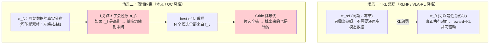

# 前置知识：行为约束策略优化——怎么把策略"拴"在数据分布附近

> **一句话**：所谓"约束策略/约束动作"，从来不是给动作数值加一个"上限下限"式的硬限制，而是在训练目标（loss）里加一项"惩罚新策略偏离数据分布"的东西。这一项能不能真正起作用，取决于你用什么样的网络去表示"数据分布长什么样"——如果网络表达力不够，约束就会在错误的目标上生效。

**前置概念**：
- [KL 散度与策略约束](/前置知识/000j_前置知识_KL散度与策略约束) — 本文默认你已经知道 KL 散度是什么、怎么算
- [离线强化学习基础](/前置知识/000s_前置知识_离线强化学习基础) — 本文是对其中"分布偏移/外推误差"问题的机制层展开

> **如果你是被"高斯策略和约束到底有什么关系"这个问题带到这篇文章的**：直接跳到第三节 3.3 小节，那里专门解开这个疑惑——KL 惩罚场景里的高斯和本文说的"高斯约束不了多模态"里的高斯，扮演的是两个完全不同的角色，结论并不矛盾。

---

## 贯穿全文的例子

> 一个机械臂在一张桌子中间放了一个障碍物（一根竖直的柱子），需要从左侧移动到右侧。人类操作员演示了 100 条轨迹：50 条从柱子**左边**绕过去，50 条从柱子**右边**绕过去（没有人会直接撞上柱子）。现在要训练一个策略，"贴着"这批数据的行为分布来行动——这个"贴着"具体怎么落实到训练目标里，就是本文要讲的全部内容。

---

## 一、"约束"到底约束的是什么

### 1.1 一个常见的误解

第一次听到"约束策略不要偏离数据太远"时，很容易联想到类似"把动作数值限制在 $[-1,1]$ 之间"这种硬性范围限制（比如用 `clip` 函数）。**这不是本文说的约束**。

这里说的约束，指的是：**策略网络的训练目标（loss function）里，包含了一项衡量"当前策略产生的动作，和数据里出现过的动作有多接近"的惩罚项**。策略在优化这个 loss 的过程中，会被这一项"拉"向数据分布，而不是被某个数值范围"卡"住。约束是通过**梯度**起作用的，不是通过**数值截断**起作用的。

### 1.2 为什么需要这种约束（简要回顾）

详细的动机在 [离线强化学习基础](/前置知识/000s_前置知识_离线强化学习基础) 第二节讲过：如果策略被允许自由地朝着"Critic 认为最好"的方向优化，很容易选中一个 Critic 因为**没有真实数据校准过**而错误高估的动作——这是**外推误差**。约束的目的就是不让策略跑到这种"数据没覆盖、Critic 说了不算"的区域。

### 1.3 三种具体的"拴住"机制

行为约束不是单一的一种写法，实践中常见三种，本文按由简到繁介绍：

| 机制 | 核心操作 | 典型代表 |
|------|---------|---------|
| ① 显式 KL 惩罚 | 直接在 loss 里加 $\beta \cdot D_{\text{KL}}$ 项 | RLHF、VLA-RL（见 [KL 散度前置知识](/前置知识/000j_前置知识_KL散度与策略约束) 第三节） |
| ② 加权回归（AWR 风格） | 让策略去模仿数据动作，但按 advantage 加权 | AWR、IQL（见 [离线 RL 前置知识](/前置知识/000s_前置知识_离线强化学习基础) 第 3.1、3.3 节） |
| ③ 蒸馏损失 | 训练一个网络先拟合数据分布，再让策略去模仿这个网络的输出 | [FQL](/前置知识/001p_前置知识_FQL_Flow_Q_Learning)、QC-FQL |

前两种在其他前置知识里已经讲过公式细节，本文重点补第三种——因为它和"策略的表达能力"这个问题绑得最紧，也是最容易在符号层面卡住的地方。

---

## 二、机制一和二的复习：约束怎么体现在 loss 里

### 2.1 显式 KL 惩罚：直接加一个距离项

$$
J(\theta) = \mathbb{E}_{\tau\sim\pi_\theta}[R(\tau)] - \beta\cdot D_{\text{KL}}(\pi_\theta \,\|\, \pi_{\text{ref}})
$$

这里"约束"体现得最直接：目标函数里明明白白写着"减去一个距离"，$\pi_\theta$ 离 $\pi_{\text{ref}}$ 越远，这一项就越大，目标函数就越小——梯度下降会主动避开这种情况。$\beta$ 越大，约束越"紧"。（完整推导见 [KL 散度前置知识](/前置知识/000j_前置知识_KL散度与策略约束) 第三节）

### 2.2 加权回归：把"约束"和"模仿"合并成一个损失

$$
\mathcal{L}_{\text{AWR}}(\theta) = -\mathbb{E}_{(s,a)\sim\mathcal{D}}\Big[\exp\big(A(s,a)/\beta\big)\cdot\log\pi_\theta(a|s)\Big]
$$

这里没有一个单独写出来的"距离项"，但约束是隐含在**训练数据的来源**里的：$(s,a)$ 永远是从数据集 $\mathcal{D}$ 里采样的，策略被训练成去**最大化数据里这些动作的对数概率**（加权模仿）。策略永远不会被鼓励去输出数据里没出现过的动作——这就是约束的效果，只是它不是通过一个"距离惩罚项"实现的，而是通过"损失函数的输入永远来自数据"这个结构性安排实现的。（完整推导见 [离线 RL 前置知识](/前置知识/000s_前置知识_离线强化学习基础) 第 3.1 节）

---

## 三、机制三：蒸馏损失——为什么需要"先学一个模型，再模仿这个模型"

### 3.1 一个新的问题：数据分布本身也需要"被学出来"

机制一需要知道 $\pi_{\text{ref}}$（比如 SFT 后的模型本身）；机制二可以直接从数据集里采样 $(s,a)$，用不上一个显式的"数据分布模型"。

但在很多离线 RL 场景里（尤其是本系列 [Q-Chunking](/论文综述/071_QChunking_RL与动作分块) 用到的场景），我们**没有**一个现成的 $\pi_{\text{ref}}$ 网络，只有一堆散落的数据 $(s,a)$ 记录。如果想知道"给定状态 $s$，数据里的行为分布长什么样"，唯一的办法是**先专门训练一个网络去拟合这个分布**——这个网络通常记作 $f_\xi$，用行为克隆（behavior cloning）的方式训练：

$$
\mathcal{L}_{\text{BC}}(\xi) = \mathbb{E}_{(s,a)\sim\mathcal{D}}\big[-\log f_\xi(a\mid s)\big]
$$

**为什么需要这个公式**：这就是最普通的极大似然行为克隆——让 $f_\xi$ 在数据出现过的 $(s,a)$ 上给出尽量高的概率。训练好之后，$f_\xi(\cdot\mid s)$ 就是我们对"数据里在状态 $s$ 下的行为分布 $\pi_\beta(\cdot\mid s)$"的一个近似。

**逐项拆解**：

| 符号 | 含义 |
|------|------|
| $f_\xi(a\mid s)$ | 一个专门训练来拟合数据分布的网络，$\xi$ 是它自己的参数 |
| $-\log f_\xi(a\mid s)$ | 负对数似然，这是标准的极大似然训练损失（最小化它 = 最大化 $f_\xi$ 给数据动作的概率）|
| $\mathbb{E}_{(s,a)\sim\mathcal{D}}$ | 在整个数据集上取平均 |

### 3.2 有了 $f_\xi$ 之后，怎么用它来约束另一个策略

如果我们还想训练一个**另外的**、专门用来"挑动作"的策略 $\pi_\psi$（比如为了追求推理速度，$\pi_\psi$ 是一个比 $f_\xi$ 便宜得多的单步网络），就可以用蒸馏损失让 $\pi_\psi$ 去模仿 $f_\xi$：

$$
\mathcal{L}_{\text{distill}}(\psi) = \mathbb{E}_{s\sim\mathcal{D}}\Big[\big\|\pi_\psi(s) - f_\xi(s)\big\|_2^2\Big] - Q\big(s,\pi_\psi(s)\big)
$$

**为什么需要这个公式**：第一项是"让 $\pi_\psi$ 输出的动作，尽量接近 $f_\xi$ 会输出的动作"——这就是约束（贴近数据分布）具体落实到损失函数里的样子；第二项是"同时也要让选出来的动作 $Q$ 值高"——这是 RL 想要优化的目标。两项加在一起，$\pi_\psi$ 既不会离数据太远，又会在数据允许的范围内偏向高价值的动作。

**这就回答了"高斯策略是怎么约束 action 的"这个问题**：如果 $\pi_\psi$（或者 $f_\xi$）被设计成输出一个高斯分布的均值 $\mu_\psi(s)$，那么上面这个 $\|\pi_\psi(s)-f_\xi(s)\|_2^2$ 这一项，具体算的就是"高斯均值和数据分布的某个代表值之间差多少"——约束不是限制动作的取值范围，而是限制**网络输出的这个均值**必须贴近数据。问题就出在这里：如果数据分布本身有两个分开的峰（比如从左边绕和从右边绕），单个高斯分布**只有一个均值**，这一项 loss 无论怎么优化，都不可能让一个单一的均值同时贴近两个分开的峰——接下来第四节详细展开这一点。

### 3.3 关键衔接："高斯策略"到底和"约束"有什么关系

读到这里，一个很自然的疑惑是：[KL 散度前置知识](/前置知识/000j_前置知识_KL散度与策略约束) 第 2.5.3 节明明白白地用高斯分布算了一遍 KL 约束，算得又干净又顺利——那为什么本文（以及 QC 论文）又说高斯策略"约束不了"多模态数据？这两处说的"高斯策略"，看起来在说同一个东西，结论却相反。这一节把这个看似矛盾的地方彻底讲清楚，是本文最关键的一节，务必看完。

#### 3.3.1 先把"约束机制"和"被约束的对象"这两件事分开

约束机制（KL 惩罚 / AWR / 蒸馏）本身只是一条**传送带**：它负责把某个网络的输出，往另一个目标分布上"拽"。传送带能不能正常运转（能不能算出一个数、能不能求梯度），跟传送带两端**具体挂的是什么形状的分布**，是两件独立的事——传送带本身不检查两端的分布对不对，它只负责拽。

真正决定"约束完了效果好不好"的，是传送带**终点**那个分布，有没有能力把"应该拉向哪里"这件事表示对。而这个终点，在不同的约束机制里，扮演的角色完全不同：

| 场景 | 约束机制 | 传送带拉向的终点 | 终点网络的任务 |
|------|---------|------------------|---------------|
| RLHF / VLA-RL（见 [KL 散度前置知识](/前置知识/000j_前置知识_KL散度与策略约束) 第三节） | KL 惩罚 | $\pi_{\text{ref}}$：**冻结的参考模型** | 只需要"保持不动、随时被查询"，不需要重新去表示原始示教数据里的多模态结构 |
| AWR / IQL（见 [离线 RL 前置知识](/前置知识/000s_前置知识_离线强化学习基础) 第 3.1 节） | 加权回归 | 数据集 $\mathcal{D}$ 本身（直接从里面采样） | 没有专门的网络去"代表"分布，直接从原始数据采样，天然不会丢失多模态信息 |
| QC（本文第三节） | 蒸馏损失 | $f_\xi$：**专门训练出来去拟合 $\pi_\beta$ 的网络** | 必须**从零学会重新表示**原始示教数据里的完整分布结构，包括可能存在的多个分离的模式 |

**这张表就是解开矛盾的关键**：KL 惩罚场景里的高斯，套在"冻结的参考模型"这个角色上——这个角色的工作是"待在原地不动，给个对比基准"，它本身是否单峰，跟"约束这个动作对不对"没有必然关系（$\pi_{\text{ref}}$ 单峰，$\pi_\theta$ 一样可以在别的 loss 项里学到别的东西）。而蒸馏约束场景（本文/QC）里的高斯，套在"重新学习原始多峰数据"这个角色上——这个角色**必须**把双峰真实还原出来，任务本身就要求表达力，单峰在这里是结构性地不够用，不是"凑巧不够用"。

#### 3.3.2 更进一步：QC 里 $f_\xi$ 不只是参照物，它就是动作的唯一来源

这里还有一层比"角色任务不同"更要命的区别，值得单独强调。

在 KL 惩罚场景里（前一小节表格第一行那个 RLHF / VLA-RL 场景），即使 $\pi_{\text{ref}}$ 是单峰的、没能还原原始数据的多模态结构，**真正执行动作的是 $\pi_\theta$**——$\pi_\theta$ 的输出由 reward 项和 KL 惩罚项**共同**决定，KL 惩罚只是其中一个拉力，$\pi_\theta$ 依然有自由度去学别的分布形状（如果 $\pi_\theta$ 本身也被限定成高斯，那是另一个独立的问题，但至少 KL 惩罚这个机制本身不是罪魁祸首）。

但在 QC 的 best-of-$N$ 流程里（回顾 [Q-Chunking 精读](/论文综述/071_QChunking_RL与动作分块) 第 4.2 节），**没有一个独立的 $\pi_\theta$ 去执行动作**——真正被执行的动作，就是从 $f_\xi$ 里采样出的 $N$ 个候选，再挑 Critic 打分最高的一个。也就是说：

$$
f_\xi \text{ 单峰坍缩} \;\Longrightarrow\; \text{全部 } N \text{ 个候选都挤在错误的中间点附近} \;\Longrightarrow\; \text{Critic 挑不出真正好的动作（矬子里拔将军）}
$$

这条链路上没有任何"补救环节"——不像 KL 惩罚那样还有另一个自由的 $\pi_\theta$ 兜底。$f_\xi$ 既是"被约束/被模仿的目标"，又是"动作的唯一生成源"，这两个身份在 QC 里合二为一了。这正是为什么 QC 论文（以及本文第四节）特别在意 $f_\xi$ 的表达能力，而 [KL 散度前置知识](/前置知识/000j_前置知识_KL散度与策略约束) 讨论 KL 惩罚时完全不需要操心这个问题。

#### 3.3.3 一图对比两种场景

**一句话总结这张图**：左边（KL 惩罚场景）的高斯只是"被拿来比较的静态标尺"，标尺歪一点不影响真正执行的策略；右边（蒸馏约束场景）的高斯是"唯一能生成动作的源头"，源头本身错了，后面无论怎么挑都救不回来。

---

## 四、策略的表达能力如何决定约束"约束到了哪里"

### 4.1 回到贯穿全文的例子：数值演示

回顾贯穿全文的场景：100 条演示轨迹，50 条绕柱子左边（对应动作大约是 $a=-2$），50 条绕柱子右边（对应动作大约是 $a=+2$，这里为了简化用一个标量表示"往左还是往右偏"）。

**先看第 3.1 节的行为克隆本身会学到什么**。如果 $f_\xi$ 被限定为单个高斯分布 $\mathcal{N}(\mu_\xi,\sigma_\xi^2)$，训练它去最大化这批数据的似然，等价于让 $\mu_\xi$ 去拟合数据的**均值**：

$$
\mu_\xi \;\approx\; \frac{1}{100}\left(50\times(-2) + 50\times(+2)\right) = 0
$$

训练收敛后，$f_\xi\approx\mathcal{N}(0,\sigma_\xi^2)$——一个以 $0$（也就是**正对着柱子**）为中心的分布。$\sigma_\xi$ 会被训练得比较大（因为要同时覆盖 $-2$ 和 $+2$ 两坨数据，方差自然会撑大），但**均值本身没有办法分裂成两个**。

**再看第 3.2 节蒸馏损失会发生什么**。假设 $\pi_\psi$ 输出的是一个确定性的单点动作 $\mu_\psi(s)$（比如 QC-FQL 里的单步策略），蒸馏损失的第一项 $\|\mu_\psi(s)-f_\xi(s)\|_2^2$ 会驱使 $\mu_\psi(s)$ 去逼近 $f_\xi$ 的输出——而 $f_\xi$ 本身的均值已经是 $0$ 了。于是 $\mu_\psi(s)\to 0$：**策略被"约束"去输出一个正对着柱子撞上去的动作**。

**这正是问题所在**：约束机制本身（蒸馏损失、KL 惩罚、加权回归）在数学上都是对的、都在认真地把 $\pi_\psi$ 拉向 $f_\xi$——但如果 $f_\xi$（用来代表"数据分布"的那个网络）本身因为表达能力不足，把两个峰错误地平均成了一个不存在的中间峰，那么**约束把策略拉向的，就是这个错误的中间峰**，而不是数据里真实出现过的、安全的左右两条路径。

约束机制没有错，出问题的是被约束的目标——单峰的高斯分布，从根本上无法表示"数据里其实有两种互不相容的合理选择"这件事。

### 4.2 更精确的表述：不是"约束失效"，是"约束的目标错了"

值得强调一个容易混淆的点：这不是说"高斯策略的约束比较弱、容易跑偏"，而是说**约束依然稳稳地生效了，只是它把策略约束到了一个错误的地方**——一个数据里从未出现过、且物理上不可行（撞柱子）的点。约束的"力度"完全没问题，问题出在被约束的目标（$f_\xi$ 或 $\pi_{\text{ref}}$ 的表示能力）上。

这也解释了为什么"用更有表达力的策略类"（比如 [Flow Matching](/前置知识/000g_前置知识_Flow_Matching与连续归一化流)）能解决这个问题——不是因为它的约束机制更"聪明"，而是因为它作为 $f_\xi$ 的候选网络，**能够正确地表示出数据里两个分开的峰**，让后续任何约束机制（KL、蒸馏、加权回归）都能拉向一个真实、正确的目标。

### 4.3 用 GMM 或 Flow 会发生什么：对比

| 策略类 | $f_\xi$ 能学到的分布 | 蒸馏出来的 $\mu_\psi(s)$ 会是 |
|--------|---------------------|------------------------------|
| 单个高斯 | 一个峰，落在数据均值处 | $\approx 0$（撞柱子） |
| 高斯混合（GMM，2 个分量） | 两个峰，分别在 $-2$ 和 $+2$ 附近 | 从两个峰里挑一个，比如 $\approx-2$ 或 $\approx+2$ |
| Flow Matching | 能任意逼近真实的双峰分布（见 [Flow Matching 前置知识](/前置知识/000g_前置知识_Flow_Matching与连续归一化流) 第三节） | 同上，正确地落在真实数据支撑的区域内 |

（GMM 的完整机制和 log-prob 计算见 [为什么扩散策略难以 RL 微调](/前置知识/000f_前置知识_为什么扩散策略难以RL微调) 第 1.3 节；这里不重复推导，只强调它同样能解决"单峰坍缩"问题，但 Flow Matching 在高维、连续、无需预设分量数的场景下更常被使用。）

### 4.4 为什么"分块"之后这个问题会变得更严重

上面的例子是单步动作（1 维标量）。如果把动作换成一整个 $h$ 步的**动作块**（比如"连续绕柱子走 5 步"这样一整段轨迹），行为数据里的多模态结构不会消失，反而更复杂——因为不仅"往左还是往右"是两个模式，"往左走的时候具体是先横移再前进、还是先前进再横移"这种时序细节也可能有多种模式，动作块的维度是单步的 $h$ 倍，模式的组合也随之增多。用单个高斯分布去覆盖这种更高维、更复杂的多模态分布，模式坍缩（mode collapse，即多个峰被平均成一个不存在的中间点）的问题只会更严重，绝不会自动缓解。

---

## 五、总结

| 概念 | 核心要点 |
|------|---------|
| "约束"的本质 | 不是数值范围限制，是训练损失里"拉向数据分布"的一项，靠梯度起作用 |
| 三种机制 | ① 显式 KL 惩罚 ② 加权回归（AWR）③ 蒸馏损失（先拟合 $f_\xi$，再模仿它） |
| 蒸馏损失的作用 | 让一个（通常更便宜、更快的）策略网络去模仿一个专门训练出来拟合数据分布的网络 |
| 表达能力的问题 | 如果 $f_\xi$（数据分布的代表网络）是单峰的（如高斯），多模态数据会被平均坍缩成一个错误的中间点 |
| 关键结论 | 约束机制本身没有错，错的是被约束、被模仿的目标表达能力不够——"拉得很准，但拉向了错的地方" |
| 解决方向 | 用表达力更强的策略类（GMM、Flow Matching 等）代表数据分布，让约束机制拉向真实存在的模式 |

---

## 延伸阅读

- [KL 散度与策略约束](/前置知识/000j_前置知识_KL散度与策略约束) — 机制一的完整数学细节
- [离线强化学习基础](/前置知识/000s_前置知识_离线强化学习基础) — 机制二（AWR/IQL）的完整推导，以及分布偏移问题的原始动机
- [为什么扩散策略难以 RL 微调](/前置知识/000f_前置知识_为什么扩散策略难以RL微调) — 高斯策略单峰缺陷的另一角度（策略梯度场景），以及 GMM 如何解决多模态
- [Flow Matching 与连续归一化流](/前置知识/000g_前置知识_Flow_Matching与连续归一化流) — 表达能力更强的策略类，是本文第四节问题的实际解法
- [Q-Chunking：用动作分块加速离线到在线 RL](/论文综述/071_QChunking_RL与动作分块) — 本文第四节讨论的"分块后问题更严重"的具体应用场景
