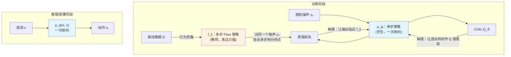
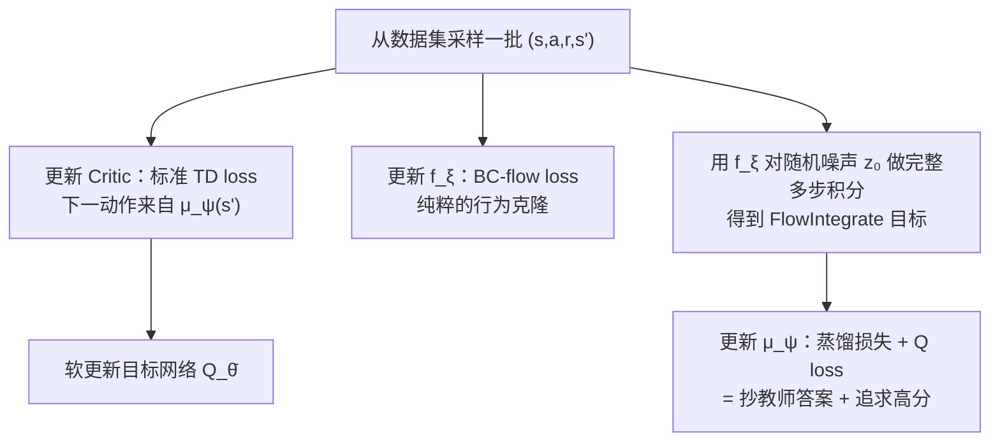

# 前置知识：FQL（Flow Q-Learning）——如何用表达力强的策略做 RL，却不用付出"多步生成"的代价

> **一句话**：FQL 训练两个策略网络分工合作——一个"教师"网络用完整的多步 Flow Matching 去老老实实地拟合数据分布（换取表达力），另一个"学生"网络只需一次前向就能输出动作（换取速度），学生通过**蒸馏**去模仿教师的输出，同时再用 Critic 把学生朝着高价值的方向"扭"一下。这样,最终真正被执行的策略又快又能表达复杂的多模态行为。

**前置概念**：
- [Flow Matching 与连续归一化流](/前置知识/000g_前置知识_Flow_Matching与连续归一化流) — 本文的"教师"网络就是一个标准的 Flow Matching 策略，务必先读
- [常微分方程 ODE——直觉与数值求解](/前置知识/001b_前置知识_常微分方程ODE直觉与数值求解) — Flow 策略的多步推理本质上是在数值求解一个 ODE
- [离线强化学习基础](/前置知识/000s_前置知识_离线强化学习基础) — 外推误差、行为约束等背景概念
- [行为约束策略优化](/前置知识/001l_前置知识_行为约束策略优化) — 蒸馏损失作为"约束机制"的通用讨论，本文是它的一个具体、完整的实例
- [知识蒸馏基础](/前置知识/000v_前置知识_知识蒸馏基础) — "教师-学生"范式的通用背景
- [Q 函数与 Value 函数](/前置知识/000o_前置知识_Q函数与Value函数) — Critic、TD Loss 的基础

---

## 贯穿全文的例子

> **场景**：一个机械臂需要从一堆混乱堆放的零件里抓取目标零件，放到传送带上。手头有一批离线数据 $\mathcal{D}$（人类遥操作录制的成功轨迹），动作 $a\in\mathbb{R}^2$（简化为末端在水平面内的位移增量,方便后面代入具体数字）。零件周围经常有障碍物，所以合理的抓取路径往往有"从左边绕过去"和"从右边绕过去"两种截然不同的走法——这是一个**多模态**行为分布的典型例子。目标是训练一个策略：既要能表达出这种"绕左/绕右"的多模态选择，又要能在机械臂实时控制（比如 20Hz）时来得及反应。

---

## 一、背景：表达力强的策略,为什么难以直接用 RL 训练

### 1.1 先回顾一下:为什么非要用表达力强的策略

如果直接用一个高斯策略去拟合上面这批"绕左/绕右"的数据，高斯分布只有一个均值，会把两个模式硬生生平均成一个"正对着障碍物"的中间点——这正是 [行为约束策略优化](/前置知识/001l_前置知识_行为约束策略优化) 第四节详细推演过的"模式坍缩"问题。要正确表达这种多模态分布，需要 [Flow Matching](/前置知识/000g_前置知识_Flow_Matching与连续归一化流) 这类生成式模型：给定观测 $s$，从一个高斯噪声 $\mathbf{z}_0$ 出发,沿着网络预测的向量场（velocity field）积分若干步，最终落点就是一个具体的动作样本。

### 1.2 新问题:RL 想要"调整"这个策略,但这个策略不是一次前向就能算完的

标准的 RL 策略优化（比如 DDPG、SAC 里的做法）需要计算这样一个梯度：

$$
\nabla_\psi \, Q\big(s,\pi_\psi(s)\big)
$$

**为什么需要这个量**：策略优化的目标是"让 Critic 觉得好的动作，被选中的概率更高"。要做到这一点，需要知道"如果我调整一下策略的参数 $\psi$，输出的动作会怎么变，进而 Critic 打的分会怎么变"——这就是 $Q$ 对 $\psi$ 的梯度，反向传播需要一路从 $Q$ 传回到 $\pi_\psi(s)$，再传回到 $\psi$。

如果 $\pi_\psi(s)$ 是一个高斯策略的均值网络，这条反向传播的链路很短——就是一次普通的前向/反向。**但如果 $\pi_\psi(s)$ 是一个 Flow（或 Diffusion）策略,情况完全不同**：动作 $a$ 不是网络一次前向就能吐出来的，而是要经过 $N$ 步 ODE 积分才能得到：

$$
\mathbf{x}_0 \to \mathbf{x}_{1/N} \to \mathbf{x}_{2/N} \to \cdots \to \mathbf{x}_{N/N} = a
$$

每一步都调用同一个网络 $v_\theta$。要算 $\nabla_\psi Q(s,a)$，就必须把反向传播**展开**（unroll）,一路穿过这 $N$ 次网络调用——这被称为**递归反向传播（recursive backpropagation）**。

### 1.3 递归反向传播为什么不稳定

**一句话直觉**：让梯度信号连续穿过 $N$ 次相同的网络调用，就像让一句话连续传 $N$ 次话——传的次数越多，信息失真（梯度爆炸或消失）的概率越大。

具体来说，$N$ 步 ODE 积分展开后，相当于一个深度为 $N$ 的"隐式深层网络"（哪怕原始的 $v_\theta$ 本身只有几层）。反向传播要连乘 $N$ 个雅可比矩阵：

$$
\frac{\partial a}{\partial \psi} = \frac{\partial \mathbf{x}_{N/N}}{\partial \mathbf{x}_{(N-1)/N}}\cdot\frac{\partial \mathbf{x}_{(N-1)/N}}{\partial \mathbf{x}_{(N-2)/N}}\cdots\frac{\partial \mathbf{x}_{1/N}}{\partial \psi}
$$

**逐项拆解**：

| 符号 | 含义 |
|------|------|
| $\mathbf{x}_{k/N}$ | ODE 积分到第 $k$ 步时的中间状态 |
| $\frac{\partial \mathbf{x}_{k/N}}{\partial \mathbf{x}_{(k-1)/N}}$ | 第 $k$ 步积分对上一步状态的雅可比矩阵，每一个都来自同一个网络 $v_\theta$ |
| 连乘 $N$ 项 | 链式法则要求把这 $N$ 个雅可比矩阵一个个乘起来 |

**整体理解，而不只是看每一项**：这个公式合起来说的是一件很朴素的事——"最终动作对策略参数的敏感度"，等于"沿着积分路径,每一步的敏感度逐级传递、连乘"的结果。矩阵连乘和数字连乘的性质类似：如果每个矩阵的"放大系数"略大于 1，连乘 $N$ 次后会指数级放大（梯度爆炸）；如果略小于 1，会指数级缩小到几乎为零（梯度消失）。$N$ 越大（Flow/Diffusion 的步数越多），这种放大或缩小的复合效应就越极端，训练就越容易失败或者要非常小心地调学习率、加梯度裁剪。这正是 DQL（Diffusion Q-Learning）等直接展开反传的方法在实践中出了名地难调、容易训练不稳定的根本原因——问题不出在某一步的雅可比矩阵本身，而出在"连乘 $N$ 次"这个结构性操作上。

**为什么是这个形式（即为什么反传一定要长这样）**：这不是某种可以随意更改的设计选择，而是链式法则的数学必然——只要动作是通过 $N$ 次迭代计算出来的，梯度就必须穿过这 $N$ 次迭代才能传回参数,没有绕过的办法（除非像 FQL 一样,从根本上避免对这条链路求梯度，这正是下一节要讲的思路）。

### 1.4 一张对比表：三类应对方案

| 方案 | 做法 | 问题 |
|------|------|------|
| 直接展开反传（如 DQL） | 对 $N$ 步 ODE/去噪链整体反传 | 训练不稳定（1.3 节的连乘问题），且训练时也要跑 $N$ 步（慢） |
| 只在推理时多步，训练时用别的目标（如 best-of-$N$，见 [Q-Chunking 精读](/论文综述/071_QChunking_RL与动作分块) 第 4.2 节的 QC） | 不训练一个显式的 $\pi_\psi$，靠"多采样再挑选"隐式实现策略 | 推理时仍需多次生成 + 多次打分，计算开销大 |
| **FQL：训练一个单独的单步策略，用蒸馏而不是用展开反传去优化它** | 本文要讲的方法 | 需要多训练一个网络，但训练/推理都稳定、快 |

FQL 选的是第三条路——这也是本文接下来要讲透的内容。

---

## 二、FQL 的核心思想：两个网络分工，谁也不用做"不擅长的事"

### 2.1 网络一：BC Flow 策略 $f_\xi$ —— 只负责"表达数据分布"，不负责被 RL 直接优化

这个网络的训练方式和标准 [Flow Matching](/前置知识/000g_前置知识_Flow_Matching与连续归一化流) 策略完全一样——用行为克隆（behavior cloning）的方式,让它去拟合数据里的动作分布 $\pi_\beta(a|s)$。它可以尽情地表达复杂的多模态分布，因为它**从来不需要被 RL 的梯度直接穿过**——它的损失函数里没有 Critic，训练目标纯粹是"生成的分布要像数据"。

### 2.2 网络二：单步策略 $\mu_\psi(s,\mathbf{z})$ —— 只负责"快速执行"，通过蒸馏学会表达力

这是真正会被部署、被执行的策略。它的结构极其简单——输入观测 $s$ 和一个噪声向量 $\mathbf{z}$，**一次前向传播**直接输出动作，不需要任何 ODE 积分。

**关键问题**：如果它只是一次前向的简单网络,凭什么能表达和 $f_\xi$（多步 Flow）一样复杂的多模态分布？

**答案是蒸馏**：不要求 $\mu_\psi$ 自己去学会"多模态是什么"，而是直接告诉它——"对于同一个初始噪声 $\mathbf{z}_0$，$f_\xi$ 经过 $N$ 步积分会落到哪里，你就应该直接跳到那个地方"。也就是说，$\mu_\psi$ 学的不是"数据分布长什么样"，而是"$f_\xi$ 这个多步过程的**捷径**"。因为 $f_\xi$ 已经能表达多模态（第一节的前提），$\mu_\psi$ 只要能精确模仿 $f_\xi$ 的每一次具体输出，自然也就继承了这种表达能力——只是不需要自己重新"发明"表达力，而是直接抄一个已经算好的答案。

### 2.3 两个网络怎么配合：完整流程图



**整体理解这张图**：训练时同时跑三件事——$f_\xi$ 安安静静地做行为克隆（不涉及 Critic，右上角灰色部分独立训练）；$\mu_\psi$ 一边被"拉向" $f_\xi$ 的输出（蒸馏损失），一边被 Critic "推向"更高价值的方向（Q loss）。推理/部署时，$f_\xi$ 完全不再需要——只留下又快又表达力足够的 $\mu_\psi$，一次前向就能出动作。这就是"训练时用重的、推理时用轻的"这个思路在 FQL 里的具体体现。

---

## 三、三个损失函数逐一拆解

### 3.1 BC Flow Loss：训练教师网络 $f_\xi$

$$
\mathcal{L}_{\text{BC-flow}}(\xi) = \mathbb{E}_{s\sim\mathcal{D},\,a_1\sim\mathcal{D}(\cdot|s),\,\mathbf{z}_0\sim\mathcal{N}(0,\mathbf{I}),\,t\sim U(0,1)}\Big[\big\|v_\xi(\mathbf{z}_t,t,s) - (a_1-\mathbf{z}_0)\big\|_2^2\Big],\quad \mathbf{z}_t=(1-t)\mathbf{z}_0+t\,a_1
$$

**为什么需要这个公式**：$f_\xi$ 的任务是学会"给定观测 $s$，数据里的动作大概长什么样"。这正是标准 Flow Matching 的训练目标（详见 [Flow Matching 前置知识](/前置知识/000g_前置知识_Flow_Matching与连续归一化流) 第三节）——没有任何 RL 相关的量出现在这个式子里，因为这个网络的唯一使命是"忠实还原数据分布"，不掺杂"哪个动作更好"这个判断。

> **一句话直觉**：让网络在"噪声到真实动作"这条直线路径上的每一个中间点，学会预测"下一步该往哪个方向走"。

**逐项拆解**：

| 符号 | 含义 | 直觉 |
|------|------|------|
| $a_1\sim\mathcal{D}(\cdot|s)$ | 数据里、状态 $s$ 下真实出现过的动作 | "教师要模仿的正确答案" |
| $\mathbf{z}_0\sim\mathcal{N}(0,\mathbf{I})$ | 起点噪声 | "这次生成从哪里出发" |
| $\mathbf{z}_t=(1-t)\mathbf{z}_0+t\,a_1$ | 噪声到真实动作的直线插值 | "路径上时刻 $t$ 所在的位置" |
| $v_\xi(\mathbf{z}_t,t,s)$ | 网络在这一点、这一时刻预测的速度 | "网络觉得接下来该往哪走" |
| $a_1-\mathbf{z}_0$ | 真实速度（起点到终点的直线方向） | "标准答案" |

**整体理解**：这个公式合起来做的事情是——不管 $t$ 取到路径上的哪一点，都要求网络在那一点给出的"方向感"和"一路直奔真实动作"这个方向保持一致。训练完之后，从任意噪声起点出发，沿着网络给出的方向一步步走，最终就会走到一个"看起来像数据里会出现的动作"的地方——因为训练数据里既有绕左的又有绕右的，$f_\xi$（只要网络容量足够、不像高斯那样被结构性限制成单峰）能够让不同起点的噪声分别走向不同的模式，从而完整保留数据的多模态结构。

**数值例子**：延续贯穿全文的抓取场景，简化到 $d=2$。假设某条数据轨迹的真实动作 $a_1=[3.0,\,5.0]$（往右前方移动去绕开障碍物），采样噪声 $\mathbf{z}_0=[-0.5,\,0.8]$，随机采样时间 $t=0.3$：

$$
\mathbf{z}_t = 0.7\times[-0.5,0.8] + 0.3\times[3.0,5.0] = [-0.35+0.9,\;0.56+1.5] = [0.55,\,2.06]
$$

真实速度 $= a_1-\mathbf{z}_0 = [3.5,\,4.2]$。假设网络在这一点给出的预测是 $v_\xi=[3.2,\,4.0]$，则这一个样本的 loss $=(3.5-3.2)^2+(4.2-4.0)^2=0.09+0.04=0.13$。训练就是持续把这类误差压低。

**为什么是这个形式**：用 MSE 回归"速度"而不是直接回归"动作"，是因为同一个位置 $\mathbf{z}_t$ 可能同时是"去往左边模式"和"去往右边模式"两条路径上的过渡点——用一条从当前噪声指向当前这个具体样本 $a_1$ 的直线速度作监督信号，训练信号是逐样本、逐路径明确的，网络学到的是"边际速度场"（对所有经过这一点的路径求期望），而不会强行把两个方向的目标平均成一个不存在的中间方向（详细推导见 [Flow Matching 前置知识](/前置知识/000g_前置知识_Flow_Matching与连续归一化流) 第 3.2 节的"边际向量场"）。

### 3.2 蒸馏损失（Distillation Loss）：训练学生网络去"抄" $f_\xi$ 的答案

$$
\mathcal{L}_{\text{distill}}(\psi) = \mathbb{E}_{s\sim\mathcal{D},\,\mathbf{z}_0\sim\mathcal{N}(0,\mathbf{I})}\Big[\big\|\mu_\psi(s,\mathbf{z}_0) - \text{FlowIntegrate}(f_\xi,s,\mathbf{z}_0)\big\|_2^2\Big]
$$

其中 $\text{FlowIntegrate}(f_\xi,s,\mathbf{z}_0)$ 表示：以 $\mathbf{z}_0$ 为起点，用 $f_\xi$ 跑完整的 $N$ 步 Euler 积分（第 1.2 节讲过的那个多步过程），得到的最终动作。

**为什么需要这个公式**：$\mu_\psi$ 要学会表达力，但又不能自己重新跑一遍"学习多模态分布"这个困难的过程（那样又会掉回第一节的高斯陷阱，或者又要引入多步生成）。这个公式给出的解决方案是——**直接让 $f_\xi$ 当一次"计算器"**：对于某个具体的噪声起点 $\mathbf{z}_0$，$f_\xi$ 会明确地积分出一个具体的、单一的落点（不是一个分布，是一个数），$\mu_\psi$ 只需要学会"看到这个 $\mathbf{z}_0$，就直接输出这个已经算好的落点"，把"多步搜索一个答案"简化成"记住这个答案"。

> **一句话直觉**：让单步网络学会"抄近道"——教师需要走 $N$ 步才能到达的地方，学生要学会一步跳过去。

**逐项拆解**：

| 符号 | 含义 | 直觉 |
|------|------|------|
| $\mathbf{z}_0\sim\mathcal{N}(0,\mathbf{I})$ | 起点噪声，**和输入 $\mu_\psi$ 的噪声是同一个** | "起点必须对齐，才能谈得上'抄近道到同一个终点'" |
| $\text{FlowIntegrate}(f_\xi,s,\mathbf{z}_0)$ | 教师网络从这个起点出发，完整跑完 $N$ 步 ODE 积分后的终点 | "教师给出的标准答案（已经过一步步计算，不再需要学生重新推导）" |
| $\mu_\psi(s,\mathbf{z}_0)$ | 学生网络对同一个起点、一次前向给出的输出 | "学生尝试直接猜到答案" |
| $\|\cdot\|_2^2$ | 两者的欧氏距离平方 | "猜的准不准" |

**整体理解，不能只看每个符号**：把这个公式作为一个整体来看，它其实是在做一件事——**给学生网络出了海量的"配对练习题"**：每道题的题目是 $(s,\mathbf{z}_0)$，标准答案是"教师沿着这个起点走 $N$ 步会到哪"。这个损失衡量的不是"学生的输出像不像数据"（那是 $f_\xi$ 自己训练时的任务），而是"学生的输出，和教师针对**这个具体起点**给出的答案差多少"。因为教师已经能表达多模态（不同的 $\mathbf{z}_0$ 会被引导去不同的模式），只要学生对每一个具体 $\mathbf{z}_0$ 都能精确复制教师的答案，学生输出的**整体分布**（对所有可能的 $\mathbf{z}_0$ 求期望）自然就和教师的整体分布一致——这正是"蒸馏"这个词的含义：不需要学生理解"为什么"，只需要学生记住"对每一道具体的题，答案是什么"。

**数值例子**：继续用抓取场景。设某个状态 $s$ 下，采样到噪声 $\mathbf{z}_0=[0.2,\,-0.3]$。假设 $f_\xi$ 从这个起点出发，用 $N=10$ 步 Euler 积分，一路走到 $\text{FlowIntegrate}(f_\xi,s,\mathbf{z}_0) = [2.1,\,3.4]$（恰好落在"绕左"这个模式附近，因为这个具体噪声起点被网络学到的向量场引向了这一侧）。学生网络 $\mu_\psi$ 直接用同样的 $(s,\mathbf{z}_0)$ 一次前向输出 $[1.9,\,3.6]$：

$$
\mathcal{L}_{\text{distill}} = (2.1-1.9)^2 + (3.4-3.6)^2 = 0.04+0.04=0.08
$$

训练把这类误差不断压低,学生最终会学到"看到这个 $\mathbf{z}_0$，就该输出接近 $[2.1,3.4]$ 的动作"——而对于另一个恰好被引向"绕右"模式的噪声 $\mathbf{z}_0'$，学生会学到输出另一个完全不同的落点。这样一来,学生虽然只需一次前向，却能像教师一样,针对不同的噪声输入给出分别落在两个模式里的答案——多模态被完整保留了下来。

**为什么是这个形式（为什么不直接让学生去拟合数据，而要多此一举先训练一个教师）**：如果直接让单步网络 $\mu_\psi(s,\mathbf{z}_0)$ 去对数据做行为克隆（类似第 3.1 节但只有一次前向），本质上和用高斯拟合多模态数据是同一类问题——单次前向、无迭代结构的网络在表达任意复杂分布上先天受限（这也是为什么本身"表达力强的策略"几乎都依赖迭代式生成，如扩散/流模型)。而通过先训练一个允许迭代的 $f_\xi$（表达力有保证），再让学生去蒸馏"针对具体噪声输入的具体输出"（这是一个更简单的**回归**问题，不是"学会生成任意分布"这个更难的问题），学生就绕开了"一次前向直接学会多模态"这个结构性困难，转而只需要学会"记住并复现一个已经算好的映射关系"。

### 3.3 Q Loss：让学生网络同时追求高价值

$$
\mathcal{L}_Q(\psi) = -\mathbb{E}_{s\sim\mathcal{D},\,\mathbf{z}_0\sim\mathcal{N}(0,\mathbf{I})}\Big[Q_\theta\big(s,\,\mu_\psi(s,\mathbf{z}_0)\big)\Big]
$$

**为什么需要这个公式**：只做蒸馏的话，$\mu_\psi$ 最多做到"和数据里的行为一样好"，但数据里的行为不一定是最优的（比如遥操作员某次绕路绕远了）。这一项让学生网络在蒸馏给出的"合理范围"内，进一步偏向 Critic 认为更好的那些动作。

> **一句话直觉**：在教师认为"合理"的动作里，尽量挑更高分的那个方向去调整。

**逐项拆解**：

| 符号 | 含义 | 直觉 |
|------|------|------|
| $\mu_\psi(s,\mathbf{z}_0)$ | 学生网络当前输出的动作 | "现在会执行的动作" |
| $Q_\theta(s,\cdot)$ | Critic 对这个动作的打分 | "这个动作值多少分" |
| 负号 | 要最大化 $Q$，等价于最小化 $-Q$ | "梯度下降框架里，最大化问题写成最小化负值" |

**整体理解**：这一项和 3.2 节的蒸馏损失，**在同一个 $\mu_\psi(s,\mathbf{z}_0)$ 输出上同时施加了两个方向的拉力**——蒸馏损失把它拉向"教师认为合理的地方"，Q loss 把它推向"Critic 认为价值更高的地方"。单独看 Q loss 这一项，如果没有蒸馏损失来约束，$\mu_\psi$ 会毫无顾忌地朝着 Critic 给分最高的方向跑，很可能跑到数据完全没覆盖过的区域，遇上第一节铺垫过的外推误差陷阱；但因为蒸馏损失一直在拉着它贴近教师的输出，两者合力之下，$\mu_\psi$ 只能在"教师给出的、看起来合理的动作附近"做小幅调整，去追求更高的价值——这正是行为约束的作用方式（详见 [行为约束策略优化](/前置知识/001l_前置知识_行为约束策略优化) 第三节对"约束不是数值裁剪，而是 loss 里的拉力"的完整讨论）。

### 3.4 合并成完整的 Actor Loss

$$
\mathcal{L}_{\text{actor}}(\xi,\psi) = \mathcal{L}_{\text{BC-flow}}(\xi) + \alpha\cdot\mathcal{L}_{\text{distill}}(\psi) + \mathcal{L}_Q(\psi)
$$

**为什么需要这个公式**：三项各自负责一件事（教师学表达、学生学模仿、学生追价值），合并成一个总损失是为了能用同一次反向传播同时更新 $\xi$ 和 $\psi$ 两组参数（虽然 $\mathcal{L}_{\text{BC-flow}}$ 只影响 $\xi$，后两项只影响 $\psi$，但工程实现上一起算、一起 `backward()` 更省事）。

> **一句话直觉**：三个目标各管一段——"教师练好表达力"、"学生抄好教师的答案"、"学生在抄的基础上再往高分的方向偏一偏"，三者的梯度分别流向各自负责的那部分参数，互不冲突。

**逐项拆解**：

| 符号 | 含义 | 直觉 |
|------|------|------|
| $\mathcal{L}_{\text{BC-flow}}(\xi)$ | 只更新教师参数 $\xi$ | "教师自己练自己的" |
| $\alpha\cdot\mathcal{L}_{\text{distill}}(\psi)$ | 更新学生参数 $\psi$，权重为 $\alpha$ | "学生模仿教师的力度" |
| $\mathcal{L}_Q(\psi)$ | 更新学生参数 $\psi$ | "学生追求高价值的力度" |
| $\alpha$ | 唯一需要手动调的关键超参数 | "模仿 vs 追求高分，哪个权重更大" |

**整体理解**：把三项加在一起看，真正存在"权衡"的只有蒸馏损失和 Q loss 这两项之间的相对权重 $\alpha$（BC-flow 损失是独立训练教师，不存在权衡）。$\alpha$ 越大，学生被拉向教师输出的力度越强，行为越保守、越贴近数据（但可能不够"聪明"）；$\alpha$ 越小，Q loss 的话语权越大，学生越敢于偏离教师、追逐高分（但风险是滑向数据没覆盖过的外推误差区域）。**为什么是这个形式（为什么用加权和，而不是比如取 min 或者分阶段训练）**：加权和是最简单直接的多目标优化写法，且允许连续调节 $\alpha$ 在"保守"和"激进"之间平滑过渡，方便针对不同任务、不同数据质量做超参数搜索（第七节会展开实践经验）。

---

## 四、Critic 的训练：标准 TD Loss，但下一状态动作来自学生网络

$$
\mathcal{L}_{\text{critic}}(\theta) = \mathbb{E}_{(s,a,r,s')\sim\mathcal{D}}\Big[\big(Q_\theta(s,a) - r - \gamma\, Q_{\bar\theta}\big(s',\mu_\psi(s',\mathbf{z}_0')\big)\big)^2\Big],\quad \mathbf{z}_0'\sim\mathcal{N}(0,\mathbf{I})
$$

**为什么需要这个公式**：这是最普通的一步 TD Loss（详见 [Q 函数前置知识](/前置知识/000o_前置知识_Q函数与Value函数)），唯一需要说明的地方是——bootstrap 项里"下一步会采取的动作"，用的是**学生网络** $\mu_\psi$ 在下一状态 $s'$ 的输出（重新采样一个噪声 $\mathbf{z}_0'$，一次前向即可），而不是教师网络。

> **一句话直觉**：Critic 要评估的是"如果照当前会被真正执行的策略走下去，还能拿多少分"——而"当前会被真正执行的策略"就是学生网络，教师从不参与执行,自然不该出现在这里。

**整体理解**：这个公式和标准 TD Loss 唯一的区别，就在于 bootstrap 用的 $a'$ 来自 $\mu_\psi$（一次前向，快）而不是某个多步生成的策略——这正是 FQL 全篇设计的一个直接后果：因为真正执行、真正需要被"询问下一步怎么走"的策略只有 $\mu_\psi$，Critic 训练的每一步都不需要跑一次昂贵的多步 ODE 积分，训练速度和标准 DDPG/TD3 相当。

---

## 五、完整训练循环

结合前四节的三个 Actor 损失和一个 Critic 损失，FQL 每一轮训练大致是这样的顺序（工程实现上通常把 Actor 的三项损失一次性算完再反传，这里为了讲清楚拆开写）：



**整体理解这张图**：每一轮更新里，四个网络（$Q_\theta$、$f_\xi$、$\mu_\psi$，加上 $Q_\theta$ 的目标网络拷贝）各自朝着自己的目标前进，彼此通过"学生网络的输出既要像教师、又要让 Critic 满意"这一条线联系起来。$f_\xi$ 的训练完全独立，不受 Critic 影响；$Q_\theta$ 的训练只依赖 $\mu_\psi$ 当前的输出（而不是 $f_\xi$）；只有 $\mu_\psi$ 同时接收两路梯度。

---

## 六、代码实现：从公式到可运行的样子

上面推导的三个 Actor 损失，落到代码里，核心逻辑并不复杂——用 PyTorch 风格伪代码写出来（原始实现是 JAX，这里为了通用性用等价的 PyTorch 语义描述，变量名对应前面推导的符号）：

首先是教师网络的行为克隆损失，对应第 3.1 节的公式。核心思路是：随机取一个时间点 $t$，在噪声和真实动作的连线上插值出一个中间点，让网络预测"这一点该往哪走"：

```python
def bc_flow_loss(f_xi, obs, actions):
    batch_size, action_dim = actions.shape
    z0 = torch.randn(batch_size, action_dim)          # 起点噪声
    a1 = actions                                       # 数据里真实的动作
    t = torch.rand(batch_size, 1)                       # 随机时间点 t ∈ [0,1]
    zt = (1 - t) * z0 + t * a1                          # 插值中间点
    true_velocity = a1 - z0                             # 真实速度（直线方向）
    pred_velocity = f_xi(obs, zt, t)                     # 网络预测的速度
    return ((pred_velocity - true_velocity) ** 2).mean()
```

有了训练好的（或者正在训练中的）$f_\xi$，接下来要计算"教师对某个具体噪声起点会给出什么答案"——也就是第 3.2 节公式里的 $\text{FlowIntegrate}$，这一步需要真正跑完整的多步 Euler 积分：

```python
def flow_integrate(f_xi, obs, z0, num_steps=10):
    x = z0
    for i in range(num_steps):
        t = torch.full((x.shape[0], 1), i / num_steps)
        velocity = f_xi(obs, x, t)
        x = x + velocity / num_steps   # Euler 法：沿速度方向走一小步
    return x   # 走完 N 步之后的终点，就是教师给出的"标准答案"
```

**这里有一个容易忽略但很关键的细节**：`flow_integrate` 这个函数在训练循环里只用来生成蒸馏的"标准答案"，不参与任何反向传播（对应下面梯度更新时会加 `.detach()` 或 `no_grad()`）——因为蒸馏损失要学的是"逼近这个已经算出来的具体数值"，不需要，也不应该让梯度穿过这 $N$ 步积分反传回 $f_\xi$（那样又会掉回第一节说的"递归反向传播不稳定"的老问题）。

有了教师的标准答案之后，学生网络的损失就是蒸馏损失加 Q loss，两者合起来更新 $\mu_\psi$：

```python
def student_loss(mu_psi, f_xi, critic, obs, alpha):
    batch_size, action_dim = obs.shape[0], mu_psi.action_dim
    z0 = torch.randn(batch_size, action_dim)

    # 教师给出的标准答案，明确切断梯度——学生只需要"抄"，不需要"教"教师
    with torch.no_grad():
        target_action = flow_integrate(f_xi, obs, z0)

    student_action = mu_psi(obs, z0)                      # 学生一次前向的输出
    distill_loss = ((student_action - target_action) ** 2).mean()

    q_value = critic(obs, student_action)                  # Critic 给学生的输出打分
    q_loss = -q_value.mean()

    return distill_loss * alpha + q_loss
```

**代码里值得注意的两个细节**：一是 `target_action` 用 `torch.no_grad()` 包裹，呼应上一段的解释；二是 `student_action` 这同一个变量同时被送进 `distill_loss` 和 `q_value` 的计算——这正是第 3.3 节强调的"两个损失在同一个输出上同时施加两个方向的拉力"在代码层面的直接体现：反向传播时，这一个输出会同时收到"贴近教师"和"追求高分"两路梯度，叠加后共同决定 $\mu_\psi$ 的更新方向。

最后，训练一步的完整流程,把 Critic 更新和 Actor 更新拼在一起：

```python
def train_step(batch, f_xi, mu_psi, critic, target_critic, alpha, gamma):
    # 1. Critic 更新：标准 TD loss，下一动作来自学生网络
    with torch.no_grad():
        z0_next = torch.randn(batch.next_obs.shape[0], mu_psi.action_dim)
        next_action = mu_psi(batch.next_obs, z0_next)
        target_q = batch.reward + gamma * target_critic(batch.next_obs, next_action)
    q = critic(batch.obs, batch.action)
    critic_loss = ((q - target_q) ** 2).mean()

    # 2. 教师网络更新：纯粹的行为克隆
    teacher_loss = bc_flow_loss(f_xi, batch.obs, batch.action)

    # 3. 学生网络更新：蒸馏 + Q loss
    actor_loss = student_loss(mu_psi, f_xi, critic, batch.obs, alpha)

    total_loss = critic_loss + teacher_loss + actor_loss
    total_loss.backward()   # 一次反传，三组参数各自收到自己那部分梯度
```

**为什么可以把三个损失加在一起统一反传**：因为三个损失分别只依赖各自负责的那组参数（`critic_loss` 只经过 `critic`，`teacher_loss` 只经过 `f_xi`，`actor_loss` 只经过 `mu_psi`），反向传播时梯度不会"串门"——各自的参数只会收到自己那部分损失产生的梯度，工程上合并成一次 `backward()` 只是节省代码，数学上等价于分开算三次。

---

## 七、为什么这个设计有效：和其他方案的对比

| 方案 | 训练时是否要展开多步反传 | 推理时是否要多步生成 | 表达力 |
|------|------------------------|---------------------|--------|
| 直接用高斯策略 + RL | 否（一次前向） | 否（一次前向） | 差（单峰） |
| DQL 等直接展开反传的 Diffusion/Flow RL | **是**（1.3 节的不稳定问题） | 是（$N$ 步） | 强 |
| IDQL / 隐式策略（如 best-of-$N$ 采样，见 [Q-Chunking 精读](/论文综述/071_QChunking_RL与动作分块) 第 4.2 节的 QC） | 否 | 是（需要采样 $N$ 个候选 + 多步生成每个候选） | 强 |
| **FQL** | 否（蒸馏损失只需要一次 `no_grad` 的多步前向生成目标，不反传） | **否**（学生网络一次前向） | 强（继承自教师） |

**整体理解这张表**：FQL 之所以能同时做到"不展开反传"和"推理快"，关键就在于它把"表达力"和"速度"这两个需求，分给了两个不同的网络分别满足，而不是要求同一个网络同时具备两种能力。教师网络 $f_\xi$ 只在训练时使用（且只用来生成蒸馏目标，不参与反传），推理阶段完全丢弃；学生网络 $\mu_\psi$ 全程只需要一次前向，天生就快。这是一种"训练时用重模型换表达力，部署时用轻模型换速度"的经典分工思路，和知识蒸馏（详见 [知识蒸馏基础](/前置知识/000v_前置知识_知识蒸馏基础)）在图像分类里的动机是同一类思想，只是这里教师和学生蒸馏的不是"分类概率"，而是"给定同一个噪声起点应该落到哪个具体动作"。

---

## 八、实践要点

### 8.1 最重要的超参数：$\alpha$

$\alpha$ 控制"贴近数据"和"追求高价值"之间的平衡，需要针对每个任务单独调。经验上：

- $\alpha$ 太小：学生几乎不受蒸馏损失约束，容易被 Critic 带偏到数据没覆盖过的动作（外推误差）
- $\alpha$ 太大：学生几乎完全模仿教师，退化成纯行为克隆，RL 提升有限

### 8.2 一个实用技巧：归一化 Q loss

因为 $Q$ 值的绝对大小会随环境、奖励尺度剧烈变化，直接用固定的 $\alpha$ 去平衡"尺度不定的 $Q$ 值"和"尺度稳定的蒸馏 MSE"会很难调。一个常见做法是把 Q loss 除以当前 batch 里 $|Q|$ 的均值（并且这个归一化系数本身不参与反传），让 $\alpha$ 的含义变成"蒸馏损失和（归一化后的）Q loss 的相对权重"，跨环境更容易迁移同一组 $\alpha$。

### 8.3 教师网络的积分步数 $N$

教师网络 $f_\xi$ 用于生成蒸馏目标时的积分步数（比如 10 步），只影响训练时"生成目标答案"这一步的计算开销，不影响推理速度（推理阶段教师完全不参与）。步数太少可能导致 ODE 积分误差较大，蒸馏目标本身不准；步数太多则拖慢训练（但仍远比"每次推理都要多步生成"的方案划算，因为推理频率通常远高于训练更新频率）。

---

## 九、总结

| 维度 | 内容 |
|------|------|
| 核心问题 | 表达力强的策略（Flow/Diffusion）动作生成是多步迭代的，直接用 RL 梯度展开反传这 N 步会不稳定 |
| 核心方案 | 训练两个网络分工：教师 $f_\xi$（多步、专注表达力，只做行为克隆）+ 学生 $\mu_\psi$（一次前向，真正执行） |
| 连接两者的机制 | 蒸馏损失——对同一个噪声起点，让学生的一次前向输出逼近教师多步积分的终点 |
| 让学生更聪明的机制 | Q loss——在蒸馏约束的范围内，进一步偏向 Critic 认为更好的动作 |
| Critic 训练 | 标准 TD loss，bootstrap 用的下一动作来自学生网络（真正会被执行的策略） |
| 关键超参数 | $\alpha$（蒸馏 vs 追求高价值的权衡），需要按任务调 |
| 本质思想 | 把"表达力"和"速度"这两个矛盾的需求，拆给两个网络分别满足，用蒸馏把前者的能力转移给后者 |

---

## 延伸阅读

- [Flow Matching 与连续归一化流](/前置知识/000g_前置知识_Flow_Matching与连续归一化流) — 教师网络 $f_\xi$ 的完整训练/推理机制
- [行为约束策略优化](/前置知识/001l_前置知识_行为约束策略优化) — 蒸馏损失作为"约束机制"的通用讨论
- [知识蒸馏基础](/前置知识/000v_前置知识_知识蒸馏基础) — "教师-学生"范式的通用背景
- [Q-Chunking：用动作分块加速离线到在线 RL](/论文综述/071_QChunking_RL与动作分块) — 第 4.3 节的 QC-FQL 把本文的 FQL 方法叠加到动作分块场景，把动作换成"一整段 h 步动作块"，是本文方法的一个具体应用
- Park, Li, Levine, "Flow Q-Learning", arXiv:2502.02538, 2025
